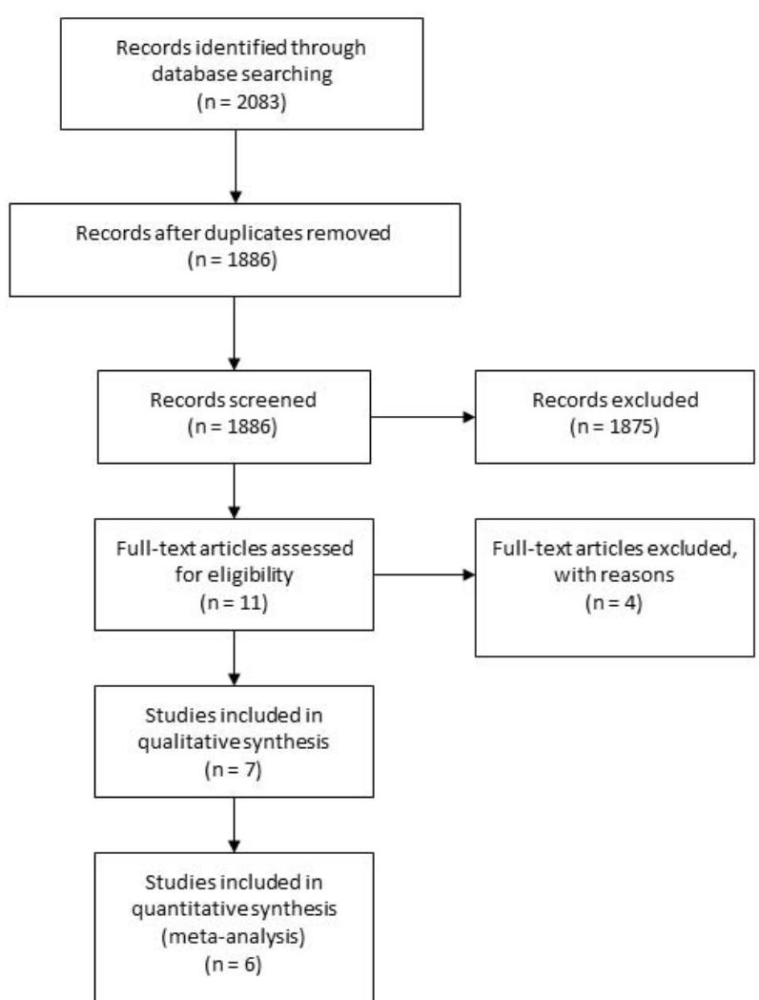
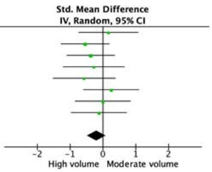
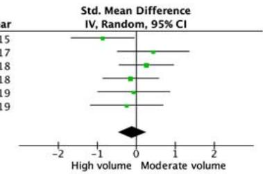
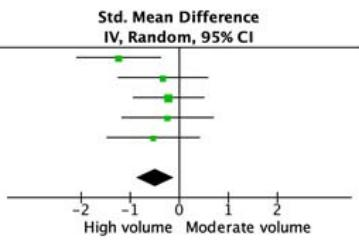

# A Systematic Review of the Effects of Different Resistance Training Volumes on Muscle Hypertrophy

by Eneko Baz-Valle1, Carlos Balsalobre-Fernández2, Carlos Alix-Fages2, Jordan Santos-Concejero1

The main goal of this study was to compare responses to moderate and high training volumes aimed at inducing muscle hypertrophy. A literature search on 3 databases (Pubmed, Scopus and Chocrane Library) was conducted in January 2021. After analyzing 2083 resultant articles, studies were included if they met the following inclusion criteria: a) studies were randomized controlled trials (with the number of sets explicitly reported), b) interventions lasted at least six weeks, c) participants had a minimum of one year of resistance training experience, d) participants' age ranged from 18 to 35 years, e) studies reported direct measurements of muscle thickness and/or the cross-sectional area, and f) studies were published in peer-review journals. Seven studies met the inclusion criteria and were included in the qualitative analysis, whereas just six were included in the quantitative analysis. All participants were divided into three groups: "low" (<12 weekly sets), "moderate" (12-20 weekly sets) and "high" volume (>20 weekly sets). According to the results of this meta-analysis, there were no differences between moderate and high training volume responses for the quadriceps ($p = 0.19$) and the biceps brachii ($p = 0.59$). However, it appears that a high training volume is better to induce muscle mass gains in the triceps brachii ($p = 0.01$). According to the results of this review, a range of 12-20 weekly sets per muscle group may be an optimum standard recommendation for increasing muscle hypertrophy in young, trained men.

Key words: strength, muscle mass, resistance training, muscle gains, training variables.

1 - Department of Physical Education and Sport, University of the Basque Country UPV/EHU, Vitoria-Gasteiz, Spain.
2 - Applied Biomechanics and Sports Technology research group, Autonomous University of Madrid, Spain.

## Introduction

Mechanical tension is one of the main mechanisms inducing muscle hypertrophy by leading to signal transduction and increasing muscle protein synthesis (MPS) (Olsen et al., 2019; Wackerhage et al., 2018). In order to generate an optimal stimulus, several variables can be manipulated, being training volume, time under tension (TUT), frequency, load (generally expressed as percentages of the 1-repetition maximum) or proximity to muscle failure which is the most widely used (Bird et al., 2005). Proximity to failure is essential to achieve an optimal stimulus for muscle hypertrophy, regardless of the repetition range used, due to an increase in the recruitment of motor units (MUs) and their fatigue (Dankel et al., 2017; Morton et al., 2019). This proximity to failure could be managed by increasing the number of repetitions or by increasing the TUT within the same number of repetitions (Wilk et al., 2020). However, as long as the level of effort is high, training volume seems to be the most important variable (Schoenfeld et al., 2017). Therefore, when muscle hypertrophy is the main goal, training volume can be quantified as the number of sets per muscle group which are close to failure (Baz-Valle et al., 2018), namely, "hard sets".

From an acute physiological standpoint, there is evidence suggesting a dose-response relationship between training volume and phosphorylation of proteins related to MPS (Gerasimos Terzis et al., 2010), or directly an increase in MPS (Burd et al., 2010). Interestingly, a recent study found greater responses in ribosomal biogenesis after an intervention of moderate training volume vs. low training volume (Hammarström et al., 2020). Ribosomal biogenesis, understood as ribosomal capacity, has been linked to long-term muscle mass gains along with ribosomal efficiency, since they are important physiological adaptations (Figueiredo, 2019). Moreover, this dose-response relationship has also been verified in longitudinal studies as a chronic response (Schoenfeld et al., 2019a), with a systematic review and meta-analysis (Schoenfeld et al., 2017) confirming these findings, with favorable results when performing over nine weekly sets per muscle group.

Over the last few years, training volume for muscle hypertrophy has received a lot of attention (Aube et al., 2020; Brigatto et al., 2019; Heaselgrave et al., 2019). Some studies support the dose-response hypothesis (Brigatto et al., 2019), while others propose an inverted "U" relationship between training volume and muscle mass gains (Heaselgrave et al., 2019). It is against this apparently contradictory background that this review intends to compare exclusively the response to moderate vs. high training volumes, in studies as homogeneous as possible, which include young trained men, and in which direct muscular hypertrophy measurements were taken. We hypothesized that the dose-response relationship would be minimal when comparing moderate and high training volumes.

## Methods

### Study design

A literature search of 3 databases was conducted in January, 2021. The following databases were searched: PubMed, Scopus and Cochrane Library. Databases were searched from inception up to January 2021, with no language limitation. Citations from scientific conferences were excluded.

### Search strategy

The literature search was conducted in accordance with the Preferred Reporting Items for Systematic Reviews and Meta-analyses (PRISMA) guidelines. In each database, the title, abstract, and keywords search fields were searched. The following keywords, combined with Boolean operators (AND/OR) were used: "resistance training" AND Muscles AND hypertrophy OR "muscle thickness" AND volume. "Muscles" and "hypertrophy" were MeSH terms. No additional filters or search limitations were used. After conducting the initial search, the reference lists of articles retrieved were then screened for any additional articles which had relevance to the topic.

### Eligibility criteria

Studies were eligible for further analysis if the following inclusion criteria were met: a) studies were randomized controlled trials comparing different groups with a different number of sets explicitly reported, with the same load assignment (%1-repetition maximum or XRM) and without the use of external implements (i.e., pressure cuffs, hypoxic chamber, etc.), b) interventions lasted at least six weeks, c) participants had a minimum of one year of resistance training experience, d) participants' age ranged from 18 to 35 years, e) studies reported direct measurements of muscle thickness and/or the cross-sectional area, f) studies were published in peer-review journals.

Two independent observers reviewed the studies and then individually decided whether inclusion was appropriate. In the event of disagreement, a third observer was consulted. A flow chart of the search strategy and study selection is shown in Figure 1.

### Study quality

Oxford's level of evidence (OCEBM Levels of Evidence Working Group et al., 2011) and the Physiotherapy Evidence Database (PEDro) scale (de Morton, 2009) were used by two independent observers to assess the methodological quality of the studies included in the systematic review. Oxford's level of evidence ranges from 1a to 5, with 1a being systematic reviews of high-quality randomized controlled trials and 5 being expert opinions. The PEDro scale consists of 11 different items related to scientific rigor. Given that the assessors are rarely blinded, and that it is hard to blind participants and investigators in supervised exercise interventions, items 5–7, which are specific to blinding, were removed from the scale (Baz-Valle et al., 2018). With the removal of these items, the maximum result on the modified PEDro 8-point scale was 7 (the first item was not included in the total score) and the lowest, 0. Zero points were awarded to a study that failed to satisfy any of the included items, and 7 pointed to a study that satisfied all the included items.

### Included studies for qualitative and quantitative synthesis

In the present systematic review, seven studies met the inclusion criteria, in which low volume groups were included (<12 sets per week) descriptively in the qualitative synthesis, along with moderate (12-20 sets) and high training volume (>20 sets) groups. The main goal of this systematic review with meta-analysis was to compare moderate training volume vs. high training volume. Thus, six studies were included in the meta-analysis: those which included participants performing more than 12 weekly sets per muscle group, in order to compare moderate volumes (12-20 sets) vs. high volumes (>20 sets). Low volume groups (<12 sets) were excluded from the quantitative analysis.

### Statistical analysis

Training interventions were classified as "high volume" (HV) if they included more than 20 weekly sets per muscle group, and as "moderate volume" (MV) otherwise. Groups in MV performed between 12 and 20 sets per muscle group in the included studies. Standardized mean difference (SMD) with 95% confidence intervals (CIs) between MV and HV regimens were calculated with RevMan 5.4 for macOS using the random effects model. Mean and SDs for the outcome measures were directly obtained from the original studies. The significance for an overall effect was set at $p < 0.05$. Heterogeneity of the analyzed studies was assessed using an I-squared test, setting the significance level at $p < 0.01$. The effects of each regimen (i.e., MV or HV interventions) were qualitatively assessed using the following threshold values for the SMD: 0.25, trivial; 0.25–0.50, small; 0.50–1.0, moderate; and >1.0, large. In some studies, more than one analysis was carried out because they included several groups performing HV (+20 weekly sets) (Brigatto et al., 2019), and/or performed different measurements to explore muscle changes in the case of quadriceps femoris (Aube et al., 2020). Three different analysis (one per muscle group) were performed to compare the effects of MV vs. HV in the different measurements. The first analysis explored effects of MV and HV in the quadriceps femoris muscle (including measurements of vastus lateralis, rectus femoris, and anterior thigh), while the second and the third analysis explored these effects in biceps brachii and triceps brachii muscle, respectively.

## Results

### Study selection

The search strategy yielded 2083 studies as presented in Figure 1. After removing 197 duplicates, and 1875 studies in the screening, 11 studies were determined to be potentially relevant to the topic based on the information contained in the abstract, from which only seven studies met the inclusion criteria. Excluded studies had at least one of the following characteristics: a) participants did not have enough training experience or had left their training programs long time ago and/or, b) there was only one training group, c) training sets were the same in each group, or d) the study was retracted from the journal (Figure 1). One study (Radaelli et al., 2015) did not meet the inclusion criteria because participants had insufficient specific training experience. Despite this, after analyzing the study (Radaelli et al., 2015) we realized that participants were trained in calisthenics and lifted their body weight performing 5RM in the bench press exercise, which suggested that they had a sufficient training level. Taking all data into account, all researchers agreed to include this study into the present systematic review with meta-analysis.

Finally, a total of seven studies which comprised 19 intervention groups, were included (Table 2). In the meta-analysis a total of six studies and 14 intervention groups were included. In all studies direct measurements were taken with ultrasounds (muscle thickness) and results were divided by measurements.

> **[Figure 1]** Flow diagram of the literature search.

The flow diagram reports: Records identified through database searching (n = 2083) → Records after duplicates removed (n = 1886) → Records screened (n = 1886), Records excluded (n = 1875) → Full-text articles assessed for eligibility (n = 11), Full-text articles excluded, with reasons (n = 4) → Studies included in qualitative synthesis (n = 7) → Studies included in quantitative synthesis (meta-analysis) (n = 6). Stages labelled (top to bottom): Identification, Screening, Eligibility, Included.

### Level of evidence and quality of the studies

According to the Oxford's level of evidence, four of the included studies had an evidence level 1b (high quality randomized controlled trials). The three remaining studies had a level of evidence 2b due to the following reason: less than 85% of participants completed the protocol. Scores from the PEDro scale were on average 4.7 ± 1.1, and ranged from 3 to 6 (Table 1).

### Quadriceps femoris qualitative analysis

In two out of the seven measurements (Brigatto et al., 2019; Schoenfeld et al., 2019a), significant differences between groups were observed, favoring high training volume for quadriceps hypertrophy vs. the low training volume group, and only in one study (Brigatto et al., 2019) significant differences between high and medium training groups were observed. In these studies, a larger effect size was observed, favoring the high training volume group. In the four remaining measurements (Amirthalingam et al., 2017; Aube et al., 2020), no significant differences were observed between groups, and the effect size did not favor any of the groups. Regarding the improvement percentage, in four out of the seven measurements (Brigatto et al., 2019; Schoenfeld et al., 2019a; Aube et al., 2020), larger gains were observed in the HV group (13.3, 9.4, 12.5 and 13.7% respectively) and, in the other three (Amirthalingam et al., 2017; Aube et al., 2020), in the MV groups (4.9, 6.9, 7.5% respectively).

Interestingly, Scarpelli et al. (2020) reported significant differences between groups in the increase in the cross-sectional area favoring the group that performed an individualized training volume. Regarding individual responses, ten participants (62.5% of the sample) had better responses when individualizing their training, two participants had a better response when not individualizing (12.5% of the sample), and four participants had a similar response (25% of the sample).

### Quadriceps femoris quantitative analysis

The results classified between moderate and high volume are reported in Figure 2a. There were no significant effects for volume (p = 0.19); the effect size was -0.2 (CI: -0.49, 0.10), favoring high training volume. I2 = 0 value represents a high degree of homogeneity.

### Biceps brachii qualitative analysis

In two out of five studies (Radaelli et al., 2015; Schoenfeld et al., 2019a), significant differences were observed between groups, favoring high training volume. In one of them, significant differences were observed between HV and LV (Schoenfeld et al., 2019a), and in another study significant differences were observed between HV and MV, and between HV and LV (Radaelli et al., 2015). Among the remaining studies, a larger effect size between groups was observed in one of them, favoring the HV group (Brigatto et al., 2019); in another one, a larger effect size favoring the MV (Heaselgrave et al., 2019); and, in the last one, no significant differences were observed (Amirthalingam et al., 2017). Regarding the improvement percentage, larger gains in the HV group (17.5, 3, 6.9%) were observed in three out of five studies (Brigatto et al., 2019; Radaelli et al., 2015; Schoenfeld et al., 2019a), respectively, and in the MV group (7.2 and 8.5%) in the remaining two (Amirthalingam et al., 2017; Heaselgrave et al., 2019), respectively.

### Biceps brachii quantitative analysis

Results classified between moderate and high volume are reported in Figure 2b. There were no significant effects for volume (p = 0.59). The effect size was -0,1 (CI: -0.46, 0.26), favoring high training volume. The I2 = 14 value represents a high degree of homogeneity.

### Triceps brachii qualitative analysis

In two out of four studies (Brigatto et al., 2019; Radaelli et al., 2015), significant differences between groups were observed, favoring HV. In one of them (Brigatto et al., 2019), those differences were observed versus MV and, in another, versus both LV and MV (Radaelli et al., 2015). Among those studies in which no significant differences were observed between groups, in one of them a larger effect size was observed in HV compared to LV and MV (Schoenfeld et al., 2019a). Regarding the improvement percentage, a clear dose-response tendency in training volume and muscle mass gains was observed.

### Triceps brachii quantitative analysis

Results classified between moderate and high volume are reported in Figure 2c. There were significant effects favoring high volume (p = 0.01); the effect size was -0.5 (CI: -0.88, 0.11), favoring high training volume. The I2 = 0 value represents a high degree of homogeneity.

> **[Figure 2]** Forest plot of the comparison between MV and HV for quadriceps femoris measurements (a). Schoenfeld et al. (2019a) – measurements of rectus femoris for MV and HV groups. Schoenfeld et al. (2019b) – measurements of vastus lateralis for MV and HV groups. Brigatto et al. (2019a) – comparison between the MV group and HV1 group vastus lateralis measurements. Brigatto et al. (2019b) – comparison between the MV group and HV2 group vastus lateralis measurements. Aube et al. (2020a) – represents anterior thigh medial muscle thickness measurements. Aube et al. (2020b) – represents anterior thigh distal muscle thickness measurements. Aube et al. (2020c) – represents the sum of both anterior thigh muscle thickness measurements (medial and distal). Forest plot of the comparison between MV and HV for biceps brachii measurements (b). Brigatto et al. (2019a) – comparison between the MV group and HV1 group biceps brachii measurements. Brigatto et al. (2019b) – comparison between the MV group and HV2 group biceps brachii measurements. Forest plot of the comparison between MV and HV for triceps brachii measurements (c). Brigatto et al. (2019a) – comparison between the MV group and HV1 group triceps brachii measurements. Brigatto et al. (2019b) – comparison between the MV group and HV2 group triceps brachii measurements.

**(a) Quadriceps femoris**

| Study or Subgroup | Moderate volume — Mean | SD | Total | High Volume — Mean | SD | Total | Weight | Std. Mean Difference — IV, Random, 95% CI | Year |
|---|---|---|---|---|---|---|---|---|---|
| Amirthalingam et al. 2017 | 2.6 | 9.459 | 9 | 1.1 | 7.517 | 10 | 10.6% | 0.17 [-0.73, 1.07] | 2017 |
| Schoenfeld et al. 2018a | 3.1 | 8.416 | 15 | 6.8 | 4.063 | 15 | 16.2% | -0.54 [-1.28, 0.19] | 2018 |
| Schoenfeld et al. 2018b | 4.6 | 7.549 | 15 | 7.2 | 6.009 | 15 | 16.6% | -0.37 [-1.09, 0.35] | 2018 |
| Brigatto et al. 2019a | 0.7 | 4.21 | 9 | 2 | 4.81 | 9 | 10.0% | -0.27 [-1.20, 0.66] | 2019 |
| Brigatto et al. 2019b | 0.7 | 4.21 | 9 | 3.5 | 5.1 | 9 | 9.7% | -0.57 [-1.52, 0.38] | 2019 |
| Aube et al. 2020a | 3 | 8.185 | 12 | 1 | 7 | 10 | 12.2% | 0.25 [-0.59, 1.09] | 2020 |
| Aube et al. 2020b | 6 | 17.088 | 12 | 6 | 12.767 | 10 | 12.3% | 0.00 [-0.84, 0.84] | 2020 |
| Aube et al. 2020c | 3 | 9 | 12 | 4 | 6.082 | 10 | 12.3% | -0.12 [-0.96, 0.72] | 2020 |
| **Total (95% CI)** |  |  | **93** |  |  | **88** | **100.0%** | **-0.20 [-0.49, 0.10]** |  |

Heterogeneity: Tau² = 0.00; Chi² = 3.67, df = 7 (P = 0.82); I² = 0%
Test for overall effect: Z = 1.33 (P = 0.19)

**(b) Biceps brachii**

| Study or Subgroup | Moderate volume — Mean | SD | Total | High Volume — Mean | SD | Total | Weight | Std. Mean Difference — IV, Random, 95% CI | Year |
|---|---|---|---|---|---|---|---|---|---|
| Radaelli et al. 2015 | 2.7 | 3.459 | 13 | 6.3 | 4.582 | 13 | 17.0% | -0.86 [-1.67, -0.05] | 2015 |
| Amirthalingam et al. 2017 | 2.4 | 5.502 | 9 | 0.3 | 3.553 | 10 | 13.7% | 0.44 [-0.48, 1.35] | 2017 |
| Heaselgrave et al. 2018 | 3.1 | 4.757 | 15 | 1.8 | 4.986 | 17 | 21.7% | 0.26 [-0.44, 0.96] | 2018 |
| Schoenfeld et al. 2018a | 2.1 | 5.85 | 15 | 2.9 | 5.071 | 15 | 20.8% | -0.14 [-0.86, 0.57] | 2018 |
| Brigatto et al. 2019a | 0.2 | 3.9 | 9 | 0.5 | 4.55 | 9 | 13.5% | -0.07 [-0.99, 0.86] | 2019 |
| Brigatto et al. 2019b | 0.2 | 3.9 | 9 | 1.1 | 3.05 | 9 | 13.4% | -0.24 [-1.17, 0.68] | 2019 |
| **Total (95% CI)** |  |  | **70** |  |  | **73** | **100.0%** | **-0.10 [-0.46, 0.26]** |  |

Heterogeneity: Tau² = 0.03; Chi² = 5.84, df = 5 (P = 0.32); I² = 14%
Test for overall effect: Z = 0.54 (P = 0.59)

**(c) Triceps brachii**

| Study or Subgroup | Moderate volume — Mean | SD | Total | High Volume — Mean | SD | Total | Weight | Std. Mean Difference — IV, Random, 95% CI | Year |
|---|---|---|---|---|---|---|---|---|---|
| Radaelli et al. 2015 | 2.3 | 5.631 | 13 | 8.3 | 3.576 | 13 | 20.3% | -1.23 [-2.08, -0.38] | 2015 |
| Amirthalingam et al. 2017 | 2.3 | 7.092 | 9 | 4.5 | 5.771 | 10 | 17.8% | -0.33 [-1.24, 0.58] | 2017 |
| Schoenfeld et al. 2018a | 1.4 | 6.25 | 15 | 2.6 | 4.371 | 15 | 28.5% | -0.22 [-0.93, 0.50] | 2018 |
| Brigatto et al. 2019a | 0.3 | 4.3 | 9 | 1.4 | 4.51 | 9 | 17.0% | -0.24 [-1.17, 0.69] | 2019 |
| Brigatto et al. 2019b | 0.3 | 4.3 | 9 | 2.5 | 3.53 | 9 | 16.4% | -0.53 [-1.48, 0.41] | 2019 |
| **Total (95% CI)** |  |  | **55** |  |  | **56** | **100.0%** | **-0.50 [-0.88, -0.11]** |  |

Heterogeneity: Tau² = 0.00; Chi² = 3.89, df = 4 (P = 0.42); I² = 0%
Test for overall effect: Z = 2.55 (P = 0.01)

---

**Table 1**
*Physiotherapy Evidence Database (PEDro) ratings and Oxford evidence levels of the included studies*

|  | 1 | 2 | 3 | 4 | 5 | 6 | 7 | 8 | TOTAL | Evidence level |
|---|---|---|---|---|---|---|---|---|---|---|
| Amirthalingam et al. (2017) | Yes | 1 | 1 | 1 | 1 | 0 | 1 | 1 | 6 | 1b |
| Aube et al. (2020) | Yes | 1 | 0 | 1 | 0 | 0 | 1 | 1 | 4 | 2b |
| Brigatto et al. (2019) | Yes | 1 | 0 | 1 | 1 | 0 | 1 | 1 | 5 | 1b |
| Heaselgrave et al. (2019) | Yes | 1 | 0 | 1 | 1 | 0 | 1 | 1 | 5 | 1b |
| Radaelli et al. (2015) | Yes | 1 | 0 | 1 | 1 | 1 | 1 | 1 | 6 | 1b |
| Scarpelli et al. (2020) | Yes | 1 | 0 | 1 | 0 | 0 | 1 | 1 | 4 | 2b |
| Schoenfeld et al. (2019) | Yes | 1 | 0 | 0 | 0 | 0 | 1 | 1 | 3 | 2b |
| Total |  |  |  |  |  |  |  |  | 4.714 |  |

Items in the PEDro scale: 1 = eligibility criteria were specified; 2 = subjects were randomly allocated to groups; 3 = allocation was concealed; 4 = the groups were similar at baseline regarding the most important prognostic indicators; 5 = measures of 1 key outcome were obtained from 85% of subjects initially allocated to groups; 6 = all subjects for whom outcome measures were available received the treatment or control condition as allocated or, where this was not the case, data for at least 1 key outcome were analyzed by "intention to treat"; 7 = the results of between-group statistical comparisons are reported for at least 1 key outcome; 8 = the study provides both point measures and measures of variability for at least 1 key outcome.

**Table 2**
*Characteristics of the studies, participants and training programs.*
*Abbreviations: LV (low volume); MV (medium volume); HV (high volume); CG (control group); Ind (Individual); N. S (No significant differences between groups); Quad (quadriceps).*

| Study | Participants | Training experience | Quad sets | Biceps/Triceps sets | Training intervention | Training frequency | Outcomes |
|---|---|---|---|---|---|---|---|
| Amirthalingam et al. (2017) | 19 young trained subjects | At least 1 year | MV: 14 HV: 24 | MV: 18 HV: 28 | 6 weeks | 2 upper 1 lower | N. S |
| Aube et al. (2020) | 35 young trained subjects | At least 3 years | LV: 12 MV: 18 HV: 24 sets |  | 8 weeks | 2 | N. S |
| Brigatto et al. (2019) | 27 young trained subjects | Average 3 years | MV: 16 Sets HV1: 24 sets HV2: 32 sets | MV: 16 Sets HV1: 24 sets HV2: 32 sets | 8 weeks | 2 | Quad and triceps: HV2>HV1 HV2>LV Biceps: N. S |
| Heaselgrave et al. (2019) | 51 young trained subjects | At least 1 year |  | LV: 9 Sets MV: 18 sets HV: 27 sets | 6 weeks | LV: 1 MV: 2 HV: 2 | N. S |
| Radaelli et al. (2015) | 48 young trained subjects | Military, calisthenics experience |  | CG LV: 6 Sets MV: 18 sets HV: 30 sets | 24 weeks | 3 | HV> MV HV>LV HV>CG |
| Scarpelli et al. (2020) | 16 young trained subjects | 5.1+-4,1 years | Fixed group: 20 Ind group: pre intervention volume x 1.2 |  | 8 weeks | 2 | Ind > Fixed |
| Schoenfeld et al. (2019) | 45 young trained males | 4.4+-3.9 years | LV: 9 Sets MV: 18 sets HV: 45 sets | LV: 6 Sets MV: 12 sets HV: 30 sets | 8 weeks | 3 | Quad and biceps: HV>LV. Triceps: N. S |

## Discussion

The main aim of this systematic review with meta-analysis was to analyze the dose-response relationship between training volume and muscle mass gains under moderate and high-volume conditions. After analyzing seven relevant studies, we found that, although a favorable trend towards high training volume exists (+20 sets per week per muscle group), there were no differences between moderate and high training volume responses for quadriceps femoris and biceps brachii hypertrophy. However, it appears that a high training volume is better to induce muscle mass gains in the triceps brachii.

Previous research, including Krieger (2010) and Schoenfeld et al. (2017), found a dose-response relationship between training volume and muscle hypertrophy. The main difference between those studies and the present one lies in the comparison of the training volume. Schoenfeld et al. (2017) found that a volume over nine sets per week had a larger effect on muscle mass gains. Krieger (2010) compared the number of sets per exercise with its effects on hypertrophy. In the present systematic review with meta-analysis, we made a comparison between 12-20 weekly sets (MV) and over 20 weekly sets (HV) to verify whether this dose-response relationship exists. In addition, these two aforementioned reviews included studies with a highly heterogeneous sample, whereas the present review was based on more restrictive inclusion criteria in order to have a more homogeneous sample.

The quadriceps femoris responses to training volume varied significantly. There were improvements of 12.5 and 13.7% on average after 8 weeks of high volume training (i.e. 45 quadriceps-direct weekly sets) (Schoenfeld et al., 2019a), and between 1.6 and 13.3%, when completing 24 weekly sets (moderate volume) under the same conditions (Aube et al., 2020). These differences may be due to the participants' ability and/or training frequency per muscle group. In the study by Schoenfeld et al. (2019a), participants trained with a weekly training frequency of three per muscle group, whereas in the study by Aube et al. (2020), the weekly training frequency was two per muscle group. This suggests that high training volumes could be distributed more optimally when using a higher training frequency, leading to greater muscle hypertrophy.

In contrast, in the study by Brigatto et al. (2019) which had a frequency of 2, the HV2 group (32 weekly sets) reported improvements of 9.4% on average, compared to 5.6% and 1.9% for HV1 and MV groups, respectively. Another relevant variable to consider is the previous training volume of the participants. As suggested by Scarpelli et al. (2020), training volume individualization is a key factor for muscle hypertrophy. In the study of Brigatto et al. (2019), the HV2 group first performed $19 \pm 7$ sets of exercises focused on quadriceps per week, and then they increased the volume to 32 weekly sets. Instead, the MV group jumped from 21 ± 13 weekly sets to 15. In the first case, the high training volume group increased 1.7 times their weekly volume, whereas the low training volume group had 0.7, which could suggest a larger response in the HV2 group due to that training volume increase compared to the decrease which the MV group experienced. Interestingly, Aube et al. (2020) found no significant differences between groups regardless of the increase or decrease in their previous training volume.

Quantifying training volume for muscles which are involved in multi-joint exercises such as the biceps brachii or the triceps brachii can be especially difficult. However, following the proposal of Schoenfeld et al. (2019b), all single and multi-joint sets have been quantified. In the study of Schoenfeld et al. (2019a) no direct biceps brachii work was performed, in contrast with the rest of the studies. Radaelli et al. (2015) reported the largest differences in terms of the muscle thickness increase in the biceps brachii, being 1.9, 7.6 and 17.5% for the LV, MV and HV groups, respectively, with statistically significant differences. In this case, the total training volume was divided into 3 sessions, and the study duration was the longest of all the considered studies (24 weeks). This tendency of increasing training frequency along with the volume was also used by Heaselgrave et al. (2019), who reported larger gains in the MV compared to the LV group (8.5% and 3.8% respectively), and larger gains in the MV compared to the HV group (8.5% and 4.6%, respectively). An increase in the training frequency together with training volume in the HV could have been beneficial, according to Schoenfeld et al. (2019a). Amirthalingam et al. (2017), who used a frequency of 2, found that the MV group was favored when compared to the HV groups (7.2% vs.0.8%, respectively).

The only muscle group in which a clear dose-response relationship was observed is the triceps brachii, showing larger gains in the HV group for the four studies which analyzed this muscle. As such, three out of the four studies which included this measurement (Brigatto et al., 2019; Radaelli et al., 2015; Schoenfeld et al., 2019a) reported a favorable tendency to high training volume in most measurements, and probably the lack of measurements in the triceps brachii in the rest of the studies could be one of the reasons explaining these results. Just like with the biceps brachii, when all the training volume is counted, the direct training volume of the triceps brachii is less. However, as suggested by recent studies, such as Brandão et al. (2020), the growth of the triceps brachii is not uniform, and multi-joint exercises can affect more the lateral head, and single-joint exercises the long head. This suggests that a combination of these is important for triceps brachii hypertrophy and that, depending on where the measurements are taken (in the triceps brachii), results may vary due to regional hypertrophy (Zabaleta-Korta et al., 2020).

Another reason to explain why greater results in HV are observed in the triceps brachii, as suggested by Brandão et al. (2020), is that the triceps brachii acts as a synergist and not as an agonist in many of the multi-joint exercises. Therefore, it may be necessary to build up a larger training volume with multi-joint exercises in order to achieve the same results. Interestingly, although there is lack of direct evidence regarding resistance training volume and fiber-type hypertrophy, and even acknowledging that different rep ranges do not necessarily affect hypertrophy in different fiber types (Schoenfeld et al., 2020), previous research suggests that type I muscle fibers tolerate higher amounts of training volume (Lievens et al., 2020). This contrasts with the results of the present meta-analysis, as the triceps brachii, which contains a higher proportion of type II fibers (Johnson et al., 1973; Terzis et al., 2003) should have responded worse to higher training volumes.

Lastly, we have to acknowledge that increasing the number of sets is not the only way of increasing the training volume, as advanced resistance training techniques such as drop sets, cluster sets and others could be very useful when aiming at muscle hypertrophy (Krzysztofik et al., 2019). These types of techniques, together with the management of repetition tempos, may increase the effective TUT (Maszczyk et al., 2020; Wilk et al., 2019) and thus, the acute increase in physiological responses (Wilk et al., 2018) may ultimately lead to further hypertrophy adaptations (Wilk et al., 2020).

The following review faced several limitations: 1) The number of included studies is small. 2) There was no standardization between moderate and high volume in the studies included, which makes a direct comparison between them more difficult. Therefore, it was difficult to compare the medium- and high-volume protocols with those of the low volume due to the lack of groups performing training volumes of less than 10 weekly sets per muscle group. 3) Quadriceps femoris measurements were not consistent across the studies. Measurements of the frontal thigh, vastus lateralis and rectus femoris have been taken, as well as measurements from different areas (distal, proximal and total), and all have been used in the comparison. 4) The calorie intake and supplementation by the participants was not reported in most of the studies analyzed, being an important point in muscle hypertrophy

## Conclusions

Training volume recommendations are based on studies comparing different schemes of training volumes when performing sets at maximum effort (i.e., muscular failure), with the exception of the study by Aube et al. (2020), in which each set was performed with 2 repetitions in reserve and the last one to muscle failure. Therefore, it seems that the optimum training volume range for quadriceps and biceps brachii hypertrophy lays somewhere between 12-20 weekly sets when training each muscle group twice per week, without additional benefits of increasing training volume. Increasing the training frequency of these muscle groups could allow for more training volume to be successfully performed.

On the other hand, training volumes higher than 20 weekly sets seem to be more effective for triceps brachii muscle gains. We have to note that volume from multi-joint exercises also counted for the triceps brachii training volume, thus 12-20 weekly sets of direct triceps brachii work may be optimum. In line with the suggestions for the biceps brachii and the quadriceps, increasing the training frequency would allow for a greater amount of triceps brachii training volume. According to the results of this review, a range of 12-20 weekly sets per muscle group may be an optimum standard recommendation for increasing muscle hypertrophy in young, trained men.

## References

Amirthalingam, T., Mavros, Y., Wilson, G. C., Clarke, J. L., Mitchell, L., & Hackett, D. A. (2017) Effects of a Modified German Volume Training Program on Muscular Hypertrophy and Strength. Journal of Strength and Conditioning Research, 31(11), 3109–3119.

Aube, D., Wadhi, T., Rauch, J., Anand, A., Barakat, C., Pearson, J., Bradshaw, J., Zazzo, S., Ugrinowitsch, C., & De Souza, E. O. (2020). Progressive Resistance Training Volume: Effects on Muscle Thickness, Mass, and Strength Adaptations in Resistance-Trained Individuals. Journal of Strength and Conditioning Research, Ahead of print.

Baz-Valle, E., Fontes-Villalba, M., & Santos-Concejero, J. (2018) Total Number of Sets as a Training Volume Quantification Method for Muscle Hypertrophy. Journal of Strength and Conditioning Research, 35(3), 870-878.

Bird, S. P., Tarpenning, K. M., & Marino, F. E. (2005). Designing resistance training programmes to enhance muscular fitness: A review of the acute programme variables. Sports Medicine, 35(10), 841–851.

Brandão, L., de Salles Painelli, V., Lasevicius, T., Silva-Batista, C., Brendon, H., Schoenfeld, B.J., Aihara, A.Y., Cardoso, F.N., de Almeida Peres, B., & Teixeira, E.L. (2020). Varying the Order of Combinations of Single- and Multi-Joint Exercises Differentially Affects Resistance Training Adaptations. Journal of Strength and Conditioning Research, 34(5), 1254-1263.

Brigatto, F. A., Lima, L. E., de M, Germano, M. D., Aoki, M. S., Braz, T. V., & Lopes, C. R. (2019). High Resistance-Training Volume Enhances Muscle Thickness in Resistance-Trained Men. Journal of Strength and Conditioning Research, 36(1), 22-30.

Burd, N. A., Holwerda, A. M., Selby, K. C., West, D. W. D., Staples, A. W., Cain, N. E., Cashaback, J. G. A., Potvin, J. R., Baker, S. K., & Phillips, S. M. (2010). Resistance exercise volume affects myofibrillar protein synthesis and anabolic signalling molecule phosphorylation in young men. The Journal of Physiology, 588(16), 3119–3130.

Dankel, S. J., Mattocks, K. T., Jessee, M. B., Buckner, S. L., Mouser, J. G., &. Loenneke, J. P. (2017). Do metabolites that are produced during resistance exercise enhance muscle hypertrophy?. European Journal of Applied Physiology, (0123456789), 1–11.

de Morton, N. A. (2009). The PEDro scale is a valid measure of the methodological quality of clinical trials: a demographic study. Australian Journal of Physiotherapy, 55(2), 129–133.

Figueiredo, V. C. (2019). Revisiting the roles of protein synthesis during skeletal muscle hypertrophy induced by exercise. American Journal of Physiology-regulatory Integrative and Comparative Physioogyl, 2, 317(5)(859), R709-R718.

Hammarström, D., Øfsteng, S., Koll, L., Hanestadhaugen, M., Hollan, I., Apró, W., Whist, J. E., Blomstrand, E., Rønnestad, B. R., & Ellefsen, S. (2020). Benefits of higher resistance-training volume are related to ribosome biogenesis. The Journal of Physiology, 598(3), 543–565.

Heaselgrave, S. R., Blacker, J., Smeuninx, B., McKendry, J., & Breen, L. (2019). Dose-response relationship of weekly resistance-training volume and frequency on muscular adaptations in trained men. International Journal of Sports Physiology and Performance, 14(3), 360–368.

Johnson, M. A., Polgar, J., Weightman, D., & Appleton, D. (1973). Data on the distribution of fibre types in thirty-six human muscles. An autopsy study. Journal of Neurological Sciences, 18(1), 111–129.

Krieger, J. W. (2010). Single vs. multiple sets of resistance exercise for muscle hypertrophy: a meta-analysis. Journal of Strength and Conditioning Research, 24(4), 1150–9.

Krzysztofik, M., Wilk, M., Wojdała, G., & Gołaś, A. (2019). Maximizing muscle hypertrophy: A systematic review of advanced resistance training techniques and methods. International Journal Enviromental Research and Public Health, 16(24), 4897.

Lievens, E., Klass, M., Bex, T., & Derave, W. (2020). Muscle fiber typology substantially influences time to recover from highintensity exercise. Journal of Applied Physiology, 128(3), 648–659.

Maszczyk, A., Wilk, M., Krzysztofik, M., Gepfert, M., Zając, A., Petr, M., & Stastny, P. (2020). The effects of resistance training experience on movement characteristics in the bench press exercise. Biolohy of Sport, 37(1), 79–83.

Morton, R. W., Sonne, M. W., Farias Zuniga, A., Mohammad, I. Y. Z., Jones, A., McGlory, C., Keir, P. J., Potvin, J. R., & Phillips, S. M. (2019). Muscle fibre activation is unaffected by load and repetition duration when resistance exercise is performed to task failure. The Journal of Physiology, 597(17), 4601–4613.

OCEBM Levels of Evidence Working Group, Durieux, N., Pasleau, F., & Howick, J. (2011). The Oxford 2011 Levels of Evidence. Group, 2011, 1(version), 5653.

Olsen, L. A., Nicoll, J. X., & Fry, A. C. (2019). The skeletal muscle fiber: a mechanically sensitive cell Mechanotransduction: a brief history. European Journal of Applied Physiology, 0(3), 0.

Radaelli, R., Fleck, S. J., Leite, T., Leite, R. D., Pinto, R. S., Fernandes, L., & Simão, R. (2015). Dose-response of 1, 3, and 5 sets of resistance exercise on strength, local muscular endurance, and hypertrophy. Journal of Strength and Conditioning Research, 29(5), 1349–58.

Scarpelli, M. C., Nóbrega, S. R., Santanielo, N., Alvarez, I. F., Otoboni, G. B., Ugrinowitsch, C., & Libardi, C. A. (2020). Muscle Hypertrophy Response Is Affected by Previous Resistance Training Volume in Trained Individuals. Journal of Strength and Conditioning Research, Feb 27, Ahead o print.

Schoenfeld, B. J., Contreras, B., Krieger, J., Grgic, J., Delcastillo, K., Belliard, R., & Alto, A. (2019a). Resistance Training Volume Enhances Muscle Hypertrophy. Medicine & Science in Sport & Exercise, 51(1):94-103.

Schoenfeld, B. J., Grgic, J., Haun, C., Itagaki, T., & Helms, E. R. (2019b). Calculating Set-Volume for the Limb Muscles with the Performance of Multi-Joint Exercises: Implications for Resistance Training Prescription. Sports (Basel, Switzerland), 7(7), 177.

Schoenfeld, B. J., Ogborn, D., & Krieger, J. W. (2017). Dose-response relationship between weekly resistance training volume and increases in muscle mass: A systematic review and meta-analysis. Journal of Sports Science, 35(11), 1073–1082.

Schoenfeld, B. J., Vigotsky, A. D., Grgic, J., Haun, C., Contreras, B., Delcastillo, K., Francis, A., Cote, G., & Alto, A. (2020). Do the anatomical and physiological properties of a muscle determine its adaptive response to different loading protocols?. Physiological Reports, 8(9), e14427.

Terzis, G., Georgiadis, G., Vassiliadou, E., & Manta, P. (2003). Relationship between shot put performance and triceps brachii fiber type composition and power production. European Journal of Appiedl Physiology, 90(1–2), 10–15.

Terzis, G., Spengos, K., Mascher, H., Georgiadis, G., Manta, P., & Blomstrand, E. (2010). The degree of p70S6k and S6 phosphorylation in human skeletal muscle in response to resistance exercise depends on the training volume. European Journal of Applied Physiology, 110(4), 835–843.

Wackerhage, H., Schoenfeld, B.J., Hamilton, D.L., Lehti, M., & Hulmi, J.J. (2019). Stimuli and sensors that initiate skeletal muscle hypertrophy following resistance exercise. Journal of Applied Physiology, 126(1), 30-43.

Wilk, M., Gepfert, M., Krzysztofik, M., Golas, A., Mostowik, A., Maszczyk, A., & Zajac, A. (2019). The influence of grip width on training volume during the bench press with different movement tempos. Journal of Human Kinetics, 68(1), 49–57.

Wilk, M., Stastny, P., Gołaś, A., Nawrocka, M., Jelen, K., Zając, A., & Tufano, J. J. (2018). Physiological responses to different neuromuscular movement task during eccentric bench press. Neuroendocrinology Letters, 39(1), 26–32.

Wilk, M., Tufano, J .J, & Zajac, A. (2020). The Influence of Movement Tempo on Acute Neuromuscular, Hormonal, and Mechanical Responses to Resistance Exercise-A Mini Review. Journal of Strength and Conditioning Research, 34(8), 2369–2383.

Zabaleta-Korta, A., Fernández-Peña, E., & Santos-Concejero, J. (2020). Regional Hypertrophy, the Inhomogeneous Muscle Growth: A Systematic Review. Strength and Conditioning Journal, Publish Ah.

## Corresponding author:

Eneko Baz-Valle,
Department of Physical Education and Sport,
Faculty of Physical Activity and Sport Sciences,
University of the Basque Country UPV/EHU.
Portal de Lasarte 71; 01007, Vitoria-Gasteiz, SPAIN.
Tel: +34 628563550
E-mail: enekowushu@gmail.com
