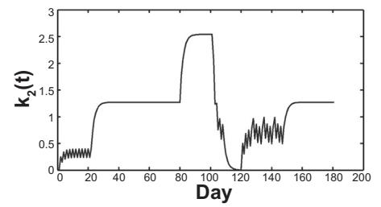

# Corrigendum

Clarke DC, Skiba PF. Rationale and resources for teaching the mathematical modeling of athletic training and performance. *Adv Physiol Educ* 37: 134–152, 2013; doi:10.1152/advan.00078.2011.

In the *CP model* section, *Equation derivation and assumptions*, *lines 5–7*, the sentence should read as follows: "The model features two parameters, CP and $W'$, which are related according to the following equation…"

The labels in Fig. 5 are shown corrected below.

> **[Fig. 5]** (Corrected.) Power (W) versus Duration (s). The grey curve is labeled $CP_2(t)$ and the black curve is labeled $CP_3(t)$; the dotted horizontal asymptote is labeled $P_{max}$. The upper-left annotations read $t \rightarrow 0$ and $P \rightarrow \infty$. Two horizontal dashed lines are labeled $CP_2 = 254\ \mathrm{W}$ and $CP_3 = 213\ \mathrm{W}$.

In *Conceptual benefits and practical applications*, paragraph 4, lines 7–8, the authors should read as Jimenez and Skiba. The author listed in Ref. 52 should be Jimenez.

In Fig. 10*B* the equation for $k_2(s)$ should include $w(j)$, as follows:

$$
k_2(s) = k_3 \sum_{j=1}^{s} w(j) e^{-(s-j)/\tau_3}
$$

---

**A**

$$
p(t) = p(0) + k_1 \sum_{s=0}^{t-1} e^{-(t-s)/\tau_1} \omega_p(s) - k_2 \sum_{s=0}^{t-1} e^{-(t-s)/\tau_2} \omega_n(s)
$$

Hill equation:

$$
\omega(s) = \kappa_{p/n} \frac{w(s)^{\gamma}}{\delta^{\gamma} + w(s)^{\gamma}}
$$

> **[Fig. 10A]** (Corrected.) Adaptive stimulus as a function of training load. Adaptive stimulus (arbitrary units) versus training load (arbitrary units). Legend: solid line "Linear," dashed line "Saturable." The solid (linear) curve is labeled $w(s)$ and the dashed (saturable) curve is labeled $\omega(s)$.

**B**

$$
p(t) = p(0) + k_1 \sum_{s=0}^{t-1} e^{-(t-s)/\tau_1} w(s) - k_2(s) \sum_{s=0}^{t-1} e^{-(t-s)/\tau_2} w(s)
$$

$$
k_2(s) = k_3 \sum_{j=1}^{s} w(j) e^{-(s-j)/\tau_3}
$$

> **[Fig. 10B]** (Corrected.) Three stacked plots sharing a Day axis: (top) TRIMPs (arbitrary units) versus Day; (middle) $k_2(t)$ versus Day; (bottom) Model outputs (arbitrary units) versus Day.
