# Relationships of 35 lower limb muscles to height and body mass quantified using MRI

Geoffrey G. Handsfield a, Craig H. Meyer a,b, Joseph M. Hart c,d, Mark F. Abel c, Silvia S. Blemker a,c,e,\*

a Department of Biomedical Engineering, University of Virginia, United States
b Department of Radiology and Medical Imaging, University of Virginia, United States
c Department of Orthopaedic Surgery, University of Virginia, United States
d Department of Kinesiology, University of Virginia, United States
e Department of Mechanical and Aerospace Engineering, University of Virginia, United States

## Article info

Article history: Accepted 1 December 2013

Keywords:
Muscle
Length
Musculoskeletal
Volume
Allometry

## Abstract

Skeletal muscle is the most abundant tissue in the body and serves various physiological functions including the generation of movement and support. Whole body motor function requires adequate quantity, geometry, and distribution of muscle. This raises the question: how do muscles scale with subject size in order to achieve similar function across humans? While much of the current knowledge of human muscle architecture is based on cadaver dissection, modern medical imaging avoids limitations of old age, poor health, and limited subject pool, allowing for muscle architecture data to be obtained in vivo from healthy subjects ranging in size. The purpose of this study was to use novel fast-acquisition MRI to quantify volumes and lengths of 35 major lower limb muscles in 24 young, healthy subjects and to determine if muscle size correlates with bone geometry and subject parameters of mass and height. It was found that total lower limb muscle volume scales with mass ($R^2 = 0.85$) and with the height–mass product ($R^2 = 0.92$). Furthermore, individual muscle volumes scale with total muscle volume (median $R^2 = 0.66$), with the height–mass product (median $R^2 = 0.61$), and with mass (median $R^2 = 0.52$). Muscle volume scales with bone volume ($R^2 = 0.75$), and muscle length relative to bone length is conserved (median s.d. $= 2.1\%$ of limb length). These relationships allow for an arbitrary subject's individual muscle volumes to be estimated from mass or mass and height while muscle lengths may be estimated from limb length. The dataset presented here can further be used as a normative standard to compare populations with musculoskeletal pathologies.

&copy; 2013 Elsevier Ltd. All rights reserved.

\* Correspondence to: University of Virginia, Department of Biomedical Engineering, PO Box 800759, Health System, Charlottesville, VA 22908, United States. Tel.: +1 434 924 6291; fax: +1 434 982 3870.
E-mail addresses: ssb6n@virginia.edu, ssblemker@virginia.edu (S.S. Blemker).

## 1. Introduction

Skeletal muscle is the most abundant tissue in the human body and is essential for movement. Muscle volume is an important determinant of muscle functional capacity. For example, physiological cross sectional area (PCSA) correlates with peak isometric force (Gans, 1982; Sacks and Roy, 1982) and can be computed from muscle volume and optimal fiber length (Brand et al., 1986; Lieber and Friden, 2000). Additionally, muscle volume has been related to the energetic capacity of muscle (Roberts et al., 1998) and to its associated joint torque-generating capacity (Fukunaga et al., 2001; Holzbaur et al., 2007a; Trappe et al., 2001). These relationships between muscle PCSA and peak muscle force, and between muscle volume and peak joint torque motivate the study of muscle volumes and lengths across healthy humans varying in size.

To date, the most comprehensive muscle volume data in humans has been based on cadaveric measurements (Friederich and Brand, 1990; Ward et al., 2009; Wickiewicz et al., 1983). While cadaver dissection is attractive in its directness of measurement, old age and poor health among cadaver donors confounds applying cadaver data to young, healthy populations (Doherty, 2003; Narici et al., 2003; Vidt et al., 2012). Furthermore, other limitations of cadaver studies have generally prevented muscle scaling relationships from being assessed.

Imaging modalities, on the other hand, have been used in the upper limb to obtain in vivo muscle architectures in subjects ranging in age and health condition (Holzbaur et al., 2007b; Vidt et al., 2012) and in the lower limb to quantify volumes of large muscles and muscle groups in subject populations of interest (Correa and Pandy, 2011; Fukunaga et al., 1992; Gopalakrishnan et al., 2010; Kawakami et al., 2000; LeBlanc et al., 2000). Prolonged imaging times have impeded the scanning of large limbs with high resolution. In this study, we use advanced high-speed MRI, which makes it possible to quickly scan the entire lower limb in high resolution, facilitating a thorough assessment of the individual muscles in the lower limb.

Quantifying healthy muscle volumes with in vivo approaches enables several important questions to be answered. First: are relative muscle volumes and lengths preserved across differently sized healthy individuals? Subject-specificity of anatomy has been discussed in biomechanical modeling (Duda et al., 1996; White et al., 1989). A finding of consistent scaling for muscle volumes and lengths would suggest that anatomical variability is small in healthy individuals and would also provide a normative basis of comparison for individuals with musculoskeletal impairments. Second: how do bones and muscles scale with each other? Muscles and bones are mechanically linked in structure and function. Previous authors have investigated how bone strength scales with size in general and in various animal species and humans (Alexander et al., 1979; Biewener, 1989; Ferretti et al., 2001; Frost, 1997). The relationship between muscle and bone volumes and lengths has not been explored in healthy humans in vivo. A finding that muscle lengths scale with bone lengths would lend further confidence to anthropometric scaling of the musculoskeletal system (Brand et al., 1982; White et al., 1989). A finding of a volumetric relationship between muscle and bone may also serve as a normative standard for evaluating gross age- and activity-related bone loss such as osteoporosis or bone resorption during space flight.

A comprehensive in vivo assessment of muscles from differently sized subjects would also allow for the exploration of how muscle volumes scale with body size. Geometric similarity has been used as a principle for muscle scaling but has been questioned by previous authors studying muscles of animals (Alexander et al., 1981) and humans (Nevill et al., 2004). Other authors have used many subject parameters (e.g. limb girth, age, gender, body weight, and waist size) to predict muscle volume (Chen et al., 2011; Lee et al., 2000). It may be that a two-component parameter, the height–mass product, can predict human muscle volume variation with high accuracy.

In this study, we used a fast non-Cartesian MRI sequence to rapidly scan the entire lower limb and comprehensively assess 35 lower limb muscles of 24 healthy males and females ranging in height by 28 cm and in mass by 51 kg. The goals of this study were to (i) determine relative volumes and lengths of lower limb muscles in this population, (ii) determine how muscles and bones scale with each other, and (iii) determine how lower limb muscle volume scales with the subject parameters of mass and height.

## 2. Methods

Twenty-four active, healthy subjects (8 females and 16 males with the following subject characteristics (mean ± s.d. [range]): age: 25.5 ± 11.1 [12–51] years, height: 171 ± 10 [145–188] cm, body mass: 71.8 ± 14.6 [47.5–107.0] kg, body mass index: 24.3 ± 4.0 [18.9–35.1] kg/m2) all with no history of lower limb injury, were provided informed consent and selected for this study (Table 1). Subject selection and study protocol were approved by the University of Virginia's Institutional Review Board. Subjects were scanned on a 3T Siemens (Munich, Germany) Trio MRI Scanner using a 2D multi-slice sequence utilizing spiral gradient echo (Meyer et al., 1992). Scan time was approximately 20 min per subject. The scanning parameters used were: TE/TR/α: 3.8 ms/800 ms/90°, field of view: 400 mm × 400 mm, slice thickness: 5 mm, in plane spatial resolution: 1.1 mm × 1.1 mm. A Chebyshev approximation was applied for semi-automatic off-resonance correction (Chen et al., 2008). Axial images were obtained contiguously from the iliac crest to the ankle joint in acquisition sets of 20 images. The table was moved 100 mm through the scanner after each acquisition set and scanning was repeated.

Sets of axial images were registered and each of 35 muscles (Supplementary Table 2) in the 24 subjects' lower limbs was segmented (Fig. 1) using in-house segmentation software written in Matlab (The Mathworks Inc., Natick, MA, USA). The segmentation technique is similar to others in the literature (Akima et al., 2000; Fukunaga et al., 1992; Holzbaur et al., 2007b) and required users to specify 2-D contours defining the perimeter of a structure in each axial image. Voxels inside each of the 2-D contours were assigned a value of one, while external voxels were assigned a zero value. To filter contour noise generated by small user errors in each slice, the voxelated volume was smoothed by convolving with an averaging filter of $3 \times 3 \times 3$ voxels. Following this smoothing procedure, the 3D anatomical structure was reconstructed as an isosurface by selecting an isovalue of half the maximum value present in the volume after smoothing. The smoothing process has a very minimal ($<1\%$) effect on computed volumes and reproduces more realistic 3-D muscle architectures which are smooth in vivo.

#### Table 1

Subject data: age, height, mass, total muscle volume of the lower limb, and combined length of the tibia and femur are reported for the twenty-four subjects included in this study.

| Subject | Age (years) | Height (cm) | Mass (kg) | BMI (kg/m2) | Total muscle volume (cm3) | Limb length (cm) |
|---|---|---|---|---|---|---|
| Female 1 | 20 | 165 | 56.7 | 21 | 6157 | 82.8 |
| Female 2 | 22 | 173 | 65.8 | 22 | 6427 | 86.6 |
| Female 3 | 26 | 160 | 56.3 | 22 | 4951 | 73.6 |
| Female 4 | 27 | 173 | 56.7 | 19 | 6185 | 82.5 |
| Female 5 | 30 | 166 | 59 | 21 | 5912 | 79 |
| Female 6 | 31 | 178 | 70.5 | 22 | 6449 | 87 |
| Female 7 | 40 | 163 | 61.4 | 23 | 6002 | 79.8 |
| Female 8 | 41 | 170 | 75 | 26 | 6866 | 79.8 |
| Male 1 | 12 | 145 | 47.5 | 23 | 3979 | 71.6 |
| Male 2 | 13 | 168 | 83.5 | 30 | 7307 | 85.6 |
| Male 3 | 13 | 161 | 56 | 22 | 5795 | 78.4 |
| Male 4 | 14 | 178 | 65.7 | 21 | 7059 | 88.6 |
| Male 5 | 14 | 167 | 56.3 | 20 | 6104 | 81.9 |
| Male 6 | 15 | 165 | 63.6 | 23 | 6587 | 84.3 |
| Male 7 | 15 | 178 | 77.6 | 24 | 7584 | 88.1 |
| Male 8 | 17 | 170 | 76.8 | 27 | 7690 | 82.3 |
| Male 9 | 20 | 185 | 81.7 | 24 | 8242 | 86.5 |
| Male 10 | 23 | 188 | 81.7 | 23 | 9266 | 89 |
| Male 11 | 25 | 180 | 74.8 | 23 | 8330 | 84.7 |
| Male 12 | 28 | 175 | 81.7 | 27 | 7729 | 85.7 |
| Male 13 | 32 | 180 | 83.9 | 26 | 8683 | 89.3 |
| Male 14 | 41 | 178 | 106.8 | 34 | 10064 | 84.7 |
| Male 15 | 42 | 165 | 95.5 | 35 | 8493 | 84.2 |
| Male 16 | 51 | 183 | 87.7 | 26 | 8922 | 89.5 |

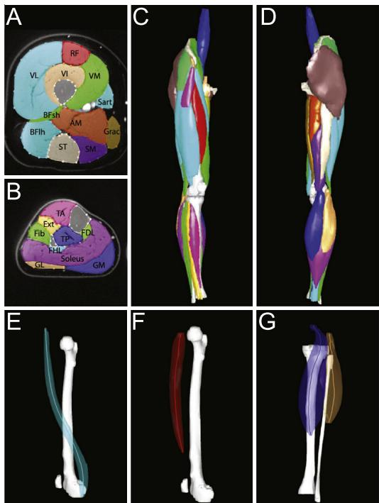
> **[Fig. 1]** Muscles and bones were segmented in axial MR images ((A) Thigh cross section and (B) Shank cross section) and reconstructed in 3-D ((C) Anterior view and (D) posterior view) to obtain volumes. Muscle belly lengths were determined from the paths of axial centroids in 3-D space, yielding the muscle belly line-of-action length ((E) Sartorius, (F) Rectus femoris and (G) Gastrocnemius).

Segmentations were performed by a team of eleven trained users who utilized a detailed slice-by-slice muscle segmentation atlas created from one of our data sets. A single highly trained user evaluated and refined all segmentations before further analysis to ensure consistency across users. User input time was approximately 25 h per limb. Total lower limb muscle volume was found by summing the volumes of all 35 segmented muscles. Muscle volume fraction was defined as muscle volume divided by the total lower limb muscle volume.

The anatomical length of each muscle was determined using axial centroids. The centroid of each muscle was computed in each axial slice. The 3D Euclidean distance between adjacent-slice centroids was calculated and all inter-slice distances were summed to yield muscle length. By defining muscle length using centroids, lengths represent the anatomical line-of-action lengths, incorporating the muscle's curved shape and complex wrapping (Fig. 1E–G). For the obturator externus, the small external rotators, the quadratus femorus, and the piriformis, the centroid path was inconsistent with the line-of-action. For these muscles, linear distances along the line of action were used for muscle length (see Supplementary text).

The linear length of bones was determined along the anatomical long axis oriented in the superior–inferior direction. Limb length was defined as the sum of the tibia and femur lengths. To compare muscle lengths between subjects, muscle belly lengths were normalized by limb length.

A cylindrical water phantom of known volume was imaged and segmented to estimate accuracy, revealing a volume error of less than 0.5%. This may underestimate errors associated with complex muscle shapes. A previous study reported errors of less than 3% for imaging and segmentation of more complex imaging phantoms (Mitsiopoulos et al., 1998).

## 3. Results

Within narrow standard deviations, muscle volume fractions for the 35 muscles included in this study are conserved for this population (Fig. 2A). Standard deviations are on the order of 1% of total lower limb musculature. The ratio of muscle belly length to bone length in the lower limb is conserved for this population (Fig. 2B). The average standard deviation of muscle belly length is 2.2% of bone length.

Volumes of individual muscles scale linearly with total limb muscle volume (Fig. 3 and Supplementary Table 1; see Supplementary Table 3 for coefficients of best fit). The highest coefficients of determination ($R^2$) between total lower limb muscle volume and individual muscle volume are in large muscles associated with knee extension ($0.48 \leq R^2 \leq 0.85$), knee flexion and hip extension ($0.52 \leq R^2 \leq 0.76$), hip flexion ($0.55 \leq R^2 \leq 0.78$), and ankle plantar-flexion ($0.45 \leq R^2 \leq 0.73$). In contrast, $R^2$ values are lower in the smaller hip external rotator muscles ($0.16 \leq R^2 \leq 0.41$). All volume correlations are significant ($p < 0.05$) except for those of the obturator externus. All length correlations are significant ($p < 0.05$) except for several hip-crossing muscles: the small external rotators, obturator muscles, quadratus femoris, piriformis, and pectineus.

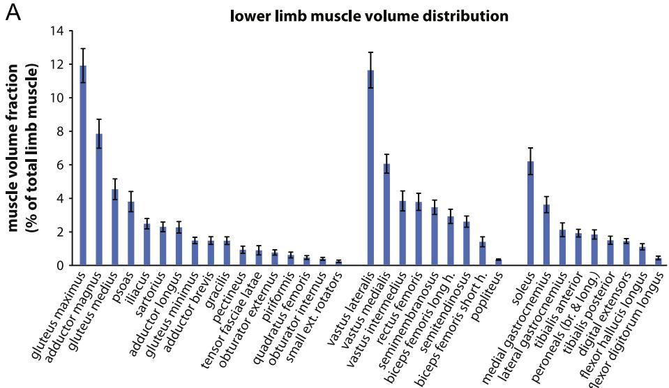
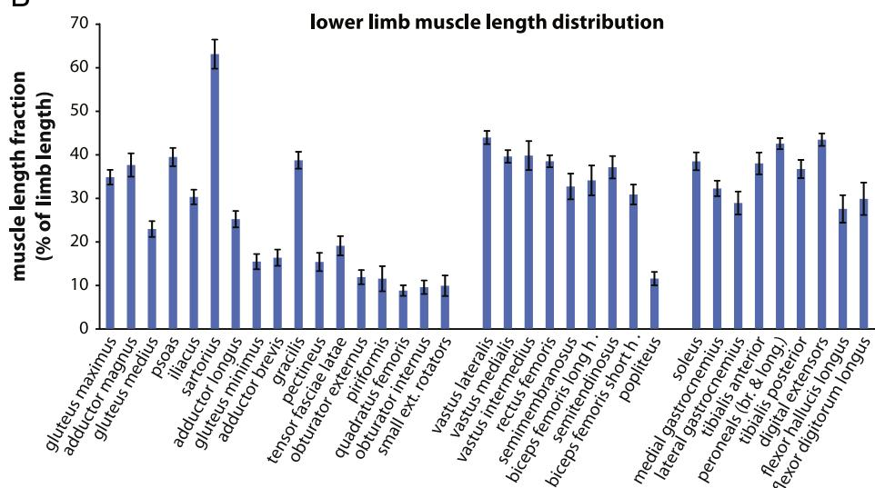
> **[Fig. 2]** Muscle volume and length distributions in healthy humans. (A) Muscle volume fraction (muscle volume divided by total limb muscle volume) means and standard deviations for all of the muscles crossing the hip, knee, and ankle. (B) Muscle length fraction (muscle belly centerline length divided by combined length of tibia and femur) means and standard deviations. Note: for four subjects, scans were acquired from the 12th thoracic vertebra to the ankle joint. The psoas volume and length reported here represent the muscle from T12 to femoral insertion obtained from the four subjects whose scans extended to T12. The volume and length for other subjects was extrapolated to include the virtual T12 to Iliac crest so that comparisons across subjects would be consistent.

Muscles grouped into joint-crossing agonists scale more tightly than individual muscles (Fig. 4). The muscle groups that scale the best with total lower limb muscle volume are the hip flexors and extensors ($R^2 = 0.88$, $R^2 = 0.95$, Fig. 4A), the hip adductors ($R^2 = 0.90$, Fig. 4B), and the knee flexors and extensors ($R^2 = 0.90$, $R^2 = 0.91$, Fig. 4C). The ankle dorsiflexors and plantarflexors and hip abductors also scale well with total lower limb muscle volume ($R^2 = 0.83$, $R^2 = 0.79$, $R^2 = 0.78$, Fig. 4B and D) while the hip external rotators display the lowest $R^2$ values ($R^2 = 0.43$, Fig. 4B).

Total lower limb muscle volume scales with the product of height and mass (Fig. 5A, $R^2 = 0.92$). This scaling relationship is higher than a relationship based on mass (Fig. 5B, $R^2 = 0.85$) or height (Fig. 5C, $R^2 = 0.64$). The effectiveness of height–mass scaling over mass scaling does not reach significance ($p = 0.28$, two-tailed t-test of Fisher transformation) although it is significantly more effective than height scaling ($p = 0.007$). The coefficient of determination for height–mass scaling was also higher than that for scaling based on the limb length–mass product ($R^2 = 0.90$) although this difference was not significant. In addition to predicting total lower limb muscle volume, the height–mass product is also a good predictor of individual muscle volumes (Supplementary Table 1), especially for muscles involved in hip flexion and extension ($0.48 \leq R^2 \leq 0.82$), knee flexion and extension ($0.45 \leq R^2 \leq 0.79$), and the large muscles crossing the ankle joint ($0.47 \leq R^2 \leq 0.77$). The height–mass product predicts individual muscle volumes with a greater $R^2$ than mass for all but one muscle (Supplementary Table 1), with a mean increase in $R^2$ of 0.05.

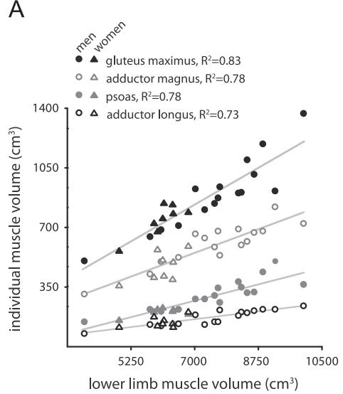
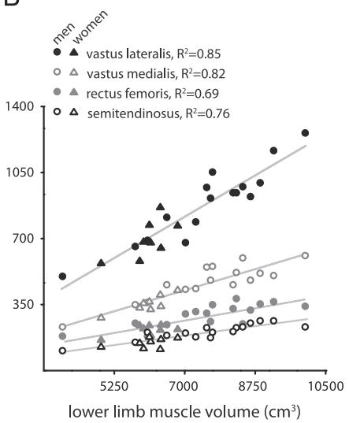
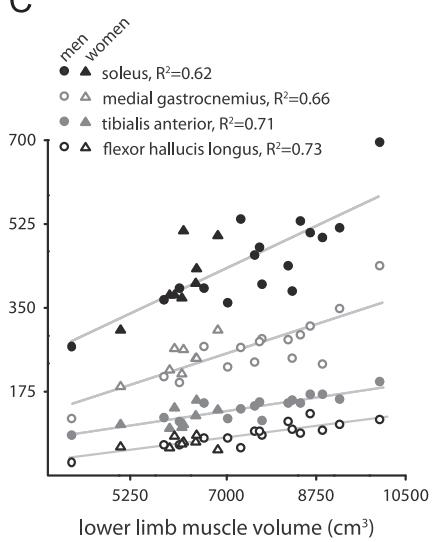
> **[Fig. 3]** Individual muscle volumes scale with lower limb muscle volume for muscles crossing the hip (A), knee (B), and ankle (C) for males (●) and females (▲). Total lower limb muscle volume thus serves as a good predictor of volumes of muscles that range in size and anatomical location.

Embedded panel legends (men = circle, women = triangle):

- **(A) Hip:** gluteus maximus, $R^2 = 0.83$; adductor magnus, $R^2 = 0.78$; psoas, $R^2 = 0.78$; adductor longus, $R^2 = 0.73$.
- **(B) Knee:** vastus lateralis, $R^2 = 0.85$; vastus medialis, $R^2 = 0.82$; rectus femoris, $R^2 = 0.69$; semitendinosus, $R^2 = 0.76$.
- **(C) Ankle:** soleus, $R^2 = 0.62$; medial gastrocnemius, $R^2 = 0.66$; tibialis anterior, $R^2 = 0.71$; flexor hallucis longus, $R^2 = 0.73$.

The total lower limb muscle volume reported previously in a comprehensive cadaver dissection study (Ward et al., 2009) is half as large as the value predicted by our linear model for subjects of the same height and mass (square marker, Fig. 5). Despite the overall small muscle sizes reported for cadavers, the muscle volume fractions computed from Ward et al. are mostly consistent with those found in this study, with a few exceptions. The computed cadaver muscle volume fractions for the gluteus medius, psoas, and vastus lateralis muscles are significantly different from this study's healthy muscle volume fractions (Supplementary Table 2, 95% confidence interval). Values for absolute physiological cross sectional area (PCSA) of the cadaver muscles reported in Ward et al. are also small compared to healthy subjects' computed PCSAs (Supplementary Table 2) although normalization by total PCSA reduces these differences.

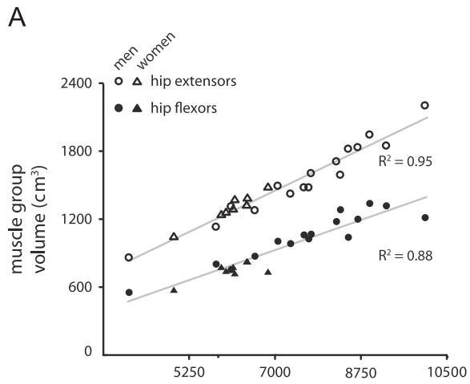
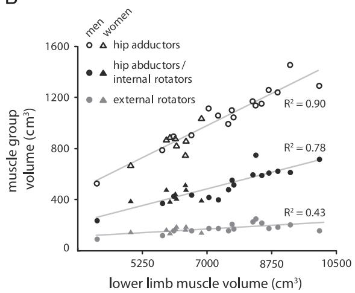
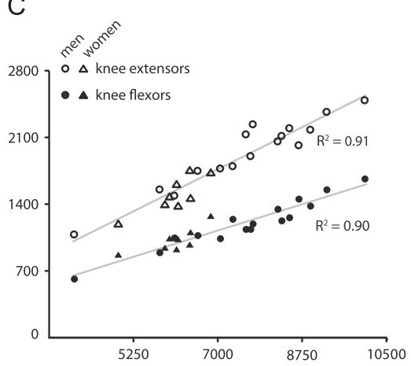
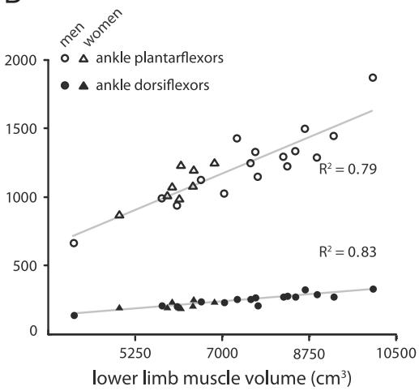
> **[Fig. 4]** Volumes of joint agonist muscle groups scale with lower limb muscle volume for groups crossing the hip (A and B), knee (C), and ankle (D) for males (●) and females (▲).

Embedded panel legends (men = circle, women = triangle):

- **(A) Hip:** hip extensors, $R^2 = 0.95$; hip flexors, $R^2 = 0.88$.
- **(B) Hip:** hip adductors, $R^2 = 0.90$; hip abductors / internal rotators, $R^2 = 0.78$; external rotators, $R^2 = 0.43$.
- **(C) Knee:** knee extensors, $R^2 = 0.91$; knee flexors, $R^2 = 0.90$.
- **(D) Ankle:** ankle plantarflexors, $R^2 = 0.79$; ankle dorsiflexors, $R^2 = 0.83$.

There is a linear relationship between the total bone volume in the lower limb (the summed volumes of the patella, tibia, fibula, and femur) and the total muscle volume in the lower limb. One outlier was found using a two-sided Grubbs' test ($\alpha = 0.01$) of total bone volume and was omitted from this analysis. Within the remaining population, 75% of the variation in muscle volume is accompanied by a commensurate variation in bone volume (Fig. 6).

## 4. Discussion

The purpose of this study was to determine muscle volumes and lengths for a cohort of healthy subjects in vivo in order to determine how muscles, bones, and subject parameters scale together. Our results revealed that: (i) muscle volumes scale relative to total muscle volume, and muscle lengths scale relative to bone length for healthy individuals varying in size and age; (ii) bone volume and muscle volume in the lower limb scale together, and (iii) total lower limb muscle volume scales with the product of height and mass for healthy subjects ranging in size, gender, and age.

In our healthy subject population, 92% of the variability in lower limb muscle volume was predicted by variations in the height–mass product while 85% of the variability was explained by mass alone. The inclusion of height as a covariate with body mass thus improved the linear predictive model by 7%. As a covariate relationship, body mass seems to dominate lower limb muscle volume while height offers a small predictive improvement, although this difference did not reach statistical significance.

The possible role of height in lower limb muscle scaling may suggest that body stature, and not just size, has a role in intraspecific variation of muscle volume in humans. There are both geometric/energetic and mechanical explanations of this hypothesis. In a study on the energetics of bipedal runners, Roberts et al. show that the cost of running is greater for bipeds than for quadrupeds of a similar mass (Roberts et al., 1998). The authors suggest that longer muscles in the taller bipeds contribute to larger muscle volumes. It is possible that the inclusion of height explains small intraspecific variations in muscle length that contribute to total muscle volume. A separate mechanical argument can be made that the function of muscle volume is to provide torque to balance and control the body. Indeed, muscle volume has been shown to correlate with maximum torque-generating capacity (Fukunaga et al., 2001; Holzbaur et al., 2007a; Trappe et al., 2001). With arbitrary increases in either height or mass, muscle volume in general must increase in order to maintain torque-balance.

Previous authors have hypothesized that inclusion of a body stature parameter (i.e. height) as a covariate with body mass could account for mass-independent increases in muscle mass in taller human subjects (Kramer and Sylvester, 2013; Nevill, 1994). Our results are consistent with these hypotheses although the effect of including height in the model was small and did not reach statistical significance. Future assessments with larger and more extremely varying human subjects may determine if height–mass scaling provides a statistically significant improvement over scaling by mass alone.

In addition to predicting total lower limb muscle volume, the height–mass product predicted individual muscle volumes as well or better than body mass for 34 of the 35 muscles (Supplementary Table 1). Strong correlations between the height–mass product and muscle volume occur in hip extensors, knee extensors, knee flexors, and the ankle plantarflexors, muscle groups that consist of large muscles that are functionally significant in bipedal support and mobility (Liu et al., 2006; Winter, 1980).

Comparisons between this study's results and previous cadaveric measurements reveal a significant disparity in the muscle volumes of these young, healthy and recreationally active subjects compared to cadavers. In a comprehensive dissection study (Ward et al., 2009), the average cadaver presents a total muscle volume 50% smaller than this study's results for a given body size. Thus, cadaver muscles are generally small even when normalized by body size. This may result from pre-mortem sarcopenia (Doherty, 2003), inactivity (Bloomfield, 1997; Kawakami et al., 2000, 2001), or disease-related atrophy (Tisdale, 2010). These differences call into question using cadaver measurements for applications to young, healthy subjects. One previous study (Arnold et al., 2010) which built a musculoskeletal model from values reported in Ward et al. used high specific tension values compared to literature (61 N/cm2 compared to 20–30 N/cm2) to achieve the movements of a healthy adult (Erskine et al., 2011; Fukunaga et al., 1996; Maganaris et al., 2001). The same effect would have been achieved from larger muscle sizes, rather than altering specific tension. Minor inconsistencies in muscle volume fraction between the present data and cadaver data may be explained by preferential atrophy accompanying disease states (Ramsay et al., 2011) or aging (Brooks and Faulkner, 1994; Brown et al., 1992; Buford et al., 2012). The fact that the data presented here are from young, healthy subjects implies that the linear model for total muscle volume cannot be generalized to all living humans. Just as cadaver data was distinct from the healthy model presented, it is also expected that elderly, obese, or inactive populations will not have the same muscle volume per height and mass as the healthy subjects presented here but will fall below the regression line presented.

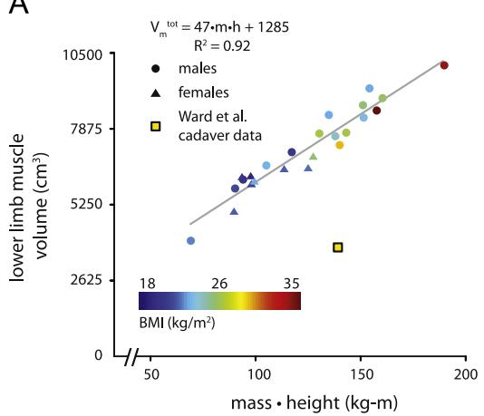
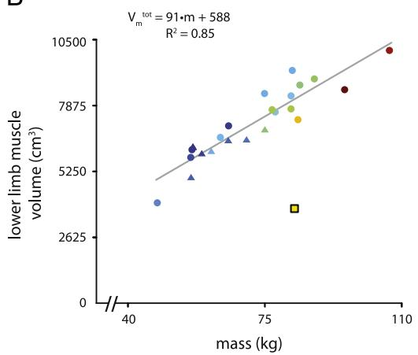
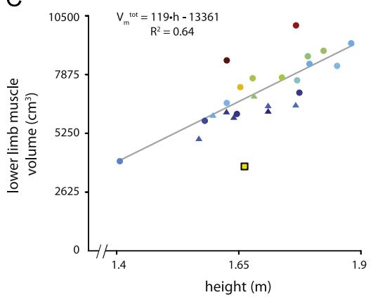
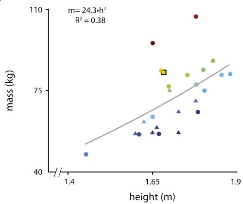
> **[Fig. 5]** The product of mass and height is the best predictor of lower limb muscle volume for males (●) and females (▲) ranging in BMI. Cadaver muscle volume (■, from Ward et al., 2009) is significantly smaller than the muscle volume of a healthy subject of the same height and mass. (A) Lower limb muscle volume scales with height × mass. (B) Lower limb muscle volume scales slightly less well with body mass alone. (C) Height alone predicts lower limb muscle volume less well. (D) The relationship between mass and height is not strong for subjects ranging in BMI, motivating the use of mass and height as covariates.

Embedded regression equations:

$$V_m^{tot} = 47 \cdot m \cdot h + 1285 \qquad R^2 = 0.92 \quad \text{(A)}$$

$$V_m^{tot} = 91 \cdot m + 588 \qquad R^2 = 0.85 \quad \text{(B)}$$

$$V_m^{tot} = 119 \cdot h - 13361 \qquad R^2 = 0.64 \quad \text{(C)}$$

$$m = 24.3 \cdot h^2 \qquad R^2 = 0.38 \quad \text{(D)}$$

A linear relationship was observed between muscle and bone volume in the lower limb. This finding reinforces the mechanical relationship between muscle and bone. Scaling between muscle architecture and bone dimensions have been explored in the past in animals and humans (Alexander et al., 1979; Biewener, 1989; Ferretti et al., 2001). Our result is consistent with previous claims that muscle loads are among the most dominant factors that influence bone modeling and remodeling (Biewener, 1989; Frost, 1997; Robling, 2009; Schoenau, 2005; Wetzsteon et al., 2011). Since our imaging sequence did not distinguish between cortical and trabecular bone, subtler relationships regarding cortical bone density (Barbour et al., 2010) could not be investigated here.

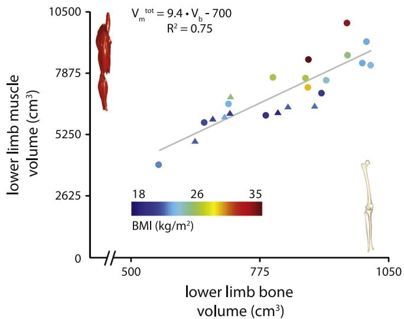
> **[Fig. 6]** Lower limb muscle volume scales with total lower limb bone volume. Variation in total bone volume (combined volume of femur, fibula, patella, and tibia) predicts 75% of the variation in the total muscle volume.

Embedded regression equation:

$$V_m^{tot} = 9.4 \cdot V_b - 700 \qquad R^2 = 0.75$$

There are several limitations of this study. While we obtained a population of 24 subjects, only one-third of the population was women and there was a larger range of masses and heights for males. The present data cannot conclusively establish that male and female curves do not diverge at extreme heights and masses; it is promising though that the females in this study fell along the same trend line as the males. Ethnic differences in muscle volume scaling could not be addressed as 21 of these subjects were of Caucasian descent and three did not report ethnicity. These data can be used as the foundation for future studies performing architectural comparisons across ethnicities. The two primary muscle parameters reported in this study are volume and anatomical length; the two parameters often used in computational biomechanical models are PCSA and optimal fiber length (Zajac, 1989). These parameters can be computed from volume and length using literature values for muscle length to optimal fiber length ratio (Ward et al., 2009). PCSA values computed thus are provided (Suppl. Table 2). Small muscles in which the line of action was oriented parallel to our transverse imaging plane (e.g. hip external rotators) are susceptible to partial volume effects and segmentation errors. Future studies on these muscles should utilize a sagittal imaging plane to reduce these errors. In this study we analyzed the right legs of all subjects. While some of our subjects may have been left-leg dominant, none of our subjects routinely participated in distinctly single-leg recreational activities (e.g. soccer). For this reason we believe that stability and ambulation—both double-leg dependent activities—dominated the muscle architecture of our subjects. Further studies are needed to investigate lower limb muscle symmetry in healthy subjects. Lastly, while muscle architecture is a major predictor of muscle function, there are many other factors involved in muscle function not investigated here.

In this study, we showed that muscle volumes and lengths scale with body size in healthy humans. While these parameters do not fully describe human muscle architecture—muscle fiber length and pennation angle, for example, cannot be derived from these data without further assumptions—they can serve as a foundation for further muscle architectural studies. The results described in this paper are not directly relevant to the study of local or global muscle pathologies where one would expect substantial deviations in the sizes or relative sizes of muscles. However, these data do provide a valuable normative foundation that can be used as a basis for identifying local or global deviations in muscle volumes in these patient populations. This will allow for the identification of preferential atrophy, muscle size imbalances, and deviations of muscle distributions in a wide variety of clinical problems as well as in elderly and obese populations. Similarly, future studies aimed at identifying adaptations of muscle distributions in athlete populations are enabled by the comprehensive normative dataset presented here.

## Conflict of interest statement

The authors wish to report a patent application in their names for the technique described in this article.

## Acknowledgments

Funding for this work was provided by the UVA-Coulter Foundation Translational Research Partnership. We thank John Christopher, Drew Gilliam, Lindsey Sauer, Katherine Read, Kelly Anderson, Ayodeji Bode-Oke, Mary Boyles, Adriana Irvine, Emily Kehne, Colin Maloney, Natalie Powers, Clara Tran, An Truong, and Diana Webber for their help with this study.

## Appendix A. Supporting information

Supplementary data associated with this article can be found in the online version at http://dx.doi.org/10.1016/j.jbiomech.2013.12.002.

## References

Akima, H., Kawakami, Y., Kubo, K., Sekiguchi, C., Ohshima, H., Miyamoto, A., Fukunaga, T., 2000. Effect of short-duration spaceflight on thigh and leg muscle volume. Med. Sci. Sports Exerc. 32, 1743–1747.

Alexander, R.M., Jayes, A.S., Maloiy, G.M.O., Wathuta, E.M., 1981. Allometry of the leg muscles of mammals. J. Zool. 194 (4), 539–552.

Alexander, R., Jayes, A., Maloiy, G., Wathuta, E., 1979. Allometry of the limb bones of mammals from shrews (Sorex) to elephant (Loxodonta). J. Zool. 189, 305–314.

Arnold, E.M., Ward, S.R., Lieber, R.L., Delp, S.L., 2010. A model of the lower limb for analysis of human movement. Ann. Biomed. Eng. 38, 269–279.

Barbour, K.E., Zmuda, J.M., Strotmeyer, E.S., Horwitz, M.J., Boudreau, R., Evans, R.W., Ensrud, K.E., Petit, M.A., Gordon, C.L., Cauley, J.A., 2010. Osteoporotic Fractures in Men (MrOS) Research Group, 2010. Correlates of trabecular and cortical volumetric bone mineral density of the radius and tibia in older men: the osteoporotic fractures in men study. J. Bone Miner. Res.: Off. J. Am. Soc. Bone Miner. Res. 25, 1017–1028.

Biewener, A.A., 1989. Scaling body support in mammals: limb posture and muscle mechanics. Science 245, 45–48.

Bloomfield, S.A., 1997. Changes in musculoskeletal structure and function with prolonged bed rest. Med. Sci. Sports Exerc. 29 (2), 197–206.

Brand, R.A., Pedersen, D.R., Friederich, J.A., 1986. The sensitivity of muscle force predictions to changes in physiologic cross-sectional area. J. Biomech. 19, 589–596.

Brand, R.A., Crowninshield, R.D., Wittstock, C., Pedersen, D., Clark, C.R., Van Krieken, F., 1982. A model of lower extremity muscular anatomy. J. Biomech. Eng. 104, 304–310.

Brooks, S.V., Faulkner, J.A., 1994. Skeletal muscle weakness in old age: underlying mechanisms. Med. Sci. Sports Exerc. 26, 432–439.

Brown, M., Ross, T.P., Holloszy, J.O., 1992. Effects of ageing and exercise on soleus and extensor digitorum longus muscles of female rats. Mech. Ageing Dev. 63, 69–77.

Buford, T.W., Lott, D.J., Marzetti, E., Wohlgemuth, S.E., Vandenborne, K., Pahor, M., Leeuwenburgh, C., Manini, T.M., 2012. Age-related differences in lower extremity tissue compartments and associations with physical function in older adults. Exp. Gerontol. 47, 38–44.

Chen, B.B., Shih, T.T., Hsu, C.Y., Yu, C.W., Wei, S.Y., Chen, C.Y., Wu, C.H., Chen, C.Y., 2011. Thigh muscle volume predicted by anthropometric measurements and correlated with physical function in the older adults. J. Nutr. Health Aging 15, 433–438.

Chen, W., Sica, C.T., Meyer, C.H., 2008. Fast conjugate phase image reconstruction based on a Chebyshev approximation to correct for B0 field inhomogeneity and concomitant gradients. Magn. Reson. Med.: Off. J. Soc. Magn. Reson. Med./Soc. Magn. Reson. Med. 60, 1104–1111.

Correa, T.A., Pandy, M.G., 2011. A mass-length scaling law for modeling muscle strength in the lower limb. J. Biomech. 44, 2782–2789.

Doherty, T.J., 2003. Invited review: Aging and sarcopenia. J. Appl. Physiol. (Bethesda, Md.: 1985) 95, 1717–1727.

Duda, G.N., Brand, D., Freitag, S., Lierse, W., Schneider, E., 1996. Variability of femoral muscle attachments. J. Biomech. 29, 1185–1190.

Erskine, R.M., Jones, D.A., Maffulli, N., Williams, A.G., Stewart, C.E., Degens, H., 2011. What causes in vivo muscle specific tension to increase following resistance training? Exp. Physiol. 96, 145–155.

Ferretti, J.L., Cointry, G.R., Capozza, R.F., Capiglioni, R., Chiappe, M.A., 2001. Analysis of biomechanical effects on bone and on the muscle-bone interactions in small animal models. J. Musculoskelet. Neuronal Interact. 1, 263–274.

Friederich, J.A., Brand, R.A., 1990. Muscle fiber architecture in the human lower limb. J. Biomech. 23, 91–95.

Frost, H.M., 1997. Defining osteopenias and osteoporoses: another view (with insights from a new paradigm). Bone 20, 385–391.

Fukunaga, T., Miyatani, M., Tachi, M., Kouzaki, M., Kawakami, Y., Kanehisa, H., 2001. Muscle volume is a major determinant of joint torque in humans. Acta Physiol. Scand. 172, 249–255.

Fukunaga, T., Roy, R.R., Shellock, F.G., Hodgson, J.A., Day, M.K., Lee, P.L., Kwong-Fu, H., Edgerton, V.R., 1992. Physiological cross-sectional area of human leg muscles based on magnetic resonance imaging. J. Orthop. Res.: Off. Publ. Orthop. Res. Soc. 10, 928–934.

Fukunaga, T., Roy, R.R., Shellock, F.G., Hodgson, J.A., Edgerton, V.R., 1996. Specific tension of human plantar flexors and dorsiflexors. J. Appl. Physiol. (Bethesda, Md.: 1985) 80, 158–165.

Gans, C., 1982. Fiber architecture and muscle function. Exerc. Sport Sci. Rev. 10, 160–207.

Gopalakrishnan, R., Genc, K.O., Rice, A.J., Lee, S.M., Evans, H.J., Maender, C.C., Ilaslan, H., Cavanagh, P.R., 2010. Muscle volume, strength, endurance, and exercise loads during 6-month missions in space. Aviat. Space Environ. Med. 81, 91–102.

Holzbaur, K.R., Delp, S.L., Gold, G.E., Murray, W.M., 2007a. Moment-generating capacity of upper limb muscles in healthy adults. J. Biomech. 40, 2442–2449.

Holzbaur, K.R., Murray, W.M., Gold, G.E., Delp, S.L., 2007b. Upper limb muscle volumes in adult subjects. J. Biomech. 40, 742–749.

Kawakami, Y., Akima, H., Kubo, K., Muraoka, Y., Hasegawa, H., Kouzaki, M., Imai, M., Suzuki, Y., Gunji, A., Kanehisa, H., Fukunaga, T., 2001. Changes in muscle size, architecture, and neural activation after 20 days of bed rest with and without resistance exercise. Eur. J. Appl. Physiol. 84, 7–12.

Kawakami, Y., Muraoka, Y., Kubo, K., Suzuki, Y., Fukunaga, T., 2000. Changes in muscle size and architecture following 20 days of bed rest. J. Gravit. Physiol.: J. Int. Soc. Gravit. Physiol. 7, 53–59.

Kramer, P.A., Sylvester, A.D., 2013. Humans, geometric similarity and the Froude number: is "reasonably close" really close enough? Biol. Open 2, 111–120.

LeBlanc, A., Lin, C., Shackelford, L., Sinitsyn, V., Evans, H., Belichenko, O., Schenkman, B., Kozlovskaya, I., Oganov, V., Bakulin, A., Hedrick, T., Feeback, D., 2000. Muscle volume, MRI relaxation times (T2), and body composition after spaceflight. Vol. 89, pp. 2158–2164.

Lee, R.C., Wang, Z., Heo, M., Ross, R., Janssen, I., Heymsfield, S.B., 2000. Total-body skeletal muscle mass: development and cross-validation of anthropometric prediction models. Am. J. Clin. Nutr. 72, 796–803.

Lieber, R.L., Friden, J., 2000. Functional and clinical significance of skeletal muscle architecture. Muscle Nerve 23, 1647–1666.

Liu, M.Q., Anderson, F.C., Pandy, M.G., Delp, S.L., 2006. Muscles that support the body also modulate forward progression during walking. J. Biomech. 39, 2623–2630.

Maganaris, C.N., Baltzopoulos, V., Ball, D., Sargeant, A.J., 2001. In vivo specific tension of human skeletal muscle. J. Appl. Physiol. (Bethesda, Md.: 1985) 90, 865–872.

Meyer, C.H., Hu, B.S., Nishimura, D.G., Macovski, A., 1992. Fast spiral coronary artery imaging. Magn. Reson. Med.: Off. J. Soc. Magn. Reson. Med./Soc. Magn. Reson. Med. 28, 202–213.

Mitsiopoulos, N., Baumgartner, R., Heymsfield, S., Lyons, W., Gallagher, D., Ross, R., 1998. Cadaver validation of skeletal muscle measurement by magnetic resonance imaging and computerized tomography. J. Appl. Physiol. 85, 115–122.

Narici, M.V., Maganaris, C.N., Reeves, N.D., Capodaglio, P., 2003. Effect of aging on human muscle architecture. J. Appl. Physiol. (Bethesda, Md.: 1985) 95, 2229–2234.

Nevill, A.M., 1994. The need to scale for differences in body size and mass: an explanation of Kleiber's 0.75 mass exponent. J. Appl. Physiol. (Bethesda, Md.: 1985) 77, 2870–2873.

Nevill, A.M., Stewart, A.D., Olds, T., Holder, R., 2004. Are adult physiques geometrically similar? The dangers of allometric scaling using body mass power laws. Am. J. Phys. Anthropol. 124, 177–182.

Ramsay, J.W., Barrance, P.J., Buchanan, T.S., Higginson, J.S., 2011. Paretic muscle atrophy and non-contractile tissue content in individual muscles of the post-stroke lower extremity. J. Biomech. 44, 2741–2746.

Roberts, T.J., Kram, R., Weyand, P.G., Taylor, C.R., 1998. Energetics of bipedal running. I. Metabolic cost of generating force. J. Exp. Biol. 201, 2745–2751.

Robling, A.G., 2009. Is bone's response to mechanical signals dominated by muscle forces? Med. Sci. Sports Exerc. 41, 2044–2049.

Sacks, R.D., Roy, R.R., 1982. Architecture of the hind limb muscles of cats: functional significance. J. Morphol. 173, 185–195.

Schoenau, E., 2005. From mechanostat theory to development of the "Functional Muscle-Bone-Unit". J. Musculoskelet. Neuronal Interact. 5, 232–238.

Tisdale, M.J., 2010. Cancer cachexia. Curr. Opin. Gastroenterol. 26, 146–151.

Trappe, S.W., Trappe, T.A., Lee, G.A., Costill, D.L., 2001. Calf muscle strength in humans. Int. J. Sports Med. 22, 186–191.

Vidt, M.E., Daly, M., Miller, M.E., Davis, C.C., Marsh, A.P., Saul, K.R., 2012. Characterizing upper limb muscle volume and strength in older adults: A comparison with young adults. J. Biomech 45, 334–341.

Ward, S., Eng, C., Smallwood, L., Lieber, R., 2009. Are Current Measurements of Lower Extremity Muscle Architecture Accurate? Clin. Orthop. Relat. Res. 467, 1074–1082.

Wetzsteon, R.J., Zemel, B.S., Shults, J., Howard, K.M., Kibe, L.W., Leonard, M.B., 2011. Mechanical loads and cortical bone geometry in healthy children and young adults. Bone 48, 1103–1108.

White, S.C., Yack, H.J., Winter, D.A., 1989. A three-dimensional musculoskeletal model for gait analysis. Anatomical variability estimates. J. Biomech. 22, 885–893.

Wickiewicz, T.L., Roy, R.R., Powell, P.L., Edgerton, V.R., 1983. Muscle architecture of the human lower limb. Clin. Orthop. Relat. Res. 179, 275–283.

Winter, D.A., 1980. Overall principle of lower limb support during stance phase of gait. J. Biomech. 13, 923–927.

Zajac, F.E., 1989. Muscle and tendon: properties, models, scaling, and application to biomechanics and motor control. Crit. Rev. Biomed. Eng. 17, 359–411.
