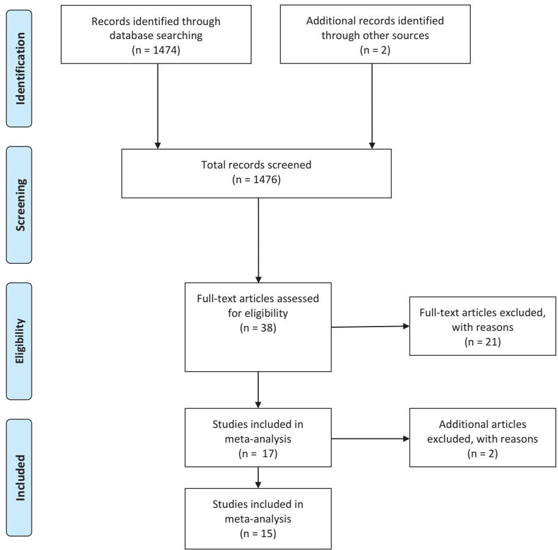
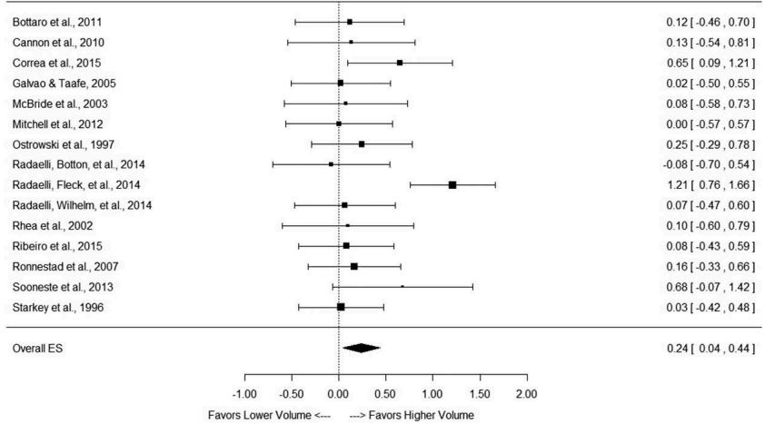

# Dose-response relationship between weekly resistance training volume and increases in muscle mass: A systematic review and meta-analysis

Brad J. Schoenfelda, Dan Ogbornb and James W. Kriegerc

aDepartment of Health Science, Lehman College, Bronx, NY, USA; bTotal Rehabilitation and Sports Injuries Clinic, Winnipeg, Canada; cWeightology, LLC, Issaquah, WA, USA

## ABSTRACT

The purpose of this paper was to systematically review the current literature and elucidate the effects of total weekly resistance training (RT) volume on changes in measures of muscle mass via meta-regression. The final analysis comprised 34 treatment groups from 15 studies. Outcomes for weekly sets as a continuous variable showed a significant effect of volume on changes in muscle size ($P = 0.002$). Each additional set was associated with an increase in effect size (ES) of 0.023 corresponding to an increase in the percentage gain by 0.37%. Outcomes for weekly sets categorised as lower or higher within each study showed a significant effect of volume on changes in muscle size ($P = 0.03$); the ES difference between higher and lower volumes was 0.241, which equated to a percentage gain difference of 3.9%. Outcomes for weekly sets as a three-level categorical variable (<5, 5–9 and 10+ per muscle) showed a trend for an effect of weekly sets ($P = 0.074$). The findings indicate a graded dose-response relationship whereby increases in RT volume produce greater gains in muscle hypertrophy.

**ARTICLE HISTORY**
Accepted 1 July 2016

**KEYWORDS**
Exercise volume; hypertrophy; skeletal muscle; cross sectional area; muscle growth

## Introduction

Prevailing exercise science theory posits that muscular adaptations are maximised by the precise manipulation of resistance training (RT) programme variables (Bird, Tarpenning & Marino 2005; Kraemer & Ratamess, 2004). Training volume, commonly defined as sets × reps × load, is purported to be one of the most critical variables in this regard. Current hypertrophy training guidelines recommend the performance of 1–3 sets per exercise for novice individuals with higher volumes (HV) of 3–6 sets per exercise advised for advanced lifters (American College of Sports Medicine, 2009). These guidelines are based on the perceived presence of a dose-response relationship between volume and muscle growth (Krieger, 2010), with HV eliciting greater hypertrophic gains.

Several studies have examined the acute response to different RT volumes. Burd et al. (2010) reported significantly greater increases in myofibrillar protein synthesis with 3 sets of unilateral leg extension exercise at 70% 1 repetition maximum (RM) compared to a single set. These results held true at both 5 h and 29 h post-exercise. Phosphorylation of the intracellular signalling proteins eukaryotic translation initiation factor 2B epsilon and ribosomal protein S6 were also elevated to a greater extent in the multiple set conditions. A follow-up study by the same lab found that phosphorylation of AKT, mTOR and P70S6K were all greater when participants performed 3 sets of unilateral leg extension versus 1 set, although results did not rise to statistical significance (Mitchell et al., 2012). Similarly, Terzis et al. (2010) demonstrated a graded dose-response relationship between volume and increases in both p70S6k and ribosomal protein S6, with linearly increasing elevations noted between 1, 3 and 5 sets of leg presses carried out at 6RM. Interestingly, Kumar et al. (2012) found that increases in RT volume magnified the acute response to a greater extent in elderly compared to young individuals. While the totality of these findings suggest an acute anabolic superiority for HV of resistance exercise, it is important to note that acute measures are not necessarily reflective of the long-term accretion of muscle proteins (Mitchell et al., 2014). Thus, the practical application of these results must be interpreted with some degree of circumspection.

The results of longitudinal research on the dose-response relationship between volume and muscle hypertrophy have been conflicting, with some studies showing that HV produce significantly greater adaptations (Correa et al., 2015; Radaelli, Botton, et al., 2014; Radaelli, Fleck, et al., 2014; Rønnestad et al., 2007; Sooneste, Tanimoto, Kakigi, Saga, & Katamoto, 2013; Starkey et al., 1996) and other studies reporting no volume-based differences (Bottaro, Veloso, Wagner, & Gentil, 2011; Cannon & Marino, 2010; Galvao & Taaffe, 2005; McBride, Blaak, & Triplett-McBride, 2003; Mitchell et al., 2012; Ostrowski, Wilson, Weatherby, Murphy, & Little, 1997; Radaelli, Wilhelm, et al., 2014; Rhea, Alvar, Ball, & Burkett, 2002; Ribeiro et al., 2015). However, the small samples inherent in longitudinal training studies often compromise statistical power, thereby increasing the likelihood of a type II error. A meta-analysis of effect sizes (ES) can help identify trends among conflicting and/or underpowered studies and thus provide greater insight as to whether hypertrophic benefits actually exist from performing higher training volumes. A meta-analysis by Krieger (2010) published in 2010 found a 40% greater ES difference favouring the performance of multiple versus single set training. Moreover, there was a dose-response trend with 2–3 sets per exercise associated with a greater ES versus 1 set and 4–6 sets per exercise associated with a greater ES than a single set. A caveat to these findings is that only 8 studies qualified for inclusion at the time, and only 3 measured muscle-specific growths with imaging techniques such as MRI and ultrasound. Numerous studies have been carried out subsequent to publication of this meta-analysis, with many employing advanced muscle-specific imaging modalities to address the importance of training volume. Moreover, Krieger (2010) analysed only the impact of the number of sets per session on muscle growth whereas the total number of weekly sets completed may be a more relevant marker of training volume.

Thus, the purpose of this paper was to systematically review the current literature and elucidate the effects of total weekly RT volume on changes in measures of muscle mass via meta-regression. Based on previous meta-analytic data (Krieger, 2010), we hypothesised that there would be graded dose-response relationship, with higher training volumes promoting progressively superior hypertrophic results.

## Methods

### Inclusion criteria

Studies were deemed eligible for inclusion if they met the following criteria: (1) were an experimental trial published in an English-language-refereed journal; (2) directly compared different daily RT volumes in traditional dynamic resistance exercise using coupled concentric and eccentric actions at intensities ≥65% 1RM without the use of external implements (i.e., pressure cuffs, hypoxic chamber, etc.) and all other RT variables equivalent; (3) measured morphologic changes via biopsy, imaging and/or densitometry; (4) had a minimum duration of 6 weeks and (5) used human participants without musculoskeletal injury or any health condition that could directly, or through the medications associated with the management of said condition, be expected to impact the hypertrophic response to resistance exercise (i.e., coronary artery disease and angiotensin receptor blockers).

### Search strategy

The systematic literature search was conducted in accordance with the Preferred Reporting Items for Systematic Reviews and Meta-Analyses (PRISMA) guidelines (Moher, Liberati, Tetzlaff, Altman, & PRISMA Group, 2009). To carry out this review, English-language literature searches of the PubMed, Sports Discus and CINAHL databases were conducted from all time points up until December 2014. Combinations of the following keywords were used as search terms: “muscle”; “hypertrophy”; “growth”; “cross sectional area”; “fat free mass”; “resistance training”, “resistance exercise”, “multiple sets”, “single sets”, “volume” and “dose response”.

A total of 1474 studies were evaluated based on search criteria. To reduce the potential for selection bias, each study was independently perused by two of the investigators (BJS and DIO), and a mutual decision was made as to whether or not they met basic inclusion criteria. Any inter-reviewer disagreements were settled by consensus or consultation with the third investigator. Of the studies initially reviewed, 36 were determined to be potentially relevant to the paper based on information contained in the abstracts. Full text of these articles was then screened and 15 were deemed suitable for inclusion in accordance with the criteria outlined. The reference lists of articles retrieved were then screened for any additional articles that had relevance to the topic, as described by Greenhalgh and Peacock (2005). Two additional studies were subsequently identified in this manner, bringing the total number of eligible studies to 17. After subsequent review, two of the studies (Radaelli, Botton, et al., 2013; Radaelli, Wilhelm, et al., 2013) were found to have used previously collected data so they were excluded from analysis. Thus, the final number of studies included for analysis was 15 (see Figure 1). Table 1 summarises the studies analysed. All studies included in the analysis received ethics approval from the local Institutional Review Board.

### Coding of studies

Studies were read and individually coded by two of the investigators (BJS and DIO) for the following variables: Descriptive information of participants by group including sex, body mass index, training status (trained participants were defined as those with at least one year regular RT experience), stratified participant age (classified as either young [18–29 years], middle-aged [30–49 years] or elderly [50+ years]; whether the study was a parallel or within-participant design; the number of participants in each group; duration of the study; number of sets performed per muscle group per session; total weekly training volume per muscle group (number of sets per muscle group per session × number of weekly sessions); type of morphologic measurement (magnetic resonance imaging (MRI), ultrasound, biopsy, dual energy X-ray absorptiomety [DXA] and/or air displacement plethysmography); region/muscle of body measured (upper, lower or both) and whether hypertrophy measure was direct or indirect. Coding was cross-checked between coders, and any discrepancies were resolved by mutual consensus. To assess potential coder drift, 30% of the studies were randomly selected for recoding as described by Cooper et al. (Cooper, Hedges, & Valentine, 2009). Per case agreement was determined by dividing the number of variables coded the same by the total number of variables. Acceptance required a mean agreement of 0.90.

### Calculation of ES

For each hypertrophy outcome, an ES was calculated as the pre-test–post-test change, divided by the pooled pre-test standard deviation (SD) (1). A percentage change from pre-test to post-test was also calculated. A small sample bias adjustment was applied to each ES (Morris, 2008). The variance around each ES was calculated using the sample size in each study and mean ES across all studies (Borenstein, Hedges, & Higgins, 2009).

> **[Figure 1]** Flow diagram of search process.

### Statistical analyses

Meta-analyses were performed using robust variance meta-regression for multi-level data structures, with adjustments for small samples (Hedges, Tipton, & Johnson, 2010; Tipton, 2015). Study was used as the clustering variable to account for correlated effects within studies. Observations were weighted by the inverse of the sampling variance. Model parameters were estimated by the method of restricted maximum likelihood (REML) (Thompson & Sharp, 1999); an exception was during the model reduction process, in which parameters were estimated by the method of maximum likelihood, as likelihood ratio tests cannot be used to compare nested models with REML estimates. Separate meta-regressions on ESs were performed with the following moderator variables: total sets per muscle group per week as a continuous variable; total sets per muscle group per week categorised as low (<5), medium (5–9) or high (10+); total sets per muscle group per week categorised as lower (<9) or higher (9+) and total sets per muscle group per week categorised as lower or higher based on the comparison group within each study. For the latter, if a study had 3 comparison groups, the highest volume group was classified as “Higher”, and the two lower volume (LV) groups were classified as “Lower”. In the latter regression model, mean differences in ES were calculated for each study to give a study-level ES for the difference between HV and LV and to allow the generation of a forest plot. To assess the practical significance of the outcomes, the equivalent per cent change was calculated for each meta-regression outcome. To assess the potential confounding effects of study-level moderators on outcomes, an additional full meta-regression model was created with the following predictors: total sets per muscle group per week (continuous variable), gender (male, female or mixed), age category (younger or older), weeks, hypertrophy measurement type (direct or indirect) and body portion (upper, lower or whole). The model was then reduced by removing predictors one at a time, starting with the most insignificant predictor (Burnham & Anderson, 2002). The final model represented the reduced model with the lowest Bayesian Information Criterion (Schwarz, 1978) and that was not significantly different ($P > 0.05$) from the full model when compared using a likelihood ratio test. Weekly set volume was not removed during the model-reduction process. Since all covariates were removed during the model-reduction process, and the simple model with set volume as the lone covariate was not significantly different from the full model, only the results of the simple models are reported. To explore possible interactions between set volumes and other variables, separate regressions were performed on set volume and its interaction with age category, gender category, body half and measurement type.

In order to identify the presence of highly influential studies which might bias the analysis, a sensitivity analysis was carried out for each model by removing one study at a time, and then examining the set volume predictor. Studies were identified as influential if removal resulted in a change of the predictor going from significant or a trend ($P \leq 0.10$) to non-significant ($P > 0.10$), or vice versa, or if removal caused a large change in the magnitude of the coefficient.

All analyses were performed using package metaphor in R version 3.2.3 (The R Foundation for Statistical Computing, Vienna, Austria). Effects were considered significant at $P \leq 0.05$, and trends were declared at $0.05 < P \leq 0.10$. Data are reported as x ± standard error of the means (SEM) and 95% confidence intervals (CIs).

**Table 1.** Summary of hypertrophy training studies investigating volume.

| Study | Participants | Design | Study duration | Weekly sets per exercise | Hypertrophy measurement | Findings |
|---|---|---|---|---|---|---|
| Bottaro et al. (2011) | 30 untrained young men | Random assignment to a resistance training protocol where one group performed 3 sets of knee extension exercise and 1 set of elbow flexion exercise while the other group performed 3 sets of elbow flexion exercise and 1 set of knee extension exercise. All participants performed 8–12RM of each exercise twice per week. | 12 weeks | High: 6 Low: 2 | Ultrasound | No significant differences in muscle thickness between conditions (Elbow flexors: 5.9% for high, 7.2% for low; Quads: 2.5% for high, –2.9% for low) |
| Cannon and Marino (2010) | 31 untrained young and elderly women | Random assignment to a resistance-training protocol performed either 1 or 3 sets per exercise. Training consisted of knee extension and knee flexion exercise performed 3 days a week at an intensity of 75% 1RM. | 10 weeks | High: 9 Low: 3 | MRI | No significant differences in muscle volume between conditions (10.7% for high, 6.0% for low) |
| Correa et al. (2015) | 36 untrained postmenopausal women | Random assignment to a resistance-training protocol performed either 1 or 3 sets per exercise. All participants performed 8 exercises targeting entire body at 15RM. Training was carried out 3 days a week for 11 weeks. | 11 weeks | High: 9 Low: 3 | Ultrasound | Significantly greater increases in muscle thickness of the quadriceps for the high volume condition (20.4% for high; 11.6% for low) |
| Galvao and Taaffe (2005) | 28 untrained elderly men and women | Random assignment to a resistance-training protocol performed either 1 or 3 sets per exercise. All participants performed seven exercises (chest press, seated row, triceps extension, biceps curl, leg press, leg curl, leg extension) targeting the entire body at 8RM. Training was carried out twice weekly. | 20 weeks | High: 9 Low: ~5 | DXA | No significant differences in lean body mass between conditions (1.5% for high, 1.0% for low) |
| McBride et al. (2003) | 28 young untrained men and women | Random assignment to a resistance-training protocol consisting of 5 different exercises including the biceps curl, leg press, chest flye, sit-up and back extension. One group performed a single set of each of these exercises while the other group performed 6 sets for the biceps curl and leg press and 3 sets for all other exercises. All participants performed 6–15RM of the exercises twice weekly. | 12 weeks | High: 12 Low: 2 | DXA | No significant differences in lean body mass between conditions (Upper body: 0% for high, 0% for low; Lower body: 5.1% for high, 0% for low) |
| Mitchell et al. (2012) | 18 untrained young men | Within-participant design where participants trained one leg with 3 sets and the other with 1 set at 80% 1RM on a knee extension machine. Training was carried out 3 days-per-week. | 10 weeks | High: 9 Low: 3 | MRI and biopsy | No significant differences in cross sectional area between groups (MRI: 6.8% for high; 3.1% for low; Biopsy: 15.9% for high, 16.4% for low) |
| Ostrowski et al. (1997) | 27 resistance-trained young men | Random assignment to a resistance-training protocol performed either 1, 2 or 4 sets per exercise. All participants performed a 4-day split body routine working each of the major muscle groups with multiple exercises in a session at 7–12RM. | 10 weeks | High: 12–28 Med: 6–14 Low: 3–7 | Ultrasound | No significant differences in muscle thickness between conditions (Triceps: 4.8% for high, 4.7% for medium, 2.3% for low; Quads: 12.3% for high, 4.6% for medium, 6.3% for low) |
| Radaelli, Fleck, et al. (2014) | 48 young, recreationally trained men | Random assignment to a resistance-training protocol performed either 1, 3 or 5 sets per exercise. All participants performed 8–12RM for multiple exercises for the entire body (bench press, leg press, lat pulldown, leg extension, SP, leg curl, biceps curl, abdominal crunch and triceps extension). Training was carried out 3 days per week. | 6 months | High: 30 Med: 18 Low: 6 | Ultrasound | Significantly greater increases in elbow flexor muscle thickness for the 5-set condition compared to the other 2 conditions. Only the 3- and 5-SETS groups significantly increased elbow flexor muscle thickness from baseline. Significantly greater increases in elbow extensor muscle thickness in the 5-set condition compared with the other 2 conditions. Only the 5 set group significantly increased triceps extensor thickness from baseline. (Biceps: 17.0% for high, 7.8% for medium, 1.4% for low; Triceps: 20.8% for high, 1.7% for medium, 0.5% for low) |
| Radaelli, Wilhelm, et al. (2014) | 27 untrained elderly women | Random assignment to a resistance-training protocol performed either 1 or 3 sets per exercise. All participants performed 10 exercises targeting the entire body at 10–20RM (bilateral leg press, unilateral elbow flexion, bilateral knee extension, lat pull-down, bilateral leg curl, triceps extension, bench press, hip abduction and adduction and abdominal crunch). Training was carried out twice weekly. | 6 weeks | High: 12 Low: 4 | Ultrasound | No significant differences in muscle thickness between conditions (6.7% for high, 4.4% for low) |
| Radaelli, Botton, et al. (2014) | 20 untrained elderly women | Random assignment to a resistance-training protocol performed either 1 or 3 sets per exercise. All participants performed 10 exercises targeting the entire body at 6–20RM (bilateral leg press, unilateral elbow flexion, bilateral knee extension, lat pull-down, bilateral leg curl, triceps extension, bench press, hip abduction and adduction and abdominal crunch). Training was carried out twice weekly. | 20 weeks | High: 12 Low: 4 | Ultrasound | Significantly greater increases in quadriceps muscle thickness for the high-volume group (Biceps: 14.5% for high, 18.8% for low; Quads: 17.1% for high, 11.9% for low) |
| Rhea et al. (2002) | 18 resistance-trained young men | Random assignment to a resistance-training protocol performed either 1 or 3 sets-per-exercise. All participants performed 4–10RM on the bench press and leg press. Participants also performed an additional set of multiple exercises considered unrelated to the bench press or leg press (biceps curl, lat pull-down, abdominal crunches, back extensions and seated rows). Training was carried out 3 days-per-week. | 12 weeks | High: ~5 Low: 3 | BodPod | No significant differences in lean body mass between conditions (1.7% for high, 1.1% for low) |
| Ribeiro et al. (2015) | 30 untrained elderly women | Random assignment to a resistance-training protocol consisting of 8 exercises for the total body (chest press, horizontal leg press, seated row, knee extension, preacher curl, leg curl, triceps pushdown and seated calf raise) performed either 1 or 3 days-per-week. All participants performed 10–15 repetitions for 3 days-per-week. | 12 weeks | High: ~10 Low: ~4 | DXA | No significant differences in lean body mass between conditions (1.6% for high, 1.1% for low) |
| Rønnestad et al. (2007) | 21 untrained young men | Random assignment to a resistance-training protocol where one group performed 3 sets of upper body exercise and 1 set of lower body exercise while the other group performed 3 sets of lower body exercise and 1 set of upper body exercise. Training consisted of 8 exercises for the entire body (leg press, leg extension, leg curl, seated chest press, seated rowing, latissimus pull-down, biceps curl and shoulder press) performed at 7–10RM and carried out 3 days-per-week. | 11 weeks | High: 9–18 Low: 3–6 | MRI | Significantly greater increases in thigh muscle CSA for the HV condition (Trapezius: 14.3% for high, 9.8% for low; Quads: 12.0% for high, 8.0% for low; Hamstrings: 10.1% for high, 6.0% for low) |
| Sooneste et al. (2013) | 8 untrained young men | Within-participant crossover where all participants performed a two-day-per-week resistance-training protocol of preacher curls so that one arm used 3 sets in a session and the other arm used a single set in the following session. Training was performed at 80% 1RM and carried out 2 days-per-week. | 12 weeks | High: 6 Low: 2 | MRI | Significantly greater increases in upper arm CSA for the high-volume condition (15.9% for high, 2.8% for low) |
| Starkey et al. (1996) | 48 untrained mixed-aged men and women | Random assignment to a resistance-training protocol of knee flexion and extension performed either 1 or 3 days-per-week. All participants performed 8–12 repetitions for 3 days-per-week. | 14 weeks | High: 9 Low: 3 | Ultrasound | No significant differences in muscle thickness of the anterior or posterior thigh muscles between conditions, although only the high-volume group significantly increased hypertrophy of the vastus medialis relative to control (2.9% for high, 2.5% for low). |

Abbreviations: MRI (magnetic resonance imaging); DXA (dual energy X-ray absorptiometry); CSA (cross sectional area).

## Results

The final analysis comprised 34 treatment groups from 15 studies. The mean ES across all studies was 0.38 ± 0.08 (CI: 0.21, 0.56). The mean per cent change was 6.8 ± 1.3% (CI: 3.9, 9.7).

### Weekly sets (continuous per muscle)

Outcomes for weekly sets as a continuous variable are shown in Table 2. There was a significant effect of the number of weekly sets on changes in muscle size ($P = 0.002$). Each additional set per week was associated with an increase in ES of 0.023. This was equivalent to an increase in the percentage gain by 0.37% for each additional weekly set.

### Weekly sets (lower versus higher within studies per muscle)

Outcomes for weekly sets categorised as lower or higher within each study are shown in the forest plot in Figure 2. There was a significant effect of volume ($P = 0.03$); the ES difference between HV and LV was 0.241 ± 0.101 (CI: 0.026, 0.457). This was equivalent to a difference in percentage gain of 3.9%.

### Weekly sets (<5, 5–9 and 10+ per muscle)

Outcomes for weekly sets as a three-level categorical variable are shown in Table 2. There was a trend for an effect of weekly sets ($P = 0.074$). Mean ES for each category were 0.307 for <5 sets, 0.378 for 5–9 sets and 0.520 for 10+ sets. This was equivalent to percentage gains of 5.4%, 6.6% and 9.8%, respectively.

**Table 2.** Impact of weekly set volume on effect size and percentage change in muscle size.

| Weekly sets per muscle group | ES | 95% CI | P-value | Equivalent percentage gain |
|---|---|---|---|---|
| Each additional weekly set | 0.023 ± 0.006 | 0.010, 0.036 | 0.002 | 0.37 |
| <5 | 0.307 ± 0.07 | 0.152, 0.462 | 0.074 | 5.4 |
| 5–9 | 0.378 ± 0.13 | 0.092, 0.664 |  | 6.6 |
| 10+ | 0.520 ± 0.13 | 0.226, 0.813 |  | 9.8 |
| <9 | 0.320 ± 0.06 | 0.185, 0.455 | 0.076 | 5.8 |
| 9+ | 0.457 ± 0.12 | 0.208, 0.707 |  | 8.2 |

### Weekly sets (<9, 9+ per muscle)

Outcomes for weekly sets as a two-level categorical variable are shown in Table 2. There was a trend for an effect of weekly sets ($P = 0.076$). Mean ES was 0.320 for <9 sets, and 0.457 for 9+ sets. This was equivalent to percentage gains of 5.8% and 8.2%, respectively.

### Interactions

There was no significant interaction between weekly set volume and gender ($P = 0.55$), body half ($P = 0.28$) or age ($P = 0.66$). There was a significant interaction with the type of hypertrophy measurement ($P = 0.037$). The mean increase in ES for each additional weekly set was 0.023 for direct measurements (CI: 0.009, 0.037), but only 0.006 for indirect measurements, a value which was not significantly different from 0 (CI: −0.023, 0.12). This was equivalent to an increase in the percentage gain by 0.38% for each additional weekly set for direct measurements (CI: 0.14, 0.62), but only 0.21% for each additional weekly set for indirect measurements (CI: −0.28, 0.52).

### Sensitivity analysis

Sensitivity analysis revealed one influential study. Removal of the study by Radaelli, Fleck, et al. (2014) reduced the impact of the weekly number of sets on hypertrophy (Table 3). The estimate for the change in ES for each additional set was reduced to 0.013 ($P = 0.008$). This was equivalent to an increase in the percentage gain by 0.25 for each additional weekly set. The study level ES in Figure 2, representing the within-study difference between HV and LV, decreased to 0.147 (CI: 0.033, 0.261; $P = 0.016$). This was equivalent to a difference in percentage gain of 3.1%. In the 3-category model, there was no longer an advantage to 10+ sets; mean ES for <5, 5–9 and 10+ sets were 0.306, 0.410 and 0.404, respectively. This was equivalent to percentage gains of 5.5%, 7.2% and 8.6%, respectively. In the two-category model (<9 sets and 9+sets), there was no longer a trend for an effect of weekly sets ($P = 0.12$). Mean ES for <9 sets and 9+ sets were 0.316 and 0.425, respectively. This was equivalent to percentage gains of 5.9% and 8.0%, respectively.

**Table 3.** Impact of weekly set volume after removal of study by Radaelli, Fleck, et al. (2014).

| Weekly sets per muscle group | ES | 95% CI | P-value | Equivalent percentage gain |
|---|---|---|---|---|
| Each additional weekly set | 0.013 ± 0.004 | 0.004, 0.021 | 0.008 | 0.25 |
| <5 | 0.306 ± 0.08 | 0.137, 0.474 | 0.059 | 5.5 |
| 5–9 | 0.410 ± 0.13 | 0.099, 0.721 |  | 7.2 |
| 10+ | 0.404 ± 0.09 | 0.217, 0.592 |  | 8.6 |
| <9 | 0.316 ± 0.07 | 0.166, 0.466 | 0.12 | 5.9 |
| 9+ | 0.425 ± 0.12 | 0.161, 0.689 |  | 8.0 |

## Discussion

The present study sought to compare the effects of varying RT volumes on established markers of muscle growth based on a systematic analysis of pooled data from the current literature. Results showed an incremental dose-response relationship whereby progressively higher weekly training volumes resulted in greater muscle hypertrophy. These findings were seen across all predictor models employed as determined by increasing ES as well as greater percentage gains in muscle mass. Results are consistent with those of previous meta-analytic work (Krieger, 2010), and expand on prior findings with the inclusion of a substantial amount of new data using more precise methods of measurement. These results also are in agreement with acute research showing greater post-exercise muscle protein synthesis (MPS) and intracellular anabolic signalling for multiple versus single-set protocols (Burd et al., 2010; Kumar et al., 2012; Mitchell et al., 2012; Terzis et al., 2010)

> **[Figure 2]** Forest plot of studies comparing the hypertrophic effects of different training volumes where the comparison made within each study analysed lower vs. higher number of sets. The data shown are mean ±95% CI; the size of the plotted squares reflect the statistical weight of each study. Abbreviations: ES (effect size).

A significant dose-response effect was seen when analysing the number of weekly sets as a continuous predictor. Each additional weekly set performed was associated with an increase in ES of 0.02, equating to a 0.36% hypertrophic gain. Sub-analysis of covariates revealed a significant interaction between sets per week and the type of measurement, making it very likely that these findings were not due to chance alone (Hopkins, Marshall, Batterham, & Hanin, 2009). The increase in ES for each additional weekly set was 0.02 for direct muscle-specific measures (MRI and ultrasound), but only 0.01 for whole-body measures (DXA and BodPod). This underscores the importance of using direct measurements when assessing hypertrophic outcomes, as they are more sensitive to detecting subtle changes in muscle size (Levine et al., 2000). Contrary to findings of Rønnestad et al. (2007), who reported a dose-response effect for the lower- but not upper-body musculature, meta-regression of included studies did not detect any growth-related differences between body segments based on RT volume ($P = 0.30$). No other covariate including age, gender or study duration was found to significantly affect results.

Dose-response effects were noted when stratifying sets into low (≤4 sets · week–1), medium (5–9 sets · week–1) and high (≥10 sets · week–1) volumes. Although results did not reach statistical significance, the low observed $P$-value (0.074) indicates a good likelihood that results were not due to chance alone (Hopkins et al., 2009). Null findings may be due to reduced statistical power as a consequence of stratification of the model. The ES displayed a graded volume-dependent increase progressing from low to medium to high volume conditions (0.30, 0.36 and 0.50, respectively). These values were paralleled by graded increases in percentage muscle growth (5.4%, 6.5% and 9.6%, respectively), indicating that greater muscular development is achieved by performing at least 10 weekly sets per muscle group.

When considering weekly sets as a binary predictor (<9 versus ≥9 sets · week–1), findings did not reach statistical significance between conditions. However, when taking a magnitude-based approach to statistical inference, the low observed $P$-value (0.076) indicates a good likelihood that results were not due to chance alone (Hopkins et al., 2009). Null findings may be due to reduced statistical power as a consequence of stratification of the model. Moreover, ES favoured HV compared to LV (0.66 versus 0.43, respectively), and these values mirrored percentage gain increases in hypertrophy (8.0% versus 5.7%, respectively). The paucity of data investigating weekly volumes of >12 sets prevented analysis of very high training volumes on hypertrophic outcomes. Thus, it remains unclear as to where the upper threshold lies as to the dose-response relationship between RT volume and muscular growth.

Our analysis looked only at hypertrophy-related outcomes and did not endeavour to ascertain underlying mechanisms behind the dose-response relationship. Nevertheless, it can be speculated that results are attributed at least in part to the cumulative effects of time under tension at a given load. Hypothetically, repeated within-session stimulation of muscle tissue is necessary to drive intracellular signalling in a manner that maximises the anabolic response to RT. Considering that muscle hypertrophy is predicated on the dynamic balance between MPS and breakdown (Sandri, 2008), higher RT volumes would therefore conceivably sustain weekly anabolism to a greater degree than LV. It also is feasible that differences in metabolic stress between conditions may play a role in results. Research indicates that exercise-induced metabolic stress augments muscle protein accretion when a minimum threshold for mechanical tension is achieved (Schoenfeld, 2013). Given evidence that metabolite build-up is significantly greater in multiple versus single set protocols (Gotshalk et al., 1997), a rationale exists whereby this phenomenon enhances anabolism to a greater extent in high-volume protocols.

A primary limitation of the current literature on the topic is the lack of controlled research in resistance-trained individuals. Only two studies to date investigated the effects of RT volume on changes in muscle mass. Rhea et al. (2002) found no significant differences in fat-free mass when training with 3 sets versus 1 set in cohort of recreationally trained men (minimum of 2 years RT experience working out at least 2 days · week–1). The study was limited by the use of an indirect measurement instrument (BodPod), that as shown in the present analysis, may lack the sensitivity to detect subtle changes in lean mass. Moreover, only the bench press and leg press were manipulated for training volume, attenuating the potential dose-response effects on whole-body muscle growth and thereby making it difficult to draw practical conclusions. Ostrowski et al. (1997) used B-mode ultrasound to investigate hypertrophic changes in a cohort of resistance-trained young men (1–4 years RT experience with the ability to bench press and squat 100% and 130% of body mass, respectively) performing either 3, 6 or 12 weekly sets per muscle group. Although no significant effects were demonstrated between conditions, the highest volume group displayed markedly greater absolute increases in rectus femoris cross sectional area compared to the medium and low volume conditions (13.1% versus 5% and 6.7%, respectively). Null findings may be the result of a type II error given the small sample size employed. Clearly, more studies are needed in resistance-trained individuals to be able to draw research-based conclusions as to the effects of RT volume on muscle growth.

## Practical applications

The current body of evidence indicates a graded dose-response relationship between RT volume and muscle growth. Clearly, substantial hypertrophic gains can be made using low-volume protocols (≤4 weekly sets per muscle group). Such an approach therefore represents a viable muscle-building option for those who are pressed for time or those to which the conservation of energy is an ongoing concern (i.e., frail elderly). However, the present analysis shows that HV protocols produce significantly greater increases in muscle growth than LV. Based on our findings, it would appear that performance of at least 10 weekly sets per muscle group is necessary to maximise increases in muscle mass. Although there is certainly a threshold for volume beyond which hypertrophic adaptations plateau and perhaps even regress due to overtraining, current research is insufficient to determine the upper limits of this dose-response relationship.

It is clear that the optimal RT dose will ultimately vary between individuals, and these differences may have a genetic component. For example, research shows that the variances in the angiotensin converting enzyme (ACE) genotype affects the strength-related response to single- versus multiple-set routines (Colakoglu et al., 2005). Although the ACE gene does not appear to mediate the hypertrophic response to RT (Charbonneau et al., 2008), it remains possible that other genes may well influence volume-related muscular gains. Consistent with an evidence-based approach, practitioners should carefully monitor client progression and adjust training dosages based on the individual’s response.

## Disclosure statement

No potential conflict of interest was reported by the authors.

## References

American College of Sports Medicine. (2009). American College of Sports Medicine position stand. Progression models in resistance training for healthy adults. Medicine & Science in Sports & Exercise, 41(3), 687–708. doi:10.1249/MSS.0b013e3181915670

Bird, S. P., Tarpenning, K. M., & Marino, F. E. (2005). Designing resistance training programmes to enhance muscular fitness: A review of the acute programme variables. Sports Medicine (Auckland, N.Z.), 35(10), 841–851. doi:10.2165/00007256-200535100-00002

Borenstein, M., Hedges, L. V., & Higgins, J. P. T. (2009). Effect sizes based on means. In Anonymous (Ed.), Introduction to meta-analysis (pp. 21–32). Chichester: John Wiley and Sons, Ltd.

Bottaro, M., Veloso, J., Wagner, D., & Gentil, P. (2011). Resistance training for strength and muscle thickness: Effect of number of sets and muscle group trained. Science & Sports, 26, 259–264. doi:10.1016/j.scispo.2010.09.009

Burd, N. A., Holwerda, A. M., Selby, K. C., West, D. W., Staples, A. W., Cain, N. E., . . . Phillips, S. M. (2010). Resistance exercise volume affects myofibrillar protein synthesis and anabolic signalling molecule phosphorylation in young men. The Journal of Physiology, 588(Pt 16), 3119–3130. doi:10.1113/jphysiol.2010.192856

Burnham, K. P., & Anderson, D. R. (2002). Model selection and inference: A practical information-theoretic approach. New York, NY: Springer-Verlag.

Cannon, J., & Marino, F. E. (2010). Early-phase neuromuscular adaptations to high- and low-volume resistance training in untrained young and older women. Journal of Sports Sciences, 28(14), 1505–1514. doi:10.1080/02640414.2010.517544

Charbonneau, D. E., Hanson, E. D., Ludlow, A. T., Delmonico, M. J., Hurley, B. F., & Roth, S. M. (2008). ACE genotype and the muscle hypertrophic and strength responses to strength training. Medicine & Science in Sports & Exercise, 40(4), 677–683. doi:10.1249/MSS.0b013e318161eab9

Colakoglu, M., Cam, F. S., Kayitken, B., Cetinoz, F., Colakoglu, S., Turkmen, M., & Sayin, M. (2005). ACE genotype may have an effect on single versus multiple set preferences in strength training. European Journal of Applied Physiology, 95(1), 20–26. doi:10.1007/s00421-005-1335-2

Cooper, H., Hedges, L., & Valentine, J. (2009). The handbook of research synthesis and meta-analysis (2nd ed.). New York, NY: Russell Sage Foundation.

Correa, C. S., Teixeira, B. C., Cobos, R. C., Macedo, R. C., Kruger, R. L., Carteri, R. B., . . . Reischak-Oliveira, A. (2015). High-volume resistance training reduces postprandial lipaemia in postmenopausal women. Journal of Sports Sciences, 33(18), 1890–1901. doi:10.1080/02640414.2015.1017732

Galvao, D. A., & Taaffe, D. R. (2005). Resistance exercise dosage in older adults: Single versus multiset effects on physical performance and body composition. Journal of the American Geriatrics Society, 53(12), 2090–2097. doi:10.1111/j.1532-5415.2005.00494.x

Gotshalk, L. A., Loebel, C. C., Nindl, B. C., Putukian, M., Sebastianelli, W. J., Newton, R. U., . . . Kraemer, W. J. (1997). Hormonal responses of multiset versus single-set heavy-resistance exercise protocols. Canadian Journal of Applied Physiology, 22(3), 244–255. doi:10.1139/h97-016

Greenhalgh, T., & Peacock, R. (2005). Effectiveness and efficiency of search methods in systematic reviews of complex evidence: Audit of primary sources. BMJ (Clinical Eesearch Ed.), 331(7524), 1064–1065. doi:10.1136/bmj.38636.593461.68

Hedges, L. V., Tipton, E., & Johnson, M. C. (2010). Robust variance estimation in meta-regression with dependent effect size estimates. Research Synthesis Methods, 1(1), 39–65. doi:10.1002/jrsm.v1:1

Hopkins, W. G., Marshall, S. W., Batterham, A. M., & Hanin, J. (2009). Progressive statistics for studies in sports medicine and exercise science. Medicine & Science in Sports & Exercise, 41(1), 3–13. doi:10.1249/MSS.0b013e31818cb278

Kraemer, W. J., & Ratamess, N. A. (2004). Fundamentals of resistance training: Progression and exercise prescription. Medicine & Science in Sports & Exercise, 36(4), 674–688. doi:10.1249/01.MSS.0000121945.36635.61

Krieger, J. W. (2010). Single vs. multiple sets of resistance exercise for muscle hypertrophy: A meta-analysis. Journal of Strength and Conditioning Research/National Strength & Conditioning Association, 24(4), 1150–1159. doi:10.1519/JSC.0b013e3181d4d436

Kumar, V., Atherton, P. J., Selby, A., Rankin, D., Williams, J., Smith, K., . . . Rennie, M. J. (2012). Muscle protein synthetic responses to exercise: Effects of age, volume, and intensity. The Journals of Gerontology Series A: Biological Sciences and Medical Sciences, 67(11), 1170–1177. doi:10.1093/gerona/gls141

Levine, J. A., Abboud, L., Barry, M., Reed, J. E., Sheedy, P. F., & Jensen, M. D. (2000). Measuring leg muscle and fat mass in humans: Comparison of CT and dual-energy X-ray absorptiometry. Journal of Applied Physiology (Bethesda, Md.: 1985), 88(2), 452–456.

McBride, J. M., Blaak, J. B., & Triplett-McBride, T. (2003). Effect of resistance exercise volume and complexity on EMG, strength, and regional body composition. European Journal of Applied Physiology, 90(5–6), 626–632. doi:10.1007/s00421-003-0930-3

Mitchell, C. J., Churchward-Venne, T. A., Parise, G., Bellamy, L., Baker, S. K., Smith, K., . . . Müller, M. (2014). Acute post-exercise myofibrillar protein synthesis is not correlated with resistance training-induced muscle hypertrophy in young men. PLoS One, 9(2), e89431. doi:10.1371/journal.pone.0089431

Mitchell, C. J., Churchward-Venne, T. A., West, D. W. D., Burd, N. A., Breen, L., Baker, S. K., & Phillips, S. M. (2012). Resistance exercise load does not determine training-mediated hypertrophic gains in young men. Journal of Applied Physiology (Bethesda, Md.: 1985), 113, 71–77. doi:10.1152/japplphysiol.00307.2012

Moher, D., Liberati, A., Tetzlaff, J., Altman, D. G., & PRISMA Group. (2009). Preferred reporting items for systematic reviews and meta-analyses: The PRISMA statement. PLoS Medicine, 6(7), e1000097. doi:10.1371/journal.pmed.1000097

Morris, B. (2008). Estimating effect sizes from pretest-posttest-control group designs. Organizational Research Methods, 11(2), 364–386. doi:10.1177/1094428106291059

Ostrowski, K., Wilson, G. J., Weatherby, R., Murphy, P. W., & Little, A. D. (1997). The effect of weight training volume on hormonal output and muscular size and function. Journal of Strength and Conditioning Research/National Strength & Conditioning Association, 11, 149–154.

Radaelli, R., Botton, C. E., Wilhelm, E. N., Bottaro, M., Brown, L. E., Lacerda, F., . . . Pinto, R. S. (2014). Time course of low- and high-volume strength training on neuromuscular adaptations and muscle quality in older women. Age (Dordrecht, Netherlands), 36(2), 881–892. doi:10.1007/s11357-013-9611-2

Radaelli, R., Botton, C. E., Wilhelm, E. N., Bottaro, M., Lacerda, F., Gaya, A., . . . Pinto, R. S. (2013). Low- and high-volume strength training induces similar neuromuscular improvements in muscle quality in elderly women. Experimental Gerontology, 48(8), 710–716. doi:10.1016/j.exger.2013.04.003

Radaelli, R., Fleck, S. J., Leite, T., Leite, R. D., Pinto, R. S., Fernandes, L., & Simao, R. (2014). Dose response of 1, 3 and 5 sets of resistance exercise on strength, local muscular endurance and hypertrophy. Journal of Strength and Conditioning Research/National Strength & Conditioning Association, 29(5), 1349–1358.

Radaelli, R., Wilhelm, E. N., Botton, C. E., Bottaro, M., Cadore, E. L., Brown, L. E., & Pinto, R. S. (2013). Effect of two different strength training volumes on muscle hypertrophy and quality in elderly women. The Journal of Sports Medicine and Physical Fitness, 53(3), 6–11.

Radaelli, R., Wilhelm, E. N., Botton, C. E., Rech, A., Bottaro, M., Brown, L. E., & Pinto, R. S. (2014). Effects of single vs. multiple-set short-term strength training in elderly women. Age (Dordrecht, Netherlands), 36(6), 9720-014-9720-6. Epub October 31, 2014. doi:10.1007/s11357-014-9720-6

Rhea, M. R., Alvar, B. A., Ball, S. D., & Burkett, L. N. (2002). Three sets of weight training superior to 1 set with equal intensity for eliciting strength. Journal of Strength and Conditioning Research/National Strength & Conditioning Association, 16(4), 525–529.

Ribeiro, A. S., Souza, M. F., Pina, F. L. C., Nascimento, M. A., Dos Santos, L., Antunes, M., . . . Cyrino, E. S. (2015). Resistance training in older women: Comparison of single vs. multiple sets on muscle strength and body composition. Isokinetics and Exercise Science, 23(1), 53–60.

Rønnestad, B. R., Egeland, W., Kvamme, N. H., Refsnes, P. E., Kadi, F., & Raastad, T. (2007). Dissimilar effects of one- and three-set strength training on strength and muscle mass gains in upper and lower body in untrained subjects. Journal of Strength and Conditioning Research/National Strength & Conditioning Association, 21(1), 157–163. doi:10.1519/00124278-200702000-00028

Sandri, M. (2008). Signaling in muscle atrophy and hypertrophy. Physiology (Bethesda, Md.), 23, 160–170. doi:10.1152/physiol.00041.2007

Schoenfeld, B. J. (2013). Potential mechanisms for a role of metabolic stress in hypertrophic adaptations to resistance training. Sports Medicine (Auckland, N.Z.), 43(3), 179–194. doi:10.1007/s40279-013-0017-1

Schwarz, G. (1978). Estimating the dimension of a model. The Annals of Statistics, 6, 461–464. doi:10.1214/aos/1176344136

Sooneste, H., Tanimoto, M., Kakigi, R., Saga, N., & Katamoto, S. (2013). Effects of training volume on strength and hypertrophy in young men. Journal of Strength and Conditioning Research/National Strength & Conditioning Association, 27(1), 8–13. doi:10.1519/JSC.0b013e3182679215

Starkey, D. B., Pollock, M. L., Ishida, Y., Welsch, M. A., Brechue, W. F., Graves, J. E., & Feigenbaum, M. S. (1996). Effect of resistance training volume on strength and muscle thickness. Medicine & Science in Sports & Exercise, 28(10), 1311–1320. doi:10.1097/00005768-199610000-00016

Terzis, G., Spengos, K., Mascher, H., Georgiadis, G., Manta, P., & Blomstrand, E. (2010). The degree of p70 S6k and S6 phosphorylation in human skeletal muscle in response to resistance exercise depends on the training volume. European Journal of Applied Physiology, 110(4), 835–843. doi:10.1007/s00421-010-1527-2

Thompson, S. G., & Sharp, S. J. (1999). Explaining heterogeneity in meta-analysis: A comparison of methods. Statistics in Medicine, 18(20), 2693–2708. doi:10.1002/(ISSN)1097-0258

Tipton, E. (2015). Small sample adjustments for robust variance estimation with meta-regression. Psychological Methods, 20(3), 375–393. doi:10.1037/met0000011
