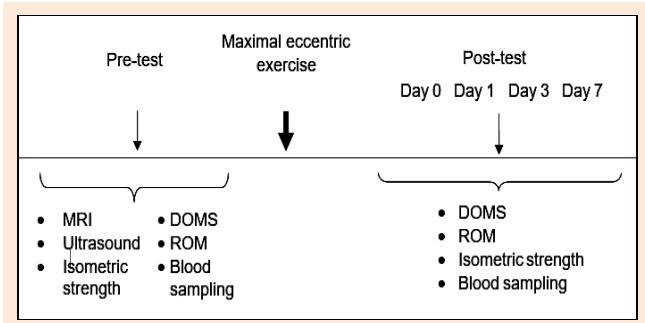
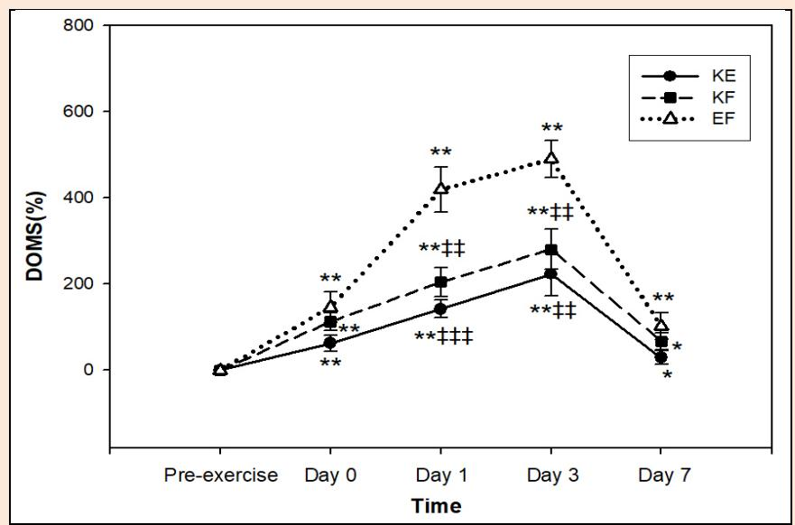
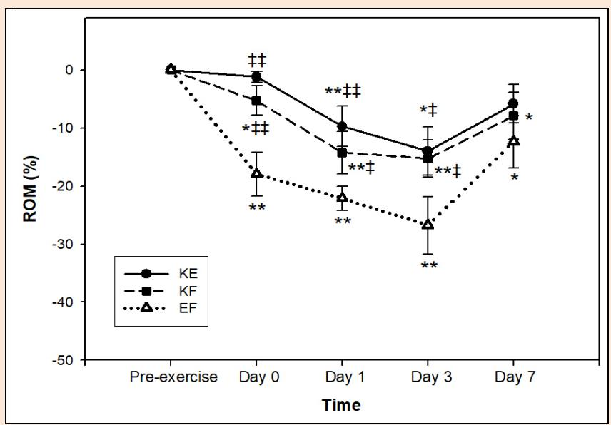
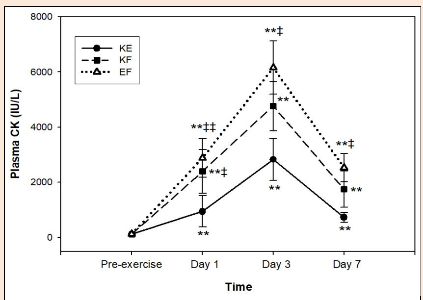
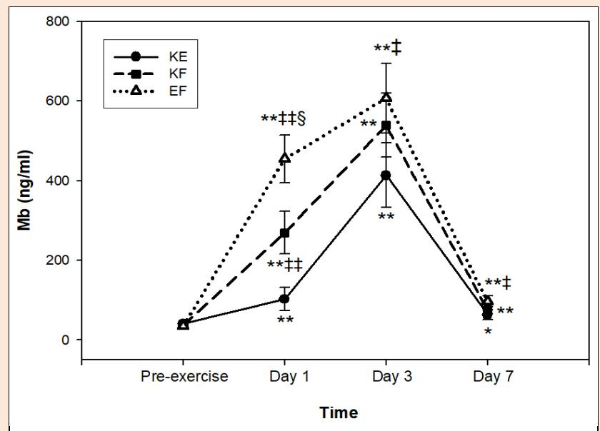
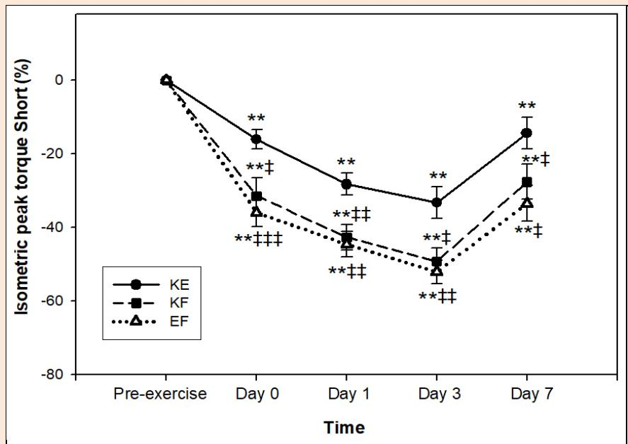
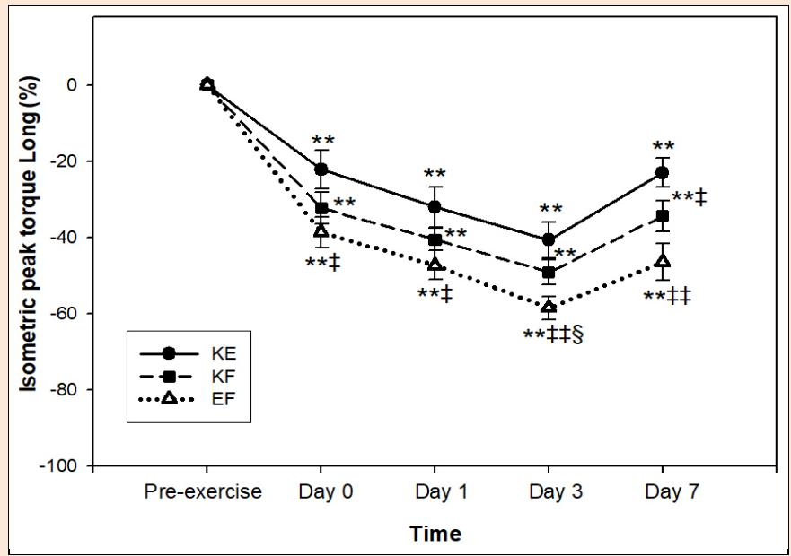

# Effects of Muscle Architecture on Eccentric Exercise Induced Muscle Damage Responses

Seher Çağdaş Şenışık 1, Bedrettin Akova 2, Ufuk Şekir 2 and Hakan Gür 2

1 Katip Çelebi University, Atatürk Training and Research Hospital, Izmir, Turkey
2 Department of Sports Medicine, Medical School of Bursa Uludag University, Bursa, Turkey

*Research article — Journal of Sports Science and Medicine (2021) 20, 655-664.*
*Received 26 March 2021 / Accepted 08 July 2021 / Published (online) 25 August 2021.*

## Abstract

There is a need to investigate the role of muscle architecture on muscle damage responses induced by exercise. The aim of this study was to determine the effect of muscle architecture and muscle length on eccentric exercise-induced muscle damage responses. Eccentric exercise-induced muscle damage was performed randomly to the elbow flexor (EF), knee extensor (KE) and knee flexor (KF) muscle groups with two week intervals in 12 sedentary male subjects. Before and after each eccentric exercise (immediately after, on the 1st, 2nd, 3rd, and 7th days) range of motion, delayed onset muscle soreness, creatine kinase activity, myoglobin concentration, and isometric peak torque in short and long muscle positions were evaluated. Furthermore, muscle volume and pennation angle of each muscle group were evaluated before initiating the eccentric exercise protocol. Pennation angle and the muscle volume were significantly higher and the workload per unit muscle volume was significantly lower in the KE muscles compared with the KF and EF muscles (p < 0.01). EF muscles showed significantly higher pain levels at post-exercise days 1 and 3 compared with the KE (p < 0.01 - 0.001) and KF (p < 0.01) muscles. The deficits in range of motion were higher in the EF muscles compared to the KE and KF muscles immediately after (day 0, p < 0.01), day 1 (p < 0.05 - 0.01), and day 3 (p < 0.05) evaluations. The EF muscles represented significantly greater increases in CK and Mb levels at days 1, 3, and 7 than the KE muscles (p < 0.05 - 0.01). The CK and Mb levels were also significantly higher in the KF muscles compared with the KE muscles (p < 0.05, p < 0.01 respectively). The KF and EF muscles represented higher isometric peak torque deficits in all the post-exercise evaluations at muscle short position (p < 0.05 - 0.001) compared with the KE muscle after eccentric exercise. Isometric peak torque deficits in muscle lengthened position was significantly higher in EF in all the post-exercise evaluations compared with the KE muscle (p < 0.05 - 0.01). According to the results of this study, it can be concluded that muscle structural differences may be one of the responsible factors for the different muscle damage responses following eccentric exercise in various muscle groups.

**Key words:** Muscle damage, pennation angle, eccentric exercise, quadriceps muscle, hamstring muscle, biceps brachii muscle.

## Introduction

Several studies (Brown et al., 1997; Hortobagyi et al., 1998; Newham et al., 1988; Nosaka et al., 1991; Paddon-Jones and Abernethy, 2001) in the literature used various muscle groups and exercise models to scrutinize muscle damage induced by eccentric exercise. Consequently, they reported that there might be differences in muscle damage responses. The authors of these studies suggested that the differences might be related to the daily usage of muscle groups, muscle architecture, and muscle fiber type. In a study by Chen et al. (2011), the muscle-damage responses originated from eccentric exercise on four different muscle groups (knee extensor [KE] and knee flexor [KF], elbow extensor [EE] and elbow flexor [EF]) were evaluated. They reported; 1) higher muscle-damage responses in elbow muscle groups than in knee muscle groups, 2) similar muscle damage indicators between elbow flexor and elbow extensor muscle groups, and 3) least sensitivity in knee extensor muscles following muscle damage induced by eccentric exercise. Jamurtas et al. (2005) suggested that the most likely reason for these differences would be dependent on the usage of these muscles in daily activities. According to results of both studies (Chen et al., 2011; Jamurtas et al., 2005), which have attempted to elucidate the muscle-damage responses between muscle groups, it is difficult to explain why muscle-damage indicators are different between the knee muscle groups while they are similar between two forearm muscle groups. In the study carried out by our research group (Saka et al., 2009), we also have investigated the reasons behind the muscle groups’ differences in responses to muscle damage. We have found that the workload per unit muscle was higher in elbow flexors than in knee extensors. Therefore, we have concluded that the reason for the differences in response to the muscle damage in different muscle groups could be the presence of potential structural differences between elbow flexor and knee extensor muscles.

Two studies (Friden, 1984; Jamurtas et al., 2000) suggested that, in response to muscle volume and muscle pennation angles, muscle architecture would be an essential factor in the formation of differences in muscle damage responses induced by eccentric exercise. Examining the muscle damage relationships in muscle groups with different architectures at lower and upper extremities by assessing their volumes and pennation angles, would be necessary for explaining the differences in muscle-damage responses. Knee flexor muscles and elbow flexor muscles are two muscle groups with fusiform architecture and mostly type II fiber dispersion, while the knee extensor muscles contain multi-pennate fiber orientation and are composed of type I muscle fibers (Klein et al., 2003; Travnik et al., 1995).

In the light of previous findings, this study firstly aimed to examine the effect of muscle architecture (muscle volume and pennation angle) on muscle damage induced by eccentric exercise in the knee and elbow flexors, and knee extensor muscles. Secondly, we aimed to determine the differences in muscle damage indicators originated from the knee flexor, elbow flexor, and knee extensor muscles after eccentric exercises. To determine upper-lower extremity, architecture, and volume differences on the parameters, these three muscle groups were chosen in the light of previous findings (Chen et al., 2011; Jamurtas et al., 2005; Klein et al., 2003; Saka et al., 2009; Travnik et al., 1995). In addition, to determine the effects of muscle length before contractions on the parameters, two angles (30° and 110°, knee and elbow full extension = 0°) of knee and elbow joints were chosen for the strength tests.

## Methods

### Participants

Twelve sedentary male subjects between 20 and 30 years of age were enrolled in the study. Before the maximal eccentric exercise test, physical examinations of the participants, including cardiovascular and musculoskeletal systems, were carried out by the physician. All participants with no health problems and who could tolerate maximum loadings without creating any health problems were included in the study. At the beginning of the study, participants were given detailed information about the study and signed the "Informed Volunteer Consent Form," which includes preliminary information about the test procedure and possible risks. This form was approved by the University's Medical Research Ethical Committee for Protection of Human Participants (Approval Number 2008-13/14).

### Study design

The tests were carried out in the same period (between 08:00 and 11:00) to avoid possible effects of the circadian rhythm on the results. Subjects did not take any medication and supplements throughout the study, and they were warned not to perform strenuous physical activities or use alcohol, tea, coffee, cigarette, etc. before or during the test days. Eccentric exercise-induced muscle damage was performed to the elbow flexor (EF), knee extensor (KE), and knee flexor (KF) muscle groups in the non-dominant limbs of the participants randomly. The non-dominant limb was determined by questioning the participants’ dominant arms (writing hand) and legs (leg used to kick the ball). Since muscle damage responses returned to basal levels at the end of two weeks, the time between the eccentric exercise sessions was two weeks. Figure 1 represents the study design.

> **[Figure 1]** Study design.

### Muscle Volume Measurements

The magnetic resonance imaging and muscle volume measurements for non-dominant EF, KE, and KF muscle groups were performed using a 1.5 - Tesla MR device (Siemens, Magnetom Vision Plus, Erlangen, Germany). T1-weighted spin-echo (POE) sequence was preferred in all measurements (TR: 540 - 720 msn, TE: 14 msn). The thickness of the parts for the arm and leg was 10 mm and 15 mm, respectively. The distance between parts was 1 mm at both sites. Participants were in a supine position and their hands and heels at the neutral position. To include all the knee extensor and flexor muscle groups, axial sections were obtained from the superior anterior iliac spine to the lower edge of the patella in the upper leg. Furthermore, the images on the upper arm were scanned for the forearm flexor muscles from the coracoid process to the lower level of humerus epicondyles. At all sections, the section sites at KE, KF, and EF muscle groups were manually marked as "region of interest" (ROI). Sites were identified as cm². Subsequently, the site at each axial section was multiplied by the distance between parts and the volume of the muscle groups was calculated in cm³ by summing up the results.

### Muscle pennation angle measurements

Muscle pennation angle measurements in the non-dominant EF (biceps brachii [BB], brachialis [BM], and brachioradialis [BR] muscles), KE (rectus femoris [RF], vastus medialis [VM], vastus lateralis [VL], vastus intermedius [VI]) and KF (biceps femoris [BF], semitendinosus [ST], semi membranosus [SM]) muscle groups were performed using an ultrasonographic device (Aplio 80 Toshiba, Japan) by a radiologist with a linear US probe with 7.5 MHz wave frequency.

US images were obtained for the BB and BM on the anterior part of the upper arm, 1 cm proximal to the elbow joint, for the BR on the anterior part of the upper arm, 1 cm proximal and lateral to the elbow joint, for the RF and VI at 60% of the thigh length from the upper patella line to the greater trochanter, for the VM at 30% of the thigh length from the upper patella line to the greater trochanter and slightly medially to the midline, for the VL in the middle between the patella and greater trochanter and slightly laterally to the midline, for the BF at 50% of thigh length, defined as the distance from the greater trochanter to the head of the fibula, for the ST at 50% of thigh length, defined as the distance from the ischial tuberosity to the popliteal crease, and lastly, for the SM at 60% of thigh length, defined as the distance from the ischial tuberosity to the popliteal crease. Pennation angle was determined from the insertion of the muscle fascicle to the deep aponeurosis. The average of the constituent muscles for each muscle group was calculated to represent the pennation angle for EF, KF, and KE muscle groups. Pennation angle measurements in all the individual muscles were performed twice by the same radiologist to calculate reliability. According to the intraclass correlation coefficient, the intra-observer coherence was 0.865 (p < 0.01).

### Isometric peak torque measurement

Isometric peak torque measurements of the elbow flexor, knee flexor, and knee extensor muscle groups were performed using an isokinetic dynamometer device (Humac Norm, USA). Tests were carried out on two different days to ensure the participants' adaptation to the tests. The isokinetic dynamometer was calibrated before each measurement.

The participants laid supine on the armchair of the isokinetic dynamometer during the isometric strength measurement of the elbow flexor muscle group. The elbow joint's rotation axis was set opposite to the center of the dynamometer's power shaft. Participants were fixed on the table using a bandage over the lumbar region. Participants were asked to perform four maximal contractions each for 5 seconds following three submaximal trials at elbow flexion angles of 30° (muscle in long position) and 110° (muscle in short position). Five-second breaks were given between each contraction, and participants were asked to inhale and exhale regularly.

The participants sat on the dynamometer's seat during the isometric peak torque measurements of the knee flexor and extensor muscles. The hip angle was at 90° of flexion, and the arms were crossed in front of their bodies. Participants were fixed using shoulder straps, a lap belt, a knee strap, and an ankle cuff. The rotation axis of the knee joint was set opposite to the center of the dynamometer's power shaft. The knee joint was positioned to 30° (quadriceps in short and hamstring in long position) and 110° (quadriceps in long and hamstring in short position) of flexion during knee extension and flexion isometric peak torque measurements. Participants were asked to perform four maximal contractions each for 5 seconds following three submaximal trials. Five-second breaks were given between each contraction, and participants were asked to inhale and exhale regularly.

### Exercise protocol to induce muscle damage

The muscle group to be exercised was randomly selected among the participants. The exercise session was started in three participants' knee flexor, five participants' knee extensor, and four participants' elbow flexor muscle groups. This was the case in six participants' knee flexor, four participants' knee extensor, and two participants' elbow flexor muscle groups at the second exercise session performed two weeks later. Finally, two weeks later, following the second exercise session, the knee flexors of three participants, the knee extensors of three participants, and the six participants' elbow flexors were exposed to eccentric exercise. The eccentric exercise protocol to induce muscle damage was applied on the isokinetic dynamometer (Humac Norm, USA). The participants were in a prone position during the setting for eccentric exercise in the knee flexor and extensor muscles and in a supine position for the elbow flexor, which was the same as the one used to determine isometric peak torque for elbow flexors. The exercise for all the muscle groups was performed in the active-assistive mode with concentric/eccentric actions.

While the knee joint was moved during the concentric phase, the participants were asked not to do any active contraction. Participants randomly performed a total of 60 maximal eccentric contractions (6 sets involving ten contractions, an angular speed of 60°/sec, and maximal work capacity) either for forearm flexor, knee extensor or knee flexor muscle groups. They were stimulated verbally during each contraction. Participants were rested for 1 minute between sets. The joint range of motion used during contractions for each muscle group was determined as 0° - 120° to standardize each muscle group's time under tension (Full extension = 0°).

The total workload at each repetition was recorded to be used later during calculations of load per unit volume. Work was calculated by multiplying the torque by the angle (work = torque x angular displacement). Work per repetition was attained by multiplying the eccentric torque that moves the extremity from 0° to 120° with the angular distance between these joint ranges of motion. Subsequently, the work performed for each of the ten repetitions was summed to calculate the work done in each set of the eccentric exercise protocol. The software of the dynamometer automatically calculated the work for each set. The total eccentric work (TW) was identified as the sum of the work in all the six exercise sets. The workload per unit muscle volume was calculated by dividing the TW by the total muscle volume obtained from MR measurements for each muscle group (TW [joule]/total muscle volume [cm³]).

### Biochemical analyses

Blood samples were taken from forearm antecubital veins with the help of a needle (0.18 x 40 mm, Vacutainer, England) and placed into plain (Vacutainer 16 x 100 mm, England) and hemogram tubes (Vacutainer 13 x 75 mm, England). The serum layer originated in the plain tube was removed and stored at -18°C in a freezer for further analyses. Plasma creatine kinase (CK) and myoglobulin (Mb) levels were measured from the blood samples. CK values were measured through the immunoassay method using Abbott Aeroset (USA) instrument, and Mb levels were measured through the immunoassay method using the Abbott Axsym System (USA). According to these methods, the standard reference interval for CK was 29 - 200 IU/L and for Mb was < 90 ng/mL.

### Evaluation of muscle pain (Delayed Onset of Muscle Soreness, DOMS)

Muscle pain was assessed with a method similar to that used in a study by Newton et al. (2008). A visual analog scale (VAS) with consecutive numbers from 0 to 10 was used ("no pain" on one end and "extremely sore" on the other). While participants lay back on an examination table and relaxed their muscles, the level of pain felt by squeezing and palpating the area between the origin and insertion of the elbow flexor, knee flexor, and knee extensor muscles during passive extension and flexion of the joint were questioned.

### Range of Motion (ROM) assessment

ROM was measured on the isokinetic dynamometer. ROM for the KF and KE muscles was performed while participants were prone and for the EF muscles while participants were supine. The strength handle placed on the relevant joint moved passively from full extension to flexion at an angular speed of 20°/sec to evaluate the KE and from full flexion to extension at the same rate to assess the KF and EF muscles. The joint angle where participants felt discomfort and pain was measured and recorded as painless ROM (Jamurtas et al., 2005).

### Statistical Analysis

Statistical analysis was performed using SPSS (SPSS Inc., Chicago, IL, USA, version 23.0) software. Mean (standard error of the mean) was used in the definitions of all variables. The statistical significance level was considered as p < 0.05. Percent change values were calculated to assess the alterations between baseline (pre-exercise) and follow-up periods (immediately post-exercise, post-exercise day 1, day 3, and day 7). The formula "[(after - before) / before x 100]" was used in the percentage change calculations. Mixed way analysis of variance (Mixed-ANOVA; group x time) with repeated measurements on time was used to test anthropometric, muscle strength, DOMS, ROM, and indices of muscle damage data. Pairwise comparisons were performed through the Bonferroni test when significant interactions were observed.

## Results

### Participant characteristics

Table 1 shows the demographic characteristics of the participants. Muscle volume, pennation angle, total work values obtained during eccentric exercise, and the workload per unit muscle volume obtained from these measurements for the KE, KF, and EF are presented in Table 2. Pennation angle, muscle volume, and total work of the knee extensor muscles were significantly higher than the knee and elbow flexor muscles (p < 0.01). Furthermore, the pennation angle, muscle volume, and total work of the knee flexor muscles were significantly higher than the elbow flexors (p < 0.01). The workload per unit muscle volume was also considerably lower in the knee extensor muscles compared with the knee and elbow flexor muscles (p < 0.01).

**Table 1.** Demographic characteristics of participants (n = 12).

|             | Mean (SEM)  | Minimum - Maximum |
|-------------|-------------|-------------------|
| Age         | 25.6 (1.0)  | 20 - 30           |
| Height (cm) | 1.74 (0.02) | 1.65 - 1.87       |
| Weight (kg) | 77.5 (2.8)  | 62.5 - 96         |
| Body fat (%)| 14.3 (0.9)  | 10 - 19           |

SEM = Standard error of mean

**Table 2.** Structural characteristics of the muscle groups. Data are presented as means (SEM).

|                                              | KE          | KF            | EF             |
|----------------------------------------------|-------------|---------------|----------------|
| Pennation angle (°)                          | 11.6 (0.2)  | 1.3 (0.1) *   | 0.9 (0.1) *#   |
| Muscle volume (cm³)                          | 1984 (38)   | 754 (38) *    | 390 (15) *#    |
| Total work (joule)                           | 5737 (327)  | 2669 (198) *  | 1667 (113) *#  |
| Workload per unit muscle volume (Joule/cm³)  | 2.9 (0.2)   | 3.6 (0.3) *   | 4.3 (0.3) *    |

KE: Knee extensor, KF: Knee flexor, EF: Elbow flexor. \* p < 0.01 compared with KE, # p < 0.01 compared with KF.

### DOMS and ROM

Percent change in pain level was significantly higher on all the post-exercise evaluations compared with baseline in all the three muscle groups (p < 0.05 - 0.01, Figure 2). When the percent change values at the follow-ups between the three groups were scrutinized, it was evident that EF muscles showed significantly higher pain levels at post-exercise days 1 and 3 compared with the KE (p < 0.01 - 0.001) and KF (p < 0.01) muscles (Figure 2). No significant differences were found between the muscle groups immediately (day 0) and seven days after (day 7) eccentric exercise (p > 0.05).

> **[Figure 2]** Changes in muscle soreness (DOMS) from the pre-exercise level following eccentric exercise of the knee extensor (KE), knee flexor (KF) and elbow flexor (EF) muscles. * p < 0.05 and ** p < 0.01 indicates significant difference compared with the baseline (pre-exercise). ‡‡ p < 0.01 and ‡‡‡ p < 0.001 indicates significant difference compared with EF. The symbols (●, ■, ∆) and their error bars denote mean and SEM.

The normalized ROM deficits due to soreness in each of the muscle groups are represented in Figure 3. ROM for the three muscle groups showed significant reductions in all the post-exercise evaluations (p < 0.05 - 0.01), except the KE on day 7 (p > 0.05). Furthermore, the deficits were higher in the EF muscles compared to the KE and KF muscles immediately after (day 0, p < 0.01), day 1 (p < 0.05 - 0.01), and day 3 (p < 0.05) evaluations. ROM was similar between the muscles on day 7 (p > 0.05).

> **[Figure 3]** Normalized changes in painless range of motion (ROM) deficits from the pre-exercise level (0%) following eccentric exercise of the knee extensor (KE), knee flexor (KF) and elbow flexor (EF) muscles. * p < 0.05 and ** p < 0.01 indicates significant difference compared with the baseline (pre-exercise). ‡ p < 0.05 and ‡‡ p < 0.01 indicates significant difference compared with EF. The symbols (●, ■, ∆) and their error bars denote mean and SEM.

### CK and Mb Levels

Figures 4 and 5 display the changes in creatine kinase (CK) and myoglobulin (Mb) levels developed after the eccentric exercise intervention in the three muscle groups. The CK and Mb exhibited significant increases in the follow-up analyses compared to the baseline level in all the three muscle groups (p < 0.05 - 0.01). The EF muscles represented significantly greater increases in CK and Mb levels on days 1, 3, and 7 than the KE muscles (p < 0.05 - 0.01). Additionally, the CK levels were also significantly higher in the KF muscles compared with the KE muscles (p < 0.05). Furthermore, the Mb levels were significantly higher in the KF muscles compared with the KE muscles (p < 0.01) and significantly higher in the EF muscles compared with the KF muscles (p < 0.05) on day 1.

> **[Figure 4]** Changes in plasma creatine kinase (CK) levels during follow-up after eccentric exercise compared to pre-exercise level of the knee extensor (KE), knee flexor (KF) and elbow flexor (EF) muscles. ** p < 0.01 indicates significant difference from the baseline (pre-exercise). ‡‡ p < 0.01 and ‡‡‡ p < 0.001 indicates significant difference from KE. The symbols (●, ■, ∆) and their error bars denote mean and SEM.

> **[Figure 5]** Changes in plasma myoglobulin (Mb) levels during follow-up after eccentric exercise compared to pre-exercise level of the knee extensor (KE), knee flexor (KF) and elbow flexor (EF) muscles. * p < 0.05 and ** p < 0.01 indicates significant difference compared with the baseline (pre-exercise). ‡‡ p < 0.01 and ‡‡‡ p < 0.001 indicates significant difference compared with KE. § p < 0.05 indicates significant difference compared with KF. The symbols (●, ■, ∆) and their error bars denote mean and SEM.

### Isometric Peak Torque

The pre-exercise mean (SD) isometric peak torques for the KE, KF, and EF was 162 (9.3) Nm, 101.8 (7.3) Nm and 57.4 (3.6) Nm at muscle's long position and was 120 (8.6) Nm, 30.9 (2.8) Nm and 45.3 (2.4) Nm at muscle's short position, respectively. All these muscles exhibited significant peak torque declines in all follow-up evaluations for the two joint angles and did not return to baseline levels, even on the 7th day (Figure 6 and 7, p < 0.01). Besides, the KF and EF muscles represented higher peak torque deficits in all the post-exercise evaluations at muscle short position (p < 0.05 - 0.001, Figure 6) compared with the KE muscle. On the other hand, while there were no significant differences between the KF and KE muscle groups in the long position (except for a higher decrease in KF compared to KE at post-exercise day 7), the EF still represented significant higher torque deficits in all the post-exercise evaluations compared with the KE muscle (p < 0.05 - 0.01, Figure 7).

> **[Figure 6]** Normalized changes in isometric peak torque at muscle short position from the pre-exercise level (0%) following eccentric exercise of the knee extensor (KE), knee flexor (KF) and elbow flexor (EF) muscles. ** p < 0.01 indicates significant difference compared with the baseline (pre-exercise). ‡ p < 0.05, ‡‡ p < 0.01 and ‡‡‡ p < 0.001 indicates significant difference compared with KE. The symbols (●, ■, ∆) and their error bars denote mean and SEM.

> **[Figure 7]** Normalized changes in isometric peak torque at muscle long position from the pre-exercise level (0%) following eccentric exercise of the knee extensor (KE), knee flexor (KF) and elbow flexor (EF) muscles. ** p < 0.01 indicates significant difference compared with the baseline (pre-exercise). ‡ p < 0.05 and ‡‡ p < 0.01 indicates significant difference compared with KE. § p < 0.05 indicates significant difference compared with KF. The symbols (●, ■, ∆) and their error bars denote mean and SEM.

## Discussion

The primary purpose of this study was to investigate whether eccentric exercise-induced muscle damage would have different effects on different types of muscle architectures. In brief, the results of this study, which was carried out in healthy sedentary male participants, revealed that all the three muscle groups exhibit significant (a) subjective pain (DOMS) and plasma CK and Mb level increases and (b) ROM and isometric peak torque decreases in all follow-up evaluations following eccentric exercise-induced muscle damage. The workload per muscle volume during the eccentric exercise was significantly higher in the KF and EF muscles than in the KE muscles. Consequently, eccentric exercise-related changes occurred significantly less in the KE muscles than in the other two muscle groups. Muscle strength reductions were noticeably less frequent in the KE muscles compared to KF muscle when the muscle length was to a certain extent longer compared with the shorter position.

The present study results are consistent with previous studies investigating eccentric exercise-induced muscle damage responses of the elbow flexor and knee extensor muscle groups (Jamurtas et al., 2005; Saka et al., 2009). Similar to these studies, the current study reveals higher muscle damage responses in the elbow flexors than the knee extensors. Jamurtas et al. (2005) suggested that the potential cause of different muscle damage responses between the knee extensor and elbow flexor muscles may be the effect of natural training loads due to daily use between the extremities. Saka et al. (2009) estimated the muscle volumes of the knee extensor and elbow flexor muscle groups using MRI and calculated the workload per muscle volume unit by using the total work done by each muscle group during eccentric exercise. They stated a more exciting perspective by showing that the workload per muscle volume unit was higher in the elbow flexors. In the study by Chen et al. (2011), the eccentric exercise-induced muscle damage responses were investigated on four different muscle groups (knee extensors and knee flexors, elbow extensors and elbow flexors). Chen et al. (2011) indicated that muscle damage was greater in elbow flexor and extensor muscles and the least sensitive muscles to injury were the knee extensor muscles. In the studies mentioned above, the muscle damage in knee extensors was found that it is less than found in knee flexors, which is similar to the findings of the present study.

Although the muscle damage indicators following eccentric exercise were similar between the flexor muscles of the elbow and knee joints in the present study, Chen et al. (2011) reported a higher response in the elbow flexors than in the knee flexors. Besides, the alterations in CK, Mb, and isometric strength levels following eccentric exercise among the three muscles were lower in the study by Chen et al. (2011) than observed in the present study. The participants were in the sitting position, and the joint range was 0-90° during the eccentric exercise protocol applied to the four muscles in the study by Chen et al. (2011). On the contrary, the joint range was adjusted between 0 and 120°, and the participants were in a lying position during the eccentric exercise protocol in the present study. Several studies demonstrated that eccentric exercise applied to muscles in different muscle fiber lengths would lead to different muscle damage responses (Hunter and Faulkner, 1997; Jones et al., 1989; Macpherson et al., 1997; Nosaka and Sakamoto, 2001). We believe that the eccentric exercise applied in a wide joint range of motion (0 - 120°) in the present study allowed the muscles to be exposed to a higher maximal eccentric workload.

Interestingly, isometric strength loss among the muscle groups was significantly affected by test angle, in other words by muscle length, with the lesser difference between muscles in a longer length and more strength loss difference in KF and EF muscles than KE muscles in shorter muscle lengths. According to the sarcomere strain theory during eccentric exercise, the intact sarcomeres transform to a shorter length following muscle damage. Therefore, strength loss during an extended muscle would be expected. Although not analyzed in the present study, it was also the case in our study that all three muscle groups exhibited higher muscle strength deficits in longer muscle length. However, the strength deficits in the KF and EF muscles were more apparent compared to the KE muscles in the shorter muscle length. Knee extension strength loss after eccentric exercise was lower at 110° (extended length) than at 30° of knee flexion angle in the study of McHugh and Tetro (2003). Our findings are consistent with the results of the study by McHugh and Tetro (2003).

Several studies (Crameri et al., 2007; Dudley et al., 1997; Franklin et al., 1993), which investigated the differences in muscle damage outputs of knee extensor and flexor muscles to eccentric exercise, showed that muscle damage, similar to the present study, develops more in knee flexor muscles compared with knee extensor muscles after eccentric exercise. In the light of these findings, it is possible to speculate that the knee flexor muscles are more responsive to muscle damage originating from eccentric exercise. On the other hand, Chen et al. (2011) distinctively compared the changes between elbow flexor and elbow extensor muscles following eccentric exercise-induced muscle damage. They did not find apparent differences between the muscles, and the authors expressed that both muscles have the same or similar responsiveness to muscle damage originating from eccentric exercise. While the responses following eccentric exercise-induced muscle damage are different between arm and leg muscles and between knee flexor and knee extensor muscles, why it is similar between elbow flexor and elbow extensor muscles is still a question waiting to explain. The study mentioned above suggested that the possible reasons for the differences in the dimension of muscle damage between leg (knee flexor and knee extensor) and arm muscles (elbow flexor and elbow extensor) could be explained as being exposed to different levels of eccentric contractions during daily activities. In general, because of walking downhill or descending stairs, the leg muscles are more exposed to eccentric contractions in daily activities compared to the arm muscles. From this point of view, accepting that knee extensors and knee flexors are more trained for muscle damage due to eccentric exercises during daily activities seems logical.

Furthermore, even when well-trained individuals perform an exercise new for them; they may experience muscle pain and muscle damage (Jamurtas et al., 2000). Besides, in a study by Vincent and Vincent (1997), trained athletes established more muscle pain than untrained athletes, but the decrease in muscle strength following strenuous exercise was similar. Moreover, no study has analyzed the activity of the extremity muscles quantitatively during daily activities (Chen et al., 2011; Jamurtas et al., 2005; Saka et al., 2009). It was also demonstrated in another study (Newton et al., 2013) that the extent of muscle damage indicators between the dominant and non-dominant arm flexor muscles are not different after an eccentric exercise. It may be speculated that the large-sized muscles are less responsive to muscle damage resulting from eccentric exercise compared with small-sized muscles. On the other hand, it is also known that larger muscles must be subjected to greater stress to get tired (Hoeger et al., 1987; Hoeger et al., 1990).

Interestingly, the muscle damage responses of elbow flexor and knee extensor muscles after eccentric exercise were evaluated in older adults, and the difference between the elbow flexors and knee extensors was found fewer when compared with younger individuals (Nogueira et al., 2014). The studies (Grimby et al., 1982; Aniansson et al., 1986; Frontera et al., 2000; Lynch et al., 1999) showed a greater morphological alteration and more decline in muscle strength of the lower extremity muscles than the upper extremity muscles with increasing age. When this knowledge is taken into consideration, it is possible to express that using the arm and leg muscles differently in daily activities alone would not be a sufficient reason to elucidate the different responses in muscle damage. At the same time, no differences were found in many parameters used to evaluate muscle damage responses of the knee and elbow flexor muscle groups in the present study. Variations in muscle fiber length, fiber type, and muscle architecture would be the reason for the various muscle damage responses between muscles other than being subjected to eccentric contractions in daily activities. It is known that muscle architecture (i.e., fusiform like the biceps or multipennate like the quadriceps muscle) is a factor affecting muscle damage findings originating after eccentric exercise (Friden, 1984). It is also known that fusiform muscles are more sensitive to muscle damage following eccentric exercise than muscles with more pennation.

Moreover, when fiber type is considered, it was reported that type II muscle fibers are more sensitive to muscle damage following an eccentric exercise than type I muscle fibers (Jamurtas et al., 2000; Friden, 1984). Knee and elbow flexor muscles are two muscle groups with fusiform architecture and mostly with type II fiber distribution (Klein et al., 2003). On the other hand, the knee extensor muscles have a multi-pennate architecture and are usually comprised of type I muscle fibers (Travnik et al., 1995). The training effect of daily activities was explored in the literature using two similar muscle groups in the lower and upper extremities. The impact of muscle architecture, however, was evaluated by studying muscle groups with different architecture. Muscle volume and the workload per unit of muscle volume obtained using total work during eccentric exercise were found to be similar in knee flexor and elbow flexor muscle groups in the present study. The workload per unit of muscle volume was found significantly higher in both muscles than in the knee extensor muscles.

Furthermore, the pennation angle of knee extensor muscles (11.6°) was found significantly higher than of knee (1.3°) and elbow (0.9°) flexor muscles in the present study. When assessed from this viewpoint, it is possible to say that, rather than knee extensor muscles, the muscle architecture between the knee and elbow flexor muscles are similar. Saka et al. (2009) hypothesized that pennate muscles, like the knee extensors, with large physiological cross-sectional areas, would probably have lower mechanical strain per muscle unit than fusiform muscles, like the elbow flexors, during a maximal voluntary contraction. According to this theory, the results of the present study having lower pain perception, higher painless range of motion, reduced increases in plasma CK and Mb levels, and limited decreases in isometric strength in the knee extensor muscles compared with the knee and elbow flexor muscles support the hypothesis suggested by Saka et al. (2009). The workload per unit muscle volume was significantly lower in the knee extensors (2.9 J/cm³) compared to the knee (3.6 J/cm³) and elbow (4.3 J/cm³) flexors in the present study. We think that the difference in muscle architecture between the knee extensor and knee and elbow flexor muscles might be led to the difference in workload during the eccentric exercise.

### Limitations

The low number of the study population is one of the limitations of the present study. The other limitation is that no histopathological and muscle fiber type evaluation was performed in the study. It would be valuable if it could be examined whether this is different in muscles with more or less pennation angle.

## Conclusion

Finally, with the results of this study, it can be concluded that the different muscle damage responses between knee extensor and elbow flexor muscle groups on the same individuals through eccentric exercise depend on the muscles' structural differences. To elucidate the differences in the magnitude and progress of muscle damage responses developing after eccentric exercises more definitely, further studies involving diverse exercise types, intensities, and muscle biopsies are needed.

## Key points

- The upper extremity flexor muscles are more affected by eccentric exercise induced muscle damage, either they are in a shortened or lengthened position.
- Loss of peak torque due to eccentric exercise induced muscle damage is observed at different levels in the joint range of motion where the muscles are lengthened or shortened.
- The workload per unit muscle volume during eccentric contraction is higher in muscles having a longitudinal fiber orientation compared to pennate muscles, which is a possible reason for the increased incidence of muscle damage.

## Acknowledgements

The experiments comply with the current laws of the country in which they were performed. The authors have no conflict of interest to declare. The datasets generated during and/or analyzed during the current study are not publicly available, but are available from the corresponding author who was an organizer of the study.

## References

Aniansson, A., Hedberg, M., Henning, G.B. and Grimby, G. (1986) Muscle morphology, enzymatic activity, and muscle strength in elderly men: a follow-up study. *Muscle & Nerve* 9, 585-591. https://doi.org/10.1002/mus.880090702

Brown, S.J., Child, R.B., Day, S.H. and Donnelly, A.E. (1997) Indices of skeletal muscle damage and connective tissue breakdown following eccentric muscle contractions. *European Journal of Applied Physiology* 75, 369-374. https://doi.org/10.1007/s004210050174

Chen, T.C., Lin, K.L., Chen, H.L., Lin, M.J. and Nosaka, K. (2011) Comparison in eccentric exercise-induced muscle damage among four limb muscles. *European Journal of Applied Physiology* 111, 211-223. https://doi.org/10.1007/s00421-010-1648-7

Crameri, R.M., Aagaard, P., Qvortrup, K., Langberg, H., Olesen, J. and Kjær, M. (2007) Myofibre damage in human skeletal muscle: effects of electrical stimulation versus voluntary contraction. *The Journal of Physiology* 583, 365-380. https://doi.org/10.1113/jphysiol.2007.128827

Dudley, G.A., Czerkawski, J., Meinrod, A., Gillis, G., Baldwin, A. and Scarpone, M. (1997) Efficacy of naproxen sodium for exercise-induced dysfunction muscle injury and soreness. *Clinical Journal of Sports Medicine* 7, 3-10. https://doi.org/10.1097/00042752-199701000-00002

Franklin, M.E., Chamness, M.S., Chenier, T.C., Mosteller, G.C. and Barrow, L.A. (1993) A comparison of isokinetic eccentric exercise on delayed onset muscle soreness and creatine kinase in the quadriceps versus the hamstrings. *Isokinetics and Exercise Science* 3, 68-73. https://doi.org/10.3233/IES-1993-3201

Friden, J. (1984) Changes in human skeletal muscle induced by long term eccentric exercise. *Cell and Tissue Research* 236, 365-372. https://doi.org/10.1007/BF00214240

Grimby, G., Danneskiold-Samsoe, B., Hvid, K. and Saltin, B. (1982) Morphology and enzymatic capacity in arm and leg muscles in 78-81 year old men and women. *Acta Physiologica Scandinavica* 115, 125-134. https://doi.org/10.1111/j.1748-1716.1982.tb07054.x

Frontera, W.R., Hughes, V.A., Fielding, R.A., Fiatarone, M.A., Evans, W.J. and Roubenoff, R. (2000) Aging of skeletal muscle: a 12-yr longitudinal study. *Journal of Applied Physiology* 88, 1321-1326. https://doi.org/10.1152/jappl.2000.88.4.1321

Hoeger, W.W.K., Barette, S.L., Hale, D.P. and Hopkins, D.R. (1987) Relationship between repetitions and selected percentages of one repetition maximum. *Journal of Applied Sport Science Research* 1, 11-13. https://doi.org/10.1519/00124278-198702000-00002

Hoeger, W.W.K., Hopkins, D.R., Barette, S.L. and Hale, D.P. (1990) Relationship between repetitions and selected percentages of one repetition maximum: a comparison between untrained and trained males and females. *Journal of Applied Sport Science Research* 4, 47-54. https://doi.org/10.1519/00124278-199005000-00004

Hortobagyi, T., Houmard, J., Fraser, D., Dudek, R., Lambert, J. and Tracey, J. (1998) Normal forces and myofibrillar disruption after repeated eccentric exercise. *Journal of Applied Physiology* 82, 492-498. https://doi.org/10.1152/jappl.1998.84.2.492

Hunter, K.D. and Faulkner, J.A. (1997) Plyometric contraction-induced injury of mouse skeletal muscle: effect of initial length. *Journal of Applied Physiology* 82, 278-283. https://doi.org/10.1152/jappl.1997.82.1.278

Jamurtas, A.Z., Fatouros, I.G., Buckenmeyer, P., Kokkinidis, E., Kambas, A. and Kyriazis, G. (2000) Effects of plyometric exercise on muscle soreness and plasma creatine kinase levels and its comparison with eccentric and concentric exercise. *The Journal of Strength and Conditioning Research* 14, 68-74. https://doi.org/10.1519/00124278-200002000-00012

Jamurtas, A.Z., Theocharis, V., Tofas, T., Tsiokanos, A., Yfanti, C., Paschalis, V., Koutedakis, Y. and Nosaka, K. (2005) Comparison between leg and arm eccentric exercises of the same relative intensity on indices of muscle damage. *European Journal of Applied Physiology* 95, 179-185. https://doi.org/10.1007/s00421-005-1345-0

Jones, D.A., Newham, D.J. and Torgan, C. (1989) Mechanical influences on long-lasting human muscle fatigue and delayed-onset pain. *The Journal of Physiology* 412, 415-427. https://doi.org/10.1113/jphysiol.1989.sp017624

Klein, C.S., Marsh, G.D., Petrella, R.J. and Rice, C.L. (2003) Muscle fiber number in the biceps brachii muscle of young and old men. *Muscle & Nerve* 28, 62-68. https://doi.org/10.1002/mus.10386

Lynch, N.A., Metter, E.J., Lindle, R.S., Fozard, J.L., Tobin, J.D., Roy, T.A., Fleg, J.L. and Hurley, B.F. (1999) Muscle quality. I. Age-associated differences between arm and leg muscle groups. *Journal of Applied Physiology* 86, 188-194. https://doi.org/10.1152/jappl.1999.86.1.188

Macpherson, P.C., Dennis, R.G. and Faulkner, J.A. (1997) Sarcomere dynamics and contraction-induced injury to maximally activated single muscle fibers from soleus muscles of rats. *The Journal of Physiology* 500, 523-533. https://doi.org/10.1113/jphysiol.1997.sp022038

McHugh, M.P. and Tetro, D.T. (2003) Changes in the relationship between joint angle and torque production associated with the repeated bout effect. *Journal of Sports Sciences* 21, 927-932. https://doi.org/10.1080/0264041031000140400

Newham, D.J., Jones, D.A., Ghosh, G. and Aurora, P. (1988) Muscle fatigue and pain after eccentric contractions at long and short length. *Clinical Science* 74, 553-557. https://doi.org/10.1042/cs0740553

Newton, M.J., Morgan, G.T., Sacco, P., Chapman, D.W. and Nosaka, K. (2008) Comparison of responses to strenuous eccentric exercise of the elbow flexors between resistance-trained and untrained men. *Journal of Strength and Conditioning Research* 22, 597-607. https://doi.org/10.1519/JSC.0b013e3181660003

Newton, M.J., Sacco, P., Chapman, D. and Nosaka, K. (2013) Do dominant and non-dominant arms respond similarly to maximal eccentric exercise of the elbow flexors? *Journal of Science and Medicine in Sport* 16, 166-171. https://doi.org/10.1016/j.jsams.2012.06.001

Nogueira, F.R.D., Libardi, C.A., Nosaka, K., Vechin, F.C., Cavaglieri, C.R. and Chacon-Mikahil, M.P.T. (2014) Comparison in responses to maximal eccentric exercise between elbow flexors and knee extensors of older adults. *Journal of Science and Medicine in Sport* 17, 91-95. https://doi.org/10.1016/j.jsams.2013.02.002

Nosaka, K., Clarkson, P.M. and Apple, F.S. (1991) Time course of serum protein changes after strenuous exercise of the forearm flexors. *Journal of Laboratory and Clinical Medicine* 119, 183-188.

Nosaka, K. and Sakamoto, K. (2001) Effect of elbow joint angle on the magnitude of muscle damage to the elbow flexors. *Medicine & Science in Sports & Exercise* 33, 22-29. https://doi.org/10.1097/00005768-200101000-00005

Paddon-Jones, D. and Abernethy, P.J. (2001) Acute adaptation to low volume eccentric exercise. *Medicine & Science in Sports & Exercise* 33, 1213-1219. https://doi.org/10.1097/00005768-200107000-00021

Saka, T., Akova, B., Yazici, Z., Sekir, U., Gür, H. and Ozarda, Y. (2009) Difference in the magnitude of muscle damage between elbow flexors and knee extensors eccentric exercises. *Journal of Sports Science and Medicine* 8, 107-115. https://pubmed.ncbi.nlm.nih.gov/24150563/

Travnik, L., Pernus, F. and Erzen, I. (1995) Histochemical and morphometric characteristics of the normal human vastus medialis longus and vastus medialis obliquus muscles. *Journal of Anatomy* 187, 403-411.

Vincent, H.K. and Vincent, K.R. (1997) The effect of training status on the serum creatine kinase response, soreness and muscle function following resistance exercise. *International Journal of Sports Medicine* 18, 431-437. https://doi.org/10.1055/s-2007-972660

## Author biographies

**Seher Çağdaş ŞENIŞIK**
Employment: Katip Çelebi University, Atatürk Training and Research Hospital, Izmir, Turkey
Degree: MD
Research interests: Sports injuries and rehabilitation.
E-mail: cagdassnsk@gmail.com

**Bedrettin AKOVA**
Employment: Prof., Medical School of Uludag University, Department of Sports Medicine, Bursa
Degree: MD
Research interests: Sports injuries and rehabilitation, sports-related knee injuries, athlete's heart, chronic diseases and exercise
E-mail: bakova@uludag.edu.tr

**Ufuk ŞEKIR**
Employment: Prof., Medical School of Bursa Uludag University, Department of Sports Medicine, Bursa, Turkey
Degree: MD
Research interests: Sports injuries and rehabilitation, proprioception, surface EMG evaluation, chronic diseases and exercise, musculoskeletal ultrasound
E-mail: ufuksek@hotmail.com

**Hakan GÜR**
Employment: Prof., Medical School of Bursa Uludag University, Department of Sports Medicine, Bursa, Turkey
Degree: MD, PhD
Research interests: Sports injuries and rehabilitation, isokinetic and exercise, aging and exercise, chronic diseases and exercise.
E-mail: hakan@uludag.edu.tr

**✉ Corresponding author:** Bedrettin Akova, Department of Sports Medicine, Medical School of Bursa Uludag University, Bursa, Turkey.
