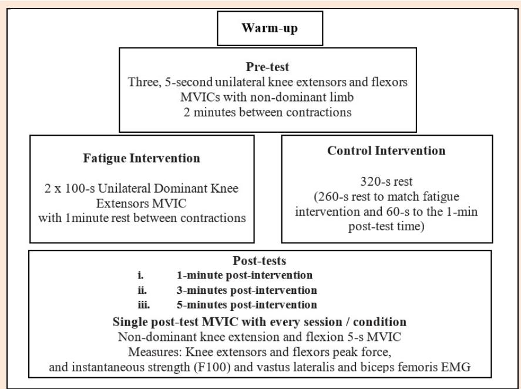
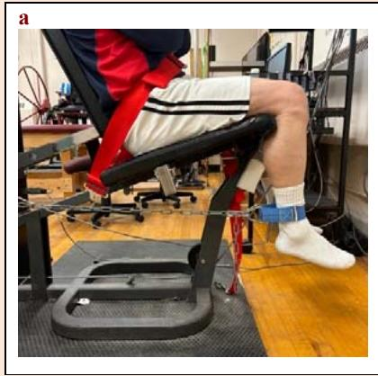
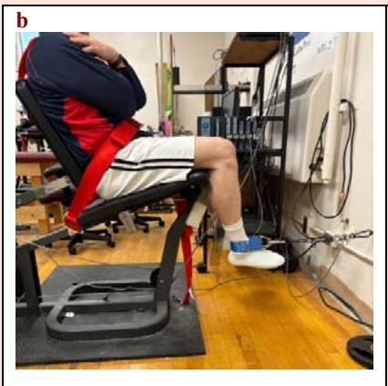
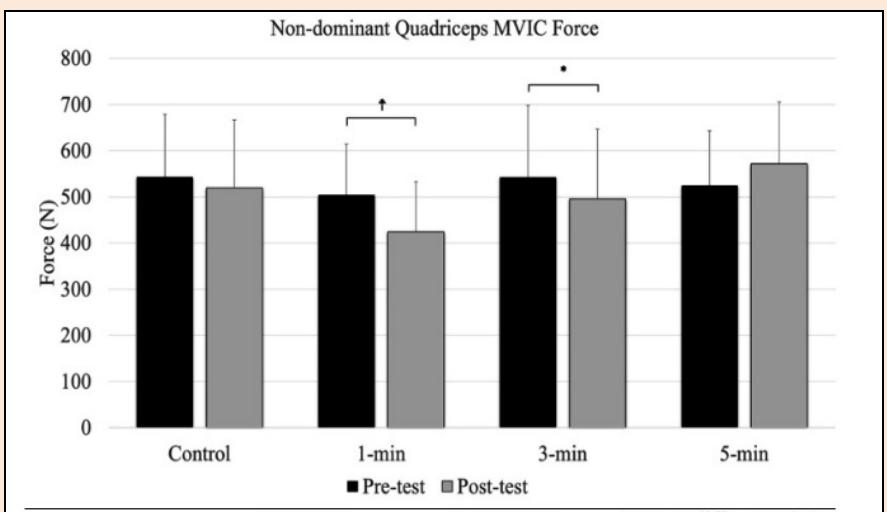
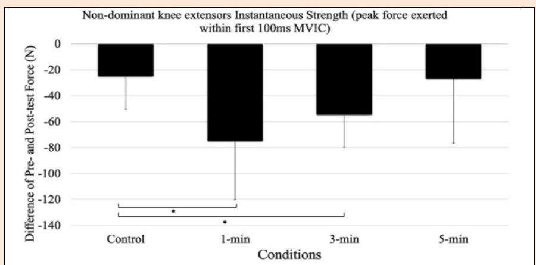
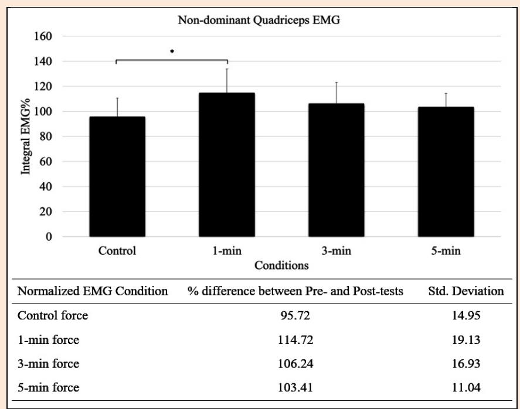
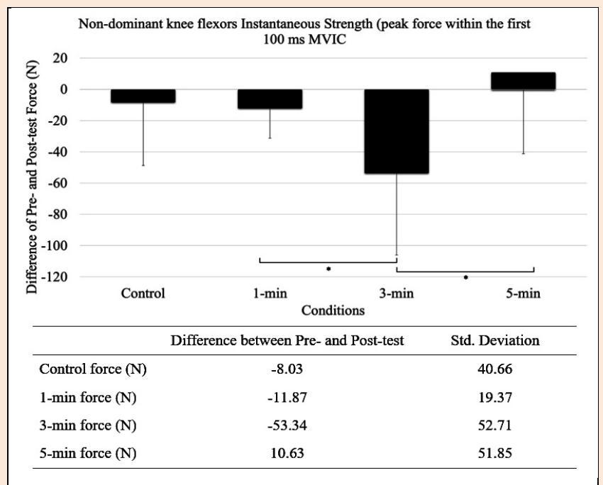
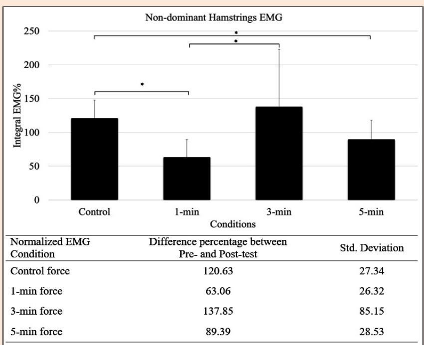

# The Duration of Non-Local Muscle Fatigue Effects

Ali Zahiri 1, Reza Goudini 1, Shahab Alizadeh 1,2, Abdolhamid Daneshjoo 3, Mohamed MI Mahmoud 1, Andreas Konrad 1,4, Urs Granacher 5 and David G Behm 1 ✉

1 School of Human Kinetics and Recreation, Memorial University of Newfoundland, St. John's, Newfoundland and Labrador, Canada; 2 Department of Kinesiology, University of Calgary, Calgary, Alberta, Canada; 3 Department of Sport Injuries and Corrective Exercises, Faculty of Sport Sciences, Shahid Bahonar University of Kerman, Kerman, Iran. 4 Institute of Human Movement Science, Sport and Health, Graz University, Graz, Austria; 5 University of Freiburg, Department of Sport and Sport Science, Exercise and Human Movement Science, Freiburg, Germany

## Abstract

Non-local muscle fatigue (NLMF) refers to a transient decline in the functioning of a non-exercised muscle following the fatigue of a different muscle group. Most studies examining NLMF conducted post-tests immediately after the fatiguing protocols, leaving the duration of these effects uncertain. The aim of this study was to investigate the duration of NLMF (1-, 3-, and 5-minutes). In this randomized crossover study, 17 recreationally trained participants (four females) were tested for the acute effects of unilateral knee extensor (KE) muscle fatigue on the contralateral homologous muscle strength, and activation. Each of the four sessions included testing at either 1-, 3-, or 5-minutes post-test, as well as a control condition for non-dominant KE peak force, instantaneous strength (force produced within the first 100-ms), and vastus lateralis and biceps femoris electromyography (EMG). The dominant KE fatigue intervention protocol involved two sets of 100-seconds maximal voluntary isometric contractions (MVIC) separated by 1-minute of rest. Non-dominant KE MVIC forces showed moderate and small magnitude reductions at 1-min (p < 0.0001, d = 0.72) and 3-min (p = 0.005, d = 0.30) post-test respectively. The KE MVIC instantaneous strength revealed large magnitude, significant reductions between 1-min (p = 0.021, d = 1.33), and 3-min (p = 0.041, d = 1.13) compared with the control. In addition, EMG data revealed large magnitude increases with the 1-minute versus control condition (p = 0.03, d = 1.10). In summary, impairments of the non-exercised leg were apparent up to 3-minutes post-exercise with no significant deficits at 5-minutes. Recovery duration plays a crucial role in the manifestation of NLMF.

Key words: Crossover fatigue, contralateral muscles, homologous muscles, isometric, recovery.

## Introduction

Crossover fatigue (effects on homologous contralateral muscles) and non-local muscle fatigue (NLMF: effects on homologous or heterologous contralateral muscles) occur when unilateral fatigue of a muscle group induces a performance reduction (e.g., force, power, or endurance) in non-exercised contralateral muscle groups (Halperin et al. 2015, Behm et al. 2021). The first narrative review investigating NLMF reported contralateral force deficits in 32 of 58 (55%) measures with more frequent impairments occurring with unilateral lower limb fatigue interventions (76% of measures) than with the upper limbs (Halperin et al. 2015). The review also noted that there was a higher occurrence of force impairments with repetitive (fatiguing) contractions (Halperin et al. 2015). Four years later, Miller et al. (2019) conducted a meta-analysis involving only six heterologous NLMF studies reporting trivial to small magnitude deficits (from pre-fatigue) in maximal voluntary force and spinal and supraspinal excitability. They specifically indicated that the minor impairments were analyzed from measures taken immediately post-exercise. A more recent meta-analysis (Behm et al. 2021) of 52 studies (homologous and heterologous muscles) reported that strength and power measures showed overall trivial impairments while endurance/fatigue outcomes revealed moderate magnitude deficits. However, between-study heterogeneity was high with a spectrum of trivial (13), small (21), medium (8), and large (11) effect size magnitude impairments as well seven measures reporting contralateral improvements. Hence, while the diversity and inconsistency of findings in the three reviews resulted in overall trivial to small strength and power deficits, there is evidence from a number of individual original research studies of small or greater magnitudes of NLMF.

Potential mechanisms underlying NLMF have been attributed to increased cognitive demand influencing motor overflow affecting subsequent attentional and focus capacities to activate non-local non-exercised muscles (Addamo et al. 2007; Halperin et al. 2015), increased effort sensation adversely affecting subsequent exercise motivation or effort perception (Steele 2020), circulating metabolites (biochemical) or fatigue of stabilizer muscles (biomechanical) (Halperin et al. 2015).

A subgroup analysis of the Behm et al. (2021) meta-analysis suggested that NLMF effects were not moderated by the time of post-fatigue intervention measures. However, most studies measure NLMF immediately or soon (<3 minutes post-intervention) after the unilateral fatigue intervention. Thus, a more systematic evaluation of the time course of NLMF effects is timely and needed.

Whilst NLMF mitigating factors such as muscle specificity, type of NLMF protocol, contraction intensity, and sex differences have been examined, there is little research on the duration of NLMF effects after a contralateral muscle fatiguing intervention. Hence, the objective of the present study was to examine the duration of NLMF effects by testing at 1-, 3, and 5-min post-unilateral fatigue intervention to investigate the duration of possible effects. Based on the limited published duration data (e.g., Arora et al. 2015, Prieske et al. 2017), it was hypothesized that contralateral deficits would be evident at 3- but not 5-minutes.

## Methods

### Participants

An "a priori" statistical power analysis was performed using the G*Power 3.1.9.2 software package, based on force measures from relevant studies (Behm et al. 2016; Chaouachi et al. 2017). The analysis aimed to achieve an alpha level of 0.05, effect size of 0.5 (moderate magnitudes), and a statistical power of 0.8 using the F-test family. The results of the analysis suggested that having between 8 to 13 participants would be sufficient to attain adequate statistical power in the study. Hence, 17 recreationally trained participants (participated in non-structured physical activities 1-3 times per week) were recruited to not fall below the estimated sample size due to drop out. Among them, four were females with an average height of 159.1 ± 2.9 cm, body mass of 62.7 ± 7 kg, and age of 26.6 ± 9.8 years. The remaining participants were male with a height of 177.4 cm ± 2.4, body mass of 81.5 ± 9.9 kg, and age of 30.5 ± 5.5 years. Fourteen (14) participants were identified as right-leg dominant, while three participants were identified as left-leg dominant based on their preference and accuracy in kicking a soccer ball.

Before the testing session, each participant completed several preliminary procedures. They filled out the Physical Activity Readiness Questionnaire Plus (PAR-Q+ 2020) to assess their readiness for physical activity. They also read and signed an informed consent form as well. Exclusion criteria for the study included a history of quadriceps muscle or knee joint injury, as well as any neurological conditions. Participants were instructed to abstain from engaging in intense physical activity and refrain from consuming alcohol, caffeine, or nicotine for the 24 hours leading up to their scheduled lab visit. The research protocol for this study was approved by the Health Research Ethics Authority of the Memorial University of Newfoundland under the protocol number #20210760-HK.

### Experimental design

To examine the acute effects of unilateral, dominant, knee extensors muscle fatigue on the strength, activation, and endurance of the contralateral homologous muscle, a randomized crossover study design was implemented (Figure 1). Prior to the study, participants underwent a familiarization session to become acquainted with the testing procedures and equipment. The study consisted of five separate sessions (one familiarization session and 4 experimental testing sessions), each separated by a minimum of 48 hours, including a control condition. The experimental conditions were presented in a random order and involved testing at pre-test as well as one, three, and five-minutes post-test, as well as a control condition where participants rested for 260 s before performing a post-test at one minute following the control period of inactivity. Measurements of discrete (single repetition) MVIC peak force output, instantaneous strength (force produced in the first 100 ms of MVIC: F100), and electromyographic (EMG) activity of the vastus lateralis and biceps femoris were collected for the non-dominant knee extensors (quadriceps) and flexors (hamstrings) respectively.

### Protocol

#### Electromyography (EMG)

At the beginning of each testing session, surface electromyography (EMG) electrodes were applied to the vastus lateralis (VL) and biceps femoris (BF) muscles of both legs. For electrode placement, self-adhesive Ag/AgCl electrodes (Meditrace™ 130 ECG conductive adhesive electrodes) were utilized based on established protocols from previous studies (Hermens et al., 2000; Kawamoto et al., 2014; Paddock and Behm, 2009). The electrodes for the VL were positioned at 66% of the distance between the anterior superior iliac spine and the lateral side of the patella.

> **[Figure 1]** Experimental design. EMG: electromyography, MVIC: maximal voluntary isometric contraction.

Embedded flow-chart content (transcribed as printed):

<table>
<tr><th colspan="2">Warm-up</th></tr>
<tr><td colspan="2"><b>Pre-test</b> Three, 5-second unilateral knee extensors and flexors MVICs with non-dominant limb 2 minutes between contractions</td></tr>
<tr><th><b>Fatigue Intervention</b></th><th><b>Control Intervention</b></th></tr>
<tr><td>2 x 100-s Unilateral Dominant Knee Extensors MVIC with 1minute rest between contractions</td><td>320-s rest (260-s rest to match fatigue intervention and 60-s to the 1-min post-test time)</td></tr>
<tr><td colspan="2"><b>Post-tests</b> i. 1-minute post-intervention ii. 3-minutes post-intervention iii. 5-minutes post-intervention  <b>Single post-test MVIC with every session / condition</b> Non-dominant knee extension and flexion 5-s MVIC Measures: Knee extensors and flexors peak force, and instantaneous strength (F100) and vastus lateralis and biceps femoris EMG</td></tr>
</table>

The mid-point between the gluteal fold and popliteal space was used for the BF. The electrodes were spaced 2 cm apart (center to center) and aligned parallel to the direction of the muscle fibers. To ensure minimal skin resistance, the area was prepared by shaving, lightly abrasing with sandpaper, and cleansing with an isopropyl alcohol swab. Additionally, a ground electrode was positioned on the lateral femoral epicondyle.

To ensure an adequate signal-to-noise ratio, an inter-electrode impedance of <5 kΩ was obtained prior to testing. The EMG signal acquisition system (Biopac System Inc., DA 100: analog–digital converter MP150WSW; Holliston, Massachusetts) recorded all signals at a sampling rate of 2000 Hz. All EMG signals were filtered with a Blackman − 61 dB band-pass filter between 10 and 500 Hz, amplified (bi-polar differential amplifier, input impedance = 2 MΩ, common mode rejection ratio >110 dB min (50/60 Hz), gain × 1000, noise >5 μV), and analog-to-digitally converted (12 bit) for storage and analysis on a personal computer. A commercially designed software program (AcqKnowledge III, Biopac Systems Inc.) was used for the establishment of signal parameters and for data analysis.

An integral of the EMG (IEMG) signal was used over the peak MVIC force (0.5-s prior to and after the peak force). IEMG values were determined using a window width of 100-ms. Once IEMG was calculated the mean amplitude value was selected. As EMG measures typically have lower reliability values and greater test to re-test variability than MVIC force, these EMG values were then normalized to the highest pre-test value and reported as a percentage.

#### Pre-test single MVIC force measures

Following a general warm-up of lower body cycling on a Monark cycle ergometer for 5-minutes at a cadence of 70 rpm (70 Watts), the participants proceeded to perform a pre-test involving MVICs for knee flexion and extension. The order of muscle testing was randomized. Participants sat and were strapped for stabilization on a padded chair with their arms across their chests, hips at 90°, and the knee at 90° and 110° for knee extension and flexion MVICs respectively (Figure 2). For each muscle, two MVICs consisting of knee flexion or extension were performed, each lasting 5-seconds, with a 2-minute rest period between MVICs. Participants were instructed to exert maximum effort and contract the target muscles as forcefully and quickly as possible throughout the 5-second duration. The MVIC with the highest peak force was selected for further analysis. In cases where the second MVIC exceeded the first by 10% or more, an additional MVIC was performed. To minimize upper body involvement, a five-point harness was secured around the waist and shoulders of the participants, and they were instructed to cross their arms over their chest. An ankle cuff was placed on the participant's ankle, which was connected to strain gauges (Omega Engineering Inc., LCCA 250, Don Mills, Ontario) via a non-extensible chain. The strain gauges and chains were attached either to the chair (for VL MVICs) or to the wall (for BF MVICs). The chair was positioned at a distance from the wall that ensured the chain remained taut without any slack. A specific warm-up protocol was conducted for the MVICs, which involved three 5-second contractions at approximately 50% of the MVIC intensity, followed by two 5-second contractions at approximately 75% intensity.

#### Unilateral fatigue intervention

Following the 5-second duration MVIC pre-tests, participants either underwent a fatigue protocol or a Control rest period lasting 320 seconds (Control: 260 seconds to match the intervention duration and an additional minute till the 1-minute post-intervention test). The fatigue protocol used in this study has been demonstrated to induce NLMF in the contralateral knee extensors in previous research (Doix et al. 2013; Halperin et al. 2014c; 2014d). Using the same setup as the pre-MVIC testing, the dominant leg performed continuous knee extension MVICs for two sets, each lasting 100 seconds, with a 1-minute rest period between sets. Throughout the fatigue protocol, participants were instructed to keep the contralateral leg relaxed during leg contractions, and the EMG activity of the contralateral leg was monitored to ensure it remained below 5% of the MVIC EMG level. Data for both legs were recorded during the fatigue protocol for later analysis. A fatigue index was calculated by dividing the mean values of the last two MVICs by the mean values of the first two MVICs for both force and EMG measurements, providing an endurance outcome measure.

> **[Figure 2]** a) Knee extension (photo on left) and b) knee flexion (photo on right) maximal voluntary isometric contraction (MVIC) positions.

#### Post-test single MVIC force measures

For the post-tests, a single 5-second MVIC was performed after the fatigue protocol based on the specific condition (1-minute, 3-minute, 5-minute, or control). The sequence of MVICs started with dominant leg knee extension, followed by non-dominant leg knee extension, and finally non-dominant leg knee flexion. Each MVIC was executed for a duration of 5-seconds, and the transition between MVICs was rapid (i.e., less than 30-seconds). Peak force and instantaneous strength (F100) were measured for each knee flexion and extension MVIC of both legs during the pre- and post-tests. Instantaneous strength is considered as a strong proxy measure for rate of force development. F100 performance is important for sport and functional activities of daily living. It is highly influenced by the rate of motor unit discharge (Maffiuletti et al. 2016).

#### Statistical analysis

The statistical analyses were conducted using SPSS software (Version 27). Intraclass correlation coefficients (ICC) were calculated to assess the reliability of MVIC force, VL, and BF EMG measurements in the non-dominant limb. Normality tests (Kolmogorov-Smirnov) and tests for the assumption of sphericity were performed for all dependent variables. If the assumptions of normality and sphericity were met, ANOVA tests were used to analyze the effects of the unilateral fatiguing protocol on the contralateral limb MVIC. The factors included in the two-way repeated measures ANOVA were time (2 levels: pre- and post-test) and "post-testing condition" (Control, 1 min, 3 min, and 5 min). These analyses were conducted for both MVIC force and EMG measurements in the non-exercised leg. If significant main effects were observed, post-hoc tests with Bonferroni correction were conducted to compare different conditions and time points. The partial eta2 effect sizes (pη2) for main effects and interactions were calculated (Cohen 1988) and reported (small = 0.01, medium = 0.06, large = 0.14). The threshold for statistical significance was set at $p < 0.05$. To assess the magnitude of the observed post-hoc effects, Cohen's d effect sizes were calculated, following Cohen's guidelines (1988). Effect sizes less than 0.2 were considered trivial, effect sizes between 0.2 and less than 0.5 were classified as small, effect sizes between 0.5 and less than 0.8 were considered medium, and effect sizes of 0.8 or greater were considered large. The reported data are presented as means ± standard deviation (SD). To address whether the four female participants had differentially influenced the analysis, subsequent ANOVAs were conducted with just the male participants for knee extensors and flexors MVIC as well as instantaneous strength.

## Results

### Non-dominant knee extensors (quadriceps) MVIC force

For non-dominant knee extensors MVIC force significant interactions between condition and time ($F_{1,64} = 9.17$, $p < 0.0001$, $pη^2 = 0.30$) and a significant main effect for times ($F_{1,64} = 8.36$, $p = 0.005$, $pη^2 = 0.12$) were evident. Compared to the pre-test, knee extensors MVIC forces showed a moderate magnitude decrease of 15.8% (p < 0.0001, d = 0.72) at 1-min post-test, and a small magnitude 8.5% (p = 0.005, d = 0.30) decrement at 3-min. The 5-min group showed a trivial magnitude, non-significant (p = 0.076, d = 0.15) pre- to post-test increase of 8.9% (Figure 3).

The analysis of knee extension MVIC instantaneous strength revealed a significant main effect among the experimental conditions, ($F_{3,48} = 5.43$, $p = 0.006$, $pη^2 = 0.25$). Significantly, large magnitude, greater decreases were specifically observed between the 1-minute (p = 0.021, d = 1.33), as well as between the 3-minute conditions (p = 0.041, d = 1.13) and the control conditions (Figure 4). However, no significant differences were detected among the other conditions ($p > 0.05$).

> **[Figure 3]** Non-dominant quadriceps maximum voluntary isometric contraction (MVIC) force. N: Newtons

Embedded data table (printed beneath the chart):

|                  | Pre-MVIC          | Post-MVIC         | Percent difference (%) |
|------------------|-------------------|-------------------|------------------------|
| Control force (N) | 543.47 ± 135.54  | 519.82 ± 146.85   | -4.35 (p = 0.13)       |
| 1-min force (N)  | 504.03 ± 111.10   | 424.31 ± 108.21   | -15.81 (p < 0.0001)    |
| 3-min force (N)  | 542.31 ± 155.38   | 495.97 ± 150.82   | -8.54 (p = 0.005)      |
| 5-min force (N)  | 524.83 ± 117.9    | 571.97 ± 133.32   | +8.98 (p = 0.076)      |

> **[Figure 4]** Non-dominant knee extensor (quadriceps) MVIC force during the first 100 ms MVIC (instantaneous strength: F100). * indicate significant differences of p = 0.021 and p = 0.041 for 1-min and 3-min versus control respectively. N: Newtons.

Embedded data table (printed beneath the chart):

| Conditions        | The difference between Pre- and Post-test | Std. Deviation |
|-------------------|-------------------------------------------|----------------|
| Control force (N) | -24.45                                    | 26.16          |
| 1-min force (N)   | -74.44                                    | 45.96          |
| 3-min force (N)   | -54.08                                    | 25.83          |
| 5-min force (N)   | -26.36                                    | 50.14          |

### Non-dominant quadriceps (vastus lateralis) EMG

The analysis of the normalized IEMG data with the MVIC between pre- and post-tests for the vastus lateralis muscle yielded significant main effect differences among the experimental conditions, ($F_{3,14} = 5.13$, $p = 0.013$, $pη^2 = 0.52$). Post hoc analysis revealed that large magnitude increases were specifically observed between the 1-minute and control conditions ($p = 0.03$, d = 1.10) (Figure 5). However, no significant differences were found among the other conditions ($p > 0.05$).

> **[Figure 5]** Non-dominant quadriceps (vastus lateralis) normalized integral of the EMG (electromyography) signal. * indicates significance of p = 0.03.

Embedded data table (within the figure):

| Normalized EMG Condition | % difference between Pre- and Post-tests | Std. Deviation |
|--------------------------|------------------------------------------|----------------|
| Control force            | 95.72                                    | 14.95          |
| 1-min force              | 114.72                                   | 19.13          |
| 3-min force              | 106.24                                   | 16.93          |
| 5-min force              | 103.41                                   | 11.04          |

### Non-dominant Knee Flexors (Hamstrings) MVIC force

The analysis of the knee flexion MVIC force did not reveal any significant interactions between the experimental conditions and time ($F_{1,64} = 0.91$, $p = 0.442$, $pη^2 = 0.041$) (Table 1). Furthermore, there were no significant differences in the main effects across the various conditions ($F_{1,64} = 0.13$, $p = 0.718$, $pη^2 = 0.002$).

**Table 1.** Non-dominant knee flexors (hamstrings) maximal voluntary isometric contraction (MVIC) force.

|                  | Pre-MVIC         | Post-MVIC        | Percent difference (%) |
|------------------|------------------|------------------|------------------------|
| Control force (N) | 309.39 ± 88.57  | 326.25 ± 72.99   | 5.44                   |
| 1-min force (N)  | 323.94 ± 81.2    | 308.21 ± 50.88   | -4.85                  |
| 3-min force (N)  | 338.98 ± 90.77   | 346.73 ± 75.76   | 2.28                   |
| 5-min force (N)  | 338.49 ± 101.43  | 340.05 ± 73.1    | 0.46                   |

N: Newtons

### Non-dominant knee flexors (hamstrings) instantaneous strength

MVIC non-dominant discrete knee flexors instantaneous strength analysis revealed significant main effect differences among the experimental conditions, ($F_{3,14} = 3.37$, $p = 0.049$, $pη^2 = 0.42$). Post hoc analysis further revealed large magnitude decreases observed between the 1-minute and 3-minute conditions ($p = 0.045$, d = 1.04). There was also a large magnitude difference between the deficit at 3-minutes versus the recovery at 5-minutes (p = 0.046, d = 1.22) (Figure 6). However, no significant differences were found among the other conditions ($p > 0.05$).

> **[Figure 6]** Non-dominant knee flexors (hamstrings) maximal voluntary isometric contraction (MVIC) force during the first 100ms MVIC (instantaneous strength: F100). * indicate significant differences of p = 0.045 and p = 0.046 between the 1- and 3-min recoveries and the 3- and 5-min recoveries respectively. N: Newtons.

Embedded data table (within the figure):

| Conditions        | Difference between Pre- and Post-test | Std. Deviation |
|-------------------|---------------------------------------|----------------|
| Control force (N) | -8.03                                 | 40.66          |
| 1-min force (N)   | -11.87                                | 19.37          |
| 3-min force (N)   | -53.34                                | 52.71          |
| 5-min force (N)   | 10.63                                 | 51.85          |

### Non-dominant hamstrings (biceps femoris) IEMG

Pre- vs. post-tests biceps femoris MVIC IEMG analysis revealed significant main effect differences among the experimental conditions, ($F_{3,14} = 16.86$, $p = 0.001$, $pη^2 = 0.78$). Post hoc analysis further revealed large magnitude deficits at 1-minute compared to the 3-minute (p = 0.015, d = 1.18), and control conditions (p = 0.001, d = 2.14). A significant large magnitude decrease was evident at 5-minutes compared to the control condition (p = 0.018, d = 1.11) (Figure 7). However, no significant differences were found among the other conditions ($p > 0.05$).

> **[Figure 7]** Non-dominant hamstrings (biceps femoris) normalized integral of the EMG (electromyography) signal. * indicates significant differences ranging from p = 0.015 to p = 0.001.

Embedded data table (within the figure):

| Normalized EMG Condition | Difference percentage between Pre- and Post-test | Std. Deviation |
|--------------------------|--------------------------------------------------|----------------|
| Control force            | 120.63                                           | 27.34          |
| 1-min force              | 63.06                                            | 26.32          |
| 3-min force              | 137.85                                           | 85.15          |
| 5-min force              | 89.39                                            | 28.53          |

### Mixed sex vs male only analysis

As to be expected, by removing four (female) participants there were minor differences in the main effects and interactions. However, when interpreting the general findings and comparing a mixed population to a male only population the overall findings were quite similar for knee extensors and flexors MVIC force output as well as instantaneous strength. Hence, the addition of 4 females to the 13 male participants did not substantially change the analysis.

## Discussion

A primary outcome of this study revealed significant impairments in quadriceps NLMF-induced MVIC force and instantaneous strength specifically at 1-minute and 3-minute recovery intervals, while vastus lateralis EMG experienced a significant increase at 1-min post-intervention. The second prominent finding of this study indicated that the hamstrings (knee flexion) MVIC force (no significance), instantaneous strength (significant differences between 1-min < 3-min and 3-min < 5-min), and EMG (1-min < 3-min) activity did not reveal a consistent or predictable pattern. These findings highlight the complex nature of NLMF effects on the hamstrings, where the anticipated changes in MVIC force and instantaneous strength performance and EMG activity were not consistently observed across post-test durations.

A number of original research studies have reported NLMF (Doix et al. 2013; Halperin et al. 2014a; 2014b; 2014c; 2014d; 2015; Hamilton and Behm 2017; Kawamoto et al. 2014; Kennedy et al. 2013; Martin and Rattey 2007), but there is scant research that examined the duration of NLMF recovery. The findings of this study indicate that the presence of NLMF with single knee extensors MVICs can be demonstrated within recovery times of 1- and 3-minutes, while no significant NLMF was observed within a 5-minute recovery period.

These results suggest that the recovery duration plays a crucial role in the manifestation of NLMF and highlights the importance of considering the optimal recovery period when assessing and interpreting NLMF phenomena. The present study contributes to the growing body of literature exploring the interplay between unilateral muscle fatigue and its impact on contralateral muscle function, highlighting the specificity of these effects within the quadriceps muscles.

As mentioned, the hamstrings did not follow a predictable pattern. This present outcome might be attributed to the principle of movement specificity (Behm and Sale 1993). The fatigue intervention utilized in this study involved knee extensions, and it is plausible that different joint movements or contractions of heterologous muscles might not exhibit comparable neuromuscular responses.

The proposed experimental design for this study aimed to optimize the elicitation of NLMF based on previous research by Halperin et al. (2015), who suggested that NLMF effects are primarily influenced by neural and psychological factors. To account for this postulation, a high intensity and high volume fatiguing exercise protocol (2 sets of 100 seconds MVIC with 1-min rest between sets) was chosen, as such protocols have been shown to induce NLMF effects (Doix et al. 2013; Halperin et al. 2015; Hamilton and Behm 2017). These findings align with previous original research (Doix et al. 2013; Halperin et al. 2014b; 2015; Hamilton and Behm 2017; Farrow et al. 2020, Kawamoto et al. 2014; Kennedy et al. 2013; Martin and Rattey 2007) providing supporting evidence for the influence of unilateral dominant quadriceps fatigue on contralateral quadriceps MVIC force, instantaneous strength, and EMG activity.

Despite the utilization of similar methodologies by Anvar et al. (2022), which focused on plantar flexor muscles, no significant impairment in NLMF MVIC force was observed in that study. In line with recommendations from Halperin et al. (2015) and other researchers (Alcaraz et al. 2008) to enhance the likelihood of NLMF, this study targeted the knee extensors for fatigue induction and assessment. The quadriceps muscles, which constitute a larger muscle mass and possess a higher proportion of fast-twitch fibers (Miller et al. 1993), exhibit an accelerated onset of fatigue, compared to plantar flexion in a seated, flexed knee position. In this position, the gastrocnemius is disadvantaged, resulting in greater reliance on the soleus muscle, which is characterized by a greater predominance of slow-twitch fibers (Campbell et al. 1979; Costill et al. 1976; Monster et al. 1978). Therefore, considering that muscle inactivation may increase with fatigue (Behm 2004), the decrease in the central nervous system's capacity to fully activate the muscle may not be as significant of a concern with the lower threshold, more slow-twitch (Henneman et al., 1965) predominant motor units of the soleus muscle. Furthermore, in the present study, changes in EMG activity did not correspond with the force and instantaneous strength deficits. With neuromuscular fatigue, a decrease in EMG activity is often found representing derecruitment of motor units, decreased firing frequency (rate coding), or the prolongation of the muscle action potential waves, among other effects (Behm 2004). This lack of association (no significant change in knee flexor MVIC force and instantaneous strength associated with decreased EMG at 1-min or decreased knee extensor MVIC force and instantaneous strength at 1- and 3-min with an increased EMG activity at 1-min) would suggest that neural-related factors did not play a role in the NLMF.

Only a limited number of studies have examined NLMF beyond a 1-minute recovery period, and very few have reported significant effects. For instance, Prieske et al. (2017) investigated unilateral fatigue at various movement velocities using an isokinetic dynamometer, revealing decreased torque production in the non-exercised knee extensors for up to 5 minutes following fatigue induction at slower movement velocities (60°/s). However, Arora reported the absence of NLMF when examining the impact of low-intensity fatiguing unilateral knee extensor exercise on force and activation in the contralateral non-exercised leg within 1-10-minutes following the fatigue protocol (consisting of 15 isometric knee extensions at 30% of peak MVIC force, each lasting 16 seconds with 4 seconds of recovery) (Arora et al. 2015). Sustained MVIC forces can progressively decrease by 50% within 1-2 minutes (as observed in the 2 sets of 100 seconds in this study), with initial rapid recovery influenced by rapid muscle reperfusion (Carroll et al. 2017). Consistent with the present research, the findings regarding MVIC force and instantaneous strength demonstrate that the reduction in post-test compared to pre-test is more pronounced in the 1-minute recovery time condition, followed by the 3-minute recovery time condition, while no significant differences were observed with the 5-minute recovery time condition.

The measurement of MVIC instantaneous strength (F100: force produced in the first 100 ms) was included since metrics related to rate of force development (RFD) have important functional consequences for sport and activities of daily living (Aagaard et al. 2002; Maffiuletti et al. 2010, 2016). Since RFD is highly dependent on the ability to exert maximal voluntary activation (highly related to the motor unit discharge rate) in the early phase of an explosive contraction (first 50-75 ms) (Maffiuletti et al. 2016), instantaneous strength is a good indicator of RFD and neural responses. However, in this instance there was not a strong association between neural (EMG) responses and NLMF knee extensors MVIC force and instantaneous strength deficits.

Since neural (EMG) or morphological factors do not seem to play a role in NLMF in this study, two other potential mechanisms may explain the findings of this study. Firstly, it is plausible that various metabolites including potassium, hydrogen, lactate, and heat shock proteins are dispersed to non-exercised muscles through the cardiovascular system during and after fatiguing protocols (Halperin et al. 2015), potentially impairing their contractile capacity (Henneman et al. 1965). Secondly, it is possible that certain fatiguing protocols result in heightened activation of stabilizer muscles, which in turn impairs their ability to stabilize the non-exercised muscle groups (Halperin et al. 2015; Baker and Davies 2009) contributing to muscle force reductions.

Fatigue interventions of longer duration have also been demonstrated to impact the psychological aspect, specifically resulting in a mental energy deficit when experiencing discomfort. This can lead to mental fatigue, which is characterized by reduced focus and concentration, subsequently affecting neuromuscular activation in both fatigued and non-exercised muscles (Halperin et al. 2015). Steele (2020) emphasizes the "perception of effort" which is defined as the individual's perception of the required effort to accomplish a specific task or set of tasks, determined by comparing the current task demands to the perceived capacity to meet those demands, without exceeding the perceived current capacity. Applying Steele's definition to our study, where a severe fatigue protocol was performed on the dominant quadriceps, it is plausible that the preceding unilateral work may have heightened the global perception of effort involved in the subsequent task (Gioda et al. 2024), potentially contributing to the occurrence of NLMF.

In addition, it is worth noting that the participants in this study were primarily individuals with recreational training backgrounds and limited experience with resistance training. Their lack of familiarity with high-intensity resistance training loads may have negatively influenced their ability to fully activate their muscles (intended MVICs) throughout the extended intervention duration of 2 sets of 100 seconds. Consequently, the potential for near maximal rather than truly maximal intensity contractions might not have induced a significant mental energy deficit or maximum perception of effort, limiting the likelihood of observing NLMF effects.

### Limitations

One of the challenges encountered in this study was the recruitment of an equal number of female and male participants. Despite conducting an initial "a priori" statistical power analysis, which indicated that a sample size of 8 to 13 participants would be sufficient to achieve adequate statistical power, it is worth noting that a larger number of participants, particularly females, could have potentially enhanced the statistical power of the study and allowed for a more comprehensive examination of potential sex differences. A subsequent analysis did not reveal substantial statistically significant differences between male only and a mixed sex population. However, it was noted that with knee extensors MVIC force and instantaneous strength measures, the magnitude of fatigue-induced deficits was greater in males (pη² = 0.613 and pη² = 0.944) than with the mixed population (pη² = 0.12 and pη² = 0.25). This is in accord with reported greater fatigue resistance of females (Campbell et al. 1979; Hicks et al., 2001; Hunter, 2009). It is important to acknowledge that other sex-related factors were not considered in this study, such as the influence of the menstrual cycle on physiological responses. It is noteworthy, that since the female cohort consisted of only four participants, there is limited generalizability of the findings pertaining to this specific group. Given the considerations, future studies in this area could benefit from a more concerted effort to recruit a larger and balanced representation of both sexes. This would enable a more robust analysis of potential sex differences and provide a more comprehensive understanding of the topic under investigation.

## Conclusion

In conclusion, this study aimed to investigate the presence and effects of NLMF in the context of different recovery durations. The findings of this study, both support a number of previous individual studies but contradict a recent meta-analysis. It was observed that quadriceps NLMF effects were evident within recovery times of 1- and 3-minutes, whereas no significant NLMF was observed after a 5-minute recovery period. There was also no consistent evidence for contralateral hamstrings NLMF. The results align with some previous studies, suggesting that recovery duration plays a crucial role in the manifestation of NLMF. Moreover, the influence of factors such as familiarity with high-intensity resistance training loads, perception of effort, and the specific muscle group targeted during fatigue protocols could also be mitigating factors. Overall, these findings contribute to the growing body of knowledge on NLMF, emphasizing the importance of considering recovery duration and specific muscle characteristics when investigating and interpreting NLMF phenomena. Further research is warranted to explore the underlying mechanisms and potential implications of NLMF across a range of experimental conditions.

## Acknowledgements

We wish to thank the participants who gave of their time and effort to help advance science. The authors declare that there are no conflicts of interest. The experiments comply with the current laws of the country where they were performed. The data that support the findings of this study are available. This manuscript is a revised version of Ali Zahiri's Master of Science (Kinesiology) thesis, which was deposited at the Memorial University Library with the DOI: https://doi.org/10.48336/VQ6A-1A73, on request from the corresponding author.

## References

<!-- Reference list reproduces the journal's numbering convention (alphabetical, unnumbered). Several entries are not cited in the body text (Behm and Anderson 2006; Behm et al. 2010, 2015; Billaut et al. 2011; Mauger et al. 2009; St Gibson et al. 2006); preserved as printed. -->

Aagaard, P., Simonsen, E.B., Andersen, J.L., Magnusson, P. and Dyhre-Poulsen, P. (2002) Increased rate of force development and neural drive of human skeletal muscle following resistance training. Journal of Applied Physiology 93, 1318-1326. https://doi.org/10.1152/japplphysiol.00283.2002

Addamo, P.K., Farrow, M., Hoy, K.E., Bradshaw, J.L. and Georgiou-Karistianis, N. (2007) "The effects of age and attention on motor overflow production—A review." Brain Research Reviews 54(1), 189-204. https://doi.org/10.1016/j.brainresrev.2007.01.004

Alcaraz, P.E., Sánchez-Lorente, J. and Blazevich, A.J. (2008) Physical performance and cardiovascular responses to an acute bout of heavy resistance circuit training versus traditional strength training. Journal of Strength and Conditioning Research 22(3), 667-671. https://doi.org/10.1519/JSC.0b013e31816a588f

Anvar, S.H., Kordi, M.R., Alizadeh, S., Ramsay, E., Shabkhiz, F. and Behm, D.G. (2022) Lack of evidence for crossover fatigue with plantar flexor muscles. Journal of Sports Science and Medicine 21(2), 214-218. https://doi.org/10.52082/jssm.2022.214

Arora, S., Budden, S., Byrne, J.M. and Behm, D.G. (2015) Effect of unilateral knee extensor fatigue on force and balance of the contralateral limb. European Journal of Applied Physiology 115, 2177-2187. https://doi.org/10.1007/s00421-015-3198-5

Baker, J.S. and Davies, B. (2009) Additional considerations and recommendations for the quantification of hand-grip strength in the measurement of leg power during high-intensity cycle ergometry. Research in Sports Medicine 17(3), 145-155. https://doi.org/10.1080/15438620902897540

Behm, D.G. (2004) Force maintenance with submaximal fatiguing contractions. Canadian Journal of Applied Physiology 29(3). https://doi.org/10.1139/h04-019

Behm, D.G., Alizadeh, S., Hadjizedah Anvar, S., Hanlon, C., Ramsay, E., Mahmoud, M.M. I., Whitten, J., Fisher, J.P., Prieske, O. and Chaabene, H. (2021) Non-local muscle fatigue effects on muscle strength, power, and endurance in healthy individuals: A systematic review with meta-analysis. Sports Medicine 51, 1893-1907. https://doi.org/10.1007/s40279-021-01456-3

Behm, D.G. and Anderson, K.G. (2006) The role of instability with resistance training. Journal of Strength and Conditioning Research 20(3), 716-722. https://doi.org/10.1519/R-18475.1

Behm, D.G., Blazevich, A.J., Kay, A.D. and McHugh, M. (2016) Acute effects of muscle stretching on physical performance, range of motion, and injury incidence in healthy active individuals: A systematic review. Applied Physiology Nutrition and Metabolism 41(1), 1-11. https://doi.org/10.1139/apnm-2015-0235

Behm, D.G., Drinkwater, E.J., Willardson, J.M. and Cowley, P.M. (2010) The use of instability to train the core musculature. Applied Physiology Nutrition and Metabolism 35(1), 91-108. https://doi.org/10.1139/H09-127

Behm, D.G., Muehlbauer, T., Kibele, A. and Granacher, U. (2015) Effects of strength training using unstable surfaces on strength, power and balance performance across the lifespan: A systematic review and meta-analysis. Sports Medicine 45, 1645-1669. https://doi.org/10.1007/s40279-015-0384-x

Behm, D. and Sale, D. (1993) Velocity specificity of resistance training. Sports Medicine 15, 374-388. https://doi.org/10.2165/00007256-199315060-00003

Billaut, F., Bishop, D.J., Schaerz, S. and Noakes, T.D. (2011) Influence of knowledge of sprint number on pacing during repeated-sprint exercise. Medicine and Science in Sport and Exercise 43(4), 665-672. https://doi.org/10.1249/MSS.0b013e3181f6ee3b

Campbell, C., Bonen, A., Kirby, R. and Belcastro, A. (1979) Muscle fiber composition and performance capacities of women. Medicine and Science in Sport and Exercise 11(3), 260-265. https://doi.org/10.1249/00005768-197901130-00007

Carroll, T.J., Taylor, J.L. and Gandevia, S.C. (2017) Recovery of central and peripheral neuromuscular fatigue after exercise. Journal of Applied Physiology 122(5), 1068-1076. https://doi.org/10.1152/japplphysiol.00775.2016

Chaouachi, A., Padulo, J., Kasmi, S., Ben Othman, A., Chatra, M., Behm, D.G. (2017) Unilateral Static and Dynamic Hamstrings Stretching Increases Contralateral Hip Flexion Range of Motion. Clinical Physiology and Functional Imaging Journal 37(1): 23-29. https://doi.org/10.1111/cpf.12263

Cohen, J. (1988) Statistical power analysis for the behavioral sciences (2nd ed.). Lawrence Erlbaum Associates, Hillside New Jersey USA pp: 8-17

Costill, D.L., Daniels, J., Evans, W., Fink, W., Krahenbuhl, G. and Saltin, B. (1976) Skeletal muscle enzymes and fiber composition in male and female track athletes. Journal of Applied Physiology 40(2), 149-154. https://doi.org/10.1152/jappl.1976.40.2.149

Doix, A.-C.M., Lefèvre, F. and Colson, S. S. (2013) Time course of the cross-over effect of fatigue on the contralateral muscle after unilateral exercise. Plos One 8(5), e64910. https://doi.org/10.1371/journal.pone.0064910

Farrow, J., Steele, J., Behm, D.G., Skivington, M. and Fisher, J.P. (2020) Lighter-Load Exercise Produces Greater Acute- and Prolonged-Fatigue in Exercised and Non-Exercised Limbs. Research Quarterly for Exercise and Sport 92(3), 369-379. https://doi.org/10.1080/02701367.2020.1734521

Gioda, J., Da Silva, F., Monjo, F., Corcelle, B., Bredin, J., Piponnier, E. and Colson, S.S. (2024) Immediate crossover fatigue after unilateral submaximal eccentric contractions of the knee flexors involves peripheral alterations and increased global perceived fatigue. Plos One 19, e0293417. https://doi.org/10.1371/journal.pone.0293417

Halperin, I., Aboodarda, S., Basset, F., Byrne, J. and Behm, D. (2014a) Pacing strategies during repeated maximal voluntary contractions. European Journal of Applied Physiology 114, 1413-1420. https://doi.org/10.1007/s00421-014-2872-3

Halperin, I., Aboodarda, S.J., Basset, F.A. and Behm, D.G. (2014b) Knowledge of repetitions range affects force production in trained females. Journal of Science Medicine and Sport 13(4), 736-741. https://pubmed.ncbi.nlm.nih.gov/25435764/

Halperin, I., Aboodarda, S.J. and Behm, D.G. (2014c) Knee extension fatigue attenuates repeated force production of the elbow flexors. European Journal of Sport Science 14(8), 823-829. https://doi.org/10.1080/17461391.2014.911355

Halperin, I., Chapman, D.W. and Behm, D.G. (2015) Non-local muscle fatigue: Effects and possible mechanisms. European Journal of Applied Physiology 115, 2031-2048. https://doi.org/10.1007/s00421-015-3249-y

Halperin, I., Copithorne, D. and Behm, D.G. (2014d) Unilateral isometric muscle fatigue decreases force production and activation of contralateral knee extensors but not elbow flexors. Applied Physiology Nutrition and Metabolism 39(12), 1338-1344. https://doi.org/10.1139/apnm-2014-0109

Hamilton, A.R. and Behm, D.G. (2017) The effect of prior knowledge of test endpoint on non-local muscle fatigue. European Journal of Applied Physiology 117, 651-663. https://doi.org/10.1007/s00421-016-3526-4

Henneman, E., Somjen, G. and Carpenter, D.O. (1965) Functional significance of cell size in spinal motoneurons. Journal of Neurophysiology 28(3), 560-580. https://doi.org/10.1152/jn.1965.28.3.560

Hermens, H.J., Freriks, B., Disselhorst-Klug, C. and Rau, G. (2000) Development of recommendations for SEMG sensors and sensor placement procedures. Journal of Electromyography and Kinesiology 10(5), 361-374. https://doi.org/10.1016/S1050-6411(00)00027-4

Hicks, A.L., Kent-Braun, J. and Ditor, D.S. (2001) Sex differences in human skeletal muscle fatigue. Exercise and Sport Science Review 29(3), 109-112. https://doi.org/10.1097/00003677-200107000-00004

Hunter, S.K. (2009) Sex differences and mechanisms of task-specific muscle fatigue. Exercise and Sport Science Review 37(3), 113-122. https://doi.org/10.1097/JES.0b013e3181aa63e2

Kawamoto, J.E., Aboodarda, S.J. and Behm, D.G. (2014) Effect of differing intensities of fatiguing dynamic contractions on contralateral homologous muscle performance. Journal of Science Medicine and Sport 13(4), 836-845. https://pubmed.ncbi.nlm.nih.gov/25435777/

Kennedy, A., Hug, F., Sveistrup, H. and Guével, A. (2013) Fatiguing handgrip exercise alters maximal force-generating capacity of plantar-flexors. European Journal of Applied Physiology 113, 559-566. https://doi.org/10.1007/s00421-012-2462-1

Maffiuletti, N.A., Bizzini, M., Widler, K. Munzinger, U. (2010) Asymmetry in quadriceps rate of force development as a functional outcome measure in TKA. Clinical Orthopedics and Related Research 468, 191-198. https://doi.org/10.1007/s11999-009-0978-4

Maffiuletti, N.A., Aagaard, P., Blazevich, A.J., Folland, J., Tillin, N. and Duchateau, J. (2016) Rate of force development: physiological and methodological considerations. European Journal of Applied Physiology 116, 1091-1116. https://doi.org/10.1007/s00421-016-3346-6

Martin, P.G. and Rattey, J. (2007) Central fatigue explains sex differences in muscle fatigue and contralateral cross-over effects of maximal contractions. European Journal of Physiology 454, 957-969. https://doi.org/10.1007/s00424-007-0243-1

Mauger, A.R., Jones, A.M. and Williams, C.A. (2009) Influence of feedback and prior experience on pacing during a 4-km cycle time trial. Medicine and Science in Sport and Exercise 41(2), 451-458. https://doi.org/10.1249/MSS.0b013e3181854957

Miller, A.E., MacDougall, D., Tarnopolsky, M. and Sale, D. (1993) Gender differences in strength and muscle fiber characteristics. European Journal of Applied Physiology 66, 254-262. https://doi.org/10.1007/BF00235103

Miller, W.K., Jeon, S. and Ye, X. (2019) A meta-analysis of non-local heterologous muscle fatigue. Journal of Trainology 8, 9-18. https://doi.org/10.17338/trainology.8.1_9

Monster, A.W., Chan, H.C. and O'Connor, D. (1978) Activity patterns of human skeletal muscles: Relation to muscle fiber type composition. Science 200(4339), 314-317. https://doi.org/10.1126/science.635587

Paddock, N. and Behm, D. (2009) The effect of an inverted body position on lower limb muscle force and activation. Applied Physiology Nutrition and Metabolism 34(4), 673-680. https://doi.org/10.1139/H09-056

Prieske, O., Aboodarda, S.J., Benitez Sierra, J.A., Behm, D.G. and Granacher, U. (2017) Slower but not faster unilateral fatiguing knee extensions alter contralateral limb performance without impairment of maximal torque output. European Journal of Applied Physiology 117, 323-334. https://doi.org/10.1007/s00421-016-3524-6

St Gibson, A.C., Lambert, E.V., Rauch, L.H., Tucker, R., Baden, D.A., Foster, C. and Noakes, T.D. (2006) The role of information processing between the brain and peripheral physiological systems in pacing and perception of effort. Journal of Sports Medicine 36, 705-722. https://doi.org/10.2165/00007256-200636080-00006

Steele, J. (2020) What is (perception of) effort? Objective and subjective effort during task performance. Psychology Archive. https://doi.org/10.31234/osf.io/kbyhm

## Key points

- Quadriceps NLMF effects were evident within recovery times of 1- and 3-minutes.
- No significant NLMF was observed at the 5-minute recovery period.
- Hamstrings (knee flexion) MVIC force and instantaneous strength did not reveal a consistent or predictable pattern.

## AUTHOR BIOGRAPHY

**Ali ZAHIRI**
Employment: Research Assistant
Degree: MSc (Kinesiology)
Research interests: Neuromechanics and sport
E-mail: azahiri@mun.ca

**Reza GOUDINI**
Employment: Research Assistant
Degree: MSc (Kinesiology)
Research interests: Neuromuscular responses to exercise and rehabilitation
E-mail: rgoudini@mun.ca

**Shahab ALIZADEH**
Employment: Post-doctoral fellow
Degree: PhD
Research interests: Neuromechanics and sport
E-mail: salizadeh@mun.ca

**Abdolhamid DANESHJOO**
Employment: Professor
Degree: PhD
Research interests: Injury prevention, modifiable risk factors
E-mail: daneshjoo.hamid@gmail.com

**Mohamed MI MAHMOUD**
Employment: Fitness Consultant, Strength and Conditioning Professional
Degree: MSc (Kinesiology)
Research interests: Muscle strength, power, and fatigue
E-mail: mmimahmoud@mun.ca

**Andreas KONRAD**
Employment: Professor
Degree: PhD
Research interests: Biomechanics, muscle performance, training science, muscle-tendon unit, soccer science
E-mail: andreas.konrad@uni-graz.at

**Urs GRANACHER**
Employment: Full-Professor
Degree: PhD
Research interests: Strength and conditioning in youth and elite athletes
E-mail: urs.granacher@sport.uni-freiburg.de

**David G. BEHM**
Employment: University Research Professor
Degree: PhD
Research interests: Neuromuscular physiology and sport
E-mail: dbehm@mun.ca

✉ David G. Behm
School of Human Kinetics and Recreation, Memorial University of Newfoundland, St. John's, Newfoundland and Labrador, Canada
