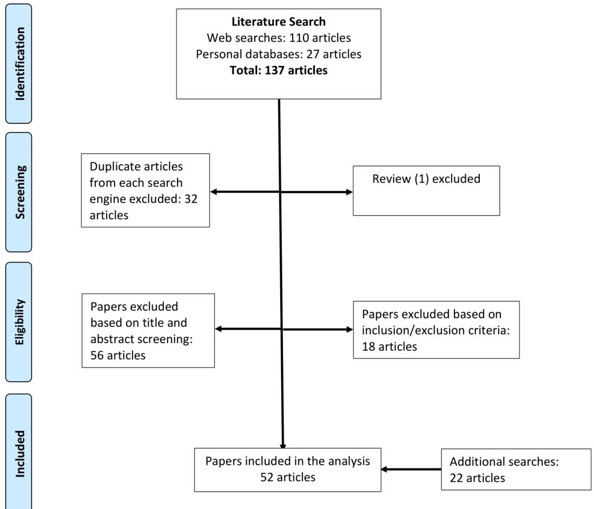
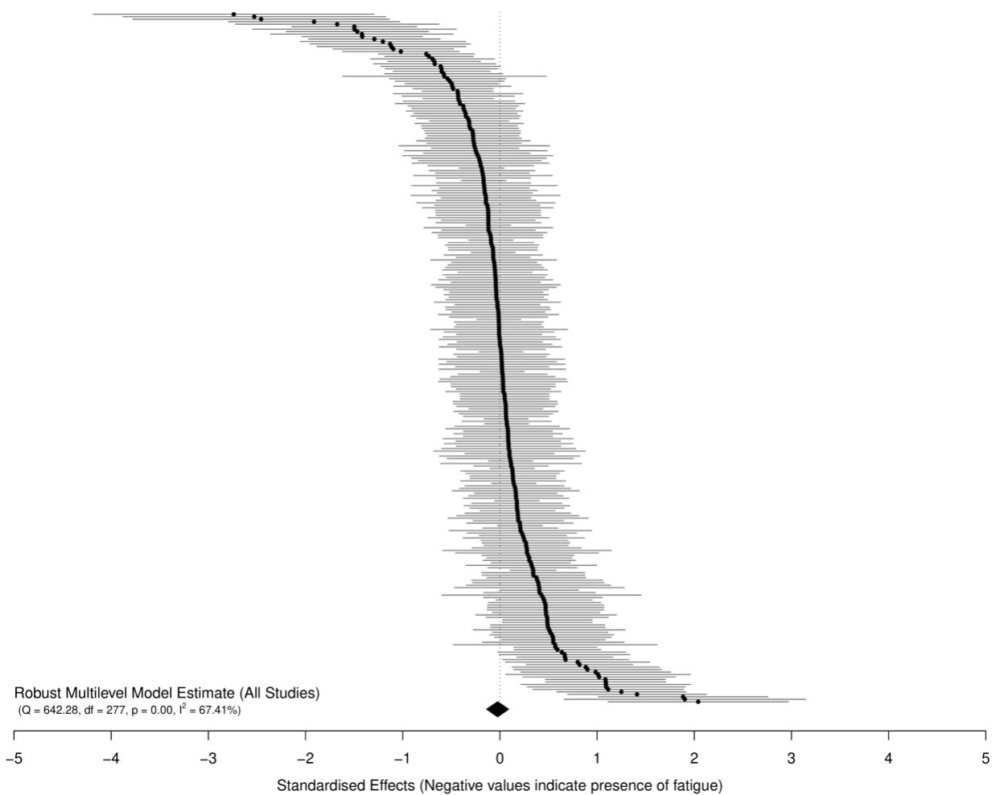
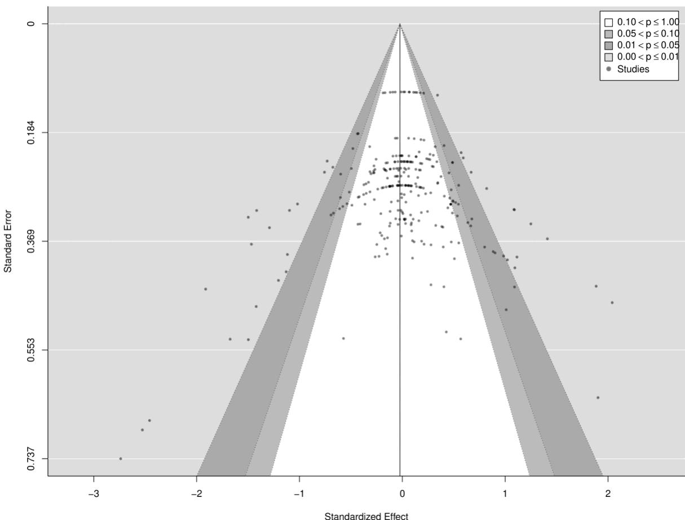

Design: Systematic review and meta-analysis.

# Non-local muscle fatigue effects on muscle strength, power, and endurance in healthy individuals: A systematic review and metaanalysis

Received: 28th September 2020   
Supplementary materials: https://osf.io/cs9e2/ For correspondence: dbehm@mun.ca

David G Behm1, Shahab Alizadeh1, Saman Hadjizedah Anvar1,2, Courtney Hanlon1, Emma Ramsay1, Mohamed Mamdouh Ibrahim Mahmoud1, Joseph Whitten1, James P. Fisher3, Olaf Prieske4, Helmi Chaabene5, Urs Granacher5, James Steele3,6

1. School of Human Kinetics and Recreation, Memorial University of Newfoundland, St. John’s, Newfoundland and Labrador, Canada

2 University of Tehran

3 School of Sport, Health and Social Science, Solent University, Southampton UK

4 Division of Exercise and Movement, University of Applied Sciences for Sport and Management Potsdam, Potsdam, Germany

5 Division of Training and Movement Science, University of Potsdam, Potsdam, Germany

6 ukactive Research Institute, London, UK

Please cite as: Behm, D.G., Alizadeh, S., Hadjizedah, S., Hanlon, C., Ramsay, E., Mahmoud, M.M.I., … Steele, J. (2020, September 28). Non-local muscle fatigue effects on muscle strength, power, and endurance in healthy individuals: A systematic review and meta-analysis. https://doi.org/10.31236/osf.io/w7x3v

## ABSTRACT

Objective: To examine whether non-local muscle fatigue occurs following performance of a fatiguing bout of exercise of a different muscle(s).

Search and Inclusion: A systematic literature search using a Boolean search strategy was conducted with PubMed, SPORTDiscus, Web of Science, and Google Scholar in April 2020 and was supplemented with additional ‘snowballing’ searches up to September 2020. To be included

in our analysis, studies had to include at least one intentional performance measure (i.e., strength, endurance, or power), which if reduced could be considered evidence of muscle fatigue, and also had to include the implementation of a fatiguing protocol to a location (i.e., limb or limbs) that differed to those for which performance was measured. We excluded studies that measured only mechanistic variables such as electromyographic, or spinal/supraspinal excitability. After search and screening, 52 studies were eligible for inclusion including 57 groups of participants (median sample = 11) and a total of 303 participants.

Results: The main multilevel meta-analysis model including all effects sizes (278 across 50 clusters [median = 4, range = 1 to 18 effects per cluster) revealed a trivial point estimate with high precision for the interval estimate (-0.02 [95%CIs = -0.14 to 0.09]), yet with substantial heterogeneity $( Q _ { ( 2 7 7 ) } = 6 4 2 . 3 ,$ $p \ < \ 0 . 0 1 )$ , $I ^ { 2 } = 6 7 . 4 \% )$ . Subgroup and meta-regression analyses showed that NLMF effects were not moderated by study design (between vs. within-participant), homologous vs. heterologous effects, upper or lower body effects, participant training status, sex, age, the time of post-fatigue protocol measurement, or the severity of the fatigue protocol. However, there did appear to be an effect of type of outcome measure where both strength (0.11 [95%CIs = 0.01 to 0.21]) and power outcomes had trivial effects (-0.01 [95%CIs = -0.24 to 0.22]), whereas endurance outcomes showed moderate albeit imprecise effects (-0.54 [95%CIs = -0.95 to -0.14]).

Conclusions: Overall, the findings do not support the existence of a general NLMF effect; however, when examining specific types of performance outcomes there may be an effect specifically upon endurance-based outcomes (i.e., time to task failure). However, there are relatively fewer studies that have examined endurance effects or mechanisms explaining this possible effect, in addition to fewer studies including women or younger and older participants, and considering causal effects of prior training history through the use of longitudinal intervention study designs. Thus, it seems pertinent that future research on NLMF effects should be redirected towards these still relatively unexplored areas.

## 1.0 Introduction

From the inception of the Harvard Fatigue laboratory in 1927 to the present period, muscle fatigue has had a long history of experimental research [1]. Talbott [2] initially characterised two types of fatigue: ‘physical’ fatigue due to physical tasks and ‘functional’ fatigue due to mental tasks. For approximately 90 years, fatigue-related research has investigated the transient decrease in the exercised muscles’ capacity to produce force or power [3]. The mechanisms underlying reductions in muscular capacity to meet task demands have been broadly divided into peripheral (distal to the spinal motor neuron) and central (spinal and supraspinal structures) or neural factors [3-5]. However, it should be noted that fatigue (similarly to task demands, or relatedly, effort) not only includes an actual reduction of capacity but also a perceptual component; a perception of fatigue [6].

Typically, an exercised muscle when subsequently examined shows evidence of fatigue (i.e. a reduction in capacity, often operationalised through measurements of maximal voluntary force). However, it has been shown that force and neuromuscular activation deficits may be incurred in a non-exercised muscle following fatigue of a contralateral muscle. This has been interpreted as strong evidence of a central neural impact upon fatigue, although other global factors such as metabolite dispersion and psychological factors are also thought to contribute [7]. At the start of the new millennium, researchers began to investigate ‘crossover’ fatigue, defined as changes in the performance output of a contralateral muscle following unilateral muscle fatigue [8-10]. While crossover fatigue primarily examined contralateral homologous muscles, it has been argued that global mechanisms effects upon fatigue are unlikely to be limited to just contralateral homologous muscles [11-15]. Hence, investigators began to examine heterologous muscles, incorporating the broader term of ‘non-local’ muscle fatigue (NLMF) to indicate a temporary deficit in performance of non-exercised homologous and/or heterologous muscle groups that could be located contralateral, or ipsilateral, as well as inferior or superior to the fatigued muscle groups [7, 14-17].

Halperin et al. [7] most recently reviewed this area and identified several trends and inconsistencies in the NLMF literature. In particular, few NLMF studies investigated heterologous muscles preventing strong comparisons of the responses of homologous and heterologous muscles. A comparison of homologous and heterologous muscle responses could provide insights into the interconnectivity of the neuromuscular sensory and motor systems and further mechanisms underlying NLMF. Some of the conclusions Halperin et al. [7] drew in their review included: 1) NLMF effects were more predominant when the lower body (primarily the quadriceps) rather than the upper body was tested, 2) NLMF effects appeared greater when performance was examined in prolonged continuous and intermittent muscle action tasks (i.e., endurance) compared to single, short-duration (i.e., 3-5 s) maximal voluntary contractions (MVC; i.e., muscle strength or power), and 3) sex and training background of the participants could also influence the responses. Within the last five years since the Halperin et al. [7] review, there have been more than 20 articles published and thus an updated review would help better understand this area. Further, except for Miller et al. [18], who only focused on a small number of studies (k = 6) on heterologous effects, no prior reviews have conducted a quantitative synthesis using metaanalysis to examine the existence and overall magnitude of overall NLMF effects, nor the moderating effects of the variables previously noted as impacting it. Thus, the objective of this systematic review with meta-analysis was to explore NLMF effects through studies examining nonlocal performance outcomes (including muscular strength, endurance, and power measures) in response to fatiguing protocols, as well as to investigate moderating variables; namely, homologous vs. heterologous and upper vs. lower body non-exercised tested muscles, participant training status, sex, and age, in addition to aspects of the study designs (between vs. within participant)1 and methods employed (time of post-fatigue protocol that performance measurements were taken, and the severity of the fatigue protocol used)2.

## 2.0 Methods

## 2.1 Search strategy

A literature search following PRISMA-P review guidelines was performed by six of the coauthors separately and independently using PubMed, SPORTDiscus, Web of Science, and Google Scholar databases. The topic was systematically searched in April 2020 using a Boolean search strategy with the operator “AND” and a combination of the following title keywords: crossover, cross-over, non-local, nonlocal, contralateral, ipsilateral, homologous, heterologous AND fatigue. Based upon our knowledge of the area we also contributed additional studies which we had knowledge of but where not picked up in systematic searches; further, we conducted searches of our personal computer databases for related articles, and conducted additional ‘snowballing’ searches [20] throughout the process of conducting the review and analysis, which located some newer studies not available when we conducted the initial systematic search. The search ended in September 2020. The search strategy aimed to locate all relevant articles that had examined NLMF whether as a primary, or secondary, aim of the study. For the sake of brevity, muscular strength, power, and endurance will generally be referred to without the descriptor “muscular” throughout the manuscript, and refers to where the output was measured.

## 2.2 Inclusion and exclusion criteria (study selection)

We followed PICOS (Population, Intervention, Comparison, Outcome, Study Design) for selecting studies for inclusion. We included studies in any healthy (i.e. non-clinical) population without age limits and including both recreationally active or trained participants (including athletes). Studies also had to include the implementation of an intervention involving a fatiguing protocol to a location (i.e., limb or limbs) that differed to those for which performance was measured. The comparison conditions included either pre- and post-, or just post-fatiguing protocol from non-fatiguing protocol control conditions, or just pre-fatiguing protocols for studies without control conditions. To be included in our analysis, studies had to have included at least one intentional performance measure as an outcome (i.e., a measure of strength, endurance, or ‘power’3) and if the outcome was reduced, it could be considered as evidence of muscle fatigue. This included measures indicative of a voluntary reduction in the ability of a muscle to produce force or power (e.g., an MVC, or countermovement jump [CMJ]; [3]); however, studies that examined time to task failure (TTF) exercises at a constant level (e.g., cycling with a given resistance, or repetitions in an exercise performed with a given load) or a fatigue index were also included. Both between and within-participant study designs were included. We excluded studies that measured only mechanistic variables such as electromyographic, or spinal/supraspinal excitability. Further, we excluded studies where we were unable to obtain absolute scores for performance measures either as summary statistics or raw data (i.e., those reporting relative fatigue; see below). Related articles were included up to September 2020. To limit potential publication bias effects, we did not limit ourselves to only including peer review articles and, where they were identified and it was possible to either extract data or contact the authors to gain access to data, we also included studies presented as part of conference proceedings and unpublished studies (e.g., pre-prints and MSc/Ph.D. theses).

## 2.3 Data extraction

A data extraction table was prepared to map: (a) author and year of publication; (b) study design (within or between participant); (c) sample mean age; (d) percentage of males in sample; (e) whether participants were trained or just healthy/recreationally active; (f) whether homologous or heterologous effects were examined; (g) which muscle/muscle groups were subject to the fatiguing protocol; (h) which limbs were subjected to the fatiguing protocols (e.g., dominant/nondominant, bilateral); (i) characteristics of the fatiguing protocol (i.e., the relative (i.e., 0-100% of max) and/or absolute loads, the time under loading, the number of sets/bouts performed); (j) whether the fatiguing task involved maximum effort (i.e., MVC or resulted in task failure); (k) which muscle/muscle groups were tested after the fatiguing protocol; (l) the outcome measure used to measure performance; (m) the time after the fatiguing protocol that the measurement was taken; (n) the means and standard deviations for outcome measures including both control and fatigue conditions (either pre- and post-, or just post-fatiguing protocol), or pre- and post-fatiguing protocols for studies without control conditions; and (o) sample sizes. Of note, we included data for all performance outcomes reported in studies and for all time points for which they were measured; thus, if a study reported multiple performance measures these were all included, and if a study reported measures taken more than once post-fatiguing protocol these were all included (the dependency between effect sizes was handled using a multi-level robust variance estimation approach – see statistical analysis). Some studies only reported relative outcomes (i.e., performance as a percentage normalised to a pre-fatiguing protocol measurement), and further, some studies only reported data graphically, did not report outcomes in a manner conducive to extraction for our analysis, or despite investigating NLMF effects did not report outcomes relevant for our analysis as they were secondary in those studies. In all of these cases, authors were contacted for either appropriate summary statistics or raw data for absolute measures of performance (if collected) to facilitate inclusion in our analysis. Some authors were unable to share data due to no longer having access to it. We followed up with authors a maximum of twice if we received no response. For those studies reporting only graphical data and that we did not receive responses for, WebPlotDigitizer (v4.3, Ankit Rohatgi; https://apps.automeris.io/wpd/) was used to extract data for inclusion in our analysis.

## 2.4 Synthesis and analysis

The meta-analysis was performed using the ‘metafor’ [22] package in R (v 4.0.2; R Core Team, https://www.r-project.org/). All analysis code utilised is presented in the supplementary materials (https://osf.io/6x4ct/).

Studies were grouped by their design for appropriate calculation of standardised effects sizes using the ‘escalc’ function in ‘metafor’. For between-participant study designs (i.e., fatigue and control conditions conducted on separate groups of participants) with post-fatigue protocol measures, only the standardised mean difference was calculated between groups. For betweenparticipant study designs with both pre- and post-fatigue protocol measures, the standardised mean change using the raw values was calculated within each condition using the post-fatigue standard deviations for each condition, and then the difference between these (i.e., the standardised mean change for fatigue conditions minus the standardised mean change for control conditions) was calculated in addition to the variance (i.e., the sum of variances from both conditions). Similarly, for within-participant study designs (i.e., fatigue and control conditions conducted on the same group of participants) with post-fatigue protocol measures, only the standardised mean change using the raw values was calculated between the conditions. For within-participant study designs with both pre- and post-fatigue protocol measures the standardised mean change using the raw values was calculated within each condition using the post-fatigue standard deviations for each condition, and then the difference between these was calculated in addition to the variance. Lastly, for within-participant study designs with only a single condition (i.e., fatigue) and pre- and post-fatigue protocol measures the standardised mean change using the raw values within that condition was calculated. The magnitude of standardised effect sizes was interpreted with reference to Cohen’s [23] thresholds: trivial (<0.2), small (0.2 to <0.5), moderate (0.5 to <0.8), and large (>0.8). Standardised effects were calculated in such a manner that negative effect size values indicated the presence of fatigue (i.e., a drop in the performance measure post-fatiguing protocol), whereas positive effect size values indicated an improvement in performance.

Because of the nested structure of the effect sizes calculated from the studies included (i.e. effects nested within groups nested within studies), multilevel mixed-effects meta-analyses with both study and intra-study groups were included as random effects in the model were performed to explore the effect of fatiguing protocols on performance measures (i.e., whether or not they induced NLMF). Cluster robust point estimates and precision of those estimates using 95% compatibility (confidence) intervals (CIs) were produced [24], weighted by inverse sampling variance to account for the within- and between-study variance (tau-squared). Restricted maximal likelihood estimation was used in all models. A main model was produced including all effects sizes.

Several exploratory subgroup comparisons and meta-regression analyses of moderator’s analyses were conducted. Subgroup analyses included comparison of study designs (between participant vs. within-participant designs), homologous vs. heterologous effects, upper vs. lower body effects, type of outcome measure (grouped as ‘strength’, ‘endurance’, or ‘power’), and trained vs. recreationally active participants. For each comparison, multilevel models with robust estimates were produced for each subgroup, and fixed-effects with moderator’s model used to compare the models. Moderators examined using meta-regression included the time post-fatigue protocol that measures were taken (seconds; though this was limited to effects measured within a 24 hours maximum time frame), the time post-fatigue protocol that measures were taken but limited to only the first measure taken (to separate the possible impact of multiple post-fatigue protocol tests), the ‘severity’ of the fatiguing protocol used (this was calculated from those studies where data was available as the ‘relative load’ x ‘sets/bouts’ x ‘time under load’ to give a measure of the total ‘workload’ performed)4 [25], the percentage males in the sample, and mean age of the sample.

For all models, we opted to avoid dichotomizing the existence of an effect for the main results and therefore did not employ traditional null hypothesis significance testing, which has been extensively criticised [26, 27]. Instead, we consider the implications of all results compatible with these data, from the lower limit to the upper limit of the interval estimates, with the greatest interpretive emphasis placed on the point estimate.

The risk of small study bias was examined visually through contour-enhanced funnel plots. Q and I2 statistics were also produced and reported [28]. A significant Q statistic is typically considered indicative of effects likely not being drawn from a common population. I2 values indicate the degree of heterogeneity in the effects: 0-40% were not important, 30-60% moderate heterogeneity, 50-90% substantial heterogeneity, and 75-100% considerable heterogeneity [29]. For within-participant effects, pre-post correlations for measures were rarely reported; thus, we assumed a range of values for correlation coefficients (r = 0.5, 0.7, and 0.9) and explored the sensitivity of results to each of these. As overall findings were relatively insensitive to this range, we report the results for r = 0.7 here and include the results for inclusion of the other assumed correlation coefficients in the supplementary materials (https://osf.io/6n283/ & https://osf.io/rf8bj/). Heterogeneity of individual effect estimates included was also examined through production of ‘GOSH’ plots5 (graphical display of study heterogeneity; [30].

## 3.0 Results

## 3.1 Included studies

After initial searches and screening, 39 studies were identified that met the inclusion criteria. Additional search approaches identified a further 13 studies that met inclusion criteria. Thus, the final number of studies included was 52 [31-53, 118-129: citations for studies not otherwise referenced in the manuscript but included in the data extraction table]. Details of the search and inclusion process are shown in the flow chart (figure 1). The pooled number of participants in the studies included was 303 across 57 groups within studies and with sample sizes ranging from 6 to 45 participants (median = 11). Full details of all included studies can be seen in the data extraction table (https://osf.io/4g5jw/).

  
Figure 1. Flow chart illustrating different phases of the search and study selection.

## 3.2 Main model – All effects

The main model including all effects sizes (278 across 50 clusters [median = 4, range = 1 to 18 effects per cluster) revealed a trivial point estimate with high precision for the interval estimate (-0.02 [95%CIs = -0.14 to 0.09]), yet with substantial heterogeneity $( Q _ { ( 2 7 7 ) } = 6 4 2 . 3 , p \ < $ 0.01), $I ^ { 2 } = 6 7 . 4 \% )$ . Figure 2 presents all effect sizes and interval estimates in an ordered caterpillar plot, figure 3 presents the funnel plot for all studies, and the GOSH plot, which showed generally high levels of between-study heterogeneity, can be viewed in the supplementary materials (https://osf.io/sbmze/).

  
Figure 2. Ordered caterpillar plot of all effects.

  
Figure 3. Contour-enhanced funnel plot for all effects.

## 3.3 Subgroup and meta-regression analyses

## 3.4 Between-participant vs. within-participant study design

Subgroup models revealed trivial yet opposite sign effects for both between participant study designs (0.17 [95%CIs = 0.01 to 0.34]; 21 effects across 2 clusters [median = 10.5, range = 5 to 16 effects per cluster; $I ^ { 2 } = 0 . 0 \% )$ and for within participant designs (-0.04 [95%CIs = -0.15 to 0.08]; 257 effects across 48 clusters [median = 4, range = 1 to 18 effects per cluster; $I ^ { 2 } = 6 9 . 6 \% )$ which significantly differed $( z = - 3 . 4 3 , p < 0 . 0 0 1 )$

## 3.5 Homologous vs. heterologous effects

Subgroup models revealed trivial yet opposite sign effects for both homologous (0.06 [95%CIs = -0.09 to 0.22]; 131 effects across 27 clusters [median = 3, range = 1 to 18 effects per cluster; $I ^ { 2 } = 5 9 . 1 \% )$ and heterologous effects (-0.09 [95%CIs = -0.26 to 0.07]; 147 effects across 28

clusters [median = 3.5, range = 1 to 16 effects per cluster; $I ^ { 2 } = 7 4 . 1 \% )$ , which did not significantly differ $( z = 1 . 4 3 , p = 0 . 1 5 2 )$

## 3.6 Upper body vs. lower body effects

Subgroup models revealed trivial yet opposite sign effects for both upper body (0.07 [95%CIs = -0.07 to 0.22]; 110 effects across 22 clusters [median = 4, range = 1 to 12 effects per cluster; $I ^ { 2 } = 5 8 . 9 \% )$ and lower body effects (-0.11 [95%CIs = -0.27 to 0.04]; 165 effects across 37 clusters [median = 3, range = 1 to 18 effects per cluster; $I ^ { 2 } = 7 3 . 9 \% )$ , which did not significantly differ $( z = 1 . 8 1 3 , p = 0 . 0 7 )$

## 3.7 Type of outcome measure

Subgroup models revealed trivial effects for both strength (0.11 [95%CIs = 0.01 to 0.21]; 174 effects across 35 clusters [median = 4, range = 1 to 18 effects per cluster; $I ^ { 2 } = 3 9 . 5 \% )$ and power outcomes (-0.01 [95%CIs = -0.24 to 0.22]; 43 effects across 8 clusters [median = 4, range = 2 to 12 effects per cluster; $I ^ { 2 } = 4 5 . 9 \% )$ , yet moderate effects for endurance outcomes (-0.54 [95%CIs = -0.95 to -0.14]; 61 effects across 19 clusters [median = 2, range = 1 to 16 effects per cluster; $I ^ { 2 } = 9 4 . 5 \% )$ which differed significantly from both strength $( z = 3 . 2 9 , p = 0 . 0 0 1 )$ and power outcomes $( z = 2 . 4 9 , p = 0 . 0 1 3 )$

## 3.8 Participants’ training status

Subgroup models revealed trivial effects for both trained (-0.01 [95%CIs = -0.16 to 0.13]; 121 effects across 19 clusters [median = 3, range = 1 to 18 effects per cluster; $I ^ { 2 } = 5 0 . 8 \% )$ and for recreationally active participants (-0.04 [95%CIs = -0.21 to 0.13]; 157 effects across 31 clusters [median = 4, range = 1 to 18 effects per cluster; $I ^ { 2 } = 7 5 . 6 \% )$ , which did not significantly differ $( z =$ 0.289, $p = 0 . 7 7 2 )$

## 3.9 Time of post-fatigue protocol measurement

Meta-regression suggested that NLMF effects were not moderated by the time that postfatigue protocol measurements were taken whether looking at all effects within a 24 hour period post-fatigue protocol (β = -0.00 [95%CIs = -0.0001 to 0.00]; 265 effects across 50 clusters [median = 4, range = 1 to 18 effects per cluster), or when limited to only the first post-fatigue protocol measurement (β = -0.0006 [95%CIs = -0.0016 to 0.0005]; 129 effects across 47 clusters [median = 2, range = 1 to 10 effects per cluster). Figures in the supplementary materials (https://osf.io/gd9cm/ and https://osf.io/3jhbp/) show meta-analytic scatterplots for these effects.

## 3.10 ‘Severity’ of fatigue-protocol

Meta-regression suggested that NLMF effects were not moderated by severity of the fatigue protocol used $( \beta = - 0 . 0 0 [ 9 5 \% C | 5 = - 0 . 0 0 \mathrm { { t o } } 0 . 0 0 ] ;$ 251 effects across 39 clusters [median = 5, range = 1 to 18 effects per cluster). The figure showing the meta-analytic scatterplots for these effects can be found in the supplementary materials (https://osf.io/ajngp/).

## 3.11 Percentage of males in sample

Meta-regression suggested that NLMF effects were not moderated by the percentage of males in the sample $( \beta ~ = ~ - 0 . 0 0 2 1 ~ [ 9 5 \% C | { s = - 0 . 0 0 0 1 ~ \mathrm { t o } ~ 0 . 0 0 4 2 } ] ;$ 268 effects across 47 clusters [median = 4, range = 1 to 18 effects per cluster). The figure showing the meta-analytic scatterplots for these effects can be found in the supplementary materials (https://osf.io/rdc45/).

## 3.12 Mean age of sample

Meta-regression suggested that NLMF effects were not moderated by the mean age of participants in the sample $( \beta = - 0 . 0 0 0 8 [ 9 5 \% C | \mathsf { s } = - 0 . 0 0 7 8 \tan 0 . 0 0 6 2 ] ;$ 278 effects across 47 clusters [median = 4, range = 1 to 18 effects per cluster). The figure showing the meta-analytic scatterplots for these effects can be found in the supplementary materials (https://osf.io/7fhy8/).

## 4.0 Discussion

The major findings of this meta-analysis were that when all performance measures indicative of neuromuscular fatigue were examined (muscle strength, power, and endurance measures combined), the effect estimate was close to zero and at best compatible with only trivial effects. Thus, there does not appear to be clear evidence of a general NLMF effect, though between-study heterogeneity was high even across various iterations of effect sizes included (see GOSH plot https://osf.io/sbmze/). Further, NLMF effects were similarly absent and not moderated by study design (between vs. within-participant), homologous vs. heterologous effects, upper or lower body effects, participant training status, sex, age, the time of post-fatigue protocol measurement, or the severity of the fatigue protocol. However, when examining types of performance measures separately, there did appear to be some evidence for a moderate NLMF effect upon endurance-based outcomes (i.e. TTF); though the interval estimate was relatively imprecise showing compatibility with a range from possibly trivial to large effects and again there was considerable between-study heterogeneity $( I ^ { 2 } = 9 4 . 5 \% )$

Prior fatiguing actions of another muscle induced trivial effects upon subsequent single discrete maximal strength and power contractions of the tested muscles. The finding of trivial effects in our meta-analytic model does not imply that all studies demonstrated trivial NLMF results with single testing contractions. There are some studies that have reported NLMF with single discrete maximal contractions [8, 13, 15, 54, 55]. However, this sample of studies illustrating single maximal contraction NLMF impairments is counterbalanced by an even greater number of studies showing no significant changes; thus, the multilevel meta-analysis models estimates suggest that the mean of the distribution of the true effect sizes is approximately zero and at best only trivial.

In contrast, NLMF produced moderate magnitude impairments of a previously nonexercised, non-local muscle when tested with an endurance test. In addition, we conducted a posthoc exploratory analysis of longer duration (i.e. where the endurance tests involved bouts to task failure that lasted >75-s) endurance outcomes as these have previously been considered as ‘true’ endurance by others [56, 57]. These longer duration endurance outcomes demonstrated a large, albeit still imprecise and ranging from small to large, effect estimate (-0.85 [95%CIs = -1.46 to - 0.24]), which still showed a high between-study heterogeneity $( I ^ { 2 } = 8 9 . 3 \% )$ . It should be noted that there are comparatively fewer studies having examined endurance-based outcomes, which likely explains the imprecision of this estimate; further research is therefore encouraged. However, the results from this meta-analysis are in accord with the conclusion of Halperin et al. [7] in their narrative review, where they also reported that muscle endurance-based outcomes provided clearer evidence of NLMF vs. strength or power-based outcomes. They speculate on a range of possible mechanisms for this effect which we briefly discuss here in the context of our findings.

Accumulation of metabolites and increased acidosis in the working (exercised) muscle(s) may be distributed globally by the cardiovascular system having non-local effects on muscle disrupting contractile kinetics, enzymatic functioning, and action potential propagation [58-61]. Increases in potassium [62, 63], hydrogen [62, 64], and blood lactate [14, 62, 64, 65] have been observed in the non-exercised muscles following contralateral exercise. While the impact of blood lactate and hydrogen ions on muscle fatigue is disputed [66, 67], they have been reported to decrease the force per cross-bridge [68, 69], and reduce myofibrillar ${ \mathsf { C a } } ^ { 2 + }$ sensitivity [68, 70]. Increased potassium gradients with repeated contractions [71], can diminish force [72] and reduce muscle excitability contributing to fatigue [63]. Exercise-induced heat shock proteins [73] are evident in non-exercised systems [74] and are reported to impact the recovery of force-producing capacity [75]. Fatigue-induced changes to the metabolic environment can also activate group III and IV muscle afferents [76-78] inhibiting the central nervous system, attenuating non-local, or global muscle performance [55]. However, the lack of effects upon other outcomes (strength and power) question the influence of factors such as group III and IV afferents effects on central motor drive. Further questioning the impact of centrally mediated neural mechanisms, studies that have examined electromyographic activity (EMG) of the non-exercised muscle are conflicting in whether there appears to be evidence of neural inhibition [8, 10, 15, 79-81]. While there is evidence suggestive of reduced cerebral oxygenation possibly impacting NLMF [82, 83], evidence from studies of transcranial magnetic stimulation (TMS) regarding specific levels neural influence (i.e. supraspinal [cortical or cerebral], spinal, and peripheral) is varying; studies have reported inhibitory [84-88], excitatory [89-93] and no significant NLMF effects upon corticospinal excitability [94, 95].

The lack of general NLMF effects, or comparative differences in both homologous and heterologous, and upper and lower body, outcomes question the role of systemic metabolic mechanisms. Further, findings regarding possible neural mechanisms are highly variable and, accompanied by the general lack of NLMF effect upon strength and power outcomes (which suggests that a general reduction in force-producing capacity does not explain reduced endurance performance), it appears they may play a little role; a similar conclusion to that reached with a meta-analysis by Miller et al. [18], who reported trivial reductions in non-local heterologous spinal and supraspinal excitability. Thus, it is not clear whether physiological mechanisms might explain the possible NLMF effects upon endurance performance. However, a further possible explanation that has been speculated upon is psychological.

Maintaining muscular actions to the point of task failure is uncomfortable, sometimes painful, and necessitates focus and concentration (cognitive demand) to maintain task demands in both traditional aerobic endurance activities [96] and resistance exercise tasks [97]. Indeed, even cognitively fatiguing tasks performed alone have been suggested to impede subsequent physical performance, especially with endurance-based tasks [98-100]; though this effect has also been questioned [96]. Nevertheless, a deficit in cognitive capacity may influence phenomenological experience more globally and potentially explain NLMF especially during endurance-based tasks [7]. Cognitively fatiguing tasks may lead individuals to perceive a subsequent task to be more effortful, resulting in an earlier cessation of the activity [98-100]; though again this finding is not consistent and may be small [101]. Actual fatigue (and indeed effort) is distinct from the perception of fatigue (and perception of effort) [102]. Steele [102] has most recently defined perception of effort in relation to perception of fatigue as “…the perception of that which must be done in attempting to achieve a particular demand, or set of demands, and which is determined by the perception of current task demands relative to the perception of capacity to meet those demands…”. Given the separation of actual- and perception of-, and the link between perception of capacity (which is synonymous with, albeit the opposite sign of, perception of fatigue) and perception of effort, the NLMF effects seen for endurance tasks may result from prior fatiguing non-local tasks impacting perception of fatigue, and thus perception of effort experienced during subsequent task performance, as opposed to any ‘direct’ physiological mechanism. Indeed, Greenhouse-Tucknott et al. [103] show some evidence for this; they found that no actual NLMF fatigue (operationalised as knee extensor neuromuscular function), yet prior handgrip exercise increased perception of fatigue and subsequently perception of effort (and affect) impacting upon endurance performance. Thus, increased perception of fatigue may have global repercussions increasing perception of effort during subsequent task performance. However, given the varying evidence for performance deficits from prior cognitive tasks inducing fatigue [57, 104], further studies should examine NLMF effects in endurance tasks and examine these possible mechanisms using appropriate approaches to mediation analysis.

Biomechanical alterations have also been discussed as possible factors influencing the apparent presence of NLMF [7]; that muscle groups not ‘directly’ involved in the fatiguing task still contribute to the performance of working muscle groups using factors such as stabilization and mechanical energy transference and thus have the potential to influence NLMF effects [105- 108]. For example, a 20% reduction of power production during 30 seconds of lower body cycling was observed when the lower body cycling was performed without gripping the handlebar for stability [108]; thus, a reduction in grip strength could contribute to reduced performance through this mechanism. Similarly, high levels of activation in the trunk muscles (abdominal and lower back) have been reported during upper [109] and lower body [105] movements due to the trunk muscles acting in a stabilizing role to allow for efficient proximal to distal transfer of mechanical energy (i.e. kinetic chain) [110]. Thus, fatigue in these muscles might impact subsequent tasks and would seem unlikely to differentially impact homologous over heterologous muscle contractions. However, it seems likely that such biomechanical alterations would be highly specific to the exact task performed in both the fatiguing protocol and subsequently for performance testing. Thus, it may be fruitful for future studies to more specifically focus on circumstances where NLMF may appear to be present and whether or not this is explained by biomechanical alterations not typically examined.

A review of the mechanisms that might explain a possible NLMF effect in endurance tasks suggests that neither metabolic nor central neuromuscular activation deficits, are likely to be responsible. Possible mechanisms however include a global impact upon perception of fatigue and increased perception of effort during subsequent task performance, in addition to possible biomechanical alterations induced by fatigue in other muscle groups not ‘directly’ involved in the fatiguing task. However, further research is needed to establish the extent of an NLMF effect upon endurance tasks, and whether these mechanisms mediate this.

The lack of moderating effects from other studies, participant, and protocol characteristics is interesting and suggests that considering the consistently high between-study heterogeneity, other characteristics may explain the variation in effects seen across individual studies. Halperin et al. [7] previously suggested that NLMF effects may be more pronounced in the lower body, for male participants, and that training background may have some influence; indeed these characteristics have been less well explored and so the lack of moderating effects may merely be due to the relative lack of data.

The lack of impact of sex in the present meta-analysis may be related to the much lower proportion of women participating in these studies. The possibility of sex differences is difficult to identify as only 13 studies reported including female participants and only three of these directly compared men and women. Martin and Rattey [8] and Ye et al., [50] were two of only three studies to directly compare sex-related NLMF effects, finding greater NLMF with males vs. females. Doix et al. [80] contrastingly discovered that males experienced greater fatigue in the exercised leg but there was no significant NLMF with either sex, although vastus lateralis EMG activity demonstrated a greater magnitude deficit during the post-test with females. Females tend to exhibit greater muscle endurance [111] and indeed experience less local muscular fatigue [112], which has been attributed to lower absolute muscle forces with the same relative work, contributing to a lower muscle oxygen demand and vasculature compression [113] In contrast, males are more reliant on glycolytic pathways and present a greater neuromuscular activation impairment after fatigue [111, 113]. If the aforementioned metabolite dispersion impacts NLMF, the higher vascular compression and glycolytic-based metabolite release might promote the greater male NLMF effects. Nonetheless, with such few female participants and comparative studies, future studies must include and compare both sexes.

There was also little difference between trained and untrained participants in our analysis. However, the training background in studies tended to be dichotomised into either recreationally active participants or trained participants. Only Triscott et al. [114] compared three training backgrounds: healthy, strength-endurance, and resistance-trained individuals. Following unilateral elbow flexors fatigue, the contralateral elbow flexors’ single MVC did not significantly change in any group regardless of training history. As observed with other NLMF studies, a contralateral post-fatigue endurance test (submaximal task to failure) was more sensitive to NLMF with both the healthy and resistance-trained participants showing significant decrements, whilst the strength-endurance trained subjects were not significantly affected. Similar to the sex differences rationale, strength-endurance trained participants could have produced less metabolic by-products due to their lower reliance on glycolytic pathways resulting in reduced metabolite distribution by the cardiovascular system and diminished inhibitory metaboreceptor afferent input [115]. Though it is not clear whether this could be a result of their prior training history, or due to self-selection bias (i.e. those with such characteristics were more likely to be strength-endurance athletes). Thus further investigations should examine this issue including examining whether NLMF can be induced or prevented through the implementation of longitudinal training interventions.

A final area with little research is the possible moderating role of age in NLMF effects. None of the studies identified had directly compared younger (children and adolescents) and older cohorts, with the majority using younger adults (typically of university age). Yet, it has been suggested that both children and older adults exhibit greater endurance capacity than younger adults, though interestingly children tend to display large reductions in capacity (i.e. fatigue) comparable to that seen in endurance athletes, whereas older adults may exhibit less [116, 117]. Considering this, there remain intriguing possibilities to examine whether or not age may impact the absence or presence of NLMF effects.

## 5.0 Conclusions

The results of this comprehensive meta-analysis of findings from the NLMF literature suggest that, following a fatiguing intervention, previously non-exercised do not typically appear to exhibit a general NLMF effect when considering muscle strength and power-based performance outcomes. However, there is some evidence suggestive of NLMF for muscle endurance-based outcomes, though relatively fewer studies have explored this and the possible mechanisms for this specific effect are unclear. General NLMF effects were similarly absent and not moderated by study design (between vs. within-participant), homologous vs. heterologous effects, upper or lower body effects, participant training status, sex, the time of post-fatigue protocol measurement, or the severity of the fatigue protocol. There is however a paucity of studies including female participants and conducting direct sex comparison, in addition to studies of younger (children and adolescents) and older populations, and of different training backgrounds or indeed intervention studies examining the effects of implementing differing prior training. Thus, future studies are needed to clarify the possible NLMF effect upon endurance outcomes in addition to the potential mechanisms, in addition to studies examining population differences (i.e. sex, age, training background). Considering the lack of evidence for a general NLMF effect, we suggest that future research on NLMF effects should be redirected towards these still relatively unexplored areas.

## Funding information

Partial financial support for graduate students (ER, MMIM, JW) was received from the Natural Science and Engineering Research Council of Canada.

## Data and Supplementary Material Accessibility

All materials, data, and code are available on the Open Science Framework project page for this study https://osf.io/cs9e2/

## REFERENCES

1. Tipton CM. History of Exercise Physiology. Windsor, Ontario, Canada: Human Kinetics Publisher Inc.; 2014; pp. 16-64.

2. Talbott JH. The effect of fatigue. New England Journal of Medicine. 1933;208:658-9.

3. Gandevia SC. Spinal and supraspinal actors in human muscle fatigue. Physiol Rev. 2001;81(4):1725-89.

4. Behm DG. Force maintenance with submaximal fatiguing contractions. Can J Appl Physiol. 2004 Jun;29(3):274-90.

5. Behm DG, St-Pierre DM. Fatigue characteristics following ankle fractures. Med Sci Sports Exerc. 1997 Sep;29(9):1115-23.

6. Enoka RM, Duchateau J. Translating Fatigue to Human Performance. Med Sci Sports Exerc. 2016 Nov;48(11):2228-38.

7. Halperin I, Chapman DW, Behm DG. Non-local muscle fatigue: effects and possible mechanisms. Eur J Appl Physiol. 2015 Oct;115(10):2031-48.

8. Martin PG, Rattey J. Central fatigue explains sex differences in muscle fatigue and contralateral cross-over effects of maximal contractions. Pflugers Archiv : Eur J Physiol. 2007 Sep;454(6):957-69.

9. Rattey J, Martin PG, Kay D, Cannon J, Marino FE. Contralateral muscle fatigue in human quadriceps muscle: evidence for a centrally mediated fatigue response and cross-over effect. Pflugers Archiv : Eur J Physiol. 2006 May;452(2):199-207.

10. Doix AC, Lefevre F, Colson SS. Time course of the cross-over effect of fatigue on the contralateral muscle after unilateral exercise. PLoS One. 2013;8(5):e64910.

11. Aboodarda SJ, Copithorne DB, Power KE, Drinkwater E, Behm DG. Elbow flexor fatigue modulates central excitability of the knee extensors. Appl Physiol Nutr Metab. 2015 Sep;40(9):924- 30.

12. Aboodarda SJ, Sambaher N, Millet GY, Behm DG. Knee extensors neuromuscular fatigue changes the corticospinal pathway excitability in biceps brachii muscle. Neurosci. 2017 Jan 06;340:477-86.

13. Ben Othman A, Chaouachi A, Hammami R, Chaouachi MM, Kasmi S, Behm DG. Evidence of nonlocal muscle fatigue in male youth. Appl Physiol Nutr Metab. 2017 Mar;42(3):229-37.

14. Halperin I, Aboodarda SJ, Behm DG. Knee extension fatigue attenuates repeated force production of the elbow flexors. Eur J Sport Sci. 2014 Apr 25;14(8):823-9.

15. Halperin I, Copithorne D, Behm DG. Unilateral isometric muscle fatigue decreases force production and activation of contralateral knee extensors but not elbow flexors. Appl Physiol Nutr Metab. 2014 Dec;39(12):1338-44.

16. Grant MC, Robergs R, Baird MF, Baker JS. The effect of prior upper body exercise on subsequent wingate performance. Biomed Res Int. 2014;2014:329328.

17. Elmer SJ, Amann M, McDaniel J, Martin DT, Martin JC. Fatigue is specific to working muscles: no cross-over with single-leg cycling in trained cyclists. Eur J Appl Physiol. 2013 Feb;113(2):479-88.

18. Miller WK, M.; Jeon, S.; Ye, X. A meta-analysis of non-local heterologous muscle fatigue. J Trainology. 2019;8:9-18.

19. MacInnis MJ, McGlory C, Gibala MJ, Phillips SM. Investigating human skeletal muscle physiology with unilateral exercise models: when one limb is more powerful than two. Appl Physiol Nutr Metab. 2017 Jun;42(6):563-70.

20. Greenhalgh T, Peacock R. Effectiveness and efficiency of search methods in systematic reviews of complex evidence: audit of primary sources. BMJ. 2005 Nov 5;331(7524):1064-5.

21. Winter EM, Abt G, Brookes FB, Challis JH, Fowler NE, Knudson DV, et al. Misuse of "Power" and Other Mechanical Terms in Sport and Exercise Science Research. J Strength Cond Res. 2016 Jan;30(1):292-300.

22. Viechtbauer W. Conducting a meta-analysis in R with metafor package. J Stat Software. 2010;36(3):1-48.

23. Cohen J. Statistical power analysis for the behavioural sciences. Hillside N.J.: L. Erbraum Associates; 1988 pp. 24-92.

24. Hedges LV, Tipton E, Johnson MC. Robust variance estimation in meta-regression with dependent effect size estimates. Res Synth Methods. 2010 Jan;1(1):39-65.

25. Scott BR, Duthie GM, Thornton HR, Dascombe BJ. Training Monitoring for Resistance Exercise: Theory and Applications. Sports Med. 2016 May;46(5):687-98.

26. McShane BBG, D.; Gelman, A.; Robert, C.; Tackett, J.L. Abandon statistical significance. Amer Statistics. 2019;73:235-45.

27. Amrhein V, Greenland S, McShane B. Scientists rise up against statistical significance. Nature. 2019 Mar;567(7748):305-7.

28. Higgins JPT, S.G.; Deeks, J.J.; Altman, D.G. Measuring inconsistency in meta-analyses. Brit Med J. 2003;327(7414):557-60.

29. Higgins JPG, S. Cochrane Handbook for Systematic Reviews of Interventions. London, UK.; 2011 pp. 38-111.

30. Olkin ID, I.J.; Trikalinos, T.A. GOSH - a graphical display of study heterogeniety. Res Synthesis Methods. 2012;3(3):214-23.

31. Andrews SK, Horodyski JM, MacLeod DA, Whitten J, Behm DG. The Interaction of Fatigue and Potentiation Following an Acute Bout of Unilateral Squats. J Sports Sci Med. 2016 Dec;15(4):625-32.

32. Farrow J, Steele J, Behm DG, Skivington M, Fisher JP. Lighter-Load Exercise Produces Greater Acute- and Prolonged-Fatigue in Exercised and Non-Exercised Limbs. Res Q Exerc Sport. 2020 May 13:1-11.

33. Bouhlel E, Chelly MS, Gmada N, Tabka Z, Shephard R. Effect of a prior force-velocity test performed with legs on subsequent peak power output measured with arms or vice versa. J Strength Cond Res. 2010 Apr;24(4):992-8.

34. Ciccone AB, Brown LE, Coburn JW, Galpin AJ. Effects of traditional vs. alternating wholebody strength training on squat performance. J Strength Cond Res. 2014 Sep;28(9):2569-77.

35. Decorte N, Lafaix PA, Millet GY, Wuyam B, Verges S. Central and peripheral fatigue kinetics during exhaustive constant-load cycling. Scand J Med Sci Sports. 2012 Jun;22(3):381-91.

36. Ross EZ, Middleton N, Shave R, George K, Nowicky A. Corticomotor excitability contributes to neuromuscular fatigue following marathon running in man. Exp Physiol. 2007 Mar;92(2):417- 26.

37. Sambaher N, Aboodarda SJ, Behm DG. Bilateral knee extensor fatigue modulates force and responsiveness of the corticospinal pathway in the non-fatigued, dominant elbow flexors. Front Hum Neurosci. 2016;10:18.

38. Bertuzzi R, Silva-Cavalcante MD, Couto PG, Azevedo RA, Coelho DB, Zagatto A, et al. Prior upper body exercise impairs 4-km cycling time-trial performance without altering neuromuscular function. Res Q Exerc Sport. 2020 Feb 5:1-11.

39. Johnson MA, Sharpe GR, Williams NC, Hannah R. Locomotor muscle fatigue is not critically regulated after prior upper body exercise. J Appl Physiol (1985). 2015 Oct 1;119(7):840-50.

40. Monteiro ER, Steele J, Novaes JS, Brown AF, Cavanaugh MT, Vingren JL, et al. Men exhibit greater fatigue resistance than women in alternated bench press and leg press exercises. J Sports Med Phys Fitness. 2019 Feb;59(2):238-45.

41. Prieske O, Aboodarda SJ, Benitez Sierra JA, Behm DG, Granacher U. Slower but not faster unilateral fatiguing knee extensions alter contralateral limb performance without impairment of maximal torque output. Eur J Appl Physiol. 2017 Feb;117(2):323-34.

42. Kennedy DS, Fitzpatrick SC, Gandevia SC, Taylor JL. Fatigue-related firing of muscle nociceptors reduces voluntary activation of ipsilateral but not contralateral lower limb muscles. J Appl Physiol (1985). 2015 Feb 15;118(4):408-18.

43. Paillard T, Chaubet V, Maitre J, Dumitrescu M, Borel L. Disturbance of contralateral unipedal postural control after stimulated and voluntary contractions of the ipsilateral limb. Neurosci Res. 2010 Dec;68(4):301-6.

44. Zijdewind I, Zwarts MJ, Kernell D. Influence of a voluntary fatigue test on the contralateral homologous muscle in humans? Neurosci Letters. 1998 Aug 28;253(1):41-4.

45. Alcaraz PE, Sanchez-Lorente J, Blazevich AJ. Physical performance and cardiovascular responses to an acute bout of heavy resistance circuit training versus traditional strength training. J Strength Cond Res. 2008 May;22(3):667-71.

46. Millet GY, Martin V, Lattier G, Ballay Y. Mechanisms contributing to knee extensor strength loss after prolonged running exercise. J Appl Physiol (1985). 2003 Jan;94(1):193-8.

47. Place N, Lepers R, Deley G, Millet GY. Time course of neuromuscular alterations during a prolonged running exercise. Med Sci Sports Exerc. 2004;36(8):1347-56.

48. Ross EZ, Goodall S, Stevens A, Harris I. Time course of neuromuscular changes during running in well-trained subjects. Med Sci Sports Exerc. 2010 Jun;42(6):1184-90.

49. Nunes JP, Marcori AJ, Tomeleri CM, Nascimento MA, Mayhew JL, Ribeiro AS, et al. Starting the resistance-training session with lower-body exercises provides lower session perceived exertion without altering the training volume in older women. Int J Exerc Sci. 2019;12(4):1187-97.

50. Ye X, Beck TW, Wages NP, Carr JC. Sex comparisons of non-local muscle fatigue in human elbow flexors and knee extensors. J Musculoskelet Neuronal Interact. 2018 Mar 1;18(1):92-9.

51. Laginestra FGA, M.; Kirmizi, E.; Giuriato, G.; Ruzzante, F.; Pedrinolla, A.; Martignon, C.; Tarperi, C.; Schena, F.; Ventirelli, M. Electrical stimulation-induced fatigue in the contralateral leg impairs endurance exercise performance. Med Sci Sports Exerc. 2020;52(7S):933.

52. Salveson FS. The effect of maximal vs. submaximal contractions on crossover fatigue between limbs. NTNU Open. 2020.

53. Ciccone ABW, D.D.; Schlabs, C.R.; Gallagher, P.M.; Weir, J.P. Is lower-body resistance exercise volume impaired by high lower-body intramuscular temperature? . Under review. 2020;shared via personal communication with author.

54. Kawamoto JE, Aboodarda SJ, Behm DG. Effect of differing intensities of fatiguing dynamic contractions on contralateral homologous muscle performance. J Sports Sci Med. 2014 Dec;13(4):836-45.

55. Sidhu SK, Weavil JC, Venturelli M, Garten RS, Rossman MJ, Richardson RS, et al. Spinal muopioid receptor-sensitive lower limb muscle afferents determine corticospinal responsiveness and promote central fatigue in upper limb muscle. J Physiol. 2014 Nov 15;592(22):5011-24.

56. Gastin PB. Energy system interaction and relative contribution during maximal exercise. Sports Med. 2001;31(10):725-41.

57. Pageaux B, Lepers R. Fatigue induced by physical and mental exertion Iicreases perception of effort and impairs subsequent endurance performance. Front Physiol. 2016;7:587.

58. Cady EB, Jones DA, Lynn J, Newham DJ. Changes in Force and Intracellular Metabolites During Fatigue of Human Skeletal Muscle. J Physiol. 1989;418:311-25.

59. Kent-Braum JA. Central and peripheral contributions to muscle fatigue in humans during sustained maximal effort. Eur J Appl Physiol. 1999;80:57-63.

60. Kowalchuk JM, Heigenhauser GJ, Jones NL. Effect of pH on metabolic and cardiorespiratory responses during progressive exercise. J Appl Physiol Respir Environ Exerc Physiol. 1984 Nov;57(5):1558-63.

61. Hultman E, Del Canale S, Sjoholm H. Effect of induced metabolic acidosis on intracellular pH, buffer capacity and contraction force of human skeletal muscle. Clin Sci (Lond). 1985 Nov;69(5):505-10.

62. Johnson MA, Mills DE, Brown PI, Sharpe GR. Prior upper body exercise reduces cycling work capacity but not critical power. Med Sci Sports Exerc. 2014 Apr;46(4):802-8.

63. Nordsborg N, Mohr M, Pedersen LD, Nielsen JJ, Langberg H, Bangsbo J. Muscle interstitial potassium kinetics during intense exhaustive exercise: effect of previous arm exercise. Am J Physiol Regul Integr Comp Physiol. 2003 Jul;285(1):R143-8.

64. Bangsbo J, Madsen K, Kiens B, Richter EA. Effect of muscle acidity on muscle metabolism and fatigue during intense exercise in man. J Physiol. 1996 Sep 1;495 ( Pt 2):587-96.

65. Bogdanis GC, Nevill ME, Lakomy HK. Effects of previous dynamic arm exercise on power output during repeated maximal sprint cycling. J Sports Sci. 1994 Aug;12(4):363-70.

66. Lamb GD, Stephenson DG. Point: lactic acid accumulation is an advantage during muscle activity. J Appl Physiol (1985). 2006 Apr;100(4):1410-2.

67. Allen DG, Lamb GD, Westerblad H. Skeletal muscle fatigue: cellular mechanisms. Physiol Rev. 2008 Jan;88(1):287-332.

68. Fitts RH. The cross-bridge cycle and skeletal muscle fatigue. J Appl Physiol 2008 Feb;104(2):551-8.

69. Knuth ST, Dave H, Peters JR, Fitts RH. Low cell pH depresses peak power in rat skeletal muscle fibres at both 30 degrees C and 15 degrees C: implications for muscle fatigue. J Physiol. 2006 Sep 15;575(Pt 3):887-99.

70. Allen DG, Lee JA, Westerblad H. Intracellular calcium and tension during fatigue in isolated single muscle fibres from Xenopus laevis. J Physiol. 1989 Aug;415:433-58.

71. Sejersted OM, Sjogaard G. Dynamics and consequences of potassium shifts in skeletal muscle and heart during exercise. Physiol Rev. 2000 Oct;80(4):1411-81.

72. Juel C. Potassium and sodium shifts during in vitro isometric muscle contraction, and the time course of the ion-gradient recovery. Pflugers Arch. 1986 May;406(5):458-63.

73. Koh TJ. Do small heat shock proteins protect skeletal muscle from injury? Exerc Sport Sc Rev. 2002 Jul;30(3):117-21.

74. Jammes Y, Steinberg JG, By Y, Brerro-Saby C, Condo J, Olivier M, et al. Fatiguing stimulation of one skeletal muscle triggers heat shock protein activation in several rat organs: the role of muscle innervation. J Exp Biol. 2012 Nov 15;215(Pt 22):4041-8.

75. Thomas JA, Noble EG. Heat shock does not attenuate low-frequency fatigue. Can J Physiol Pharmacol. 1999 Jan;77(1):64-70.

76. Amann M. Central and peripheral fatigue: interaction during cycling exercise in humans. Med Sci Sports Exerc. 2011 Nov;43(11):2039-45.

77. Amann M. Significance of Group III and IV muscle afferents for the endurance exercising human. Clin Exp Pharmacol Physiol. 2012 Sep;39(9):831-5.

78. Amann M, Venturelli M, Ives SJ, McDaniel J, Layec G, Rossman MJ, et al. Peripheral fatigue limits endurance exercise via a sensory feedback-mediated reduction in spinal motoneuronal output. J Appl Physiol. 2013 Aug 1;115(3):355-64.

79. Aboodarda SJ, Iannetta D, Emami N, Varesco G, Murias JM, Millet GY. Effects of preinduced fatigue vs. concurrent pain on exercise tolerance, neuromuscular performance and corticospinal responses of locomotor muscles. J Physiol. 2020 Jan;598(2):285-302.

80. Doix AM, Wachholz F, Marterer N, Immler L, Insam K, Federolf PA. Is the cross-over effect of a unilateral high-intensity leg extension influenced by the sex of the participants? Biol Sex Differ. 2018 Jun 28;9(1):29.

81. Arora S, Budden S, Byrne JM, Behm DG. Effect of unilateral knee extensor fatigue on force and balance of the contralateral limb. Eur J Appl Physiol. 2015 Oct;115(10):2177-87.

82. Nybo L, Rasmussen P. Inadequate cerebral oxygen delivery and central fatigue during strenuous exercise. Exerc Sport Sci Rev. 2007 Jul;35(3):110-8.

83. Rasmussen P, Nybo L, Volianitis S, Moller K, Secher NH, Gjedde A. Cerebral oxygenation is reduced during hyperthermic exercise in humans. Acta Physiol (Oxf). 2010 May;199(1):63-70.

84. Bonato C, Zanette G, Manganotti P, Tinazzi M, Bongiovanni G, Polo A, et al. ‘Direct’and ‘crossed’modulation of human motor cortex excitability following exercise. Neurosci Letters. 1996;216(2):97-100.

85. Takahashi K, Maruyama A, Maeda M, Etoh S, Hirakoba K, Kawahira K, et al. Unilateral grip fatigue reduces short interval intracortical inhibition in ipsilateral primary motor cortex. Clin Neurophysiol. 2009;120(1):198.

86. Takahashi K, Maruyama A, Hirakoba K, Maeda M, Etoh S, Kawahira K, et al. Fatiguing intermittent lower limb exercise influences corticospinal and corticocortical excitability in the nonexercised upper limb. Brain Stimulation. 2011;4(2):90.

87. Aboodarda SJ, Copithorne DB, Power KE, Drinkwater E, Behm DG. Elbow flexor fatigue modulates central excitability of the knee extensors. Appl Physiol, Nutrition, Metab. 2015;40(9):924.

88. Baumer T, Munchau A, Weiller C, Liepert J. Fatigue suppresses ipsilateral intracortical facilitation. Experimental brain research Experimentelle Hirnforschung Experimentation cerebrale. 2002 Oct;146(4):467-73.

89. Samii A, Caños M, Ikoma K, Wassermann EM, Hallett M. Absence of facilitation or depression of motor evoked potentials after contralateral homologous muscle activation. Electroencephal Clin Neurophysiol/Electromy Motor Control. 1997;105(3):241-5.

90. Hess C, Mills K, Murray N. Magnetic stimulation of the human brain: facilitation of motor responses by voluntary contraction of ipsilateral and contralateral muscles with additional observations on an amputee. Neurosci Letters. 1986;71(2):235-40.

91. Brasil‐Neto JP, Araújo VP, Carneiro CR. Postexercise facilitation of motor evoked potentials elicited by ipsilateral voluntary contraction. Muscle & Nerve. 1999;22(12):1710-2.

92. Aboodarda S, Šambaher N, Behm D. Unilateral elbow flexion fatigue modulates corticospinal responsiveness in non‐fatigued contralateral biceps brachii. Scand J Med Sci Sports. 2016;26(11):1301-12.

93. Todd G, Petersen NT, Taylor JL, Gandevia SC. The effect of a contralateral contraction on maximal voluntary activation and central fatigue in elbow flexor muscles. Exper Brain Res. 2003 Jun;15(3):308-13.

94. Aboodarda SJ, Zhang CXY, Sharara R, Cline M, Millet GY. Exercise-induced fatigue in one leg does not impair the neuromuscular performance in the contralateral leg but Iiproves the excitability of the ipsilateral corticospinal pathway. Brain Sci. 2019 Sep 25;9(10).

95. Samii A, Canos M, Ikoma K, Wassermann EM, Hallett M. Absence of facilitation or depression of motor evoked potentials after contralateral homologous muscle activation. Electroencephal Clin Neurophysiol. 1997 Jun;105(3):241-5.

96. Holgado DS, D. Does self-paced exercise depend on executive processing? A narrative review of the current evidence. Inter Rev Sport Exerc Psychol. 2020.

97. Herold F, Hamacher D, Torpel A, Goldschmidt L, Muller NG, Schega L. Does squatting need attention?-A dual-task study on cognitive resources in resistance exercise. PLoS One. 2020;15(1):e0226431.

98. Pageaux B, Lepers R, Dietz KC, Marcora SM. Response inhibition impairs subsequent selfpaced endurance performance. Eur J Appl Physiol. 2014 May;114(5):1095-105.

99. Pageaux B, Marcora SM, Lepers R. Prolonged mental exertion does not alter neuromuscular function of the knee extensors. Med Sci Sports Exerc. 2013 Dec;45(12):2254-64.

100. Marcora SM, Staiano W, Manning V. Mental fatigue impairs physical performance in humans. J Appl Physiol. 2009 Mar;106(3):857-64.

101. Holgado DS, D.; Perales, J.C.; Vadillo, M. Mental fatigue might not be so bad for exercise performance after all: a systematic review and bias-sensitive meta-analysis. SportRχiv. 2020.

102. Steele J. What is (perception of) effort? Objective and subjective effort during task performance. PsyArχiv. 2020.

103. Greenhouse-Tucknott A, Wrightson JG, Raynsford M, Harrison NA, Dekerle J. Interactions between perceptions of fatigue, effort, and affect decrease knee extensor endurance performance following upper body motor activity, independent of changes in neuromuscular function. Psychophysiol. 2020 Sep;57(9):e13602.

104. Holgado D, Troya E, Perales JC, Vadillo MA, Sanabria D. Does mental fatigue impair physical performance? A replication study. Eur J Sport Sci. 2020 Jun 30:1-9.

105. Danneels LA, Vanderstraeten GG, Cambier DC, Witvrouw EE, Stevens VK, De Cuyper HJ. A functional subdivision of hip, abdominal, and back muscles during asymmetric lifting. Spine. 2001;26(6):E114-E21.

106. Bogdanis GC, Nevill ME, Lakomy HKA. Effects of previous dynamic arm exercise on power output during repeated maximal sprint cycling. J Sports Sci. 1994;12(4):363.

107. Grant MC, Robergs R, Baird MF, Baker JS. The effect of prior upper body exercise on subsequent wingate performance. BioMed Res Intern. 2014; http://dx.doi.org/10.1155/2014/329328

108. Baker JS, Davies B. Additional considerations and recommendations for the quantification of hand-grip strength in the measurement of leg power during high-intensity cycle ergometry. Res Sports Med. 2009;17(3):145-55.

109. Tarnanen SP, Ylinen JJ, Siekkinen KM, Mälkiä EA, Kautiainen HJ, Häkkinen AH. Effect of isometric upper-extremity exercises on the activation of core stabilizing muscles. Arch Physical Med Rehabil. 2008;89(3):513-21.

110. Kibler WB, Press J, Sciascia A. The role of core stability in athletic function. Sports Med. 2006;36(3):189-98.

111. Hunter SK. Sex differences and mechanisms of task-specific muscle fatigue. Exerc Sport Sci Rev. 2009;37(3):113-22.

112. Stuart C, Steele J, Gentil P, Giessing J, Fisher JP. Fatigue and perceptual responses of heavier- and lighter-load isolated lumbar extension resistance exercise in males and females. PeerJ. 2018;6:e4523.

113. Hicks AL, Kent-Braun J, Ditor DS. Sex differences in human skeletal muscle fatigue. Exerc Sport Sci Rev. 2001 Jul;29(3):109-12.

114. Triscott S, Gordon J, Kuppuswamy A, King N, Davey N, Ellaway P. Differential effects of endurance and resistance training on central fatigue. J Sports Sci. 2008 Jul;26(9):941-51.

115. Lattier G, Millet GY, Maffiuletti NA, Babault N, Lepers R. Neuromuscular differences between endurance-trained, power-trained, and sedentary subjects. J Strength Cond Res. 2003 Aug;17(3):514-21.

116. Avin KG, Law LA. Age-related differences in muscle fatigue vary by contraction type: a meta-analysis. Phys Ther. 2011 Aug;91(8):1153-65.

117. Bontemps B, Piponnier E, Chalchat E, Blazevich AJ, Julian V, Bocock O, et al. Children exhibit a more comparable neuromuscular fatigue profile to endurance athletes than untrained adults. Front Physiol. 2019;10:119.

118. Aboodarda SJ, Copithorne DB, Pearcey GE, Button DC, Power KE. Changes in supraspinal and spinal excitability of the biceps brachii following brief, non-fatiguing submaximal contractions of the elbow flexors in resistance-trained males. Neurosci Letters. 2015 Oct 21;607:66-71.

119. Aboodarda SJ, Sambaher N, Behm DG. Unilateral elbow flexion fatigue modulates corticospinal responsiveness in non-fatigued contralateral biceps brachii. Scand J Med Sci Sports. 2016 Nov;26(11):1301-12.

120. Behm DG, Colwell EM, Power GMJ, Ahmadi H, Behm ASM, Bishop A, et al. Transcutaneous electrical nerve stimulation improves fatigue performance of the treated and contralateral knee extensors. Eur J Appl Physiol. 2019 Dec;119(11-12):2745-55.

121. Chen TC, Chen HL, Lin MJ, Yu HI, Nosaka K. Contralateral Repeated Bout Effect of Eccentric Exercise of the Elbow Flexors. Med Sci Sports Exerc. 2016 Oct;48(10):2030-9.

122. Grabiner MD, Owings TM. Effects of eccentrically and concentrically induced unilateral fatigue on the involved and uninvolved limbs. J Electromyogr Kinesiol. 1999;9(3):185-9.

123. Hamilton AR, Behm DG. The effect of prior knowledge of test endpoint on non-local muscle fatigue. Eur J Appl Physiol. 2017 Apr;117(4):651-63.

124. Humphry AT, Lloyd-Davies EJ, Teare RJ, Williams KE, Strutton PH, Davey NJ. Specificity and functional impact of post-exercise depression of cortically evoked motor potentials in man. Eur J Appl Physiol. 2004 Jun;92(1-2):211-8.

125. Kavanagh JJ, Feldman MR, Simmonds MJ. Maximal intermittent contractions of the first dorsal interosseous inhibits voluntary activation of the contralateral homologous muscle. J Neurophysiol. 2016 Nov;116(5):2272-80.

126. Morgan PT, Bailey SJ, Banks RA, Fulford J, Vanhatalo A, Jones AM. Contralateral fatigue during severe-intensity single-leg exercise: influence of acute acetaminophen ingestion. Am J Physiol Regul Integr Comp Physiol. 2019 Aug 1;317(2):R346-R54.

127. Pethick J, Winter SL, Burnley M. Effects of ipsilateral and contralateral fatigue and muscle blood flow occlusion on the complexity of knee-extensor torque output in humans. Exp Physiol. 2018 Jul;103(7):956-67.

128. Post M, Bayrak S, Kernell D, Zijdewind I. Contralateral muscle activity and fatigue in the human first dorsal interosseous muscle. J Appl Physiol. 2008 Jul;105(1):70-82.

129. Regueme SC, Barthelemy J, Nicol C. Exhaustive stretch-shortening cycle exercise: no contralateral effects on muscle activity in maximal motor performances. Scand J Med Sci Sports. 2007 Oct;17(5):547-55.