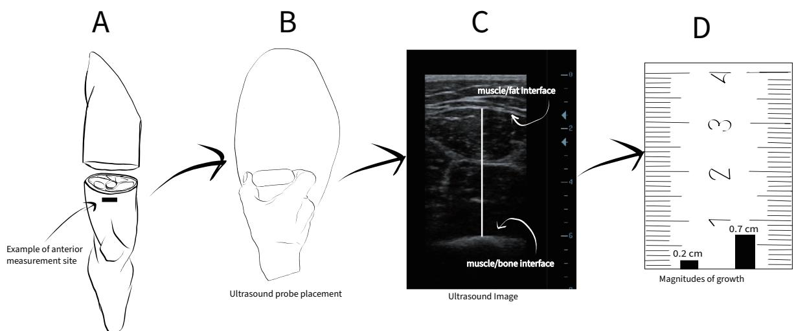

REVIEW ARTICLE

# The dose-response relationship between resistance training volume and muscle hypertrophy: There are still doubts

Samuel L. Buckner, Enrique N. Moreno, Holly T. Baxter

Within the resistance training and muscle growth research space, the importance of resistance training volume is often touted as one of, if not, the single most important variable to consider when designing a resistance training intervention, especially as it pertains to resistance trained individuals. Objectives: To examine the literature used to suggest that volume is the primary driver of skeletal muscle growth. Design and Methods: Non-systematic review. Research articles were collected using search terms such as resistance training OR resistance training volume. These terms were combined with AND: quadriceps muscle thickness, OR biceps muscle thickness, and other muscle-site related terms. Results: Studies in resistance trained individuals that suggest a dose-response relationship between resistance training volume and muscle growth have observed a magnitude of muscle growth that is greater than what is typically observed. For example, it may be common to observe a 0.1-0.25 cm increase in quadriceps muscle thickness following an intervention. However, studies have observed changes as high as 0.6-0.72 cm in quadriceps muscle thickness. In addition, there are several investigations demonstrating similar growth between lower and higher volume training protocols in resistance trained individuals. Conclusions: While resistance training volume may very well be one of the more important factors influencing the hypertrophic response in resistance trained individuals, we would suggest that the current evidence is much more ambiguous. Replication of the current findings may be necessary before strong conclusions are drawn. While some threshold of training volume is likely necessary for muscle growth, the current recommendations may exaggerate its importance. (Journal of Trainology 2023;12:29-36)

Key words:  Muscle Growth  Resistance Training  Volume  Dose-Response; B-mode Ultrasound

## INTRODUCTION

Within the resistance training (RT) literature it is very common to see documented the importance of training volume (often defined as repetitions x sets x load1 ) emphasized with regard to skeletal muscle (SM) growth adaptations.1-3 For example, a recent publication titled: “Evidence-Based Guidelines for Resistance Training Volume to Maximize Muscle Hypertrophy”4 made the suggestion that: “There is compelling evidence that RT volume is a primary driver of hypertrophy, with higher volumes showing greater increases in muscle growth”.4 Within these recommendations, authors suggest that “10+ sets” per muscle group per week would be a good starting point for a hypertrophy-oriented training program. In addition, authors present a hypothetical periodized training program (Table 2 in Schoenfeld et al.4 ) where individuals may be performing 20-25 sets per muscle group per week during a functional overreaching phase (8 weeks’ time in the example). In 2016, a letter to the editor was published in the Journal of Sports Science titled: “The dose–response relationship between resistance training volume and muscle hypertrophy: are there really still any doubts?”.2 The title and contents of this manuscript perpetuate the idea that volume is the primary driver of SM growth and that the scientific community has reached a point of agreement regarding this issue. Despite this, the authors of the present manuscript would suggest that there is still a great deal of skepticism around the importance of resistance training volume within the scientific community.5-7 In particular, many of the studies cited regarding the importance of resistance training volume have observed changes in muscle size that are of a magnitude not typically observed when examining other studies in the resistance training literature (i.e., a large magnitude). In addition, limitations of studies that do not observe a dose-response between muscle growth and volume are often pointed out (e.g., sample size too small, untrained subjects, study duration too short), while studies showing a clearer dose-response are not given the same scrutiny, despite similar shortcomings/ limitations. The meta-analysis published in 2016 suggested that there exists a dose-response relationship between resistance training volume and muscle growth.1 However, of the two papers included in the review that were conducted in resistance trained individuals, neither intervention demonstrated significant differences between their higher and lower volume training groups when examining changes in fat free mass8 or changes in muscle cross-sectional area (CSA).6 More recent papers in resistance trained individuals have demonstrated a more clear relationship between increased training volume and increased muscle growth, however, the magnitude of changes observed in these studies3,9 stands out as the growth is \~2-7x the magnitude of what is observed in other studies across the resistance training literature. Resistance training volume may very well be the most important factor for stimulating SM growth adaptations. However, the purpose of the present manuscript is to explain why the current evidence cited for the importance of training volume in resistance trained individuals may not warrant the conviction expressed in position stands and expert statements.

## Study Selection

A non-systematic review was performed. In general, research articles were collected using search terms such as resistance training OR resistance training volume. These terms were combined with AND: quadriceps muscle thickness, OR biceps muscle thickness, OR vastus lateralis muscle thickness OR rectus femoris muscle thickness, OR quadriceps cross-sectional area, OR vastus lateralis cross-sectional area, OR biceps cross-sectional area. Papers were also identified through references in related reviews on resistance training volume and muscle growth.4,2,1 For the purposes of the present manuscript only studies examining resistance trained individuals were included in the discussion. Our search was not meant to be exhaustive, but representative of the overall literature on the topic.

## Evidence Against a Dose-Response Relationship Between Training Volume and Muscle Growth

Although the dose-response relationship between volume and SM growth is suggested to have compelling evidence2 we would suggest that the data is more ambiguous than clear. For example, Heaselgrave et al.5 examined changes in biceps brachii muscle thickness (MT) following 6-weeks of low (9 sets per week), moderate (18 sets per week) or high (27 sets per week) volume RT in 49 resistance trained males. Exercises included in the intervention were the seated supine biceps curl, the supine grip bent-over row, and the supine grip pulldown. Following the 6-week time period, authors noted changes in MT in the magnitude of 0.1 cm, 0.3 cm, and 0.2 cm for the low, moderate, and high volume groups, respectively, with no significant differences noted between groups.5 Similar to this, Ostrowski et al.6 examined changes in muscle size of the rectus femoris and triceps brachia (via B-mode ultrasound) in response to 10 weeks of low (3 sets per muscle group per week), moderate (6 sets per muscle group per week) or high (12 sets per muscle group per week) RT volume in 27 resistance trained men. The training program is provided in Table 1. Following the intervention, authors observed changes in triceps brachia MT of 0.1 cm, 0.2 cm, and 0.2 cm for their low, moderate, and high volume training groups, respectively, with no statistically significant differences between groups.6 For the rectus femoris, authors observed changes of 63 mm2 , 47 mm2 , and 113 mm2 for their low, moderate, and high volume training groups, respectively, with no statistically significant differences between groups.6 Thus, this study provided evidence that performing higher amounts of weekly volume did not bring about any additional advantages/benefits when compared to lower and moderate volume approaches.

Amirthalingam et al.7 examined upper and lower body changes in MT following a low volume (5 sets of 10 repetitions for the major lifts) versus a relatively higher volume training program (10 sets of 10 repetitions for the major lifts) in a group of resistance trained men. The complete training program is provided in Table 2. For quadriceps work, participants completed a total of 24 weekly sets (10 sets of leg press, 10 sets of dumbbell lunges and 4 sets of leg extensions), compared to the lower volume group which completed 14 weekly sets of quadriceps work (total quadriceps volume may be debated depending on lounge and leg press technique). Following the intervention, authors observed no significant increases in muscle mass as measured by B-mode ultrasound in either group at any of the muscle sites imaged. When examining the anterior thigh, there were non-significant increases of 0.26 cm and 0.11 cm in the low and high volume groups, respectively. Together these studies5,6,7 and others14 provide evidence that there is a lack of a dose-response relationship between resistance training volume and growth in resistance trained individuals.

## Evidence for a Dose-Response Relationship Between Resistance Training Volume and Growth

Despite there being research demonstrating no differences in SM growth between low, moderate, and high volume training programs, other studies have found what appears to be a clearer dose-response relationship. For example, one of the most cited papers3 suggesting a dose-response relationship between exercise volume and changes in MT reported a 0.29 cm, 0.46 cm, and a 0.72 cm increase in lateral thigh MT in their low volume, moderate volume, and high volume groups, respectively, following 8-weeks of full body RT (performed 3x weekly). Participants in this study were resistance trained, and the program included the following exercises: flat barbell bench press, barbell military press, wide grip lateral pull down, seated cable row, barbell back squat, machine leg press, and unilateral machine leg extension.3 Muscle thickness was measured via B-mode ultrasound, with measures taken at 50% the distance between the lateral condyle of the femur and greater trochanter for the rectus femoris and vastus lateralis muscles. When quantifying volume as total weekly sets authors noted that there were 6, 18 or 30 upper body sets for the low, moderate, and high volume groups, respectively. For the lower body there were 9, 27 or 45 weekly sets for the low, moderate and high volume groups respectively.3 Overall, the authors suggest a dose-response relationship between volume and SM growth in their conclusions.3 However, when examining the results, there were no significant difference between groups for changes in triceps MT.3 In addition, there were no statistical differences between the moderate volume and high volume groups for elbow flexor MT (BF10 = 0.60).3 When examining changes in the mid-thigh and lateral thigh, there weak evidence in favor of high volume versus moderate volume groups (BF10 = 2.34 and 2.25 for the mid-thigh and lateral thigh respectively).3 Nevertheless, what is most interesting about the findings is the large magnitude of SM growth observed. Specifically, 0.72 cm of SM growth in the high volume group for the lateral thigh over an 8-week time frame is much greater than what is typically observed in the RT literature. This is not limited to MT of the leg, as mid-thigh MT in the high volume group also observed unusually robust SM growth (0.68 cm).3

Table 1: Training Program from Ostrowski et al. 6
<table><tr><td>Training Day</td><td>Exercise Performed</td></tr><tr><td>Day 1</td><td>Squat, Leg Press, Leg Extension, Stiff-Leg Deadlift, Leg Curl, Single-Leg Curl</td></tr><tr><td>Day 2</td><td>Bench Press, Incline Bench Press, Decline Bench Press, Shoulder Press, Upright Row, Lateral Raise</td></tr><tr><td>Day 3</td><td>Lat Pulldown, T-Bar Pulldown, Seated row, Calf Raise, Calf Press, Seated Calf Raise</td></tr><tr><td>Day 4</td><td>Barbell Curl, Preacher Curl, Dumbbell Curl, Close Grip Bench, Triceps Pushdown, Triceps Extension</td></tr></table>

Adapted from Ostrowski et al. 6 table 1. Low volume performed 1 set per exercise, moderate volume performed 2 sets per exercise, high volume performed 4 sets per exercise. .

Table 2: Training Program from Amirthalingam et al.7
<table><tr><td colspan="3">Session 1</td><td colspan="3">Session 2</td><td colspan="3">Session 3</td></tr><tr><td>Exercise</td><td>Load (%1RM)</td><td>Sets x Repetitions</td><td>Exercise</td><td>Load (% 1RM)</td><td>Sets x Repetitions</td><td>Exercise</td><td>Load (% 1RM)</td><td>Sets x Repetitions</td></tr><tr><td>Flat bench press 60% 1RM</td><td></td><td>10 or 5x10</td><td>Leg Press</td><td>80% 1RM</td><td>10 or 5x10</td><td>Shoulder press</td><td>60% 1RM</td><td>10 or 5 x 10</td></tr><tr><td>Latt pull-down</td><td>60% 1RM</td><td>10 or 5x10</td><td>DB Lunge</td><td>70% 1RM</td><td>10 or 5x10</td><td>Upright row</td><td>60% 1RM</td><td>10 or 5 x 10</td></tr><tr><td>Incline bench press</td><td>70% 1RM</td><td>4 x10</td><td>Leg extension</td><td>70% 1RM</td><td>4x10</td><td>Tricep push downs</td><td>70% 1RM</td><td>4 x 10</td></tr><tr><td>Seated row</td><td>70% 1RM</td><td>4x10</td><td>Leg curl</td><td>70% 1RM</td><td>4x10</td><td>Bicep curls</td><td>60% 1RM</td><td>4 x 10</td></tr><tr><td>Crunches</td><td>Close to RM</td><td>3x20</td><td>Calf raisers</td><td>Close to RM</td><td>3x20</td><td>Sit-ups with twist</td><td>Close to RM</td><td>3x20</td></tr></table>

Adapted from Amirthalingam et al.7 table 1. 1RM = One repetition maximum; RM = Repetition maximum

To provide a point of reference, Aube et al.14 examined muscle growth in resistance trained men following 8-weeks of lower body exercise (i.e., barbell back squat and leg press exercises) when performing either 12-, 18-, or 24-weekly sets to or near muscular failure. Authors observed no statistical differences amongst their different volumes of training following the intervention period. Of note, authors observed an increase of 0.15 cm at 50% the distance of the anterior thigh in the 24 weekly set group.14 In the Schoenfeld investigation the mid-thigh measurement increased by 0.68 cm in the 45 weekly set condition. Such large differences between studies stand out, particularly when it is considered that Schoenfeld et al.3 observed a magnitude of growth that was 4.5x that observed by Aube et al.14. The impressiveness of such a large change in MT will be discussed in subsequent sections. However, Table 3 provides magnitudes of muscle growth across several studies in the resistance training literature. Herein, the reader can observe that muscle growth rarely exceeds 0.4 cm.

## Volume Indirectly Through Rest Periods

The importance of RT literature volume is further highlighted in a previous investigation9 that examined long- versus short-interset rest intervals on SM growth in resistance trained individuals. Authors employed an 8-week full-body RT program (performed 3x week) wherein individuals performed 3 sets of an 8-12 RM per exercise (27 weekly sets) and each group was allotted either 3 mins of rest (i.e., LONG) or 1 min of rest (i.e., SHORT) between sets.9 These authors9 measured MT via B-mode ultrasound at various muscle sites, namely the anterior thigh, vastus lateralis, elbow flexors, and triceps brachii. Following the training period, authors observed significantly greater increases in anterior thigh MT (p = 0.04) in favor of the LONG group. Additionally, the LONG group experienced significant increases in triceps brachii MT pre-to-post-intervention, while the SHORT group did not observe significant increases.9 It is interesting to note that for the anterior thigh, the LONG group (+0.71 cm; +13.3%) experienced nearly double the increase in MT than that of the SHORT group (+0.36 cm; +6.9%).2 This is a similar magnitude of growth as observed in the 45 weekly set group of the volume investigation previously discussed3 and is outside of what is typically seen in the literature. Similarly, the changes in triceps brachii MT were several times greater in the LONG group (+0.29 cm; +7%) when compared to the SHORT group (+0.02 cm; +0.5%). Authors speculated that such differences in muscle growth were driven by the higher total volume load performed by the LONG group over the 8-week period. However, it is worth noting that there were no statistically significant differences in volume of work performed, nor were there significant correlations between total load volume and changes in the various measurements. The authors suggest that the beneficial effects of longer rest intervals may be mediated by a higher volume load, but ultimately concede that the study was underpowered to make this determination. This study, along with the others have resulted in recommendations in a recent position stand, where it is suggested that longer rest periods may be more beneficial for SM hypertrophy, presumably through the greater volume load compared with shorter rest periods.13

  
Figure 1 provides an illustration of A) Measurement site for muscle thickness (MT) of the Figure 1 provides an illustration of A) Measurement site for muscle thickness (MT) of the anterior thigh; B) How MT is mea- anterior thigh; B) How MT is measured on the anterior thigh C) Example of a MT image taken sured on the anterior thigh C) Example of a MT image taken using B-mode ultrasound and D) Illustration of typical (0.2 cm) using B-mode ultrasound and D) Illustration of tyand large (0.7 cm) magnitudes of muscle growth (not to scale)

## Is this Amount of Growth Possible?

If performing higher amounts of training volume were indeed to play this dramatic of a role in promoting muscle growth, it begs the question as to why other studies conducted outside of this research group have not observed such differences in muscle size between groups. For example, the previously mentioned investigation by Aube et al.14 found no statistical differences for muscle growth in resistance trained men after 8-weeks of lower body exercise when performing either 12-, 18-, or 24-weekly sets to or near volitional fatigue. Pertaining changes in anterior thigh MT, authors observed the highest responses in the 12-weekly set group (+0.38 cm; +6.4%), whereas the 24-weekly set group observed the lowest responses (+0.15 cm; +2.7%), despite performing double the amount of exercise sets.14 When one looks from both an absolute and relative perspective, the changes in the highest response group in this study (+0.38 cm; +6.4%)14 were on par with the lowest response group (+0.36 cm; +6.9%) observed in the previously mentioned study for anterior thigh MT and nearly half of the highest response group (+0.71 cm; +13.3%),9 which is quite surprising. Providing another example, referring back to the Amirthalingam et al.15 investigation, authors found no statistical differences in anterior thigh MT following 6 weeks of either 5- or 10-sets per lower body exercise per visit (i.e., leg press and dumbbell lunge) in resistance trained men (14 or 24 weekly sets). Despite the 10-set per session group performing double the training volume, the magnitude of muscle growth observed was higher in the lower volume group (+0.26 cm; +4.7%).15 Again, these changes in MT are significantly less in magnitude (both absolute and relative) compared to the previously mentioned studies in similar muscle groups, populations, and with similar study durations.9,3,16

When trying to interpret key papers3,9,2 highlighting the importance of RT volume, it is interesting to consider if certain magnitudes of growth are possible over the time frame observed. Using the Schoenfeld investigations3,9 with lower body MT data as an example, there are only two other studies (that we are aware of) that have observed muscle growth of a similar magnitude.17,18 The first study was by Barbalho et al.18 whom observed increases of 0.66 cm and 0.8 cm for the quadriceps femoris in their groups that performed either 5 or 10 sets per session, respectively. For reasons which are outside the purpose of this present manuscript, this paper has been retracted and will not be discussed further. A 2014 investigation17 examined the effects of 12-weeks of periodized RT combined with either beta-Hydroxy-beta-methylbutyrate-free acid (HMB-FA) supplementation or a placebo on changes in muscle size. Amongst other outcomes, authors examined changes in lean body mass (measured via dual X-ray absorptiometry) and quadriceps femoris MT measured via B-mode ultrasound (determined as the combined MT of the vastus lateralis and vastus intermedius).17 After the 12-week training period, authors observed a 7.4 kg increase in lean body mass and an increase in MT from 50.2 mm to 57.4 mm (a mean change of 7.2 mm or 0.72 cm). Within the scientific community, this data has been criticized, with some authors pointing out that the change observed in lean body mass is greater than what some studies have found following anabolic steroid usage. We would also suggest that the change in MT observed by Wilson et al.17 is unusually high and warrants discussion. Considering that these recent studies3,9 have found comparable muscle growth in their higher volume groups, we suggest that replication of these studies is necessary before strong conclusions can be drawn in resistance trained individuals regarding the relationship between RT volume and muscle growth.

In an attempt to provide further perspective, lower body muscle growth measured across several RT studies are provided in Table 3. All of the provided studies were conducted in resistance trained individuals. For example, it can be seen that Amirthalingam et al.15 observed changes in MT of the anterior thigh in the magnitude of 0.26 and 0.11 for their 5- and 10-sets (14 or 24 weekly sets) groups, respectively. The reader can look across several different studies from different labs and note the slight differences in muscle growth across various time frames (4 weeks – 24 weeks). However, muscle growth rarely appears to exceed 0.4 cm over an 8-12-week duration. In addition, the reader may observe that the average change across all studies is around 0.28 cm. The studies included in this table were not necessarily designed to examine the influence of training volume on muscle growth adaptations. Instead, these studies are included to better familiarize the reader with common MT changes that are observed following resistance training interventions. This will allow the reader to further evaluate the available data and ponder possibilities much like ourselves. While no data should be dismissed or discredited, it may result in putting less weight in certain studies until replication of the results is performed. Figure 1 is provided in order to help the reader visualize what MT may look like, how MT is measured, and what magnitudes of change look like side-by-side.

## Possible Explanations

It is possible that such dissimilarities in muscle growth may very well be explained by methodological differences between lab groups. It is important to consider that often nonexercise control groups are missing from interventions. This may be crucial to understanding the error of measurements when imaging muscle sites several weeks apart and may better aid in contextualizing the magnitudes of growth observed. Additionally, it is conceivable that different training in ultrasound methods or interface selection when analyzing ultrasound images may explain some of the differences between studies. Another possibility is that excess swelling resulting from high volume protocols may be mis-interpreted for muscle growth. Although swelling does not appear to accumulate across a training week19 and is suggested to dissipate 48-72 hours following a training bout,20 it does seem possible that heightened swelling may be present with high volume training. For example, the study cited by Schoenfeld et al.3 for their suggestion that acute increases in MT return to baseline within 48 h after an RT session is a paper that cites pilot data (data not presented) to suggest that acute muscle swelling from bench press exercise returns to baseline within 24 hours. Furthermore, the protocol used in the paper referenced had participants perform 3 sets of 10 repetitions on the bench press exercise 3 days per week (9 sets per week total),21 which is considerably less that what was employed in the Schoenfeld investigation.3 In addition, Buckner et al.19 demonstrated that swelling may be minimal in the days following an exercise bout. However, authors had individuals perform an acute exercise bout consisting of 4 sets of biceps curls at 70% of participants 1RM.19 When training with higher volumes, perhaps additional days (e.g., 96-120 hours) between the final training session and post-testing are necessary to allow swelling and inflammation to decrease. Finally, it is possible that the highlighted papers on volume3,9 were simply more effective for growth and perhaps other studies are under-dosing participants. This may be attributed to the additional volume, the experience and effectiveness of the training staff, or a combination of both these factors.

## CONCLUSION

While RT volume may very well be one of the more important factors influencing the hypertrophic response in resistance trained individuals, we would suggest that the current evidence is much more ambiguous than clear. Indeed, recent work has demonstrated that groups that train with higher volumes experience a greater magnitude of growth compared to groups training with lower volumes.3,9,16 However, these studies appear to observe magnitudes of growth that may be outside of what is expected over the time frame examined. Even if volume does contribute to additional muscle growth with additional exercise sets, it is unlikely (in our opinion) that an increase in the magnitude of 0.7cm at the group level is possible over 8-weeks’ time as depicted by Schoenfeld et al.3 For these reasons, replication of these findings may be necessary before strong conclusions are drawn. If these studies are interpreted with caution, there appears to be much less compelling evidence that there is a dose-response between resistance training volume and muscle growth in resistance trained individuals. In fact, there are several investigations demonstrating similar growth between lower and higher volume training protocols in resistance trained individuals.5-7 While there appears to be some threshold of volume that is necessary for muscle growth, the current recommendations may exaggerate its importance. It is our hope that this paper stimulates positive inquiry around in the area of RT volume and muscle growth.

## CONFLICTS OF INTEREST

SLB and ENM declare that they have no conflicts of interest that are relevant to the content of this article. HTB is owner of a nutrition and training education company.

## REFERENCES

1. Schoenfeld BJ, Ogborn D, Krieger JW. Dose-response relationship between weekly resistance training volume and increases in muscle mass: A systematic review and meta-analysis. J Sports Sci 2017; 35: 1073-1082.

2. Schoenfeld BJ, Ogborn D, Krieger JW. The dose–response relationship between resistance training volume and muscle hypertrophy: are there really still any doubts? J Sports Sci 2017; 35: 1985-1987.

3. Schoenfeld BJ, Contreras B, Krieger J et al. Resistance training volume enhances muscle hypertrophy but not strength in trained men. Med Sci Sports Exerc 2019;51;1:94.

4. Schoenfeld B, Grgic J. Evidence-based guidelines for resistance training volume to maximize muscle hypertrophy. Strength Cond J 2018; 40: 107- 112.

5. Heaselgrave SR, Blacker J, Smeuninx B et al. Dose-response relationship

of weekly resistance-training volume and frequency on muscular adaptations in trained men. Int J Sports Physiol Perform 2019; 14: 360- 368.

6. Ostrowski KJ, Wilson GJ, Weatherby R et al. The effect of weight training volume on hormonal output and muscular size and function. J Strength Cond Res 1997; 11: 148-154.

7. Amirthalingam T, Mavros Y, Wilson GC et al. Effects of a Modified German Volume Training Program on Muscular Hypertrophy and Strength. J Strength Cond Res 2017; 31: 3109-3119.

8. Rhea MR, Alvar BA, Ball SD et al. Three sets of weight training superior to 1 set with equal intensity for eliciting strength. J Strength Cond Res 2002; 16: 525-529.

9. Schoenfeld BJ, Pope ZK, Benik FM et al. Longer interset rest periods enhance muscle strength and hypertrophy in resistance-trained men. J Strength Cond Res 2016; 30: 1805-1812.

10. Jakubowski JS, Wong EP, Nunes EA et al. Equivalent hypertrophy and strength gains in β-Hydroxy-β-Methylbutyrate-or Leucine-supplemented men. Med Sci Sports Exerc 2019; 51: 65-74.

11. Kraemer WJ, Hatfield DL, Volek JS et al. Effects of amino acids supplement on physiological adaptations to resistance training. Med Sci Sports Exerc 2009; 41: 1111-1121.

12. Jessee M, Buckner S, Mouser JG et al. Muscle adaptations to high-load training and very low-load training with and without blood flow restriction. Front Physiol 2018; 9: 1448.

13. Schoenfeld B, Fisher J, Grgic J et al. Resistance training recommendations to maximize muscle hypertrophy in an athletic population: Position stand of the IUSCA. Int J Strength Cond 2021; 1: 1.

14. Aube D, Wadhi T, Rauch J et al. Progressive resistance training volume: Effects on muscle thickness, mass, and strength adaptations in resistancetrained individuals. J Strength Cond Res 2022; 36: 600-607.

15. Amirthalingam T, Mavros Y, Wilson GC et al. Effects of a modified German volume training program on muscular hypertrophy and strength. J Strength Cond Res 2017; 31: 3109-3119.

16. Longo AR, Silva-Batista C, Pedroso K et al. Volume load rather than resting interval influences muscle hypertrophy during high-intensity resistance training. J Strength Cond Res 2022; 36: 1554-1559.

17. Wilson JM, Lowery RP, Joy JM et al. The effects of 12 weeks of betahydroxy-beta-methylbutyrate free acid supplementation on muscle mass, strength, and power in resistance-trained individuals: a randomized, double-blind, placebo-controlled study. Eur J Appl Physiol 2014; 114: 1217-1227.

18. Barbalho M, Coswig V, Steele J et al. Evidence for an upper threshold for resistance training volume in trained women. Med Sci Sports Exerc 2019; 51: 515-522.

19. Buckner SL, Dankel SJ, Mattocks KT et al. Differentiating swelling and hypertrophy through indirect assessment of muscle damage in untrained men following repeated bouts of resistance exercise. Eur J Appl Physiol 2017; 117: 213-224.

20. Damas F, Phillips SM, Libardi CA et al. Resistance training-induced changes in integrated myofibrillar protein synthesis are related to

hypertrophy only after attenuation of muscle damage. J Physiol 2016; 594: 5209-5222.

21. Ogasawara R, Thiebaud RS, Loenneke JP et al. Time course for arm and chest muscle thickness changes following bench press training. Interv Med Appl Sci 2012; 4: 217-220.

22. Baz-Valle E, Schoenfeld BJ, Torres-Unda J et al. The effects of exercise variation in muscle thickness, maximal strength and motivation in resistance trained men. PloS One 2019; 14: e0226989.

23. Brigatto FA, Lima LEdM, Germano MD et al. High resistance-training volume enhances muscle thickness in resistance-trained men. J Strength Cond Res 2022; 36: 22-30.

24. Brigatto FA, Braz TV, da Costa Zanini TC et al. Effect of resistance training frequency on neuromuscular performance and muscle morphology after 8 weeks in trained men. J Strength Cond Res 2019; 33: 2104-2116.

25. Costa BDdV, Kassiano W, Nunes JP et al. Does Performing Different Resistance Exercises for the Same Muscle Group Induce Nonhomogeneous Hypertrophy? Int J Sports Med 2021; 42: 803-811.

26. Ema R, Saito I, Akagi R. Neuromuscular adaptations induced by adjacent joint training. Scand J Med Sci Sports 2018; 28: 947-960.

27. Gonzalez AM, Sell KM, Ghigiarelli JJ et al. Effects of phosphatidic acid supplementation on muscle thickness and strength in resistance-trained men. Appl Physiol Nutr Metab 2017; 42: 443-448.

28. Joy JM, Lowery RP, Wilson JM et al. The effects of 8 weeks of whey or rice protein supplementation on body composition and exercise performance. Nutr J 2013; 12: 1-7.

29. Lasevicius T, Schoenfeld BJ, Grgic J et al. Similar muscular adaptations in resistance training performed two versus three days per week. J Human Kinetics 2019; 68: 135.

30. Mangine GT, Hoffman JR, Gonzalez AM et al. The effect of training volume and intensity on improvements in muscular strength and size in resistance-trained men. Physiol Rep 2015; 3: e12472.

31. Melville GW, Siegler JC, Marshall PW. The effects of d-aspartic acid supplementation in resistance-trained men over a three month training period: A randomised controlled trial. PLoS One 2017; 12: e0182630.

32. Pearson J, Wadhi T, Barakat C et al. Does varying repetition tempo in a single-joint lower body exercise augment muscle size and strength in resistance-trained men? J Strength Cond Res 2022; 36: 2162-2168.

33. Schoenfeld BJ, Grgic J, Contreras B et al. To flex or rest: does adding no-load isometric actions to the inter-set rest period in resistance training enhance muscular adaptations? A randomized-controlled trial. Front Physiol 2020; 10: 1571.

34. Schoenfeld BJ, Peterson MD, Ogborn D et al. Effects of low-vs. high-load resistance training on muscle strength and hypertrophy in well-trained men. J Strength Cond Res 2015; 29: 2954-2963.

35.Schwanbeck SR, Cornish SM, Barss T et al. Effects of training with free weights versus machines on muscle mass, strength, free testosterone, and free cortisol levels. J Strength Cond Res 2020; 34: 1851-1859.

36.Zaroni RS, Brigatto FA, Schoenfeld BJ et al. High resistance-training frequency enhances muscle thickness in resistance-trained men. J Strength Cond Res 2019; 33: S140-S151.

Table 3: Changes in Muscle Thickness in The Lower Body of Resistance Trained Individuals
<table><tr><td colspan="1" rowspan="1">Reference/Condition</td><td colspan="1" rowspan="1">Study Sampleinncluded inanalysis</td><td colspan="1" rowspan="1">Sample Size PerCondition (ifspecified</td><td colspan="1" rowspan="1">Muscle Site Measured (%i pprovided)</td><td colspan="1" rowspan="1"># OfWeeks</td><td colspan="4" rowspan="1">Weekly Sets forQuads</td><td colspan="1" rowspan="1">Pre MTH (SD)cm</td><td colspan="1" rowspan="1">Post MTH (SD)cm</td><td colspan="1" rowspan="1">Change in cm</td></tr><tr><td colspan="1" rowspan="1">Amirthalingam (10-sets)15</td><td colspan="1" rowspan="1">19</td><td colspan="1" rowspan="1">n = 10</td><td colspan="1" rowspan="1">Anterior thigh (50%)</td><td colspan="1" rowspan="1">6</td><td colspan="4" rowspan="1">24 sets</td><td colspan="1" rowspan="1">5.33 (0.78)</td><td colspan="1" rowspan="1">5.44 (0.72)</td><td colspan="1" rowspan="1">0.11</td></tr><tr><td colspan="1" rowspan="1">Amirthalingam (5-sets)15</td><td colspan="1" rowspan="1">19</td><td colspan="1" rowspan="1">n = 9</td><td colspan="1" rowspan="1">Anterior thigh (50%)</td><td colspan="1" rowspan="1">6</td><td colspan="4" rowspan="1">14 sets</td><td colspan="1" rowspan="1">5.31 (0.92)</td><td colspan="1" rowspan="1">5.57 (0.97)</td><td colspan="1" rowspan="1">0.26</td></tr><tr><td colspan="1" rowspan="1">Aube (12-sets)14</td><td colspan="1" rowspan="1">35</td><td colspan="1" rowspan="1">n = 13</td><td colspan="1" rowspan="1">Anterior thigh (50%)</td><td colspan="1" rowspan="1">8</td><td colspan="4" rowspan="1">12 sets</td><td colspan="1" rowspan="1">5.8 (1.0)</td><td colspan="1" rowspan="1">6.2 (1.0)</td><td colspan="1" rowspan="1">0.38</td></tr><tr><td colspan="1" rowspan="1">Aube (12-sets)14</td><td colspan="1" rowspan="1">35</td><td colspan="1" rowspan="1">n = 13</td><td colspan="1" rowspan="1">Anterior thigh (75%)</td><td colspan="1" rowspan="1">8</td><td colspan="4" rowspan="1">12 sets</td><td colspan="1" rowspan="1">3.4 (0.9)</td><td colspan="1" rowspan="1">3.8 (1.0)</td><td colspan="1" rowspan="1">0.34</td></tr><tr><td colspan="1" rowspan="1">Aube (18-sets)14</td><td colspan="1" rowspan="1">35</td><td colspan="1" rowspan="1">n = 12</td><td colspan="1" rowspan="1">Anterior thigh (50%)</td><td colspan="1" rowspan="1">8</td><td colspan="4" rowspan="1">18 sets</td><td colspan="1" rowspan="1">5.7 (0.9)</td><td colspan="1" rowspan="1">6.0 (0.7)</td><td colspan="1" rowspan="1">0.32</td></tr><tr><td colspan="1" rowspan="1">Aube (18-sets)14</td><td colspan="1" rowspan="1">35</td><td colspan="1" rowspan="1">n = 12</td><td colspan="1" rowspan="1">Anterior thigh (75%)</td><td colspan="1" rowspan="1">8</td><td colspan="4" rowspan="1">18 sets</td><td colspan="1" rowspan="1">3.1 (0.9)</td><td colspan="1" rowspan="1">3.4 (0.9)</td><td colspan="1" rowspan="1">0.28</td></tr><tr><td colspan="1" rowspan="1">Reference/Condition</td><td colspan="1" rowspan="1">Study Sample(included inanalysis)</td><td colspan="1" rowspan="1">Sample Size PerCondtion (ifspecified)</td><td colspan="1" rowspan="1">Muscle Site Measured (%provided)</td><td colspan="1" rowspan="1"># OfWeeks</td><td colspan="4" rowspan="1">Weekly Sets forQuads</td><td colspan="1" rowspan="1">Pre MTH (SD)cm</td><td colspan="1" rowspan="1">Post MTH (SD)cm</td><td colspan="1" rowspan="1">Change in cm</td></tr><tr><td colspan="1" rowspan="1">Aube (24-sets)14</td><td colspan="1" rowspan="1">35</td><td colspan="1" rowspan="1">n = 10</td><td colspan="1" rowspan="1">Anterior thigh (50%)</td><td colspan="1" rowspan="1">8</td><td colspan="4" rowspan="1">24 sets</td><td colspan="1" rowspan="1">5.9 (0.7)</td><td colspan="1" rowspan="1">6.0 (0.7)</td><td colspan="1" rowspan="1">0.15</td></tr><tr><td colspan="1" rowspan="1">Aube (24-sets)14</td><td colspan="1" rowspan="1">35</td><td colspan="1" rowspan="1">n = 10</td><td colspan="1" rowspan="1">Anterior thigh (75%)</td><td colspan="1" rowspan="1">8</td><td colspan="4" rowspan="1">24 sets</td><td colspan="1" rowspan="1">3.0 (0.7)</td><td colspan="1" rowspan="1">3.4 (0.4)</td><td colspan="1" rowspan="1">0.39</td></tr><tr><td colspan="1" rowspan="1">Barbalho (G5)18</td><td colspan="1" rowspan="1">40</td><td colspan="1" rowspan="1">n = 10</td><td colspan="1" rowspan="1">Quadriceps femoris (50%)</td><td colspan="1" rowspan="1">24</td><td colspan="4" rowspan="1">5 sets</td><td colspan="1" rowspan="1">5.76 (0.42)</td><td colspan="1" rowspan="1">6.42 (0.48)</td><td colspan="1" rowspan="1">0.66</td></tr><tr><td colspan="1" rowspan="1">Barbalho (G10)18</td><td colspan="1" rowspan="1">40</td><td colspan="1" rowspan="1">n = 10</td><td colspan="1" rowspan="1">Quadriceps femoris (50%)</td><td colspan="1" rowspan="1">24</td><td colspan="4" rowspan="1">10 sets</td><td colspan="1" rowspan="1">5.92 (0.34)</td><td colspan="1" rowspan="1">6.72 (0.43)</td><td colspan="1" rowspan="1">0.8</td></tr><tr><td colspan="1" rowspan="1">Barbalho (G15)18</td><td colspan="1" rowspan="1">40</td><td colspan="1" rowspan="1">n = 10</td><td colspan="1" rowspan="1">Quadriceps femoris (50%)</td><td colspan="1" rowspan="1">24</td><td colspan="4" rowspan="1">15 sets</td><td colspan="1" rowspan="1">5.91 (0.43)</td><td colspan="1" rowspan="1">6.26 (0.47)</td><td colspan="1" rowspan="1">0.35</td></tr><tr><td colspan="1" rowspan="1">Barbalho (G20)18</td><td colspan="1" rowspan="1">40</td><td colspan="1" rowspan="1">n = 10</td><td colspan="1" rowspan="1">Quadriceps femoris (50%)</td><td colspan="1" rowspan="1">24</td><td colspan="4" rowspan="1">20 sets</td><td colspan="1" rowspan="1">5.7 (0.52)</td><td colspan="1" rowspan="1">5.88 (0.54)</td><td colspan="1" rowspan="1">0.18</td></tr><tr><td colspan="1" rowspan="1">Baz-Valle (EXP)22</td><td colspan="1" rowspan="1">22</td><td colspan="1" rowspan="1">n=9</td><td colspan="1" rowspan="1">Vastus lateralis (50%)</td><td colspan="1" rowspan="1">8</td><td colspan="4" rowspan="1">18 sets</td><td colspan="1" rowspan="1">1.54 (0.31)</td><td colspan="1" rowspan="1">1.69 (0.24)</td><td colspan="1" rowspan="1">0.15</td></tr><tr><td colspan="1" rowspan="1">Baz-Valle (EXP)22</td><td colspan="1" rowspan="1">22</td><td colspan="1" rowspan="1">n = 9</td><td colspan="1" rowspan="1">Rectus femoris (50%)</td><td colspan="1" rowspan="1">8</td><td colspan="4" rowspan="1">18 sets</td><td colspan="1" rowspan="1">1.54 (0.42)</td><td colspan="1" rowspan="1">1.62 (0.31)</td><td colspan="1" rowspan="1">0.08</td></tr><tr><td colspan="1" rowspan="1">Baz-Valle (EXP)22</td><td colspan="1" rowspan="1">22</td><td colspan="1" rowspan="1">n =9</td><td colspan="1" rowspan="1">Vastus intermedius (50%)</td><td colspan="1" rowspan="1">8</td><td colspan="4" rowspan="1">18 sets</td><td colspan="1" rowspan="1">1.76 (0.43)</td><td colspan="1" rowspan="1">1.9 (0.4)</td><td colspan="1" rowspan="1">0.14</td></tr><tr><td colspan="1" rowspan="1">Baz-Valle (CON)22</td><td colspan="1" rowspan="1">22</td><td colspan="1" rowspan="1">n = 10</td><td colspan="1" rowspan="1">Vastus lateralis (50%)</td><td colspan="1" rowspan="1">8</td><td colspan="4" rowspan="1">18 sets</td><td colspan="1" rowspan="1">1.57 (0.26)</td><td colspan="1" rowspan="1">1.72 (0.35)</td><td colspan="1" rowspan="1">0.15</td></tr><tr><td colspan="1" rowspan="1">Baz-Valle (CON)22</td><td colspan="1" rowspan="1">22</td><td colspan="1" rowspan="1">n = 10</td><td colspan="1" rowspan="1">Rectus femoris (50%)</td><td colspan="1" rowspan="1">8</td><td colspan="4" rowspan="1">18 sets</td><td colspan="1" rowspan="1">1.49 (0.3)</td><td colspan="1" rowspan="1">1.67 (0.28)</td><td colspan="1" rowspan="1">0.18</td></tr><tr><td colspan="1" rowspan="1">Baz-Valle (CON)22</td><td colspan="1" rowspan="1">22</td><td colspan="1" rowspan="1">n = 10</td><td colspan="1" rowspan="1">Vastus intermedius (50%)</td><td colspan="1" rowspan="1">8</td><td colspan="4" rowspan="1">18 sets</td><td colspan="1" rowspan="1">1.84 (0.44)</td><td colspan="1" rowspan="1">2.03 (0.33)</td><td colspan="1" rowspan="1">0.19</td></tr><tr><td colspan="1" rowspan="1">Brigatto (G16)23</td><td colspan="1" rowspan="1">27</td><td colspan="1" rowspan="1">n = 9</td><td colspan="1" rowspan="1">Vastus lateralis (50%)</td><td colspan="1" rowspan="1">8</td><td colspan="4" rowspan="1">16 sets</td><td colspan="1" rowspan="1">3.62 (0.44)</td><td colspan="1" rowspan="1">3.69 (0.4)</td><td colspan="1" rowspan="1">0.07</td></tr><tr><td colspan="1" rowspan="1">Brigatto (G24)23</td><td colspan="1" rowspan="1">27</td><td colspan="1" rowspan="1">n = 9</td><td colspan="1" rowspan="1">Vastus lateralis (50%)</td><td colspan="1" rowspan="1">8</td><td colspan="4" rowspan="1">24 sets</td><td colspan="1" rowspan="1">3.54 (0.5)</td><td colspan="1" rowspan="1">3.74 (0.46)</td><td colspan="1" rowspan="1">0.2</td></tr><tr><td colspan="1" rowspan="1">Brigatto (G32)23</td><td colspan="1" rowspan="1">27</td><td colspan="1" rowspan="1">n= 9</td><td colspan="1" rowspan="1">Vastus lateralis (50%)</td><td colspan="1" rowspan="1">8</td><td colspan="4" rowspan="1">32 sets</td><td colspan="1" rowspan="1">3.71 (0.51)</td><td colspan="1" rowspan="1">4.06 (0.51)</td><td colspan="1" rowspan="1">0.35</td></tr><tr><td colspan="1" rowspan="1">Brigatto (G1)24</td><td colspan="1" rowspan="1">20</td><td colspan="1" rowspan="1">n = 10</td><td colspan="1" rowspan="1">Vastus lateralis (50%)</td><td colspan="1" rowspan="1">8</td><td colspan="4" rowspan="1"></td><td colspan="1" rowspan="1">4.61 (0.48)</td><td colspan="1" rowspan="1">5.08 (0.45)</td><td colspan="1" rowspan="1">0.47</td></tr><tr><td colspan="1" rowspan="1">Brigatto (G1)24</td><td colspan="1" rowspan="1">20</td><td colspan="1" rowspan="1">n = 10</td><td colspan="1" rowspan="1">Anterior thigh (50%)</td><td colspan="1" rowspan="1">8</td><td colspan="4" rowspan="1">16 sets</td><td colspan="1" rowspan="1">4.13 (0.39)</td><td colspan="1" rowspan="1">4.55 (0.44)</td><td colspan="1" rowspan="1">0.42</td></tr><tr><td colspan="1" rowspan="1">Brigatto (G2)24</td><td colspan="1" rowspan="1">20</td><td colspan="1" rowspan="1">n = 10</td><td colspan="1" rowspan="1">Vastus lateralis (50%)</td><td colspan="1" rowspan="1">8</td><td colspan="4" rowspan="1"></td><td colspan="1" rowspan="1">4.63 (0.55)</td><td colspan="1" rowspan="1">5.12 (0.49)</td><td colspan="1" rowspan="1">0.49</td></tr><tr><td colspan="1" rowspan="1">Brigatto (G2)27</td><td colspan="1" rowspan="1">20</td><td colspan="1" rowspan="1">n = 10</td><td colspan="1" rowspan="1">Anterior thigh (50%)</td><td colspan="1" rowspan="1">8</td><td colspan="4" rowspan="1"></td><td colspan="1" rowspan="1">3.92 (0.35)</td><td colspan="1" rowspan="1">4.4 (0.37)</td><td colspan="1" rowspan="1">0.48</td></tr><tr><td colspan="1" rowspan="1">Gonzalez (PA)27</td><td colspan="1" rowspan="1">15</td><td colspan="1" rowspan="1"></td><td colspan="1" rowspan="1">Rectus femoris (50%)</td><td colspan="1" rowspan="1">8</td><td colspan="4" rowspan="1"></td><td colspan="1" rowspan="1">2.63 (0.29)</td><td colspan="1" rowspan="1">2.72 (0.36)</td><td colspan="1" rowspan="1">0.09</td></tr><tr><td colspan="1" rowspan="1">Gonzalez (PL)27</td><td colspan="1" rowspan="1">15</td><td colspan="1" rowspan="1"></td><td colspan="1" rowspan="1">Rectus femoris (50%)</td><td colspan="1" rowspan="1">8</td><td colspan="4" rowspan="1"></td><td colspan="1" rowspan="1">2.43 (0.33)</td><td colspan="1" rowspan="1">2.57(0.32)</td><td colspan="1" rowspan="1">0.09</td></tr><tr><td colspan="1" rowspan="1">Gonzalez (PA)27</td><td colspan="1" rowspan="1">15</td><td colspan="1" rowspan="1"></td><td colspan="1" rowspan="1">Vastus Lateralis (50%)</td><td colspan="1" rowspan="1">8</td><td colspan="4" rowspan="1"></td><td colspan="1" rowspan="1">2.1 (0.55)</td><td colspan="1" rowspan="1">2.61 (0.83)</td><td colspan="1" rowspan="1">0.51</td></tr><tr><td colspan="1" rowspan="1">Gonzalez (PL)27</td><td colspan="1" rowspan="1">15</td><td colspan="1" rowspan="1"></td><td colspan="1" rowspan="1">Vastus Lateralis (50%)</td><td colspan="1" rowspan="1">8</td><td colspan="4" rowspan="1"></td><td colspan="1" rowspan="1">1.8 (0.17)</td><td colspan="1" rowspan="1">2.02 (0.35)</td><td colspan="1" rowspan="1">0.22</td></tr><tr><td colspan="1" rowspan="1">Jakubowski(Whey+HMB)10</td><td colspan="1" rowspan="1">26</td><td colspan="1" rowspan="1">n = 13</td><td colspan="1" rowspan="1">Vastus lateralis (50%)</td><td colspan="1" rowspan="1">12</td><td colspan="4" rowspan="1"></td><td colspan="1" rowspan="1">0.31 (0.2)</td><td colspan="1" rowspan="1">0.32 (0.2)</td><td colspan="1" rowspan="1">0.1</td></tr><tr><td colspan="1" rowspan="1">Jakubowski (Whey+leu)10</td><td colspan="1" rowspan="1">26</td><td colspan="1" rowspan="1">n = 13</td><td colspan="1" rowspan="1">Vastus lateralis (50%)</td><td colspan="1" rowspan="1">12</td><td colspan="4" rowspan="1">8 setsPhase 1: 13 sets</td><td colspan="1" rowspan="1">0.3 (0.3)</td><td colspan="1" rowspan="1">0.32 (0.4)</td><td colspan="1" rowspan="1">0.2</td></tr><tr><td colspan="1" rowspan="1">Joy (Rice protein)28</td><td colspan="1" rowspan="1">24</td><td colspan="1" rowspan="1">n = 12</td><td colspan="1" rowspan="1">Quadriceps femoris</td><td colspan="1" rowspan="1">8</td><td colspan="4" rowspan="1">Phase 2: 12 setsPhase 3: 8-13 sets</td><td colspan="1" rowspan="1">5(0.4)</td><td colspan="1" rowspan="1">5.2 (0.5)</td><td colspan="1" rowspan="1">0.2</td></tr><tr><td colspan="1" rowspan="1">Joy (Whey protein)28</td><td colspan="1" rowspan="1">24</td><td colspan="1" rowspan="1">n = 12</td><td colspan="1" rowspan="1">Quadriceps femoris</td><td colspan="1" rowspan="1">8</td><td colspan="4" rowspan="1">Weekly sets isuclear</td><td colspan="1" rowspan="1">4.8 (0.7)</td><td colspan="1" rowspan="1">5.1 (0.5)</td><td colspan="1" rowspan="1">0.3</td></tr><tr><td colspan="1" rowspan="1">Lasevicius (TOTAL)29</td><td colspan="1" rowspan="1">28</td><td colspan="1" rowspan="1">n = 14</td><td colspan="1" rowspan="1">Rectus femoris (50%)</td><td colspan="1" rowspan="1">10</td><td colspan="4" rowspan="1">36  sets</td><td colspan="1" rowspan="1">2.27 (0.25)</td><td colspan="1" rowspan="1">2.45 (0.27)</td><td colspan="1" rowspan="1">0.18</td></tr><tr><td colspan="1" rowspan="1">Lasevicius (TOTAL)29</td><td colspan="1" rowspan="1">28</td><td colspan="1" rowspan="1">n = 14</td><td colspan="1" rowspan="1">Vastus lateralis (50%)</td><td colspan="1" rowspan="1">10</td><td colspan="4" rowspan="1"></td><td colspan="1" rowspan="1">2.12 (0.34)</td><td colspan="1" rowspan="1">2.38 (0.39)</td><td colspan="1" rowspan="1">0.26</td></tr><tr><td colspan="1" rowspan="1">Lasevicius (SPLIT)29</td><td colspan="1" rowspan="1">28</td><td colspan="1" rowspan="1">n = 14</td><td colspan="1" rowspan="1">Rectus femoris (50%)</td><td colspan="1" rowspan="1">10</td><td colspan="4" rowspan="1"></td><td colspan="1" rowspan="1">2.27 (0.26)</td><td colspan="1" rowspan="1">2.55 (0.22)</td><td colspan="1" rowspan="1">0.28</td></tr><tr><td colspan="1" rowspan="1">Lasevicius (SPLIT)29</td><td colspan="1" rowspan="1">28</td><td colspan="1" rowspan="1">n = 14</td><td colspan="1" rowspan="1">Vastus lateralis (50%)</td><td colspan="1" rowspan="1">10</td><td colspan="4" rowspan="1"></td><td colspan="1" rowspan="1">2.13 (0.29)</td><td colspan="1" rowspan="1">2.49 (0.31)</td><td colspan="1" rowspan="1">0.36</td></tr><tr><td colspan="1" rowspan="1">Mangine (VOL)30</td><td colspan="1" rowspan="1">29</td><td colspan="1" rowspan="1">n = 14</td><td colspan="1" rowspan="1">Rectus femoris (50%)</td><td colspan="1" rowspan="1">8</td><td colspan="4" rowspan="1"></td><td colspan="1" rowspan="1">2.7(n/a)</td><td colspan="1" rowspan="1">2.8 (0.3)</td><td colspan="1" rowspan="1">0.1</td></tr><tr><td colspan="1" rowspan="1">Mangine (VOL)30</td><td colspan="1" rowspan="1">29</td><td colspan="1" rowspan="1">n = 14</td><td colspan="1" rowspan="1">Vastus lateralis (50%)</td><td colspan="1" rowspan="1">8</td><td colspan="4" rowspan="1">16 sets</td><td colspan="1" rowspan="1">1.8 (n/a)</td><td colspan="1" rowspan="1">1.9 (0.3)</td><td colspan="1" rowspan="1">0.1</td></tr><tr><td colspan="1" rowspan="1">Mangine (INT)30</td><td colspan="1" rowspan="1">29</td><td colspan="1" rowspan="1">n = 15</td><td colspan="1" rowspan="1">Rectus femoris (50%)</td><td colspan="1" rowspan="1">8</td><td colspan="4" rowspan="1"></td><td colspan="1" rowspan="1">2.7(n/a)</td><td colspan="1" rowspan="1">2.6 (0.4)</td><td colspan="1" rowspan="1">-0.1</td></tr><tr><td colspan="1" rowspan="1">Mangine (INT)30</td><td colspan="1" rowspan="1">29</td><td colspan="1" rowspan="1">n = 15</td><td colspan="1" rowspan="1">Vastus lateralis (50%)</td><td colspan="1" rowspan="1">8</td><td colspan="4" rowspan="1">12 setsWeeks 1-6: 16</td><td colspan="1" rowspan="1">1.8 (n/a)</td><td colspan="1" rowspan="1">1.9 (0.2)</td><td colspan="1" rowspan="1">0.1</td></tr><tr><td colspan="1" rowspan="1">Melvile (placebo)31</td><td colspan="1" rowspan="1">19</td><td colspan="1" rowspan="1">n = 9</td><td colspan="1" rowspan="1">Vastus lateralis (33%)</td><td colspan="1" rowspan="1">12</td><td colspan="4" rowspan="1">sets</td><td colspan="1" rowspan="1">2.75 (0.37)</td><td colspan="1" rowspan="1">2.83 (0.4)</td><td colspan="1" rowspan="1">0.08</td></tr><tr><td colspan="1" rowspan="1">Melville (placebo)31</td><td colspan="1" rowspan="1">19</td><td colspan="1" rowspan="1">n =9</td><td colspan="1" rowspan="1">Vastus intermedius (33%)</td><td colspan="1" rowspan="1">12</td><td colspan="4" rowspan="1">Weeks 7-12: 20sets</td><td colspan="1" rowspan="1">1.72 (0.34)</td><td colspan="1" rowspan="1">1.84 (0.33)</td><td colspan="1" rowspan="1">0.12</td></tr><tr><td colspan="1" rowspan="1">Melville (placebo)31</td><td colspan="1" rowspan="1">19</td><td colspan="1" rowspan="1">n =9</td><td colspan="1" rowspan="1">Vastus lateralis (50%)</td><td colspan="1" rowspan="1">12</td><td colspan="4" rowspan="1"></td><td colspan="1" rowspan="1">2.58 (0.36)</td><td colspan="1" rowspan="1">2.66 (0.46)</td><td colspan="1" rowspan="1">0.08</td></tr><tr><td colspan="1" rowspan="1">Melville (placebo)31</td><td colspan="1" rowspan="1">19</td><td colspan="1" rowspan="1">n=9</td><td colspan="1" rowspan="1">Vastus intermedius (50%)</td><td colspan="1" rowspan="1">12</td><td colspan="4" rowspan="1">8 sets</td><td colspan="1" rowspan="1">1.72 (0.34)</td><td colspan="1" rowspan="1">1.84 (0.33)</td><td colspan="1" rowspan="1">0.12</td></tr><tr><td colspan="1" rowspan="1">Melville (DAA)31</td><td colspan="1" rowspan="1">19</td><td colspan="1" rowspan="1">n = 10</td><td colspan="1" rowspan="1">Vastus lateralis (33%)</td><td colspan="1" rowspan="1">12</td><td colspan="4" rowspan="1"></td><td colspan="1" rowspan="1">2.64 (0.41)</td><td colspan="1" rowspan="1">2.77 (0.48)</td><td colspan="1" rowspan="1">0.13</td></tr><tr><td colspan="1" rowspan="1">Melville (DAA)31</td><td colspan="1" rowspan="1">19</td><td colspan="1" rowspan="1">n = 10</td><td colspan="1" rowspan="1">Vastus intermedius (33%)</td><td colspan="1" rowspan="1">12</td><td colspan="4" rowspan="1"></td><td colspan="1" rowspan="1">1.91 (0.4)</td><td colspan="1" rowspan="1">1.98 (0.34)</td><td colspan="1" rowspan="1">0.07</td></tr><tr><td colspan="1" rowspan="1">Reference/Condition</td><td colspan="1" rowspan="1">Study Sampleincluded inanalysis)</td><td colspan="1" rowspan="1">Sample Size PerCondition (ifspecified)</td><td colspan="1" rowspan="1">Muscle Site Measured (%provided)</td><td colspan="1" rowspan="1">#ofWeeks</td><td colspan="4" rowspan="1">Weekly Sets forQuads</td><td colspan="1" rowspan="1">Pre MTH (SD)cm</td><td colspan="1" rowspan="1">Post MTH (SD)cm</td><td colspan="1" rowspan="1">Change in cm</td></tr><tr><td colspan="1" rowspan="1">Melville (DAA)31</td><td colspan="1" rowspan="1">19</td><td colspan="1" rowspan="1">n = 10</td><td colspan="1" rowspan="1">Vastus lateralis (50%)</td><td colspan="1" rowspan="1">12</td><td colspan="4" rowspan="1">Phase 1: 13 setsPhase 2: 12 sets</td><td colspan="1" rowspan="1">2.6 (0.47)</td><td colspan="1" rowspan="1">2.71 (0.46)</td><td colspan="1" rowspan="1">0.11</td></tr><tr><td colspan="1" rowspan="1">Melville (DAA)31</td><td colspan="1" rowspan="1">19</td><td colspan="1" rowspan="1">n = 10</td><td colspan="1" rowspan="1">Vastus intermedius (50%)</td><td colspan="1" rowspan="1">12</td><td colspan="4" rowspan="1">Phase : 8-13 sets</td><td colspan="1" rowspan="1">2.01 (0.46)</td><td colspan="1" rowspan="1">2.05 (0.46)</td><td colspan="1" rowspan="1">0.04</td></tr><tr><td colspan="1" rowspan="1">Pearson (FAST)32</td><td colspan="1" rowspan="1">13</td><td colspan="1" rowspan="1">n = 13</td><td colspan="1" rowspan="1">Anterior thigh (40%)</td><td colspan="1" rowspan="1">8</td><td colspan="4" rowspan="1">Weeks 1-4: 6 setsWeeks 5-8: 8 setsParticipantswere allowed tocontinue normaltraining outside ofstudy and this in-cluded additionalbilateral lowerbody exercise</td><td colspan="1" rowspan="1">6.6 (0.9)</td><td colspan="1" rowspan="1">6.9 (0.9)</td><td colspan="1" rowspan="1">0.3</td></tr><tr><td colspan="1" rowspan="1">Pearson (FAST)32</td><td colspan="1" rowspan="1">13</td><td colspan="1" rowspan="1">n = 13</td><td colspan="1" rowspan="1">Anterior thigh (60%)</td><td colspan="1" rowspan="1">8</td><td colspan="4" rowspan="1"></td><td colspan="1" rowspan="1">5.2 (0.9)</td><td colspan="1" rowspan="1">5.5 (0.9)</td><td colspan="1" rowspan="1">0.3</td></tr><tr><td colspan="1" rowspan="1">Pearson (SLOW)32</td><td colspan="1" rowspan="1">13</td><td colspan="1" rowspan="1">n = 13</td><td colspan="1" rowspan="1">Anterior thigh (40%)</td><td colspan="1" rowspan="1">8</td><td colspan="4" rowspan="4">36 sets59 sets</td><td colspan="1" rowspan="1">6.7 (0.9)</td><td colspan="1" rowspan="1">6.9 (0.9)</td><td colspan="1" rowspan="1">0.2</td></tr><tr><td colspan="1" rowspan="1">Pearson (SLOW)32</td><td colspan="1" rowspan="1">13</td><td colspan="1" rowspan="1">n = 13</td><td colspan="1" rowspan="1">Anterior thigh (60%)</td><td colspan="1" rowspan="1">8</td><td colspan="1" rowspan="1">5.5 (0.9)</td><td colspan="1" rowspan="1">5.6 (1.0)</td><td colspan="1" rowspan="1">0.1</td></tr><tr><td colspan="1" rowspan="1">Schoenfeld (1 set)3</td><td colspan="1" rowspan="1">34</td><td colspan="1" rowspan="1">n = 1</td><td colspan="1" rowspan="1">Rectus femoris (50%)</td><td colspan="1" rowspan="1">8</td><td colspan="1" rowspan="1">5.97 (0.67)</td><td colspan="1" rowspan="1">6.17 (0.55)</td><td colspan="1" rowspan="1">0.2</td></tr><tr><td colspan="1" rowspan="1">Schoenfeld (1 set)3</td><td colspan="1" rowspan="1">34</td><td colspan="1" rowspan="1">n = 1</td><td colspan="1" rowspan="1">Vastus lateralis (50%)</td><td colspan="1" rowspan="1">8</td><td colspan="1" rowspan="1">5.75 (0.6)</td><td colspan="1" rowspan="1">6.04 (0.63)</td><td colspan="1" rowspan="1">0.29</td></tr><tr><td colspan="1" rowspan="1">Schoenfeld (3 set)3</td><td colspan="1" rowspan="1">34</td><td colspan="1" rowspan="1">n = 12</td><td colspan="1" rowspan="1">Rectus femoris (50%)</td><td colspan="1" rowspan="1">8</td><td colspan="4" rowspan="1"></td><td colspan="1" rowspan="1">5.79 (0.81)</td><td colspan="1" rowspan="1">6.1 (0.87)</td><td colspan="1" rowspan="1">0.31</td></tr><tr><td colspan="1" rowspan="1">Schoenfeld (3 set)3</td><td colspan="1" rowspan="1">34</td><td colspan="1" rowspan="1">n = 12</td><td colspan="1" rowspan="1">Vastus lateralis (50%)</td><td colspan="1" rowspan="1">8</td><td colspan="4" rowspan="3">27 sets45 sets</td><td colspan="1" rowspan="1">5.79 (0.8)</td><td colspan="1" rowspan="1">6.25 (0.7)</td><td colspan="1" rowspan="1">0.46</td></tr><tr><td colspan="1" rowspan="1">Schoenfeld (5 set)3</td><td colspan="1" rowspan="1">34</td><td colspan="1" rowspan="1">n = 11</td><td colspan="1" rowspan="1">Rectus femoris (50%)</td><td colspan="1" rowspan="1">8</td><td colspan="1" rowspan="1">5.44 (0.34)</td><td colspan="1" rowspan="1">6.12 (0.45)</td><td colspan="1" rowspan="1">0.68</td></tr><tr><td colspan="1" rowspan="1">Schoenfeld (5 set)3</td><td colspan="1" rowspan="1">34</td><td colspan="1" rowspan="1">n = 1</td><td colspan="1" rowspan="1">Vastus lateralis (50%)</td><td colspan="1" rowspan="1">8</td><td colspan="1" rowspan="1">5.24 (0.62)</td><td colspan="1" rowspan="1">5.96 (0.58)</td><td colspan="1" rowspan="1">0.72</td></tr><tr><td colspan="1" rowspan="1">Schoenfeld (TRAD)33</td><td colspan="1" rowspan="1">27</td><td colspan="1" rowspan="1">n = 13</td><td colspan="1" rowspan="1">Anterior thigh (50%)</td><td colspan="1" rowspan="1">8</td><td colspan="4" rowspan="8">18 sets2 sets</td><td colspan="1" rowspan="1">5.8 (1.1)</td><td colspan="1" rowspan="1">6.1 (0.9)</td><td colspan="1" rowspan="1">0.28</td></tr><tr><td colspan="1" rowspan="1">Schoenfeld (TRAD)33</td><td colspan="1" rowspan="1">27</td><td colspan="1" rowspan="1">n = 13</td><td colspan="1" rowspan="1">Lateral thigh (50%)</td><td colspan="1" rowspan="1">8</td><td colspan="1" rowspan="1">5.5 (0.9)</td><td colspan="1" rowspan="1">6.0 (0.8)</td><td colspan="1" rowspan="1">0.45</td></tr><tr><td colspan="1" rowspan="1">Schoenfeld (ISO)3</td><td colspan="1" rowspan="1">27</td><td colspan="1" rowspan="1">n = 14</td><td colspan="1" rowspan="1">Anterior thigh (50%)</td><td colspan="1" rowspan="1">8</td><td colspan="1" rowspan="1">6 (0.9)</td><td colspan="1" rowspan="1">6.5 (0.9)</td><td colspan="1" rowspan="1">0.48</td></tr><tr><td colspan="1" rowspan="1">Schoenfeld (ISO)33</td><td colspan="1" rowspan="1">27</td><td colspan="1" rowspan="1">n = 14</td><td colspan="1" rowspan="1">Lateral thigh (50%)</td><td colspan="1" rowspan="1">8</td><td colspan="1" rowspan="1">5.8 (0.9)</td><td colspan="1" rowspan="1">6.2 (0.9)</td><td colspan="1" rowspan="1">0.41</td></tr><tr><td colspan="1" rowspan="1">Schoenfeld (SHORT)9</td><td colspan="1" rowspan="1">23</td><td colspan="1" rowspan="1">n = 12</td><td colspan="1" rowspan="1">Anterior thigh (50%)</td><td colspan="1" rowspan="1">8</td><td colspan="1" rowspan="1">5.25 (0.53)</td><td colspan="1" rowspan="1">5.61 (0.56)</td><td colspan="1" rowspan="1">0.36</td></tr><tr><td colspan="1" rowspan="1">Schoenfeld (SHORT)9</td><td colspan="1" rowspan="1">23</td><td colspan="1" rowspan="1">n = 12</td><td colspan="1" rowspan="1">Vastus lateralis (50%)</td><td colspan="1" rowspan="1">8</td><td colspan="1" rowspan="1">3.59 (0.43)</td><td colspan="1" rowspan="1">3.95 (0.46)</td><td colspan="1" rowspan="1">0.36</td></tr><tr><td colspan="1" rowspan="1">Schoenfeld (LONG)9</td><td colspan="1" rowspan="1">23</td><td colspan="1" rowspan="1">n = 11</td><td colspan="1" rowspan="1">Anterior thigh (50%)</td><td colspan="1" rowspan="1">8</td><td colspan="1" rowspan="1">5.35 (0.65)</td><td colspan="1" rowspan="1">6.06 (0.58)</td><td colspan="1" rowspan="1">0.71</td></tr><tr><td colspan="1" rowspan="1">Schoenfeld (LONG)</td><td colspan="1" rowspan="1">23</td><td colspan="1" rowspan="1">n = 1</td><td colspan="1" rowspan="1">Vastus lateralis (50%)</td><td colspan="1" rowspan="1">8</td><td colspan="1" rowspan="1">3.58 (0.58)</td><td colspan="1" rowspan="1">3.99 (0.65)</td><td colspan="1" rowspan="1">0.41</td></tr><tr><td colspan="1" rowspan="1">Schoenfeld (LL)34</td><td colspan="1" rowspan="1">18</td><td colspan="1" rowspan="1">n =</td><td colspan="1" rowspan="1">Quadriceps femoris (50%)</td><td colspan="1" rowspan="1">8</td><td colspan="4" rowspan="1"></td><td colspan="1" rowspan="1">5.46 (1.09)</td><td colspan="1" rowspan="1">5.98 (0.92)</td><td colspan="1" rowspan="1">0.52</td></tr><tr><td colspan="1" rowspan="2">Schoenfeld (HL)34</td><td colspan="1" rowspan="2">18</td><td colspan="1" rowspan="2">n = 9</td><td colspan="1" rowspan="2">Quadriceps femoris (50%)</td><td colspan="1" rowspan="2">8</td><td colspan="2" rowspan="2">First 6 w</td><td colspan="2" rowspan="1">27 sets</td><td colspan="1" rowspan="2">eeks: 16-</td><td colspan="1" rowspan="2">5.71 (0.42)</td><td colspan="1" rowspan="2">6.23 (0.52)</td></tr><tr><td colspan="2" rowspan="1">24 sets</td><td></td></tr><tr><td colspan="1" rowspan="2">Schwanbeck (free-weigght)</td><td colspan="1" rowspan="2">36</td><td colspan="1" rowspan="2">n = 18</td><td colspan="1" rowspan="2">Quadriceps</td><td colspan="1" rowspan="2">8</td><td colspan="2" rowspan="2">Last 2 we</td><td colspan="2" rowspan="1">2 weeks</td><td colspan="1" rowspan="2">eks: 12-</td><td colspan="1" rowspan="2">5.6 (0.7)</td><td colspan="1" rowspan="2">5.9 (0.7)</td></tr><tr><td colspan="2" rowspan="1">18 sets</td><td></td></tr><tr><td colspan="1" rowspan="1">Schwanbeck (machine)35</td><td colspan="1" rowspan="1">36</td><td colspan="1" rowspan="1">n = 18</td><td colspan="1" rowspan="1">Quadriceps</td><td colspan="1" rowspan="1">8</td><td colspan="4" rowspan="1"></td><td colspan="1" rowspan="1">5.9 (0.5)</td><td colspan="1" rowspan="1">6.2 (0.5)</td><td colspan="1" rowspan="1">0.3</td></tr><tr><td colspan="1" rowspan="1">Wilson (placebo)17</td><td colspan="1" rowspan="1">20</td><td colspan="1" rowspan="1">n = 9</td><td colspan="1" rowspan="1">Quadriceps femoris</td><td colspan="1" rowspan="1">12</td><td colspan="4" rowspan="1">Phase 1 = 13 setsPhase 2 = 12 sets</td><td colspan="1" rowspan="1">5.02 (0.21)</td><td colspan="1" rowspan="1">52.6 (0.21)</td><td colspan="1" rowspan="1">0.24</td></tr><tr><td colspan="1" rowspan="1">Wilson (HMB)17</td><td colspan="1" rowspan="1">20</td><td colspan="1" rowspan="1">n = 11</td><td colspan="1" rowspan="1">Quadriceps femoris</td><td colspan="1" rowspan="1">12</td><td colspan="4" rowspan="1">Phase 3 == 8-13sets</td><td colspan="1" rowspan="1">5.02 (0.21)</td><td colspan="1" rowspan="1">57.4 (0.21)</td><td colspan="1" rowspan="1">0.72</td></tr><tr><td colspan="1" rowspan="1">Zaroni (SPLIT)36</td><td colspan="1" rowspan="1">18</td><td colspan="1" rowspan="1">n = 9</td><td colspan="1" rowspan="1">Vastus lateralis (50%)</td><td colspan="1" rowspan="1">8</td><td colspan="4" rowspan="2">15 sets</td><td colspan="1" rowspan="1">4.55 (0.33)</td><td colspan="1" rowspan="1">4.79 (0.28)</td><td colspan="1" rowspan="1">0.24</td></tr><tr><td colspan="1" rowspan="1">Zaroni (TOTAL)36</td><td colspan="1" rowspan="1">18</td><td colspan="1" rowspan="1">n = 9</td><td colspan="1" rowspan="1">Vastus lateralis (50%)</td><td colspan="1" rowspan="1">8</td><td colspan="1" rowspan="1">4.76 (0.43)</td><td colspan="1" rowspan="1">5.22 (0.32)</td><td colspan="1" rowspan="1">0.46</td></tr></table>

Table 3 Legend:  
G5: 5 set group; G10: 10 set group; G15: 15 set group; G20: 20 set group; EXP: Experimental group; CON: Control group; G16: 16 set group; G24: 24 set group; G32: 32 set group; G1: 1 day per week group; G2: 2 days per week group; N-VAR: Non-varied exercise group; VAR: Varied exercise group; HF Group: Hip flexion training group; KE Group: Knee extension training group; PA: Phosphatidic acid + resistance training group; PL: Placebo + resistance training group; Whey+HMB: Whey + Hydroxymethylbutyrate group; Whey+leu: Whey + Leucine group; TOTAL: Total body routine group; SPLIT: Split routine group; VOL: High volume group: INT: High intensity group; DAA: D-aspartic acid group; FAST: Fast repetition tempo group; SLOW: Slow repetition tempo group; TRAD: Passive interset rest group; ISO: No-load isometric contractions interset rest group; SHORT: Short-interset rest interval group; LONG: Long-interset rest interval group; LL: Low load group; HL: High load group