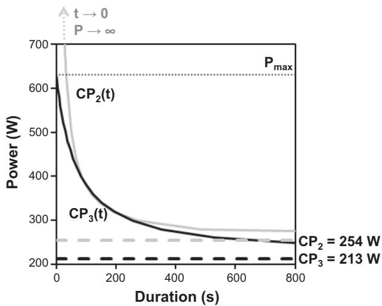
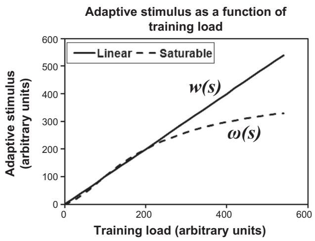
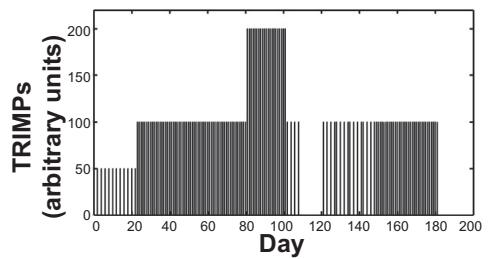
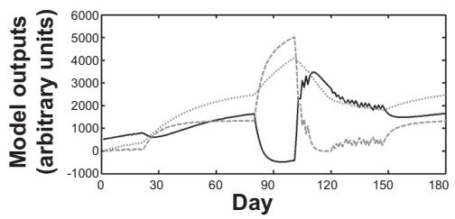

Clarke DC, Skiba PF. Rationale and resources for teaching the mathematical modeling of athletic training and performance. Adv Physiol Educ 37: 134–152, 2013; doi:10.1152/advan.00078.2011.

In the CP model section, Equation derivation and assumptions, lines 5–7, the sentence should read as follows: “The model features two parameters, CP and $W ^ { \prime }$ , which are related according to the following equation...”

The labels in Fig. 5 are shown corrected below.

In Conceptual benefits and practical applications, paragraph $^ { 4 , }$ lines $7 - 8 ,$ the authors should read as Jimenez and Skiba. The author listed in Ref. 52 should be Jimenez. In Fig. 10B the equation for In Fig. 10B the equation for $k _ { 2 } ( s )$ should include w(j), as follows: should include w(j), as follows:

$$
\begin{array} { r } { k _ { 2 } ( s ) = k _ { 3 } \sum _ { j = 1 } ^ { s } ~ w ( j ) e ^ { - ( s - j ) / \tau _ { 3 } } } \end{array}
$$

A  
B  

$$
\begin{array} { c } { { \displaystyle p ( t ) = p ( 0 ) + k _ { 1 } \sum _ { s = 0 } ^ { t - 1 } e ^ { - ( t - s ) / \tau _ { 1 } } w ( s ) - k _ { 2 } ( s ) \sum _ { s = 0 } ^ { t - 1 } e ^ { - ( t - s ) / \tau _ { 2 } } w ( s ) } } \\ { { k _ { 2 } ( s ) = k _ { 3 } \sum _ { j = 1 } ^ { s } w ( j ) e ^ { - ( s - j ) / \tau _ { 3 } } } } \end{array}
$$

