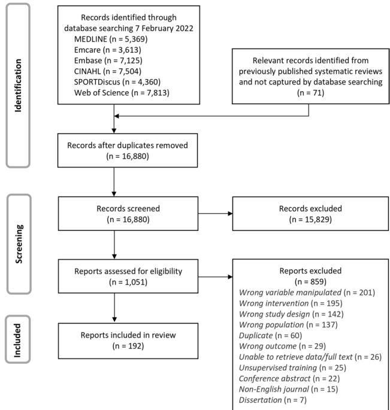
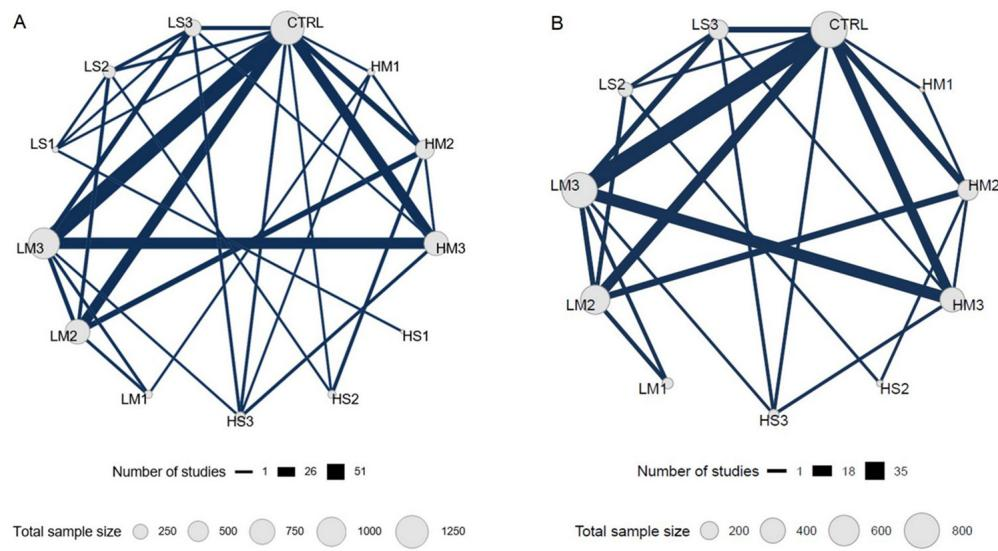
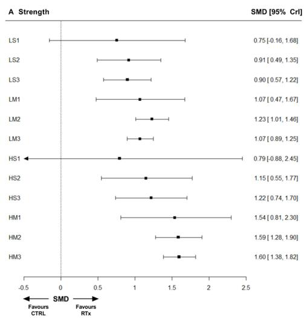
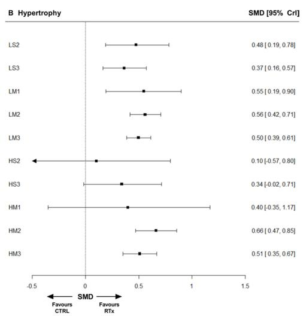
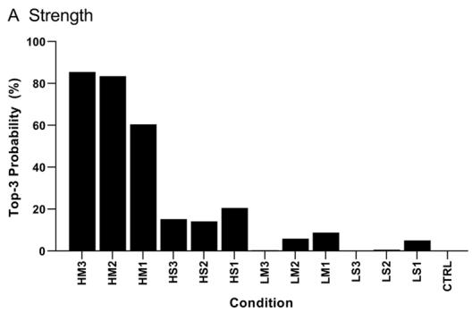
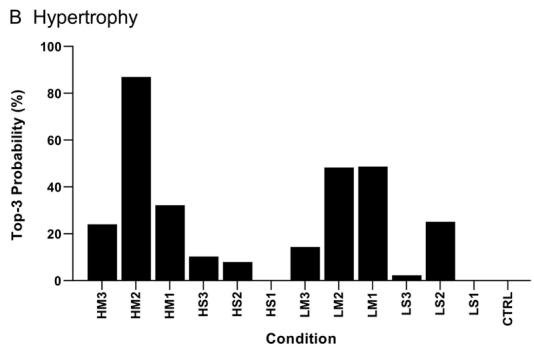
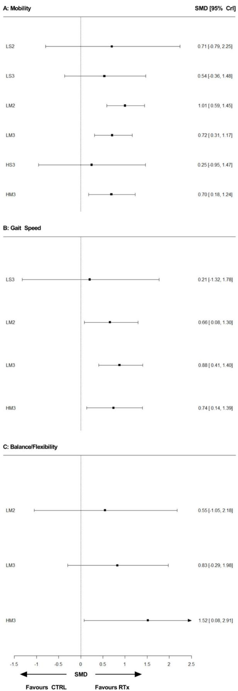

# Resistance training prescription for muscle strength and hypertrophy in healthy adults: a systematic review and Bayesian network meta-analysis

Brad S Currier ,1 Jonathan C Mcleod,1 Laura Banfield,2 Joseph Beyene,3 Nicky J Welton,4 Alysha C D’Souza,1 Joshua A J Keogh,1 Lydia Lin,1 Giulia Coletta,1 Antony Yang,1 Lauren Colenso-Semple,1 Kyle J Lau,1 Alexandria Verboom, Stuart M Phillips

► Additional supplemental material is published online only. To view, please visit the journal online (http://dx.doi. org/10.1136/bjsports-2023- 106807).

1 Department of Kinesiology,   
Faculty of Science, McMaster   
University, Hamilton, Ontario,   
Canada   
2 Health Sciences Library,   
McMaster University, Hamilton,   
Ontario, Canada   
3 Department of Health Research   
Methods, Evidence, and Impact,   
Faculty of Health Sciences,   
McMaster University, Hamilton,   
Ontario, Canada   
4 Population Health Sciences,   
Bristol Medical School,   
University of Bristol, Bristol, UK

Correspondence to Dr Stuart M Phillips, Department of Kinesiology, Faculty of Science, McMaster University, Hamilton, Ontario, Canada; phillis@mcmaster.ca

BSC and JCM contributed equally.

Accepted 15 June 2023 Published Online First 6 July 2023

► 10.1136/ bjsports-2023-107234

Check for updates

© Author(s) (or their employer(s)) 2023. Re-use permitted under CC BY-NC. No commercial re-use. See rights and permissions. Published by BMJ.

To cite: Currier BS, Mcleod JC, Banfield L, et al. Br J Sports Med 2023;57:1211–1220.

## ABSTRACT

Objective To determine how distinct combinations of resistance training prescription (RTx) variables (load, sets and frequency) affect muscle strength and hypertrophy. Data sources MEDLINE, Embase, Emcare, SPORTDiscus, CINAHL, and Web of Science were searched until February 2022.

Eligibility criteria Randomised trials that included healthy adults, compared at least 2 predefined conditions (non-exercise control (CTRL) and 12 RTx, differentiated by load, sets and/or weekly frequency), and reported muscle strength and/or hypertrophy were included.

Analyses Systematic review and Bayesian network meta-analysis methodology was used to compare RTxs and CTRL. Surface under the cumulative ranking curve values were used to rank conditions. Confidence was assessed with threshold analysis.

Results The strength network included 178 studies (n=5097; women=45%). The hypertrophy network included 119 studies (n=3364; women=47%). All RTxs were superior to CTRL for muscle strength and hypertrophy. Higher-load (>80% of single repetition maximum) prescriptions maximised strength gains, and all prescriptions comparably promoted muscle hypertrophy. While the calculated effects of many prescriptions were similar, higher-load, multiset, thriceweekly training (standardised mean difference (95% credible interval); 1.60 (1.38 to 1.82) vs CTRL) was the highest-ranked RTx for strength, and higher-load, multiset, twice-weekly training (0.66 (0.47 to 0.85) vs CTRL) was the highest-ranked RTx for hypertrophy. Threshold analysis demonstrated these results were extremely robust.

Conclusion All RTx promoted strength and hypertrophy compared with no exercise. The highest-ranked prescriptions for strength involved higher loads, whereas the highest-ranked prescriptions for hypertrophy included multiple sets.

PROSPERO registration number CRD42021259663 and CRD42021258902.

## INTRODUCTION

Skeletal muscle is critical for numerous functional and metabolic processes essential to good health. Resistance training (RT), muscle contraction against external weight, potently increases muscle strength and mass (hypertrophy), improves physical performance, provides a myriad of metabolic-health

## WHAT IS ALREADY KNOWN ON THIS TOPIC

⇒ Resistance training with varying numbers of variables (load, sets, weekly frequency) potently increases muscle strength and mass.

⇒ Resistance training prescription involves multiple variables, but the optimal resistance training prescription remains contentious.

⇒ Network meta-analysis allows simultaneous comparisons between multiple resistance training prescriptions.

## WHAT THIS STUDY ADDS

⇒ This network meta-analysis is the largest synthesis of resistance training prescription data from randomised trials.

⇒ All resistance training prescriptions are better than no exercise for strength and hypertrophy in healthy adults.

⇒ The top-ranked prescriptions for strength were characterised by higher loads and the top-ranked prescriptions for hypertrophy were characterised by multiple sets.

⇒ All resistance training prescriptions increased strength and hypertrophy, suggesting that healthy adults can adopt a resistance training prescription of their choice and preference.

## HOW THIS STUDY MIGHT AFFECT RESEARCH,PRACTICE OR POLICY

⇒ Since all protocols increased strength and hypertrophy, rather than determining an ‘optimal’ protocol, future work could determine minimal ‘doses’ of resistance exercise and practices to promote engagement and adherence in this health-promoting form of exercise

benefits and combats chronic disease risk.1–4 Although endogenous biological and physiological factors are pertinent to maximising RT-induced skeletal muscle adaptations,5 6 RT programming variables can affect RT adaptations.7–13 Therefore, a RT prescription (RTx) should be determined appropriately. Each RTx is comprised of a distinct combination of RT variables, and the most-studied RTx variables include the load lifted per repetition, sets per exercise (generally involving a single RT manoeuvre or muscle group) and weekly frequency (the number of RT sessions completed per week).

Guideline developers rely on systematic reviews and metaanalyses for determining recommendations, as these study designs are, in most cases, the most robust forms of evidence.14 Indeed, various meta-analyses have provided seminal evidence on the univariate impact of load,15–18 s19–22 or frequency 23–27 set to improve muscle strength, mass and physical function. However, these univariate analyses limit RT guideline development because individual RT variables are neither mutually exclusive nor prescribed independently; rather, several variables are collectively inherent to any RTx. Comparisons between multivariate RT prescriptions are needed to advance optimal RTx guidelines.

Pairwise meta-analyses are methodologically constrained to only comparing two RTxs.28 Several RTxs are conceivable, and multiple pairwise meta-analyses are unlikely to yield congruent insights. Network meta-analysis (NMA) expands on pairwise meta-analysis by permitting the simultaneous comparison of multiple treatments.29 NMA leverages direct and indirect evidence to produce enhanced effect estimates between all treatments, even when some comparisons have never been tested in randomised trials.30 Additionally, NMA permits the rank-ordering of all included treatments and the incorporation of data from multi-arm trials.28 Within exercise science, NMA RT, NMA has only been used to compare different load doses. 35 Importantly, NMA can compare several multivariate RTxs.

The purpose of this systematic review and NMA was to determine how different RTxs affect muscle strength, hypertrophy and physical function in healthy adults. Specifically, we sought to compare distinct combinations of RTx variables—load, sets and frequency—and non-exercising control groups. For each outcome, we used NMA to integrate data from randomised trials.

## METHODS

## Protocol and registration

This review was conducted according to the Preferred Reporting Items for Systematic Reviews and Meta-Analyses extension statement for network meta-analyses (PRISMA-NMA)36 and Cochrane Handbook for Systematic Reviews of Interventions.37 The PRISMA-NMA checklist is provided in online supplemental appendix 1. This review combines NMAs registered in the International Prospective Register of Systematic Reviews (https:// www.crd.york.ac.uk/prospero/).

## Eligibility criteria

The eligibility criteria are detailed in table 1. Only trials that included healthy adults ≥18 years old, were randomised, compared at least 2 of 13 unique conditions (box 1), and measured muscle strength, size and/or physical function were included. Physical function was subdivided into three domains: mobility, the ability to physically move; balance, the ability to maintain a body position during a task; and gait speed, the time taken to locomote over a given distance. Trials that included athletes, persons with comorbidities or military persons; spanned <6 weeks; involved unsupervised RT (eg, home-based exercise); were reported in a non-English language; or were non-randomised were excluded.

## Condition coding framework

Arms of included studies were classified as 1 of 12 RTxs or nonexercise control (CTRL). Each RTx was classified based on the load, set and frequency prescription (box 1). RTxs were denoted with a three-character acronym—XY#—where X is load (H, ≥80% one-repetition maximum (1RM); L, <80% 1RM); Y is sets (M, multiset; S, single-set); and # is the weekly frequency (3, ≥3 days/week; 2, 2 days/week; 1, 1 day/week), respectively. For example, HM2 denotes higher-load, multiset, twice-weekly RT within this framework. CTRL was comprised of subjects who received no intervention.

## Search strategy

MEDLINE, Embase, Emcare, SPORTDiscus, CINAHL and Web of Science were systematically searched until 7 February 2022. Multiple experts developed the search strategy, which included subject headings and keywords specific to the research question and each database. No language nor study design limits were used in the search strategy. The complete search strategy is provided in online supplemental appendix 2. Relevant systematic reviews (online supplemental appendix 3) were manually selected, and the references were scrutinised for eligibility.

## Study selection and data extraction

All records underwent title/abstract screening by two independent reviewers, with discrepancies resolved by a third reviewer. The full text of potentially eligible reports was then assessed for inclusion by two independent reviewers, with discrepancies resolved by a third reviewer. Reports deemed eligible for inclusion then underwent data extraction.

Data from included studies were extracted independently by pairs of reviewers, with any discrepancies resolved by consensus with a third reviewer (BSC or JCM). Extracted data included study and participant characteristics, RTx details and measurements of muscle strength and/or size (online supplemental appendix 4). Measures of mobility, balance and/or gait speed were extracted when the mean participant age was ≥55 years old. Authors of studies with missing data were contacted twice with a request for the missing data. The systematic review software Covidence (Veritas Health Innovation, Melbourne, Australia. Available at www.covidence.org) was used for record screening and data extraction.

Mean change from baseline and SD change $\mathrm { ( S D _ { c h a n g e } ) }$ from baseline were the outcomes of interest and extracted when reported. When unreported, SD was calculated with SEs, CIs, p values or t-statistics,37 and $\mathrm { S D _ { c h a n g e } }$ was imputed from pre-SD and post-SD values with a correlation coefficient of $0 . 5 . ^ { 3 \dot { 5 } }$ RT loads reported as repetition maximum (RM) were converted to a percentage of one-repetition maximum (%1RM) with the equation: %1RM=100−(RM(2.5)).38 The highest-ranked measurement was extracted, per predetermined hierarchy (online supplemental appendix 5), when multiple measurements were reported for a single outcome (eg, MRI and ultrasonography for muscle size). The longest period that all conditions were unchanged from baseline was analysed when the outcome(s) of interest were measured at multiple time points.37 Cohorts randomised separately but reported together (eg, young and old39) were analysed independently. Within-group outcomes reported by participant sex were grouped by condition.37 40

## Risk of bias

Reviewers independently evaluated the within-study risk of bias using the Cochrane Risk of Bias V.2.0. tool.41 Signalling questions and criteria were followed to inform the risk of bias appraisals for the intention-to-treat effect. Articles were assessed in duplicate at the strength and hypertrophy outcome level for bias: (1)

<table><tr><td colspan="3">Table 1 Study inclusion and exclusion criteria</td></tr><tr><td colspan="2">Inclusion criteria</td></tr><tr><td>Population</td><td></td></tr><tr><td>Humans ≥18 years old.</td><td>Population Non-human species.</td></tr><tr><td> Generally healthy (no disease condition indicated other than sarcopenia).</td><td>&lt;18 years old.</td></tr><tr><td>Community-dwelling adults.</td><td>Persons with or at risk for comorbidities (eg,</td></tr><tr><td>Intervention</td><td>cardiovascular disease, type Il diabetes, type</td></tr><tr><td>Upper-body, lower-body and/or whole-body resistance training.</td><td>Idiabete, cancer, peripheral artery dsase,</td></tr><tr><td> RTx aligns with one predefined node; specifically, exercises performed:</td><td>osteoarthritis).</td></tr><tr><td> with high(H; ≥80% 1 RM or ≥8 RM) or low(L; &lt;80% 1 RM or &gt;8 RM) load, AND</td><td>Persons that are injured (eg, musculoskeletal-related</td></tr><tr><td>for a single (S) or multiple (M) sets, AND</td><td>fracture and/or repair).</td></tr><tr><td>once-weekly (1), twice-weekly (2) or at least thrice-weekly (3).</td><td>Athletes o military personnel.</td></tr><tr><td> Intervention duration ≥6 weeks.</td><td>Explicitly mentions obese and/or overweight</td></tr><tr><td>Comparison</td><td>participants.</td></tr><tr><td>l clly ce </td><td>Individuals that are hospitalised (inpatient/outpatient/</td></tr><tr><td>Eligible RTx compared with CTRL.</td><td>rehabilitation).</td></tr><tr><td>Outcome</td><td>Individuals living in long-term care homes.</td></tr><tr><td> Eligible outcome(s) assessed pre-intervention and post-intervention.</td><td>Intervention</td></tr><tr><td>Muscle strength:</td><td>Resistance training involved added intervention (eg,</td></tr><tr><td>1RM test.</td><td>blood flow restriction)</td></tr><tr><td>Isometric maximum voluntary contraction.</td><td>RTx does not align with one node (eg, load 6090%</td></tr><tr><td>Isokinetic maximum voluntary contraction.</td><td>1RM).</td></tr><tr><td>catematn boneass ma hoeucosscal o</td><td>Explicitlymentions unsupervised resistance raining.</td></tr><tr><td>thickness or muscle fibre cross-sectional area. Eligible measurement instruments:</td><td>Resistance training familiarisation/lead-in &gt;4 weeks.</td></tr><tr><td>Ultrasonography.</td><td>CTRL  </td></tr><tr><td>MRI.</td><td>nutritional advice, lifestyle consultation).</td></tr><tr><td></td><td>Comparison</td></tr><tr><td>Bioelectrical impedance.</td><td>Eligible RTx not compared with another eligible RTx nor CTRL.</td></tr><tr><td>Dual-energy X-ray absorptiometry. Hydrostatic weighing.</td><td>Outcome</td></tr><tr><td></td><td>No measure of muscle strength, size, mobility, gait</td></tr><tr><td>Air displacement plethysmography.</td><td>speed or balance.</td></tr><tr><td>Microscopy. Physical function: Assessed physical function in older adults (mean age ≥55 years old) in the domain(s):</td><td></td></tr><tr><td></td><td>Study design Non-randomised trials.</td></tr><tr><td>Mility: efine s  peros abily  ove physill  Tmed Up nd Go Te, Chai Ris St  Sa. Balance: define as the ability  maintai a controlled body posiion during a given task, g Berg Balanc Test,</td><td></td></tr><tr><td>Sit and Reach Test).</td><td>Systematic reviews (ie, systematic reviews; meta- analyses review; meta-regressions; umbrella reviews;</td></tr><tr><td>Gt speed efie a the time it take  cover a givenistanc  6 Mine Walk Tes,   Foot Wal Tet.</td><td>network meta-analyses).</td></tr><tr><td>Study design</td><td>Narrative reviews.</td></tr><tr><td>Randomised trial.</td><td>tal  c </td></tr><tr><td>Reported in English.</td><td>or longitudinal).</td></tr><tr><td></td><td></td></tr></table>

CTRL, non-exercise control; 1RM, one-repetition maximum; RTx, resistance training prescription.

arising from the randomisation process, (2) due to deviations from intended interventions, (3) due to missing outcome data, (4) in the measurement of the outcome and (5) in the selection of reported result. Every domain was determined to be of high, moderate (some concerns) or low risk of bias, and studies were subsequently given an overall classification of high, moderate or low risk of bias. Any disagreement was resolved by consensus (BSC and JCM).

## Statistical analysis

Standardised mean differences (SMD), adjusted for small sample size bias,42 were calculated as the summary statistic because each outcome was measured with various tools.37 The direction of effect was standardised to analyse mobility, gait speed and balance to ensure consistency of desirable outcomes.43 When multiple studies compared two conditions, random-effects pairwise meta-analyses were conducted to identify comparison-level heterogeneity, publication bias, outliers and influential cases.40 44 To account for within-trial correlations in multi-arm trials (≥3 conditions), the SE in the base/reference arm was calculated as the square root of the covariance between calculated effects,45 assuming a correlation of 0.5 between effect sizes. 46

NMA integrated all direct evidence, with one network constructed for each outcome. NMA models were fitted within a Bayesian framework using Markov chain Monte Carlo methods.47 Four chains were run with non-informative priors. There were 50 000 iterations per chain; the first 20 000 were discarded as burn-in iterations. Values were collected with a thinning interval of 10. Convergence was evaluated by visual inspection of trace plots48 and the potential scale reduction factor. Both fixed-effects and randomeffects models were fit, and the more parsimonious model was used for analysis.49 Model fit was assessed with the deviance information criterion (DIC) and posterior mean residual deviance.49 50 Heterogeneity was assessed by examining the between-study SD (τ) and 95% credible intervals (95% CrI). Global inconsistency was assessed by comparing model fit, DIC and variance parameters between the NMA model and an unrelated mean effects (UME) model.51 Local inconsistency was assessed with the node-splitting method,52 and inconsistency was considered to be detected when the Bayesian p value<0.05. Forest plots and league tables were generated to display relative effects. Surface under the cumulative ranking curve values were used to rank-order each condition from top-to-bottom; additionally, the probability of each condition ranking in the top three was calculated as a percentage of the area under the curve. NMA results were presented as posterior SMD and 95% CrI, interpreted as a range in which a parameter lies with a 95% probability. 53

## Box 1 Description of predefined conditions

<table><tr><td>Condition acronym — condition description CTRL - non-exercise control. LS1 - lower load, single set/exercise, 1 day/week day/week</td></tr><tr><td>resistance training. LS2 - lower load, single set/exercise, 2 days/week days/week resistance training. LS3 - lower load, single set/exercise, ≥3 days/week resistance training. LM1 - lower load, multiple sets/exercise, 1 day/week day/</td></tr><tr><td>week resistance training. LM2 - lower load, multiple sets/exercise, 2 days/week days/ week resistance training. LM3 - lower load, multiple sets/exercise, ≥3 days/week resistance training. HS1  higher load, single set/exercise, 1 day/week day/week</td></tr></table>

## Confidence in recommendations

The robustness of recommendations was assessed with threshold analysis.47 54 Several factors, including bias and sampling error, can influence NMA results. Threshold analysis determines how much the included evidence could change—for any reason—before treatment recommendations differ and identifies the subsequent treatment recommendation.55 Identifying the robustness of results with threshold analysis permits guideline developers to have appropriate confidence levels in the reported recommendations.

## Sensitivity analysis and network meta-regression

Sensitivity analyses were conducted to explore the impact of outliers, influential cases and sources of network inconsistency on model fit, relative effects and treatment rankings. The first sensitivity analysis excluded studies identified during pairwise meta-analyses and node-splitting, and the second sensitivity analysis excluded node(s) comprised of only one study. Network meta-regression (NMR), assuming independent treatment interactions,56 was performed to determine if additional factors improved model fit and altered treatment effects. NMR covariates included age, training status, the proportion of females, duration, volitional fatigue, relative weekly volume load, outcome measurement tool, outcome measurement region and publication year. Missing data on covariates were managed through multivariate imputation by chained equations (n imputations=20).57 NMR is detailed in online supplemental appendix 12.

All analyses were performed in R V.4.0.4 using the packages: ‘esc’,58 to calculate SMD; ‘dmetar’,40 to conduct pairwise metaanalyses and assess comparison-level heterogeneity; ‘multinma’,47 to conduct NMA, NMR and consistency testing; ‘nmathresh’,54 to perform thresholding; and ‘mice’,59 to perform multiple imputation. Figures were created with multinma, 47 metafor60 ggplot2,61 and GraphPad Prism (V.9.1.0 for Windows, GraphPad Software, San Diego, California, USA, www.graphpad.com). All code was made publicly available (see Data Sharing Statement).

  
Figure 1 PRISMA (Preferred Reporting Items for Systematic Reviews and Meta-Analyses) flow diagram of study selection.

## Equity, diversity and inclusion statement

Our author group comprises various disciplines, career stages and genders. Data collection, analysis and reporting methods were not altered based on regional, educational or socioeconomic differences of the community in which the included studies were conducted. The only consistently reported equity, diversity and inclusion-relevant variable on which we have analysed the data is biological sex.

## RESULTS

## Included studies

The systematic search yielded 16 880 records after duplicates were removed. Following title/abstract screening, 1051 full texts were assessed for inclusion. A total of 192 articles were included in this review (figure 1). Characteristics of included studies are detailed in the online supplemental appendix 6.

## Network geometry

Network geometry for strength is displayed in figure 2A. The strength NMA (178 studies, n=5097) included 13 conditions and 32 direct comparisons. The three largest nodes were CTRL (n=1321), LM3 (n=1133) and LM2 (n=710), and the three smallest nodes were HM1 (n=54), LS1 (n=34), and HS1 (n=13). The most common comparisons were LM3 versus CTRL (51 studies), HM3 versus LM3 (32 studies), HM3 versus CTRL (30 studies) and LM2 versus CTRL (30 studies).

Network geometry for hypertrophy is displayed in figure 2B. The hypertrophy NMA (119 studies, n=3364) included 11 conditions—no studies included HS1 or LS1—and 24 direct comparisons. The three largest nodes were CTRL (n=847), LM3 (n=810) and LM2 (n=548), and the three smallest nodes were HS3 (n=60), HS2 (n=21) and HM1 (n=11). The most common comparisons were LM3 versus CTRL (35 studies), HM3 versus LM3 (22 studies), LM2 versus CTRL (18 studies) and HM3 versus CTRL (17 studies).

  
Figure 2 Network geometry for all available studies evaluating strength (A) and hypertrophy (B). Each node represents a unique condition, and the size of each node is proportional to the sample size per condition. Each edge represents direct evidence, and the width of each edge is proportional to the number of studies comparing connected nodes. Resistance training prescriptions are denoted with a three-character acronym—XY#—where X is load (H, ≥80% 1-repetition maximum (1RM); L, <80% 1 RM); Y is sets (M, multiset; S, single-set); and # is the weekly frequency (3, ≥3 days/week; 2, 2 days/week; 1, 1 day/week), respectively. For example, ‘HM2’ denotes higher-load, multiset, twice-weekly training. CTRL, non-exercising control group.

## Risk of bias

Within-study risk of bias was moderate–high for both strength and hypertrophy outcomes. In the strength network, 22%, 67% and 1% of studies had a high, moderate or low risk of bias, respectively. In the hypertrophy network, 18%, 82% and 0% of studies had a high, moderate or low risk of bias, respectively. Study-level risk of bias assessments for both strength and hypertrophy is detailed in online supplemental appendix 7.

## RTxs versus CTRL

The relative effect of each RTx compared with CTRL on muscle strength is displayed in figure 3A. The posterior SMD for all prescriptions ranged from 0.75 to 1.60, with the largest relative effect from HM3 (1.60 (1.38 to 1.82)). Compared with CTRL, the relative effect of LS1 (0.75 (−0.16 to 1.68)) and HS1 (0.79 (−0.88 to 2.45)) were the only comparisons that the 95% CrI crossed zero.

The relative effect of each RTx compared with CTRL on muscle hypertrophy is displayed in figure 3B. The posterior SMD for all RTx ranged from 0.10 to 0.66, with the largest relative effect from HM2 (0.66 (0.47 to 0.85)). Compared with CTRL, the relative effect of HS2 (0.10 (-0.57 to 0.80)), HS3 (0.34 (−0.02 to 0.71)) and HM1 (0.40 (−0.35 to 1.17)) were the only comparisons that the 95% CrI crossed zero.

  
Figure 3 Forest plots displaying network estimates for relative effects of resistance training prescriptions versus non-exercising control for strength (A) and hypertrophy (B). Each resistance training prescription (RTx) is denoted with a three-character acronym—XY#—where X is load (H, ≥80% 1-repetition maximum (1RM); L, <80% 1 RM); Y is sets (M, multiset; S, single-set); and # is the weekly frequency (3, ≥3 days/week; 2, 2 days/week; 1, 1 day/week), respectively. For example, ‘HM2’ denotes higher-load, multiset, twice-weekly training. CTRL, non-exercising control; SMD, standardised mean difference; 95% CrI, 95% credible interval.

## Comparing RTxs

The relative effects from all 133 network comparisons for muscle strength and hypertrophy are displayed in table 2. For comparisons between RTxs (ie, not CTRL), the 95% CrI excluded zero for 13.6% (9/66) and 2.2% (1/45) of comparisons in the strength and hypertrophy NMA, respectively. For muscle strength, there was a 95% probability that HM2 yields a larger relative effect than LS1, LS2, LS3, LM2 and LM3 and that HM3 yields a larger relative effect than LS2, LS3, LM2 and LM3. There was a 95% probability for muscle hypertrophy that HM2 yields a larger relative effect than LS3.

## Ranking conditions

Figure 4 displays the probability that each condition would rank in the top three best interventions for muscle strength and hypertrophy, such that scores closer to 100% indicate a greater chance of ranking in the top three. HM3 (85.5%), HM2 (83.5%) and HM1 (60.5%) were most likely to rank in the top three for muscle strength. HM2 (86.9%), LM1 (48.7%) and LM2 (48.3%) were most likely to rank in the top three for muscle hypertrophy. CTRL was the only condition with a 0% chance for strength and hypertrophy. Posterior rankings and distribution curves for all conditions are reported in the online supplemental appendix 8.

## Network inconsistency

Model fit outputs and node-splitting plots are reported in the online supplemental appendix 9. In the strength network, the UME model (DIC=402.3) was not meaningfully different than the random-effects NMA model (DIC=400.8). Node-splitting was performed on 29 comparisons; the only significant difference was LM1 versus HM1 (p<0.01). In the hypertrophy network, the UME model (DIC=143.1) was meaningfully different than the random-effects NMA model (DIC=137.8). Node-splitting was performed on 22 comparisons; the only significant difference was LS2 versus CTRL (p<0.01).

## Threshold analysis

Threshold analysis results for strength and hypertrophy are shown in online supplemental appendix 10. HM3 was the topranked condition for strength; however, 65 comparisons indicated some sensitivity to the level of uncertainty and potential biases in the evidence. The revised top-ranked strength condition was HM2 in 92% (60/65) or HM1 in 8% (5/65) of comparisons. HM2 was the top-ranked condition for hypertrophy, and this finding was robust. Two comparisons indicated some sensitivity to the level of uncertainty and potential biases in the evidence, and HM1 was the revised top-ranked condition in both cases.

## Sensitivity analyses

Sensitivity analysis results are displayed in the online supplemental appendix 11. For both the strength and hypertrophy NMAs, the second sensitivity analysis (discussed herein) most improved model fit. The strength network included 155 studies (n=4397) and 11 conditions (LS1 and HS1 excluded). The relative effects for all RTx versus CTRL were tempered, such that posterior SMDs ranged from 0.77 to 1.49, with the largest relative effect from HM2 (1.49 (1.29 to 1.70)) and smallest from LS3 (0.77 (0.56 to 0.98)). The 95% CrI for each RTx versus CTRL excluded zero. There was a 95% probability that HM2 yields larger relative effects than LS2, LS3, LM1, LM2, LM3 and HS3; that HM3 was superior to LS2, LS3, LM1, LM2 and LM3; and that LM2 was superior to LS3. HM2 (99.9%) and HM3 (95.7%) remained most likely to rank in the top three for muscle strength.

The hypertrophy network included 115 studies (n=3240) and 9 conditions (HS2 and HM1 excluded). The relative effect for each RTx versus CTRL was roughly unchanged, with the largest relative effect from HM2 (0.59 (0.39 to 0.78)) and the smallest from HS3 (0.30 (−0.05 to 0.66)). Between prescriptions, there was a 95% probability that LM2 was superior to LS3. HM2 (82.8%) and LM2 (80.4%) remained most likely to rank in the top three for muscle hypertrophy.

## Network meta-regression

Network meta-regression results are displayed in the online supplemental appendix 12. Model fit was not meaningfully different than the unadjusted model for all covariates, except relative weekly volume load, which worsened model fit. Age, training status, proportion of females, duration, volitional fatigue, relative weekly volume load, outcome measurement tool, outcome measurement region and publication year did not yield any obvious modifying effect on the relative effect for each RTx versus CTRL, and data-sparse nodes reduced estimate precision.

## Physical function

Physical function results are reported in the online supplemental appendix 13. Few studies assessed mobility (25 studies, n=859, age (mean)=68 years), gait speed (15 studies, n=488, 68 years) and balance/flexibility (11 studies, n=323, 68 years). Compared with CTRL, there was a 95% probability that LM2, LM3 and HM3 improved mobility and gait speed, while HM3 was the only condition that improved balance/flexibility (figure 5). No differences were found between RT prescriptions for any physical function outcome.

## DISCUSSION

Twelve distinct RT prescriptions and non-exercising control groups were compared using network meta-analysis to determine their effect on gains in muscle strength, hypertrophy and improvements in physical function in healthy adults. Compared with no exercise, most load, sets and frequency combinations increased muscle strength and hypertrophy, indicating that several RTx resulted in beneficial skeletal muscle adaptations. RT with higher loads characterised the top-ranked strength prescriptions, and RT with multiple sets characterised the top-ranked hypertrophy prescriptions. A diverse range of RT prescriptions improved physical function, but evidence scarcity limited insights. Guideline developers and practitioners may consider these results when forming recommendations and prescribing RT for healthy adults.

Network meta-analysis has previously been used to compare different types of exercise31–34 and doses of RT load.35 In the NMA by Lopez et al,35 23 (n=582) and 24 (n=604) studies were included in the strength and hypertrophy networks, respectively. The present strength (178 studies, n=5097) and hypertrophy (119 studies, n=3364) networks were much larger, and this is likely attributable to Lopez et al35 excluding studies not including RT to momentary muscular failure and our more comprehensive search strategy (262935 vs 16 880 records identified). This NMA, to our knowledge, represents the largest synthesis of RT data from randomised trials.

2League table of all relative
<table><tr><td rowspan="2"></td><td rowspan="2">Strength</td><td colspan="11"></td><td rowspan="2"></td></tr><tr><td>CTRL HM1</td><td>HM2</td><td>HM3</td><td>HS1</td><td>HS2</td><td>HS3</td><td></td><td>LM1 LM2</td><td>LM3</td><td>LS1</td><td>LS2</td><td>LS3</td></tr><tr><td>Hypertrophy</td><td>CTRL</td><td>1.54</td><td>1.59 .81 o2.30. o 1.908o</td><td>1.60</td><td>0.79 (-0.88 to</td><td>1.15 (0.55 to 11.77)</td><td>1.22 (0.74 to</td><td>1.07</td><td>1.23 (0.47 to</td><td>1.07 (1.01 to 1.46)</td><td>(0.889 to</td><td>0.75 (-0.16 to</td><td>0.91 (0.49 to 1.35)</td><td>0.90 (0.57 to 1.22)</td></tr><tr><td></td><td>HM1</td><td>0.40 (-0.35 to 1.17)</td><td>0.05 (-0.71 to 0.79)</td><td>1.82) 0.06 (-0..71 to</td><td>2.45) -0.74 (-2.54 to</td><td>-0.39</td><td>(-1.32 to</td><td>1.70) -0.32 (-1.13 to</td><td>1.67) -0.47 (-1.37 to</td><td>-0.31 (-1.07 to 0.44)</td><td>1.25) -0.47 (-1.23 to</td><td>1.68) -0.78 (-1.97 to</td><td>-0.62 (-1.48 to 0.21)</td><td>-0.64 (-1.45 to 0.15)</td></tr><tr><td></td><td>HM2</td><td>0.66 0.26 (0.47 to 0.85) (-0.50 to</td><td></td><td>0.82) 0.01 (-0.35 to</td><td>1.08) -0.79 (-2.46 to</td><td>0.55) -0.44</td><td>(-1.00 to</td><td>0.50) -0.37 (-0.91 to</td><td>0.42) -0.52 (-1.16 to</td><td>-0.36 (-0.66 to</td><td>0.28) -0.52 (-0.87 to</td><td>0.38) -0.83 (-1.77 to</td><td>-0.67 (-1.16 to</td><td>-0.69 (-1.12 to</td></tr><tr><td rowspan="3">HM3 HS1</td><td>0.51</td><td>1.02) 0.11</td><td>-0.15</td><td>0.37</td><td>0.91) -0.80</td><td>0.14) -0.45</td><td>0.20) -0.38</td><td>0.12) -0.53</td><td>-0.04) -0.37</td><td>-0.17) -0.53</td><td>0.11) -0.84</td><td></td><td>-0.18) -0.68</td><td>-0.24) -0.70</td></tr><tr><td>(0.35 to 0.67)</td><td>(-0.67 to 0.88)</td><td>(-0.39 to 0.09)</td><td></td><td>(-2.48 to 0.86)</td><td>(-1.009 to 0.21)</td><td>(-0.86 to 0.111)</td><td>(-1.14 to</td><td>(-0.66 to</td><td></td><td>(-0.74 to</td><td>(-1.77 to</td><td>(-1.14 to</td><td>(-1..06 to</td></tr><tr><td>N.D.</td><td>N.D.</td><td>N.D.</td><td>N.D.</td><td></td><td>0.36 (-1.42 o</td><td>0.43 (-1.27 to</td><td>0.09) 0.28</td><td>-0.07) 0.44</td><td>-0.31) 0.28</td><td>0.08) -0.04</td><td>-0.22) 0.12</td><td>-0.34) 0.11</td><td>(-1.54 to 1.76)</td></tr><tr><td></td><td>HS2 0.10</td><td>-0.30</td><td>-0.56</td><td>-0.41</td><td>N.D.</td><td>2.09)</td><td>2.16) 0.07</td><td></td><td>(-11.7 to 2.05) -0.08 0.08</td><td>(-1.25 to 2.12)</td><td>(-1.38 to 1.95) -0.08</td><td>(-1.45 to 1.34) -0.40</td><td>(-1.53 to 1.77) -0.24</td><td>-0.25</td></tr><tr><td></td><td>HS3 0.34</td><td>(-0.57 to 0.80) (-1.28 to 0.66) -0.06</td><td>(-1.23 to 0.14) -0.32</td><td>(-1.08 to 0.29) -0.17</td><td>N.D.</td><td>0.24</td><td>(-0.69 to 0.84)</td><td>0.75)</td><td>(-0.91 to -0.15 0.01</td><td>(-0.54 to 0.68)</td><td>(-0.72 to 0.55) -0.15</td><td>(-1.46 to 0.65) -0.47</td><td>(-0.94 to 0.44) -0.31</td><td>(-0.94 to 0.42) -0.32</td></tr><tr><td>LM1</td><td>0.55</td><td>(-0.02 to 0.71) (-0.90 to 0.75) 0.15</td><td>(-0.74 to 0.09) -0.11</td><td>(-0.54 to 0.22) 0.04</td><td>N.D.</td><td>(-0.51 to 0.99) 0.45</td><td>0.21</td><td></td><td>(-0.88 to 0.60) 0.16</td><td>(-0.51 to 0.53)</td><td>(-0.64 to 0.33 -0.00</td><td>(-1.49 to 0.54) -0.32</td><td>(-0.93 to 0.31) -0.16</td><td>(-0.84 to 0.19) -0.17</td></tr><tr><td>LM2</td><td>0.56</td><td>(0.19 to 0.90) (-.68 to 0.94) 0.16 (0.42 to 0.71) (-0.62 to</td><td>(-0.49 to 0.25) -0.10 (-0.29 to</td><td>(-0.34 to 0.41 0.05 (-00.16 to</td><td>N.D.</td><td>(-0.33 to 1.18) 0.46</td><td>0.69) 0.22</td><td>(-0.31 to</td><td>0.01</td><td>(-0.43 to 0.75)</td><td>(-0.58 to 0.59) -0.16</td><td>(-1.40 to 0.77) -0.48</td><td>-0.32</td><td>0.88 to 0.560.83 to 0.48) -0.33</td></tr><tr><td>LM3</td><td>0.50 (0.39 to 0.61)</td><td>0.92) 0.10</td><td>0.11) -0.16 (-0.38to</td><td>0.26) -0.01</td><td>N.D.</td><td>(-0.23 to 1.12) 0.40</td><td>(-0.18 to 0.59) 0.16</td><td>0.35)</td><td>(-.31 to -0.05 -0.06</td><td></td><td>(-0.42 to 0.10)</td><td>(-1.39 to 0.44) -0.32</td><td>(-0.75 to 0.12) -0.15</td><td>(-0.70 to 0.04) -0.17</td></tr><tr><td rowspan="3">LS1 LS2</td><td>N.D.</td><td>(-0.66 to 0.85)</td><td>0.05)</td><td>(-0.16 to 0.14)</td><td></td><td>(-0.0 to 1.07)</td><td>(-0.22 to 0.52)</td><td>(-0.39 to 0.29)</td><td>(-0.22 to 0.10)</td><td></td><td></td><td>(-1.24 to 0.60)</td><td>0.9 to 0.290. to 0</td><td></td></tr><tr><td></td><td>N.D. 0.08</td><td>N.D. -0.19</td><td>N.D. -0.03</td><td>N.D.</td><td>N.D.</td><td>N.D.</td><td>N.D.</td><td>N.D.</td><td>N.D.</td><td></td><td>0.16</td><td>0.15 (-0.73 to 1.01)</td><td>(-0.77 to 1.06)</td></tr><tr><td>0.48 (0.19 to 0.78)</td><td>(-0.71 to 0.88</td><td>(-0.51 to 0.16)</td><td>(-0.35 o 0.29)</td><td>N.D.</td><td>0.37 (-0.28 to 1.01)</td><td>0.13 (-0.3 to 0.60)</td><td>-0.07 (-0.51 to 0.37)</td><td>-0.08 (-0.37 to 0.22)</td><td>-0.02 (-0.31 to 0.28)</td><td>N.D.</td><td></td><td>-0.02 (-0.46 to 0.42)</td></tr></table>

Network estimates for all relative effects of resistance training prescriptions are displayed for strength (column header vs row header; values >0 favour the column condition) and hypertrophy (row header vs column header; values >0 favour the row condition). Data are displayed as posterior standardised mean difference (95% credible interval). Bolded numbers indicate a 95% probability one intervention yields a larger relative effect. Resistance training prescriptions are denoted with a three-character acronym—XY#—where X is load (H, ≥80% 1-repetition maximum (1RM); L, <80% 1RM); Y is sets (M, multiset; S, single-set); and # is weekly frequency (3, ≥3 days/week; 2, 2 days/week; 1, 1 day/week), respectively. For M2’ denotes higher-load, multiset, twice-weekl on-exercise control; N.D., no

  
Figure 4 Probability for each condition ranking in the top three most effective for strength (A) and hypertrophy (B). Scores closer to 100% indicate a greater chance of being ranked in the top three. Resistance training prescriptions are denoted with a three-character acronym—XY#—where X is load (H, ≥80% 1-repetition maximum (1RM); L, <80% 1 RM); Y is sets (M, multiset; S, single-set); and # is the weekly frequency (3, ≥3 days/week; 2, 2 days/week; 1, 1 day/week), respectively. For example, ‘HM2’ denotes higher-load, multiset, twice-weekly training. CTRL, non-exercising control group.

All loads, sets and frequency combinations increased muscle strength and size compared with CTRL. There was a 95% probability that RT with at least two sets or two sessions per week increased strength (figure 3A), and training with at least two sets and two sessions per week resulted in hypertrophy (figure 3B). Considering only the lower credible interval limit, each RTx induced at least a moderate (SMD>0.47) and small (SMD>0.16) increase in muscle strength and mass, respectively. Such certainty is not possible for all prescriptions, though, because the 95% CrI crossed zero for two RTx for strength (HS1 and LS1) and three RTx for hypertrophy (HM1, HS2 and HS3), meaning these prescriptions might increase, not change or decrease muscle strength and size. However, we posit that this is unlikely to represent an ineffectiveness of those particular RTx and that imprecise network estimates confound these findings. These strength (HS1 and LS1) and hypertrophy (HM1, HS2 and HS3) nodes included <60 participants and contributed little direct evidence (figure 2). Within each study testing these prescriptions, strength increased significantly compared with CTRL/baseline in all cases and hypertrophy increased from baseline in most cases. Those prescribing RT can be confident that all RTxs increased strength and hypertrophy compared with no exercise.

Network comparisons suggest that most RT prescriptions were comparable for strength and hypertrophy. The 95% CrI contained zero for a striking 91% (101/111) of all between-RTx comparisons (table 2). Nine of the 10 comparisons that did not contain zero were between HM2 or HM3 and a lower-load RTx for strength, suggesting higher-load, multiset programmes caused the largest strength gains. This result remained after sensitivity analyses (online supplemental appendix 11) and aligned with previous meta-analyses that found higher-load RT yields the largest strength gains.17 18 35 A critical point for practitioners is that lower-load RT prescriptions increase strength compared with no exercise. All RT prescriptions may comparably promote muscle hypertrophy, and the influence of load was less apparent. The lack of importance of load for hypertrophy is supported by other analyses ,16 17 35 62 but performing RT to momentary muscular failure (fatigue) has been posited as a key component for RT-induced hypertrophy with lower loads.62 Network metaregression for exercise ‘failure’ (fatigue) did not improve model fit nor substantially alter network estimates, suggesting that lifting to fatigue does not suitably explain the observed hypertrophic response. Our finding in this domain agrees with previous work,63 suggesting that untrained individuals still achieve large gains in skeletal muscle mass without performing RT to failure.

Performing RT to momentary muscular failure may, however, be increasingly important for trained individuals.13 For both strength and hypertrophy, though, there was a large credible interval surrounding the non-significant effect estimate for many comparisons between RTxs, so a wide range of different effects are possible for these comparisons. The available evidence does not permit definitive, statistically valid conclusions about the equivalency of each RTx, despite most comparisons between RTxs not being statistically significantly different from each other.

Prescriptions for RT with higher loads were more likely to rank in the top three for strength than all lower-load prescriptions, and RT prescriptions with multiple sets per exercise were most likely to rank in the top three for hypertrophy (figure 4). Rankings are sensitive to uncertainties within the network,28 but posterior ranking credible intervals supported higher-load, multiset programmes being the highest-ranked for strength and multiple sets or multiple sessions being the highest-ranked for hypertrophy. Notably, sets and frequency are major components of RT volume, a key factor for hypertrophy.21 64–66 The probability of each condition ranking in the top three was calculated because the top-ranked RTx does not necessarily reflect the best intervention for all individuals.67 Personal preferences, including disliking higher loads or time constraints, including an inability to train more than once weekly, can be observed while still benefiting from RT. In our view, especially given the low participation rates in RT, practitioners should not avoid prescribing, nor should individuals be discouraged from completing non-topranked RTx. While all prescriptions increased muscle strength and mass, the top-ranked prescriptions involved higher loads for strength and higher volume for hypertrophy. We do not know how these RTx affect relevant health outcomes. Some data suggest that health benefits exist with low time commitment (30–60 min/week) to RT and greater time commitment with reduced health benefits.4 68

Ours is the first review to assess confidence in RTx recommendations with threshold analysis. Several factors can influence NMA results,55 and the robustness of treatment recommendations should be considered when interpreting results. Previous methods to evaluate the confidence of meta-analytical findings do not consider how potentially influencing factors can change treatment recommendations55 69 70 or are not yet developed for Bayesian NMA.71 Threshold analysis determines how much the available evidence could change before recommendations differ and identifies a new top-ranked treatment.54 55 Sixty-five direct comparisons were identified that could potentially impact the

  
Figure 5 Forest plots displaying network estimates for relative effects of resistance training prescriptions versus non-exercising control for mobility (A), gait speed (B) and balance/flexibility. Each resistance training prescription (RTx) is denoted with a three-character acronym—

XY#—where X is load (H, ≥80% 1-repetition maximum (1RM); L, <80% 1 RM); Y is sets (M, multiset; S, single-set); and # is the weekly frequency (3, ≥3 days/week; 2, 2 days/week; 1, 1 day/week), respectively. For example, ‘HM2’ denotes higher-load, multiset, twice-weekly training. CTRL, non-exercising control; SMD, standardised mean difference; 95% CrI, 95% credible interval.

recommendation of HM3 as the top-ranked strength treatment; however, the revised treatment recommendation was HM2 in 60 of these cases and HM1 in the other five cases (online supplemental appendix 10), suggesting that performing RT with higher loads and multiple sets/exercise are robust recommendation for optimising RT-induced strength gains. The top-ranked RTx for hypertrophy—HM2—was sensitive to the uncertainty of only two comparisons, and HM1 was the revised recommendation because both comparisons were from the same multi-arm study.72 Furthermore, 127 of the 161 direct comparisons would need to change by more than four SDs to alter HM2 as the top recommendation for hypertrophy. The optimised recommendations of higher load, multiple-set programmes for strength and HM2 for hypertrophy were extremely robust.

Current guidelines collectively advise healthy adults to complete RT at least twice weekly.10–12 73 The results herein support these recommendations and should not deter practitioners from promoting existing guidelines to improve strength and hypertrophy, nor do these results contradict the effectiveness of guidelines incorporating additional RTx variables, such as rest intervals and contraction type and velocity.10 12 However, our results support RT at less than recommended often-cited levels for enhancing strength and hypertrophy. Most individuals do not meet current guidelines, and RTx complexities may impede the adoption of RT. Minimal-dose approaches have been proposed to reduce barriers to $\mathrm { R T } , ^ { 7 4 }$ and our results strongly support the WHO’s claim, ‘Doing some activity is better than none’.73 While others attempt to optimise $\mathrm { R T } \mathrm { \mathbf { x } } , ^ { 7 5 }$ we propose that, for most adults, regularly engaging in any RTx is more important than training to optimise strength and hypertrophy outcomes. Our analysis found multiple RTx comparable for healthy adults to increase muscle strength and mass. Thus, adults should engage in RT, even if they cannot meet existing recommendations.

## Limitations

Risk of bias was frequently introduced by protocol deviations, randomisation procedures and selection of the reported result for both outcomes (online supplemental appendix 7). All three domains were regularly rated “Some concerns” because participants were aware of the intervention, appropriate analyses to estimate the effect of assignment were not performed and randomisation, concealment and prespecified analysis procedures were rarely reported. Double-blinding RT is unfeasible, but the remaining issues are prevalent and reoccurring in RT research.76 Researchers should preregister analysis plans and report randomisation procedures to reduce bias.

Several limitations require acknowledgement and consideration when interpreting the findings of this review. Well-trained elite athletes/military persons and individuals with chronic disease were excluded, so the results should be translated to these populations with caution and additional insights.13 77–79 Mobility, gait speed and balance/flexibility findings should also be interpreted with caution due to the limited evidence available, which could be attributed to including only healthy older (>55 year) adults (eg, not frail). The coding framework for RT prescriptions prevented the inclusion of periodized RT programmes overlapping conditions (eg, loads ranging from 60–90% 1RM) from being captured in the network. Initially, our objective was to further divide the load and set prescriptions; however, this yielded sparse, disconnected networks, violating a critical assumption of NMA.49 The continuous RTx variables investigated herein (load, sets, frequency) were classified categorically, so future work could use dose-response/model-based NMA methods to explore these RTx variables as continuous predictors.80 81 Several acute RT variables were not factored into the included RT prescriptions (eg, inter-set rest, time under tension, repetition velocity, volitional fatigue, tempo); where possible, NMR was used to explore if these factors improved model fit and altered effects. Results from NMR are correlative, however, and should be interpreted cautiously.82 Nonetheless, many variables (inter-set rest, tempo, time under tension) were reported too infrequently for inclusion as covariates. Calculating the relative weekly volume load (ie, load × repetitions/set × number of sets × number of exercises × weekly frequency), which should impact results,21 also required approximations that hindered model fit. The principle of specificity17 (ie, the similarity between training and testing movement) and approximations of muscle eg, lean mass) could infringe on transitivity assumptions37 when integrating results from multiple studies and NMR with the covariates measurement tool and region were imperfect solutions. Including one measurement per outcome for each study may limit the totality of evidence captured by this review, so future methodological work could explore the integration of multiple correlated effect sizes in NMA, as in recent pairwise meta-analyses.63 84 I ncreasingly, within-subject models are used due to their increased statistical power.85 To our knowledge, however, no methods are available to account for the additional correlation when including within-subject and between-subject comparisons in NMA. With consideration for these limitations, guideline developers and practitioners can obtain meaningful insights from this analysis.

## Conclusion

This NMA represents the largest synthesis of RTx data from randomised trials. Most RTx increased muscle strength and mass compared with no exercise. Top-ranked prescriptions for muscle strength were characterised by lifting heavier loads, and multiple sets characterised top-ranked prescriptions for muscle hypertrophy. Guideline developers and practitioners should encourage the adoption of RT since all RTx can increase muscle strength and mass in healthy adults. The effects on health outcomes of various RTx remain largely unknown.

## Twitter Brad S Currier @brad\_currier and Stuart M Phillips @mackinprof

Acknowledgements The authors thank Alicia Wong for assistance with the risk of bias assessments. Components of this review were presented, in abstract form, at Europhysiology 2022, the 2022 Canadian Society for Exercise Physiology and the 2023 American College of Sports Medicine conferences.

Contributors BSC and JCM contributed equally to this paper. BSC, JCM and SMP conceived the review. BSC, JCM and LB designed and executed the systematic search. BSC, JCM, ACD, SMP, JAJK, LL, GC, LC-S, KJL and AV screened articles and extracted data. BSC, JCM, AY and AW completed within-study risk of bias assessments. BSC and JCM conducted the statistical analysis with assistance from JB and NJW. BSC, JCM and SMP drafted the manuscript. All authors critically revised the manuscript. All authors approved the submission of this manuscript. SMP accepts full responsibility for the work and/or the conduct of the study, had access to the data and controlled the decision to publish.

Funding No funding was received for this review. BSC is supported by an Alexander Graham Bell Canada Graduate Scholarship-Doctoral. JCM is supported by an Ontario Graduate Scholarship. NJW was supported by the NIHR Biomedical Research Centre at University Hospitals Bristol and Weston NHS Foundation Trust and the University of Bristol. The views expressed are those of the author(s) and not necessarily those of the NIHR or the Department of Health and Social Care. ACD and JAJK are supported by a Canadian Graduate Scholarship – Master’s Program offered by the Natural Sciences and Engineering Research Council. SMP is supported by the Canada Research Chairs programme.

Competing interests SMP reports grants or research contracts from the US National Dairy Council, Canadian Institutes for Health Research, Dairy Farmers of Canada, Roquette Freres, Ontario Centre of Innovation, Nestle Health Sciences, Myos, National Science and Engineering Research Council and the US NIH during the conduct of the study; personal fees from Nestle Health Sciences, non-financial support from Enhanced Recovery, outside the submitted work. SMP has patents licensed to Exerkine but reports no financial gains from any patent or related work. The remaining authors report no competing interests.

Patient consent for publication Not applicable.

Provenance and peer review Not commissioned; externally peer reviewed.

Data availability statement Data are available upon reasonable request.

Supplemental material This content has been supplied by the author(s). It has not been vetted by BMJ Publishing Group Limited (BMJ) and may not have been peer-reviewed. Any opinions or recommendations discussed are solely those of the author(s) and are not endorsed by BMJ. BMJ disclaims all liability and responsibility arising from any reliance placed on the content. Where the content includes any translated material, BMJ does not warrant the accuracy and reliability of the translations (including but not limited to local regulations, clinical guidelines, terminology, drug names and drug dosages), and is not responsible for any error and/or omissions arising from translation and adaptation or otherwise.

Open access This is an open access article distributed in accordance with the Creative Commons Attribution Non Commercial (CC BY-NC 4.0) license, which permits others to distribute, remix, adapt, build upon this work non-commercially, and license their derivative works on different terms, provided the original work is properly cited, appropriate credit is given, any changes made indicated, and the use is non-commercial. See: http://creativecommons.org/licenses/by-nc/4.0/.

## ORCID iDs

Brad S Currier http://orcid.org/0000-0003-3955-3174   
Stuart M Phillips http://orcid.org/0000-0002-1956-4098

## REFERENCES

1 Phillips SM, Winett RA. Uncomplicated resistance training and health-related outcomes: evidence for a public health mandate. Curr Sports Med Rep 2010;9:208–13.

2 Sawan SA, Nunes EA, Lim C, et al. The health benefits of resistance exercise: beyond hypertrophy and big weights. Exerc Sport Mov 2023;1:e00001.

3 Mcleod JC, Stokes T, Phillips SM. Resistance exercise training as a primary Countermeasure to age-related chronic disease. Front Physiol 2019;10:645.

4 Shailendra P, Baldock KL, Li LSK, et al. Resistance training and mortality risk: A systematic review and meta-analysis. Am J Prev Med 2022;63:277–85.

5 Joanisse S, Lim C, McKendry J, et al. Recent advances in understanding resistance exercise training-induced Skeletal muscle hypertrophy in humans. F1000Res 2020;9:F1000 Faculty Rev-141.

6 Lim C, Nunes EA, Currier BS, et al. An evidence-based narrative review of mechanisms of resistance exercise-induced human Skeletal muscle hypertrophy. Med Sci Sports Exerc 2022;54:1546–59.

7 Bird SP, Tarpenning KM, Marino FE. Designing resistance training programmes to enhance muscular fitness: a review of the acute programme variables. Sports Med 2005;35:841–51.

8 Hass CJ, Feigenbaum MS, Franklin BA. Prescription of resistance training for healthy populations. Sports Med 2001;31:953–64.

9 Morton RW, Colenso-Semple L, Phillips SM. Training for strength and hypertrophy: an evidence-based approach. Cur Opin Physiol 2019;10:90–5.

10 Medicine. A. American college of sports medicine position stand. progression models in resistance training for healthy adults. Med Sci Sports Exerc 2009;41:687–708.

11 American College of Sports Medicine position stand, American College of. Exercise and physical activity for older adults. Med Sci Sports Exerc 2009;41:1510–30.

12 Fragala MS, Cadore EL, Dorgo S, et al. Resistance training for older adults: position statement from the national strength and conditioning Association. J Strength Cond Res 2019;33:2019–52.

13 Schoenfeld B, Fisher J, Grgic J, et al. Resistance training recommendations to maximize muscle hypertrophy in an athletic population: position stand of the IUSCA. Int’l J Strength Condit 2021;1.

14 Wackerhage H, Schoenfeld BJ. Personalized, evidence-informed training plans and exercise prescriptions for performance. Sports Med 2021;51:1805–13.

15 Csapo R, Alegre LM. Effects of resistance training with moderate vs heavy loads on muscle mass and strength in the elderly: A meta-analysis. Scand J Med Sci Sports 2016;26:995–1006.

16 Grgic J. The effects of low-load vs. high-load resistance training on muscle fiber hypertrophy: A meta-analysis. J Hum Kinet 2020;74:51–8.

17 Schoenfeld BJ, Grgic J, Ogborn D, et al. Strength and hypertrophy adaptations between Low- vs. high-load resistance training: A systematic review and metaanalysis. J Strength Cond Res 2017;31:3508–23.

18 Steib S, Schoene D, Pfeifer K. Dose-response relationship of resistance training in older adults: a meta-analysis. Med Sci Sports Exerc 2010;42:902–14.

19 Krieger JW. Single vs. multiple sets of resistance exercise for muscle hypertrophy: a meta-analysis. J Strength Cond Res 2010;24:1150–9.

20 Ralston GW, Kilgore L, Wyatt FB, et al. The effect of weekly set volume on strength gain: A meta-analysis. Sports Med 2017;47:2585–601.

21 Schoenfeld BJ, Ogborn D, Krieger JW. Dose-response relationship between weekly resistance training volume and increases in muscle mass: A systematic review and meta-analysis. J Sports Sci 2017;35:1073–82.

22 Wolfe BL, LeMura LM, Cole PJ. Quantitative analysis of Single- vs. multiple-set programs in resistance training. J Strength Cond Res 2004;18:35–47.

23 Grgic J, Schoenfeld BJ, Davies TB, et al. Effect of resistance training frequency on gains in muscular strength: A systematic review and meta-analysis. Sports Med 2018;48:1207–20.

24 Kneffel Z, Murlasits Z, Reed J, et al. A meta-regression of the effects of resistance training frequency on muscular strength and hypertrophy in adults over 60 years of age. J Sports Sci 2021;39:351–8.

25 Ralston GW, Kilgore L, Wyatt FB, et al. Weekly training frequency effects on strength gain: A meta-analysis. Sports Med Open 2018;4:36:36.:.

26 Schoenfeld BJ, Ogborn D, Krieger JW. Effects of resistance training frequency on measures of muscle hypertrophy: A systematic review and meta-analysis. Sports Med 2016;46:1689–97.

27 Schoenfeld BJ, Grgic J, Krieger J. How many times per week should a muscle be trained to maximize muscle hypertrophy? A systematic review and meta-analysis of studies examining the effects of resistance training frequency. J Sports Sci 2019;37:1286–95.

28 Dias S, Caldwell DM. Network meta-analysis explained. Arch Dis Child Fetal Neonatal Ed 2019;104:F8–12.

29 Mills EJ, Thorlund K, Ioannidis JPA. Demystifying trial networks and network metaanalysis. BMJ 2013;346:bmj.f2914.

30 Lu G, Ades AE. Combination of direct and indirect evidence in mixed treatment comparisons. Stat Med 2004;23:3105–24.

31 Chang YH, Yang HY, Shun SC. Effect of exercise intervention dosage on reducing visceral Adipose tissue: a systematic review and network meta-analysis of randomized controlled trials. Int J Obes (Lond) 2021;45:982–97.

32 Lai C-C, Tu Y-K, Wang T-G, et al. Effects of resistance training, endurance training and whole-body vibration on lean body mass, muscle strength and physical performance in older people: a systematic review and network meta-analysis. Age Ageing 2018;47:367–73.

33 Morze J, Rücker G, Danielewicz A, et al. Impact of different training modalities on Anthropometric outcomes in patients with obesity: a systematic review and network meta-analysis. Obes Rev 2021;22:e13218.

34 Sibley KM, Thomas SM, Veroniki AA, et al. Comparative effectiveness of exercise interventions for preventing falls in older adults: A secondary analysis of a systematic review with network meta-analysis. Exp Gerontol 2021;143:S0531-5565(20)30499-X.

35 Lopez P, Radaelli R, Taaffe DR, et al. Resistance training load effects on muscle hypertrophy and strength gain: systematic review and network meta-analysis. Med Sci Sports Exerc 2021;53:1206–16.

36 Hutton B, Salanti G, Caldwell DM, et al. The PRISMA extension statement for reporting of systematic reviews incorporating network meta-analyses of health care interventions: checklist and explanations. Ann Intern Med 2015;162:777–84.

37 Higgins JPT. Cochrane handbook for systematic reviews of interventions version 6.3. 2022.

38 Landers J. Maximum based on Reps. National Strength and Conditioning Association J 1984;6:60.

39 Cannon J, Marino FE. Early-phase neuromuscular adaptations to high- and low-volume resistance training in untrained young and older women. J Sports Sci 2010;28:1505–14.

40 Harrer M. dmetar: Companion R package for the guide ’doing meta-analysis in R. R package version 0.0.9000. 2019.

41 Sterne JAC, Savović J, Page MJ, et al. Rob 2: a revised tool for assessing risk of bias in randomised trials. BMJ 2019;366:l4898.

42 Hedges LV, Olkin I. CHAPTER 15 - meta-analysis in the physical and biological sciences, in statistical methods for meta-analysis. San Diego: Academic Press, 1985: 311–25.

43 Nunes EA, Colenso-Semple L, McKellar SR, et al. Systematic review and meta-analysis of protein intake to support muscle mass and function in healthy adults. J Cachexia Sarcopenia Muscle 2022;13:795–810.

44 Balduzzi S, Rücker G, Schwarzer G. How to perform a meta-analysis with R: a practical Tutorial. Evid Based Ment Health 2019;22:153–60.

45 Franchini AJ, Dias S, Ades AE, et al. Accounting for correlation in network metaanalysis with multi-arm trials. Res Synth Methods 2012;3:142–60.

46 Borenstein M. Multiple comparisons within a study, in introduction to meta‐analysis. 2009: 239–42.

47 Phillippo D. multinma: Bayesian network meta-analysis of individual and aggregate data. 2022.

48 Naci H, Salcher-Konrad M, Dias S, et al. How does exercise treatment compare with antihypertensive medications? A network meta-analysis of 391 randomised controlled trials assessing exercise and medication effects on systolic blood pressure. Br J Sports Med 2019;53:859–69.

49 Dias S, Sutton AJ, Ades AE, et al. Evidence synthesis for decision making 2: a generalized linear modeling framework for Pairwise and network meta-analysis of randomized controlled trials. Med Decis Making 2013;33:607–17.

50 Spiegelhalter DJ, Best NG, Carlin BP, et al. Bayesian measures of model complexity and fit. J R Stat Soc Series B Stat Methodol 2002;64:583–639.

51 Dias S, Welton NJ, Sutton AJ, et al. Evidence synthesis for decision making 4: inconsistency in networks of evidence based on randomized controlled trials. Med Decis Making 2013;33:641–56.

52 Dias S, Welton NJ, Caldwell DM, et al. Checking consistency in mixed treatment comparison meta-analysis. Stat Med 2010;29:932–44.

53 Hespanhol L, Vallio CS, Costa LM, et al. Understanding and interpreting confidence and credible intervals around effect estimates. Braz J Phys Ther 2019;23:290–301.

54 Phillippo DM, Dias S, Ades AE, et al. Sensitivity of treatment recommendations to bias in network meta-analysis. J R Stat Soc Ser A Stat Soc 2018;181:843–67.

55 Phillippo DM, Dias S, Welton NJ, et al. Threshold analysis as an alternative to GRADE for assessing confidence in guideline recommendations based on network metaanalyses. Ann Intern Med 2019;170:538–46.

56 Dias Set al. Meta-regression for relative treatment effects, in network Meta‐Analysis for decision making. 2018:227–71.

57 Ellington EH, Bastille‐Rousseau G, Austin C, et al. Using multiple imputation to estimate missing data in meta-regression. Methods Ecol Evol 2015;6:153–63. 10.1111/2041-210X.12322 Available: https://onlinelibrary.wiley.com/toc/2041210x/ 6/2

58 Lüdecke D. esc: effect size computation for meta analysis (Version 0.5.1). 2019.

59 Groothuis-Oudshoorn, mice: multivariate imputation by chained equations in R. J Stat Soft 2011;45:1–67.

60 Viechtbauer W. Conducting meta-analyses in R with the Metafor package. J Stat Soft 2010;36:1–48.

61 Wickham H. Ggplot2. WIREs Comp Stat 2011;3:180–5.

62 Lacio M, Vieira JG, Trybulski R, et al. Effects of resistance training performed with different loads in untrained and trained male adult individuals on maximal strength and muscle hypertrophy: A systematic review. Int J Environ Res Public Health 2021;18:11237.

63 Grgic J, Schoenfeld BJ, Orazem J, et al. Effects of resistance training performed to repetition failure or non-failure on muscular strength and hypertrophy: A systematic review and meta-analysis. J Sport Health Sci 2022;11:202–11.

64 Figueiredo VC, de Salles BF, Trajano GS. Volume for muscle hypertrophy and health outcomes: the most effective variable in resistance training Sports Med 2018;48:1285–7.

65 Nunes JP, Kassiano W, Costa BDV, et al. Equating resistance-training volume between programs focused on muscle hypertrophy. Sports Med 2021;51:1171–8.

66 Carvalho L, Junior RM, Barreira J, et al. Muscle hypertrophy and strength gains after resistance training with different volume-matched loads: a systematic review and meta-analysis. Appl Physiol Nutr Metab 2022;47:357–68.

67 Mbuagbaw L, Rochwerg B, Jaeschke R, et al. Approaches to interpreting and choosing the best treatments in network meta-analyses. Syst Rev 2017;6:79.

68 Momma H, Kawakami R, Honda T, et al. Muscle-strengthening activities are associated with lower risk and mortality in major non-communicable diseases: a systematic review and meta-analysis of cohort studies. Br J Sports Med 2022;56:755–63.

69 Brignardello-Petersen R, Bonner A, Alexander PE, et al. Advances in the GRADE approach to rate the certainty in estimates from a network meta-analysis. J Clin Epidemiol 2018;93:36–44.

70 Puhan MA, Schünemann HJ, Murad MH, et al. A GRADE working group approach for rating the quality of treatment effect estimates from network meta-analysis. BMJ 2014;349:g5630.

71 Nikolakopoulou A, Higgins JPT, Papakonstantinou T, et al. Cinema: an approach for assessing confidence in the results of a network meta-analysis. PLoS Med 2020;17:e1003082.

72 Tavares LD, de Souza EO, Ugrinowitsch C, et al. Effects of different strength training frequencies during reduced training period on strength and muscle cross-sectional area. Eur J Sport Sci 2017;17:665–72.

73 WHO. Guidelines on physical activity and sedentary behaviour. Geneva: World Health Organization, 2020.

74 Fyfe JJ, Hamilton DL, Daly RM. Minimal-dose resistance training for improving muscle mass, strength, and function: A narrative review of current evidence and practical considerations. Sports Med 2022;52:463–79.

75 Duchateau J, Stragier S, Baudry S, et al. Strength training: in search of optimal strategies to maximize neuromuscular performance. Exerc Sport Sci Rev 2021;49:2–14.

## Systematic review

76 Makaruk H, Starzak M, Płaszewski M, et al. Internal validity in resistance training research: A systematic review. J Sports Sci Med 2022;21:308–31.

77 Peterson MD, Rhea MR, Alvar BA. Maximizing strength development in athletes: A meta-analysis to determine the dose-response relationship. J Strength Cond Res 2004;18:377–82.

78 Eves ND, Plotnikoff RC. Resistance training and type 2 diabetes: considerations for implementation at the population level. Diabetes Care 2006;29:1933–41.

79 Pollock ML, Franklin BA, Balady GJ, et al. AHA science advisory. resistance exercise in individuals with and without cardiovascular disease: benefits, rationale, safety, and prescription: an advisory from the Committee on exercise, rehabilitation, and prevention, Council on clinical cardiology, American heart Association; position paper endorsed by the American college of sports medicine. Circulation 2000;101:828–33.

80 Hamza T, Cipriani A, Furukawa TA, et al. A Bayesian dose-response metaanalysis model: A simulations study and application. Stat Methods Med Res 2021;30:1358–72.

81 Pedder H, Dias S, Bennetts M, et al. Modelling time-course relationships with multiple treatments: model-based network meta-analysis for continuous summary outcomes. Res Synth Methods 2019;10:267–86.

82 Dias S, Sutton AJ, Welton NJ, et al. Evidence synthesis for decision making 3: heterogeneity--subgroups, meta-regression, bias, and bias-adjustment. Med Decis Making 2013;33:618–40.

83 Orwoll ES, Peters KE, Hellerstein M, et al. The importance of muscle versus fat mass in Sarcopenic obesity: A re-evaluation using D3-creatine muscle mass versus DXA lean mass measurements. J Gerontol A Biol Sci Med Sci 2020;75:1362–8.

84 Tanner-Smith EE, Tipton E, Polanin JR. Handling complex meta-analytic data structures using robust variance estimates: a Tutorial in R. J Dev Life Course Criminology 2016;2:85–112.

85 MacInnis MJ, McGlory C, Gibala MJ, et al. Investigating human Skeletal muscle physiology with unilateral exercise models: when one limb is more powerful than two. Appl Physiol Nutr Metab 2017;42:563–70.