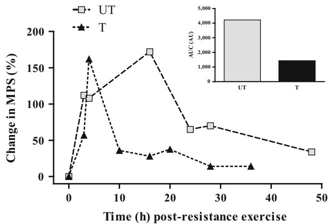
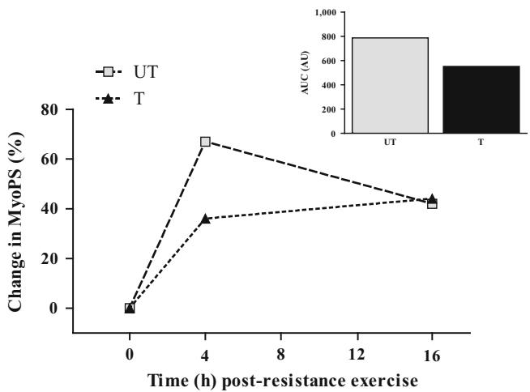

REVIEW ARTICLE

# A Review of Resistance Training-Induced Changes in Skeletal Muscle Protein Synthesis and Their Contribution to Hypertrophy

Felipe Damas • Stuart Phillips • Felipe Cassaro Vechin • Carlos Ugrinowitsch

Published online: 6 March 2015

\- Springer International Publishing Switzerland 2015

Abstract Muscle protein synthesis (MPS) is stimulated by resistance exercise (RE) and is further stimulated by protein ingestion. The summation of periods of RE-induced increases in MPS can induce hypertrophy chronically. As such, studying the response of MPS with resistance training (RT) is informative, as adaptations in this process can modulate muscle mass gain. Previous studies have shown that the amplitude and duration of increases in MPS after an acute bout of RE are modulated by an individual’s training status. Nevertheless, it has been shown that the initial responses of MPS to RE and nutrition are not correlated with subsequent hypertrophy. Thus, early acute responses of MPS in the hours after RE, in an untrained state, do not capture how MPS can affect RE-induced muscle hypertrophy. The purpose of this review is provide an in-depth understanding of the dynamic process of muscle hypertrophy throughout RT by examining all of the available data on MPS after RE and in different phases of an RT programme. Analysis of the time course and the overall response of MPS is critical to determine the potential protein accretion after an RE bout. Exercise-induced increases in MPS are shorter lived and peak earlier in the trained state than in the untrained state, resulting in a smaller overall muscle protein synthetic response in the

trained state. Thus, RT induces a dampening of the MPS response, potentially limiting protein accretion, but when this occurs remains unknown.

## Key Points

Information on muscle protein synthesis increases in the hours and days after resistance exercise, and at different points in the training programme, would allow a better understanding of muscle plasticity throughout a resistance training programme.

The exercise-induced increase in mixed muscle protein synthesis is longer lived and peaks later in the untrained state than in the trained state, resulting in greater overall muscle protein synthesis in the untrained state, but moves towards a lower ‘per workout’ synthetic response and lower protein accretion.

For myofibrillar protein synthesis, there is a paucity of data, but we can consider that the increases after resistance exercise point to a qualitatively similar response to that reported for mixed muscle protein synthesis, indicating a greater potential for myofibrillar protein accretion over time in an untrained condition.

## 1 Introduction

Increases in skeletal muscle mass can be achieved through resistance exercise (RE), which is a potent stimulator of muscle protein synthesis (MPS) [1–8]. Repeated bouts of

RE induce cumulative periods of positive net protein balance, which requires that the rate of MPS exceeds the rate of muscle protein breakdown (MPB) [9]. Although it is not unimportant, MPB changes with RE and feeding comparatively much less than MPS changes in response to RE and nutrition [10], and MPB is not generally considered to be a process that determines RE-induced hypertrophic gains in muscle mass. Thus, in our view, changes in MPS are the main factor driving the skeletal muscle anabolic response after RE with feeding, promoting accretion of proteins in skeletal muscle [11–13].

It has been demonstrated that acute changes in MPS following RE [14–17] align, at least qualitatively (if not in magnitude), with the hypertrophic outcomes due to chronic resistance training (RT) [18–21]. For example, ingestion of milk-based protein after RE promoted greater stimulation of MPS than ingestion of soy-based protein [15], a finding that aligned with long-term data from Hartman et al. [19], demonstrating superior hypertrophy for individuals who consumed milk compared with isoenergetic soy through 12 weeks of RE. In addition, it was shown that casein protein was inferior to whey protein in stimulating MPS after RE [16], which is in agreement with the hypertrophic outcome of subjects supplemented with casein versus whey after RE [20]. In two studies by West et al. [14, 18], investigating the role of endogenous anabolic hormones in MPS and further in hypertrophy, the acute MPS measures were congruent with the hypertrophic outcomes of the RT study. Finally, it was demonstrated that both low- and highload RE are equally effective in stimulating MPS when both are performed to fatigue [17]—findings that agree well with hypertrophic outcomes after 10 weeks of RT [21]. Thus, there are clear cases of agreement between acute responses of MPS and RT-induced hypertrophy. We propose, therefore, that the acute changes in MPS are relevant in gaining insight into the potential for acute interventions to align with longer-term hypertrophic outcomes and thus that changes in MPS play an important role in determining hypertrophy as a result of RT.

Despite the established importance of MPS in RT-induced hypertrophy, there are likely to be changes in the response of MPS with repeated bouts of RE that would preclude a strong relationship between MPS and skeletal muscle hypertrophy. In fact, a recent study showed that MPS responses following the same nutrition and exercise stimulation, analysed within 6 h after the very first acute bout of RE, were not correlated with muscle hypertrophy after 16 weeks of RT [22]. Previous data, collected in the fasted state, also indicated that measuring MPS for a few hours one day after the first session of exercise does not predict the long-term hypertrophic response after a training period [23]. In addition, a very recent article [24] pointed out that the relatively short time window used to assess

MPS and the training-induced changes in MPS may not capture enough of the individual variance in hypertrophy that is attributable to changes in MPS. The result is a poor correlation between the acute MPS response and the chronic muscle hypertrophy outcome after RT in the same individuals [22]. Firstly, analysis of MPS for only a few hours after RE will not likely be enough to form a ‘picture’ of an individual’s muscle plasticity and capacity for hypertrophy with RT. This may be because the acute effect of RE can last for at least 48 h [7, 8] or possibly longer [25]. Thus, longer time windows of MPS in the days, versus hours, after the completion of RE may be more revealing in understanding how each acute bout of RE impacts MPS. Secondly, changes in MPS may adaptively vary rapidly as the training status of an individual progresses [22, 23]. In fact, several studies have demonstrated that the acute increase in MPS after a heavy RE bout is modulated by an individual’s training status—untrained (UT) or resistancetrained (T) [1, 4–8, 26–28]. However, caution should be exercised when comparing these studies, as the data were obtained from different laboratories, from different muscle groups (elbow flexors [5–7] versus knee extensors [8, 29]), from different muscle protein fractions [1, 28] and at different time points. All of these variables can affect the MPS response to an RE bout [6–9, 12, 30, 31], indicating that our understanding of the actual effects of RT status on MPS are currently incomplete. Thus, it is important to understand how MPS responds in different training states to provide a better understanding of the dynamic process of muscle hypertrophy throughout RT.

It is also important to note, mainly when differences in training status are considered [28], that some protocols involve measurement of mixed MPS (which includes all cellular proteins), whereas others measure myofibrillar protein synthesis (MyoPS) [i.e. the rate of synthesis of the contractile proteins that comprise \*60 % of total muscle proteins], and the subfractional synthetic rates are not in complete agreement [17, 32]. Therefore, we need to examine in detail the studies that have reported time courses and individual time points of MPS with differing protein fractions (mixed and/or myofibrillar) and in different training states (UT and T) to establish how MPS changes with RT. Analysis of the time course and the overall response of MPS is critical to determine the potential for protein accretion after an RE bout. Thus, the purpose of this review is provide a better understanding of the changes in the dynamic processes that contribute to muscle hypertrophy throughout RT, examining the available data on the MPS time course after RE, in different phases of an RT programme.

A literature search was performed in the National Library of Medicine’s PubMed database/Medline, Google Scholar and ISI Web of Science (1976–2014), using the following keywords in various combinations: ‘trained’, ‘untrained’, ‘strength’, ‘resistance’, ‘skeletal muscle protein synthesis’, ‘protein synthetic rate’, ‘fractional synthetic rate’, ‘myofibrillar protein synthesis’ and ‘mixed protein synthesis’. The titles and abstracts of the retrieved studies were analysed, and those not relevant were discarded (i.e. those that were disease related, involved individuals older than 40 years of age, or involved drugs that could affect the rate of MPS and/or MyoPS). To be included, the studies had to have used human participants and had to have analysed MPS and/or MyoPS at rest and following an acute bout of RE in the UT state, the T state or both. The reference lists of the selected articles were searched for additional references.

## 2 Direct Comparison Between Training States for Muscle Protein Synthesis in Response to Resistance Exercise

If the general principle regarding adaptation to stress applies, then muscle protein accretion ought to be progressively smaller as RT progresses [33, 34]. Thus, it seems logical to expect an MPS response that would be either smaller in amplitude and/or duration in response to an RE bout in a T state compared with an UT state. Table 1 summarizes the available studies that have directly compared the MPS response in the UT and T states. We made several observations on the data, when we examined them in greater detail, that we propose are important. First, two studies reported higher resting MPS in the T state than in the UT state [26, 28], while other studies found no such difference [4, 27] even when they analysed MyoPS [1, 28]. The elevated resting MPS reported in these studies [26, 28] in the T state compared with the UT state is interesting, as there was also an increase in basal MPB in the T state [26]. Thus, basal elevations in MPS and MPB in the T state versus the UT state appear to reflect an augmentation of protein turnover at rest and not necessarily increased ‘rested state’ protein accretion [26, 28]. This hypothesis receives further support if one considers that even aerobic training—a relatively less effective stimulus for inducing muscle hypertrophy—also increases basal mixed MPS levels [35, 36]. Second, acute elevations in MPS following RE bouts (mainly over the first 24 h after RE) are very consistent in the literature [1, 4, 8, 10, 26–28, 37] and align, at least qualitatively, with the skeletal muscle hypertrophic response to RT [14, 15, 18, 19]. Even though acute responses of MPS following RE are quite consistent, the training status clearly affects the magnitude and the duration of these responses. In fact, analysis of the time course and the overall response of MPS is critical to determine the potential protein accretion after an RE bout.

In a cross-sectional study, Phillips et al. [27] demonstrated that UT subjects had higher mixed MPS rates than T subjects (UT: \*118 %; T: \*49 %) 4 h after a bout of RE. Longitudinal RT studies have shown the effects of changes in training status on MPS after an RE bout, as the same individuals were evaluated in both the UT and T states [1, 4, 26, 28]. Measuring MPS at an early time point after RE, Phillips et al. [26] reported increases in fed-state mixed MPS only in the UT state (\*44 % at 5 h 45 min post-RE bout). However, Tang et al. [4] observed that both T and UT increased mixed MPS, with a greater increase in the T state (\*162 % at 4 h post-RE bout) than in the UT state (\*108 % at 4 h post-RE bout). It is important to emphasize that Phillips et al. [26] measured MPS after RE bouts with the subjects having performed RE using the same absolute workload in both training states, and they reported a non-significant increase in MPS in the T state (\*20 %). The authors concluded that evaluating the subjects at the same absolute workload was the only way to isolate how training per se affected MPS; however, they acknowledged that with their experimental design, the bout of RE required a lot less effort in the T state (because of increased strength) than in the UT state. Thus, the divergence in the results from these two studies is likely due to the relative load used in each exercise bout performed. While comparison using the same absolute load does allow identification of training effects in MPS, it does not mimic a realworld training scenario in which the relative training load is usually increased, or at least maintained, as strength gains are obtained. Thus, the use of the same relative workload provides an applied or ‘real-world’ answer to the question of how training status would affect the MPS response.

In addition to training status affecting the MPS response, there are also important considerations in terms of the feeding state in which the measurements of MPS were made. For example, Kim et al. [28] compared MPS responses after RE in UT and T muscle in the fasted state, while Tang et al. [4] tested both training states in the fed state. Kim et al. [28] reported that only in the UT state was there a significant increase in mixed MPS 16 h after the RE bout (UT leg: \*132 %; T leg: \*21 %). By comparison, Tang et al. [4], as stated above, showed a greater increase at 4 h in post-exercise MPS in the T state than in the UT state, but later (at 28 h), the mixed MPS of the T state had returned to resting levels (\*14 %), while in the UT state, the mixed MPS remained elevated (\*70 %) compared with baseline levels.

It is likely that not all proteins within skeletal muscle would respond to the stimulus of RE. In fact, the synthetic responses of different muscle protein subfractions may be important in understanding how RE affects MPS. For example, a previous study showed that greater increases in mixed MPS post-RE occurred in the UT state, but similar increases in MyoPS occurred in the UT and T states [28]. The authors speculated that in the UT state, when RE is a novel stimulus, there is a larger disturbance of homeostasis, which would initiate a non-specific signal stimulating the rise in MPS of all protein subfractions [28]. Such a thesis may account for the higher non-myofibrillar MPS response in the UT state than in the T state. Wilkinson et al. [1] demonstrated that responses in the UT state occurred in both MyoPS and mitochondrial MPS post-RE, while in the T state, there was an elevation in MyoPS only. Providing additional support to the latter idea, the two studies that compared MyoPS between training states (at 4 h post-RE in the study by Wilkinson et al. [1] and at 16 h post-RE in the study by Kim et al. [28]) demonstrated (statistically) similar increases in MyoPS (UT: \*67 %; T: \*36 % [1], and UT: \*42 %; T: \*44 % [28]). However, it is noteworthy that the increase in MyoPS was nearly 2-fold greater in the UT state than in the T state [1], which indicates that this topic requires further study.

Table 1 Studies that directly compared muscle protein synthetic responses after a resistance exercise bout between training states
<table><tr><td>Study</td><td>Subjects</td><td>Acute resistance exercise bout effort/workload</td><td>measure</td><td>Type of MPS Feeding status at the moment of MPS measurement</td><td>Results</td></tr><tr><td>Phillips et al. [27]</td><td>6 T young subjects (3 men, 3 women); 6 UT young subjects (3 men, 3 women)</td><td>Same relative effort in T and UT states</td><td>Mixed MPS</td><td>Fasted</td><td>Rest: UT = T 4 h: UT rise, T rise, UT &gt; T</td></tr><tr><td>Phillips et al. [26]</td><td>19 UT young men</td><td>Same absolute workload in T and UT states</td><td></td><td>Mixed MPS Fed (CHO, protein, fat) Rest: UT &lt; T</td><td>5 h 45 min: UT rise, T no rise, UT = T</td></tr><tr><td>[28]</td><td>Kim et al. 8 UT young men</td><td>Same relative effort in T and UT states</td><td>Mixed MPS and MyoPS</td><td>Fasted</td><td>Mixed MPS: Rest: UT &lt; T 16 h: UT rise, T no rise, UT &gt; T MyoPS:</td></tr><tr><td>[4]</td><td>Tang et al. 10 UT young men</td><td>and UT states</td><td></td><td>Same relative effort in T Mixed MPS Fed (CHO, protein, fat)</td><td>16 h: UT rise, T rise, UT = T Rest: UT = T 4 h: UT rise, T rise, UT &lt; T 28 h: UT rise, T no rise, UT &gt; T</td></tr><tr><td>Wilkinson et al. [1]</td><td>10 UT young men</td><td>Same relative effort in T MyoPS and UT states</td><td></td><td>Fed (CHO, protein, fat)</td><td>Rest: UT = T 4 h: UT rise, T rise, UT = T</td></tr></table>

CHO carbohydrate, MPS muscle protein synthesis, MyoPS myofibrillar protein synthesis, T resistance trained, UT untrained

Viewed collectively, the initial increase in MPS is less pronounced in the UT state than in the T state; however, it is longer lived and peaks later in the UT state. We speculate that each acute bout of RE modulates the MPS response as one moves from the UT state to the T state. The result would be a differential pattern of the increase in MPS as RT progresses and, thus, a single measurement of MPS in the UT state, prior to a programme of RT, would capture little of an individual’s hypertrophic potential, as has been shown [22, 23].

## 3 Acute Temporal Changes in Muscle Protein Synthesis in Different Training States

In order to better understand acute temporal changes in MPS, we constructed Fig. 1, with data compiled from Tang et al. [4] and Kim et al. [28] (using only data that made the comparison between training states directly), Yarasheski et al. [3, 29], Roy et al. [38] and Phillips et al. [8] (who did not directly perform a comparison between training states but included other time points of analysis using knee extensor muscles). We also included one time point from MacDougall et al. [7], even though the subjects in their study employed the elbow flexors and not the knee extensors, which was the muscle group studied in the other protocols. We chose to include the data from MacDougall et al. [7], as it was the only study that assessed a late time point after RE (36 h) in the T state. We acknowledge the limitations of pooling data from different studies; however, we propose that in this case, it is instructive to use this approach to determine differences in MPS kinetics between training states, and to provide a better understanding of the dynamicity involved in muscle adaptation with RT. As Fig. 1 shows, the initial increase in mixed MPS is less pronounced in the UT state than in the T state; however, it is longer lived and peaks later in the UT state than in the T state; a similar conclusion was reached previously [4].

  
Fig. 1 Time course of the increase in mixed muscle protein synthesis (MPS) following a bout of resistance exercise in the untrained (UT) and resistance-trained (T) states. The data were compiled from Tang et al. [4], Kim et al. [28], Yarasheski et al. [3, 29], Roy et al. [38], Phillips et al. [8] and MacDougall et al. [7]. Inset area under the curve (AUC) for the percentage change in MPS from the UT and T curves, expressed in arbitrary units (AU)

The data shown in the inset of Fig. 1, showing the area under the curve for MPS, suggest that increased mixed MPS in the first 48 h after RE is approximately 3-fold greater in the UT state than in the T state. Importantly, the relatively transient nature of the response of MPS in the T state compared with the UT state is congruent with the attenuated capacity for hypertrophy observed in the former. For example, Ahtiainen et al. [39] compared the quadriceps femoris cross-sectional area following 21 weeks of heavy RT in UT and T subjects. As expected, the T individuals had a greater muscle cross-sectional area than the UT subjects at baseline; however, after 21 weeks of RT, only the UT group demonstrated significant hypertrophy, despite a significantly greater total volume of work performed by the T group [39]. In that study [39], however, the comparisons were made between highly trained subjects, and an important (and currently unanswered) question is when in an RT programme the muscle would become ‘refractory’ to an RE stimulus and show an attenuated MPS response (Fig. 1).

Not only the training status of individuals but also other variables can interfere in acute MPS responses and hypertrophic outcomes. For instance, differences in nutrition [15, 16, 40], sleep [41], habitual physical activity [42, 43] and genetic variations/polymorphisms [44–46] can modulate MPS and hypertrophic responses. Thus, it is plausible to assume that it would be the integrated response of summed RE bouts, nutrition, sleep, general activity and genetic predisposition of free-living humans that would yield a phenotypic outcome of RT. Nevertheless, to date, studies have not adequately addressed these interactions, and this represents a major limitation in identifying how acute RE-induced alterations in MPS may qualitatively/ quantitatively predict training outcomes in free-living humans. Therefore, care should be taken in predicting a chronic outcome based only on acute MPS responses to an RE bout regardless of the training status of the individuals. This can be further investigated, and maybe more adequately answered, with use of a more integrative study of MPS using, for example, the deuterated water method [47–50], which allows analysis of MPS over days to weeks after RE and does not interfere with daily activities, permitting an MPS analysis in free-living humans.

  
Fig. 2 Proposed time course of the increase in myofibrillar protein synthesis (MyoPS) following a bout of resistance exercise in the untrained (UT) and resistance-trained (T) states. The data were compiled from Kim et al. [28] and Wilkinson et al. [1]. Inset area under the curve (AUC) for the percentage change in MyoPS from the UT and T curves, expressed in arbitrary units (AU)

How MPS would change over the course of an RT programme is not currently known; however, we hypothesize that RT would alter the pattern of change in MPS specific to different protein fractions differently in individuals. Plainly, the response of MyoPS is more relevant than mixed MPS, as myofibrillar proteins are the contractile proteins and may relate to the hypertrophic and functional outcomes that are most relevant to RT. Nevertheless, estimating a precise time course of MyoPS in different training states is problematic, as the data are scarce [1, 28]. The available studies that have compared MyoPS after RE in subjects in different training states point to qualitatively similar responses, as reported for mixed MPS, depicted in

Fig. 1. As shown in Fig. 2, there is a greater area under the curve (\*43 %) for MyoPS in the UT state, which would seem to indicate a greater potential for myofibrillar protein accretion over time, in comparison with the T state (Fig. 2). Importantly, in neither of these studies had MyoPS returned to resting levels; thus, in contrast to the response of mixed MPS (Fig. 1), we are still unaware of the exact time course of MyoPS in the T and UT states.

## 4 Conclusion and Perspectives

Exercise-induced increases in MPS are longer lived and peak later in the UT state than in the T state, resulting in greater overall MPS, and likely greater net protein accretion, in the UT state. This observation indicates that RT must adaptively induce changes in processes that modulate MPS, but these currently remain elusive. The responses of MyoPS are even harder to predict, as there is a paucity of data; however, the available evidence indicates that the increases after RE point to responses that are qualitatively similar to those reported for mixed MPS, indicating a greater potential for protein accretion over time in the UT state. We currently lack information on how MPS increases in the days and weeks (as opposed to hours) after RE and at different times during RT. This type of information would allow a better understanding of how muscle plasticity adapts throughout an RT programme. Specifically, the integrative response of MyoPS should be analysed at temporally distant time points, even days after the performance of heavy RE. Utilization of deuterated water as a tracer could serve this propose [48–50]. Also, to the best of our knowledge, no study to date has tracked MyoPS at multiple times throughout an extended training period; it is worth highlighting that one study did it over a very short period (i.e. 8 days [47]), which would seem to be important, as the initial (6 h) MPS response does not correlate with hypertrophy. Thus, an analysis that captures the behaviour of both variables (i.e. MPS integrative data and direct hypertrophic data) over a given training period may better describe the dynamic process of muscle remodelling through RT.

Acknowledgments We would like to acknowledge Sa˜o Paulo Research Foundation (FAPESP) Grant #2012/24499-1, and the Brazilian National Council for Scientific and Technological Development (CNPq), for funding received. The authors have no conflicts of interest, financial or otherwise, to declare.

## References

1. Wilkinson SB, Phillips SM, Atherton PJ, et al. Differential effects of resistance and endurance exercise in the fed state on signalling

molecule phosphorylation and protein synthesis in human muscle. J Physiol. 2008;586(Pt 15):3701–17.

2. Biolo G, Maggi SP, Williams BD, et al. Increased rates of muscle protein turnover and amino acid transport after resistance exercise in humans. Am J Physiol. 1995;268(3 Pt 1):E514–20.

3. Yarasheski KE, Zachwieja JJ, Bier DM. Acute effects of resistance exercise on muscle protein synthesis rate in young and elderly men and women. Am J Physiol. 1993;265(2 Pt 1):E210–4.

4. Tang JE, Perco JG, Moore DR, et al. Resistance training alters the response of fed state mixed muscle protein synthesis in young men. Am J Physiol Regul Integr Comp Physiol. 2008;294(1): R172–8.

5. Chesley A, MacDougall JD, Tarnopolsky MA, et al. Changes in human muscle protein synthesis after resistance exercise. J App Physiol. 1992;73(4):1383–8.

6. MacDougall JD, Tarnopolsky MA, Chesley A, et al. Changes in muscle protein synthesis following heavy resistance exercise in humans: a pilot study. Acta Physiol Scand. 1992;146(3):403–4.

7. MacDougall JD, Gibala MJ, Tarnopolsky MA, et al. The time course for elevated muscle protein synthesis following heavy resistance exercise. Can J Appl Physiol. 1995;20(4):480–6.

8. Phillips SM, Tipton KD, Aarsland A, et al. Mixed muscle protein synthesis and breakdown after resistance exercise in humans. Am J Physiol. 1997;273(1 Pt 1):E99–107.

9. Burd NA, Tang JE, Moore DR, et al. Exercise training and protein metabolism: influences of contraction, protein intake, and sex-based differences. J Appl Physiol. 2009;106(5):1692–701.

10. Kumar V, Atherton P, Smith K, et al. Human muscle protein synthesis and breakdown during and after exercise. J Appl Physiol. 2009;106(6):2026–39.

11. Glynn EL, Fry CS, Drummond MJ, et al. Muscle protein breakdown has a minor role in the protein anabolic response to essential amino acid and carbohydrate intake following resistance exercise. Am J Physiol Regul Integr Comp Physiol. 2010;299(2):R533–40.

12. Atherton PJ, Smith K. Muscle protein synthesis in response to nutrition and exercise. J Physiol. 2012;590(Pt 5):1049–57.

13. Phillips BE, Hill DS, Atherton PJ. Regulation of muscle protein synthesis in humans. Curr Opin Clin Nutr Metab Care. 2012;15(1):58–63.

14. West DW, Kujbida GW, Moore DR, et al. Resistance exerciseinduced increases in putative anabolic hormones do not enhance muscle protein synthesis or intracellular signalling in young men. J Physiol. 2009;587(Pt 21):5239–47.

15. Wilkinson SB, Tarnopolsky MA, Macdonald MJ, et al. Consumption of fluid skim milk promotes greater muscle protein accretion after resistance exercise than does consumption of an isonitrogenous and isoenergetic soy-protein beverage. Am J Clin Nutr. 2007;85(4):1031–40.

16. Tang JE, Moore DR, Kujbida GW, et al. Ingestion of whey hydrolysate, casein, or soy protein isolate: effects on mixed muscle protein synthesis at rest and following resistance exercise in young men. J Appl Physiol (1985). 2009;107(3):987–92.

17. Burd NA, West DW, Staples AW, et al. Low-load high volume resistance exercise stimulates muscle protein synthesis more than high-load low volume resistance exercise in young men. PLoS One. 2010;5(8):e12033.

18. West DW, Burd NA, Tang JE, et al. Elevations in ostensibly anabolic hormones with resistance exercise enhance neither training-induced muscle hypertrophy nor strength of the elbow flexors. J Appl Physiol. 2010;108(1):60–7.

19. Hartman JW, Tang JE, Wilkinson SB, et al. Consumption of fatfree fluid milk after resistance exercise promotes greater lean mass accretion than does consumption of soy or carbohydrate in young, novice, male weightlifters. Am J Clin Nutr. 2007;86(2): 373–81.

20. Cribb PJ, Williams AD, Carey MF, et al. The effect of whey isolate and resistance training on strength, body composition, and plasma glutamine. Int J Sport Nutr Exerc Metab. 2006;16(5):494–509.

21. Mitchell CJ, Churchward-Venne TA, West DW, et al. Resistance exercise load does not determine training-mediated hypertrophic gains in young men. J Appl Physiol (1985). 2012;113(1):71–7.

22. Mitchell CJ, Churchward-Venne TA, Parise G, et al. Acute postexercise myofibrillar protein synthesis is not correlated with resistance training-induced muscle hypertrophy in young men. PLoS One. 2014;9(2):e89431.

23. Mayhew DL, Kim JS, Cross JM, et al. Translational signaling responses preceding resistance training-mediated myofiber hypertrophy in young and old humans. J Appl Physiol. 2009;107(5):1655–62.

24. Mitchell C, Churchward-Venne TA, Cameron-Smith D, et al. What is the relationship between acute of muscle protein synthesis response and changes in muscle mass? J Appl Physiol. In press.

25. Miller BF, Olesen JL, Hansen M, et al. Coordinated collagen and muscle protein synthesis in human patella tendon and quadriceps muscle after exercise. J Physiol. 2005;567(Pt 3):1021–33.

26. Phillips SM, Parise G, Roy BD, et al. Resistance-training-induced adaptations in skeletal muscle protein turnover in the fed state. Can J Physiol Pharmacol. 2002;80(11):1045–53.

27. Phillips SM, Tipton KD, Ferrando AA, et al. Resistance training reduces the acute exercise-induced increase in muscle protein turnover. Am J Physiol. 1999;276(1 Pt 1):E118–24.

28. Kim PL, Staron RS, Phillips SM. Fasted-state skeletal muscle protein synthesis after resistance exercise is altered with training. J Physiol. 2005;568(Pt 1):283–90.

29. Yarasheski KE, Campbell JA, Smith K, et al. Effect of growth hormone and resistance exercise on muscle growth in young men. Am J Physiol. 1992;262(3 Pt 1):E261–7.

30. Smith K, Rennie MJ. Protein turnover and amino acid metabolism in human skeletal muscle. Baillieres Clin Endocrinol Metab. 1990;4(3):461–98.

31. Burd NA, Andrews RJ, West DW, et al. Muscle time under tension during resistance exercise stimulates differential muscle protein sub-fractional synthetic responses in men. J Physiol. 2012;590(Pt 2):351–62.

32. Burd NA, West DW, Moore DR, et al. Enhanced amino acid sensitivity of myofibrillar protein synthesis persists for up to 24 h after resistance exercise in young men. J Nutr. 2011;141(4):568–73.

33. Sale DG. Neural adaptation to resistance training. Med Sci Sports Exerc. 1988;20(5 Suppl):S135–45.

34. Alway SE, Grumbt WH, Stray-Gundersen J, et al. Effects of resistance training on elbow flexors of highly competitive bodybuilders. J Appl Physiol (1985). 1992;72(4):1512–21.

35. Short KR, Vittone JL, Bigelow ML, et al. Age and aerobic exercise training effects on whole body and muscle protein metabolism. Am J Physiol Endocrinol Metab. 2004;286(1):E92–101.

36. Pikosky MA, Gaine PC, Martin WF, et al. Aerobic exercise training increases skeletal muscle protein turnover in healthy adults at rest. J Nutr. 2006;136(2):379–83.

37. Witard OC, Jackman SR, Breen L, et al. Myofibrillar muscle protein synthesis rates subsequent to a meal in response to increasing doses of whey protein at rest and after resistance exercise. Am J Clin Nutr. 2014;99(1):86–95.

38. Roy BD, Tarnopolsky MA, MacDougall JD, et al. Effect of glucose supplement timing on protein metabolism after resistance training. J Appl Physiol (1985). 1997;82(6):1882–8.

39. Ahtiainen JP, Pakarinen A, Kraemer WJ, et al. Acute hormona and neuromuscular responses and recovery to forced vs maximum repetitions multiple resistance exercises. Int J Sports Med. 2003;24(6):410–8.

40. Staples AW, Burd NA, West DW, et al. Carbohydrate does not augment exercise-induced protein accretion versus protein alone. Med Sci Sports Exerc. 2011;43(7):1154–61.

41. Beelen M, Tieland M, Gijsen AP, et al. Coingestion of carbohydrate and protein hydrolysate stimulates muscle protein synthesis during exercise in young men, with no further increase during subsequent overnight recovery. J Nutr. 2008;138(11):2198–204.

42. Breen L, Stokes KA, Churchward-Venne TA, et al. Two weeks of reduced activity decreases leg lean mass and induces ‘‘anabolic resistance’’ of myofibrillar protein synthesis in healthy elderly. J Clin Endocrinol Metab. 2013;98(6):2604–12.

43. Koopman R, Verdijk L, Manders RJ, et al. Co-ingestion of protein and leucine stimulates muscle protein synthesis rates to the same extent in young and elderly lean men. Am J Clin Nutr. 2006;84(3):623–32.

44. Pescatello LS, Kostek MA, Gordish-Dressman H, et al. ACE ID genotype and the muscle strength and size response to unilateral resistance training. Med Sci Sports Exerc. 2006;38(6):1074–81.

45. Clarkson PM, Devaney JM, Gordish-Dressman H, et al. ACTN3 genotype is associated with increases in muscle strength in response to resistance training in women. J Appl Physiol (1985). 2005;99(1):154–63.

46. Riechman SE, Balasekaran G, Roth SM, et al. Association of interleukin-15 protein and interleukin-15 receptor genetic variation with resistance exercise training responses. J Appl Physiol. 2004;97(6):2214–9.

47. Wilkinson DJ, Franchi MV, Brook MS, et al. A validation of the application of D(2)O stable isotope tracer techniques for monitoring day-to-day changes in muscle protein subfraction synthesis in humans. Am J Physiol Endocrinol Metab. 2014;306(5):E571–9.

48. Gasier HG, Fluckey JD, Previs SF. The application of 2H2O to measure skeletal muscle protein synthesis. Nutr Metab (Lond). 2010;7:31.

49. Gasier HG, Fluckey JD, Previs SF, et al. Acute resistance exercise augments integrative myofibrillar protein synthesis. Metabolism. 2012;61(2):153–6.

50. MacDonald AJ, Small AC, Greig CA, et al. A novel oral tracer procedure for measurement of habitual myofibrillar protein synthesis. Rapid Commun Mass Spectrom. 2013;27(15):1769–77.