ORIGINAL ARTICLE

# A mathematical model‑based approach to optimize loading schemes of isometric resistance training sessions

Johannes L. Herold1  · Andreas Sommer1

Accepted: 5 November 2020 / Published online: 23 December 2020   
© The Author(s) 2020

## Abstract

Individualized resistance training is necessary to optimize training results. A model-based optimization of loading schemes could provide valuable impulses for practitioners and complement the predominant manual program design by customizing the loading schemes to the trainee and the training goals. We compile a literature overview of model-based approaches used to simulate or optimize the response to single resistance training sessions or to long-term resistance training plans in terms of strength, power, muscle mass, or local muscular endurance by varying the loading scheme. To the best of our knowledge, contributions employing a predictive model to algorithmically optimize loading schemes for diferent training goals are nonexistent in the literature. Thus, we propose to set up optimal control problems as follows. For the underlying dynamics, we use a phenomenological model of the time course of maximum voluntary isometric contraction force. Then, we provide mathematical formulations of key performance indicators for loading schemes identifed in sport science and use those as objective functionals or constraints. We then solve those optimal control problems using previously obtained parameter estimates for the elbow fexors. We discuss our choice of training goals, analyze the structure of the computed solutions, and give evidence of their real-life feasibility. The proposed optimization methodology is independent from the underlying model and can be transferred to more elaborate physiological models once suitable ones become available.

Keywords Isometric · Resistance training · Optimal control · Optimization · Ordinary diferential equation model

## Abbreviations

FTI Force-time integral   
KPI Key performance indicator   
MVIC Maximum voluntary isometric contraction   
ODE Ordinary diferential equation   
RT Resistance training   
TUT Time-under-tension

## 1 Introduction

## 1.1 Resistance training and model‑based approaches

Resistance training (RT) is a popular choice among athletes, rehabilitation patients, or the general public to improve physical performance. Benefts of RT include increased muscular strength and endurance, improved body composition, or enhanced functional capacity and quality of life [52]. To optimize results, individualized RT is necessary [24]. Therefore, training variables as exercise selection, frequency, volume, or intensity are adjusted to the trainee and the training goals. These adjustments are commonly performed by the trainee or a coach via trial-and-error [20].

To complement such a manual decision- making, many research areas like chemical or mechanical engineering have adopted methods from scientifc computing, e.g., modeling, simulation, and optimization. For this reason, scientifc computing is often considered to be the third pillar of methodology in science next to theory and experiment [38]. Nevertheless, sport science and exercise physiology are only slowly realizing the potential of model-based approaches [7]. In particular, applications covering loading schemes for resistance training are limited. We refer to the literature overview in the next section to justify this claim.

A model-based optimization of loading schemes for RT could provide valuable impulses for practitioners and complement the predominant manual program design. By calibrating the model to the trainee, individual parameters are obtained. Then, optimized RT programs could be computed specifcally for this trainee, exercise, and training goal based on a key performance indicator (KPI) accessible in the model. Furthermore, a comparison of efective loading schemes in practice and algorithmically optimized loading schemes could help to identify the driving stimuli for adaptations, e.g., the contributions of mechanical loading, metabolic stress, and muscle damage to hypertrophic adaptations [44] or the efect of diferent mechanical stimuli on strength and power adaptations [21]. Moreover, RT programs could be designed to induce the same level of metabolic disturbances. This would allow to increase the comparability between training approaches, e.g., between blood fow restriction training and conventional training.

## 1.2 Purpose

In this work, we provide a literature overview of modelbased approaches used to simulate or optimize the response to single RT sessions or to long-term RT plans in terms of strength, power, muscle mass, or local muscular endurance by varying the loading scheme. To the best of our knowledge, contributions employing a predictive model to algorithmically optimize loading schemes for diferent training goals are nonexistent in the literature. Thus, we propose to set up optimal control problems as follows. For the underlying dynamics, we use a phenomenological model of the time course of maximum voluntary isometric contraction (MVIC) force. Then, we provide mathematical formulations of key performance indicators for loading schemes identifed in sport science and use those as objective functionals or constraints. Those KPIs are the force- time integral, the time-under-tension (TUT), the accumulated fatigue defned as loss of MVIC force, and variants thereof. We then solve those optimal control problems using previously obtained parameter estimates for the elbow fexors. Last, we discuss our results, point out limitations, and give an outlook on further research.

## 2 Literature overview

In the following, we provide an overview of model-based approaches used to simulate or optimize an individual’s response to single RT sessions or to long-term RT plans in terms of strength, power, muscle mass, or local muscular endurance by varying the loading scheme. We begin with defning prerequisites which are necessary for a model to be used with our approach.

Remark Here, we do not include work that is restricted to the biomechanical analysis of RT exercises, the description of muscular fatigue during RT, or general models of the training-performance relationship without a specifc application to RT, as a thorough literature overview including these felds of research is beyond the scope of this work. However, we would like to mention that substantial work has been done in these felds—either close or synergetic to ours. For example, model-based approaches are stronger established in endurance sports to analyze optimum pacing strategies [8, 57], training strategies [23], or long-term adaptations [54]. Furthermore, as soon as a suitable extension of the model to dynamic movements is available, possible synergies could arise from existing works which analyze and compute optimum movements [22, 27]. For the interested reader, we refer to these exemplary works and the references therein.

## 2.1 Model prerequisites

To enable a real-life application for practitioners, the model used should fulfll several criteria. First, the inputs of the model, which correspond to the training plan of the trainee, have to be interpretable for practitioners. As such, using quantities which reduce the dimensionality of the training input [48] is not desirable. For example, using only volume load (defned as weight × repetitions × sets) [11] to describe the loading scheme of an RT session provides no information about the intensity distribution and is therefore unsuitable. Second, the parameters of the model should be identifable through commonly available measurement procedures, e.g., force measurements, to avoid an overly laborious model calibration. Third, due to the high number of possible training inputs, the model should be suitable for high-dimensional optimization, i.e., for derivative-based optimization [29]. Fourth, the model should allow to incorporate real-life constraints into the optimization problem, e.g., days or weeks of [43]. Last, the model should be assessed for its predictive ability. We classify a model as predictive if it has been ft to a subset of the available data and the resulting parameter estimates can be used to predict the remaining data. We emphasize this, as the terminology is sometimes used diferently and models are already classifed as predictive if they ft the whole dataset—a property we call descriptive. However, overparameterization or other model defciencies might diminish the model’s ability to predict unknown datasets. Benzekry et al. [10], for example, demonstrated this issue illustratively for tumor growth modeling. Furthermore, ft and prediction should be evaluated by suitable measures [46] and should not be judged based on the plots alone, as those are heavily depending on the chosen visualization.

## 2.2 Existing models

Banister et al. [9] introduced a systems model based on the assumption that each training load induces a negative efect (fatigue) and a positive efect (ftness) on performance. As the original paper cannot be found easily, we refer to Calvert et al. [19] for a description of the model. The ordinary differential equation (ODE) model has been adopted for various settings and several modifcations have been proposed. The model is commonly known as Banister model or Fitness-Fatigue model and predominantly given in a time-discrete formulation. Busso et al. [16, 17] ftted variants of the Banister model to data from Olympic weightlifters. The authors used weighted weekly training volume as input and clean and jerk performance as output and correlated the model components to diferent hormones. However, the predictive ability of the model was not tested, i.e., the whole dataset was used for ftting the model. Model variants were furthermore used by Philippe et al. [40] to describe the response of rats to resistance training. In subsequent work, the authors used exponential growth functions for this purpose [41]. In both works, model prediction was not tested.

Mader [36, 37] developed an ODE model of the active adaptation and regulation of protein synthesis on a cellular level. The model uses intensity of the functional activity as input and gives protein mass as an indicator of functional capacity as the most important output. The model is able to describe supercompensation as well as overtraining, which is demonstrated by simulating diferent scenarios. An extended version of the model has been proposed by Ullmer and Mader [51]. None of the variants were experimentally validated.

Gatti et al. [26] computed training plans for shoulder rehabilitation by determining the optimal number of sets per exercise for increasing maximum isometric strength given a time constraint. Two diferent objective functions were examined and compared to current practice. No statements about training intensity were made.

Gacesa et al. [25] used a nonlinear dynamic system to separately ft fatigue data and muscular growth data of the triceps brachii. The predictive ability of the model was not tested.

Arandjelović [2] introduced a model of neuromuscular adaption to resistance training. In this model, the so-called capability profle of an athlete is modifed depending on the execution of an exercise. The author subsequently used simulations to examine the infuence of using fxed loads or accommodating loads on the training stimulus. Furthermore, the author proposed a framework to calibrate the model from video data [5, 7]. The model was found to successfully predict performance in the bench press and the squat. Resistance training can then be adjusted via trialand-error by inspecting the simulated adaptations. Additionally, Arandjelović used the model to examine training strategies to overcome the sticking point of an arm curl [3], to examine the infuence of externally supplied momentum on the hypertrophy stimulus of a shoulder lateral raise [6], and to examine diferent loading mechanisms of a Smith machine [4]. Although these three studies are mainly of biomechanical nature, we mention them here, as they specifcally aim at increasing force or muscle mass by a model-based examination of possible adaptations.

Wisdom et al. [53] proposed ODE models of muscle adaptation to chronic overstretch, overload, understretch, and underload and compared those models to experimental data. The predictive ability of the models was not tested. Zhou et al. [56] used similar dynamics to describe hypertrophy and atrophy of a muscle fber given as crosssectional area with muscle activation level as input. After ftting their model to experimental data, the authors simulated muscle atrophy during a spacefight and how diferent exercises could serve as countermeasures.

Torres et al. [49] extended an energy balance model to account for the hypertrophic efects of resistance training and used the model for simulation studies. Moreover, the model was ft to data from elderly participants following a resistance training routine. Resistance training input is described via a scaling variable and has no direct interpretation in terms of volume, intensity, or frequency.

Herold et al. [29] constructed and validated a model of the time course of maximum voluntary isometric contraction force. Exemplarily, the model was used to algorithmically maximize the force-time integral (FTI) of an isometric RT session. We use this model as the foundation of our work, as it is—to the best of our knowledge—the only one to be tested for its predictive ability, suitable for derivative-based optimization, and directly interpretable for practitioners in terms of RT input. However, as the model provides a phenomenological description of muscular fatigue for diferent loading schemes, it does not directly link the RT input to a physiological adaptation of the trainee. Additionally, there still exist research gaps concerning the exact stimuli and mechanisms of muscular adaptation. To circumvent these issues, we provide mathematical formulations of KPIs for loading schemes identifed in sport science and accessible in the model. Those KPIs are the force-time integral, the time-under-tension, the accumulated fatigue defned as loss of MVIC force, and variants thereof.

## 3 Materials and methods

In this section, we describe the model and the optimization problems. For readers with a focus away from mathematical modeling, simulation, and optimization, we provide a short textual summary and then invite them to directly proceed to the results section if desired.

## 3.1 Textual summary

Previous work [29] allows us to predict how MVIC force of a muscle group decreases and recovers under isometric loading (Eq. 1). Using mathematical methods of optimal control, this enables us to compute optimized isometric RT sessions (Eq. 2) with respect to diferent trainings goals. These training goals are constructed from the force-time integral, timeunder-tension, or fatigue (Eqs. 3–6).

## 3.2 Model

For our numerical experiments, we use a phenomenological model of the time course of maximum voluntary isometric contraction force. We state the ordinary diferential equation system and give a short explanation of the components. For a detailed description of the model, we refer to the original paper [29].

The model describes the current MVIC force capacity

$$
h _ { \mathrm { M V I C } } : [ 0 , T ]  [ 0 , 1 ]\tag{1a}
$$

of a muscle (or muscle group) at joint level under an external isometric load

$$
u _ { \mathrm { a b s } } : [ 0 , T ]  [ 0 , 1 ]\tag{1b}
$$

on the time horizon [0, T] . MVIC force capacity and external load are normalized to baseline MVIC force and are thus dimensionless. Moreover, the ranges of functions specifed in this description are restricted to physiological meaningful values. The defning equations of the model are given as

$$
\frac { \mathrm { d } } { \mathrm { d } t } x _ { \mathrm { s l o w } } ( t ) = p _ { 1 } ( 1 - x _ { \mathrm { s l o w } } ( t ) ) - p _ { 2 } u _ { \mathrm { a b s } } ( t )\tag{1c}
$$

$$
\begin{array} { c } { { \displaystyle \frac { \mathrm { d } } { \mathrm { d } t } x _ { \mathrm { { f a s t } } } ( t ) = p _ { 3 } ( 1 - u _ { \mathrm { { a b s } } } ( t ) ) ^ { p _ { 4 } } ( 1 - x _ { \mathrm { { f a s t } } } ( t ) ) } } \\ { { - p _ { 5 } u _ { \mathrm { { a b s } } } ( t ) } } \end{array}\tag{1d}
$$

$$
h _ { \mathrm { M V I C } } ( t ) = x _ { \mathrm { s l o w } } ( t ) x _ { \mathrm { f a s t } } ( t ) ,\tag{1e}
$$

where

$$
x : [ 0 , T ]  [ 0 , 1 ] ^ { 2 }\tag{1f}
$$

consists of two dimensionless state variables $x _ { \mathrm { f a s t } }$ and $x _ { \mathrm { s l o w } } .$ The model furthermore contains fve dimensionless parameters $p _ { i } \in [ 0 , \infty )$ for $i \in \{ 1 , \ldots , 5 \}$ describing fatigue and recovery properties. The initial conditions for the states are given by

$$
\begin{array} { r } { x ( 0 ) = x _ { 0 } \in [ 0 , 1 ] ^ { 2 } . } \end{array}\tag{1g}
$$

For an unfatigued muscle, one chooses $x _ { 0 } = ( 1 , 1 ) ^ { \top }$ . To simulate MVIC eforts, it is favorable to substitute

$$
u _ { \mathrm { a b s } } ( t ) = u _ { \mathrm { r e l } } ( t ) h _ { \mathrm { M V I C } } ( t )\tag{1h}
$$

and use

$$
u _ { \mathrm { r e l } } : [ 0 , T ]  [ 0 , 1 ] ,\tag{1i}
$$

the load relative to the current force capacity, as input.

The model was validated with a comprehensive set of data from the elbow fexors [29]. We use the corresponding parameter estimates in this work.

## 3.3 Optimal control problem

We use a multi-stage formulation on $n _ { s } \geq 2$ stages—denoted by superscripts $i \in \{ 1 , \ldots , n _ { s } \} - \mathrm { t o }$ model the resistance training sessions [29]. To include metrics for the TUT, the FTI, and the accumulated fatigue, we extend the model by three states tracking these quantities $x _ { \mathrm { T U T } } , x _ { \mathrm { F I I } }$ , and $x _ { \mathrm { f a t i g u e } } .$ The general multi-stage optimal control problem can then be formulated as

$$
\operatorname* { m a x } _ { x ^ { i } ( \cdot ) , u _ { \mathrm { a b s } } ^ { i } ( \cdot ) , T ^ { i } } \ : \mathcal { P } ( x ^ { n _ { s } } ( T ^ { n _ { s } } ) )\tag{2a}
$$

$$
\operatorname { s . t . } x ^ { 1 } ( 0 ) = ( 1 , 1 , 0 , 0 , 0 ) ^ { \top }\tag{2b}
$$

$$
x ^ { i } ( 0 ) = x ^ { i - 1 } ( T ^ { i - 1 } ) \operatorname { f o r } i \in \{ 2 , \dots , n _ { s } \}\tag{2c}
$$

$$
\sum _ { i = 1 } ^ { n _ { s } } T ^ { i } = C _ { T }\tag{2d}
$$

$$
x _ { \mathrm { T U T } } ^ { n _ { s } } ( T ^ { n _ { s } } ) \leq C _ { \mathrm { T U T } }\tag{2e}
$$

$$
x _ { \mathrm { F T I } } ^ { n _ { s } } ( T ^ { n _ { s } } ) \leq C _ { \mathrm { F T I } }\tag{2f}
$$

$$
{ \mathrm { a n d ~ f o r ~ } } i \in \{ 1 , 3 , \ldots , n _ { s } - 2 , n _ { s } \} { \mathrm { ~ a n d ~ } } t \in [ 0 , T ^ { i } ] :
$$

$$
\frac { \mathrm { d } } { \mathrm { d } t } x _ { \mathrm { \mathrm { \tiny ~ s l o w } } } ^ { i } ( t ) = p _ { 1 } ( 1 - x _ { \mathrm { \tiny ~ s l o w } } ^ { i } ( t ) ) - p _ { 2 } u _ { \mathrm { \tiny ~ a b s } } ^ { i } ( t )\tag{2g}
$$

$$
\begin{array} { c } { { \displaystyle \frac { \mathrm { d } } { \mathrm { d } t } x _ { \mathrm { \tiny ~ f a s t } } ^ { i } ( t ) = p _ { 3 } ( 1 - u _ { \mathrm { a b s } } ^ { i } ( t ) ) ^ { p _ { 4 } } ( 1 - x _ { \mathrm { f a s t } } ^ { i } ( t ) ) } } \\ { { - p _ { 5 } u _ { \mathrm { a b s } } ^ { i } ( t ) } } \end{array}\tag{2h}
$$

$$
\frac { \mathrm { d } } { \mathrm { d } t } x _ { \mathrm { F T I } } ^ { i } ( t ) = u _ { \mathrm { a b s } } ^ { i } ( t )\tag{2i}
$$

$$
\frac { \mathrm { d } } { \mathrm { d } t } x _ { \mathrm { T U T } } ^ { i } ( t ) = \left\{ \begin{array} { l l } { 0 \mathrm { \ i f \ } u _ { \mathrm { a b s } } ^ { i } ( t ) = 0 } \\ { 1 \mathrm { \ e l s e } } \end{array} \right.\tag{2j}
$$

$$
\frac { \mathrm { d } } { \mathrm { d } t } x _ { \mathrm { \tiny ~ f a t i g u e } } ^ { i } ( t ) = 1 - h _ { \mathrm { \tiny ~ M V I C } } ^ { i } ( t )\tag{2k}
$$

$$
u _ { \mathrm { l o w } } \leq u _ { \mathrm { a b s } } ^ { i } ( t ) \leq h _ { \mathrm { M V I C } } ^ { i } ( t )\tag{2l}
$$

and for $i \in \{ 2 , 4 , \dots , n _ { s } - 3 , n _ { s } - 1 \}$ and $t \in [ 0 , T ^ { i } ]$

$$
\frac { \mathrm { d } } { \mathrm { d } t } x _ { \mathrm { \mathrm { \ s l o w } } } ^ { i } ( t ) = p _ { 1 } ( 1 - x _ { \mathrm { \ s l o w } } ^ { i } ( t ) )\tag{2m}
$$

$$
\frac { \mathrm { d } } { \mathrm { d } t } x _ { \mathrm { \mathrm { \scriptsize ~ f a s t } } } ^ { i } ( t ) = p _ { 3 } ( 1 - x _ { \mathrm { \scriptsize ~ f a s t } } ^ { i } ( t ) )\tag{2n}
$$

$$
\frac { \mathrm { d } } { \mathrm { d } t } x _ { \mathrm { \tiny ~ F T I } } ^ { i } ( t ) = 0\tag{2o}
$$

$$
{ \frac { \mathrm { d } } { \mathrm { d } t } } x ^ { i } \mathrm { _ { T U T } } ( t ) = 0\tag{2p}
$$

$$
{ \frac { \mathrm { d } } { \mathrm { d } t } } x _ { \mathrm { f a t i g u e } } ^ { i } ( t ) = 0 ,\tag{2q}
$$

with $C _ { T }$ being the total time and $C _ { \mathrm { T U T } }$ and $C _ { \mathrm { F T I } }$ the upper bounds on the total time-under-tension and the force-time integral. During odd numbered stages contractions with $u _ { \mathrm { l o w } } \leq u _ { \mathrm { a b s } }$ are possible. Even numbered stages are considered rest periods. The duration $T ^ { i }$ of each stage is being optimized. We adapt this optimal control problem to diferent scenarios in the following. If not mentioned otherwise, all sessions last 20 min, allow $n _ { c } = 2 5$ possible contractions and have no restrictions on FTI or TUT. This implies $C _ { T } =$ 1200 s, $n _ { s } = 4 9$ and neglecting Constraints (2e) and (2f). Table 1 gives an overview of the symbols used in the problem formulation.

To solve the problems numerically, we employ a frstdiscretize-then-optimize strategy. We use the optimal control software MUSCOD-II [33, 34], which originates from the work of Bock and Plitt [13] and implements a direct multiple shooting approach to transcribe the problem to fnitedimensional form. We employ a piecewise constant control discretization. To integrate the ODE system, we use a Runge–Kutta–Fehlberg method and generate the sensitivities via internal numerical diferentiation [12]. The necessary derivatives of the model functions are generated via fnitediference approximations. The resulting nonlinear program is solved with a tailored structure-exploiting trust-region sequential quadratic programming method with limitedmemory block-updates of the Hessian. For details, we refer to the references above.

In the following, we present how this general optimal control problem formulation (2) is adapted to diferent sessions (labeled Session A to K). We refer to Table 2 for a concise overview.

Table 1 Overview of symbols used in the multi-stage optimal control problem (2)
<table><tr><td>Symbol</td><td>Interpretation</td></tr><tr><td> $C _ { T }$ </td><td>Total time</td></tr><tr><td> $C _ { \mathrm { F T I } }$ </td><td>Upper bound on total FTI</td></tr><tr><td> $C _ { \mathrm { T U T } }$ </td><td>Upper bound on total TUT</td></tr><tr><td> $h _ { \mathrm { { M V I C } } } ^ { i }$ </td><td>MVIC force</td></tr><tr><td>&#x27;</td><td>Stage index</td></tr><tr><td> $x _ { \mathrm { T U T } } ^ { i }$ </td><td>Time-under-tension</td></tr><tr><td> $x _ { \mathrm { F T I } } ^ { i }$ </td><td>Force-time integral</td></tr><tr><td></td><td>Accumulated fatigue</td></tr><tr><td> $x _ { \mathrm { f a t i g u e } } ^ { i }$ </td><td></td></tr><tr><td> $n _ { s }$ </td><td>Number of stages</td></tr><tr><td> $p _ { j }$ </td><td>Parameters</td></tr><tr><td> $\boldsymbol { \phi }$ </td><td>Objective functional</td></tr><tr><td>t</td><td>Time</td></tr><tr><td> $T ^ { i }$ </td><td>Stage duration</td></tr><tr><td> $u _ { \mathrm { a b s } } ^ { i }$ </td><td>External force</td></tr><tr><td> $u _ { \mathrm { l o w } }$ </td><td>Lower bound on  $u _ { \mathrm { a b s } }$ </td></tr><tr><td> $x _ { \mathrm { f a s t } } ^ { i }$ </td><td>State variable</td></tr><tr><td> $x _ { \mathrm { s l o w } } ^ { i }$ </td><td>State variable</td></tr></table>

## 3.4 FTI‑based goals

Resistance training volume is an important determinant of long-term adaptations [24]. For isometric contractions, where no actual physical work is performed, the force-time integral is an often used analogue of work [42]. Thus, for Session A, we maximize the FTI accumulated during an RT session without imposing restrictions on the contraction intensity, i.e., $\pmb { \phi } ( x ) = x _ { \mathrm { F T I } }$ and $u _ { \mathrm { l o w } } = 0$

To increase maximum strength, high loads are recommended by some researchers, e.g., by the [1]. Therefore, the model has previously been used to compute an exemplary optimized RT session, which maximizes the FTI and ensures that the contraction intensity is higher than a minimum threshold intensity of 80% of baseline MVIC force [29]. We adopt this example and examine how lowering or raising the minimum threshold intensity infuences the solution. For Session $\mathbf { B } _ { 7 0 \% }$ , we set $\pmb { \phi } ( x ) = x _ { \mathrm { F T I } }$ and $u _ { \mathrm { l o w } } = 0 . 7$ . For Session $\mathrm { B _ { 9 0 \% } }$ , we set $\pmb { \phi } ( x ) = x _ { \mathrm { F T I } }$ and $u _ { \mathrm { l o w } } = 0 . 9$

As an alternative to the full FTI maximized in Session A, one can use the FTI accumulated above the minimum threshold intensity as an indicator of efective training volume. For Session C, we thus set $u _ { \mathrm { l o w } } = 0$ and replace Eq. (2i) with

$$
\frac { \mathrm { d } } { \mathrm { d } t } x _ { \mathrm { F T I } } ^ { i } ( t ) = u _ { \mathrm { a b s } } ^ { i } ( t ) - 0 . 8 .\tag{3}
$$

A similar measure has been used by Burnley [15] when examining work capacity above critical torque.

Table 2 Overview of sessions used in this work. If not mentioned otherwise, all sessions last 20 min and allow 25 possible contractions
<table><tr><td></td><td>Session Explanation</td><td>Objective</td><td>Constraints</td><td>Modified equations</td></tr><tr><td colspan="5">FTI-based</td></tr><tr><td>A</td><td>Maximize FTI</td><td> $\pmb { \phi } ( x ) = x _ { \mathrm { F T I } }$ </td><td> $u _ { \mathrm { l o w } } = 0$ </td><td></td></tr><tr><td> $\mathrm { \Delta B _ { 7 0 \% } }$ </td><td>Maximize FTI while ensuring a minimum threshold intensity</td><td> $\pmb { \phi } ( x ) = x _ { \mathrm { F T I } }$ </td><td> $u _ { \mathrm { l o w } } = 0 . 7$ </td><td></td></tr><tr><td> $\mathrm { B _ { 9 0 \% } }$ </td><td>Maximize FTI while ensuring a minimum threshold intensity</td><td> $\pmb { \phi } ( x ) = x _ { \mathrm { F T I } }$ </td><td> $u _ { \mathrm { l o w } } = 0 . 9$ </td><td></td></tr><tr><td>C</td><td>Maximize FTI accumulated above a minimum threshold intensity</td><td> $\pmb { \phi } ( x ) = x _ { \mathrm { F T I } }$ </td><td> $u _ { \mathrm { l o w } } = 0$ </td><td> $\frac { \mathrm { d } } { \mathrm { d } t } \boldsymbol { x } _ { \mathrm { \tiny ~ F T I } } ^ { i } ( t ) = \boldsymbol { u } _ { \mathrm { a b s } } ^ { i } ( t ) - 0 . 8$ </td></tr><tr><td> $\mathrm { D } _ { 5 }$ </td><td>Maximize FTI while ensuring a minimum threshold intensity with 5 possible contractions</td><td> $\pmb { \phi } ( x ) = x _ { \mathrm { F T I } }$ </td><td> $u _ { \mathrm { l o w } } = 0 . 8$ </td><td></td></tr><tr><td> $\mathrm { D } _ { 5 0 }$ </td><td>Maximize FTI while ensuring a minimum threshold intensity with 50 possible contractions</td><td> $\pmb { \phi } ( x ) = x _ { \mathrm { F T I } }$ </td><td> $u _ { \mathrm { l o w } } = 0 . 8$ </td><td></td></tr><tr><td>E</td><td>Maximize a weighted version of FTI</td><td> $\pmb { \phi } ( x ) = x _ { \mathrm { F T I } }$ </td><td> $u _ { \mathrm { l o w } } = 0$ </td><td> $\begin{array} { r } { \frac { \mathrm { d } } { \mathrm { d } t } x _ { \mathrm { F T I } } ^ { i } ( t ) = ( u _ { \mathrm { a b s } } ^ { i } ( t ) ) ^ { 2 } } \end{array}$ </td></tr><tr><td>F</td><td>Maximize a weighted version of FTI</td><td> $\pmb { \phi } ( x ) = x _ { \mathrm { F T I } }$ </td><td> $u _ { \mathrm { l o w } } = 0 . 8$ </td><td> $\begin{array} { r } { \frac { \mathrm { d } } { \mathrm { d } t } x _ { \mathrm { \tiny ~ F T I } } ^ { i } ( t ) = ( u _ { \mathrm { a b s } } ^ { i } ( t ) - 0 . 8 ) ^ { 2 } } \end{array}$ </td></tr><tr><td colspan="5">Fatigue-based</td></tr><tr><td>G H</td><td>Maximize fatigue</td><td> $\varPhi ( x ) = x _ { \mathrm { f a t i g u e } } \quad u _ { \mathrm { l o w } } = 0$ </td><td></td><td></td></tr><tr><td></td><td>Maximize fatigue while ensuring a minimum threshold inten- sity</td><td> $\varPhi ( x ) = x _ { \mathrm { f a t i g u e } } \quad u _ { \mathrm { l o w } } = 0 . 8$ </td><td></td><td></td></tr><tr><td>I</td><td>Minimize fatigue to reach a certain FTI</td><td> $\phi ( x ) = - x _ { \mathrm { f a t i g u e } } \ u _ { \mathrm { l o w } } = 0 , C _ { \mathrm { F T I } } = 1 5 0 \ \textrm { -- }$ </td><td></td><td></td></tr><tr><td colspan="5">TUT-based</td></tr><tr><td>J</td><td>Maximize TUT while ensuring a minimum threshold intensity</td><td> $\phi ( x ) = x _ { \mathrm { T U T } } \qquad u _ { \mathrm { l o w } } = 0 . 8$ </td><td></td><td></td></tr><tr><td>K</td><td>Maximize a weighted version of TUT</td><td> $\phi ( x ) = x _ { \mathrm { T U T } } \qquad u _ { \mathrm { l o w } } = 0 . 8$ </td><td></td><td> $\begin{array} { r } { \frac { \mathrm { d } } { \mathrm { d } t } x _ { \mathrm { T U T } } ^ { i } ( t ) = \left\{ \begin{array} { l l } { 0 \mathrm { ~ i f ~ } u _ { \mathrm { a b s } } ^ { i } ( t ) = 0 } \\ { t \mathrm { ~ e l s e } } \end{array} \right. } \end{array}$ </td></tr></table>

For Session D, we examine the infuence of the number of possible contractions on Session B and compute the solution for $n _ { c } \in \{ 5 , 6 , \ldots , 4 9 , 5 0 \}$ possible contractions. This allows to investigate if more but expectedly shorter contractions allow to accumulate a higher FTI while ensuring a minimum threshold intensity of $u _ { \mathrm { l o w } } = 0 .$ 8 and if the additional possible contractions are actually realized in the solution.

Instead of choosing a minimum threshold intensity, we can emphasize higher loads by evaluating a weighting function on the integrand of the FTI. For demonstration purposes, we choose a quadratic weighting function for Session E. Therefore, we set $\pmb { \phi } ( x ) = x _ { \mathrm { F T I } }$ and replace Eq. (2i) with

$$
\frac { \mathrm { d } } { \mathrm { d } t } x _ { \mathrm { \tiny ~ F T I } } ^ { i } ( t ) = ( u _ { \mathrm { a b s } } ^ { i } ( t ) ) ^ { 2 } .\tag{4}
$$

$u _ { \mathrm { l o w } }$ is set to 0. A similar approach has been used by Arandjelović [6] to describe the hypertrophy stimulus of a resistance training set, although he used a sigmoid function, which can be interpreted as a smoothing of the constraint $u _ { \mathrm { l o w } } \leq u _ { \mathrm { a b s } }$ used in Session B.

A similar weighting can be applied to Session C by replacing Eq. (2i) with

$$
\frac { \mathrm { d } } { \mathrm { d } t } x _ { \mathrm { F I I } } ^ { i } ( t ) = ( u _ { \mathrm { a b s } } ^ { i } ( t ) - 0 . 8 ) ^ { 2 }\tag{5}
$$

and setting the objective functional to $\pmb { \phi } ( x ) = x _ { \mathrm { F T I } }$ for Session F. In contrast to Session $\mathrm { C } , u _ { \mathrm { l o w } } = 0 . \mathrm { \Omega } \mathrm { : }$ 8 is necessary here, as otherwise $u _ { \mathrm { a b s } } = 0$ would be the solution.

## 3.5 Fatigue‑based goals

Efects of fatigue, e.g., metabolic stress or increased motor unit recruitment, have been attributed to trigger or positively infuence muscle hypertrophy [44]. We examine which loading scheme maximizes fatigue, defned as the accumulated loss of MVIC force over time. Thus, for Session G, we choose $\phi ( x ) = x _ { \mathrm { f a t i g u e } }$ and $u _ { \mathrm { l o w } } = 0$

For Session H, we maximize fatigue while ensuring a minimum threshold intensity of 80% of baseline MVIC force. Therefore, we choose $\phi ( x ) = x _ { \mathrm { f a t i g u e } }$ and $u _ { \mathrm { l o w } } = 0 . 8 .$

In contrast to maximizing fatigue, it might also be desired to accumulate a certain amount of work while minimizing fatigue, e.g., during the tapering period before a competition. For Session I, we exemplarily choose $\phi ( x ) = - x _ { \mathrm { f a t i g u e } } { \mathrm { a n d } } C _ { \mathrm { F T I } } = 1 5 0 { \mathrm { s } }$

## 3.6 TUT‑based goals

Several authors have examined time-under-tension as a determinant of acute responses and long-term adaptations to RT (e.g., [14] or [45]). Therefore, for Session J, we maximize TUT while ensuring a minimum threshold intensity by choosing $\begin{array} { r } { \phi ( x ) = x _ { \mathrm { T U T } } } \end{array}$ and $u _ { \mathrm { l o w } } = 0 . 8$

Session J does not take into account the duration of the contractions used to accumulate the total TUT. However, some author have reported diferent adaptations to short and long duration contractions with greater hypertrophy occurring after long duration contractions [45]. Thus, to weight the duration of contractions quadratically, we replace Eq. (2j) with

$$
\frac { \mathrm { d } } { \mathrm { d } t } x _ { \mathrm { \tiny ~ T U T } } ^ { i } ( t ) = \left\{ \begin{array} { l l } { { 0 \mathrm { ~ i f ~ } u _ { \mathrm { a b s } } ^ { i } ( t ) = 0 } } \\ { { t \mathrm { ~ e l s e } } } \end{array} \right.\tag{6}
$$

for Session K. All other settings are kept as in Session J.

## 4 Results

In the following, we provide the results of our computations. Here, we focus on the structure of the computed solutions. For readers who skipped the methods section, we redescribe the scenarios without the mathematical details. We refer to Table 2 for a concise overview. If not mentioned otherwise, all sessions last 20 min and allow 25 possible contractions.

## 4.1 FTI‑based goals

Resistance training volume is an important determinant of long-term adaptations [24]. For isometric contractions, where no actual physical work is performed, the force-time integral is an often used analogue of work [42]. Thus, for Session A, we maximize the FTI accumulated during an RT session without imposing restrictions on the contraction intensity. Figure 1a illustrates the model response obtained by simulating Session A.

To increase maximum strength, high loads are recommended by some researchers, e.g., by the [1]. Therefore, the model has previously been used to compute an exemplary optimized RT session, which maximizes the FTI and ensures that the contraction intensity is higher than a minimum threshold intensity of 80% of baseline MVIC force [29]. We adopt this example and examine how lowering or raising the minimum threshold intensity to 70% or 90% of baseline MVIC force infuences the structure of the solution. Figure 1b, c illustrates the model response obtained by simulating Sessions $\mathbf { B } _ { 7 0 \% }$ and $\mathrm { { B } _ { 9 0 \% } }$

For Session C, as an alternative to the full FTI maximized in Session A, one can use the FTI accumulated above the minimum threshold intensity as an indicator of efective training volume. A similar measure has been used by Burnley [15] when examining work capacity above critical torque. Figure 1d illustrates the model response obtained by simulating Session C.

For Session D, we examine the infuence of the number of possible contractions on Session B and compute the solution for 5–50 possible contractions. This allows to investigate if more but expectedly shorter contractions allow to accumulate a higher FTI while ensuring a minimum threshold intensity of 80% of baseline MVIC force and if the additional possible contractions are actually realized in the solution. Figure 1e, f illustrates the model response obtained by simulating Sessions ${ \bf D } _ { 5 }$ and $\mathrm { D } _ { 5 0 }$ . Figure 2 depicts the objective functional value in dependency of the number of possible contractions. Figure 3 depicts the durations of contractions and rests in dependency of the number of possible contractions. For all sessions, all 25 possible contractions are realized.

Instead of choosing a minimum threshold intensity, we can emphasize higher loads by evaluating a weighting function on the integrand of the FTI. For demonstration purposes, we choose a quadratic weighting function for Session E. A similar approach has been used by Arandjelović [6] to describe the hypertrophy stimulus of a resistance training set, although he used a sigmoid function, which can be interpreted as a smoothing of the constraint used in Session B. Figure 1g illustrates the model response obtained by simulating Session E.

For Session F, a similar quadratic weighting function can be applied to Session C. Figure 1h illustrates the model response obtained by simulating Session F.

## 4.2 Fatigue‑based goals

Efects of fatigue, e.g., metabolic stress or increased motor unit recruitment, have been attributed to trigger or positively infuence muscle hypertrophy [44]. For Session G, we examine which loading scheme maximizes fatigue, defned as the accumulated loss of MVIC force over time. Figure 1i illustrates the model response obtained by simulating Session G.

For Session H, we maximize fatigue while ensuring a minimum threshold intensity of 80% of baseline MVIC force. Figure 1j illustrates the model response obtained by simulating Session H.

In contrast to maximizing fatigue, it might also be desired to accumulate a certain amount of work while minimizing fatigue, e.g., during the tapering period before a competition. For Session I, we model such a scenario. Figure 1k illustrates the model response obtained by simulating Session I.

## 4.3 TUT‑based goals

Several authors have examined time-under-tension as a determinant of acute responses and long-term adaptations to RT (e.g., [14] or [45]). Therefore, for Session J, we maximize TUT while ensuring a minimum threshold intensity of 80% of baseline MVIC force. Figure 1l illustrates the model response obtained by simulating Session J.

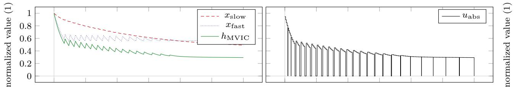  
(a) Session A.

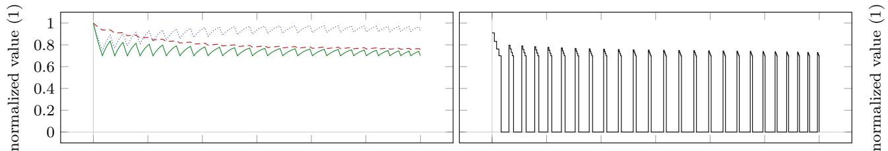  
(b) Session B 70%.

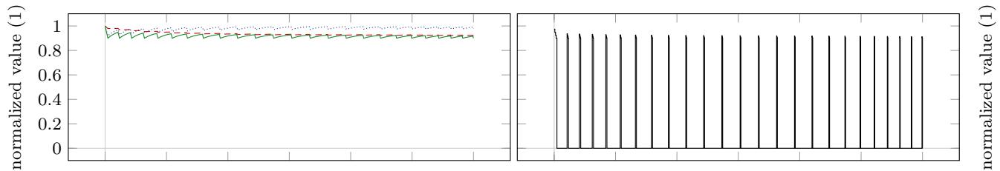

(c) Session B 90% .  
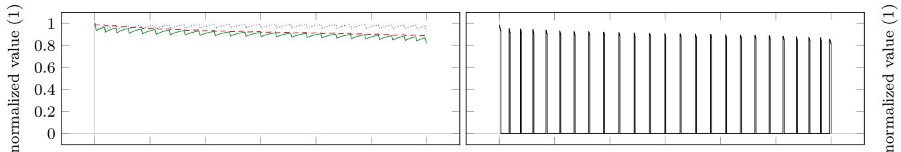

(d) Session C.  
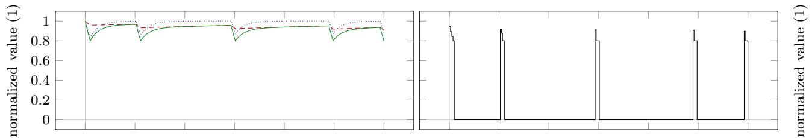  
(e) Session D5.

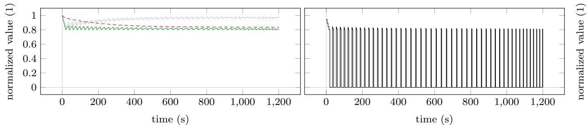  
(f) Session D 50.  
Fig. 1 Model response obtained by simulating Sessions A to K. We refer to the text and Table 2 for an explanation of the individual sessions. The left column depicts the model response. The absolute force input is illustrated in the right column.

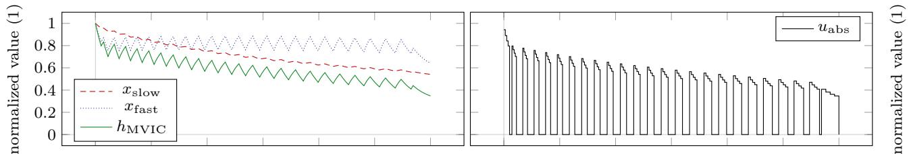

(g) Session E.  
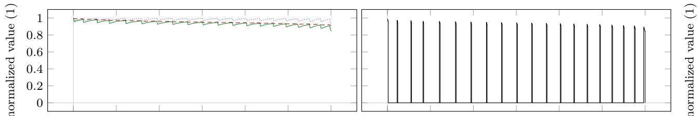

(h) Session F.  
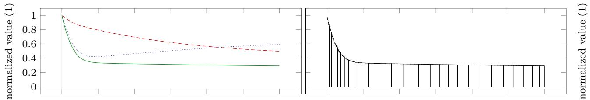

(i) Session G.  
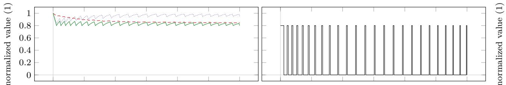

(j) Session H.  
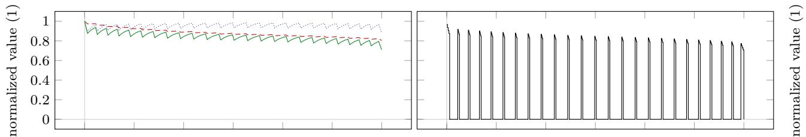  
(k) Session I .

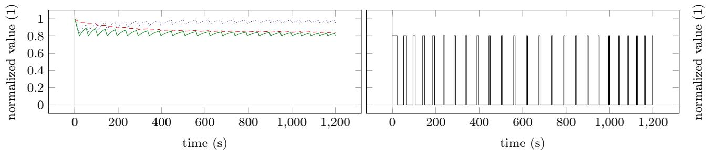  
(l) Session J.  
Fig. 1 (continued)

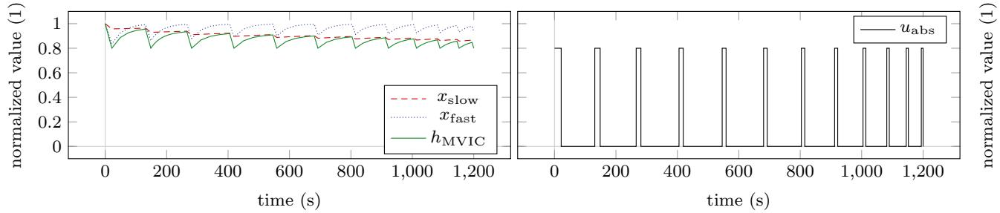  
(m) Session K.

Fig. 1 (continued)  
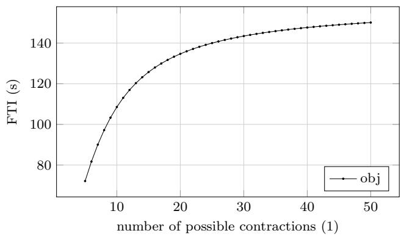  
Fig. 2 Dependency of the objective functional value on the number of possible contractions for Sessions $\mathrm { D } _ { 5 }$ to $\mathrm { D } _ { 5 0 } .$ Increasing the number of possible contractions increases the FTI of the computed solution

Session J does not take into account the duration of the contractions used to accumulate the total TUT. However, some author have reported diferent adaptations to short and long duration contractions with greater hypertrophy occurring after long duration contractions [45]. Thus, we weight the durations of contractions quadratically for Session K. All other settings are kept as in Session J. Figure 1m illustrates the model response obtained by simulating Session K.

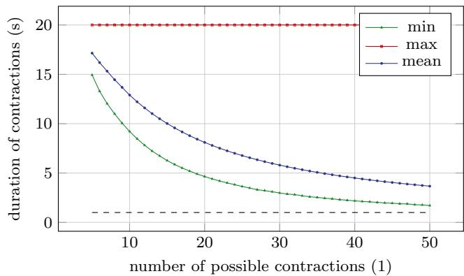  
(a)  
Fig. 3 Dependency of the durations of contractions (a) and rests (b) on the number of possible contractions for Sessions $\mathrm { D } _ { 5 }$ to $\mathrm { D } _ { 5 0 } .$ The horizontal dashed lines illustrate the 1 s mark. Increasing the number

## 4.4 Durations of contractions and rests

Table 3 contains the minimum, the maximum, and the mean durations of the contractions and rests for all sessions plotted. To a certain extent, this allows to examine the real-life feasibility of the computed sessions.

## 5 Discussion

## 5.1 Choice of training goals

In general, a model-based approach is limited by the predictive ability of the employed model and the available numerical solution methods. As mentioned, the model of Herold et al. [29] ofers a phenomenological description of muscular fatigue for diferent loading schemes and does not directly

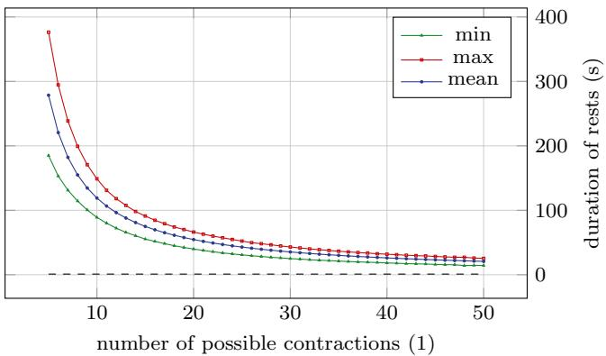  
(b)  
of possible contractions decreases the durations of contractions and rests of the computed solution

Table 3 Minimum, maximum, and mean durations of contractions $\delta _ { \mathrm { c } }$ and rests $\delta _ { \mathrm { r } }$ for all sessions plotted. To a certain extent, this data allows to examine the real-life feasibility of the computed sessions

link the RT input to a physiological adaptation of the trainee. Thus, when choosing the training goals, we are limited by key performance indicators accessible in the model. For this reason, we use assumptions from sport science about optimal training as objectives and constraints.

The three KPIs force-time integral, time-under-tension, and loss of MVIC force can readily be used in the optimal control problem formulations. Furthermore, we employ variants of these three KPIs to demonstrate how even slight modifcations can change the structure of the solution. This highlights how important it is for exercise physiologists and sport scientists to identify the correct driving stimuli for adaptations to design optimized RT programs. Suitable physiological models would allow a more thorough search, e.g., by incorporating the build up of metabolites such as hydrogen ions and inorganic phosphate or by describing the activation of diferent fber types.

## 5.2 Structure of the computed RT sessions

While the resulting diferences between the solutions might seem small at frst, one should keep in mind that these differences accumulate during the course of an RT plan over weeks and months.

The results of Session D favor a higher number of contractions to accumulate more force-time integral in this scenario. This is in line with the solutions of most other sessions, in which all 25 possible contractions are realized. However, this is not the case for the solutions of Sessions A, F, G, and K. The results of Session A illustrate that the inclusion of rests is not benefcial during the beginning and the end of the session for this setting. To enable high contraction intensities, the solution of Session F consists of only 20 contractions. This is due to the fact that we weight the contraction intensities proportionally more than in the solution of Session $\mathrm { C } ,$ where all 25 contractions are realized. The solution of Session G describes a sustained MVIC efort, which is caused by choosing the accumulated loss of MVIC force as training goal. The solution of Session K only realizes 12 contractions in order to enable longer contraction durations compared to the solution of Session J. This can be verifed by comparing the mean contractions duration of Session J and K, i.e., 6.99 s and 12.01 s (see Table 3).

<table><tr><td>Session</td><td> $\operatorname* { m i n } ( \delta _ { \mathrm { c } } )$ </td><td> $\operatorname* { m a x } ( \delta _ { \mathrm { c } } )$ </td><td> $\mathrm { m e a n } ( \delta _ { \mathrm { c } } )$ </td><td> $\operatorname* { m i n } ( \delta _ { \mathrm { r } } )$ </td><td> $\operatorname* { m a x } ( \delta _ { \mathrm { r } } )$ </td><td> $\mathrm { m e a n } ( \delta _ { \mathrm { r } } )$ </td></tr><tr><td> $\mathbf { A }$ </td><td>19.21</td><td>465.46</td><td>60.54</td><td>1.96</td><td>8.76</td><td>6.49</td></tr><tr><td> $\mathbf { B } _ { 7 0 \% }$ </td><td>6.24</td><td>33.28</td><td>11.41</td><td>28.63</td><td>45.64</td><td>38.11</td></tr><tr><td> $\mathrm { B _ { 9 0 \% } }$ </td><td>1.62</td><td>9.13</td><td>3.04</td><td>33.02</td><td>56.96</td><td>46.83</td></tr><tr><td> $\textrm { C }$ </td><td>3.71</td><td>6.06</td><td>4.11</td><td>28.90</td><td>51.81</td><td>45.72</td></tr><tr><td> $\mathrm { D } _ { 5 }$ </td><td>14.94</td><td>20.00</td><td>17.14</td><td>184.96</td><td>376.31</td><td>278.57</td></tr><tr><td> $\mathrm { D } _ { 5 0 }$ </td><td>1.70</td><td>20.00</td><td>3.67</td><td>14.38</td><td>25.36</td><td>20.75</td></tr><tr><td>E</td><td>16.10</td><td>62.36</td><td>26.06</td><td>7.15</td><td>25.63</td><td>22.86</td></tr><tr><td>F</td><td>3.08</td><td>6.54</td><td>3.52</td><td>39.36</td><td>73.22</td><td>59.45</td></tr><tr><td>G</td><td>1200.00</td><td>1200.00</td><td>1200.00</td><td>0.00</td><td>0.00</td><td>0.00</td></tr><tr><td>H</td><td>4.30</td><td>21.76</td><td>6.97</td><td>20.57</td><td>54.54</td><td>42.74</td></tr><tr><td>I</td><td>6.51</td><td>12.05</td><td>7.25</td><td>30.09</td><td>48.14</td><td>42.45</td></tr><tr><td>J</td><td>3.69</td><td>21.76</td><td>6.99</td><td>30.57</td><td>51.91</td><td>42.72</td></tr><tr><td>K</td><td>5.81</td><td>21.76</td><td>12.01</td><td>42.10</td><td>126.68</td><td>95.97</td></tr></table>

Except for the solutions of Sessions H, J, and K, all solutions consist exclusively of MVIC eforts. This was unexpected, as we anticipated that submaximal contractions might allow a greater accumulation of training volume due to them inducing less fatigue. It would be interesting to examine if such a behavior also occurs for dynamic constant external RT. The solution of Session H exhibits an interesting behavior as the inclusion of a minimum threshold intensity now favors submaximal contractions compared to the MVIC eforts of the solution of Session G. This is possibly caused by the longer contraction durations, which then contribute more to the accumulated fatigue. Session I exhibits the same behavior as the MVIC eforts reduce the time necessary to accumulate the desired FTI. The same holds for the solutions of Sessions J and K, where the submaximal contractions allow a greater time-under-tension. The submaximal contractions are all held until muscle failure. In case this is not desired, this could be included into the optimization problem as a constraint. If a minimum threshold intensity was chosen, the MVIC eforts are conducted until this intensity is reached (see in particular Session B). Sessions C and F difer. Here, the contractions are terminated earlier as contractions with the minimum threshold intensity do not contribute to the chosen training goal. Session E demonstrates how a focus can be set on higher contraction durations without the use of a minimum threshold intensity.

A remark from a mathematical point of view: For all sessions, constraints limit the feasible region of the optimization problems and many constraints are active in the solutions, e.g., maximum or minimum contraction intensities are attained, which is expected in an optimal control context. All chosen constraints are solely physiologically motivated—no artifcial constraints have been introduced. However, due to the discretization of the constraints within the multiple shooting approach, the algorithm only guarantees that the constraints are met at the shooting nodes. In case of constraint violations between the shooting grid points, the grid can be refned easily to meet the requirements.

As already noticed during the model development [29], the grouping of repetitions into sets is not supported by our results. Instead, the contractions are spread more evenly over the whole time horizon to allow a greater accumulation of training volume, i.e., force-time integral. This is a similar approach to variants of so-called cluster sets [50], which allow to increase training volume by breaking up the traditional set-repetition structure. Here, the algorithmic optimization of durations of contractions and rests provides a clear advantage over intuitive planning.

## 5.3 Real‑life feasibility of the computed RT sessions

To ensure the real-life feasibility of the computed RT sessions, several aspects have to be taken into account. First, the duration of the contractions may not be too short, as the trainees need time to develop MVIC force. Second, the duration of the submaximal contractions may not be too long, as the concept of task failure or limited work capacity is currently not implemented into the model [29]. Third, the rest periods between submaximal contractions may not be too short, as the model also does not account for a regeneration of work capacity.

Kawakami et al. [31] examined 100 intermittent MVIC eforts lasting 1 s followed by 1 s rest of the triceps surae muscles and reported no problems in executing this task. Table  3 and Fig.  3 show that our solutions do not propose durations shorter than 1 s for contractions and rests. Although a diferent muscle group was used in the study of Kawakami et al. [31], their data demonstrates that such short intermittent contractions might be possible in general.

Yoon et al. [55] examined endurance times for sustained isometric contractions of the elbow fexors at 90 degrees joint angle and at 80% of MVIC force. Although the experimental setup difered slightly compared to that of the experiments used for the model validation [29] (forearm horizontal versus forearm vertical to the ground), the mean endurance times of 25.0 s for men and 24.3 s for women are consistent with the maximum duration of 21.76 s of our solutions for Sessions H, J, and K (see Table 3). To the best of our knowledge, no prediction of endurance time or work capacity exists for MVIC eforts. Cafer et al. [18], for example, examined MVIC eforts of several muscle groups lasting 10 min and reported no task failure among the participants.

Thus, it remains to be validated experimentally if the solutions of Session A, E, and G, which contain sustained MVIC eforts of long durations, can be realized in practice.

Although several authors have examined the recovery of endurance times (see, for example, the work of Stull and Kearney [47] or [32]) and work capacity (see, for example, the review by Jones and Vanhatalo [30]), to the best of our knowledge, no model of their time course exists that fulflls the prerequisites postulated for use in an optimization context [29]. Furthermore, we are not aware of any experimental data that rejects the feasibility of the solutions of Sessions H, J, and K due to too short rests. If this should be the case, lower bounds on the durations of the rests could be incorporated into the optimal control problem.

## 6 Limitations and future research

As no fully suitable mathematical model for the more commonly used dynamic constant external resistance (DCER) training is available, we are optimizing isometric RT sessions. Research shows that the transfer from isometric RT to dynamic performance is questionable [39]. Therefore, we discourage direct transfer of our fndings to DCER or other forms of training. However, an extension of our approach to DCER training is straightforward once suitable models become available. The same holds true for extensions to other indicators of muscle fatigue (e.g., power, contraction velocity, or muscular endurance), multiple exercises, or long-term planning.

Moreover, we are using parameters obtained from the elbow fexors, as so far those are the only ones available. For this reason, a comparison between muscle groups or participants is not possible at the moment. It would be intriguing to calibrate the model to diferent muscle groups and participants and then examine how the resulting parameters afect the optimized RT sessions. [35], for example, after analyzing fatigue and recovery patterns of MVIC torque of the knee extensors, conclude that individualizing training might be important to optimize performance. The authors used proton magnetic resonance spectroscopy to analyze muscle fber typology of the gastrocnemius and then classify the participants into a slow- and a fast-twitch group for which they expected diferent patterns. With a modelbased approach, this classifcation could be formulated as a parameter estimation problem for which the necessary force measurements could be obtained in one testing session [28]. Afterwards, RT sessions could be optimized individually as proposed in this work.

Since we are using local optimization methods, modifed initial guesses do not necessarily lead to identical results. Vanishing stages in the employed multi-stage formulation could lead to redundant discretized controls.

Thus, the computed solutions are neither globally optimal nor unique. However, considering that globally optimal solutions cannot be efciently computed for problems of this type, starting from an initial (e.g., empirically derived) training design, the employed method generates an improved design that is locally optimal.

Last, we acknowledge that the model is validated with data from laboratory studies. Thus, we face the same problems as the original studies: the transfer from the laboratory to real-life RT needs to be verifed experimentally. To this end, we outline two potential experimental setups in the following, which could be conducted together with interested practitioners from the sports sciences.

The frst experiment is designed to verify if our modelbased approach allows to achieve a better objective functional value compared to an intuitive approach. For illustrative purposes, we choose Session B, which maximizes the FTI while ensuring a minimum threshold intensity using 25 contractions within 20 min. After the trainees have familiarized themselves with the dynamometer, a testing session is conducted to individually calibrate the model to the trainees’ elbow fexors and obtain reliable parameter estimates [28]. After sufcient rest, the trainees are asked to intuitively perform a session, which they think to be optimal for the given task. An optimized session is then computed for each trainee and after resting sufciently again, the trainees are asked to perform the optimized session. This order is chosen to prevent any learning efects. Afterwards, the data of the two sessions is analyzed and the objective functional values are compared. Furthermore, the real-life feasibility of the optimized sessions can be evaluated by computing the deviations of prescribed force and actual force.

After a successful frst experiment, a second one could be conducted to examine whether the chosen objective function is benefcial for our training goal. However, this can only be done in comparison to another objective functional. For illustrative purposes, we compare Sessions $\mathrm { \Delta B _ { 7 0 \% } }$ and $\mathrm { { B } _ { 9 0 \% } }$ with regard to increasing maximum strength. To this end, trainees with the same level of RT experience are randomly assigned to three groups—a control group, a group following optimized training protocols for Session $\mathbf { B } _ { 7 0 \% }$ , and a group following optimized training protocols for Session $\mathrm { B } _ { 9 0 \% }$ At the beginning of the experiment, an MVIC force test is conducted. This test is repeated at the end of the experiment and the results are analyzed. We emphasize that in this work the sessions are optimized independently of each other. Therefore, long-term planning has to be determined by the experimenters. Nutrition and recovery should be adequate and comparable among the trainees. If desired, the model parameters and the optimized sessions could be updated at any desired point in time.

## 7 Conclusion

We demonstrate that a mathematical model-based approach could provide valuable impulses for practitioners and complement the predominant manual program design of loading schemes for RT. Although, the diferences in the optimized sessions might seem small, one should keep in mind that those accumulate during the course of an RT plan over weeks and months.

With our approach, training protocols—either motivated by current practice or of a more exploratory and unconventional nature—could be examined at a large scale via forward simulations of the model. The fexible formulation of diferent training goals in terms of adjusted objective functions allows to evaluate the performance of training sessions in silico. Thus, training recommendations can be analyzed and rated with respect to their justifcation and efciency without the tremendous testing eforts in actual trials.

As our approach is independent of the underlying model, we encourage researchers to develop and validate models, which are suitable for optimization and which connect the training input of different RT types directly to training goals such as increasing strength and power, hypertrophy, or increasing local muscular endurance. This would extend the possibilities to set up the optimization problems and might furthermore help to identify the driving mechanisms for long-term adaptations. Then, we could exploit the full potential of our approach.

In addition to a large variety of application areas, e.g., biomechanical movement analysis or the design of sports equipment, our work underlines and demonstrates the potential of quantitative mathematics to analyze and improve sports activities.

Acknowledgements JLH gratefully thanks Dr. Christian Kirches of the Institute for Mathematical Optimization, Technische Universität Carolo-Wilhelmina zu Braunschweig, Braunschweig, Germany for stimulating discussions on this topic. We furthermore would like to thank the anonymous reviewers for their comments on our manuscript.

Author contributions JLH conceived the idea for this work. JLH conducted the literature research, performed the numerical experiments, and drafted the manuscript. JLH and AS discussed and edited the draft. JLH and AS revised the manuscript. JLH and AS approved the fnal version of the manuscript.

Funding Open Access funding enabled and organized by Projekt DEAL. JLH acknowledges support from the Heidelberg Graduate School of Mathematical and Computational Methods for the Sciences (Graduate School 220), funded by the Deutsche Forschungsgemeinschaft (DFG) within the German Excellence Initiative. JLH furthermore acknowledges funding by the German Federal Ministry of Education and Research (BMBF) in the project ’Modeling, Optimization, and Control of Networks of Heterogeneous Energy Systems with Volatile Renewable Energy Production’ (MOReNet, 05M18VHA). AS acknowledges funding by the German Ministry for Education and Research (BMBF) in the project ’Model-based Optimization of Pharmaceutical Processes’ (MOPhaPro, 05M16VHA).

## Compliance with ethical standards

Conflict of interest The authors declare that they have no confict of interest.

Preprint A preprint of this work is available on bioRxiv. URL https:// www.biorxiv.org/content/10.1101/2020.04.16.044578v1. https://doi. org/10.1101/2020.04.16.044578.

Open Access This article is licensed under a Creative Commons Attribution 4.0 International License, which permits use, sharing, adaptation, distribution and reproduction in any medium or format, as long as you give appropriate credit to the original author(s) and the source, provide a link to the Creative Commons licence, and indicate if changes were made. The images or other third party material in this article are included in the article’s Creative Commons licence, unless indicated otherwise in a credit line to the material. If material is not included in the article’s Creative Commons licence and your intended use is not permitted by statutory regulation or exceeds the permitted use, you will need to obtain permission directly from the copyright holder. To view a copy of this licence, visit http://creativecommons.org/licenses/by/4.0/.

## References

1. American College of Sports Medicine (2009) American College of Sports Medicine Position Stand. Progression models in resistance training for healthy adults. Med Sci Sports Exerc 41(3):687. https://doi.org/10.1249/MSS.0b013e3181915670

2. Arandjelović O (2010) A mathematical model of neuromuscular adaptation to resistance training and its application in a computer simulation of accommodating loads. Eur J Appl Physiol 110(3):523–538. https://doi.org/10.1007/s00421-010-1526-3

3. Arandjelović O (2011) Optimal efort investment for overcoming the weakest point: new insights from a computational model of neuromuscular adaptation. Eur J Appl Physiol 111(8):1715–1723. https://doi.org/10.1007/s00421-010-1814-y

4. Arandjelović O (2012) Common variants of the resistance mechanism in the Smith machine: analysis of mechanical loading characteristics and application to strength-oriented and hypertrophyoriented training. J Strength Cond Res 26(2):350–363. https://doi. org/10.1519/JSC.0b013e318220e6d2

5. Arandjelović O (2013a) Computer simulation based parameter selection for resistance exercise. arXiv preprint arXiv:13064724. https://arxiv.org/abs/1306.4724

6. Arandjelović O (2013) Does cheating pay: the role of externally supplied momentum on muscular force in resistance exercise. Eur J Appl Physiol 113(1):135–145. https://doi.org/10.1007/s00421-012-2420-y

7. Arandjelović O (2017) Computer-aided parameter selection for resistance exercise using machine vision-based capability profle estimation. Augment Hum Res 2(1):4. https://doi.org/10.1007/ s41133-017-0007-1

8. Atkinson G, Peacock O, Passfeld L (2007) Variable versus constant power strategies during cycling time-trials: prediction of time savings using an up-to-date mathematical model. J Sports Sci 25(9):1001–1009. https://doi.org/10.1080/02640410600944709

9. Banister EW, Calvert TW, Savage MV, Bach TM (1975) A system model of training for athletic performance. Aust J Sports Med 7(3):57–61

10. Benzekry S, Lamont C, Beheshti A, Tracz A, Ebos JML, Hlatky L, Hahnfeldt P (2014) Classical mathematical models for description

and prediction of experimental tumor growth. PLOS Comput Biol 10(8):1–19. https://doi.org/10.1371/journal.pcbi.1003800

11. Bird SP, Tarpenning KM, Marino FE (2005) Designing resistance training programmes to enhance muscular ftness: a review of the acute programme variables. Sports Med 35(10):841–851. https:// doi.org/10.2165/00007256-200535100-00002

12. Bock HG (1981) Numerical treatment of inverse problems in chemical reaction kinetics. In: Ebert KH, Deufhard P, Jäger W (eds) Modelling of chemical reaction systems: proceedings of an International Workshop, Heidelberg, Fed. Rep. of Germany, September 1–5, 1980. Springer, Berlin, pp 102–125. https://doi. org/10.1007/978-3-642-68220-9\_8

13. Bock HG, Plitt KJ (1984) A multiple shooting algorithm for direct solution of optimal control problems. In: Proceedings of the 9th IFAC World Congress, Pergamon Press, Oxford, pp 1603–1608. https://doi.org/10.1016/s1474-6670(17)61205-9

14. Burd NA, Andrews RJ, West DW, Little JP, Cochran AJ, Hector AJ, Cashaback JG, Gibala MJ, Potvin JR, Baker SK, Phillips SM (2012) Muscle time under tension during resistance exercise stimulates diferential muscle protein sub-fractional synthetic responses in men. J Physiol 590(2):351–362. https://doi. org/10.1113/jphysiol.2011.221200

15. Burnley M (2009) Estimation of critical torque using intermittent isometric maximal voluntary contractions of the quadriceps in humans. J Appl Physiol 106(3):975–983. https://doi.org/10.1152/ japplphysiol.91474.2008

16. Busso T, Häkkinen K, Pakarinen A, Carasso C, Lacour JR, Komi PV, Kauhanen H (1990) A systems model of training responses and its relationship to hormonal responses in elite weight-lifters. Eur J Appl Physiol Occup Physiol 61(1):48–54. https://doi. org/10.1007/BF00236693

17. Busso T, Häkkinen K, Pakarinen A, Kauhanen H, Komi PV, Lacour JR (1992) Hormonal adaptations and modelled responses in elite weightlifters during 6 weeks of training. Eur J Appl Physiol Occup Physiol 64(4):381–386. https://doi.org/10.1007/BF00636228

18. Cafer G, Rehfeldt H, Kramer H, Mucke R (1992) Fatigue during sustained maximal voluntary contraction of diferent muscles in humans: dependence on fbre type and body posture. Eur J Appl Physiol Occup Physiol 64(3):237–243. https://doi.org/10.1007/ BF00626286

19. Calvert TW, Banister EW, Savage MV, Bach T (1976) A systems model of the efects of training on physical performance. IEEE Trans Syst Man Cybern 2:94–102. https://doi.org/10.1109/ tsmc.1976.5409179

20. Clarke DC, Skiba PF (2013) Rationale and resources for teaching the mathematical modeling of athletic training and performance. Adv Physiol Educ 37(2):134–152. https://doi.org/10.1152/advan .00078.2011

21. Crewther B, Cronin J, Keogh J (2005) Possible stimuli for strength and power adaptation. Sports Med 35(11):967–989. https://doi. org/10.2165/00007256-200535110-00004

22. Eriksson A, Nordmark A (2011) Activation dynamics in the optimization of targeted movements. Comput Struct 89(11):968–976. https://doi.org/10.1016/j.compstruc.2011.01.019

23. Eriksson A, Holmberg HC, Westerblad H (2016) A numerical model for fatigue effects in whole-body human exercise. Math Comput Model Dyn Syst 22(1):21–38. https://doi. org/10.1080/13873954.2015.1083592

24. Fleck SJ, Kraemer W (2014) Designing resistance training programs, 4E. Human Kinetics. https://books.google.com/books ?id=CczZAgAAQBAJ

25. Gacesa JP, Ivancevic T, Ivancevic N, Paljic FP, Grujic N (2010) Non-linear dynamics in muscle fatigue and strength model during maximal self-perceived elbow extensors training. J Biomech 43(12):2440–2443. https://doi.org/10.1016/j.jbiom ech.2010.04.034

26. Gatti CJ, Scibek J, Svintsitski O, Carpenter JE, Hughes RE (2008) An integer programming model for optimizing shoulder rehabilitation. Ann Biomed Eng 36(7):1242–1253. https://doi. org/10.1007/s10439-008-9491-2

27. Hatz K (2014) Efficient numerical methods for hierarchical dynamic optimization with application to cerebral palsy gait modeling. Dissertation, Heidelberg University. https://doi. org/10.11588/heidok.00016803,

28. Herold JL, Sommer A (2020) A model-based estimation of critical torques reduces the experimental efort compared to conventional testing. Eur J Appl Physiol. https://doi.org/10.1007/s00421-020-04358-w

29. Herold JL, Kirches C, Schlöder JP (2018) A phenomenological model of the time course of maximal voluntary isometric contraction force for optimization of complex loading schemes. Eur J Appl Physiol 118(12):2587–2605. https://doi.org/10.1007/s00421-018-3983-z

30. Jones AM, Vanhatalo A (2017) The ’Critical Power’ concept: applications to sports performance with a focus on intermittent high-intensity exercise. Sports Med 47(1):65–78. https://doi. org/10.1007/s40279-017-0688-0

31. Kawakami Y, Amemiya K, Kanehisa H, Ikegawa S, Fukunaga T (2000) Fatigue responses of human triceps surae muscles during repetitive maximal isometric contractions. J Appl Physiol 88(6):1969–1975. https://doi.org/10.1152/jappl.2000.88.6.1969

32. Kroon GW, Naeije M (1991) Recovery of the human biceps electromyogram after heavy eccentric, concentric or isometric exercise. Eur J Appl Physiol Occup Physiol 63(6):444–448. https:// doi.org/10.1007/BF00868076

33. Leineweber DB, Bauer I, Bock HG, Schlöder JP (2003) An efcient multiple shooting based reduced SQP strategy for largescale dynamic process optimization. Part 1: theoretical aspects. Comput Chem Eng 27(2):157–166. https://doi.org/10.1016/S0098 -1354(02)00158-8

34. Leineweber DB, Schäfer A, Bock HG, Schlöder JP (2003) An efcient multiple shooting based reduced SQP strategy for largescale dynamic process optimization. Part II: software aspects and applications. Comput Chem Eng 27(2):167–174. https://doi. org/10.1016/S0098-1354(02)00195-3

35. Lievens E, Klass M, Bex T, Derave W (2020) Muscle fber typology substantially infuences time to recover from high-intensity exercise. J Appl Physiol. https://doi.org/10.1152/japplphysiol.00636.2019

36. Mader A (1988) A transcription-translation activation feedback circuit as a function of protein degradation, with the quality of protein mass adaptation related to the average functional load. J Theor Biol 134(2):135–157. https://doi.org/10.1016/S0022 -5193(88)80198-X

37. Mader A (1990) Aktive Belastungsadaptation und Regulation der Proteinsynthese auf zellulärer Ebene. Deutsche Zeitschrift für Sportmedizin 41(2):40–58. https://www.bisp-surf.de/Record/ PU1990040421614

38. Oberkampf WL, Roy CJ (2010) Verifcation and validation in scientifc computing. Cambridge University Press, Cambridge, https://doi.org/10.1017/cbo9780511760396

39. Oranchuk DJ, Storey AG, Nelson AR, Cronin JB (2019) Isometric training and long-term adaptations: efects of muscle length, intensity, and intent: a systematic review. Scand J Med Sci Sports 29(4):484–503. https://doi.org/10.1111/sms.13375

40. Philippe AG, Py G, Favier FB, Sanchez AM, Bonnieu A, Busso T, Candau R (2015) Modeling the responses to resistance training in an animal experiment study. BioMed Res Int. https://doi. org/10.1155/2015/914860

41. Philippe AG, Borrani F, Sanchez AM, Py G, Candau R (2019) Modelling performance and skeletal muscle adaptations with exponential growth functions during resistance training. J Sports Sci 37(3):254–261. https://doi.org/10.1080/02640414.2018.1494909

42. Rozand V, Cattagni T, Theurel J, Martin A, Lepers R (2015) Neuromuscular fatigue following isometric contractions with similar

torque time integral. Int J Sports Med 36(01):35–40. https://doi. org/10.1055/s-0034-13756149

43. Schaefer D, Asteroth A, Ludwig M (2015) Training plan evolution based on training models. In: 2015 international symposium on innovations in intelligent systems and applications (INISTA), IEEE, pp 1–8. https://doi.org/10.1109/INISTA.2015.7276739

44. Schoenfeld BJ (2010) The mechanisms of muscle hypertrophy and their application to resistance training. J Strength Cond Res 24(10):2857–2872. https://doi.org/10.1519/JSC.0b013e3181e840f 3

45. Schott J, McCully K, Rutherford OM (1995) The role of metabolites in strength training. Eur J Appl Physiol Occup Physiol 71(4):337–341. https://doi.org/10.1007/BF002404141

46. Spiess AN, Neumeyer N (2010) An evaluation of R2 as an inadequate measure for nonlinear models in pharmacological and biochemical research: a Monte Carlo approach. BMC Pharmacol 10(1):6. https://doi.org/10.1186/1471-2210-10-62

47. Stull GA, Kearney JT (1978) Recovery of muscular endurance following submaximal, isometric exercise. Med Sci Sports 10(2):109–112. https://europepmc.org/article/med/6922993

48. Toigo M, Boutellier U (2006) New fundamental resistance exercise determinants of molecular and cellular muscle adaptations. Eur J Appl Physiol 97(6):643–663. https://doi.org/10.1007/s0042 1-006-0238-14

49. Torres M, Trexler ET, Smith-Ryan AE, Reynolds A (2017) A mathematical model of the efects of resistance exercise-induced muscle hypertrophy on body composition. Eur J Appl Physiol. https://doi.org/10.1007/s00421-017-3787-6

50. Tufano JJ, Brown LE, Haf GG (2017) Theoretical and practical aspects of diferent cluster set structures: a systematic review. J Strength Cond Res 31(3):848–867. https://doi.org/10.1519/ JSC.0000000000001581

51. Ullmer S, Mader A (1992) A mathematical model of regulation of protein synthesis by activation feedback: some refections on its possibilities and limits in describing muscle mass adaptations with exercise. Integration of medical and sports sciences, vol 37. Karger Publishers, Basel, pp 288–298. https://doi. org/10.1159/000421575

52. Williams MA, Haskell WL, Ades PA, Amsterdam EA, Bittner V, Franklin BA, Gulanick M, Laing ST, Stewart KJ (2007) Resistance exercise in individuals with and without cardiovascular disease: 2007 update. Circulation 116(5):572–584. https://doi. org/10.1161/CIRCULATIONAHA.107.185214

53. Wisdom KM, Delp SL, Kuhl E (2015) Use it or lose it: multiscale skeletal muscle adaptation to mechanical stimuli. Biomech Model Mechanobiol 14(2):195–215. https://doi.org/10.1007/ s10237-014-0607-3

54. Wood RE, Hayter S, Rowbottom D, Stewart I (2005) Applying a mathematical model to training adaptation in a distance runner. Eur J Appl Physiol 94(3):310–316. https://doi.org/10.1007/s0042 1-005-1319-2

55. Yoon T, Schlinder Delap B, Grifth EE, Hunter SK (2007) Mechanisms of fatigue difer after low- and high-force fatiguing contractions in men and women. Muscle Nerve 36(4):515–524. https:// doi.org/10.1002/mus.20844

56. Zhou X, Roos PE, Chen X (2018) Modeling of muscle atrophy and exercise induced hypertrophy. Springer International Publishing, Cham, pp 116–127. https://doi.org/10.1007/978-3-319-60591-3

57. Zignoli A, Biral F (2020) Prediction of pacing and cornering strategies during cycling individual time trials with optimal control. Sports Eng. https://doi.org/10.1007/s12283-020-00326-x

Publisher’s Note Springer Nature remains neutral with regard to jurisdictional claims in published maps and institutional afliations.