SYSTEMATIC REVIEW

# The Acute and Chronic Efects of Implementing Velocity Loss Thresholds During Resistance Training: A Systematic Review, Meta‑Analysis, and Critical Evaluation of the Literature

Ivan Jukic1,2  · Alejandro Pérez Castilla3  · Amador García Ramos3,4  · Bas Van Hooren iD Michael R. McGuigan1  · Eric R. Helms1

Accepted: 5 August 2022 / Published online: 30 September 2022   
© The Author(s) 2022

## Abstract

Background Velocity loss (VL) experienced in a set during resistance training is often monitored to control training volume and quantify acute fatigue responses. Accordingly, various VL thresholds are used to prescribe resistance training and target diferent training adaptations. However, there are inconsistencies in the current body of evidence regarding the magnitude of the acute and chronic responses to the amount of VL experienced during resistance training.

Objective The aim of this systematic review was to (1) evaluate the acute training volume, neuromuscular, metabolic, and perceptual responses to the amount of VL experienced during resistance training; (2) synthesize the available evidence on the chronic efects of diferent VL thresholds on training adaptations; and (3) provide an overview of the factors that might diferentially infuence the magnitude of specifc acute and chronic responses to VL during resistance training.

Methods This review was performed using the Preferred Reporting Items for Systematic Reviews and Meta-Analyses (PRISMA) guidelines. Five databases were searched, and studies were included if they were written in English, prescribed resistance training using VL, and evaluated at least one (1) acute training volume, neuromuscular, metabolic, or perceptual response or (2) training adaptation. Risk of bias was assessed using a modifed Cochrane Collaboration’s tool for assessing the risk of bias in randomized trials. Multilevel and multivariate meta-regressions were performed where possible.

Results Eighteen acute and 19 longitudinal studies met the inclusion criteria, of which only one had more than one risk of bias item assessed as high risk. Based on the included acute studies, it seems that the number of repetitions per set, blood lactate concentration, and rating of perceived exertion generally increase, while countermovement jump height, running sprint times, and velocity against fxed loads generally decrease as VL increases. However, the magnitude of these efects seems to be infuenced, among other factors, by the exercise and load used. Regarding training adaptations, VL experienced during resistance training did not infuence muscle strength and endurance gains. Increases in VL were associated with increases in hypertrophy $( b = 0 . 0 0 6 ;$ 95% confdence interval [CI] 0.001, 0.012), but negatively afected countermovement jump (b = − 0.040; 95% CI − 0.079, − 0.001), sprint $\left( b = 0 . 0 0 1 \right.$ ; 95% CI 0.001, 0.002), and velocity against submaximal load performance $( b = - 0 . 0 1 8 ;$ 95% CI − 0.029, − 0.006).

Conclusions A graded relationship exists between VL experienced during a set and acute training volume, neuromuscular, metabolic, and perceptual responses to resistance training. However, choice of exercise, load, and individual trainee characteristics (e.g., training history) seem to modulate these relationships. The choice of VL threshold does not seem to afect strength and muscle endurance gains whereas higher VL thresholds are superior for enhancing hypertrophy, and lower VL thresholds are superior for jumping, sprinting, and velocity against submaximal loads performance.

Clinical Trial Registration The original protocol was prospectively registered (https://osf.io/q4acs/) with the Open Science Framework.

## Key Points

A graded relationship exists between velocity loss (VL) experienced during a set and acute training volume, neuromuscular, metabolic, and perceptual responses to resistance training with factors such as type of exercise, loads used, and individual characteristics of a trainee seeming to modulate these relationships.

Factors that can specifcally afect the consistency of VL determination include reference repetitions, velocity variables (e.g., mean or peak), and criteria for set termination after VL has been exceeded, all of which should be considered when implementing VL in practice.

The amount of VL experienced during resistance training does not seem to afect strength and muscle endurance gains whereas higher VL may be superior when the aim is to induce hypertrophy. Allowing only low to moderate VL during resistance training seems to be a viable strategy for optimizing jumping, sprinting, and velocity against submaximal loads performance.

As higher VL experienced during resistance training could interfere with the ability to rapidly produce force, cause a reduction in the expression of fast-twitch muscle fbers, and prolong recovery from resistance training, low to moderate VL could be recommended to optimize strength and power training adaptations as well as the performance of sport-specifc tasks. However, if hypertrophy is also the goal, more of the prescribed sets could utilize moderate VLs, or more total sets with low to moderate VL could be performed.

## 1 Introduction

Resistance training (RT) can produce many adaptations including strength, power, hypertrophy, and endurance, and for this reason plays an integral role in many longterm athlete development programs. While these adaptations may improve performance of athletic tasks such as jumping, sprinting, and change of direction [1, 2], resistance training also plays an important role in injury prevention and rehabilitation and has numerous benefcial efects on health and quality of life [3–6]. Designing an efective RT program requires careful consideration of many training variables such as the choice and order of the exercises, load, repetition range, volume, rest, intended velocity, and set structure confguration. Among these, training load and volume appear to be the most important training variables dictating the type and extent of acute and chronic adaptations to RT [7–9]. Traditionally, load is prescribed relative to a one-repetition maximum (%1RM) while RT volume is manipulated by modifying the total number of sets performed and/or the number of repetitions performed per set. Although this approach is relatively simple and efcient, it does not account for physiological and psychological stressors that might afect an individual’s day-to-day RT performance as well as inter-individual variability in RT performance [10]. For instance, load prescription based on %1RM might be less accurate as maximal strength can fuctuate daily [11] when an individual is fatigued or signifcantly increase within a few weeks because of training adaptations [12]. Further, the number of repetitions that can be completed with a given %1RM is highly variable as it is both individual and exercise specifc [13, 14]. In this regard, sport scientists have explored velocity-based training approaches to load and volume prescription as an alternative method that may circumvent some of these limitations [10].

Load and volume prescription with velocity-based training rests on the premise that there is an inverse linear relationship between barbell velocity and %1RM; heavier loads cannot be lifted with the same velocity as lighter loads [10]. Furthermore, if an exercise is performed with maximal concentric efort and fatigue ensues, barbell velocity inevitably decreases [14]. Indeed, very strong correlations exist between intra-set velocity loss (VL) and mechanical, perceptual, and metabolic markers of fatigue [14–16], as well as between VL and the number of completed repetitions relative to the maximum number of repetitions possible in a set [15, 17]. For instance, in the squat, terminating a set after reaching 20% VL would typically result in 50% of the possible repetitions being completed [14], whereas a 40 or 50% VL would result in repetitions performed to, or very near, muscle failure [18]. Therefore, VL may be used as an indicator of fatigue during RT, and thus, may be used to regulate volume and proximity to failure with reasonable precision [14–17, 19].

Indeed, several studies have been conducted to investigate the acute efects of diferent VL thresholds on various correlates and markers of fatigue and generally reported nearly linear increases in fatigue as VL increased across the sets [14–16, 20]. For instance, Rodríguez-Rosell et al. [16] observed a gradual increase in blood lactate accumulation as VL thresholds increased from 10 to 45% and from 15 to 55% during sets of back squat and bench press, respectively. Weakley et al. [21] observed the same trend with 10, 20, and 30% VL, while also reporting a gradual decline in countermovement jump height and gradual increases in perceived exertion of the lower limbs and breathlessness after each set. Finally, Pareja-Blanco et al. [22] reported that for a given %1RM, a higher magnitude of VL in a set results in greater impairment of neuromuscular performance immediately after the training session and slower post-exercise recovery 24 and 48 h later. While these fndings illustrate the utility of monitoring VL for RT prescription, some researchers suggested that the efects of diferent VL experienced during a set on the magnitude of neuromuscular, metabolic, and perceptual fatigue accumulation might depend upon the exercise and load used [16, 23]. In addition, the magnitude of VL itself could be afected by the reference repetition for determining VL (i.e., frst vs fastest) [24] and the criteria for set termination (e.g., terminating a set after one or more repetitions passed below a certain VL threshold) [24]. Finally, although VL is frequently used to prescribe RT volume, the exact number of repetitions performed before reaching certain VL thresholds is also likely afected by the load and exercise used, as well as inter-individual variability and perhaps the reliability of velocity monitoring devices. Despite these limitations, diferent VL thresholds are often used with the aim of creating more homogeneous RT stimuli among individuals, which in turn are thought to lead to more consistent and enhanced long-term adaptations [10], although more research is needed to confrm these speculations.

Considerable evidence is accumulating from longitudinal studies (> 4 weeks in duration) comparing the efectiveness of diferent VL thresholds to one another on muscular strength, hypertrophy, and endurance as well as the performance of athletic tasks. In this regard, it has been suggested that the selected VL threshold can modulate adaptations to training in a dose–response manner [18, 25–27]. For instance, Pareja-Blanco et al. [26] recently showed that there might be an upper and lower VL threshold that should be prescribed during RT to induce optimal training adaptations, indicating that the dose–response relationship might follow an inverted U shape. Thus, it was concluded that low to moderate VL thresholds (i.e., 10 and 20%) should be chosen to optimize adaptations to RT because VL thresholds lower than 10% induced levels of fatigue that were too low to maximize adaptations, whereas high VL thresholds (i.e., > 40%) did not promote further strength or hypertrophy, and negatively afected the improvement of athletic tasks compared with moderate VL thresholds [26]. However, not all studies support this as similar improvements in maximal strength [28, 29], hypertrophy [29], and sprinting and jumping performance [28] were observed between lower and higher VL thresholds. To further confound matters, other factors such as training duration, choice of exercise, load, and participant strength levels likely moderate the efects of VL thresholds on various training adaptations.

In light of these considerations and inconsistencies in the scientifc literature, there is a clear need for a comprehensive review and synthesis of the available evidence. Therefore, the aim of this systematic review and meta-analysis was to synthesize the available evidence on (1) the acute efects of diferent VL thresholds on markers of fatigue and number of repetitions per set during RT and (2) the chronic efects of diferent VL thresholds on training adaptations. This review also aimed to provide an overview of the factors that might diferentially infuence the magnitude of acute and chronic responses to diferent VL thresholds, thus providing a more nuanced assessment of the dose–response relationship between VL, acute fatigue accumulation, and various training adaptations. Such information is important to inform RT prescription strategies based on VL thresholds, ultimately allowing for better fatigue management and attainment of intended training adaptations.

## 2 Methods

## 2.1 Registration of Systematic Review Protocol

A systematic review of the literature was performed according to the guidelines in the Cochrane Handbook for Systematic Reviews of Interventions (version 6.0) and following the 2020 checklist for the Preferred Reporting Items for Systematic Reviews and Meta-Analyses (PRISMA) [30]. The original protocol was prospectively registered at the Open Science Framework (https://osf.io/q4acs/). The protocol registration occurred after searches were conducted, but before screening was completed and data extraction started.

## 2.2 Eligibility Criteria

All studies included met the following inclusion criteria: (1) the study was published in English; (2) evaluated the acute efects of one or more VL thresholds during RT on neuromuscular, metabolic and perceptual markers of fatigue, and/or examined their chronic efects on muscular strength, hypertrophy, endurance or power adaptations; (3) RT was prescribed using VL thresholds; (4) intensity of load (%1RM) and frequency were matched between conditions; (5) participants had no known medical condition or injury; (6) in acute studies, neuromuscular, metabolic, or perceptual responses (and variability thereof) to these thresholds were considered; (7) in longitudinal studies, the outcomes were assessed pre-intervention and post-intervention for muscular strength with a repetition maximum component, or maximum voluntary contraction test, hypertrophy (lean body mass changes or changes at the muscle level), endurance (total repetitions performed or mechanical work), and power adaptations (jump height, sprint and change of direction times, or velocity at a fxed load); and (8) training interventions in longitudinal studies lasted a minimum of 4 weeks.

## 2.3 Information Sources and Search Strategy

A PICO strategy consisting of terms for diferent VL thresholds, RT, and neuromuscular, perceptual, and metabolic outcomes as well as muscular strength, endurance, hypertrophy, and power adaptations was used to build search criteria for electronic databases. To ensure the inclusiveness of the search terms, the Word Frequency Analyser tool (http://sraccelerator.com/#/help/wordfreq) was used to suggest potentially relevant search terms [31]. In addition, the Research refner tool (https://ielab-sysrev2.uqcloud.net/) was used to optimize the sensitivity and specifcity of the search for PubMed, while the Polyglot Search Translator Tool (https:// sr-accelerator.com/#/polyglot) was used to adapt the search to other databases [31, 32]. The search string used for MED-LINE/PubMed is reported in the Electronic Supplementary Material (ESM). The following bibliographic databases were searched from inception to 6 December, 2020: Pub-Med/MEDLINE, SCOPUS, CINAHL (Cumulative Index to Nursing and Allied Health), SPORTDiscus, and Web of Science. No year restrictions were applied. Secondary searches included: (a) screening the reference lists of all included studies and relevant review papers; (b) examining the studies that cited the included studies (i.e., forward citation tracking) through Google Scholar; and (c) search alerts to monitor any new search results after the date of the last search up to 21 June, 2022.

## 2.4 Study Selection

Duplicate references were frst removed using the EndNote reference manager (version X9.0.3; Clarivate Analytics, Philadelphia, PA, USA). Two authors (IJ and AGR) then independently screened titles and abstracts to determine initial eligibility using the systematic review software Rayyan. Authors were blinded to avoid bias during this process. Thereafter, the authors (IJ and AGR) independently screened the full texts to determine inclusion eligibility. Disagreements over eligibility at any stage were resolved through discussion, or with a third reviewer (BVH) when required.

## 2.5 Data Extraction

The following data were extracted from the included studies into an Excel spreadsheet: (1) study design and identifcation information; (2) adherence and study duration; (3) sample size; (4) participants’ age, body mass, height, sex, strength levels, and training experience; (5) relevant information regarding VL thresholds used, including various methodological factors (e.g., reference repetition, velocity variable, prescription method); and (6) means and standard deviations as well as raw mean changes and standard deviations of changes for pre-intervention and post-intervention assessments of the relevant outcome measures. If insufcient data were reported, the authors of those studies were contacted by e-mail. Web Plot Digitizer software (Version 4.1; https://automeris.io/WebPlotDigitizer/) was used to extract data from fgures when the authors did not report or provide the data. Data extraction was completed independently by three authors (IJ, AGR, and APC) using two pilot-tested forms (one for acute and one for longitudinal studies) on fve randomly selected studies that were then modifed accordingly. Coding fles were cross-checked between the authors, and any diferences were resolved via discussion and agreement, or with a fourth reviewer (BVH).

## 2.6 Risk of Bias Assessment

Risk of bias assessment was performed using a modifed Cochrane Collaboration tool for assessing the risk of bias in randomized trials [33]. Modifcations included removal of the performance bias and blinding of outcome assessment bias criteria and adding efort bias, feedback bias, training prescription bias (for longitudinal studies only), outcome assessment bias, and familiarization bias. Blinding of outcome assessment bias was excluded as visual and verbal velocity feedback were used in the reviewed studies to ensure participants’ maximal intent, which improves the reliability of performance. Similar to previous systematic reviews and meta-analyses on exercise intervention studies [34, 35], the performance bias criterion was removed because it is impossible to blind participants and personnel in supervised exercise intervention studies. Assessments were completed independently by two reviewers (IJ and ERH) while any observed diferences were resolved via discussion and agreement before merging the scores into a single spreadsheet.

## 2.7 Statistical Analysis

## 2.7.1 Acute Efects of Velocity Loss Thresholds

While we a priori planned to examine the acute efects of diferent VL thresholds during RT on repetition volume, neuromuscular, metabolic, and perceptual responses, and potential moderating efects of exercise, training prescription method, reference repetition for VL calculation, load, and strength levels of individuals, this was not done because of one or more of the following reasons: (1) a low number of studies reporting these outcomes; (2) a large amount of missing data; and (3) authors’ non-responsiveness to data request e-mails or refusal to provide data necessary for calculating efect sizes (usually baseline means and standard deviations, standard deviations of diference scores, or prepost correlations). Attempts were made to circumvent these issues while making assumptions about baseline data based on other studies and estimating missing data using the data that were available following the procedures outlined by Elbourne et al. [36] and Borenstein et al. [37]. However, these procedures often resulted in spurious calculations (e.g., r > 1) that discouraged us from pursuing the meta-analysis.

Nevertheless, to aid the interpretation of the fndings, we used the data reported in the original studies and created visualisations that could be used to observe potential trends and interactions between the variables. Importantly, this was done only when a whole range of VL thresholds were investigated for a given outcome.

## 2.7.2 Chronic Efects of Velocity Loss Thresholds

The nature of our research question with regard to chronic efects of diferent VL thresholds on muscle strength, hypertrophy, and endurance, as well as sprint, countermovement jump, and velocity against submaximal load performance required the inclusion of a VL threshold, as a continuous moderator, in all meta-analytic models. This was needed as each study compared diferent VL thresholds to one another, rather than to no training at all (i.e., no control groups were included in the studies).

2.7.2.1 Calculation of  Efect Size and  Variance Standardized mean changes were computed to quantify the efect of the intervention using diferent VL thresholds relative to the baseline, thereby permitting synthesis of the same outcome variable (e.g., strength, hypertrophy) from diferent procedures or scales. However, raw mean changes were computed and used as a summary measure of efect size when a given outcome was assessed using the same procedure or scale to aid the interpretation of the fndings. Standardized mean changes for each group was calculated as the diference between post-test and pre-test scores, divided by the pretest standard deviation with an adjustment (C) for a small sample bias [38–40]:

$$
\mathrm { S M C } = C \Bigg ( \frac { M _ { \mathrm { p o s t } } - M _ { \mathrm { p r e } } } { \mathrm { S D } _ { \mathrm { p r e } } } \Bigg ) ; C _ { j } = 1 - \frac { 3 } { 4 \big ( n _ { j } - 1 \big ) - 1 } .
$$

The standardized mean change magnitude was interpreted as: small (0.20–0.49), moderate (0.50–0.79), and large (> 0.80) [41].

No studies reported the pre-intervention to post-intervention correlations required to determine the variance. Therefore, when the authors did not provide correlations upon our request, standard deviations of the pre-intervention to post-intervention change were used to calculate pre-to-post correlations using the following formula:

$$
r _ { j } = \frac { \mathrm { S D } _ { j , \mathrm { p r e } } ^ { 2 } + \mathrm { S D } _ { j , \mathrm { p o s t } } ^ { 2 } - \mathrm { S D } _ { j , \mathrm { c h a n g e } } ^ { 2 } } { 2 \times \mathrm { S D } _ { j , \mathrm { p r e } } \times \mathrm { S D } _ { j , \mathrm { p o s t } } } .
$$

The corresponding authors were contacted when the standard deviations of the pre-intervention to postintervention change were not reported. Of all the corresponding authors, one did not respond [42], whereas the corresponding author of the following studies included in this review [43–45] declined to provide the requested data. The other authors provided the necessary data to calculate the variance. For the missing standard deviation of the preintervention to post-intervention change, the median correlation using all other studies for a given outcome was imputed. This ensured that the maximum number of studies were included. The variability in designs among eligible studies required several decisions to ensure the data could be appropriately combined for the calculation of efect sizes. These decisions are detailed in the ESM.

2.7.2.2 Statistical Synthesis of Efect Sizes Most studies in the quantitative part of the synthesis (81.2%) provided two or more efect sizes while comparing the efects of diferent VL thresholds. Efect sizes from the same study are likely more similar than efect sizes from diferent studies [46]. Thus, the inclusion of multiple efect sizes from a single study violates the assumption of independence in efect sizes in traditional meta-analyses (e.g., [47, 48]). As such, a three-level meta-analysis (i.e., a multilevel model) was used to account for dependencies among efect sizes from the same study [49]. A multilevel meta-analysis accounts for the hierarchical nature of the data (e.g., efect sizes nested within studies) and, in so doing, the extraction of multiple efects from each study preserves information improving statistical power [46]. This approach also decomposes the variance components of the pooled efect into sampling variance of the observed efect sizes (level 1), and variance within (level 2) and between studies (level 3) [47]. A multilevel meta-analysis was conducted for every outcome separately except for velocity at submaximal loads. For velocity against submaximal (low and moderate) load outcomes, a multivariate mixed-efects meta-regression was performed. In addition, cluster-robust variance estimation methods [50] with small-sample adjustments [51] were implemented to calculate standard errors of the overall efect size estimates, with clustering at the study level. This was done because (1) most studies reported changes in velocity against low and moderate loads and (2) all these studies reported multiple efect sizes for both sub-outcomes (i.e., moderate and low loads), and diferent VL thresholds. Therefore, these two sub-outcomes were highly correlated as the data from the same participants were analyzed multiple times for both sub-outcomes, giving rise to both hierarchical and correlated efects for this outcome. The correlation (ρ) between moderate and low loads was assumed to be 0.6. Observations were weighted by the inverse of the sampling variance, and all (fnal) model parameters were estimated by the restricted maximum likelihood estimation method. Tests of individual coefcients in all models, and their corresponding confdence intervals, were based on a t-distribution. Multilevel and multivariate models were ftted in R language and environment for statistical computing (version 4.0.5; R Core Team, Vienna, Austria) using the metafor package [52], while the cluster-robust variance estimation method was implemented using the clubSandwich package [53].

2.7.2.3 Moderator and  Sensitivity Analyses All meta-analytic models (i.e., multilevel and multivariate mixed-efects meta-regressions) included VL as a continuous moderator. Further, other theoretically relevant moderators were included when (1) the number of efect sizes was sufcient (at least eight to ten per moderator) and (2) the range of observations (or levels in case of categorical predictors) was not very narrow or identical among the studies. These moderators included study duration (continuous predictor), exercise (upper or lower body exercise), loads (higher and lower than 70% of 1RM), and strength levels (continuous predictor). The exercise moderator was categorized because back squat and bench press were the most prevalent exercises among the studies. In addition, the loads moderator was categorized as the majority of primary studies used progressive overloads across the weeks and averaging these loads to a single number might not accurately represent the loads used in a given study. Because of the inclusion of both fxed and random efects, restricted maximum likelihood estimation was used to evaluate the fnal models for each outcome. Furthermore, their contribution—and the contribution of modeled interactions among predictors—to the explanatory power of any of the explored models was examined using a likelihood ratio test, deviance statistic, and Akaike information criterion score for small sample sizes before selecting the fnal model to obtain the best ft while maintaining model parsimony. During this process, models were ftted—and subsequently compared— using the maximum likelihood method as likelihood ratio tests cannot be used to compare models with nested fxed efects using restricted maximum likelihood estimation estimates [54]. Finally, a dose–response relationship considering (1) individual study efect sizes; (2) average efect sizes of individual VL thresholds; and (3) average efect sizes of low (15% VL), moderate (>15%<30% VL), and high (>30% VL) grouped VL thresholds was also evaluated for each outcome to aid interpretation of the fndings.

For all meta-analytic models, Leverage, outlier, and infuential case diagnostics were performed by calculating hat, Cook’s distance, and studentized residuals, respectively [55–57]. Cases were red fagged with their hat and Cook’s distance’s values greater than three times their respective mean, and with a studentized residual’s value greater than 3, in absolute values. For the multivariate model investigating the efects of VL thresholds on velocity against submaximal loads, a range of correlations between the outcomes were imputed $\scriptstyle ( \rho = 0 . 4 - 0 . 8 )$ to ensure the robustness of the estimates.

Publication bias was not assessed as we were not interested in the efects of training interventions in individual studies, but rather as a moderator efect of VL thresholds examined within those studies. In addition, there was no reason to expect that a certain training intervention would not result in a signifcant improvement over time in at least some of the outcomes given the absence of control groups (interpreted here as groups who would not train at all).

2.7.2.4 Statistical Heterogeneity As all multilevel models included moderators (i.e., VL), statistical indices of heterogeneity were evaluated using $I ^ { 2 }$ and $\tau ^ { 2 } ,$ which represented relative and absolute values of residual heterogeneity or the amount of the unaccounted for variability that is due to residual heterogeneity [58]. This heterogeneity was then partitioned across two levels (i.e., within-study and betweenstudy heterogeneity). Importantly, for all multilevel models, the estimated proportional reduction in the total variance was computed using the variance accounted for, a pseudo $R ^ { 2 }$ value (i.e., the amount of heterogeneity accounted for by the moderators) [59]. For the cluster-robust multivariate meta-regression, the amount of heterogeneity $( \tau ^ { 2 } )$ for each outcome was calculated as well as the correlation between the outcomes $( \rho )$

## 3 Results

## 3.1 Search Results

The primary search yielded 545 results, of which 22 met the inclusion criteria. Forward citation tracking as well as monitoring the newly published relevant literature yielded an additional 15 studies, resulting in 37 studies included in this review. The stages of the search and study selection process are presented in Fig. 1.

## 3.2 Study Characteristics

Out of 37 studies included, 18 were randomized cross-over acute studies, and 19 were training intervention studies. The total number of participants pooled across studies was 846 (767 were male and 69 were female). However, upon inspection, it was clear data from the same participants were used in multiple studies [20, 60–62]. This reduced the total number of participants to 735 (656 were male and 69 were female). Only fve studies [29, 63–66] included male and female participants, two of them only female [67, 68] while the rest included only male participants. Back squat was the most frequently used exercise (26 studies), followed by bench press (12 studies), deadlift (two studies), bench pull, overhead press, leg press, loaded countermovement jump, and pull-up (one study each). Eleven studies used free-weight exercises, while the remaining used a Smith machine. A large range of $\mathrm { V L }$ thresholds were examined (0–55%) with 10, 20, 30, and 40% VL thresholds being the most frequent (ten or more studies each). In addition, participants with a large range of strength levels (1RM/body mass) were examined with the average lower and upper body maximal strength of participants being 1.48 (range 0.7–2.2) and 1.15 (range 0.65–1.56) times body mass, respectively. Velocity loss thresholds were prescribed using the frst repetition (14 studies), and the fastest repetition (23 studies) of the set as the reference point. Load was prescribed with percentage of 1RM (12 studies), generalized load-velocity profles (22 studies), and individualized load-velocity profles (four studies). For longitudinal studies, the median study duration was 8 weeks (range 4–12). A more comprehensive description of the participants and the included studies can be found in Tables 1, 2, and 3.

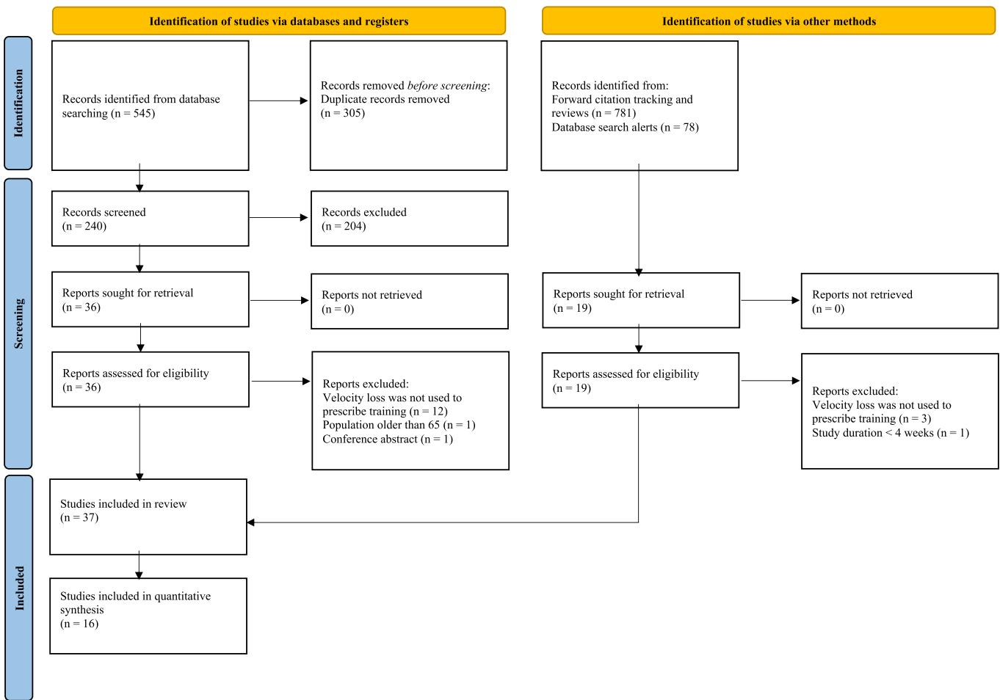  
Fig. 1 Literature search fow chart. n number of studies

## 3.3 Risk of Bias Assessment

Only three studies [64, 66, 69] provided sufcient information regarding the method of randomization and were therefore at a low risk of an order efect bias. The remaining studies were classifed as an unclear risk as they did not provide suffcient information regarding the method of randomization.

No studies provided information regarding allocation concealment. One study [65] was at a high risk of attrition bias, excluding randomized participants (or their data) from the analysis without sufcient reason. Six studies [16, 20, 21, 43, 62, 70] did not provide sufcient information on the number of participants assessed and included in the analysis after reporting that some of them did not complete the entire intervention or all procedures and hence, had an unclear risk of attrition bias. No studies pre-registered their protocols on a publicly available registry platform, thus it was unclear whether selective reporting bias was present. Two studies [65, 67] had an unclear risk of efort bias as they did not provide information regarding the instructions to perform the concentric actions as fast as possible. The remaining studies had a low risk of efort bias as the instruction to perform concentric actions as fast as possible was given. Ten studies [63–66, 68, 70–74] did not provide any information on the provision of velocity feedback and hence, had an unclear risk of feedback bias. The rest of the studies either provided feedback to all groups or standardized the conditions between groups by not providing any feedback. Seven studies [28, 29, 66, 67, 74–76] were at a high risk of training prescription bias because the participants performed other forms of training (additional non-standardized RT, endurance training, or playing sports), or because not all exercises used VL thresholds, but rather a combination of training prescriptions. Two studies [64, 65] used a linear encoder that was not, to our knowledge, validated in the peer-reviewed literature whereas all other studies used valid and reliable methods, equipment, or instruments to evaluate their outcomes of interest. Fourteen studies [18, 25, 26, 42–45, 60, 61, 70, 73, 77–79] were at a high risk of bias for not having a familiarization session. Four studies [69, 75, 76, 80] did not provide sufcient information regarding their familiarization sessions and hence, had an unclear risk of bias The rest of the studies provided sufcient information about familiarization session procedures or specifcally stated that all participants were accustomed to the study protocols (i.e., performed them in the past). The risk of bias assessment is also illustrated in Fig. 2.

<table><tr><td>Study</td><td>Study design</td><td>Participants</td><td></td><td></td><td></td><td></td><td>Sex: M/F Age (years) Height (cm) Mass (kg) Training experience (subjective descrip- tion; years of RT experience; relative</td></tr><tr><td>Alcazar et al. (2021) [60]</td><td>Chronic: randomly assigned</td><td>VL0: n=14 VL10: n= 14 VL20: n= 13</td><td>58/0</td><td>24±4</td><td>175±6</td><td>76 ± 10</td><td>strength levels BM/1RM; exercise) Resistance trained individuals; 1.54; 1.3 ± 0.2; Smith machine full back-</td></tr><tr><td>Andersen et al. (2021) [29]</td><td>Chronic: randomly assigned</td><td>VL40: n = 16 VL15: n=10</td><td>3/7</td><td>23±4</td><td>171±8</td><td>68 ± 9</td><td>squat Healthy individuals; 4.5 ± 0.7; 1.2 ± 0.2;</td></tr><tr><td>Banyard et al. (2019) [77]</td><td>Acute: randomized crossover design</td><td>VL30: n=10 VL20fs: n = 15</td><td>15/0</td><td>25±4</td><td>180 ±7</td><td>84±11</td><td>leg press Resistance trained individuals; 7 ± 2;</td></tr><tr><td>Dorrel et al. (2020) [75]</td><td>Chronic: randomly assigned</td><td>VL20s: n = 15 VL20: n=8</td><td>38/0</td><td>23±5</td><td>180±6</td><td>89 ± 13</td><td>1.8 ±0.3; free-weight full back-squat Resistance-trained individuals; ≥ 2; 1.5 ±0.3, 1.1 ± 0.2, 0.7 ±0.1, and 2.0 ±0.3, free-weight perceived opti- mum depth back-squat, free-weight bench press, free-weight strict overhead</td></tr><tr><td>Fernandez-Ortega et al. (2020) [67] Chronic: randomly assigned</td><td></td><td>VG: n= 15</td><td>0/15</td><td>14±1</td><td>157±7</td><td>47±5</td><td>press, and free-weight deadlift, respec- tively Adolescent soccer players; unexperi- enced; 0.7 ±0.1; Smith machine full</td></tr><tr><td>Galiano et al. (2020) [78]</td><td>Chronic: randomly assigned</td><td>VL5: n=15 VL20: n = 13</td><td>28/0</td><td>22 ±3 24±3</td><td>175±5 177±5</td><td>73 ±11 6±9</td><td>back-squat Physically active individuals; ≥ 1.5; 1.3 ±0.2; Smith machine full back-</td></tr><tr><td>García-Sillero et al. (2021) [69]</td><td>Acute: randomized controlled pilot</td><td>VL30: n = 12 VL30 = 12b</td><td>24/0</td><td>24±1</td><td>180±6</td><td>78 ±8</td><td>squat Physically active sports science stu dents; &gt; 2; 1.0 ±0.2; free weight bench</td></tr><tr><td>González-García et al. (2020) [63]</td><td>Acute: randomized crossover design</td><td>VL20L: n= 11</td><td>10/1</td><td>25±4</td><td>176±8</td><td>77 ±9</td><td>press Unclear; unclear; 1.8 ±0.3; Smith machine full back-squat</td></tr><tr><td>Held et al. (2021) [66]</td><td>Chronic: randomly assigned</td><td>VL20%RM: n=11 VL10: n=11</td><td>9/2a</td><td>20 ± 2</td><td>184±5</td><td>76±9</td><td>Highly trained rowers; ≥ 2; 1.7 ±0.2, 2.2 ± 0.4, 1.5 ±0.2 and 1.3 ±0.2; free- weight back-squat, free-weight bench row, free-weight deadlift, and free-</td></tr><tr><td>Krzysztofik et al. (2021) [68]</td><td>Acute: randomized crossover design</td><td>VL10: n=16</td><td>0/16</td><td>24±5</td><td>170±6</td><td>64±5</td><td>weight bench press, respectively Resistance-trained amateur female volleyball players; 3 ± 4; 1.5 ±0.2; free-</td></tr><tr><td>Martinez-Canton et al. (2020) [61] Chronic: randomly assigned</td><td></td><td>VL20: n= 12 VL40: n=10</td><td>22/0</td><td>23 ±2</td><td>176±6</td><td>76±7</td><td>weight back-squat Physically active sports science students; 1.5 ± 4; 1.4 ±0.2; Smith machine full</td></tr><tr><td>Muñoz-López et al. (2021) [80]</td><td>Acute: randomized crossover design</td><td>VL20: n=30 VL40: n =30</td><td>30/0</td><td>22±2</td><td>176±7</td><td>74±11</td><td>back-squat Healthy individuals; unclear; 1.5 ±0.2; Smith machine full back-squat</td></tr><tr><td>Study</td><td>Study design</td><td>Participants</td><td></td><td></td><td></td><td></td><td>SexM/ Age (years)Height (cm) Mass (kg) Training experience (subjective descrip- tion; years of RT experience; relative strength levels BM/1RM; exercise)</td></tr><tr><td>Nájera-Ferrer et al. (2021) [94]</td><td>Acute: randomized crossover design</td><td>VL20: n = 16 VL40: n =16</td><td>16/0</td><td>36 ± 10</td><td>176±7</td><td>77±8</td><td>Resistance- and endurance-trained indi- viduals; 25; 1.4 ±0.3; Smith machine full back-squat</td></tr><tr><td>Nilo Dos Santos et al. (2021) [70]</td><td>Acute: randomized crossover design</td><td>VL20: n= 12</td><td>0/12</td><td>25±5</td><td>163±6</td><td>59±11</td><td>Young women; 4.5 ± 4.2; 10RM=46.2 ± 13.8; Smith machine parallel back-squat</td></tr><tr><td>Pareja-Blanco et al. (2017) [18]</td><td>Chronic: randomly assigned</td><td>VL20: n=12 VL40: n =10</td><td>22/0</td><td>23±2</td><td>176±6</td><td>76±7</td><td>Physically active sports science students; 1.5 ± 4; 1.4 ± 0.2; Smith machine full back-squat</td></tr><tr><td>Pareja-Blanco et al. (2017) [76]</td><td>Chronic: randomly assigned</td><td>VL15: n=8 VL30: n=8</td><td>16/0</td><td>24±4</td><td>174±7</td><td>76±9</td><td>Professional soccer players; unclear; 1.3 ±0.3; Smith machine full back- squat</td></tr><tr><td>Pareja-Blanco et al. (2019) [22]</td><td>Acute: randomized crossover design</td><td>VL2060%RM: n = 17 VL4060%RM: n= 17 VL20%R: n=17</td><td>17/0</td><td>24±4</td><td>180 ± 10</td><td>76±11</td><td>Physically active sports science students; 3 ± 1.5; 1.4 ±0.2; Smith machine full back-squat</td></tr><tr><td>Pareja-Blanco et al. (2020) [25]</td><td>Chronic: randomly assigned</td><td>VL40%RM: n = 17 VL0: n= 15 VL15: n=16 VL25: n=15</td><td>62/0</td><td>24±4</td><td>175±6</td><td>76 ± 10</td><td>Resistance trained individuals; ≥ 1.5; 0.9 ± 0.2; Smith machine bench press</td></tr><tr><td>Pareja-Blanco et al. (2020) [26]</td><td>Chronic: randomly assigned</td><td>VL50: n= 16 VL0: n=14 VL10: n= 14 VL20: n = 13</td><td>55/0</td><td>24±4</td><td>175±6</td><td>76 ± 10</td><td>Resistance trained individuals; 1.5 ±4; 0.9 ±0.2; Smith machine full back- squat</td></tr><tr><td>Pearson et al. (2020) [81]</td><td>Acute: counterbalanced crossover design</td><td>VL40: n=14 VL10: n =12 VL20: n = 12 VL30: n= 12</td><td>12/0</td><td>23±2</td><td>180±7</td><td>89± 13</td><td>Semi-professional rugby union ath- letes; ≥2; unclear; free-weight parallel back-squat</td></tr><tr><td>Pérez-Castilla et al. (2018) [28]</td><td>Chronic: randomly assigned</td><td>VL10: n =10 VL20: n= 10</td><td>20/0</td><td>22 ±3 22 ±2</td><td>175±6 177±6</td><td>74±17 80 ± 15</td><td>Physically active sports science stu- dents; ≥ 2; 2.1 ± 0.4; Smith machine countermovement jump</td></tr><tr><td>Riscart-López et al. (2021) [42]</td><td>Chronic: randomly assigned</td><td>VL20p: n = 11 VL20Up: n= 10 VL20Rp: =11</td><td>43/0</td><td>24±6 24 ±5 22 ±3</td><td>178±5 177±7 172±6</td><td>73±8 71±8 67±6</td><td>Physically active sports science students; 1.54; 1.3 ±0.3; Smith machine full back-squat</td></tr><tr><td>Rissanen et al. (2022) [74]</td><td>Chronic: reverse counterbalancing sequence</td><td>VL20Cp: n= 11 VL20M: n = 12 VL20: n=  11 VL40M: =11 VL40F: n= 11</td><td>23/22</td><td>23±5 26±4</td><td>180±4 184 ±8 167+7 178±6</td><td>75±9 82 ±8 61 ±5 82 ± 14</td><td>Physically active individuals; ≥ 1; 1.3 ± 0.3 and 0.8 ± 0.2; Smith machine full back-squat and Smith machine bench press</td></tr><tr><td>Study</td><td>Study design</td><td>Participants</td><td></td><td></td><td></td><td></td><td>Sex: M/F Age (years) Height (cm) Mass (kg) Training experience (subjective descrip- tion; years of RT experience; relative strength levels BM/1RM; exercise)</td></tr><tr><td>Rodiles-Guerrero et al. (2020) [27]</td><td>Chronic: randomly assigned</td><td>VL10: n=15 VL20: n = 15 VL30: n= 15</td><td>45/0</td><td>23±2</td><td>173±5</td><td>73±6</td><td>Physically active individuals; ≥ 1; 1.0 ± 0.2; weight stack machine bench press</td></tr><tr><td></td><td>Rodguez-Rosel et al. (2018) [16 Acute: randomized crossover deign</td><td>VL10sQ: n=11 VL20sQ: n=11 VL30sQ: n=11 VL45sQ =11 VL10  = 10 VL20 Bp: n= 10</td><td>21/0</td><td>24±4</td><td>178±4</td><td>78 ± 15</td><td>Physically active sports science students; 24; 1.5 ± 0.2 and 1.1 ±0.2; Smith machine full back-squat and Smith machine bench press</td></tr><tr><td></td><td>Rodgue-Rosel et al. (2020) [20 Acute: randomized crossover deign</td><td>VL45 Bp: n=10 VL10: n=11 VL20: n= 11 VL30: n=11</td><td>11/0</td><td>24±4</td><td>177±7</td><td>74 ±12</td><td>Physically active sports science students; 24; 1.5 ±0.2; Smith machine full back- squat</td></tr><tr><td>Rodríguez-Rosell et al. (2020) [43] Chronic: randomly assigned</td><td></td><td>VL45: n=11 VL10: n = 12 VL30: n = 13</td><td>25/0</td><td>23±3 22± 3</td><td>177±8 176±7</td><td>75 ± 10 4 ±9</td><td>Physically active sports science students; 13; 1.3 ±0.3; Smith machine full back- squat</td></tr><tr><td></td><td>Rodríguez-Rosell et al. (2021) [44] Chronic: randomly assigned</td><td>VL10: n= 12 VL30: n = 12 VL45: n=12</td><td>36/0</td><td>23±4 22 $ 22 ±3</td><td>176±4 177 ±7 172±8</td><td>71±5 74±9 2± 10</td><td>Physically active sports science students; 13; 1.3 ±0.2; Smith machine full back- squat</td></tr><tr><td></td><td>Rodríguez-Rosell et al. (2021) [45] Chronic: randomly assigned</td><td>VL15Lp: n = 16 VL15Up: =16</td><td>32/0</td><td>24±4 22 ±3</td><td>176±6 178±7</td><td>76±9 76±8</td><td>Healthy and physically active sports science students; 13; 1.3 ±0.3; Smith machine full back-squat</td></tr><tr><td>Sánchez-Moreno et al. (2020) [79]</td><td>Chronic: randomly assigned</td><td>VL25: n=15 VL50: n = 14</td><td>29/0</td><td>27±6 25±6</td><td>176±6 176±5</td><td>74±5 74±8</td><td>Strength-trained individuals; 24; 0.5 ±0.1; prone-grip pull-up exercise</td></tr><tr><td>Sousa-Fortes et al. (2020) [64]</td><td>Acute: randomiszd crossover design</td><td>VL20: n= 12</td><td>7/5</td><td>25±5</td><td>169±8</td><td>74 ± 18</td><td>Trained individuals; ~3; 1.3 and 1.1; free-weight half-squat and free-weight bench press</td></tr><tr><td>Tsoukos et al. (2019) [71]</td><td>Acute: randomized crossover design</td><td>VL10; n = 10 VL30; n = 10</td><td>10/0</td><td>26±7</td><td>182±5</td><td>85 ± 13</td><td>Physically active individuals; ≥ 3; 1.3 ±0.2; Smith machine bench press</td></tr><tr><td>Tsoukos et al. (2021) [72]</td><td>Acute: randomized crossover design</td><td>VL10: n=11 VL30: n=11</td><td>11/0</td><td>26±6</td><td>183±5</td><td>85 ±13</td><td>Resistance trained individuals; ≥ 3; 1.3 ±0.2; Smith machine bench press</td></tr><tr><td>Varela-Olalla et al. (2019) [65]</td><td>Acute: unclear</td><td>VL2032; n= 5</td><td>4/1</td><td>23±5</td><td>169±7</td><td>72 ± 18</td><td>Spanish Olympic wrestlers; ≥ 1; 1.5 ± 0.5; free-weight bench press</td></tr><tr><td>Varela-Olalla et al. (2020) [73]</td><td>Acute: observational</td><td>VL20; n = 15</td><td>15/0</td><td>23 ±2</td><td>175±6</td><td>73±8</td><td>Recreationally active individuals; unclear; 0.7 ±0.1; Smith machine half back-squat</td></tr></table>

<table><tr><td>Table 1 (continued) Study</td><td>Study design</td><td>Participants</td><td></td><td></td><td></td><td></td><td>Sex:M/F Age (years) Height (cmMass (kg) Training experience (subjective descrip- tion; years of RT experience; relative</td></tr><tr><td>Weakley et al. (2020) [21]</td><td>Acute: randomized crossover design</td><td>VL10; n = 12 VL20; n = 12 VL30; n= 12</td><td>12/0</td><td>23 ±3</td><td>179±6</td><td>87±12</td><td>strength levels BM/1RM; exercise) Team sport athletes from a British University and Colleges Super Rugby Club; ≥ 2; unclear; free weight back-</td></tr><tr><td>Weakley et al. (2020) [62]</td><td>Acute: randomized crossover design</td><td>VL10; n = 12 VL20; n = 12 VL30; n= 12</td><td>16/0</td><td>23 ±2</td><td>180 ± 7</td><td>89 ± 13</td><td>squat Team sport athletes from a British University and Colleges Super Rugby Club; ≥ 2; unclear; free weight back- squat</td></tr><tr><td colspan="8">BM body mass, n number of participants, RT resistance training, VG velocity training group, VL## whereby ## refers to the velocity loss threshold used (e.g., VL20 is 20% velocity loss thresh- old). Subscripts after VL# (e.g., VL2080%RM) refer to the following: BP protocol performed with the bench press exercise, CP constant programming model, F female, FS fixed number of sets, LP linear programming model, M male, OL optimal load that maximized power production, ##%RM whereby # refers to the percentage of repetition maximum, RP reverse programming model, SQ protocol performed with the back-squat exercise, UP undulating programming model, VS variable number of sets    </td></tr></table>

## 3.4 Acute Studies

The following variables were visualized: (1) the mean and standard deviation of the number of repetitions performed in the set; (2) changes in countermovement jump height performance; (3) velocity against the load that can be lifted at $1 \mathrm { m } { \cdot } \mathrm { s } ^ { - 1 }$ in a rested state (V1); and (4) blood lactate concentration after training sets or the entire session (Figs. 3, 4). In addition, to examine the discrepancy between the VL threshold prescribed and the actual VL experienced by the participants in each study, standard deviations of the actual VL experienced were visually represented using density plots (Fig.  3).

## 3.5 Longitudinal Studies

For all multilevel models, signifcant moderators and sensitivity analyses are described in the text, whereas their output is presented in Table 4 and visualized in Figs. 5, 6 and 7. For the multivariate model, all information is described in the text, and model estimates are visualized in Fig. 6b. Dose–response relationships, as quantifed by efect sizes, between VL and outcomes of interest are also illustrated in Figs. 5, 6 and 7.

## 3.5.1 Muscle Strength

The fnal multilevel model investigating the efects of diferent VL thresholds on maximal strength gains revealed exercise, strength levels, and study duration to be signifcant moderators (Table 4; Fig. 5a). Two individual groups from two different studies were identifed as infuential. Excluding these infuential groups from the analysis afected the interpretation of the model, with exercise $( b { = } { - } 0 . 1 6 3 \ [ { - } 0 . 4 1 6 , 0 . 0 9 4 ]$ ; $p { = } 0 . 2 0 6 )$ and strength levels $( b = - 0 . 1 8 1 [ - 0 . 6 5 5 , 0 . 2 9 3 ]$ $\scriptstyle p = 0 . 4 4 4 )$ no longer being signifcant moderators.

<table><tr><td>Study</td><td>of sets; load; inter-set rest</td><td>Velocity loss threshold used; number Exercises; load prescription method</td><td>Velocity variable; reference repeti- tion for velocity loss calculation; number of repetitions performed below the threshold before termina-</td><td>Outcomes (methods of assessment)</td></tr><tr><td>Banyard et al. (2019) [77]</td><td>20%; 4.2 ±0.9 (until reaching a total of 25 reps); 80%1RM; 2</td><td>Free-weight full back-squat; 1RM percentage based</td><td>Mean velocity; velocity of the single repetition performed at 80%1RM in the warm-up; 1</td><td>Mean velocity (4 linear position transducers); average number of repetitions per set</td></tr><tr><td>García-Sillero et al. (2021) [69]</td><td>30%; 4; 70%1RM; 3 30%; 4; 70%1RM; 3</td><td>Free-weight bench press; 1RM percentage based</td><td>Mean velocity; fastest repetition; 1</td><td>Mean velocity (linear position trans- ducer); average number of repeti- tions per set</td></tr><tr><td>González-García et al. (2020) [63]</td><td>20%; 2; optimal load (60.9 ±5.9%1RM); unclear 20%; 2; 80%1RM; unclear</td><td>Smith machine half back-squat; 1RM Mean velocity; fastest repetition; 1 percentage based</td><td></td><td>Mean velocity (rotatory encoder); CMJ height (force platform); RPE (Borg CR-10 Scale); average number</td></tr><tr><td>Muñoz-López et al. (2021) [80]</td><td>20%; 3; 63.3±2.1% 1RM; 5 40%; 3; 63.3±2.1% 1RM; 5</td><td>Smith machine full back-squat; generalized load-velocity relation- ship based</td><td>Mean propulsive velocity; fastest repetition obtained in the first 3</td><td>of repetitions per set Mean propulsive velocity (linear encoder); average number of repeti- tions per set</td></tr><tr><td>Nájera-Ferrer et al. (2021) [94]</td><td>20%; 3; 60%1RM; 2a 40%; 3; 60%1RM; 2a 20%; 3; 60%1RM; 2b 40%; 3; 60%1RM; 2b</td><td>Smith machine deep back-squat; 1RM-percentage based</td><td>repetitions; 1 Mean propulsive velocity; fastest repetition; 1</td><td>Mean propulsive velocity, mean pro- pulsive velocity attained against the alu a e 100 (linear velocity transducer); blood lactate concentration (portable lac- tate analyser); CMJ height (infrared</td></tr><tr><td>Nilo Dos Santos et al. (2021) [70]</td><td>20% (32 ±7%); 4; 10RM; 2</td><td>Smith machine parallel back-squat; 1RM-percentage based</td><td>Mean propulsive velocity; fastest repetition obtained in the first 3 repetitions; 1</td><td>repetitions per set Mean propulsive velocity (linear velocity transducer); average number of repetitions per set; RPE (OMNI-RES effort scale); rating of discomfort (Borg CR-10 scale)</td></tr><tr><td>Pareja-Blanco et al. (2019) [22]</td><td>20%; 3; 60%1RM; 4 40%; 3; 60%1RM; 4 20%; 3; 80%1RM; 4 40%; 3; 80%1RM; 4</td><td>Smith machine full back-squat; generalized loa-velocity reation- ship based</td><td>Mean propulsive velocity; fastest repetition; 1</td><td>Mean propulsive velocity, percent change in velocity loss against the load that elicited a 1 m·s−1 (linear velocity transducer); percent change in CMJ height loss (infrared timing system); percent change in running sprint time loss (photocells); average number of repetitions performed</td></tr><tr><td>Pearson et al. (2020) [81]</td><td>10%; 5; ~ 70%1RM; 3 20%; 5; ~ 70%1RM; 3 30%; 5; ~ 70%1RM; 3</td><td>Free-weight parallel back-squat; generalized load-velocity relation- ship based</td><td>Mean velocity; velocity reference of 0.70 m·s-1; 1</td><td>during the 3 sets Mean velocity (linear position trans- ducer); average number of repeti- tions per set</td></tr><tr><td>Study</td><td>of sets; load; inter-set rest</td><td>Velocity loss threshold used; number Exercises; load prescription method</td><td>Velocity variable; reference repeti- tion for velocity loss calculation;</td><td>Outcomes (methods of assessment)</td></tr><tr><td>Rodríguez-Rosell et al. (2018) [16] 10%; 3; 50%1RM; 4</td><td>10%; 3; 60%1RM; 4</td><td>Smith machine full back-squat; generalize loavelociyeation-</td><td>number of repetitions performed below the threshold before termina- tion of the set Mean propulsive velocity; fastest repetition; 1</td><td>Mean propulsive velocity, percent change in velocity loss against the load that elicited a 1 m·s−1 (linear</td></tr><tr><td></td><td>10%; 3; 80%1RM; 4 20%; 3; 50%1RM; 4 20%; 3; 60%1RM; 4 20%; 3; 70%1RM; 4 20%; 3; 80%1RM; 4 30%; 3; 50%1RM; 4 30%; 3; 60%1RM; 4 30%; 3; 70%1RM; 4 30%; 3; 80%1RM; 4 45%; 3; 50%1RM; 4 45%; 3; 60%1RM; 4 45%; 3; 70%1RM; 4 45%; 3; 80%1RM; 4 15%; 3; 50%1RM; 4 15%; 3; 60%1RM; 4 15%; 3; 70%1RM; 4</td><td>Smith machine bench press; general-</td><td></td><td>concentration (portable lactate ana- lyzer); average number of repetitions performed during the 3 sets</td></tr></table>

<table><tr><td>Study</td><td>of sets; load; inter-set rest</td><td>Velocity loss threshold used; number Exercises; load prescription method</td><td>Velocity variable; reference repeti- tion for velocity loss calculation; number of repetitions performed below the threshold before termina- tion of the set</td><td>Outcomes (methods of assessment)</td></tr><tr><td>Rodríguez-Rosell et al. (2020) [20]</td><td>10%; 3; 50%1RM; 4 10%; 3; 60%1RM; 4 10%; 3; 70%1RM; 4 10%; 3; 80%1RM; 4 20%; 3; 50%1RM; 4 20%; 3; 60%1RM; 4 20%; 3; 70%1RM; 4 20%; 3; 80%1RM; 4 30%; 3; 50%1RM; 4 30%; 3; 60%1RM; 4 30%; 3; 70%1RM; 4 30%; 3; 80%1RM; 4 45%; 3; 50%1RM; 4</td><td>Smith machine full back-squat; generalized load-velocity relation- ship based</td><td>Mean propulsive velocity; fastest repetition; 1</td><td>Mean propulsive velocity, percent change in velocity loss against the load that elicited a 1 m·s−1 (linear position transducer), blood lactate concentration (portable lactate ana- lyzer); percent change in CMJ height (infrared timing system)</td></tr><tr><td>Sousa-Fortes et al. (2020) [64]</td><td>45%; 3; 80%1RM; 4 20%, 5; 15RM; 3:20 min</td><td>Free-weight half back-squat and bench press; 1RM-percentage based</td><td>Mean velocity; unclear; 1</td><td>Mean velocity (linear position trans- ducer); average number of repeti- tions per set</td></tr><tr><td>Tsoukos et al. (2019) [71]</td><td>10%; 40%1RM; 1; 0 10%; 60%1RM; 1; 0 30%; 40%1RM; 1; 0 30%; 60%1RM; 1; 0</td><td>Smith machine bench press throw; 1RM percentage based</td><td>Mean velocity; fastest repetition; 1</td><td>Mean propulsive velocity (linear posi- tion transducer); average number of repetitions per set</td></tr><tr><td>Tsoukos et al. (2021) [72]</td><td>10%; 1; 80%1RM; 0 30%; 1; 80%1RM; 0</td><td>percentage based</td><td>Smith machine bench press; 1RM- Mean velocity; fastest repetition; 1</td><td>Mean velocity (linear position trans- ducer); average number of repeti- tions per set</td></tr><tr><td>Varela-Olalla et al. (2019) [65]</td><td>2027.3%; 1; 4045%1RM; 0 22.129.4%; 1; 5560%1RM; 0 20.731.1%; 1; 7075%1RM; 0</td><td>load-velocity relationship based</td><td>Free-weight bench press; generalized Mean velocity; fastest repetition; 2</td><td>Mean velocity (linear position transducer); average nm repetitions per set; RPE (OMNI- RES scale)</td></tr><tr><td>Varela-Olalla et al. (2020) [73]</td><td>20%; 1; ~ 85%1RM; 0</td><td>Smith machine half squat; general- ized load-velocity relationship based</td><td>Mean propulsive velocity; fastest repetition; 1</td><td>Mean propulsive velocity (linear position transducer); blood lactate concentration (portable lactate ana- lyser); CMJ height (smartphone app)</td></tr></table>

<table><tr><td>Study</td><td>Velocity loss threshold used; number Exercises; load prescription method of sets; load; inter-set rest</td><td></td><td>Velocity variable; reference repeti- tion for velocity loss calculation; number of repetitions performed below the threshold before termina- tion of the set</td><td>Outcomes (methods of assessment)</td></tr><tr><td>Weakley et al. (2020) [2]</td><td>10%; 5; ~ 70%1RM; 3 20%; 5; ~ 70%1RM; 3 30%; 5; ~ 70%1RM; 3</td><td>Free-weight parallel back-squat; al- ship based</td><td>Mean velocity; velocity reference of 0.70 m·s-1;1</td><td>Blood lactate concentration (portable lactate analyser); CMJ (force plate); average number of repetitions per set; differential-RPE of the lower peripheries and the breathlessness (verbal anchors on the CR100 scale)</td></tr><tr><td>Weakley et al. (2020) [62]</td><td>10%; 5; ~70%1RM; 3 20%; 5; ~ 70%1RM; 3 30%; 5; ~ 70%1RM; 3</td><td>Free-weight parallel back-squat; gen-Mean velocity; velocity reference of -based</td><td>0.70 m·s−1;1</td><td>Mean velocity (linear position trans- ducer); average number of repeti- tions per set</td></tr><tr><td colspan="7">1RM one-repetition maximum, CMJ countermovement jump, RPE rate of perceived effort aEndurance training followed by resistance training </td></tr><tr><td colspan="6">Note: only outcomes of interest were reported in this table; for a more extended version, see ESM</td></tr></table>

## 3.5.2 Muscle Hypertrophy

The fnal multilevel model investigating the efects of different VL thresholds on muscle hypertrophy revealed VL to be a signifcant moderator (Table 4; Fig. 5c). Two individual groups from two studies were identifed as infuential. Excluding these infuential groups from the analysis afected the interpretation of the model, with VL no longer being a signifcant moderator $( b = 0 . 0 0 5 [ - 0 . 0 0 2 , 0 . 0 1 3 ] ; p = 0 . 1 4 4 )$

## 3.5.3 Muscle Endurance

The fnal multilevel model investigating the efects of different VL thresholds on muscle endurance did not reveal VL to be a signifcant moderator (Table 4; Fig. 7a). Two individual groups from two diferent studies were identifed as infuential. However, the overall results were robust to their exclusion from the model as the interpretation of the model did not change.

## 3.5.4 Countermovement Jump Height

The fnal multilevel model investigating the efects of diferent VL thresholds on the countermovement jump revealed VL and study duration to be signifcant moderators (Table 4; Fig. 6a). Three individual groups from three diferent studies were identifed as infuential. However, the overall results were robust to their exclusion from the model as the interpretation of the model did not change. In fact, the confdence in the estimate for both VL $( b = - 0 . 0 4 8 \ [ - 0 . 0 7 3 , - 0 . 0 2 3 ] ;$ $p { = } 0 . 0 0 1 )$ and study duration $( b = 0 . 4 0 0 \ [ 0 . 1 0 5 , \ 0 . 6 9 5 ]$ $p { = } 0 . 0 1 0 )$ increased after their removal.

## 3.5.5 Sprint Time

The fnal multilevel model investigating the efects of different VL thresholds on sprint time revealed VL and study duration as signifcant moderators (Table 4; Fig. 6c). Three individual groups from three diferent studies were identifed as infuential. Excluding these infuential groups from the analysis afected the interpretation of the model, with study duration no longer being a signifcant moderator $( b = - 0 . 0 0 5$ [− 0.031, 0.021]; p = 0.696).

## 3.5.6 Velocity Against Submaximal (Low and Moderate) Loads

For the fnal multivariate model investigating the efects of diferent VL thresholds on velocity against low and moderate loads, seven groups from fve studies were identifed as infuential. Because of the high number of infuential groups, these were excluded, and estimates of the model without these infuential groups were retained (Fig. 7c). This model

<table><tr><td colspan="6"></td></tr><tr><td>Study</td><td>Training protocol (duration in Velocity loss threshold; num- weeks; sessions/w; exercise; loads)</td><td>ber of sets; inter-set rest</td><td>Velocity loss used for all exer- cises?</td><td>Adherence</td><td>Outcomes (methods of assessment) Comparisons between the</td><td>groups (outcomes)</td></tr><tr><td>Alcazar et al. (2021) [60]</td><td>8; 2; Smith machine full back-squat; from 70%1RM to 85%1RM</td><td>VL0; 3; 4 VL10; 3; 4 VL20; 3; 4 VL40; 3; 4</td><td>Yes</td><td>100%</td><td>, ,  x,  a  ( force plates synchronized with a linear velocity transducer)</td><td>VL0 = VL10 = VL20 = VL40 (L-0, L-v0, L-Pmax, L-, H-0, H-0, H-Pmax, and H-a/ F VL0 and VL10 &gt; VL40 (H-vo))</td></tr><tr><td></td><td>sion; 85%1RM (leg press) and 75%RM (leg extension)</td><td>6 (sessions 39) for the le press and 4 (sessions 15) and 6 (sessions 69) for leg extension; 2.5 VL30; 2 (sessions 12) and 3 (sessions 39) for the leg press and 2 (sessions 15) and 3 (sessions 69) for leg extension; 2.5</td><td></td><td></td><td>1RM, mean velocity attained at 30%1RM (MV 30%1RM), 45%1RM (MV 45%1RM), 60%1RM (MV60%1RM), 75%1RM (MV75%IRM), mean power attained at 0%RM (MPRM, 45%1RM (MP45%1RM), 60%1RM (MP60%1RM), 75%1RM (MRM)    obtained from the load-velocity relationship (linear encoder) MVC, RFD for the period between 20 and 80% of MVC (RFD2080%MVC) in addition to 50 ms (RFD50ms), 100 ms</td><td>VL15=VL30 (1RM, MV30%1RM, MV45%IRM, MV 60%RM, MV75%R, MP30%1RM, MP45%IRM, MP60%1RM, MP75% RM, L0, 0, MVC, RFD20-80%MVC RFD50ms, RFD100ms and RFD200m, VL, RF, PA, a FL)</td></tr><tr><td>Dorrell et al. (2020) [75]</td><td>6; 2; back squat, bench press, strict overhead press (only sessions 1, 3, 5, 7, 9, 11, and 12), and deadlift (only sessions 2, 4, 6, 8, 10, 11, and 12); from 70%1RM to 95%1RM</td><td>VL20 (below the target veloc- No ity of each specific zone); 3; unclear</td><td></td><td>100%</td><td>and RF (B-mode ultrasound) 1RM (linear position transducer) CMJ height (jump mat)</td><td>VL20: back squat 1RM (↑), bench press 1RM (↑) strict overhead press 1RM (↑), deadlift 1RM (↑), CMJ height (↑)</td></tr></table>

<table><tr><td rowspan="2">Study</td><td colspan="3">Training protocol (duration in Velocity loss threshold; num- Velocity loss</td><td rowspan="2">Adherence</td><td rowspan="2">Outcomes (methods of assessment) Comparisons between the</td><td rowspan="2">groups (outcomes)</td></tr><tr><td>weeks; sessions/w; exercise; loads)</td><td>ber of sets; inter-set rest</td><td>used for all exer- cises? Unclear</td></tr><tr><td>Fernandez-Ortega et al. (2020) [67]</td><td>12; 3; Smith machine full back-squat and cycle ergom- eter; 65%1RM (0.70 m·s−1) [squat] and 65% of the load appli ment (5.3% of body weight) [cycle ergometer]</td><td>VL20 (squat) RPML20 (cycle No ergometer); 4; 3</td><td></td><td></td><td>CMJ and SJ height (infrared timer system) T30 ine-light photocell system) 1RM Maximum power (absolute [ax- ni C velocity (-) on the cycloer- gometer (Wingate test) Maxial r ( </td><td>VL20: T0-30 (↑), 1RM (), CMJ height (↑), SJ height (), Pax-C (), Pmax-RC (), ma-C (), max-S (), max-S ()</td></tr><tr><td>Galiano et al. (2020) [78]</td><td>7; 2; Smith machine full back- VL5; 3; 3 sq50;∼ 1.14 ± 0.03 ms-1 (~50%1RM)</td><td>VL20; 3; 3</td><td>Yes</td><td>100%</td><td>transducer) 1RM, AV, and AV ≥ 1 (linear veloc- VL5= VL20 (1RM, AV, ity transducer) T0-20 (photocells) CMJ height infrared timing</td><td>AV ≥ 1, AV &lt; 1, T20, and CMJ height)</td></tr><tr><td>Held et al. (2021) [66]</td><td>8; 2; power clean, squat, bench row, deadlift, and bench press; 80%1RM</td><td>VL10; 4; 23</td><td>No</td><td>~94%</td><td>system) 1RM</td><td>VL10: squat 1RM (↑), bench row 1RM (↑), deadlift 1RM (), bench press 1RM (↑), and 1RMtotal (↑)</td></tr><tr><td>Martinez-Canton et al. (2020) [61]</td><td>8; 2; Smith machine full back-squat; from 0.82 m·s−1 (~ 70%1RM) to 0.60 ms-1 (~85%1RM)</td><td>VL20; 3; 4 VL40 (from VL20 to VL50); 3; 4</td><td>Yes</td><td>100%</td><td>Fatigue test (as many repetitions as possible against 60%1RM load until the velocity felt below 0.50 m·s1), FT-MNR, and FT-AV (linear velocity trans- ducer)</td><td></td></tr><tr><td>(2017) [18]</td><td>8; 2; Smith machine full back-squat; from 0.82 m·s1 (~ 70%1RM) to 0.60 m·s-1 (~85%1RM)</td><td>VL20; 3; 4 VL40 (from 20 to 50%); 3; 4</td><td></td><td></td><td>1RM, AV, AV&gt; 1, and AV &lt; 1 (linear velocity transducer) 0-20 (photocells) CMJ height (infrared timing system) Muscle volume of QF, RF, VM and VL+VI (1.5-T scanner) Muscle CSA (1.5-T scanner) Fiber CSA, CSA-I, CSA-IIA, CSA-IIAX, and CSA-IIX (muscle</td><td>VL20= VL40 (1RM, AV &lt; 1, T20, QF, RF, and VM) VL20 &gt; VL40 (AV, AV &gt; 1, CMJ height, CSA, CSA-I, CSA-IIA, CSA-IIAX, and CSA-IIX) VL40 &gt; VL20 (VL, VI)</td></tr><tr><td>Study</td><td>weeks; sessions/w; exercise; loads)</td><td>Training protocol (duration in Velocity loss threshold; num- ber of sets; inter-set rest</td><td>Velocity loss used for all exer- cises?</td><td>Adherence</td><td>Outcomes (methods of assessment) Comparisons between the</td><td>groups (outcomes)</td></tr><tr><td>(2017)</td><td>Pareja-Blanco et al. [76] 6; 3; Smith machine full back- squat; from ~ 1.13 m·s-1 (~ 50%1RM) to ~0.82 m·s-1 (~70%1RM)</td><td>VL15; 2 (sessions 1, 4, 7, 11, No 15, and 18) or 3 (sessions 2, 3, 4, 6, 8, 9, 10, 12, 13, 14, 16, and 17); 4 VL30; 2 (sessions 1, 4, 7, 11, 15, and 18) or 3 (sessions 2,</td><td></td><td>85%</td><td>1RM and AV (linear velocity transducer) YIT 0-30 (photocells) CMJ height (infrared timing</td><td>VL15=VL30 (1RM, AV, YIRT, and T0-30) VL15 &gt; VL30 (CMJ height)</td></tr><tr><td>(2020) [25]</td><td>8; 2; Smith machine bench press; from 0.65 ± 0.07 m.s-1 (70%1RM) to 0.41 ± 0.05 m·s-1 (85%1RM)</td><td>VL0; 3; 4 VL15; 3; 4 VL25; 3; 4 VL50; 3; 4</td><td></td><td></td><td>MIF, RFDmax, slope of the force—time curve obtained over 50 ms (RFD050), 100 ms (RFD0100), 150 ms (RFD0-150), 200 ms (RFD0200), and 400 ms (RFD0400)—(dynamometric platform) 1RM, v0 (bar weight &lt;0.2 kg), AV, AV &gt;0.8, and AV &lt;0.8 (linear velocity transducer) Fatigue test (as many repetitions as possible against 70%1RM load until the muscle failure), FT- MNR, and FT-AV (linear velocity</td><td>VL0 = VL15 = VL25 = VL50 (MIF, RFDmax, RFD0-50, RFD0-100, RFD0-150, RD20, RFD40, 1RM, AV, AV &gt; 0.8, AV &lt; 0.8, FT-MNR, FT-AV, and PM) VL50 &gt; VL0 (PM)</td></tr><tr><td>(2020) [26]</td><td>8; 2; Smith machine full back-squat; from 70%1RM to 85%1RM</td><td>VL0; 3; 4 VL10; 3; 4 VL20; 3; 4 VL40; 3; 4</td><td></td><td></td><td>sonography) , 10-20, an 020 (photocells) CMJ height (infrared timing system) MVIC, RFDmax, RFD050, RFD, and RF ynmo- metric platform) 1RM, AV, AV&gt; 1, and AV &lt; 1 (linear velocity transducer) Fatigue test (as many repetitions as possible against 70%1RM load until the velocity fell below 0.5 m·s-1), and FT-MNR (linear velocity transducer)</td><td>VL0 = VL10 = VL20 = VL40 1, 10-20, -20, CMJ, MVIC, RFDmax, RFD050 R 00, FD0, 1RM, AV, AV &gt; 1, AV &lt; 1, FT- MNR, CSA, PA, and FL) VL0 &gt; VL10</td></tr><tr><td colspan="6">Table 3 (continued)</td></tr><tr><td>Study</td><td>Training protocol (duration in Velocity loss threshold; num- weeks; sessions/w; exercise; loads)</td><td>ber of sets; inter-set rest</td><td>Velocity loss used for all exer- cises?</td><td>Adherence</td><td>Outcomes (methods of assessment)</td><td>Comparisons between the groups (outcomes)</td></tr><tr><td>Pérez-Castilla et al. (2018) [28]</td><td>4; 2; Smith machine counter- movement jump; 1.20 m·s-1 (~40%1RM)</td><td>VL10; the number of sets was No extended until completing 36 repetitions; 4 VL20; the number of sets was extended until completing</td><td></td><td>100%</td><td>CMJ hegh, , , ax, and (infrared platform) 1RM, MPV attained at 20 (MPV20), 40 (MPV40), 60 (MPV6), and 80 (MPV80) kg T0-15 (photocells)</td><td>VL10= VL20 (Fo, 0, a, Pmax, 1RM, MPV0, MPV40, MPV60, MPV80, CMJ height, and 0-15)</td></tr><tr><td>Riscart-López et al. (2021) [42]</td><td>8; 2; Smith machine full back- VL20; 3; 4 squat; from 50%1RM to 85%1RM with increments of 5%1RM every 2 sessions (LP), from 85%1RM to 50%1RM with decreases of 5%1RM every 2 sessions (RP), from 50%1RM to 85% 1RM with changes in</td><td></td><td>Yes</td><td></td><td>1RM, AV, AV&gt; 1, and AV &lt; 1 (linear velocity transducer) T0-20 (photocells) CMJ height (infrared timing system)</td><td>LP=RP=UP=CP (1RM, AV, AV&gt; 1, AV&gt; 1, T0-20, and CMJ height)</td></tr><tr><td></td><td>squat and Smith machine bench press; from 65%1RM to 75%1RM</td><td>8; 2; Smith machine full back- VL20 male; 2 (session 1), 3 sessions 236711), 4 (sessions 481213) and 5 (sessions 59101415); 3 VL20 female; 2 (session 1), 3 (sessions 23-67-11), 4 (sessions 481213) and 5 (sessions 59101415); 3 VL40 male; 2 (session 1), 3 sessions 23-67-11), 4 (sessions 48-1213) and 5 (sessions 59-1014-15); 3 VL40 female; 2 (session 1), 3 sessions 236711), 4</td><td></td><td>male; 98 ± 3% VL20 female; 95 ± 6% VL40 male; 97±5% VL40</td><td>(&lt; 70%1RM) and "high" MPV values (&gt; 70%1RM) [linear veloc- ity transducer] CMJ height (force platform) Muscle CSA of vastus lateralis (B-mode ultrasound)</td><td>VL20 male = VL20 female = VL40 male = VL40 female (Smith machine full back-squat and bench press 1RM, Smith machine full back-squat and bench press "Iow" and "high" MPV values, CMJ height, vastus lateralis CSA)</td></tr><tr><td>Rodiles-Guerrero et al. (2020) [27]</td><td>bench press; from 0.67 m·s−1 (~65%1RM) to 0.39 m·s-1 (~85%1RM)</td><td>VL30; 4; 3 VL50; 4; 3</td><td>Yes</td><td>Unclear</td><td>1RM, AV, AV ≥ 0.8, and AV &lt;0.8 (linear velocity transducer)</td><td>VL10 = VL30 = VL50 (1RM, AV, AV ≥ 0.8, and AV &lt;0.8)</td></tr></table>

<table><tr><td>Study</td><td>Training protocol (duration in Velocity loss threshold; num- weeks; sessions/w; exercise;</td><td>ber of sets; inter-set rest</td><td>Velocity loss used for all exer- cises?</td><td>Adherence</td><td>Outcomes (methods of assessment)</td><td>Comparisons between the groups (outcomes)</td></tr><tr><td>Rodríguez-Rosell et al. (2020) [43]</td><td>8; 2; Smith machine full back- VL10; 3; 4 squat; from ~ 0.84 m·s−1 (~70%1RM) to ~0.60 m·s−1 (~85%1RM)</td><td>VL30; 3; 4</td><td>Yes</td><td>100%</td><td>1RM, AV, AV &gt; 1, AV &lt; 1, MPV attained against 30 kg (MPV30), MPV40, 50 kg (MPV50), MPV60, 70 kg (MPV70), and MPV80 (lin- ear velocity transducer) -0 and 0-20 (photocells) VL10 &gt; VL30 (T0-10, and CMJ height (infrared timing system)</td><td>VL10 = VL30 (1RM, AV, AV&gt;1,AV&lt; 1;MPV30, MPV40, MPV50, MPV60. MPV70, MPV80, CMJ height, and FT-MNR)</td></tr><tr><td>Rodríguez-Rosell et al. (2021) [45]</td><td>8; 2; Smith machine full back- VL15; 3; 4 squat; from~ 1.16 m·s-1 (~ 50%1RM) to ~ 0.68 m·s−1 (~80%1RM) using LP and UP</td><td></td><td></td><td>100%</td><td>1RM, AV, AV&gt; 1, and AV &lt; 1 (linear velocity transducer) CMJ height (infrared timing system) Fatigue test (as many repetitions as possible against~ 1.16 ms1 (~60%1RM) load until the MPV</td><td>LP&gt;UP (1RM, AV, AV&gt; 1, AV &lt; 1, and FT-MNR) LP= UP (CMJ height)</td></tr><tr><td>(2021) [44]</td><td>Rodríguez-Rosell et al. squat; from ~ 1.08 m·s-1 (~ 55%1RM) to ~ 0.84 ms-1 (~70%1RM)</td><td>8; 2; Smith machine full back- VL10; 3; 4 VL30 (from VL20 to VL30); 3; 4 VL45 (from VL20 to VL45); 3; 4</td><td></td><td></td><td>1RM, AV, AV&gt; 1, AV&lt; 1, MPV30, MPV,MPV5MPV, MPV60 and MPV80 (linear velocity transducer) 0−10 and 020 (photocells timing gates) CMJ height (infrared timing system) Fatigue test (as many repetitions</td><td>VL10 &gt; VL30 and VL45 (CMJ height, AV, and AV&gt;1) VL30 = VL45 (CMJ height, AV, and AV&gt; 1) VL10= VL45 =VL30(T-10, T0-20, 1RM, AV &lt; 1, MPV30, MPV40, MPV50, MPV60, MPV70, MPV80, and FT-</td></tr><tr><td>Sánchez-Moreno et al. (2020) [79]</td><td>8; 2; prone-grip pull-up; body VL25; 2 (sessions 13 and mass</td><td>16), 3 (sessions 48 and 15) or 4 (sessions 914); 3 VL50; 2 (sessions 13 and 16), 3 (sessions 48 and 15) or 4 (sessions 914); 3</td><td>Yes</td><td>95%</td><td>MNR (linear velocity transducer) 1RM, AV, and MPVbest (linear velocity transducer) Fatigue test to failure, FT-MNR and VL25 = VL50 (FT-MNR) FT-AV (linear velocity trans- ducer)</td><td>VL25 &gt; VL50 (1RM, AV, and MPVbest, and FT-AV)</td></tr></table>

Note: only outcomes of interest were reported in this table; for a more extended version, see ESM ies represents pre-post changes and ↑ refects a>moderate efect size. Held et al. [66], Fernandez Ortega et al. [67], and Dorrell et al. [75] evaluated only one VL threshold. Therefore, group diferences column for these stud no signifcant change, and ↓ a decrease in performance. Andersen et al. [29] did not provide statistical inferences for pre-post changes per group. Therefore, ⟷ refects a<moderate efect size VL+VI vastus lateralis and vastus intermedius, VM vastus medialis, YIRT total distance covered in the Yo-Yo Intermittent Recovery Test level 1, ↑ refects an improvement in performance, ⟷ 15-sprint time, UP undulating programming, v0 maximal velocity, VL vastus lateralis, VL## whereby ## refers to the velocity loss threshold used (e.g., VL20 is a 20% velocity loss threshold), ris, RFDmax maximal rate of force development, RIR reps in reserve, RP reverse programming, T0–10 10-sprint time, T0–20 20-sprint time, T0–30 30-sprint time, T10–20 time to cover 10–20 m, T0–15 the fastest MPV attained without additional weight, MVC maximal voluntary contraction, PA pennation angle, PM pectoralis major, Pmax maximal force, QF quadriceps femoris, RF rectus femo fatigue test, FT-MNR maximum number of repetitions during the fatigue test, L0 maximal load, LP linear programming, MIF maximal isometric force, MPV mean propulsive velocity, MPVbest than 1 m·s−1, CP constant programming, CSA cross-sectional area, F0 maximal force, FL fascicle length, FT-AV average velocity attained against the same number of repetitions during the slower than 0.8 m·s−1, AV≥1 average velocity attained for absolute loads moved at velocities equal to or faster than 1 m·s−1, AV<1 the average velocity attained for absolute loads moved slower pre-test and post-test, AV>0.8 average velocity attained against absolute loads that were lifted faster than 0.8 m·s−1, AV<0.8 average velocity attained against absolute loads that were lifted 1RM
 one-repetition maximum, a slope of the force–velocity relationship, a/F0, curvature of the force–velocity relationship, AV average velocity attained against all absolute loads common to

revealed VL $( b = - 0 . 0 1 8 \ [ - 0 . 0 2 9 , - 0 . 0 0 6 ] ; \ t = - 3 . 6 9 ;$ $p { = } 0 . 0 1 0 )$ and load $( b = 1 . 1 8 2 \ [ 0 . 3 4 2 , \ 2 . 0 2 2 ] ; \ t = 3 . 1 2 ;$ $p { = } 0 . 0 1 1 )$ ) as signifcant moderators (note that low load was a reference outcome). The interaction between the VL and outcome was not signifcant $( b = 0 . 0 1 4 \ [ - 0 . 0 0 7 , 0 . 0 3 5 ]$ ; $t = 1 . 7 3 ; p = 0 . 1 4 6 )$ . Heterogeneity for the low load outcome was considerably lower $( \tau ^ { 2 } = 0 . 2 3 5 )$ ) compared with the moderate load outcome $( \tau ^ { 2 } = 2 . 0 3 4 )$ with the model-estimated correlation between the outcomes being high $\left( \rho = 0 . 8 4 4 \right)$ Imputing a range of diferent correlations between the low and moderate loads $\left( \rho = 0 . 4 \mathrm { - } 0 . 8 \right)$ did not afect the interpretation of the model, confrming the robustness of the estimates.

## 4 Discussion

The present systematic review evaluated the acute efects of diferent VL thresholds on volume and fatigue during RT and meta-analyzed their chronic effects on training adaptations while considering several factors that might diferentially infuence the magnitude of these acute and chronic responses. Several interpretations stem from our fndings: (1) while the number of repetitions per set gener - ally increases as the VL increases, the variability in repetitions performed is modulated by exercise choice and load and (2) because of these increases in repetitions per set, blood lactate concentration and rating of perceived exertion increase whereas countermovement jump, sprinting, and V1 performance decrease proportionally as VL increases. However, the magnitude of these efects is highly infuenced by exercise and load; (3) the specifc VL threshold used does not have a profound efect on gains in strength and muscle endurance; however, (4) selecting moderate to high VL thresholds for hypertrophy, and low to moderate thresholds for enhancing countermovement jump, sprint, and velocity against submaximal loads may be a viable strategy to induce superior training adaptations. Therefore, many factors should be considered when prescribing RT using VL thresholds to create more homogeneous stimuli among individuals, thereby optimizing fatigue management and intended training adaptations.

## 4.1 Efects of Velocity Loss Thresholds on the Number of Repetitions Completed Per Set

Researchers have recommended RT prescription with VL thresholds over traditional methods owing to the strong relationship between the magnitude of VL and the number of repetitions performed with respect to the total number that can be completed before reaching failure [15, 17]. The argument is strengthened by the fact that the number of

<table><tr><td>Outcome</td><td>Moderator</td><td>Studies</td><td>Effect size</td><td>β (95% CI)</td><td>t value</td><td>p value</td><td>Overalla</td><td>2 (levvl</td><td> evel  vel  evel</td><td></td><td></td></tr><tr><td></td><td></td><td>(k)</td><td>(n)</td><td></td><td></td><td></td><td></td><td>2</td><td></td><td></td><td>3</td></tr><tr><td>Maximal strength</td><td>Interceptb</td><td>17</td><td>41</td><td>0.785 (−0.435, 2.006)</td><td>1.305</td><td>0.2</td><td>F(4, 36) = 6.14</td><td>100</td><td>49.28</td><td>0</td><td>65.38</td></tr><tr><td></td><td>Velocity loss</td><td>17</td><td>41</td><td>−0.004 (-0.008, 0.001)</td><td>-1.707</td><td>0.097</td><td></td><td></td><td></td><td></td><td></td></tr><tr><td></td><td>Upper body</td><td>17</td><td>41</td><td>−0.371 (− 0.667, − 0.076)</td><td>-2.546</td><td>0.015</td><td></td><td></td><td></td><td></td><td></td></tr><tr><td></td><td>Strength levels</td><td>17</td><td>41</td><td>− 0.606 (- 1.103, − 0.110)</td><td>-2.476</td><td>0.018</td><td></td><td></td><td></td><td></td><td></td></tr><tr><td></td><td>Study duration</td><td>17</td><td>41</td><td>0.113 (0.030, 0.215)</td><td>2.257</td><td>0.03</td><td></td><td></td><td></td><td></td><td></td></tr><tr><td>Muscle hypertrophy</td><td>Intercept</td><td>6</td><td>17</td><td>0.329 (0.050, 0.608)</td><td>2.612</td><td>0.024</td><td>F(1, 15) = 4.79</td><td>99.99</td><td>17.76</td><td>0</td><td>82.54</td></tr><tr><td></td><td>Velocity loss</td><td>6</td><td>17</td><td>0.057 (0.001, 0.011)</td><td>2.187</td><td>0.045</td><td></td><td></td><td></td><td></td><td></td></tr><tr><td>Muscle endurance</td><td>Intercept</td><td>6</td><td>17</td><td>5.411 (2.963, 7.858)</td><td>4.712</td><td>0.001</td><td>F(1, 15) = 0.29</td><td>0</td><td>0</td><td>8.71</td><td>75.51</td></tr><tr><td></td><td>Velocity loss</td><td>6</td><td>17</td><td>0.012 (- 0.037, 0.062)</td><td>0.535</td><td>0.6</td><td></td><td></td><td></td><td></td><td></td></tr><tr><td>Countermovement</td><td>Intercept</td><td>12</td><td>29</td><td>0.646 (− 1.498, 2.789)</td><td>0.62</td><td>0.541</td><td>F(2, 26) = 6.11</td><td>100</td><td>13.93</td><td>54.84</td><td>0</td></tr><tr><td>jump</td><td>Velocity loss</td><td>12</td><td>29</td><td>−0.038 (- 0.070, − 0.007)</td><td>-2.503</td><td>0.019</td><td></td><td></td><td></td><td></td><td></td></tr><tr><td></td><td>Study duration</td><td>12</td><td>29</td><td>0.358 (0.087, 0.630)</td><td>2.712</td><td>0.012</td><td></td><td></td><td></td><td></td><td></td></tr><tr><td>Sprint</td><td>Intercept</td><td>9</td><td>27</td><td>0.093 ( 0.054, 0.239)</td><td>1.306</td><td>0.204</td><td>F(2, 24) = 8.62</td><td>76.93</td><td>33.75</td><td>2.93</td><td>86.79</td></tr><tr><td></td><td>Velocity loss</td><td>9</td><td>27</td><td>0.001 (0.001, 0.002)</td><td>3.552</td><td>0.002</td><td></td><td></td><td></td><td></td><td></td></tr><tr><td></td><td>Study duration</td><td>9</td><td>27</td><td>−0.021 (−0.040, − 0.002)</td><td>-2.230</td><td>0.031</td><td></td><td></td><td></td><td></td><td></td></tr></table>

onfdenceinter mnibus te er body (reference le

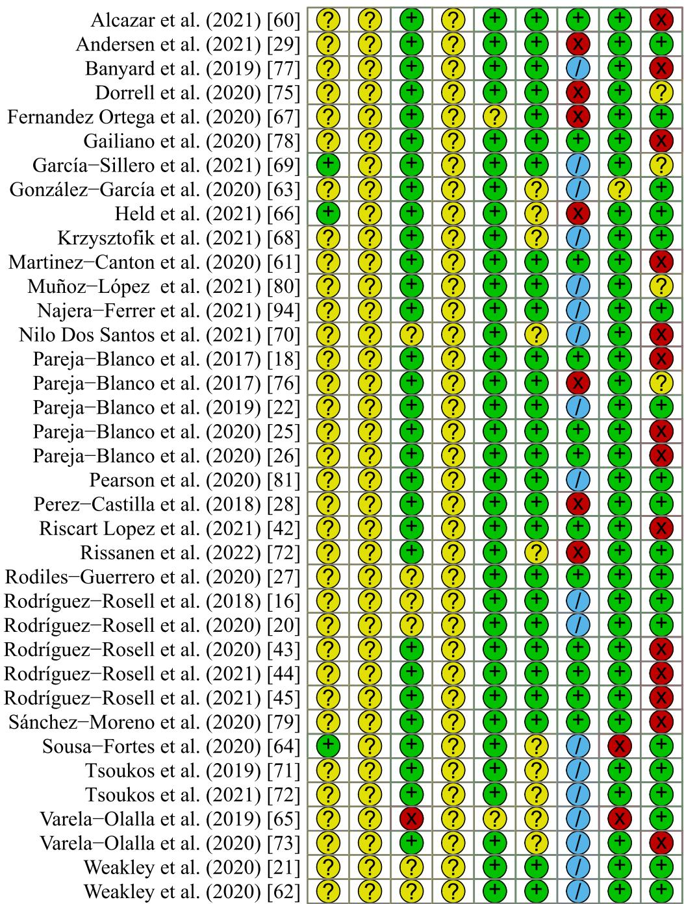

Judgement + Low ? Unclear x High 0 Na

Fig. 2 Risk of bias assessment for all included studies. Na not applicable repetitions performed to failure with a given %1RM has a high inter-individual variability [13]. However, this argument does not discount that the number of repetitions performed before reaching diferent VL thresholds might also have a high inter-individual variability. Indeed, this contention seems to be empirically supported because data from two recent studies [21, 81] suggest that the number of repetitions performed until reaching 10, 20, and 30% VL in the free-weight back squat exercise is not only highly variable between individuals but is also unstable across sessions. In addition, this inter-individual variability may increase as the magnitude of VL increases [21]. Based on the studies included in the present review, it seems that exercise choice and load can further infuence the actual number of repetitions performed and the variability thereof (Fig. 3). Specifcally, both the actual number of repetitions and its variability seem to be higher in the back squat compared with the bench press exercise across VL thresholds. Furthermore, both factors tend to have a strong inverse relationship with load, as higher loads allowed for fewer repetitions and produced lower variability in repetitions across VL thresholds. This is a previously overlooked outcome as studies often focus on the ability of VL thresholds to modulate, with acceptable reliability, the percentages of the completed repetitions per set with respect to the maximum number of repetitions possible [15, 17] and kinetic and kinematic outputs [21, 62,

(a)  
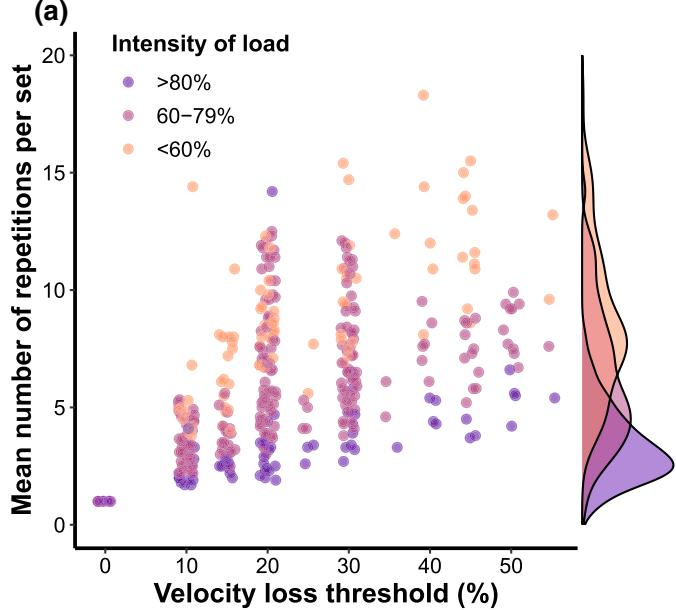

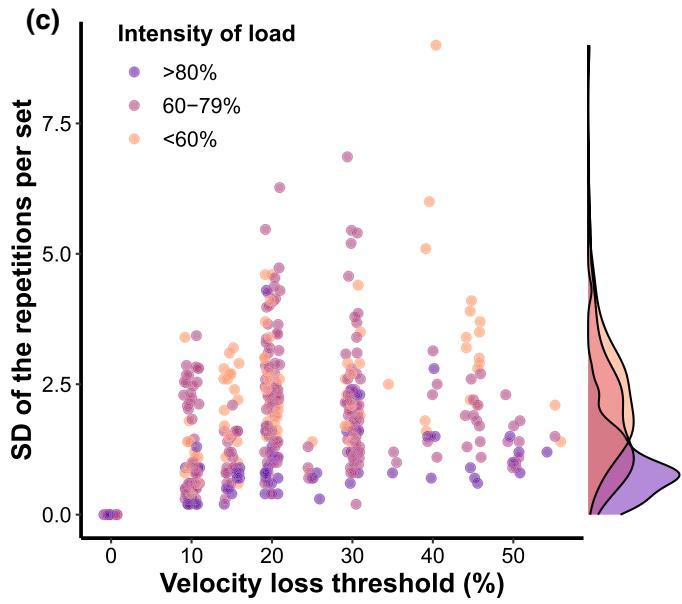  
Fig. 3 Visual representation of the mean number of repetitions performed per set by intensity of load (a) and exercise (b), as well as standard deviation of the number of repetitions performed per set by intensity of load (c) and exercise (d) across the velocity loss thresh-

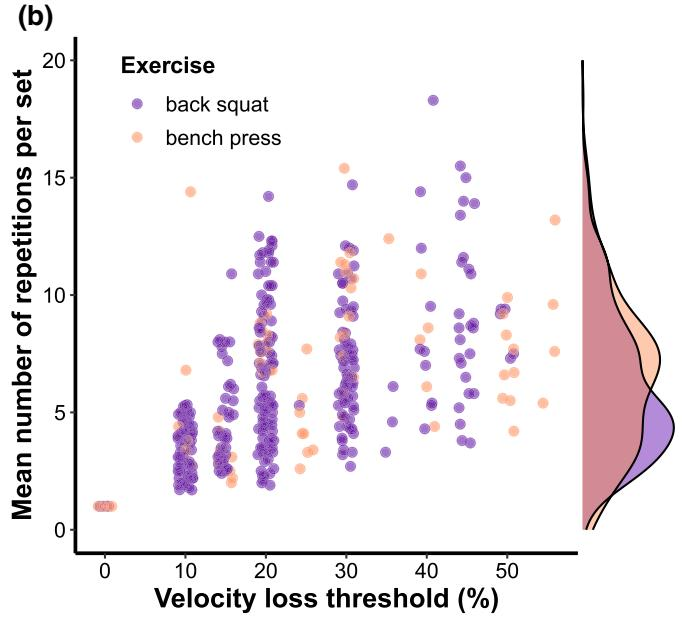

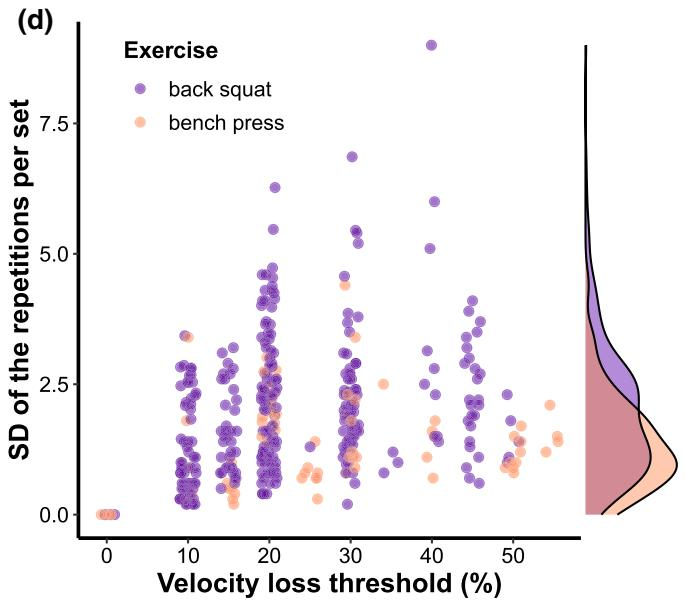  
olds reported in the literature. Note, longitudinal studies were also included here when they reported number of repetitions per set for each training session. Note, one study outlier was removed from the fgure as the participants completed more than 25 repetitions in a set

81]. Although these aspects of VL thresholds present an advantage over traditional methods for prescribing RT volume, the efects of the variability of the actual number of repetitions performed before reaching a certain VL threshold have not yet been empirically investigated. It is possible that individuals completing diferent numbers of repetitions using the same VL threshold might experience diferent degrees of neuromuscular, metabolic, and perceptual fatigue, potentially infuencing resultant training adaptations. In this regard, it is unknown whether the specifc VL threshold is a more important variable than the actual number of repetitions performed, as no studies to date have compared diferent VL thresholds matched for volume. Collectively, based on the studies included in the present review, it seems the use of VL thresholds for RT prescription could result in the considerable variability of the actual number of repetitions per set completed, which can further be confounded by other factors such as the choice of exercise and the load used. Whether this variability could modulate both the acute and chronic efects of VL thresholds presents an interesting avenue for future research.

## 4.2 Acute Efects of Velocity Loss Thresholds on Neuromuscular, Metabolic, and Perceptual Markers of Fatigue

Fatigue is traditionally defned as a loss of force-generating capacity with the eventual inability to sustain exercise at the required or expected level [82, 83]. Muscle-shortening velocity decreases and relaxation time increases as fatigue ensues [84]. In this regard, velocity against a fxed load (e.g., V1) before and after RT is often used as a marker of neuromuscular fatigue in studies investigating the acute efects of diferent VL thresholds. Indeed, this marker has a high correlation $( r > 0 . 9 )$ with other markers of fatigue such as blood lactate and ammonia accumulation as well as countermovement jump height loss after RT [14–16, 20]. Therefore, it is not surprising that several studies reported an almost linear decrease in post-session V1, and countermovement jump height, as well as an increase in blood lactate accumulation as VL increased [14–16, 21]. However, the dose–response relationship of VL with these markers of fatigue seems to be modulated by the exercise and load used (Fig. 4). For instance, as load decreases while using a given VL threshold, greater reductions in post-session V1 and countermovement jump height are observed [16]. Furthermore, Rodríguez-Rosell et al. [16] observed greater declines in post-session V1 in the bench press compared with the back squat, independent of load and VL. The authors attributed these V1 diferences between exercises to the smaller muscles—with more type II fbers and higher fatiguability index—involved in the bench press than the squat exercise [85–87]. Rodríguez-Rosell et al. [16] also reported greater blood lactate accumulation during the back squat compared with the bench press, regardless of the load used and VL experienced. In addition, the rate at which metabolic stress increased, as the VL increased, was considerably lower with greater loads (i.e., 80% RM) during the back squat but not bench press, for which metabolic stress uniformly increased as the VL increased regardless of the load used. Therefore, it seems that VL thresholds induce diferential neuromuscular and metabolic responses to RT depending on the exercise used.

One potential explanation for this phenomenon could lie in the actual number of repetitions performed before reaching diferent VL thresholds. Namely, while the RT protocols employing diferent exercises used the same VL threshold, it is plausible that performing more work (i.e., more repetitions) until reaching a given VL led to a greater blood lactate accumulation [88, 89]. This is supported by the fndings of Weakley et al. [90], which showed greater metabolic responses accompany increases in work completed during RT. Studies included in this review generally show that a higher number of repetitions are completed with the back squat compared with the bench press (Fig. 3). Therefore, when completing more work with the back squat compared with the bench press for a given VL threshold, higher metabolic stress is a logical outcome. Thus, the actual training volume completed in a set with a given VL threshold is an important consideration when prescribing RT. Considering the above, it seems that neuromuscular responses are less sensitive to subtle changes in volume during a set compared with metabolic responses, whereas greater neuromuscular fatigue is induced when using exercises involving smaller muscle groups (greater localized fatigue) with greater percentages of type II muscle fbers (a higher fatiguability index). However, countermovement jump height, also a valid marker of neuromuscular fatigue [91], seems to be extremely sensitive to changes in load (Fig. 4d). As higher loads typically allow for less volume (i.e., repetitions) to be completed in a set, it is plausible that countermovement jump height would also be sensitive to subtle changes in training volume, highlighting that diferent neuromuscular fatigue assessments might difer in sensitivity. Nevertheless, future research should substantiate these contentions.

Based on the available literature, rating of perceived exertion also seems to increase as VL increases. For instance, Weakley et al. [21] found gradual increases in perceived exertion of the lower limbs and breathlessness after each set with 10, 20, and 30% VL. More specifcally, the rate of increase in both perceptual measures seemed to be consistent for the 10% VL threshold, whereas perceived exertion of the lower limbs increased at a greater rate compared with breathlessness across sets with higher VL thresholds (20 and 30%), although the overall magnitude of both perceptual responses was similar. This fnding is somewhat supported by Emanuel et al. [92] who reported that the most frequent cause of set termination during sets of back squats to volitional failure was perceived fatigue in the targeted muscles, whereas cardiovascular factors were not as frequent a cause. However, this likely depends on the training background of the individuals. Based on these fndings, prescribing larger velocity loss thresholds (e.g., 20 and 30%) for back squats might lead to larger increases in perception of leg muscle exertion than breathlessness across repeated sets. Similar fndings were reported by Dos Santos et al. [70] who found that both perceived exertion and discomfort linearly increased as the number of back squat sets increased with a 30% VL threshold. Although it has not been discussed in the literature, the intention of continuously performing repetitions as fast as possible might also impact perceptual responses, especially leg muscle exertion [21] and perceived discomfort [70]. Admittedly, this hypothesis is challenging to investigate as the provision of maximal intent is a prerequisite for reliable velocity outputs.

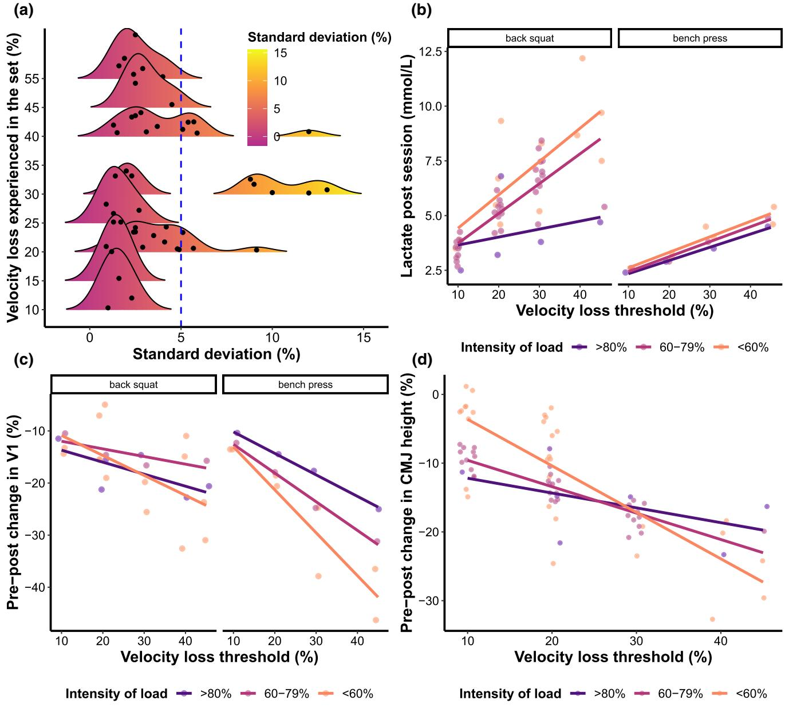  
Fig. 4 Visual representation of the variability of the actual velocity loss experienced in a set (a), post-session blood lactate accumulation across velocity loss thresholds by exercise and intensity of load (b), pre-post percent change in velocity against the load that can be lifted  
at $1 \ \mathrm { m { \cdot } s ^ { - 1 } \ ( V 1 ) }$ by exercise and intensity of load (c), and pre-post percent change in countermovement jump (CMJ) height (d) across velocity loss thresholds reported in the literature

The time course of fatigue recovery following RT depends on a myriad of factors including training volume and load. Despite the proposed benefts of VL thresholds in the literature [10, 14, 15], only Pareja-Blanco et al. [22] examined the time course of recovery after using diferent VL thresholds and loads during RT. For this purpose, the researchers examined vertical countermovement jump height, 20-m sprint time, and V1 before RT, and immediately, 6, 24, and 48 h post-back squat training with a combination of 20 and 40% VL and 60 and 80% of 1RM. Interestingly, with 60% 1RM, regardless of the VL used (20 vs 40%), none of the performance tasks fully returned to preexercise values at 48 h post-RT. In contrast, the RT protocol using higher loads (80% 1RM) and lower VL (20%) resulted in lower performance impairment immediately after RT, and greater sprint performance at 48 h post-RT compared with baseline. Interestingly, sprint time generally recovered faster compared to countermovement jump height and V1, suggesting their superior sensitivity for detecting RT-induced neuromuscular fatigue, and the fact that recovery may be exercise dependent. Nevertheless, prescribing higher VL (e.g., 40%) and lower relative loads (e.g., 60% 1RM) could result in greater fatigue immediately after RT and a slower rate of recovery than lower VL (e.g., 20%) and higher relative loads (e.g., 80% 1RM). This fnding is especially relevant for sports where RT precedes sport-specifc training, in which case an appropriate VL may decrease interference with subsequent sports training.

## 4.3 Methodological Considerations When Implementing Velocity Loss Thresholds and Future Research Directions

Several research groups have suggested that implementing VL thresholds may allow for better fatigue management compared with traditional RT training prescription methods [14, 15]. It also has been suggested VL can serve as a valid indicator of fatigue because of its high correlation with other frequently used neuromuscular and metabolic markers of fatigue [14–17]. While this presents a considerable advancement for RT monitoring and prescription, there are a few methodological factors that could compromise their utility both in research and practice. First, it is not clearly understood when exactly one should terminate a set after reaching a pre-determined VL threshold. In the literature, set termination after either one or two repetitions exceeding a VL threshold is common. The rationale for two repetitions is based on the fact that individuals can in some cases produce a velocity above a certain VL threshold, even after this threshold was exceeded for the frst time [24]. On this note, some of the studies included in this review—all of which used VL to prescribe RT—reported considerable variability in the VL achieved at the end of a set (Fig. 4a). The magnitude of this variability reported in several studies [70, 80, 93, 94] ranged from 5 to 13%. At the extreme end of this range, one could theoretically expect an individual to reach 40% VL in a set when only 30 or 35% was intended. These limitations should be considered in practice and future research should investigate ways of reducing this variability. Second, the reference repetition from which the VL is calculated (i.e., the frst or the fastest in the set) is an important consideration as it afects the VL achieved and subsequently the number of repetitions performed [24]. As the frst repetition is not always the fastest [24, 95, 96], it is important to use the fastest repetition as the reference for VL calculations to ensure more precise RT monitoring and prescription. Third, a reduction in the ability to accelerate the load at the beginning of the concentric phase will likely afect mean velocity more than peak velocity [97, 98]. In this regard, mean velocity should be used rather than peak velocity when implementing VL in training because of its higher sensitivity in detecting the fatigue progression during a set [24]. Fourth, while studies established a close relationship between VL and the percentage of the repetitions completed out of the maximum possible, these percentages may have a high interindividual variability [24]. In this regard, future research should investigate whether prescribing individualized VL thresholds could circumvent these uncertainties associated with prescribing the same VL for all individuals in a training session. Finally, while the efects of load and exercise selection were thoroughly discussed in the present review, there are other potentially relevant factors such as strength and height of the individual that might afect the utility of VL in practice [99]. Therefore, future research should continue exploring factors that could afect the precision of VL thresholds and subsequent acute and chronic efects of their implementation.

At least some of the limitations already described could be potentially alleviated by establishing the repetitions in reserve (i.e., the specifc number of repetitions that remain uncompleted at set termination) velocity relationship. The rationale for establishing the repetitions in reserve velocity relationship is that despite the strong relationship between the percentage of repetitions completed out of the maximum possible with VL, the post-set repetitions in reserve remains unknown when using VL [19]. This is important because the last repetitions of a set contribute more to the alteration of muscle energy balance and the abrupt increase in metabolites such as ammonia [14, 100, 101]. In this regard, two studies attempted to establish the relationship between repetitions in reserve and velocity [19, 102]. Morán-Navarro et al. [19] examined the within-individual variability for the velocity associated with a given number of repetitions in reserve (i.e., 2, 4, 6, and 8) in the Smith machine bench press, shoulder press, bench pull, and back squat. The authors concluded that regardless of the load used, velocity at a given repetition in reserve is very similar and highly reliable for a given exercise. However, within-individual variability was considerably higher for the bench press and shoulder press compared with other exercises, but this variability was lower among more RT-experienced participants. García-Ramos et al. [102] also examined the repetitions in the reserve velocity relationship, and while they found a high correlation for the Smith machine bench press $\left( r = 0 . 8 8 \right)$ , they also reported large between-individual variability for velocity at a given repetition in reserve (from 1 to 10). Based on these fndings, it seems that a repetition in the reserve velocity relationship, like a load velocity profle, should be established for each exercise, and for each individual. Doing so may alleviate many of the shortcomings identifed for the VL prescription method. With that said, the literature on this relationship is still scarce with no information available for free-weight exercises, nor on the potential moderating efects of strength, training background, or sex. Considering this, and the conficting results already reported in the literature, future studies should be conducted to address the potential utility of this RT prescription method.

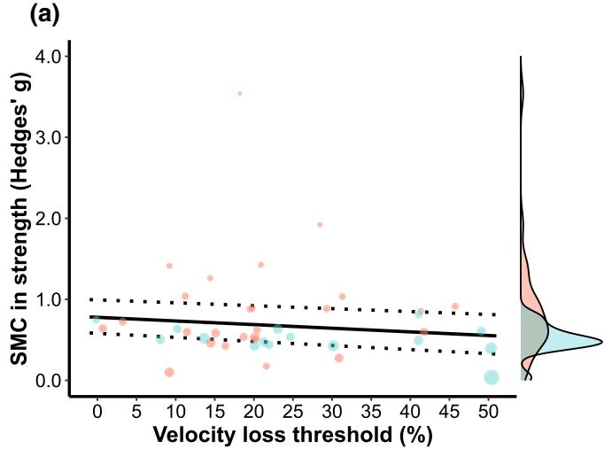  
(b)

(d)  
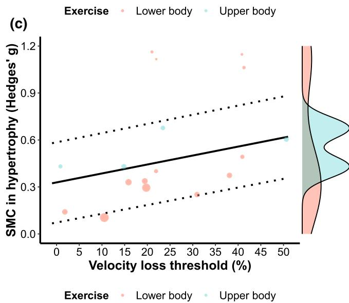  
Fig. 5 Multilevel mixed-efects meta-regression illustrating the efects of velocity loss thresholds on muscle strength gains (also see Table  4) after controlling for exercise, study duration, and strength levels of the individuals (a), and the efects of velocity loss thresholds on muscle hypertrophy (c). Dose–response relationship considering (1) individual study efect sizes (green circles); (2) average efect sizes of individual velocity loss thresholds (red circles); and (3) aver-

## 4.4 Efects of Velocity Loss Thresholds on Muscle Strength, Hypertrophy, and Endurance Training Adaptations

Based on the results of the present meta-regression, the choice of VL during RT does not seem to afect the magnitude of strength gains when controlling for other factors such as choice of exercise, strength levels, and training duration (Table 4; Fig. 5). This is despite the fact that most studies reported considerable diferences in training volume that linearly increased as the VL increased. These fndings are somewhat in accordance with the meta-analysis by Ralston et al. [103] who found only trivial to small efects (efect size diferences: 0.14–0.23) of higher (5+ sets) versus lower (1–4 sets) weekly set volumes on strength gains. However, it must be noted that participants in the majority of studies included in that meta-analysis performed sets to muscle failure. In contrast, diferent VL groups included in the present review difered not only in training volume, but also proximity to failure in each set. For instance, performing repetitions until 10% VL would result in not only lower training volume, but also more repetitions left in reserve compared with performing repetitions until 30% VL with the same load and exercise. Therefore, the fndings of the present review might be used to support both the notion of avoiding training to failure and also not needing to perform high-volume protocols when the aim is to optimize strength gains. Indeed, although the majority of studies included in the present review found no statistically signifcant diferences in strength gains between diferent VL thresholds, the magnitudes of improvement (as quantifed by efect sizes) seem to suggest a slight advantage of low to moderate over high VL thresholds (Fig. 5b). The authors from the several studies [25–27, 60] suggested that an inverted U-shaped relationship might exist between VL experienced in a set and maximal strength gains. For instance, Pareja-Blanco et al. [25, 26] reported that once a moderate VL threshold was exceeded (e.g., 20 or 25% VL), further increases in strength gains were not observed. In addition, higher VL thresholds can cause a decrease in the early rate of force development [26] and a reduction in the expression of fast-twitch muscle fbers [18] following RT. Further, several researchers [25, 26] reported that a 0% VL, meaning performing only one repetition during a set, did not lead to optimal strength gains. Therefore, a minimal VL threshold (e.g., ≥ 5%) is needed to induce optimal strength gains. Considering all the above, low to moderate instead of high VL thresholds should be prescribed when the goal is to optimize neuromuscular adaptations to RT.

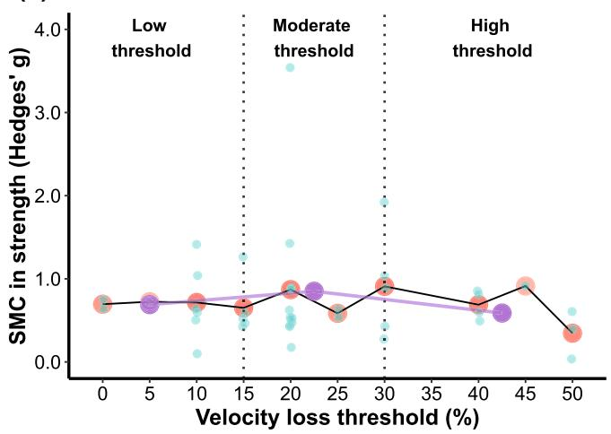

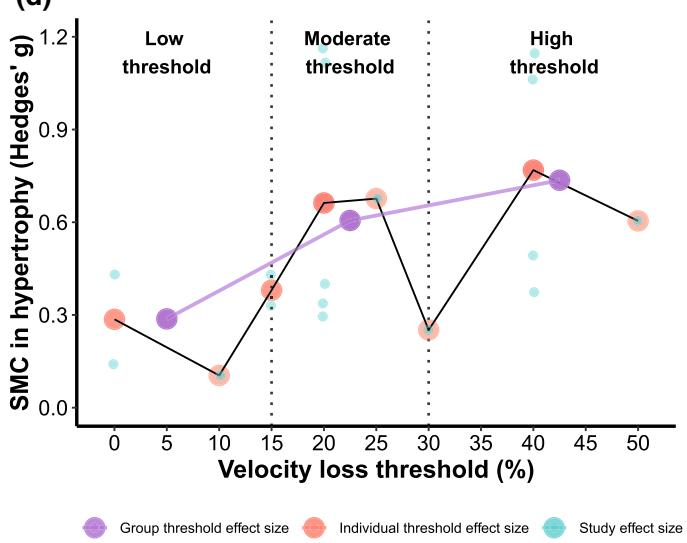  
age efect sizes of low (≤ 15%), moderate $( > 1 5 \% < 3 0 \% )$ , and high (> 30%) grouped velocity loss thresholds (purple circles and lines) between velocity loss and muscle strength (b) and hypertrophy (d) gains. Black (non-vertical) solid and dotted lines represent estimated relationships and corresponding upper and lower 95% confdence intervals, whereas vertical dotted lines represent boundaries between velocity loss thresholds. SMC standardized mean change

In contrast to gains in maximal strength, an increase in VL led to a somewhat linear increase in muscle hypertrophy (Fig. 5c, d). In this regard, a meta-analysis from Schoenfeld et al. [8] found a graded dose–response relationship between training volume and muscle hypertrophy. As training volume concomitantly increases with VL, it is not surprising that moderate, and especially high VL thresholds induced the most muscle hypertrophy. Volume, rather than the VL threshold itself, seems to be the factor driving diferences in hypertrophy as illustrated by Andersen and colleagues [29] who observed no signifcant diferences between 15 and 30% VL threshold groups in the only longitudinal VL study examining muscle hypertrophy with equated volume. However, this fnding is not universal as some studies found moderate VL (e.g., 20–25%) thresholds to be equally efective as higher (e.g., > 40%) VL thresholds at promoting hypertrophy [25, 26]. These discrepancies were not discussed in the scientifc literature but could at least partially be explained by the combination of the following factors: (1) training status of the participants (e.g., slight numerical diferences in muscle cross-sectional area at baseline in favour of moderate thresholds) and (2) relatively low training frequency (\~ 2×/ week), study duration (\~ 8 weeks; 16 sessions), and the number of sets (\~ 6/week). Thus, moderate VL thresholds should be prescribed when the aim is to optimize hypertrophy without sacrifcing neuromuscular adaptations.

Traditionally, performing many repetitions per set has been recommended when the goal is to induce positive muscle endurance adaptations during RT [104, 105]. Similar conclusions were drawn in a more recent meta-analysis [35]. Contrastingly, the results of the present meta-regression suggest that diferent VL thresholds, and thus varying number of repetitions performed per set, do not seem to modulate gains in muscle endurance during RT (Fig. 7a, b; Table 4). In fact, higher VL thresholds seemed to be slightly less efective at inducing muscle endurance gains (Fig. 7b). This is surprising given the observed diferences in training volume that linearly increased as the VL increased. Moreover, one study [79] recently reported that the group who performed bodyweight pull-ups until reaching 25% VL improved muscle endurance in the same exercise (i.e., number of repetitions to failure) slightly more than the 50% VL group despite the diferences in training volume. In this regard, studies [25, 26, 43, 44] often hypothesize that the superior gains in maximal strength observed for low to moderate compared to high VL thresholds might be responsible for these fndings. This is a plausible explanation as the muscle endurance tests used a fxed load both at baseline and post-intervention, meaning that the group that experienced greater strength gains would perform the strength endurance test with a lower relative load compared with the group that experienced lesser strength gains, thus allowing more repetitions to be performed until failure. Indeed, high correlations $( r { = } 0 . 6 3 { - } 0 . 7 1 )$ have been reported between improvements in maximal strength and muscle endurance, which could support this contention [43, 44]. In addition, similar dose–response curves for muscle strength and endurance, but not hypertrophy, were observed in a recent study [106] investigating the efects of training volume on muscle adap tations, which aligns with the results of the present metaregression. However, a training program with a repetition range that mimics the endurance test generally leads to greater improvements in muscle endurance [107]. In this regard, it is unclear why higher VL thresholds, which generally allow for greater repetitions per set and therefore more closely mimic muscle endurance tests, did not prove to be superior for this outcome. Perhaps the fact that most studies in the present review terminated their muscle endurance tests when the barbell reached ${ \sim } 0 . 5 0 \mathrm { m } { \cdot } \mathrm { s } ^ { - 1 }$ could be responsible for these fndings, thus making the test relatively more similar to low to moderate, but not high VL thresholds. Future studies are needed to investigate these possibilities.

(a)  
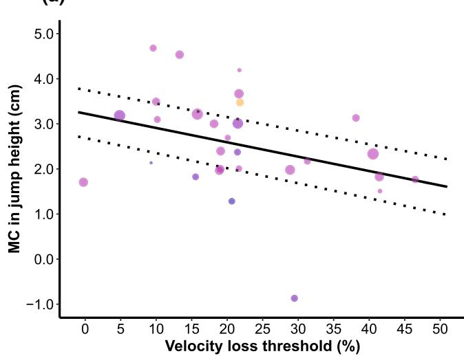  
(b)

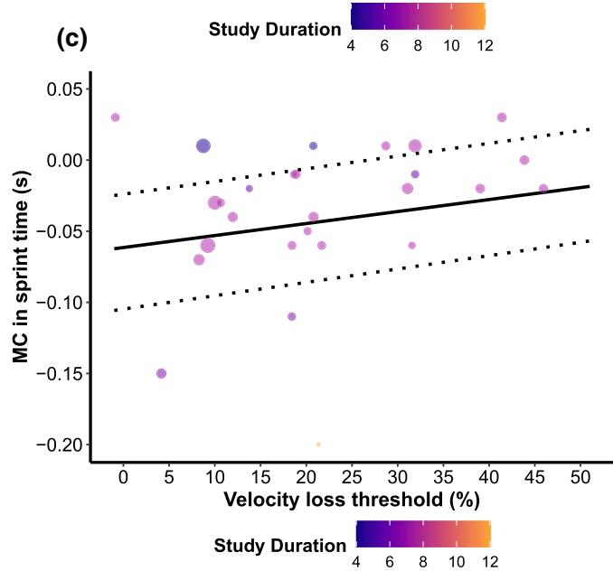  
Fig. 6 Multilevel mixed-efects meta-regression illustrating the efects of velocity loss thresholds on countermovement jump (a) and running sprint time (c) after controlling for study duration (also see Table 4). For (a) and (c), larger data points received greater weighting than smaller data points. Dose–response relationship considering (1) individual study efect sizes (green circles); (2) average efect sizes of individual velocity loss thresholds (red circles); and (3) average efect

## 4.5 Efects of Velocity Loss Thresholds on Performance of Athletic Tasks and Velocity Against Submaximal Loads

Based on the results of the present meta-regression, there is an inverse relationship between VL and subsequent improvement in countermovement jump and sprint performance. In addition, study duration also seems to modulate the gains in jumping and sprinting performance with longer training interventions leading to greater gains in performance. This fnding was observed despite the fact that only two out of ten studies that investigated the efects of VL thresholds on jumping or sprinting performance incorporated sprinting or jumping in their training programs (either directly or through playing sport). Jumping and sprinting improvements were also unrelated to maximal strength gains, which were more similar between VL thresholds compared to athletic task performance. Therefore, some authors concluded the degree of RT transfer to actual physical performance was more dependent on the magnitude of VL attained in the set rather than gains in strength [43, 44]. This contention could be supported by the principle of training specifcity [108]. In general, average velocity was higher for low to moderate than high VL thresholds. In this regard, signifcant correlations were reported between the velocity of the repetitions performed and changes in jumping and sprinting performance [43, 44], supporting the importance of repetition velocity for enhancing high-speed actions such as jumping and sprinting. The inverse could also explain these fndings, as the number of repetitions performed at slower velocities was progressively greater as VL increased. Therefore, it could also be argued that the excessive amount of fatigue from high VL interferes with athletic task performance. However, more research is needed to determine the causal factor, as Pérez-Castilla et al. [28] found no signifcant differences in jumping and sprinting improvement between 10 and 20% VL threshold groups with equated volume, the only study to have controlled for volume. Admittedly, this study lasted only 4 weeks (below the average in the present review), compared with only low to moderate VL thresholds, and included diferent jumping exercises in their training interventions, all of which could have afected the results.

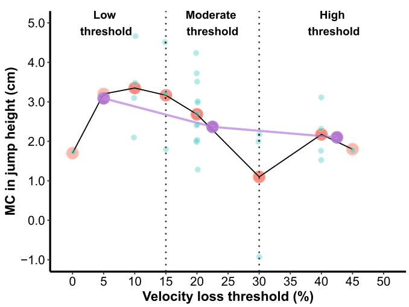

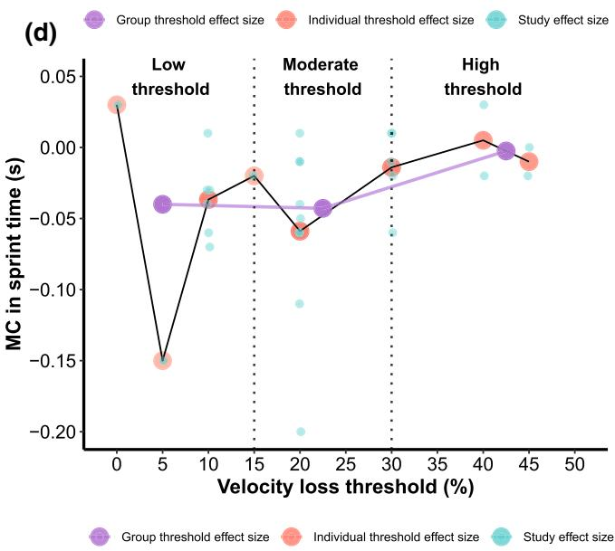  
sizes of low (≤ 15%), moderate $( > 1 5 \% < 3 0 \% ) .$ and high (>30%) grouped velocity loss thresholds (purple circles and lines) between velocity loss and countermovement jump (b) and running sprint (d) performance improvement. Black, solid, and dotted (non-vertical) lines represent estimated relationships and corresponding upper and lower 95% confdence intervals, whereas vertical dotted lines represent boundaries between velocity loss thresholds. MC mean change

The fndings of the present meta-regression on the efects of diferent VL thresholds on velocity against submaximal loads might support the importance of actual repetition velocity during RT that is implemented with the intent of improving jumping and sprinting performance. Indeed, improvement in velocity against moderate $( < 0 . 8 \mathrm { m } { \cdot } \mathrm { s } ^ { - 1 } )$ , and especially low loads $\mathrm { ( > 1 ~ m { \cdot } s ^ { - 1 } ) }$ progressively increased as the VL decreased (Fig. 7c, d). As lower VL thresholds allow for greater velocities and therefore higher velocity adaptations against low loads, these fndings collectively support the training specifcity concept in relation to RT transfer to the performance of athletic tasks such as jumping and sprinting. A large degree of variability in velocity against moderate loads was observed, which could probably be explained by the large range of loads that fell into the moderate loads category. Nevertheless, it seems that moderate VL thresholds (Fig. 7d) were slightly more efective compared with low and high VL thresholds at improving velocity against moderate loads, further supporting the principle of training specifcity. Collectively, these fndings support the idea that training should be informed by changes in an individual’s load-velocity profile, as doing so identifies the specific

RT-induced adaptations along the load-velocity curve, thus providing a more comprehensive analysis of RT-induced changes compared to maximal strength changes alone.

## 4.6 Implications for Training and Research Based on the Findings from Longitudinal Studies

Overall, based on the fndings of the present review it can be concluded that (1) while the diferences in strength and muscle endurance adaptations between VL thresholds are small, low to moderate VL thresholds may be slightly more effective for inducing these adaptations compared with higher VL thresholds; (2) moderate to high thresholds are likely more efective for muscle hypertrophy compared with lower thresholds; (3) jumping and sprinting performance improve the most following lower VL threshold training; and (4) low to moderate VL thresholds will improve velocity against low loads, whereas moderate thresholds more efectively improve velocity against moderate loads. Considering less time is required when training with low to moderate VL thresholds, potential reductions in early rate of force development [26], percentage of fast-twitch muscle fbers [18], and the likely delayed time course of recovery after RT with high VL thresholds [22], low to moderate VL thresholds should generally be prescribed when the goal is to optimize strength and performance adaptations. These fndings are especially relevant for team sports where frequent matches throughout the season and extended competition periods alter the length of the preparatory period and its specifc phases, but also for individual sports where athletes often train multiple times a day and need to manage RT fatigue for both event performance and sport-specifc training sessions.

It must be noted, however, that it is presently unclear if diferential efects of low to moderate and high VL thresholds are indeed due to diferences in VL (and therefore repetition velocity and proximity to failure), training volume, or a combination of both. In this regard, only two longitudinal studies equated training volume between diferent VL thresholds, both of which found no signifcant diferences between groups [28, 29]. Therefore, it may be that diferences in training volume are the main drivers of diferential adaptations following the use of diferent VL thresholds. In partial support of this, reductions in type IIx fbers and the rate of force development have been shown to be larger following higher as compared with lower volume training [109]. Nevertheless, future studies should equalize training volume between VL thresholds to isolate their efects from the infuence of total volume load to support or refute this contention. Furthermore, no studies investigating the efects of diferent VL thresholds have manipulated the number of sets. Manipulating the number of sets could be a viable strategy to further increase the efectiveness of low to moderate VL thresholds. Increasing the number of sets while keeping VL low to moderate might yield additional muscle hypertrophy, comparable to higher VL thresholds with fewer sets. Choosing to perform more sets with low to moderate VL thresholds to increase volume, rather than use high VL thresholds, might avoid the aforementioned downsides of high VL thresholds (neuromuscular fatigue, poorer strength, and athletic task performance adaptations) while still producing (or perhaps even amplifying) the observed adaptations associated with low to moderate VL thresholds. Another area in need of study is the periodized use of VL thresholds over time (e.g., low to moderate VL phases following high VL in a linear manner, or used concurrently in an undulating design). Such a multifaceted approach to training does have merit, especially in high-performance settings where multiple training qualities often have to be considered throughout a microcycle or mesocycle. Importantly, in a similar manner to VL thresholds for those who do not have access to velocity-tracking devices, cluster or rest-redistribution set structures may be a viable alternative to maintain high repetition velocity while minimizing neuromuscular fatigue during RT [35, 110, 111]. Indeed, Jukic and Tufano [96] recently reported that rest redistribution allowed almost all repetitions (\~ 17.5 out of 18) in a clean pull exercise to be performed above 20% VL regardless of the load used across three sets and therefore suggested that rest redistribution could potentially serve as a free ad-hoc alternative to VL thresholds. However, future research is needed to explore these alternatives with a range of diferent exercises, loads, and athletic populations. Finally, acute responses to diferent VL thresholds discussed in the present review should also be considered when implementing them in RT programs as they are also likely to afect the magnitude of RT-induced adaptations.

(a)  
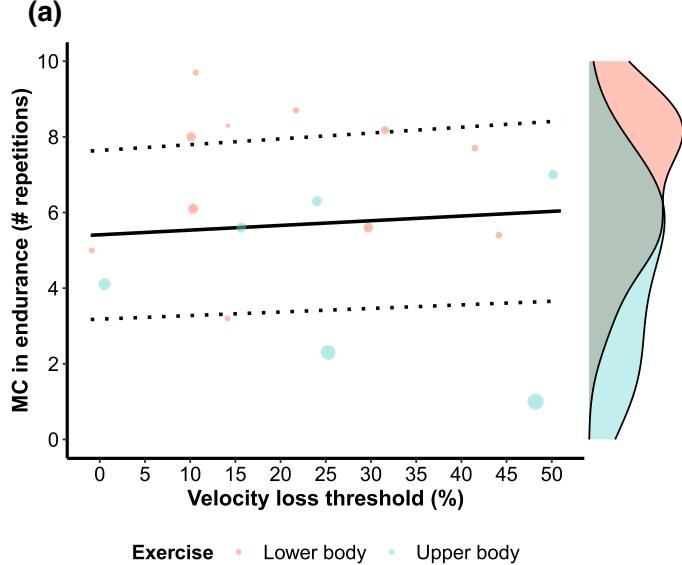

(b)  
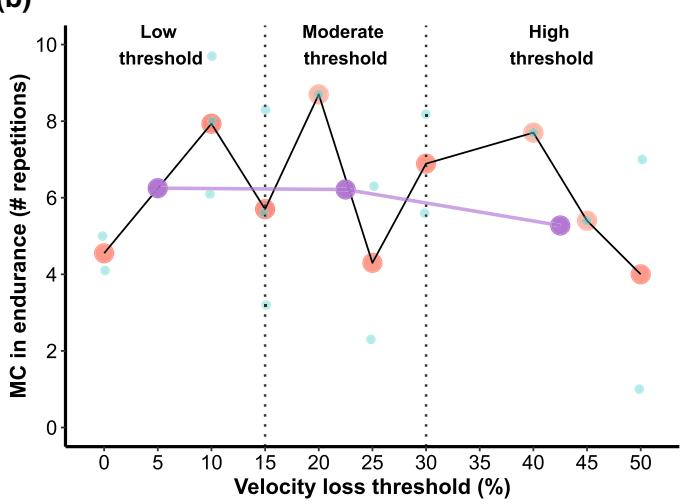

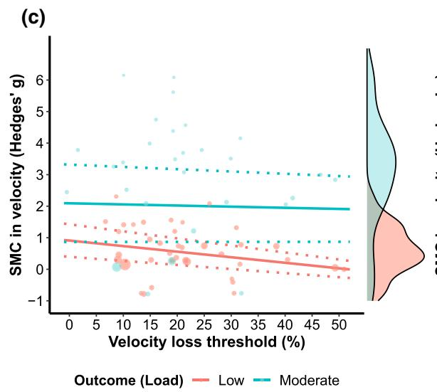

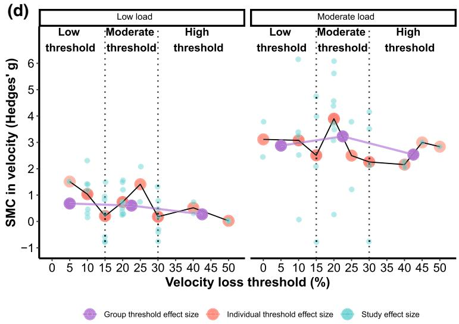  
Fig. 7 Multilevel mixed-efects meta-regression illustrating the efects of velocity loss thresholds on muscle endurance quantifed by the number of repetitions performed in a fatigue test (a). Multivariate mixed-efects meta-regression illustrating the efects of velocity loss thresholds on velocity against low $\mathrm { ( > 1 \ m { \cdot } s ^ { - 1 } ; }$ red circles and lines), and moderate $( < 0 . 8 \ \mathrm { m \cdot s ^ { - 1 } }$ ; green circles and lines) loads (c). For a and c, larger data points received greater weighting than smaller data points. Dose–response relationship considering (1) individual study efect sizes (green circles); (2) average efect sizes of individual  
velocity loss thresholds (red circles); and (3) average efect sizes of low (≤15%), moderate (>15% <30%), and high (>30%) grouped velocity loss thresholds (purple circles and lines) between velocity loss and muscle endurance (b) and velocity against submaximal loads (d) performance improvement. Black, green, and red (solid and dotted) lines represent estimated relationships and corresponding upper and lower 95% confdence intervals, whereas vertical, dotted, and black lines represent boundaries between velocity loss thresholds. MC mean change, SMC standardized mean change

## 4.7 Risk of Bias Assessment

Most of the studies included in this review did not provide sufcient information regarding the method of randomization. Further, no studies provided information regarding allocation concealment and no studies pre-registered their protocols on a publicly available registry. As a result, these studies were of unclear risk of order efect, allocation concealment, and selective reporting bias. Therefore, researchers should improve their reporting of this information in future studies. Importantly, some studies also had an unclear risk of attrition bias due to not providing sufcient information as to the number of participants included in the analysis after reporting that some did not complete the entire intervention or all procedures. Future studies should report the predefned criteria for participant exclusion from analysis, and clearly state how many were included. We recommend the use of the CONSORT fow diagram [112]. Almost half of the studies included in this review were at high risk of familiarization bias because the authors did not report or did not familiarize their participants with the testing procedures. This is especially important in the context of velocity-based training where participants need to provide maximal intent during all repetitions to ensure the reliability of velocity outputs. In addition, some studies failed to report details regarding the provision of velocity feedback or encouragement, both of which can afect the fndings of a study. Therefore, future research should ensure that familiarization sessions are performed, the procedures are fully reported, and the provision of velocity feedback or encouragement occurs and is documented. Most studies were at a low risk of bias for other factors that could have afected their fndings and used valid and reliable methods, equipment, or instruments to evaluate their outcomes of interest.

## 4.8 Limitations and Considerations

Several aspects of this review should be considered when interpreting the fndings. First, the visualizations made from the acute studies and their interpretation are limited by the data reported in the original studies. While attempts were made to perform a meta-analysis of the acute studies, missing data and subsequently authors’ refusal to provide data prevented us from doing so. Second, there were considerably fewer female participants in both the acute and longitudinal studies, which reduces the generalizability of our fndings to female participants, and more research on VL thresholds should include female individuals when possible. However, Rissanen et al. [74] recently reported robust and similar increases in strength and power performance in male and female individuals over 8 weeks while performing repetitions until 20% or 40% VL. This suggests that male and female individuals might be responding similarly to diferent VL thresholds; although, more research is needed to substantiate these claims. Third, while we attempted to consider the moderating efects of study duration, exercise, loads used, and strength levels of the individuals in all meta-analytic models, the number of studies and efect sizes per study meant this could only be performed for some outcomes. For instance, exercises in the vast majority of longitudinal studies were performed in Smith machines. In this regard, the efects of exercise mode (i.e., Smith machine vs free-weight exercises) have not been formally investigated. Therefore, it is presently unknown to what extent the fndings of the present review can be translated to scenarios when only free-weight exercises are used, and thus, the fndings of this review should be interpreted with this in mind. This also highlights a need for studies that directly compare the acute and chronic efects of diferent VL thresholds with exercises performed using free weights or using both free weights and Smith machines (while keeping exercises the same) in a cross-over manner. Fourth, some studies did not report all information required for meta-regressions; therefore, we extracted the required information from fgures or made estimations (e.g., pre-post assessment correlations) based on other studies. This likely introduced some error and we therefore urge researchers to report standard deviations of diferences (and or pre-post assessment correlations) in training intervention studies. In addition, we also urge researchers to respond to data request e-mails and to provide data when there are no legal barriers to doing so. Fifth, a few longitudinal studies estimated 1RM rather than testing 1RM as a measure of maximal strength. Although not ideal, the fact that all these studies were consistent with their procedures before and after the intervention, used load–velocity relationships with high loads (up to 80–95% 1RM), and used Smith machine exercises to predict maximal strength should minimize the impact on their fndings. Finally, as there is no consensus regarding the actual velocities attained against low, moderate, and high loads (because these velocities are highly individual), what is considered a “moderate” or “low” load is subjective. Therefore, when interpreting the velocity against submaximal loads outcome in the present review, it should be noted that loads associated with > 1 and < 0.8 m·s−1 were classifed as low and moderate loads, respectively.

## 5 Conclusions

Monitoring VL during RT may ofer additional insights about training response not captured by more traditional methods of prescribing and monitoring RT. However, it is important to note that the acute neuromuscular, metabolic, and perceptual responses to diferent VL thresholds will likely depend upon the choice of exercise, loads used, number of sets performed, individual athlete characteristics, and more. In addition, factors that can specifcally afect the consistency of VL determination such as reference repetition, use of peak or mean velocity, and criteria for set termination (repetitions allowed after the VL is exceeded) should all be considered when implementing VL in practice. Prescribing low to moderate VL thresholds during RT seems to be more time efcient and a generally advantageous strategy compared with higher VL thresholds for optimizing muscle strength and endurance, jumping and sprint performance, as well as velocity against submaximal loads. In contrast, higher VL thresholds may be more efective for promoting muscle hypertrophy. However, prescribing higher VL thresholds during RT can impair rapid force production capability, reduce the expression of fast-twitch muscle fbers, and prolong recovery from RT. In contrast, extremely low VL thresholds can sometimes lead to suboptimal training adaptations. Therefore, low to moderate VL thresholds may be a viable strategy for ensuring optimal performance improvement while preventing the potentially negative efects of fatigue. To conclude, the fndings of this review indicate that the specifc choice of VL threshold will infuence the subsequent RT adaptations, highlighting that VL threshold selection is an important consideration in RT program design.

Supplementary Information The online version contains supplementary material available at https://doi.org/10.1007/s40279-022-01754-4.

## Declarations

Funding Open Access funding enabled and organized by CAUL and its Member Institutions.

Conflict of interest Ivan Jukic, Alejandro Pérez Castilla, Amador García Ramos, Bas Van Hooren, Michael McGuigan, and Eric Helms declare that they have no conficts of interest relevant to the content of this review.

Ethics approval Not applicable.

Consent to participate Not applicable.

Consent for publication Not applicable.

Availability of data and material The datasets generated and/or analyzed during the current review are available in tables, supplementary fles, and at the Open Science Framework (https://osf.io/q4acs/).

Code availability Not applicable.

Author contributions IJ performed all the analyses, visualized the data, and wrote the frst draft of the manuscript. All authors edited and revised the manuscript and approved the fnal version of the manuscript.

Open Access This article is licensed under a Creative Commons Attribution 4.0 International License, which permits use, sharing, adaptation, distribution and reproduction in any medium or format, as long as you give appropriate credit to the original author(s) and the source, provide a link to the Creative Commons licence, and indicate if changes were made. The images or other third party material in this article are included in the article's Creative Commons licence, unless indicated otherwise in a credit line to the material. If material is not included in the article's Creative Commons licence and your intended use is not permitted by statutory regulation or exceeds the permitted use, you will need to obtain permission directly from the copyright holder. To view a copy of this licence, visit http://creativecommons.org/licenses/by/4.0/.

## References

1. Suchomel TJ, Nimphius S, Stone MH. The importance of muscular strength in athletic performance. Sports Med. 2016;46(10):1419–49.

2. Suchomel TJ, Nimphius S, Bellon CR, Stone MH. The importance of muscular strength: training considerations. Sports Med. 2018;48(4):765–85.

3. Lauersen JB, Andersen TE, Andersen LB. Strength training as superior, dose-dependent and safe prevention of acute and overuse sports injuries: a systematic review, qualitative analysis and meta-analysis. Br J Sports Med. 2018;52(24):1557–63.

4. Kraemer WJ, Ratamess NA, French DN. Resistance training for health and performance. Curr Sports Med Rep. 2002;1(3):165–71.

5. O’Connor PJ, Herring MP, Caravalho A. Mental health benefits of strength training in adults. Am J Lifestyle Med. 2010;4(5):377–96.

6. Feigenbaum MS, Pollock ML. Prescription of resistance training for health and disease. Med Sci Sports Exerc. 1999;31(1):38–45.

7. Schoenfeld BJ, Grgic J, Ogborn D, Krieger JW. Strength and hypertrophy adaptations between low-vs. high-load resistance training: a systematic review and meta-analysis. J Strength Cond Res. 2017;31(12):3508–23.

8. Schoenfeld BJ, Ogborn D, Krieger JW. Dose–response relationship between weekly resistance training volume and increases in muscle mass: a systematic review and meta-analysis. J Sports Sci. 2017;35(11):1073–82.

9. Kraemer WJ, Ratamess NA. Fundamentals of resistance training: progression and exercise prescription. Med Sci Sports Exerc. 2004;36(4):674–88.

10. Weakley J, Mann B, Banyard H, McLaren S, Scott T, Garcia-Ramos A. Velocity-based training: from theory to application. Strength Cond J. 2021;43(2):31–49.

11. Zourdos MC, Dolan C, Quiles JM, Klemp A, Jo E, Loenneke JP, et al. Efcacy of daily one-repetition maximum training in

well-trained powerlifters and weightlifters: a case series. Nutr Hosp. 2016;33(2):437–43.

12. Padulo J, Mignogna P, Mignardi S, Tonni F, D’Ottavio S. Efect of diferent pushing speeds on bench press. Int J Sports Med. 2012;33(05):376–80.

13. Richens B, Cleather DJ. The relationship between the number of repetitions performed at given intensities is diferent in endurance and strength trained athletes. Biol Sport. 2014;31(2):157.

14. Sánchez-Medina L, González-Badillo JJ. Velocity loss as an indicator of neuromuscular fatigue during resistance training. Med Sci Sports Exerc. 2011;43(9):1725–34.

15. González-Badillo JJ, Yañez-García JM, Mora-Custodio R, Rodríguez-Rosell D. Velocity loss as a variable for monitoring resistance exercise. Int J Sports Med. 2017;38(3):217–25.

16. Rodríguez-Rosell D, Yáñez-García JM, Torres-Torrelo J, Mora-Custodio R, Marques MC, González-Badillo JJ. Efort index as a novel variable for monitoring the level of efort during resistance exercises. J Strength Cond Res. 2018;32(8):2139–53.

17. Rodríguez-Rosell D, Yáñez-García JM, Sánchez-Medina L, Mora-Custodio R, González-Badillo JJ. Relationship between velocity loss and repetitions in reserve in the bench press and back squat exercises. J Strength Cond Res. 2020;34(9):2537–47.

18. Pareja-Blanco F, Rodríguez-Rosell D, Sánchez-Medina L, Sanchis-Moysi J, Dorado C, Mora-Custodio R, et al. Efects of velocity loss during resistance training on athletic performance, strength gains and muscle adaptations. Scand J Med Sci Sports. 2017;27(7):724–35.

19. Morán-Navarro R, Martínez-Cava A, Sánchez-Medina L, Mora-Rodríguez R, González-Badillo JJ, Pallarés JG. Movement velocity as a measure of level of efort during resistance exercise. J Strength Cond Res. 2019;33(6):1496–504.

20. Rodríguez-Rosell D, Yáñez-García JM, Mora-Custodio R, Torres-Torrelo J, Ribas-Serna J, González-Badillo JJ. Role of the efort index in predicting neuromuscular fatigue during resistance exercises. J Strength Cond Res. 2020. https://doi.org/10.1519/jsc. 0000000000003805.

21. Weakley J, McLaren S, Ramirez-Lopez C, Garcia-Ramos A, Dalton-Barron N, Banyard H, et al. Application of velocity loss thresholds during free-weight resistance training: responses and reproducibility of perceptual, metabolic, and neuromuscular outcomes. J Sports Sci. 2020;38(5):477–85.

22. Pareja-Blanco F, Villalba-Fernández A, Cornejo-Daza PJ, Sánchez-Valdepeñas J, González-Badillo JJ. Time course of recovery following resistance exercise with different loading magnitudes and velocity loss in the set. Sports (Basel). 2019;7(3):59. https://doi.org/10.3390/sports7030059.

23. Beck M, Varner W, LeVault L, Boring J, Fahs CA. Decline in unintentional lifting velocity is both load and exercise specifc. J Strength Cond Res. 2020;34(10):2709–14.

24. García-Ramos A, Weakley J, Janicijevic D, Jukic I. Number of repetitions performed before and after reaching velocity loss thresholds: frst repetition versus fastest repetition: mean velocity versus peak velocity. Int J Sports Physiol Perform. 2021;16(7):950–7.

25. Pareja-Blanco F, Alcazar J, Cornejo-Daza PJ, Sánchez-Valdepeñas J, Rodriguez-Lopez C, Hidalgo-de Mora J, et al. Efects of velocity loss in the bench press exercise on strength gains, neuromuscular adaptations, and muscle hypertrophy. Scand J Med Sci Sports. 2020;30(11):2154–66.

26. Pareja-Blanco F, Alcazar J, Sánchez-Valdepeñas J, Cornejo-Daza PJ, Piqueras-Sanchiz F, Mora-Vela R, et al. Velocity loss as a critical variable determining the adaptations to strength training. Med Sci Sports Exerc. 2020;52(8):1752–62.

27. Rodiles-Guerrero L, Pareja-Blanco F, León-Prados JA. Efect of velocity loss on strength performance in bench press using a weight stack machine. Int J Sports Med. 2020;41(13):921–8.

28. Pérez-Castilla A, García-Ramos A, Padial P, Morales-Artacho AJ, Feriche B. Efect of diferent velocity loss thresholds during a power-oriented resistance training program on the mechanical capacities of lower-body muscles. J Sports Sci. 2018;36(12):1331–9.

29. Andersen V, Paulsen G, Stien N, Baarholm M, Seynnes O, Saeterbakken AH. Resistance training with diferent velocity loss thresholds induce similar changes in strengh and hypertrophy. J Strength Cond Res. 2021. https://doi.org/10.1519/jsc.00000 00000004067.

30. Page MJ, McKenzie JE, Bossuyt PM, Boutron I, Hofmann TC, Mulrow CD, et al. The PRISMA 2020 statement: an updated guideline for reporting systematic reviews. BMJ. 2021;372: n71.

31. Clark J, Glasziou P, Del Mar C, Bannach-Brown A, Stehlik P, Scott AM. A full systematic review was completed in 2 weeks using automation tools: a case study. J Clin Epidemiol. 2020;121:81–90.

32. Clark JM, Sanders S, Carter M, Honeyman D, Cleo G, Auld Y, et al. Improving the translation of search strategies using the Polyglot Search Translator: a randomized controlled trial. J Med Libr Assoc. 2020;108(2):195.

33. Higgins JP, Altman DG, Gøtzsche PC, Jüni P, Moher D, Oxman AD, et al. The Cochrane Collaboration’s tool for assessing risk of bias in randomised trials. BMJ. 2011;343: d5928.

34. Van Hooren B, Fuller JT, Buckley JD, Miller JR, Sewell K, Rao G, et al. Is motorized treadmill running biomechanically comparable to overground running? A systematic review and metaanalysis of cross-over studies. Sports Med. 2020;50(4):785–813.

35. Jukic I, Van Hooren B, Ramos AG, Helms ER, McGuigan MR, Tufano JJ. The efects of set structure manipulation on chronic adaptations to resistance training: a systematic review and metaanalysis. Sports Med. 2021;51(1):1061–86.

36. Elbourne DR, Altman DG, Higgins JP, Curtin F, Worthington HV, Vail A. Meta-analyses involving cross-over trials: methodological issues. Int J Epidemol. 2002;31(1):140–9.

37. Borenstein M, Hedges LV, Higgins JP, Rothstein HR. Introduction to meta-analysis. New York: Wiley; 2009.

38. Becker BJ. Synthesizing standardized mean-change measures. Br J Math Stat Psychol. 1988;41(2):257–78.

39. Morris SB. Distribution of the standardized mean change efect size for meta-analysis on repeated measures. Br J Match Stat Psychol. 2000;53(1):17–29.

40. Morris SB. Estimating efect sizes from pretest–posttest–control group designs. Organ Res Methods. 2008;11(2):364–86.

41. Cohen J. The concepts of power analysis: statistical power analysis for the behavioral sciences. Hillsdale: L. Erlbaum Associates; 1988. p. 1–17.

42. Riscart-López J, Rendeiro-Pinho G, Mil-Homens P, SoaresdaCosta R, Loturco I, Pareja-Blanco F, et al. Efects of four different velocity-based training programming models on strength gains and physical performance. J Strength Cond Res. 2021;35(3):596–603.

43. Rodríguez-Rosell D, Yáñez-García JM, Mora-Custodio R, Pareja-Blanco F, Ravelo-García AG, Ribas-Serna J, et al. Velocity-based resistance training: impact of velocity loss in the set on neuromuscular performance and hormonal response. Appl Physiol Nutr Metab. 2020;45(8):817–28.

44. Rodríguez-Rosell D, Yáñez-García JM, Mora-Custodio R, Sánchez-Medina L, Ribas-Serna J, González-Badillo JJ. Efect of velocity loss during squat training on neuromuscular performance. Scand J Med Sci Sports. 2021. https://doi.org/10.1111/ sms.13967.

45. Rodríguez-Rosell D, Martínez-Cava A, Yáñez-García JM, Hernández-Belmonte A, Mora-Custodio R, Morán-Navarro R, et  al. Linear programming produces greater, earlier and uninterrupted neuromuscular and functional adaptations than

daily-undulating programming after velocity-based resistance training. Physiol Behav. 2021;233: 113337.

46. Assink M, Wibbelink CJ. Fitting three-level meta-analytic models in R: tutor. Quant Methods Psychol. 2016;12(3):154–74.

47. Cheung MW-L. Modeling dependent efect sizes with three-level meta-analyses: a structural equation modeling approach. Psychol Methods. 2014;19(2):211.

48. Van den Noortgate W, López-López JA, Marín-Martínez F, Sánchez-Meca J. Three-level meta-analysis of dependent efect sizes. Behav Res Methods. 2013;45(2):576–94.

49. Cheung MW-L. A guide to conducting a meta-analysis with nonindependent efect sizes. Neuropsychol Rev. 2019;29(4):387–96.

50. Hedges LV, Tipton E, Johnson MC. Robust variance estimation in meta-regression with dependent efect size estimates. Res Synth Methods. 2010;1(1):39–65.

51. Tipton E, Pustejovsky JE. Small-sample adjustments for tests of moderators and model ft using robust variance estimation in meta-regression. J Educ Behav Stat. 2015;40(6):604–34.

52. Viechtbauer W. Conducting meta-analyses in R with the metafor package. J Stat Softw. 2010;36(3):1–48.

53. Pustejovsky JE, Tipton E. Meta-analysis with robust variance estimation: expanding the range of working models. Prev Sci. 2022;23(3):425–38. https://doi.org/10.1007/ s11121-021-01246-3.

54. Zuur AF, Ieno EN, Walker NJ, Saveliev AA, Smith GM. Mixed effects models and extensions in ecology with R. Berlin: Springer; 2009.

55. Stevens JP. Outliers and infuential data points in regression analysis. Psychol Bull. 1984;95(2):334.

56. Viechtbauer W, Cheung MWL. Outlier and infuence diagnostics for meta-analysis. Res Synth Methods. 2010;1(2):112–25.

57. Aguinis H, Gottfredson RK, Joo H. Best-practice recommendations for defning, identifying, and handling outliers. Organ Res Methods. 2013;16(2):270–301.

58. Higgins JP, Thompson SG, Deeks JJ, Altman DG. Measuring inconsistency in meta-analyses. BMJ. 2003;327(7414):557–60.

59. Raudenbush SW. Analyzing efect sizes: random-efects models. The handbook of research synthesis and meta-analysis, vol. 2. New York: Russell Sage Foundation; 2009. p. 295–316.

60. Alcazar J, Cornejo-Daza PJ, Sánchez-Valdepeñas J, Alegre LM, Pareja-Blanco F. Dose–response relationship between velocity loss during resistance training and changes in the squat force– velocity relationship. Int J Sports Physiol. 2021. https://doi.org/ 10.1123/ijspp.2020-0692

61. Martinez-Canton M, Gallego-Selles A, Gelabert-Rebato M, Martin-Rincon M, Pareja-Blanco F, Rodriguez-Rosell D, et al. Role of CaMKII and sarcolipin in muscle adaptations to strength training with diferent levels of fatigue in the set. Scand J Med Sci Sports. 2021;31(1):91–103.

62. Weakley J, Ramirez-Lopez C, McLaren S, Dalton-Barron N, Weaving D, Jones B, et al. The efects of 10%, 20%, and 30% velocity loss thresholds on kinetic, kinematic, and repetition characteristics during the barbell back squat. Int J Sports Physiol Perform. 2020;15(2):180–8.

63. González-García J, Giráldez-Costas V, Ruiz-Moreno C, Gutiérrez-Hellín J, Romero-Moraleda B. Delayed potentiation efects on neuromuscular performance after optimal load and high load resistance priming sessions using velocity loss. Eur J Sport Sci. 2022;21(12):1617–27. https://doi.org/10.1080/17461391.2020. 1845816.

64. Fortes LS, Lima Júnior D, Costa YP, Albuquerque MR, Nakamura FY, Fonseca FS. Efects of social media on smartphone use before and during velocity-based resistance exercise on cognitive interference control and physiological measures in trained adults. Appl Neuropsychol Adult. 2022;29(5):1188–97. https://doi.org/ 10.1080/23279095.2020.1863796.

65. Varela-Olalla D, Del Campo-Vecino J, García-García JM. Control of the velocity loss through the scale of perceived efort in bench press. Arch Med Deporte. 2019;36(4):215–9.

66. Held S, Hecksteden A, Meyer T, Donath L. Improved strength and recovery after velocity-based training: a randomized controlled trial. Int J Sports Physiol Perform. 2021;16(8):1185–93. https://doi.org/10.1123/ijspp.2020-0451.

67. Ortega JAF, De los Reyes YG, Pena FRG. Efects of strength training based on velocity versus traditional training on muscle mass, neuromuscular activation, and indicators of maximal power and strength in girls soccer players. Apunts Med Esport. 2020;55(206):53–61.

68. Krzysztofk M, Kalinowski R, Trybulski R, Filip-Stachnik A, Stastny P. Enhancement of countermovement jump performance using a heavy load with velocity-loss repetition control in female volleyball players. Int J Environ Res Public Health. 2021;18(21):11530.

69. García-Sillero M, Jurado-Castro JM, Benítez-Porres J, Vargas-Molina S. Acute efects of a percussive massage treatment on movement velocity during resistance training. Int J Environ Res Public Health. 2021;18(15):7726.

70. Dos Santos WDN, Vieira CA, Bottaro M, Nunes VA, Ramirez-Campillo R, Steele J, et al. Resistance training performed to failure or not to failure results in similar total volume, but with diferent fatigue and discomfort levels. J Strength Cond Res. 2021;35(5):1372–9.

71. Tsoukos A, Brown LE, Veligekas P, Terzis G, Bogdanis GC. Postactivation potentiation of bench press throw performance using velocity-based conditioning protocols with low and moderate loads. J Hum Kinet. 2019;68:81–98. https://doi.org/10.2478/ hukin-2019-0058.

72. Tsoukos A, Brown LE, Terzis G, Veligekas P, Bogdanis GC. Potentiation of bench press throw performance using a heavy load and velocity-based repetition control. J Strength Cond Res. 2021. https://doi.org/10.1519/JSC.0000000000003633.

73. Varela-Olalla D, Romero-Caballero A, Del Campo-Vecino J, Balsalobre-Fernandez C. A cluster set protocol in the half squat exercise reduces mechanical fatigue and lactate concentrations in comparison with a traditional set confguration. Sports (Basel). 2020;8(4):45. https://doi.org/10.3390/sports8040045.

74. Rissanen J, Walker S, Pareja-Blanco F, Häkkinen K. Velocitybased resistance training: do women need greater velocity loss to maximize adaptations? Eur J Appl Physiol. 2022. https://doi. org/10.1007/s00421-022-04925-3.

75. Dorrell HF, Smith MF, Gee TI. Comparison of velocity-based and traditional percentage-based loading methods on maximal strength and power adaptations. J Strength Cond Res. 2020;34(1):46–53.

76. Pareja-Blanco F, Sánchez-Medina L, Suárez-Arrones L, González-Badillo JJ. Efects of velocity loss during resistance training on performance in professional soccer players. Int J Sports Physiol Perform. 2017;12(4):512–9.

77. Banyard HG, Tufano JJ, Delgado J, Thompson SW, Nosaka K. Comparison of the efects of velocity-based training methods and traditional 1rm-percent-based training prescription on acute kinetic and kinematic variables. Int J Sports Physiol Perform. 2019;14(2):246–55.

78. Galiano C, Pareja-Blanco F, de Mora JH, de Villarreal ES. Lowvelocity loss induces similar strength gains to moderate-velocity loss during resistance training. J Strength Cond Res. 2020. https://doi.org/10.1519/JSC.0000000000003487.

79. Sánchez-Moreno M, Cornejo-Daza PJ, González-Badillo JJ, Pareja-Blanco F. Efects of velocity loss during body mass pronegrip pull-up training on strength and endurance performance. J Strength Cond Res. 2020;34(4):911–7.

80. Muñoz-López A, Marín-Galindo A, Corral-Pérez J, Costilla M, Sánchez-Sixto A, Sañudo B, et al. Efects of diferent velocity loss thresholds on passive contractile properties and muscle oxygenation in the squat exercise using free weights. J Strength Cond Res. 2021. https://doi.org/10.1519/jsc.0000000000004048.

81. Pearson M, García-Ramos A, Morrison M, Ramirez-Lopez C, Dalton-Barron N, Weakley J. Velocity loss thresholds reliably control kinetic and kinematic outputs during free weight resistance training. Int J Environ Res Public Health. 2020;17(18):6509.

82. Bigland-Ritchie B, Woods J. Changes in muscle contractile properties and neural control during human muscular fatigue. Muscle Nerve. 1984;7(9):691–9.

83. Enoka RM, Stuart DG. Neurobiology of muscle fatigue. J Appl Physiol. 1992;72(5):1631–48.

84. Allen DG, Lamb GD, Westerblad H. Skeletal muscle fatigue: cellular mechanisms. Physiol Rev. 2008;88(1):287–332.

85. Mygind E. Fibre characteristics and enzyme levels of arm and leg muscles in elite cross-country skiers. Scand J Med Sci Sports. 1995;5(2):76–80.

86. Sanchis-Moysi J, Idoate F, Olmedillas H, Guadalupe-Grau A, Alayon S, Carreras A, et al. The upper extremity of the professional tennis player: muscle volumes, fber-type distribution and muscle strength. Scand J Med Sci Sports. 2010;20(3):524–34.

87. Hamada T, Sale D, MacDougall J, Tarnopolsky M. Interaction of fbre type, potentiation and fatigue in human knee extensor muscles. Acta Physiol Scand. 2003;178(2):165–73.

88. Brandenburg J, Docherty D. The efect of training volume on the acute response and adaptations to resistance training. Int J Sports Physiol Perform. 2006;1(2):108–21.

89. Vargas-Molina S, Martín-Rivera F, Bonilla DA, Petro JL, Carbone L, Romance R, et al. Comparison of blood lactate and perceived exertion responses in two matched time-under-tension protocols. PLoS ONE. 2020;15(1): e0227640.

90. Weakley JJ, Till K, Read DB, Roe GA, Darrall-Jones J, Phibbs PJ, et al. The efects of traditional, superset, and tri-set resistance training structures on perceived intensity and physiological responses. Eur J Appl Physiol. 2017;117(9):1877–89.

91. Claudino JG, Cronin J, Mezêncio B, McMaster DT, McGuigan M, Tricoli V, et al. The countermovement jump to monitor neuromuscular status: a meta-analysis. J Sci Med Sport. 2017:20(4):397402.

92. Emanuel A, Smukas IIR, Halperin I. An analysis of the perceived causes leading to task-failure in resistance-exercises. PeerJ. 2020;8: e9611.

93. González-García J, Giráldez-Costas V, Ruiz-Moreno C, Gutiérrez-Hellín J, Romero-Moraleda B. Delayed potentiation efects on neuromuscular performance after optimal load and high load resistance priming sessions using velocity loss. Eur J Sports Sci. 2021;21(12):1617–27. https://doi.org/10.1080/17461391.2020. 1845816.

94. Nájera-Ferrer P, Pérez-Caballero C, González-Badillo JJ, Pareja-Blanco F. Efects of exercise sequence and velocity loss threshold during resistance training on following endurance and strength performance during concurrent training. Int J Sports Physiol Perform. 2021;16(6):811–7.

95. García-Ramos A, Padial P, Haf GG, Argüelles-Cienfuegos J, García-Ramos M, Conde-Pipó J, et al. Efect of diferent interrepetition rest periods on barbell velocity loss during the ballistic bench press exercise. J Strength Cond Res. 2015;29(9):2388–96.

96. Jukic I, Tufano JJ. Rest redistribution functions as a free and ad-hoc equivalent to commonly used velocity-based training thresholds during clean pulls at diferent loads. J Hum Kinet. 2019;68:5–16.

97. Sanchez-Medina L, Perez C, Gonzalez-Badillo J. Importance of the propulsive phase in strength assessment. Int J Sport Med. 2010;31(02):123–9.

98. Pérez-Castilla A, Comfort P, McMahon JJ, Pestaña-Melero FL, García-Ramos A. Comparison of the force-, velocity-, and power-time curves between the concentric-only and eccentric-concentric bench press exercises. J Strength Cond Res. 2020;34(6):1618–24.

99. Fahs CA, Blumkaitis JC, Rossow LM. Factors related to average concentric velocity of four barbell exercises at various loads. J Strength Cond Res. 2019;33(3):597–605.

100. Gorostiaga EM, Navarro-Amézqueta I, Calbet JA, Sánchez-Medina L, Cusso R, Guerrero M, et al. Blood ammonia and lactate as markers of muscle metabolites during leg press exercise. J Strength Cond Res. 2014;28(10):2775–85.

101. Gorostiaga EM, Navarro-Amézqueta I, González-Izal M, Malanda A, Granados C, Ibánez J, et al. Blood lactate and sEMG at diferent knee angles during fatiguing leg press exercise. Eur J Appl Physiol. 2012;112(4):1349–58.

102. García-Ramos A, Torrejón A, Feriche B, Morales-Artacho AJ, Pérez-Castilla A, Padial P, et al. Prediction of the maximum number of repetitions and repetitions in reserve from barbell velocity. Int J Sports Physiol Perform. 2018;13(3):353–9.

103. Ralston GW, Kilgore L, Wyatt FB, Baker JS. The effect of weekly set volume on strength gain: a meta-analysis. Sports Med. 2017;47(12):2585–601.

104. Bird SP, Tarpenning KM, Marino FE. Designing resistance training programmes to enhance muscular ftness. Sports Med. 2005;35(10):841–51.

105. Ratamess N, Alvar B, Evetoch T, Housh T, Kibler W, Kraemer W. Progression models in resistance training for healthy adults [ACSM position stand]. Med Sci Sports Exerc. 2009;41(3):687–708.

106. Schoenfeld BJ, Contreras B, Krieger J, Grgic J, Delcastillo K, Belliard R, et al. Resistance training volume enhances muscle hypertrophy but not strength in trained men. Med Sci Sports Exerc. 2019;51(1):94.

107. Mattocks KT, Buckner SL, Jessee MB, Dankel SJ, Mouser JG, Loenneke JP. Practicing the test produces strength equivalent to higher volume training. Med Sci Sports Exerc. 2017;49(9):1945–54.

108. Behm D, Sale D. Velocity specifcity of resistance training. Sports Med. 1993;15(6):374–88.

109. Methenitis S, Mpampoulis T, Spiliopoulou P, Papadimas G, Papadopoulos C, Chalari E, et al. Muscle fber composition, jumping performance, and rate of force development adaptations induced by diferent power training volumes in females. Appl Physiol Nutr Metab. 2020;45(9):996–1006.

110. Jukic I, García-Ramos A, Helms ER, McGuigan MR, Tufano JJ. Acute efects of cluster and rest redistribution set structures on mechanical, metabolic, and perceptual fatigue during and after resistance training: a systematic review and meta-analysis. Sports Med. 2020;50(1):2209–36.

111. Jukic I, Helms ER, McGuigan MR, García-Ramos A. Using cluster and rest redistribution set structures as alternatives to resistance training prescription method based on velocity loss thresholds. PeerJ. 2022;10: e13195.

112. Moher D, Hopewell S, Schulz KF, Montori V, Gøtzsche PC, Devereaux P, et al. CONSORT 2010 explanation and elaboration: updated guidelines for reporting parallel group randomised trials. Int J Surg. 2012;10(1):28–55.

## Authors and Afliations

Ivan Jukic1,2  · Alejandro Pérez Castilla3  · Amador García Ramos3,4  · Bas Van Hooren D Michael R. McGuigan1  · Eric R. Helms1

\* Ivan Jukic ivan.jukic@aut.ac.nz

4 Department of Sports Sciences and Physical Conditioning, Faculty of Education, Universidad Católica de la Santísima Concepción, Concepción, Chile

Sport Performance Research Institute New Zealand (SPRINZ), Auckland University of Technology, Auckland, New Zealand

2 School of Engineering, Computer and Mathematical Sciences, Auckland University of Technology, Auckland, New Zealand

5 Department of Nutrition and Movement Sciences, NUTRIM School of Nutrition and Translational Research in Metabolism, Maastricht University Medical Centre+, Maastricht, The Netherlands

3 Department of Physical Education and Sport, Faculty of Sport Sciences, University of Granada, Granada, Spain