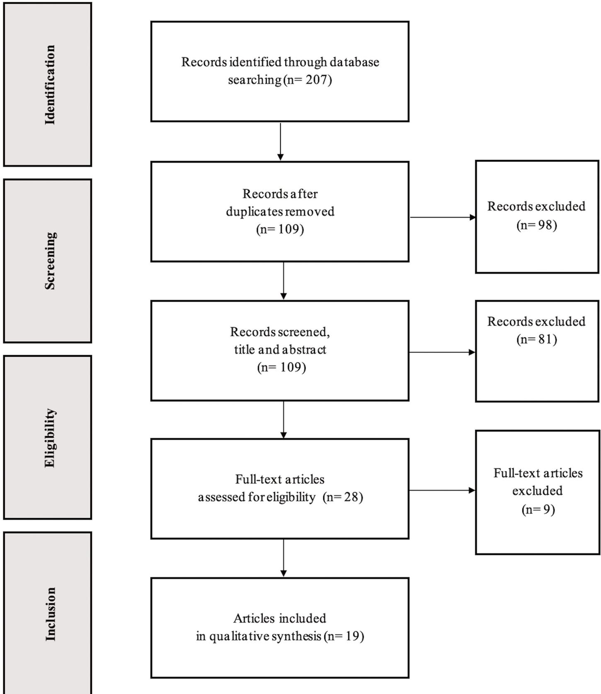

RESEARCH ARTICLE

# Electromyographic activity in deadlift exercise and its variants. A systematic review

Isabel Martı´n-FuentesID1☯, Jose´ M. Oliva-Lozano1☯, Jose´ M. MuyorID1,2☯¤ \*

1 Health Research Centre, University of Almerı´a, Almerı´a, Spain, 2 Laboratory of Kinesiology, Biomechanics and Ergonomics (KIBIOMER Lab.), Research Central Services, University of Almerı´a, Almerı´a, Spain

☯ These authors contributed equally to this work.

¤ Current address: University of Almerı´a, Faculty of Educational Sciences, Almerı´a, (Spain)

## OPEN ACCESS

Citation: Martı´n-Fuentes I, Oliva-Lozano JM, Muyor JM (2020) Electromyographic activity in deadlift exercise and its variants. A systematic review. PLoS ONE 15(2): e0229507. https://doi. org/10.1371/journal.pone.0229507

Editor: Nizam Uddin Ahamed, University of Pittsburgh, UNITED STATES

Received: September 6, 2019

Accepted: February 7, 2020

Published: February 27, 2020

Copyright: © 2020 Martı´n-Fuentes et al. This is an open access article distributed under the terms of the Creative Commons Attribution License, which permits unrestricted use, distribution, and reproduction in any medium, provided the original author and source are credited.

Data Availability Statement: All relevant data are within the paper and its Supporting Information files

Funding: This work was supported by the Proyectos I+D +I Ministerio de Economı´a y Competitividad. Gobierno de España. Referencia: DEP 2016-80296-R (AEI/FEDER, UE). Isabel Martı´n-Fuentes was supported by a scholarship funded by the Spanish Ministry of Science, Innovation and Universities (FPU17/03787) Jose´ M. Oliva-Lozano was supported by a scholarship

\* josemuyor@ual.es

## Abstract

The main purpose of this review was to systematically analyze the literature concerning studies which have investigated muscle activation when performing the Deadlift exercise and its variants. This study was conducted according to the Preferred Reporting Items for Systematic Reviews and Meta-Analysis Statement (PRISMA). Original studies from incep tion until March 2019 were sourced from four electronic databases including PubMed, OVID, Scopus and Web of Science. Inclusion criteria were as follows: (a) a cross-sectional or longitudinal study design; (b) evaluation of neuromuscular activation during Deadlift exercise or variants; (c) inclusion of healthy and trained participants, with no injury issues at least for six months before measurements; and (d) analyzed “sEMG amplitude”, “muscle activation” or “muscular activity” with surface electromyography (sEMG) devices. Major findings indicate that the biceps femoris is the most studied muscle, followed by gluteus maximus, vastus lateralis and erector spinae. Erector spinae and quadriceps muscles reported greater activation than gluteus maximus and biceps femoris muscles during Deadlift exercise and its variants. However, the Romanian Deadlift is associated with lower activation for erector spinae than for biceps femoris and semitendinosus. Deadlift also showed greater activation of the quadriceps muscles than the gluteus maximus and hamstring muscles. In general, semitendinosus muscle activation predominates over that of biceps femoris within hamstring muscles complex. In conclusion 1) Biceps femoris is the most evaluated muscle, followed by gluteus maximus, vastus lateralis and erector spinae during Deadlift exercises; 2) Erector spinae and quadriceps muscles are more activated than gluteus maximus and biceps femoris muscles within Deadlift exercises; 3) Within the hamstring muscles complex, semitendinosus elicits slightly greater muscle activation than biceps femoris during Deadlift exercises; and 4) A unified criterion upon methodology is necessary in order to report reliable outcomes when using surface electromyography recordings.

## Introduction

Resistance training provides several health benefits related to enhancing muscle strength, reversing muscle loss, reducing body fat, improving cardiovascular health, enhancing mental

funded by the Spanish Ministry of Science, Innovation and Universities (FPU18/04434).

Competing interests: The authors have declared that no competing interests exist.

## Abbreviations:

Exercises abbreviations: BallPro, walk-in machine deadlift with feet ball-hand; DL, deadlift; EB, elastic bands; FW, free weights; ToePro, walk-in machine deadlift with toes-hand; 1RM, 1 repetition maximum.

Other abbreviations: Conc, concentric phase; eccen, eccentric phase; ISOpull, isometric pulls; mV, microvolts; RM, repetition maximum; RMS, root mean square; ROM, range of motion; sEMG, surface electromyography.

health and increasing bone mineral density [1–6]. Accordingly, resistance training should be considered essential for the whole population, but it is even more relevant when the target is the transference into some specific activity or daily life tasks [7, 8], injury prevention [9] or maximizing sports performance [10].

Free-weight resistance training is already well known as a key point in every strength training program [11–13]. In categories of creating diverse stimulus for muscle groups, different modalities such as barbell, kettlebells, hexagonal bars or dumbbells devices are typical recurring resources for coaches and trainers [14, 15]. Besides, other implements which can considerably modify the exercise load profile are elastic bands [2, 25], chains [29] or Fat Gripz devices [24].

It is essential to be acquainted with which muscles are activated during certain exercises and to compare different movement patterns when choosing exercises for a concrete objective [16]. Surface electromyography (sEMG) is one of the main tools used to measure muscle activation, and it can be defined as an electrophysiological recording technology used for the detection of the electric potential crossing muscle fiber membranes [17]. Thereby, task-specific data regarding motor unit recruitment patterns are reported through sEMG. For instances, athletes have the possibility to perform a concrete exercise when targeting a particular muscle [18, 19].

Deadlift, Squat and Bench Press are basic resistance exercises performed in several training programs for improving physical fitness in athletes [20]. This explains the great interest in studying muscle activation, which also translates these movements into some of the most investigated exercises in the current literature using sEMG [14, 21, 22]. Deadlift is frequently performed primarily when the goal is the strengthening of thigh and posterior chain muscles; specifically gluteus, hamstrings, erector spinae and quadriceps [23, 24]. Thus, Deadlift is classified as one of the most typical resistance exercise for posterior lower limb strengthening, as well as its variants [25]. Moreover, Deadlift has been mentioned in numerous studies comparing this exercise with other variants such as Stiff Leg Deadlift [26], Hexagonal Bar Deadlift [22] or Romanian Deadlift [27]. It has also been contrasted with other less popular variants such as Sumo Deadlift [13], unstable devices [28] and elastic bands Deadlift [8], among others.

To the best of our knowledge, there is no comprehensive review of the current literature concerning Deadlift movement pattern, and there is significant controversy when determining which muscles are involved within each Deadlift variants. For instance, the greatest muscle activation has been reported for the biceps femoris compared with the erector spinae and gluteus maximus during Deadlift [8], whereas Snyder et al. (2017) found greater erector spinae activation in comparison with gluteus maximus and biceps femoris. In contrast, Andersen et al. (2018) reported maximal activation for biceps femoris versus gluteus maximus and erec tor spinae for the same tested movement.

Thus, the main purpose of this manuscript was to systematically review the current literature investigating muscle activation measured with sEMG of muscles recruited when perform ing the Deadlift exercise and all its best-known variants. An increased understanding of the muscle activation that occur during these exercises will provide the researcher, clinician and athletes with relevant information about the use of the best exercise to activate a specific muscle or group of muscles associated with the Deadlift and its variants.

## Methods

This systematic review was reported and developed following the Preferred Reporting of Sys tematic Reviews and Meta-Analysis (PRISMA) guidelines [29, 30]. The protocol for this systematic review was registered on PROSPERO (CRD42019138026) and is available in full on the National Institute for Health Research (https://www.crd.york.ac.uk/prospero/display\_ record.php?ID=CRD42019138026). The quality of included studies was assessed by two reviewers using the PEDro quality scale, which consists on eleven questions and distributes the score proportionally to the total amount of questions included. However, due to the inability to blind researchers and trainees, three of eleven questions were excluded from the scale resulting in a maximum of eight [17].

A literature search of PubMed, OVID, Scopus & Web of Science electronic databases was performed from March–April 2019. Reviews included publications from inception until March 2019.

The search strategy conducted in the different databases, along with Medical Subject Heading (MeSH) descriptors, related terms and keywords used were as follows; (a) PubMed & OVID: (deadlift OR "dead-lift" OR "romanian deadlift" OR "stiff-leg deadlift" OR "barbell deadlift" OR "hexagonal bar deadlift" OR "hip hinge" OR "hip extension") AND ("resistance training" OR "strength training" OR "resistance exercise" OR "weight lifting" OR "weight bearing") AND ("muscular activity" OR "muscle activation" OR electromyography OR electromyo graphical OR electromyographic OR electromyogram OR "surface electromyography" OR semg OR EMG) (b) Scopus: (TITLE("deadlift" OR "dead-lift" OR "romanian deadlift" OR "stiff-leg deadlift" OR "barbell deadlift" OR "hexagonal bar deadlift" OR "hip hinge" OR "hip extension") AND ("resistance training" OR "strength training" OR "resistance exercise" OR "weight lifting" OR "weight bearing") AND ("muscular activity" OR "muscle activation" OR "electromyography" OR "electromyograpical" OR "electromyographic" OR "electromyogram" OR "surface electromyography" OR "sEMG" OR "EMG")); (c) Web of Science: ALL = (((deadlift� OR "dead-lift"� OR "romanian deadlift"� OR "stiff-leg deadlift"� OR "barbell deadlift"� OR "hexagonal bar deadlift"� OR "hip hinge"� OR "hip extension"�) AND ("resistance training"� OR "strength training"� OR "resistance exercise"� OR "weight lifting"� OR "weight bearing"�) AND ("muscular activity"� OR "muscle activation"� OR electromyograpical� OR electromyographic� OR electromyogram� OR "surface electromyography"� OR semg� OR EMG�))).

Studies were included if they met the following criteria:

i. cross-sectional or longitudinal (experimental or cohorts) study design;

ii. evaluated neuromuscular activation during Deadlift exercise or variants;

iii. included healthy and trained participants, with no injuries for at least six months before measurements;

iv. analyzed “sEMG amplitude”, “muscle activation” or “muscular activity” with surface electromyography devices (sEMG);

Most articles found were written in English, but there were no language restrictions. Reviews, congress publications, theses, books, books chapters, abstracts, and studies with poor protocol description or insufficient data were not included. Studies whose participants did not have at least six months of resistance training experience were excluded. We also excluded all studies in which participants were under eighteen years old due to underdevelopment of strength and coordination [31]. Studies reporting muscle activation only from upper limbs during Deadlift exercise were also considered.

As different terms are related to the same concept, in categories of unifying criteria, the “muscle activation” term will be used when referring to “sEMG amplitude”, “muscle excitation”, “muscle activity”, “neuromuscular activity” or similar.

Articles were selected by two independent reviewers according to inclusion and exclusion criteria. After eliminating duplicates, the titles and abstracts were analyzed and if there was not enough information, the full text was evaluated. All studies identified from the database searches were downloaded into the software EndNote version X9 (Clarivate Analytics, New York, NY, USA).

Every decision was approved by both reviewers. However, a third reviewer was consulted in case of disagreement. The whole search process took two weeks. All steps taken are thoroughly described in the flow chart (Fig 1).

During the data extraction process, the following information was collected from every study: reference, exercise-movements measured, sample size (n), gender, age (years), experience (years), evaluated muscles, electrodes location, limb tested (non-dominant/dominant), sEMG collection method, sEMG normalization method, outcomes, percentage maximal voluntary isometric contraction (% MVIC), and main findings.

Muscle activation was the main data gathered, dividing eccentric and concentric sEMG activity data when reported. All studies finally selected reported muscle activation of every muscle and exercise separately. Furthermore, data related to exercise loading and exercise description details were collected.

Data collected in this review could not be analyzed as a meta-analysis since there was not enough homogeneity in terms of the type of analysis and methods carried out amongst studies. Therefore, a qualitative review of the results was conducted.

## Results

## Search results

A total of 207 articles were identified from an initial survey executed by two independent reviewers. 98 of these articles were duplicated, which led to a remaining amount of 109 in the process. The next step involved reading the title and abstract with the purpose of eliminating all those not meeting the inclusion criteria. Finally, twenty-eight articles were fully read, and nineteen of these were eventually selected for the review (Fig 1). The publication date of all selected articles ranged from 2002 to January 2019. Additionally, all studies were categorized as having a good/excellent quality in the methodological process based on the PEDro quality scale.

All selected articles presented a cross-sectional design. In fact, most experimental studies found used an untrained participant sample, so they were excluded. Regarding experience time, all participants had at least six months of previous resistance training experience, although some studies did not report the exact experience time of participants (Table 1).

No common criteria were followed when referring to the exercise loading at which exercises were evaluated during sEMG recordings. As a matter of fact, only two studies used a similar method, assessing one repetition maximum intensity (1RM) [22, 32]. Some studies measured a number of repetitions of xRM, whereas others measured a number of repetitions of a range between 65–85% of 1RM (Table 1), which could be considered in all cases as a submaximal load intensity [33].

Data regarding the studies’ general description and main findings are presented in Table 1, while Tables 2–5 contain data referring to muscle activation during Deadlift exercise and/or its variants. We found no unified criteria for the sEMG normalization method. Out of all included studies, seven reported data description regarding muscle activation in relation to exercise type and normalized sEMG activity as a percentage of maximal voluntary isometric contraction (% MVIC) (Table 2); three of them as percentage of peak root mean square (% peak RMS) (Table 3); two studies reported data expressed as absolute RMS values in microvolts (mV) (Table 4); and three studies expressed data as a percentage of 1 repetition maximum (% 1RM) (Table 5). In addition, there were four studies which were not included in the tables because they assessed the sEMG only from the upper limbs or showed the muscle activation in a different measurement unit than that used in our analysis [28, 32, 34, 35].

  
Fig 1. Flowchart.  
https://doi.org/10.1371/journal.pone.0229507.g001

Table 1. Data gathered from selected articles regarding intervention, sample size, gender, training experience, age, sEMG collection method, outcomes and main findings.
<table><tr><td colspan="1" rowspan="1">Reference</td><td colspan="1" rowspan="1">Exercises tested</td><td colspan="1" rowspan="1">Sample</td><td colspan="1" rowspan="1">Age (years)</td><td colspan="1" rowspan="1">Experience(years)</td><td colspan="1" rowspan="1">sEMGcollectionmethod</td><td colspan="1" rowspan="1">Activity sEMG recorded ofmuscles:</td><td colspan="1" rowspan="1">Main findings</td></tr><tr><td colspan="1" rowspan="1">Krings et al.(2019) [32</td><td colspan="1" rowspan="1">Deadlift versus fat gripzdeadlift</td><td colspan="1" rowspan="1">15 Men</td><td colspan="1" rowspan="1">22.4 ± 2.4</td><td colspan="1" rowspan="1">Notindicated</td><td colspan="1" rowspan="1">1 rep 1RM</td><td colspan="1" rowspan="1">Biceps brachialis, tricepsbraquialis and forearm muscles</td><td colspan="1" rowspan="1">Greater forearm activation andsignificant decrease in 1RMduring fat gripz deadlift</td></tr><tr><td colspan="1" rowspan="1">Andersenet al. (2019)[8]</td><td colspan="1" rowspan="1">Deadlift versus FW-2EBand FW-4EB</td><td colspan="1" rowspan="1">15 Men</td><td colspan="1" rowspan="1">23.3 ± 2.2</td><td colspan="1" rowspan="1">3.9 ± 1.9</td><td colspan="1" rowspan="1">2 reps 2RM</td><td colspan="1" rowspan="1">Gluteus maximus, vastuslateralis, biceps femoris,semitendinosus and erectorspinae</td><td colspan="1" rowspan="1">Greater erector spinae activationwhen more elastic bands added</td></tr><tr><td colspan="1" rowspan="1">McCurdyet l. (2018)40]</td><td colspan="1" rowspan="1">Stiff leg deadlift versusback squat and modifiedsingle leg squat</td><td colspan="1" rowspan="1">18Women</td><td colspan="1" rowspan="1">20.9 ± 1.1</td><td colspan="1" rowspan="1">1-5 years</td><td colspan="1" rowspan="1">3 rep with8RM</td><td colspan="1" rowspan="1">Gluteus maximus andhamstrings</td><td colspan="1" rowspan="1">Greater gluteus maximusactivation than hamstrings forall exercises. Modified single legsquat elicited the greatestactivation</td></tr><tr><td colspan="1" rowspan="1">Lee et al.(2018) [27]</td><td colspan="1" rowspan="1">Deadlift versusRomanian deadlift</td><td colspan="1" rowspan="1">21 Men</td><td colspan="1" rowspan="1">22.4 ± 2.2</td><td colspan="1" rowspan="1">&gt; 3 years</td><td colspan="1" rowspan="1">5 rep 70% ofRD1RM</td><td colspan="1" rowspan="1">Gluteus maximus, rectusfemoris and biceps femoris</td><td colspan="1" rowspan="1">Greater gluteus maximus andrectus femoris activation fordeadlift</td></tr><tr><td colspan="1" rowspan="1">Korak et al.(2018) [39]</td><td colspan="1" rowspan="1">Deadlift versus paralellback squat and paralellfront squat</td><td colspan="1" rowspan="1">13Women</td><td colspan="1" rowspan="1">22.8 ± 3.1</td><td colspan="1" rowspan="1">&gt; 1 year</td><td colspan="1" rowspan="1">3 reps 75%1RM</td><td colspan="1" rowspan="1">Gluteus maximus, bicepsfemoris, vastus medialis, vastuslateralis and rectus femoris</td><td colspan="1" rowspan="1">Greater gluteus maximusactivation during front and backsquat in comparison to deadlift</td></tr><tr><td colspan="1" rowspan="1">Edingtonet l. (2018)35]</td><td colspan="1" rowspan="1">ISOMETRIC: close-bardeadlift versus far-bardeadlift</td><td colspan="1" rowspan="1">5 men &amp;5 women</td><td colspan="1" rowspan="1">32 ± 10</td><td colspan="1" rowspan="1">6.05 ± 3.35</td><td colspan="1" rowspan="1">3 trials inboth startingpositions.I SOpull</td><td colspan="1" rowspan="1">Gluteus maximus, bicepsfemoris, vastus lateralis, erectorspinae and latissimus dorsi</td><td colspan="1" rowspan="1">Greater erector spinae andbiceps femoris activation thanthe rest of muscles for bothexercises. Greater vastus lateralisactivation during far-bar deadlift</td></tr><tr><td colspan="1" rowspan="1">Andersenet al. (2018)22]</td><td colspan="1" rowspan="1">Deadlift versushexagonal bar deadliftand hip thrust</td><td colspan="1" rowspan="1">13 Men</td><td colspan="1" rowspan="1">21.9 ± 1.6</td><td colspan="1" rowspan="1">4.5 ± 1.9</td><td colspan="1" rowspan="1">1 rep 1RM</td><td colspan="1" rowspan="1">Gluteus maximus, bicepsfemoris and erector spinae</td><td colspan="1" rowspan="1">Greater biceps femorisactivation during deadlift.Greater gluteus maximusactivation during hip thrust.Erector spinae activation showedno differences among exercises</td></tr><tr><td colspan="1" rowspan="1">Snyder et al.(017) [36]</td><td colspan="1" rowspan="1">Deadlift versus walk-indeadlift machine (2different feet positions)</td><td colspan="1" rowspan="1">2 women&amp; 13men</td><td colspan="1" rowspan="1">18-24</td><td colspan="1" rowspan="1">Notindicated</td><td colspan="1" rowspan="1">3 reps 80%3RM</td><td colspan="1" rowspan="1">Gluteus maximus, bicepsfemoris, vastus lateralis anderector spinae</td><td colspan="1" rowspan="1">Greater erector spinae activationduring deadlift. Greater gluteusmaximus and lower vastuslateralis activation duringdeadlift compared to walk-inmachine deadlifts</td></tr><tr><td colspan="1" rowspan="1">Iversen et al.0 07) [41]</td><td colspan="1" rowspan="1">Stiff leg deadlift versusstiff leg deadlift withelastic bands</td><td colspan="1" rowspan="1">17 men&amp; 12women</td><td colspan="1" rowspan="1">25 ± 3 men25 ± 2women</td><td colspan="1" rowspan="1">Notindicated</td><td colspan="1" rowspan="1">3 reps 10RM</td><td colspan="1" rowspan="1">Gluteus maximus, bicepsfemoris, semitendinosus, vastusmedialis, vastus lateralis, rectusfemoris, erector spinae andexternal oblique</td><td colspan="1" rowspan="1">Greater activation for all musclesduring conventional resistanceexercises compared to elasticband deadlifts. Rectus femorisshowed no differences activationamong exercises</td></tr><tr><td colspan="1" rowspan="1">Bourne et al.(2017) [16]</td><td colspan="1" rowspan="1">Stiff leg deadlift versusunilateral stff legdeadlift, hip hinge, 45hip extension and nordichamstring exercise</td><td colspan="1" rowspan="1">18/10Men</td><td colspan="1" rowspan="1">23.9 ± 3.1</td><td colspan="1" rowspan="1">Notindicated</td><td colspan="1" rowspan="1">6 reps 12RM</td><td colspan="1" rowspan="1">Biceps femoris andsemitendinosus</td><td colspan="1" rowspan="1">Greater semitendinosusconcentric activation duringunilateral stiff leg deadlift versusremaining exercises. Similarbiceps femoris andsemitendinosus activationduring both deadlift exercises</td></tr><tr><td colspan="1" rowspan="1">Nijem et al.(01 ) [37]</td><td colspan="1" rowspan="1">Deadlift versus deadliftwith chains</td><td colspan="1" rowspan="1">13 Men</td><td colspan="1" rowspan="1">24.0 ± 2.1</td><td colspan="1" rowspan="1">Notindicated</td><td colspan="1" rowspan="1">3 reps 85%1RM</td><td colspan="1" rowspan="1">Gluteus maximus, vastuslateralis and erector spinae</td><td colspan="1" rowspan="1">Greater gluteus maximusactivation during deadlift.Greater erector spinae activationduring the beginning of themovement for both exercises</td></tr><tr><td colspan="1" rowspan="1">Reference</td><td colspan="1" rowspan="1">Exercises tested</td><td colspan="1" rowspan="1">Sample</td><td colspan="1" rowspan="1">Age (years)</td><td colspan="1" rowspan="1">Experience(years)</td><td colspan="1" rowspan="1">sEMGcollectionmmethod</td><td colspan="1" rowspan="1">Activity sEMG recorded ofmuscles:</td><td colspan="1" rowspan="1">Main findings</td></tr><tr><td colspan="1" rowspan="1">Camara et al.2016) 38]</td><td colspan="1" rowspan="1">Deadlift versushexagonal bar deadlift</td><td colspan="1" rowspan="1">20 Men</td><td colspan="1" rowspan="1">23.3 ± 2.1</td><td colspan="1" rowspan="1">&gt; 1 year</td><td colspan="1" rowspan="1">3 reps 65%1RM &amp; 3 reps85% 1RM</td><td colspan="1" rowspan="1">Biceps femoris, vastus lateralisand erector spinae</td><td colspan="1" rowspan="1">Greater vastus lateralisactivation; and lower bicepsfemoris and erector spinaeactivation during hexagonal bardeadlift</td></tr><tr><td colspan="1" rowspan="1">Schoenfeldet al. (2015)[42]</td><td colspan="1" rowspan="1">Stiff leg deadlift versusprone lying leg curl inmachine</td><td colspan="1" rowspan="1">10 Men</td><td colspan="1" rowspan="1">23.5 ± 3.1</td><td colspan="1" rowspan="1">4.6 ± 2.2</td><td colspan="1" rowspan="1">1 set 8RM</td><td colspan="1" rowspan="1">Biceps femoris andsemitendinosus</td><td colspan="1" rowspan="1">Greater upper biceps femorisand upper semitendinosusactivation during stiff legdeadlift</td></tr><tr><td colspan="1" rowspan="1">McAllisteret al. (2014)44]</td><td colspan="1" rowspan="1">Romanian deadlift versusglute ham-raise, goodmorning and prone legcurl</td><td colspan="1" rowspan="1">12 Men</td><td colspan="1" rowspan="1">27.1 ± 7.7</td><td colspan="1" rowspan="1">8.6 ± 5.5</td><td colspan="1" rowspan="1">85% 1RM</td><td colspan="1" rowspan="1">Gluteus medius, biceps femoris,semitendinosus, erector spinaeand medial gastrocnemius</td><td colspan="1" rowspan="1">Greater semitendinosusactivation than biceps femorisand erector spinae activation forall exercises</td></tr><tr><td colspan="1" rowspan="1">Bezerra et al.(2013) [26]</td><td colspan="1" rowspan="1">Deadlift versus stiff legdeadlift</td><td colspan="1" rowspan="1">14 Men</td><td colspan="1" rowspan="1">26.7 ± 4.9</td><td colspan="1" rowspan="1">&gt; 2 years</td><td colspan="1" rowspan="1">3 reps 70%1M</td><td colspan="1" rowspan="1">Biceps femoris, vastus lateralis,lumbar multifidus, anteriortibialis and medialgastrocnemius</td><td colspan="1" rowspan="1">Greater vastus lateralisactivation during deadlift.Greater medial gastrocnemiusactivation during stiff legdeadlift</td></tr><tr><td colspan="1" rowspan="1">Chulvi-Medranoet al. (2010)[28]</td><td colspan="1" rowspan="1">Deadlift versus Bosudeadlift and T-Bowdevice deadlift</td><td colspan="1" rowspan="1">31</td><td colspan="1" rowspan="1">24.2 ± 0.4</td><td colspan="1" rowspan="1">&gt; 1 year</td><td colspan="1" rowspan="1">Dinamiceffort, 6 reps70% of MVIC</td><td colspan="1" rowspan="1">Lumbar multifidus, thoracicmultifidus, lumbar spinae andthoracic spinae</td><td colspan="1" rowspan="1">Greater overall activation duringdeadlift versus Bosu and T-Bowdevice deadlifts</td></tr><tr><td colspan="1" rowspan="1">Ebben (2009)[43]</td><td colspan="1" rowspan="1">Stiff leg deadlift versusunilateral stiff legdeadlift, good morning,seated leg curl, nordichamstring exercise andsquat</td><td colspan="1" rowspan="1">21 men&amp; 13women</td><td colspan="1" rowspan="1">20.3 ± 1.7</td><td colspan="1" rowspan="1">Notindicated</td><td colspan="1" rowspan="1">2 reps 6RM</td><td colspan="1" rowspan="1">Rectus femoris and hamstrings</td><td colspan="1" rowspan="1">Greater biceps femorisactivation during seated leg curland nordic hamstring thanremaining exercises. Greaterrectus femoris activation duringsquat</td></tr><tr><td colspan="1" rowspan="1">Hamlyn et al.(2007) [34]</td><td colspan="1" rowspan="1">Deadlift versus paralellsquat</td><td colspan="1" rowspan="1">8 men &amp;8 women</td><td colspan="1" rowspan="1">24.1 ± 6.8</td><td colspan="1" rowspan="1">Notindicated</td><td colspan="1" rowspan="1">6 reps 80%1RM</td><td colspan="1" rowspan="1">Lower abdominal, externaloblique, lumbar-sacral erectorspinae and upper lumbarerector spinae</td><td colspan="1" rowspan="1">Greater upper lumbar erectorspinae activation during deadlift</td></tr><tr><td colspan="1" rowspan="1">Escamillaet al. (2002)[13]</td><td colspan="1" rowspan="1">Deadlift versus sumodeadlift (both with/without belt)</td><td colspan="1" rowspan="1">13 Men</td><td colspan="1" rowspan="1">20.1 ± 1.3</td><td colspan="1" rowspan="1">Notindicated</td><td colspan="1" rowspan="1">4 reps 12 RM</td><td colspan="1" rowspan="1">Gluteus maximus, bicepsfemoris, vastus medialis, vastuslateralis, rectus femoris, lateraland medial gastrocnemius,tibialis anterior, L3, T12, medialand upper trapezius, rectusabdominis and external oblique</td><td colspan="1" rowspan="1">Greater vastus medialis, vastuslateralis and tibialis anterioractivation during sumo deadlift.Greater medialis gastrocnemiusactivation during deadlift.Greater rectus abdominisactivation during belt deadliftand belt sumo deadlift</td></tr></table>

Exercises abbreviations: EB, elastic bands; FW, free weights.  
Other abbreviations: ISOpull, isometric pulls; MVIC, maximal voluntary isometric contraction; reps, repetitions; RM, repetition maximum; ROM, range of motion.  
https://doi.org/10.1371/journal.pone.0229507.t001

Most researched Deadlift variants include the Conventional Barbell Deadlift (10/19 studies) [8, 13, 22, 27, 28, 32, 36–39] and the Stiff Leg Deadlift (6/19 studies) [16, 35, 40–43], which are followed by Unilateral Stiff Leg Deadlift (2/19 studies) [16, 43], Romanian Deadlift (2/19 studies) [27, 44] and Hexagonal Bar Deadlift (2/19 studies) [22, 38] (Table 1).

It is also important to clarify that exercises such as “Olympic Barbell Deadlift”, “Straight Bar Deadlift”, “Barbell Deadlift”, “No Chains Deadlift” and “Conventional Barbell Deadlift” all refer to the same exercise, so “Deadlift” will be used for all cases.

Table 2. Data description regarding sEMG activity in each study, in relation to exercise type and normalized sEMG activation expressed as mean or peak % MVIC.
<table><tr><td rowspan=1 colspan=1>Reference</td><td rowspan=1 colspan=1>Exercise</td><td rowspan=1 colspan=1>Gluteus Maximus</td><td rowspan=1 colspan=1>BicepsFemoris</td><td rowspan=1 colspan=1>Semitendinosus</td><td rowspan=1 colspan=1>Hamstrings</td><td rowspan=1 colspan=1>VastusLateralis</td><td rowspan=1 colspan=1>VastusMedialis</td><td rowspan=1 colspan=1>RectusFemoris</td><td rowspan=1 colspan=1>ErectorSpinae</td></tr><tr><td rowspan=1 colspan=1>McCurdyet al. (2018)40]</td><td rowspan=1 colspan=1>Stiff legdeadlift</td><td rowspan=1 colspan=1>51.1 ± 22.1%mean conc29.9 ± 16.2%mean eccen</td><td rowspan=1 colspan=1>n/a</td><td rowspan=1 colspan=1>n/a</td><td rowspan=1 colspan=1>39.8 ± 16.6%mean conc19.9 ± 11.3%mean eccen</td><td rowspan=1 colspan=1>n/a</td><td rowspan=1 colspan=1>n/a</td><td rowspan=1 colspan=1>n/a</td><td rowspan=1 colspan=1>n/a</td></tr><tr><td rowspan=2 colspan=1>Anderseneal. (2018)[22]</td><td rowspan=1 colspan=1>Deadlift</td><td rowspan=1 colspan=1>~95% mean</td><td rowspan=1 colspan=1>~108%mean</td><td rowspan=1 colspan=1>n/a</td><td rowspan=1 colspan=1>n/a</td><td rowspan=1 colspan=1>n/a</td><td rowspan=1 colspan=1>n/a</td><td rowspan=1 colspan=1>n/a</td><td rowspan=1 colspan=1>~86% mean</td></tr><tr><td rowspan=1 colspan=1>Hexagonal bardeadlift (HDL)</td><td rowspan=1 colspan=1>~88% mean</td><td rowspan=1 colspan=1>~83% mean</td><td rowspan=1 colspan=1>n/a</td><td rowspan=1 colspan=1>n/a</td><td rowspan=1 colspan=1>n/a</td><td rowspan=1 colspan=1>n/a</td><td rowspan=1 colspan=1>n/a</td><td rowspan=1 colspan=1>~82% mean</td></tr><tr><td rowspan=2 colspan=1>Iversen et al.(0117) ([41]</td><td rowspan=1 colspan=1>Stiff legdeadlift</td><td rowspan=1 colspan=1>~42% peak conc~17% peak eccent</td><td rowspan=1 colspan=1>∼38% peakconc ~17%peak eccent</td><td rowspan=1 colspan=1>~44% peak conc~22% peak eccent</td><td rowspan=1 colspan=1>n/a</td><td rowspan=1 colspan=1>∼13% peakconc14%peak eccent</td><td rowspan=1 colspan=1>∼10% peakconc ~9%peak eccent</td><td rowspan=1 colspan=1>∼6% peakconc ~7%peak eccent</td><td rowspan=1 colspan=1>~69% peakconc ~38%peak eccent</td></tr><tr><td rowspan=1 colspan=1>Stiff legdeadlift withelastic bands</td><td rowspan=1 colspan=1>~27% peak conc~17% peak eccent</td><td rowspan=1 colspan=1>~20% peakconc ~17%peak eccent</td><td rowspan=1 colspan=1>~23% peak conc~21% peak eccent</td><td rowspan=1 colspan=1>n/a</td><td rowspan=1 colspan=1>~12% peakconc ~14%peak eccent</td><td rowspan=1 colspan=1>~9% peakconc ~8%peak eccent</td><td rowspan=1 colspan=1>~5% peakconc ~6%peak eccent</td><td rowspan=1 colspan=1>∼57% peakconc ~36%peak eccent</td></tr><tr><td rowspan=2 colspan=1>Bourne et al.(2017) [16]</td><td rowspan=1 colspan=1>Stiff llegdealift</td><td rowspan=1 colspan=1>n/a</td><td rowspan=1 colspan=1>~55% meanconc ~23%mean eccen</td><td rowspan=1 colspan=1>~50% mean conc~18% mean eccen</td><td rowspan=1 colspan=1>n/a</td><td rowspan=1 colspan=1>n/a</td><td rowspan=1 colspan=1>n/a</td><td rowspan=1 colspan=1>n/a</td><td rowspan=1 colspan=1>n/a</td></tr><tr><td rowspan=1 colspan=1>Unilateral stiffleg deadlift</td><td rowspan=1 colspan=1>n/a</td><td rowspan=1 colspan=1>~50% meanconc ~26%mean eccen</td><td rowspan=1 colspan=1>~62% mean conc~27% mean eccen</td><td rowspan=1 colspan=1>n/a</td><td rowspan=1 colspan=1>n/a</td><td rowspan=1 colspan=1>n/a</td><td rowspan=1 colspan=1>n/a</td><td rowspan=1 colspan=1>n/a</td></tr><tr><td rowspan=1 colspan=1>Schoenfeldet al. (2015)[42]</td><td rowspan=1 colspan=1>Stifflegdeadlift</td><td rowspan=1 colspan=1>n/a</td><td rowspan=1 colspan=1>~40% meanlower ~73%mean upper</td><td rowspan=1 colspan=1>~47% mean lower~125% mean upper</td><td rowspan=1 colspan=1>n/a</td><td rowspan=1 colspan=1>n/a</td><td rowspan=1 colspan=1>n/a</td><td rowspan=1 colspan=1>n/a</td><td rowspan=1 colspan=1>n/a</td></tr><tr><td rowspan=3 colspan=1>Ebben (2009)[4]</td><td rowspan=1 colspan=1>Stiff legdeadlift</td><td rowspan=1 colspan=1>n/a</td><td rowspan=1 colspan=1>n/a</td><td rowspan=1 colspan=1>n/a</td><td rowspan=1 colspan=1>49±27% mean</td><td rowspan=1 colspan=1>n/a</td><td rowspan=1 colspan=1>n/a</td><td rowspan=1 colspan=1>n/a</td><td rowspan=1 colspan=1>n/a</td></tr><tr><td rowspan=1 colspan=1>Unilateral stiffleg deadlift</td><td rowspan=1 colspan=1>n/a</td><td rowspan=1 colspan=1>n/a</td><td rowspan=1 colspan=1>n/a</td><td rowspan=1 colspan=1>48±39% mean</td><td rowspan=1 colspan=1>n/a</td><td rowspan=1 colspan=1>n/a</td><td rowspan=1 colspan=1>n/a</td><td rowspan=1 colspan=1>n/a</td></tr><tr><td rowspan=1 colspan=1>Goodmorning</td><td rowspan=1 colspan=1>n/a</td><td rowspan=1 colspan=1>n/a</td><td rowspan=1 colspan=1>n/a</td><td rowspan=1 colspan=1>43±16% mean</td><td rowspan=1 colspan=1>n/a</td><td rowspan=1 colspan=1>n/a</td><td rowspan=1 colspan=1>n/a</td><td rowspan=1 colspan=1>n/a</td></tr><tr><td rowspan=1 colspan=1>Escamillaet al. (2002)</td><td rowspan=1 colspan=1>Deadlift</td><td rowspan=1 colspan=1>35±27% mean</td><td rowspan=1 colspan=1>28±19%mean</td><td rowspan=1 colspan=1>27±23% mean</td><td rowspan=1 colspan=1>n/a</td><td rowspan=1 colspan=1>40±22%mean</td><td rowspan=1 colspan=1>36±25%mean</td><td rowspan=1 colspan=1>19±16%mean</td><td rowspan=1 colspan=1>n/a</td></tr><tr><td rowspan=1 colspan=1>[13]</td><td rowspan=1 colspan=1>Sumo deadlift</td><td rowspan=1 colspan=1>37±28% mean</td><td rowspan=1 colspan=1>29±19%mean</td><td rowspan=1 colspan=1>31±23% mean</td><td rowspan=1 colspan=1>n/a</td><td rowspan=1 colspan=1>48±24%mean</td><td rowspan=1 colspan=1>44±27%mean</td><td rowspan=1 colspan=1>18±13%mean</td><td rowspan=1 colspan=1>n/a</td></tr></table>

Conc, concentric phase; eccen, eccentric phase.  
https://doi.org/10.1371/journal.pone.0229507.t002

## Concentric and eccentric phases

Generally, studies analyzing electromyographical data assess muscle activation on each repetition, treating it as a single unit. Nonetheless, it has been reported that electromyographical activity could differ significantly between concentric and eccentric phases of the movement. Therefore, some authors have already carried out this division in their research [45–47]. Not all studies included in the current review divided sEMG exercises into concentric and eccentric phases. In fact, only seven studies performed such a subdivision [16, 28, 34, 37, 38, 40, 41], in which the concentric phase showed greater muscle activation than the eccentric phase for every single case.

## Muscle activation

The biceps femoris has been the most investigated muscle in terms of sEMG for the Deadlift exercise and its variants (13/19 studies). Gluteus maximus is the next muscle most evaluated (10/19) followed by vastus lateralis and erector spinae muscles (9/19). The semitendinosus and rectus femoris are positioned in fourth position (5/19) followed by vastus medialis, external oblique and medial gastrocnemius (3/19) (Table 1).

Table 3. Data description regarding sEMG activity in each study, in relation to exercise type and normalized sEMG activation expressed as % peak RMS.
<table><tr><td rowspan=1 colspan=1>Reference</td><td rowspan=1 colspan=1>Exercise</td><td rowspan=1 colspan=1>Gluteus maximus</td><td rowspan=1 colspan=1>Biceps Femoris</td><td rowspan=1 colspan=1>Vastus Lateralis</td><td rowspan=1 colspan=1>Rectus Femoris</td><td rowspan=1 colspan=1>ErectorSpinae</td><td rowspan=1 colspan=1>Lumbar Multifidus</td></tr><tr><td rowspan=2 colspan=1>Lee et al. (2018)[27]</td><td rowspan=1 colspan=1>Deadlift</td><td rowspan=1 colspan=1>51.52 ± 6.0 peakRMS</td><td rowspan=1 colspan=1>57.45 ± 6.34% peakRMS</td><td rowspan=1 colspan=1>n/a</td><td rowspan=1 colspan=1>58.57 ± 13.73% peakRMS</td><td rowspan=1 colspan=1>n/a</td><td rowspan=1 colspan=1>n/a</td></tr><tr><td rowspan=1 colspan=1>Romaniandeadlift</td><td rowspan=1 colspan=1>46.88 ± 7.39% peakRMS</td><td rowspan=1 colspan=1>56.66 ± 18.56% peakRMS</td><td rowspan=1 colspan=1>n/a</td><td rowspan=1 colspan=1>25.26 ± 14.21% peakRMS</td><td rowspan=1 colspan=1>n/a</td><td rowspan=1 colspan=1>n/a</td></tr><tr><td rowspan=3 colspan=1>Snyder et al.(2017) [36]</td><td rowspan=1 colspan=1>Deadlift</td><td rowspan=1 colspan=1>~47% peak RMS</td><td rowspan=1 colspan=1>~28% peak RMS</td><td rowspan=1 colspan=1>~48% peak RMS</td><td rowspan=1 colspan=1>n/a</td><td rowspan=1 colspan=1>~73% peakRMS</td><td rowspan=1 colspan=1>n/a</td></tr><tr><td rowspan=1 colspan=1>BallPro</td><td rowspan=1 colspan=1>~30% peak RMS</td><td rowspan=1 colspan=1>~25% peak RMS</td><td rowspan=1 colspan=1>~80% peak RMS</td><td rowspan=1 colspan=1>n/a</td><td rowspan=1 colspan=1>~53% peakRMS</td><td rowspan=1 colspan=1>n/a</td></tr><tr><td rowspan=1 colspan=1>ToePro</td><td rowspan=1 colspan=1>~30% peak RMS</td><td rowspan=1 colspan=1>~31% peak RMS</td><td rowspan=1 colspan=1>~63% peak RMS</td><td rowspan=1 colspan=1>n/a</td><td rowspan=1 colspan=1>~58% peakRMS</td><td rowspan=1 colspan=1>n/a</td></tr><tr><td rowspan=2 colspan=1>Bezerra et al.(2013) [26]</td><td rowspan=1 colspan=1>Deadlift</td><td rowspan=1 colspan=1>n/a</td><td rowspan=1 colspan=1>100.1 ± 24.7% peakRMS</td><td rowspan=1 colspan=1>128.3 ± 33.9% peakRMS</td><td rowspan=1 colspan=1>n/a</td><td rowspan=1 colspan=1>n/a</td><td rowspan=1 colspan=1>112.7 ± 42.7% peakRMS</td></tr><tr><td rowspan=1 colspan=1>Stiff llegdeadlift</td><td rowspan=1 colspan=1>n/a</td><td rowspan=1 colspan=1>98.6 ± 28.5% peakRMS</td><td rowspan=1 colspan=1>101.1 ± 14.6% peakRMS</td><td rowspan=1 colspan=1>n/a</td><td rowspan=1 colspan=1>n/a</td><td rowspan=1 colspan=1>106 ± 20.5% peakRMS</td></tr></table>

BallPro, walk-in machine deadlift with feet ball-hand; RMS, root mean square; ToePro, walk-in machine deadlift with toes-hand.  
https://doi.org/10.1371/journal.pone.0229507.t003

Due to the diversity regarding methodology, it was considered appropriate to report the results by grouping the studies according to the sEMG normalization process carried out in each study (mean or peak % MVIC, % peak RMS, RMS mV or % 1RM).

Studies in which muscle activation was expressed as a mean or peak % MVIC are shown in Table 2. Erector spinae showed the greatest muscle activation during the Stiff Leg Deadlift exer cise [41], and also showed a similar muscle activation than the gluteus maximus or biceps femoris during Deadlift and Hexagonal Bar Deadlift exercises [22]. Except for the Deadlift exercise [22], the gluteus maximus showed greater muscle activation than biceps femoris [13,

Table 4. Data description regarding sEMG activity in each study, in relation to exercise type and normalized sEMG activation expressed as absolute RMS values in mV.
<table><tr><td rowspan=1 colspan=1>Reference</td><td rowspan=1 colspan=1>Exercise</td><td rowspan=1 colspan=1>Gluteusmaximus</td><td rowspan=1 colspan=1>Biceps Femoris</td><td rowspan=1 colspan=1>Semitendinosus</td><td rowspan=1 colspan=1>VastusLateralis</td><td rowspan=1 colspan=1>Erector Spinae</td></tr><tr><td rowspan=3 colspan=1>Andersen et al. (2019)[8]</td><td rowspan=1 colspan=1>Deadlift</td><td rowspan=1 colspan=1>236 RMS (mV)</td><td rowspan=1 colspan=1>312 RMS (mV)</td><td rowspan=1 colspan=1>367 RMS (mV)</td><td rowspan=1 colspan=1>239 RMS(mV)</td><td rowspan=1 colspan=1>341 RMS (mV)</td></tr><tr><td rowspan=1 colspan=1>DL FW-2EB</td><td rowspan=1 colspan=1>231 RMS (mV)</td><td rowspan=1 colspan=1>313 RMS (mV)</td><td rowspan=1 colspan=1>359 RMS (mV)</td><td rowspan=1 colspan=1>234 RMS(mV)</td><td rowspan=1 colspan=1>330 RMS (mV)</td></tr><tr><td rowspan=1 colspan=1>DL FW-4EB</td><td rowspan=1 colspan=1>250 RMS (mV)</td><td rowspan=1 colspan=1>326 RMS (mV)</td><td rowspan=1 colspan=1>375 RMS (mV)</td><td rowspan=1 colspan=1>238 RMS(mV)</td><td rowspan=1 colspan=1>357 RMS (mV)</td></tr><tr><td rowspan=4 colspan=1>McAllister et al.(2014) [44]</td><td rowspan=1 colspan=1>Romaniandeadlift</td><td rowspan=1 colspan=1>n/a</td><td rowspan=1 colspan=1>~360 RMS (mV) conc ~300 RMS(mV) eccen</td><td rowspan=1 colspan=1>~810 RMS (mV) conc ~790 RMS(mV) eccen</td><td rowspan=1 colspan=1>n/a</td><td rowspan=1 colspan=1>~210 RMS (mV)conc</td></tr><tr><td rowspan=1 colspan=1>Glute ham-raise</td><td rowspan=1 colspan=1>n/a</td><td rowspan=1 colspan=1>~380 RMS (mV) conc ~160 RMS(mV) eccen</td><td rowspan=1 colspan=1>~1180 RMS (mV) conc ~490 RMS(mV) eccen</td><td rowspan=1 colspan=1>n/a</td><td rowspan=1 colspan=1>~430 RMS (mV)conc</td></tr><tr><td rowspan=1 colspan=1>Good morning</td><td rowspan=1 colspan=1>n/a</td><td rowspan=1 colspan=1>~290 RMS (mV) conc ~210 RMS(mV) eccen</td><td rowspan=1 colspan=1>~910 RMS (mV) conc ~590 RMS(mV) eccen</td><td rowspan=1 colspan=1>n/a</td><td rowspan=1 colspan=1>~205 RMS (mV)conc</td></tr><tr><td rowspan=1 colspan=1>Prone leg curl</td><td rowspan=1 colspan=1>n/a</td><td rowspan=1 colspan=1>~240 RMS (mV) conc ~85 RMS(mV) eccen</td><td rowspan=1 colspan=1>~870 RMS (mV) conc ~330 RMS(mV) eccen</td><td rowspan=1 colspan=1>n/a</td><td rowspan=1 colspan=1>~255 RMS (mV)conc</td></tr></table>

Conc, concentric phase; eccen, eccentric phase; EB, elastic bands; FW, free weight; mV, microvolts; RMS, root mean square.  
https://doi.org/10.1371/journal.pone.0229507.t004

Table 5. Data description regarding muscle activation in mV expressed as a percentage of EMG (mV) during 1RM effort.
<table><tr><td rowspan=1 colspan=1>Reference</td><td rowspan=1 colspan=1>Exercise</td><td rowspan=1 colspan=1>Gluteusmaximus</td><td rowspan=1 colspan=1>Biceps Femoris</td><td rowspan=1 colspan=1>Vastus Lateralis</td><td rowspan=1 colspan=1>VastusMedialis</td><td rowspan=1 colspan=1>RectusFemoris</td><td rowspan=1 colspan=1>Erector Spinae</td></tr><tr><td rowspan=3 colspan=1>Korak et al.(2018) 3</td><td rowspan=1 colspan=1>Deadlift</td><td rowspan=1 colspan=1>72% 1RM</td><td rowspan=1 colspan=1>82% 1RM</td><td rowspan=1 colspan=1>104% 1RM</td><td rowspan=1 colspan=1>92%1RM</td><td rowspan=1 colspan=1>105%1RM</td><td rowspan=1 colspan=1>n/a</td></tr><tr><td rowspan=1 colspan=1>Parallel backsquat</td><td rowspan=1 colspan=1>80% 1RM</td><td rowspan=1 colspan=1>78% 1RM</td><td rowspan=1 colspan=1>97% 1RM</td><td rowspan=1 colspan=1>96%1RM</td><td rowspan=1 colspan=1>102%1RM</td><td rowspan=1 colspan=1>n/a</td></tr><tr><td rowspan=1 colspan=1>Parallel frontsquat</td><td rowspan=1 colspan=1>94% 1RM</td><td rowspan=1 colspan=1>81% 1RM</td><td rowspan=1 colspan=1>102% 1RM</td><td rowspan=1 colspan=1>98%1RM</td><td rowspan=1 colspan=1>101%1RM</td><td rowspan=1 colspan=1>n/a</td></tr><tr><td rowspan=2 colspan=1>Nijem et al. 016) [37]</td><td rowspan=1 colspan=1>Deadlift</td><td rowspan=1 colspan=1>82.5 ± 6.9%1RM</td><td rowspan=1 colspan=1>n/a</td><td rowspan=1 colspan=1>115.9 ± 30.1% 1RM</td><td rowspan=1 colspan=1>n/a</td><td rowspan=1 colspan=1>n/a</td><td rowspan=1 colspan=1>97.9 ± 8.7% 1RM</td></tr><tr><td rowspan=1 colspan=1>Deadlift withchains</td><td rowspan=1 colspan=1>76.8 ± 6.8%1RM</td><td rowspan=1 colspan=1>n/a</td><td rowspan=1 colspan=1>123.3 ± 45.1% 1RM</td><td rowspan=1 colspan=1>n/a</td><td rowspan=1 colspan=1>n/a</td><td rowspan=1 colspan=1>93.2 ± 11% 1RM</td></tr><tr><td rowspan=1 colspan=1>Camara et al.010) [38]</td><td rowspan=1 colspan=1>Deadlift</td><td rowspan=1 colspan=1>n/a</td><td rowspan=1 colspan=1>83.5 ± 19%1RM conc34.7 ± 11%1RM eccen</td><td rowspan=1 colspan=1>96.8 ± 22%1RM conc55.9 ± 12.6%1RM eccen</td><td rowspan=1 colspan=1>n/a</td><td rowspan=1 colspan=1>n/a</td><td rowspan=1 colspan=1>98.9 ± 26% 1RM conc75.3 ± 28% 1RM eccen</td></tr><tr><td rowspan=1 colspan=1></td><td rowspan=1 colspan=1>Hexagonal bardeadlift</td><td rowspan=1 colspan=1>n/a</td><td rowspan=1 colspan=1>72.3 ± 20%1RM conc31.5 ± 10%1RM eccen</td><td rowspan=1 colspan=1>119.9 ± 22%1RM conc87.9 ± 31%1RM eccen</td><td rowspan=1 colspan=1>n/a</td><td rowspan=1 colspan=1>n/a</td><td rowspan=1 colspan=1>88 ± 27% 1RM conc61.4 ± 21% 1RM eccen</td></tr></table>

1RM, 1 repetition maximum; concentric phase; eccen, eccentric phase; RMS, root mean square.  
https://doi.org/10.1371/journal.pone.0229507.t005

22, 40, 41]. When comparing muscle activation within the hamstrings, there was a greater acti vation for the semitendinosus muscle than the biceps femoris during Stiff Leg Deadlift [16, 41, 42], which is even more pronounced when performing Unilateral Stiff Leg Deadlift [16]. The concentric phase showed a greater activation in the gluteus maximus and hamstring muscles than the eccentric phase for all exercises evaluated [16, 40, 41] (Table 2).

Data regarding muscle activation expressed as percentage peak RMS (% peak RMS) are shown in Table 3. The erector spinae and lumbar multifidus showed greater muscle activation than the gluteus maximus and biceps femoris [26, 36]. However, conflicting results have been reported for the Deadlift exercise. Lee et al. [27] reported more activation in the biceps femoris than the gluteus maximus, while Snyder et al. [36] reported more activation in the gluteus maximus than the biceps femoris (Table 3). Whereas the vastus lateralis showed greater muscle activation than the biceps femoris [26, 36], and the rectus femoris showed greater muscle activation than the biceps femoris and gluteus maximus during Deadlift exercise [27] (Table 3).

Data regarding muscle activation expressed as RMS in mV are shown in Table 4. Erector spinae and semitendinosus are the most activated muscle in the Deadlift exercise [22]. When comparing muscle activation within the hamstrings, there was a greater activation recorded for the semitendinosus muscle in comparison to that for the biceps femoris [22, 44] (Table 4). The concentric phase showed greater activation than the eccentric phase in all muscles and exercises evaluated [44].

Data regarding muscle activation in mV expressed as a percentage of sEMG (mV) during a 1RM effort are shown in Table 5. The Erector spinae presented higher muscle activation than the gluteus maximus [37] and biceps femoris [38]. The vastus lateralis and vastus medialis showed greater muscle activation than the biceps femoris and gluteus maximus during Deadlift exercises and its variants [37–39]. The concentric phase showed greater activation in the biceps femoris, vastus lateralis and erector spinae than the eccentric phase during the Deadlift exercise as well as during the hexagonal bar Deadlift exercise [38].

## Discussion

The main aim of the present study was to carry out a comprehensive literature review assessing muscle activation measured with sEMG when performing the Deadlift exercise and all its variants.

The most relevant results compiled from the literature review revealed that the biceps femoris is the most evaluated muscle when performing this kind of exercises [8, 13, 16, 22, 26, 27, 36–39, 41, 42, 44, 48], followed immediately by the gluteus maximus [8, 13, 22, 27, 36–41].

Erector spinae presented higher muscle activation than the gluteus maximus and the biceps femoris muscles for all exercises [8, 26, 37, 38, 41]. Only one study presented contrary outcomes, showing lower muscle activation in the erector spinae than the biceps femoris and semitendinosus during the Romanian Deadlift exercise [36].

Another important finding in the current review was that muscles from the quadriceps complex appeared to elicit the greatest muscle activation compared to the gluteus maximus and hamstrings muscles for Deadlift exercise [26, 27, 36–39]. Furthermore, the semitendinosus generally tended to elicit slightly greater muscle activation than the biceps femoris within the hamstring complex [8, 44].

## Methodological issues

One concern about the findings of the review was the lack of unification of collecting data methodological process amongst studies. This includes the kind of muscle contraction evaluated, the number of participants, the participants’ resistance training experience, exercise intensity during evaluation, sEMG collection method, electrode location, and number of evaluation days. All studies following a specific methodology process had diverse aims and different outcomes, which made difficult to deliver consistent results. Only one study evaluated just an isometric position of the movement, the preparatory position [35], whereas the rest evaluated exercises from a dynamic perspective.

The included studies were variate in number of participants (8–34) but similar in their sample population ages (18–34), who had a minimum of 6 months resistance training experience. It is important to highlight the impact that training status have upon muscle activation pattern, since familiarization with the movement could substantially modify muscle activation elicited during each exercise [49–51]. Furthermore, twelve of the studies had a male sample, while the rest combined both genders [34–36, 41, 43], and only two studies included exclusively females [39, 40]. This raises the necessity to invest more research into females in this field.

In line with previous reviews, exercise loading for sEMG recordings has been one of the biggest concerns [52–54]. Only two studies performed same 1RM intensity [14, 25], whereas others performed exercises at a predetermined repetition maximum load, and the rest measured a number of repetitions within a range of 65–85% 1RM (Table 1). Differences in the applied methodology should be reduced for future studies, providing an enhanced outcomes reliability [42].

No unified criterion has been followed in categories of time management during exercise phase among study methodologies, which could also be treated as a potential bias risk. For future studies focused on sEMG, it would be of significant interest to report divided electromyographical data into concentric and eccentric phases, as well as exercise timing. Such information would help coaches and trainers when choosing one or another exercise for a concrete target when prescribing an optimized training [7].

In relation to the electrode location, reports on surface recording of sEMG should include electrode shape and size, interelectrode distance, electrode location and orientation over muscle with respect to tendons and fiber direction among others (Merletti & Di Torino, 1999). It is vital to report in detail the placement of electrodes over the muscle belly when we aim to compare outcomes with other similar studies.

Different protocols for surface electromyography electrode placement have been described in the literature. One of the most popular protocols is the SENIAM Guidelines (Surface

ElectroMyoGraphy for the Non-Invasive Assessment of Muscles). Eight studies following the SENIAM Guidelines have been included in our review [8, 16, 22, 35–37, 41, 42]. The rest followed some other Guidelines or a previous reference, and only four studies did not report any protocol for electrode location [26, 28, 32, 34].

In regard to interelectrode distance, five studies reported using the recommended 2 cm center-to-center distance between electrodes according to SENIAM Guidelines [8, 22, 27, 35, 43]. In addition to not following these Guidelines, some other studies also did not report the inter-electrode distance [26, 32, 34, 38–40, 44]. Furthermore, four studies reported to have placed the electrodes with a center-to-center distance ranging between 15–35mm but different from 20 mm [13, 16, 28, 37, 41]. The higher the interelectrode distance, the wider the detection volume and consequently the detected amplitude [55]. Future research should attempt to follow established Guidelines, so they can reach optimum research quality and diminish the risk of data collection bias.

On the other hand, most of the reviewed studies included between 2–4 days/sessions (visits to the laboratory) for the measurement process, normally leaving 2–7 days’ rest between each visit. Tasks performed during those days cover anthropometric data gathering, familiarization with exercises, RM testing and sEMG data collection. To ensure reliable sEMG data outcomes, sEMG data must be collected at the same session [8]. Otherwise, some studies collected sEMG data on two different days, which might have entailed electrode location mistakes [32, 40, 41, 44].

In order to avoid fatigue bias risks, a randomized counterbalanced order for exercise testing was followed in all studies but one, which followed a preset exercise order [41]. In addition with the same aim, a minimum break of 2–5 min was considered between exercise testing trials [22, 27, 28, 34, 36, 37, 40–42, 44].

Most studies did not report hand grip and stance position in any depth of detail. Some studies allowed a preferred stance position for each participant but maintained the same for all exercises tested [8, 22], whereas others also indicated a hand grip slightly wider than shoulder width [26, 27, 32, 40–43].

Likewise, information about MVIC should be strictly reported. Our reviewed studies reported a range between 2–3 trials, 3–5 seconds holding and 15–60 seconds rest between trials [13, 16, 22, 32, 40, 43].

## Other Deadlift variations

Apart from the above-mentioned Deadlift exercises, there are some other studies which focused on less conventional variants of this movement. The Good Morning exercise appears to be an appropriate substitute to Romanian Deadlift when it is preferable to place the load on the back instead of lifting it from the floor. Good Morning provokes a similar muscular pattern activation as Romanian Deadlift, but it showed more muscle activation for the semitendinosus and less muscle activation for the biceps femoris than Romanian Deadlift [44].

In addition, some authors proposed interesting alternatives for the Deadlift exercise with the goal of overcoming the sticking region. This involves a phase during the lift in which there is a mechanical disadvantage that elevates injury risk and leads to a deceleration on the speed lift [56]. In relation to this issue, Nijem et al. (2016) compared Deadlift versus Deadlift with chains and reported the existence of a lightest load at the sticking point which would allow one to maintain a neutral spine during Deadlift with chains. Regarding muscle activation, there were significant differences for the gluteus maximus muscle, which present greater activity during Deadlift than Deadlift with chains. Furthermore, Andersen et al. (2019) reported another resource by using the addition of elastic bands attached to the ceiling to displace the sticking point. This method would reduce the load from lower phases of the lift and increase the resistance as the bar goes up.

Elastic bands have also been used as a tool in Deadlift learning processes, when the athlete is not ready to lift high loads with a proper technique or in those cases when some injury prevents the athlete from using conventional resistance equipment. Muscular activation presented during elastic bands Stiff Leg Deadlift was lower than that elicited during free weights Stiff Leg Deadlift, with significant differences when referring to the gluteus maximus, biceps femoris and semitendinosus muscles [41].

Furthermore, it should be noted that if your aim is to increase muscle activation from forearm musculature during the Deadlift exercise, it is recommended to use a Fat Gripz device, a wider grip implement that sticks to the bar. Worth mentioning that a significant reduction in 1RM strength would appear when using this kind of implement [32].

## Comparing Deadlift to other exercises

Some studies included in this review also compared muscle activation elicited during Deadlift exercises versus other typical weight bearing exercises performed in weight rooms. McCurdy et al. (2018) reported significantly greater muscle activation for the gluteus maximus and hamstring muscles during Modified Single Leg Squat in comparison to Back Squat and Stiff Leg Deadlift. Whereas, Korak et al. (2018) reported the highest muscle activation for the gluteus maximus during Front Squat com paring to Deadlift exercise, with no differences for this muscle between Front and Back Squat.

Moreover, the Hip Thrust exercise has also been found to elicit greater muscle activation for the gluteus maximus than Deadlift and Hexagonal Bar Deadlift. Also, lower muscle activation for the biceps femoris muscle was shown during Hip Thrust compared to Deadlift. No muscle activation differences were presented among those three exercises for the erector spinae muscle. Hence, a greater torque and greater stress in the hip joint during Deadlift compared to both other exercises was also reported [22].

Additionally, several authors have compared Deadlift exercises to single joint and machine based exercises in their research. For example, Bourne et al. (2017) reported significantly greater muscle activation during 45º Hip Extension and Nordic Hamstring Exercise than Stiff Leg Deadlift and Unilateral Stiff Leg Deadlift for biceps femoris and semitendinosus muscles. Similar results support these findings, showing a greater muscle activation during the Nordic Hamstring Exercise and during Seated Leg Curl for hamstring muscles in comparison to the muscle activation elicited for hamstring muscles during Stiff Leg Deadlift and Unilateral Stiff Leg Deadlift [43].

On the other hand, the Prone Leg Curl in machine was found to elicit higher muscle activation for both upper and lower sections of the biceps femoris muscle than during Stiff Leg Dead lift but showed no significant differences for the semitendinosus muscle (Schoenfeld et al., 2015). On the contrary, McAllister et al. (2014) reported greater biceps femoris muscle activation during Romanian Deadlift than during the Prone Leg Curl. It would be necessary to unify the muscle activation normalization method and protocol carried out. Likewise, researchers should ascertain a proportional exercise load when comparing bilateral multi joint exercises to single leg and machine-based exercises, in order to obtain consistent outcomes.

## Conclusions

After performing the current systematic and comprehensive review, several conclusions have been reached. Main findings outlined that:

1. Biceps femoris is the most studied muscle (13/19), followed by gluteus maximus (10/19), vastus lateralis and erector spinae (9/19) during Deadlift exercises.

2. Erector spinae and quadriceps muscles are more activated than gluteus maximus and biceps femoris muscles within Deadlift exercises (9/19).

3. Within the hamstring muscles complex, semitendinosus elicits slightly greater muscle activation than biceps femoris during Deadlift exercises (6/19).

Some recommendations for future research involving surface electromyography recordings are:

1. Participants training status and participants resistance training experience should be outlined in detail. Only 11/19 studies showed this information.

2. Exercise load quantification method during sEMG recordings must be standardized, so exercises could be comparable among them.

3. Taking into consideration the different muscle activation pattern reported during concen tric and eccentric exercises phases, it is highly recommended to perform such subdivision for future studies.

4. A unified criterion upon methodology protocol is necessary in order to avoid several bias risks and report reliable outcomes when using surface electromyography recordings. Information regarding electrode location, number of testing days and sEMG normalization method should be strictly reported.

## Practical applications

Currently, Deadlift is an exercise frequently performed to improve the lower limb muscles, mainly biceps femoris and semitendinosus (hamstrings), and gluteus maximus. Based on this systematic review about the sEMG activity in the Deadlift exercise and its variants, it has been demonstrated that other muscles such as erector spinae and quadriceps are more activated than hamstrings and gluteus maximus, although some studies found conflicting results.

Deadlift exercise comprises a movement which could have a transference into daily life activities; also considered as one of the greatest compound lifts, as it involves several muscles groups coordination. A broad spectrum of Deadlift variants has been reported, so diverse applications for these exercises could merge, covering health, rehabilitation and performance environments.

Therefore, it must be considered that muscle activation would depend on the Deadlift variant performed. For instances, posterior thigh muscles would show greater muscle activity when performing exercises that holds the knees on a fixed and extended position (e.g. Romanian Deadlift or Straight Leg Deadlift). On the contrary, whether your goal is to maximize anterior thigh and lower back muscle activity, Deadlift would be the exercise of choice. Hexagonal Bar Deadlift also elicits a great anterior thigh muscle activity, but with a reduction on erector spinae muscle activity, turning this exercise into an appropriate Deadlift variant when athletes have lower back issues.

Hence, coaches, athletes and regular population ought to contemplate these findings when selecting the Deadlift exercise and its variants for their training programs, considering the individual training goals.

## Supporting information

S1 Checklist.

(DOCX)

S1 File.(PDF)

## Author Contributions

Conceptualization: Isabel Martı´n-Fuentes, Jose´ M. Oliva-Lozano, Jose´ M. Muyor.

Data curation: Isabel Martı´n-Fuentes, Jose´ M. Oliva-Lozano, Jose´ M. Muyor.

Formal analysis: Isabel Martı´n-Fuentes, Jose´ M. Muyor.

Funding acquisition: Jose´ M. Muyor.

Investigation: Isabel Martı´n-Fuentes.

Methodology: Isabel Martı´n-Fuentes, Jose´ M. Oliva-Lozano, Jose´ M. Muyor.

Supervision: Jose´ M. Muyor.

Writing – original draft: Isabel Martı´n-Fuentes.

Writing – review & editing: Isabel Martı´n-Fuentes, Jose´ M. Oliva-Lozano, Jose´ M. Muyor.

## References

1. Cussler EC, Lohman TG, Going SB, Houtkooper LB, Metcalfe LL, Flint-Wagner HG, et al. Weight lifted in strength training predicts bone change in postmenopausal women. Med Sci Sports Exerc. 2003; 35 (1): 10–7. https://doi.org/10.1097/00005768-200301000-00003 PMID: 12544629

2. Hunter GR, Wetzstein CJ, Fields DA, Brown A, Bamman MM. Resistance training increases total energy expenditure and free-living physical activity in older adults. J Appl Physiol. 2000; 89(3): 977–84. https://doi.org/10.1152/jappl.2000.89.3.977 PMID: 10956341

3. O’connor PJ, Herring MP, Caravalho A. Mental health benefits of strength training in adults. Am J Lifestyle Med. 2000; 4(5): 377–96. https://doi.org/10.1177/1559827610368771

4. Strasser B, Schobersberger W. Evidence for resistance training as a treatment therapy in obesity. J Obes. 2011; 1–9. 2010 Aug 10. https://doi.org/10.1155/2011/482564 PMID: 20847892

5. Westcott WL. Resistance training is medicine: Effects of strength training on health. Curr Sports Med Rep. 2012; 11(4): 209–16. 2012 Jul-Aug. https://doi.org/10.1249/JSR.0b013e31825dabb8 PMID: 22777332

6. Westcott WL, Winett RA, Annesi JJ, Wojcik JR, Anderson ES, Madden PJ. Prescribing physical activity: applying the ACSM protocols for exercise type, intensity, and duration across 3 training frequencies. Phys Sportsmed. 2009; 37(2): 51–8. https://doi.org/10.3810/psm.2009.06.1709 PMID: 20048509

7. Brearley S, Bishop C. Transfer of training: How specific should we be? Strength Cond J. 2019; 41(3): 97–109. https://doi.org/10.1519/SSC.0000000000000450

8. Andersen V, Fimland MS, Mo DA, Iversen VM, Larsen TM, Solheim F, et al. Electromyographic comparison of the barbell deadlift using constant versus variable resistance in healthy, trained men. PLoS One. 2019; 14(1): https://doi.org/10.1371/journal.pone.0211021 PMID: 30668589

9. Faigenbaum AD, Myer GD. Resistance training among young athletes: safety, efficacy and injury prevention effects. Br J Sports Med. 2010; 44(1): 56–63. https://doi.org/10.1136/bjsm.2009.068098 PMID: 19945973

10. Young W, Talpey S, Bartlett R, Lewis M, Mundy S, Smyth A, et al. Development of muscle mass: how much is optimum for performance? Strength Cond J. 2019; 41(3): 47–50. https://doi.org/10.1519/SSC. 0000000000000443

11. Myers AM, Beam NW, Fakhoury JD. Resistance training for children and adolescents. Transl Pediatr. 2017; 6(3): 137–43. https://doi.org/10.21037/tp.2017.04.01 PMID: 28795003

12. Schott N, Johnen B, Holfelder B. Effects of free weights and machine training on muscular strength in highfunctioning older adults. Exp Gerontol. 2019; 122(15–24. https://doi.org/10.1016/j.exger.2019.03. 012 PMID: 30980922

13. Escamilla RF, Francisco AC, Kayes AV, Speer KP, Moorman CT III. An electromyographic analysis of sumo and conventional style deadlifts. Med Sci Sports Exerc. 2002; 34(4): 682–8. 0195–9 13 t/02/ 3404-0682/\$3.0010 https://doi.org/10.1097/00005768-200204000-00019 PMID: 11932579

14. Wu HW, Tsai CF, Liang KH, Chang YW. Effect of loading devices on muscle activation in squat and lunge. J Sport Rehabil. 2019; [Epub ahead of print]): 1–19. https://doi.org/10.1123/jsr.2018-0182 PMID: 30676181

15. Dicus JR, Holmstrup ME, Shuler KT, Rice TT, Raybuck SD, Siddons CA. Stability of resistance training implement alters EMG activity during the overhead press. Int J Exerc Sci. 2018; 11(1): 708–16. PMID: 29997723

16. Bourne MN, Williams MD, Opar DA, Al Najjar A, Kerr GK, Shield AJ. Impact of exercise selection on hamstring muscle activation. Br J Sports Med. 2017; 51(1021–8. https://doi.org/10.1136/bjsports-2015-095739 PMID: 27467123

17. Neto WK, Vieira TL, Gama EF. Barbell hip thrust, muscular activation and performance: A systematic review. J Sports Sci Med. 2019; 18(2): 198–206. PMID: 31191088

18. Wakeling JM, Uehli K, Rozitis AI. Muscle fibre recruitment can respond to the mechanics of the muscle contraction. J R Soc Interface. 2006; 3(9): 533–44. https://doi.org/10.1098/rsif.2006.0113 PMID: 16849250

19. Hug F. Can muscle coordination be precisely studied by surface electromyography? J Electromyogr Kinesiol. 2011; 21(1): 1–12. 2010 Sep 24. https://doi.org/10.1016/j.jelekin.2010.08.009 PMID: 20869882

20. Ferland PM, Comtois AS. Classic powerlifting performance: A systematic review. J Strength Cond Res. 2019; 33(Suppl 1): S194–S201. https://doi.org/10.1519/JSC.0000000000003099 PMID: 30844981

21. Slater LV, Hart JM. Muscle activation patterns during different squat techniques. J Strength Cond Res. 2017; 31(3): 667–76. https://doi.org/10.1519/JSC.0000000000001323 PMID: 26808843

22. Andersen V, Fimland MS, Mo DA, Iversen VM, Vederhus T, Hellebø LRR, et al. Electromyographic comparison of barbell deadlift, hex bar deadlift, and hip thrust exercises: a cross-over study. J Strength Cond Res. 2018; 32(3): 587–93. https://doi.org/10.1519/JSC.0000000000001826 PMID: 28151780

23. Stock MS, Thompson BJ. Sex comparisons of strength and coactivation following ten weeks of deadlift training. J Musculoskelet Neuronal Interact. 2014; 14(3): 387–97. PMID: 25198235

24. Krajewski K, LeFavi R, Riemann B. A biomechanical analysis of the effects of bouncing the barbell in the conventional deadlift. J Strength Cond Res. 2018; 33(Suppl 1): S70–S7. https://doi.org/10.1519/ JSC.0000000000002545 PMID: 29489730

25. Choe KH, Coburn JW, Costa PB, Pamukoff DN. Hip and knee kinetics during a back squat and deadlift. J Strength Cond Res. 2018; [Epub ahead of print]): https://doi.org/10.1519/JSC.0000000000002908 PMID: 30335723

26. Bezerra ES, Simão R, Fleck SJ, Paz G, Maia M, Costa PB, et al. Electromyographic activity of lower body muscles during the deadlift and stiff-legged deadlift. 2013; 13(3): 30–9.

27. Lee S, Schultz J, Timgren J, Staelgraeve K, Miller M, Liu Y. An electromyographic and kinetic comparison of conventional and Romanian deadlifts. J Exerc Sci Fit. 2018; 16(3): 87–93. https://doi.org/10. 1016/j.jesf.2018.08.001 PMID: 30662500

28. Chulvi-Medrano I, Garcı´a-Masso´ X, Colado JC, Pablos C, de Moraes JA, Fuster MA. Deadlift muscle force and activation under stable and unstable conditions. J Strength Cond Res. 2010; 24(10): 2723– 30. https://doi.org/10.1519/JSC.0b013e3181f0a8b9 PMID: 20885194

29. Urru´tia G, Bonfill X. Declaracio´n PRISMA: una propuesta para mejorar la publicacio´n de revisiones sistema´ticas y metaana´lisis. Med Clin. 2010; 135(11): 507–11. https://doi.org/10.1016/j.medcli.2010.01. 015 PMID: 20206945

30. Moher D, Liberati A, Tetzlaff J, Altman DG, Prisma Group. Preferred reporting items for systematic reviews and meta-analyses: the PRISMA statement. J Clin Epidemiol. 2009; 6(7): 1006–12. https://doi. org/10.1016/j.jclinepi.2009.06.005 PMID: 19631508

31. Caine D, Purcell L. The exceptionality of the young athlete: Springer; 2016.

32. Krings BM, Shepherd BD, Swain JC, Turner AJ, Chander H, Waldman HS, et al. Impact of fat grip attachments on muscular strength and neuromuscular activation during resistance exercise. J Strength Cond Res. 2019; [Epub ahead of print]): https://doi.org/10.1519/JSC.0000000000002954 PMID: 30694963

33. Yavuz HU, Erdag D. Kinematic and electromyographic activity changes during back squat with submaximal and maximal loading. Appl Bionics Biomech. 2017; 1–8. https://doi.org/10.1155/2017/9084725 PMID: 28546738

34. Hamlyn N, Behm DG, Young WB. Trunk muscle activation during dynamic weight-training exercises and isometric instability activities. J Strength Cond Res. 2007; 21(4): 1108–12. https://doi.org/10.1519/ R-20366.1 PMID: 18076231

35. Edington C, Greening C, Kmet N, Philipenko N, Purves L, Stevens J, et al. The effect of set up position on EMG amplitude, lumbar spine kinetics, and total force output ouring maximal isometric conventionalstance deadlifts. Sports. 2018; 6(3): E90. https://doi.org/10.3390/sports6030090 PMID: 30200300

36. Snyder BJ, Cauthen CP, Senger SR. Comparison of muscle involvement and posture between the conventional deadlift and a “Walk-In” style deadlift machine. J Strength Cond Res. 2017; 31(10): 2859–65. https://doi.org/10.1519/JSC.0000000000001723 PMID: 27893476

37. Nijem RM, Coburn JW, Brown LE, Lynn SK, Ciccone AB. Electromyographic and force plate analysis of the deadlift performed with and without chains. J Strength Cond Res. 2016; 30(5): 1177–82. https://doi. org/10.1519/JSC.0000000000001351 PMID: 26840441

38. Camara KD, Coburn JW, Dunnick DD, Brown LE, Galpin AJ, Costa PB. An examination of muscle activation and power characteristics while performing the deadlift exercise with straight and hexagonal barbells. J Strength Cond Res. 2016; 30(5): 1183–8. https://doi.org/10.1519/JSC.0000000000001352 PMID: 26840440

39. Korak JA, Paquette MR, Fuller DK, Caputo JL, Coons JM. Muscle activation patterns of lower-body musculature among 3 traditional lower-body exercises in trained women. J Strength Cond Res. 2018; 32(10): 2770–5. https://doi.org/10.1519/JSC.0000000000002513 PMID: 29465608

40. McCurdy K, Walker J, Yuen D. Gluteus maximus and hamstring activation during selected weight-bearing resistance exercises. J Strength Cond Res. 2018; 32(3): 594–601. https://doi.org/10.1519/JSC. 0000000000001893 PMID: 29076958

41. Iversen VM, Mork PJ, Vasseljen O, Bergquist R, Fimland MS. Multiple-joint exercises using elastic resistance bands vs. conventional resistance-training equipment: A cross-over study. Eur J Sport Sci. 2017; 17(8): 973–82. https://doi.org/10.1080/17461391.2017.1337229 PMID: 28628370

42. Schoenfeld BJ, Contreras B, Tiryaki-Sonmez G, Wilson JM, Kolber MJ, Peterson MD. Regional differences in muscle activation during hamstrings exercise. J Strength Cond Res. 2015; 29(1): 159–64. https://doi.org/10.1519/JSC.0000000000000598 PMID: 24978835

43. Ebben WP. Hamstring activation during lower body resistance training exercises. Int J Sports Physiol Perform. 2009; 4(1): 84–96. https://doi.org/10.1123/ijspp.4.1.84 PMID: 19417230

44. McAllister MJ, Hammond KG, Schilling BK, Ferreria LC, Reed JP, Weiss LW. Muscle activation during various hamstring exercises. J Strength Cond Res. 2014; 28(6): 1573–80. https://doi.org/10.1519/JSC. 0000000000000302 PMID: 24149748

45. Ono T, Okuwaki T, Fukubayashi T. Differences in activation patterns of knee flexor muscles during concentric and eccentric exercises. Res Sports Med. 2010; 18(3): 188–98. https://doi.org/10.1080/ 15438627.2010.490185 PMID: 20623435

46. Matheson JW, Kernozek TW, Fater DC, Davies GJ. Electromyographic activity and applied load during seated quadriceps exercises. Med Sci Sports Exerc. 2001; 33(10): 1713–25. https://doi.org/10.1097/ 00005768-200110000-00016 PMID: 11581557

47. Komi PV, Linnamo V, Silventoinen P, SillanpA¨ A¨ M. Force and EMG power spectrum during eccentric and concentric actions. Med Sci Sports Exerc. 2000; 32(10): 1757–62. https://doi.org/10.1097/ 00005768-200010000-00015 PMID: 11039649

48. Aamot IL, Karlsen T, Dalen H, Støylen A. Long-term Exercise Adherence After High-intensity Interval Training in Cardiac Rehabilitation: A Randomized Study. Physiother Res Int. 2016; 21(1): 54–64. Feb 16. https://doi.org/10.1002/pri.1619 PMID: 25689059

49. El-Ashker S, Chaabene H, Prieske O, Abdelkafy A, Ahmed MA, Muaidi QI, et al. Effects of neuromuscular fatigue on eccentric strength and electromechanical delay of the knee flexors: The role of training status. 2019; 10(782. 2019 Jun 26. https://doi.org/10.3389/fphys.2019.00782 PMID: 31293448

50. Trevino MA, Herda TJ. The effects of training status and muscle action on muscle activation of the vastus lateralis. Acta Bioeng Biomech. 2015; 17(4): 107–14. https://doi.org/10.5277/ABB-00221-2014-03 PMID: 26898387

51. Gentil P, Bottaro M, Noll M, Werner S, Vasconcelos JC, Seffrin A, et al. Muscle activation during resistance training with no external load—effects of training status, movement velocity, dominance, and visual feedback. Physiol Behav. 2017; 179(148–52. 2017 Jun 9. https://doi.org/10.1016/j.physbeh. 2017.06.004 PMID: 28606773

52. Papagiannis GI, Triantafyllou AI, Roumpelakis IM, Zampeli F, Garyfallia Eleni P, Koulouvaris P, et al. Methodology of surface electromyography in gait analysis: review of the literature. J Med Eng Technol. 2019; 43(1): 59–65. 2019 May 10. https://doi.org/10.1080/03091902.2019.1609610 PMID: 31074312

53. Sanderson A, Rushton AB, Martinez Valdes E, Heneghan NR, Gallina A, Falla D. The effect of chronic, non-specific low back pain on superficial lumbar muscle activity: a protocol for a systematic review and meta-analysis. BMJ Open. 2019; 9(10): e029850. https://doi.org/10.1136/bmjopen-2019-029850 PMID: 31676646

54. Stastny P, Gołaś A, Blazek D, Maszczyk A, Wilk M, Pietraszewski P, et al. A systematic review of surface electromyography analyses of the bench press movement task. PLoS One. 2017; 12(2): e0171632. https://doi.org/10.1371/journal.pone.0171632 PMID: 28170449

55. Merlo A, Campanini I. Technical aspects of surface electromyography for clinicians. Open Rehabil J. 2010; 3(98–109. https://doi.org/10.2174/1874943701003010098

56. Stastny P, Gołaś A, Blazek D, Maszczyk A, Wilk M, Pietraszewski P, et al. A systematic review of surface electromyography analyses of the bench press movement task. PLoS One. 2017; 12(2): https:// doi.org/10.1371/journal.pone.0171632 PMID: 28170449