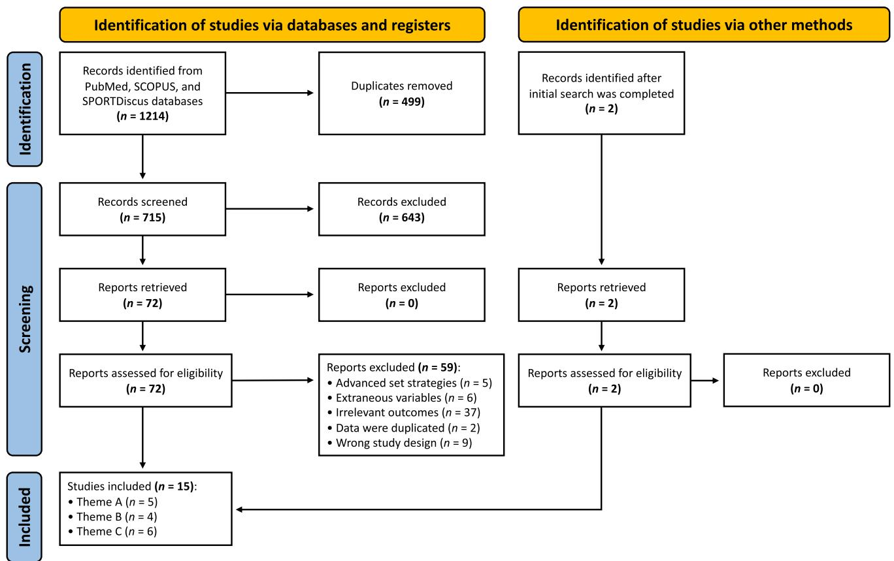
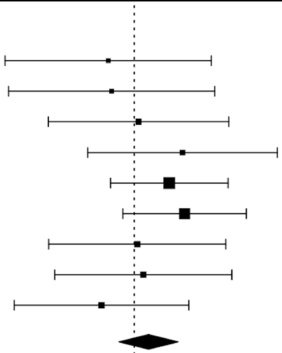
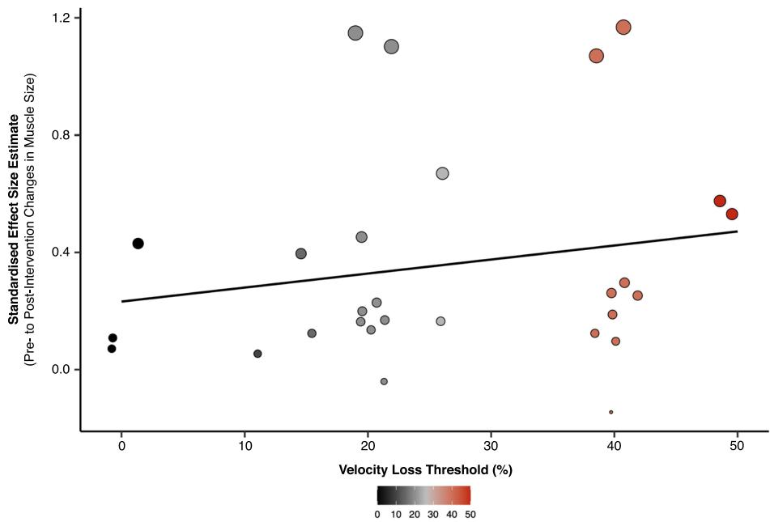
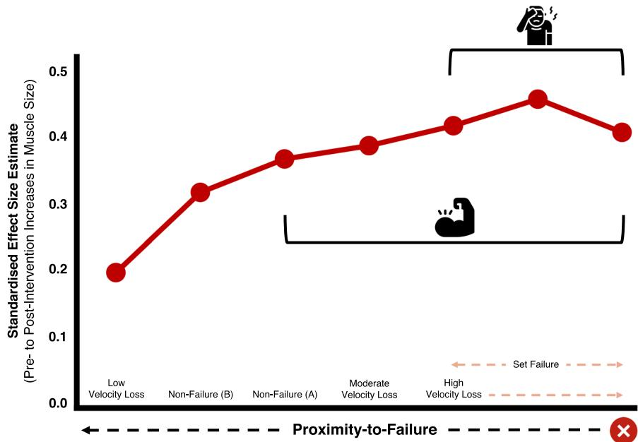

SYSTEMATIC REVIEW

# Infuence of Resistance Training Proximity‑to‑Failure on Skeletal Muscle Hypertrophy: A Systematic Review with Meta‑analysis

Martin C. Refalo1  · Eric R. Helms2  · Eric. T. Trexler3  · D. Lee Hamilton4  · Jackson J. Fyfe4

Accepted: 16 October 2022 / Published online: 5 November 2022   
© The Author(s) 2022

## Abstract

Background and Objective This systematic review with meta-analysis investigated the infuence of resistance training proximity-to-failure on muscle hypertrophy.

Methods Literature searches in the PubMed, SCOPUS and SPORTDiscus databases identifed a total of 15 studies that measured muscle hypertrophy (in healthy adults of any age and resistance training experience) and compared resistance training performed to: (A) momentary muscular failure versus non-failure; (B) set failure (defned as anything other than momentary muscular failure) versus non-failure; or (C) diferent velocity loss thresholds.

Results There was a trivial advantage for resistance training performed to set failure versus non-failure for muscle hypertrophy in studies applying any defnition of set failure [efect size=0.19 (95% confdence interval 0.00, 0.37), p=0.045], with no moderating efect of volume load (p=0.884) or relative load (p=0.525). Given the variability in set failure defnitions applied across studies, sub-group analyses were conducted and found no advantage for either resistance training performed to momentary muscular failure versus non-failure for muscle hypertrophy [efect size=0.12 (95% confdence interval −0.13, 0.37), p=0.343], or for resistance training performed to high (>25%) versus moderate (20–25%) velocity loss thresholds [efect size=0.08 (95% confdence interval −0.16, 0.32), p=0.529].

Conclusion Overall, our main fndings suggest that (i) there is no evidence to support that resistance training performed to momentary muscular failure is superior to non-failure resistance training for muscle hypertrophy and (ii) higher velocity loss thresholds, and theoretically closer proximities-to-failure do not always elicit greater muscle hypertrophy. As such, these results provide evidence for a potential non-linear relationship between proximity-to-failure and muscle hypertrophy.

## Key Points

This systematic review with meta-analysis grouped studies investigating the infuence of resistance training proximity-to-failure on muscle hypertrophy into three broad themes based on the defnition of set failure used (and therefore the specifc research question being examined), to improve the validity of the meta-analyses.

Based on the limited available literature, our main fndings show (i) no evidence to support that resistance training performed to momentary muscular failure is superior to non-failure resistance training, (ii) that higher velocity loss thresholds, and thus, theoretically closer proximities-to-failure, elicit greater muscle hypertrophy in a non-linear manner and (iii) no moderating efect of either volume load or relative load on muscle hypertrophy when resistance training was performed using any defnition of set failure versus non-failure.

These fndings provide evidence for a potential non-linear relationship between proximity-to-failure and muscle hypertrophy, but current set termination methods used during non-failure resistance training conditions limit insight into the actual proximity-to-failure achieved and pose a challenge for deriving practical recommendations for manipulating resistance training proximity-to-failure to achieve desired outcomes.

## 1 Introduction

Resistance training (RT) promotes skeletal muscle hypertrophy, a physiological adaptation involving the structural remodelling of muscle tissue that leads to an increase in muscle fbre, and ultimately, whole-muscle cross-sectional area [1]. Although multiple RT variables (e.g. volume, load, frequency, lifting velocity) infuence muscle hypertrophy, ‘proximity-to-failure’ specifcally infuences the exposure of muscle fbres to mechanical tension, the key stimulus for muscle hypertrophy [2]. Proximity-to-failure is defned as the number of repetitions remaining in a set prior to momentary muscular failure (i.e. when an individual cannot complete the concentric portion of a given repetition with a full range-of-motion without deviation from the prescribed form of the exercise) [3]. As proximity-to-failure nears within a given set, more repetitions are completed [thus increasing volume load (sets× repetitions × load)] and muscle fbre activation progressively increases [4, 5], ultimately exposing type II muscle fbres (capable of greater hypertrophy than type I muscle fbres [6]) to greater mechanical tension. However, whether the increased mechanical tension and volume load within a given set are worth the additional neuromuscular fatigue from reaching momentary muscular failure over multiple sets is contentious, as cumulative neuromuscular fatigue could impede the total volume load completed within an entire session or from session-to-session, and therefore decrease the total exposure to mechanical tension over time [3]. Nonetheless, inconsistencies in the literature limit understanding of the infuence of RT proximity-to-failure on muscle hypertrophy and pose a challenge for deriving practical recommendations for manipulating proximity-to-failure during RT to achieve desired outcomes.

To our knowledge, three meta-analyses [7–9] investigated the infuence of RT proximity-to-failure on muscle hypertrophy by comparing either RT performed to set failure (i.e. umbrella term describing the set termination criteria for the defnition of ‘failure’ applied in a given study) versus non-failure [7, 8] or RT performed to diferent velocity loss thresholds that indirectly infuence proximity-to-failure [9]. Results showed that RT performed to set failure does not elicit superior muscle hypertrophy compared with nonfailure RT when volume load is equated [7, 8]. Further, RT performed to a higher velocity loss (> 25%) was found to be superior to a lower velocity loss (≤ 25%) for muscle hypertrophy  [9]. Although trivial diferences in muscle hypertrophy were found between 20–25% and > 25% velocity loss conditions (across a small number of studies that were sub-analysed) [9], collectively, these data suggest that the relationship between proximity-to-failure and muscle hypertrophy is likely non-linear [10] or that it is moderated by other RT variables such as volume load [8]. One of the major limitations of these data, however, is that no consensus defnition for ‘failure’ exists in the literature. As such, these meta-analyses compare studies applying various defnitions of set failure that alter the RT stimulus achieved. These diferences in the RT stimulus achieved could potentially confound the conclusions drawn as the true proximityto-failure compared between set failure conditions across studies is likely inconsistent.

To summarise the available evidence regarding the infuence of RT proximity-to-failure on muscle hypertrophy while addressing critical research limitations, we identifed three broad themes of studies in our recent scoping review [3], based on the defnition of set failure applied and the research question asked (Table 1). We tentatively concluded that RT to set failure is likely not superior to non-failure RT for promoting muscle hypertrophy [3], but it is uncertain if meta-analysing these data within the themes we identifed would alter this conclusion. Therefore, because of the methodological limitations identifed in the current literature, the infuence of proximity-to-failure on muscle hypertrophy is unclear and requires further investigation.

Table 1 ‘Themes’ of studies investigating proximity-to-failure in resistance training
<table><tr><td>Theme</td><td>Criteria</td></tr><tr><td>A</td><td>Studies comparing a group(s) performing resistance training to momentary muscular failure to a non-failure group(s) [13, 1720]</td></tr><tr><td>B</td><td>Studies comparing a group(s) performing resistance training to set failure (defined as anything other than the definition of momentary muscular failure) to a non-failure group(s) [11, 12, 21, 22]</td></tr><tr><td>C</td><td>Studies theoretically comparing different proximities-to-failure (i.e. applying different velocity loss thresholds that modulate set termi- nation and albeit indirectly, influence proximity-to-failure), with no inclusion of a group performing resistance training to momen- tary muscular failure per se [1416, 2325]</td></tr></table>

Description of specifc criteria used to allocate studies to each theme, based on the defnition of set failure applied and the research questions asked

## 1.1 Objectives

Since the publication of previous meta-analyses [7–9] on the infuence of proximity-to-failure on muscle hypertrophy, six additional studies were published [11–16] on this topic. Thus, this systematic review with meta-analysis extends previous fndings by including new evidence and grouping studies into broad themes exclusive to the defnition of set failure applied and the research question asked (Table 1). Specifcally, we estimated: (i) the overall efect of RT performed to set failure versus non-failure on muscle hypertrophy and the individual efect of (A) defnitions applied to set failure (based on ‘theme’), (B) volume load and (C) relative load on muscle hypertrophy, (ii) whether the magnitude of velocity loss achieved during RT infuences muscle hypertrophy, and (iii) the magnitude of muscle hypertrophy achieved when RT is performed to momentary muscular failure, to set failure, and to a high velocity loss.

## 2 Methods

A systematic review with meta-analysis was performed in accordance with the Preferred Reporting Items for Systematic Reviews and Meta-Analyses (PRISMA) guidelines [26]. The original protocol was registered with the Open Science Framework on 27 April, 2022 (https://osf.io/rzn63/) but since was slightly adjusted to improve the suitability of the analysis with the data and research questions (we did not perform the pre-registered meta-regression analysis, described further in Sect. 2.7). Because of the heterogeneity of studies investigating the infuence of proximity-to-failure, a scoping review was previously conducted as a means of summarising the available evidence [3]. The systematic search used in the scoping review was adopted for this systematic review with meta-analysis to provide a consistent and objective understanding of the data. To reduce bias during the process, two authors (MR and JF) were involved in each step of the study identifcation process (including the literature search and study screening/selection), subsequent data extraction and methodological quality assessment for this systematic review with meta-analysis, with any disagreement resolved by mutual discussion.

## 2.1 Research Questions

The research questions were defned using the participants, interventions, comparisons, outcomes and study design (PICOS) framework, as follows. In apparently healthy adults of any age and training status:

1. What is the overall efect of RT performed to set failure versus non-failure on muscle hypertrophy? And what is the individual efect of the defnitions applied to set failure (based on ‘theme’), volume load and relative load on muscle hypertrophy?

2. Does the magnitude of velocity loss achieved (and theoretically, the proximity-to- failure reached) during RT infuence muscle hypertrophy?

3. What magnitudes of muscle hypertrophy are achieved when RT is performed to momentary muscular failure, to set failure and to a high velocity loss?

## 2.2 Literature Search Strategy

As described in our previous scoping review [3], the literature search followed the PRISMA-ScR (Preferred Reporting Items for Systematic Reviews and Meta-Analyses for Scoping Reviews) guidelines [27]. Literature searches of the PubMed, SCOPUS and SPORTDiscus databases were conducted in September 2021, and the following PubMed search string was used and adapted for each individual database: (("resistance training" OR "resistance exercise" OR "strength training") AND ("failure" OR "muscular failure" OR "velocity loss") AND (("muscle hypertrophy" OR "muscle size" OR "muscle growth" OR "muscle mass" OR "muscle thickness" OR "cross-sectional area") OR ("fatigue" OR "neuromuscular fatigue" OR "peripheral fatigue" OR "muscle damage" OR "discomfort" OR “enjoyment” OR "afective" OR "afective response"))). Since the initial search, however, two recently published studies [15, 16] in 2022 have been manually added to this systematic review with meta-analysis and subjected to the same screening process as studies retrieved in the initial database search.

## 2.3 Study Selection

Covidence (Veritas Health Innovations, Melbourne, VIC, Australia) was used to manage and conduct the systematic study selection process, including the removal of duplicates and the exclusion of ineligible studies at each stage of the screening process. The systematic literature search and study selection process were completed independently by two blinded (to reduce any bias during this process) authors (MR and JF) with any disagreement resolved by mutual discussion. Finally, the authors (MR and JF) reviewed the full text to determine eligibility for inclusion based on the inclusion criteria. If any papers were added through reference checking or manual searching, they were subjected to the same screening process as if they were found in the initial database search.

## 2.4 Inclusion Criteria

Studies were included if: (1) participants were apparently healthy adults of any age and RT experience, (2) participants were randomised to experimental groups, (3) the experimental comparison involved a group performing RT to set failure (any defnition of set failure) versus a non-failure group, or two groups terminating RT sets at diferent proximities-tofailure (e.g. set termination informed by velocity loss thresholds or subjective ratings of perceived exertion), (4) one of the following measures of muscle hypertrophy was included; (a) muscle thickness, (b) whole-limb or muscle cross-sectional area or volume, (c) muscle fbre cross-sectional area or (d) lean body/fat free mass via dual X-ray absorptiometry or bioelectrical impedance analysis. Only original research studies in peer-reviewed journals were included, and studies were excluded if they involved (i) advanced set strategies (e.g. rest-pause, cluster sets), (ii) extraneous training variables (e.g. aerobic exercise, blood fow restriction), (iii) outcome measures that were not relevant and (iv) data that were duplicated within another included study.

## 2.5 Data Extraction

Data charting was carried out by two authors (MR and JF) to capture key information in a table format (Table 2). The following participant characteristics were extracted: (1) RT status (i.e. untrained or resistance trained), (2) age and (3) sex. The following study characteristics were also extracted: (1) frst author, (2) sample size, (3) publication date and (4) intervention groups/protocol outlines and duration. Raw data (mean and standard deviation) from pre-intervention and post-intervention for muscle hypertrophy outcomes were also extracted from each individual study for generation of standardised mean diferences, confdence intervals (CIs) and subsequent meta-analysis. If fgures were used instead of numerical data, those data were extracted from the fgures using Web Plot Digitizer, and if the mean and standard deviation data were not reported, we contacted the authors of the respective study directly to obtain the relevant data. Our previous scoping review [3] identifed three broad study themes across the relevant literature, and as such, each included study was grouped into one of the themes based on the criteria outlined in Table 1.

## 2.6 Methodological Quality Assessment

Evaluation of methodological study quality (including risk of bias) was conducted by two authors (MR and JF) using the tool for the assessment of study quality and reporting in exercise (TESTEX) scale [28] shown in Table S1 of the Electronic Supplementary Material (ESM). The TESTEX scale is an exercise science-specifc scale used to assess the quality and reporting of exercise training trials. The scale contains 12 criteria that can either be scored a ‘one’ or not scored at all; 1, eligibility; 2, randomisation; 3, allocation concealment; 4, groups similar at baseline; 5, assessor blinding; 6, outcome measures assessed in 85% of patients (3 possible points); 7, intention-to-treat; 8, between-group statistical comparisons (2 possible points); 9, point estimates of all measures included; 10, activity monitoring in control groups; 11, relative exercise intensity remained constant; 12, exercise parameters recorded. The best possible total score is 15 points.

## 2.7 Statistical Analysis

All statistical analyses were conducted with the 'metafor' [29] package in R (version 4.0.2; R Core Team, https:// www.r-project.org/) and all of the code utilised is openly available. Standardised efect sizes (ESs) and standard errors were calculated using the ‘escalc’ function in ‘metafor’. The magnitude of standardised ESs was interpreted with reference to Cohen’s d (1988) thresholds: trivial (< 0.2), small (0.2 to < 0.5), moderate (0.5 to < 0.8) and large (> 0.8). Point estimates and their 95% CIs were produced. Restricted maximal likelihood estimation was used in all models. Given that correlations between pre-test and post-test measures are rarely reported in original studies, a correlation coefcient of r = 0.75, which was replicated from Grgic et al. [7], was used to calculate the variance (or standard error) for all studies and sensitivity analyses were performed using correlation coefcients that ranged from r = 0.6 to r = 0.9 (Figs. S1–S4 of the ESM). Funnel plots were generated (Figs. S5–S6 of the ESM) and Egger’s test was applied to assess the risk of bias from small-study efects. The I2 heterogeneity statistic was also produced and reported to indicate the proportion of the observed variance (for all ESs generated) that is not due to sampling error [30]. To complement traditional null hypothesis signifcance testing, we also considered the practical implications of all results by qualitatively assessing the ES estimate and associated CI width.

Table 2 Summary of data extraction. Brief summary of all studies including in this systematic review with meta-analysis
<table><tr><td>Study</td><td></td><td>size (n)</td><td>Theme Sample Sex Age (y)</td><td></td><td>Intervention groups/duration (sessions/week)</td><td>Volume equated Training status</td><td></td></tr><tr><td>Lacerda et al. 2020 [17]</td><td>A</td><td>10</td><td>M</td><td>23.7 ± 4.9</td><td>Failure: 34 sets Xn reps (5060% 1-RM) Non-failure: 34 sets X n reps (5060% 1-RM)</td><td>Yes</td><td>UT</td></tr><tr><td>Lasevicius et al. 2019 [20]</td><td>A</td><td>25</td><td>M</td><td>24±4.9</td><td>→ 14 weeks (23/week) Failure 1: 3 sets Xn reps (80% Yes 1-RM) Failure 2: 3 sets Xn reps (30% 1-RM) Non-failure 1: ~5 sets Xn reps (80% 1-RM) Non-failure 2: ~5 sets Xn reps</td><td></td><td>UT</td></tr><tr><td>Martorelli et al. 2017 [18]</td><td>A</td><td>89</td><td>F</td><td>21.9±3.3</td><td>(30% 1-RM) → 8 weeks (2/week) Failure: 3 sets Xn reps (70% 1-RM) Non-failure 1: 4 sets × 7 reps (70% 1-RM) Non-failure 2: 3 sets × 7 reps (70% 1-RM)</td><td>Yes No</td><td>UT</td></tr><tr><td>Nobrega et al. 2018 [19]</td><td>A</td><td>32</td><td>M</td><td>23 ± 3.6</td><td>→ 10 weeks (2/week) Failure 1: 3 sets ×n reps (80% Yes 1-RM) Failure 2: 3 sets Xn reps (30% 1-RM) Non-failure 1: 3 sets X n reps to VI (80% 1-RM)</td><td></td><td>UT</td></tr><tr><td>Santanielo et al. 2020 [13]</td><td>A</td><td>14</td><td></td><td></td><td>Non-failure 2: 3 sets X n reps to VI (30% 1-RM) → 12 weeks (2/week) Failure: n sets Xn reps (75% 1-RM) Non-failure: n sets Xn reps to</td><td>No</td><td>T</td></tr><tr><td>Bergamasco et al. 2020 [12]</td><td>B</td><td>41</td><td>M/F</td><td>65.5±4.5</td><td>VI (75% 1-RM) Failure: 3 sets Xn reps (40% 1-RM) Non-failure 1: 3 sets Xn reps to VI (40% 1-RM) Non-failure 2: 3 sets × 10 reps</td><td>No</td><td>UT</td></tr><tr><td>Karsten et al. 2021 [21]</td><td>B</td><td>18</td><td>M</td><td></td><td>(40% 1-RM) → 12 weeks (2/week) Failure: 4 sets × 10-RM (75% Yes 1-RM) Non-failure: 8 sets × 5 reps (75% 1-RM)</td><td></td><td>T</td></tr><tr><td>Sampson et al. 2016 [22]</td><td>B</td><td>28</td><td>M</td><td>23.8 ± 6.6</td><td>→ 6 weeks (2/week) Failure: 4 sets ×6 reps (85% 1-RM) Non-failure 1: 4 sets × 4 reps (85% 1-RM) Non-failure 2: 4 sets  4 reps</td><td>No</td><td>UT</td></tr><tr><td>Terada et al. 2021 [11]</td><td>B</td><td>27</td><td>M</td><td>20.03 ± 0.8</td><td>→ 12 weeks (3/week) Failure: 3 sets Xn reps to VF (40% 1-RM) Non-failure: 3 sets × 20% VeL</td><td>Yes</td><td>UT</td></tr><tr><td>Study</td><td></td><td>Theme Sample size (n)</td><td>Sex Age (y)</td><td></td><td>Intervention groups/duration (sessions/week)</td><td></td><td>Volume equated Training status</td></tr><tr><td>Andersen et al. 2021 [14]</td><td>C</td><td>10</td><td>M/F</td><td>23.0± 4.3</td><td>High VeL: 23 sets × 30% VeL (7580% 1-RM) Low VeL: 46 sets × 15% VeL (75-80% 1-RM) → 9 weeks (2/week)</td><td>Yes</td><td>T</td></tr><tr><td>Pareja-Blanco et al. 2017 [25]</td><td>C</td><td>24</td><td>M</td><td>22.7 ± 1.9</td><td>High VeL: 3 sets X 40% VeL (7085% 1-RM) Mod VeL: 3 sets × 20% VeL (7085% 1-RM) → 8 weeks (2/week)</td><td>No</td><td>T</td></tr><tr><td>Pareja-Blanco et al. 2020 [24]</td><td>C</td><td>64</td><td>M</td><td>24.1 ± 4.3</td><td>High VeL: 3 sets × 40% VeL (7085% 1-RM) Mod VeL: 3 sets x 20% VeL (7085% 1-RM) Low VeL: 3 sets × 10% VeL (7085% 1-RM) Low VeL: 3 sets x 0% VeL (7085% 1-RM)</td><td>No</td><td>T</td></tr><tr><td>Pareja-Blanco et al. 2020 [23]</td><td>C</td><td>64</td><td>M</td><td>24.1 ± 4.3</td><td>→ 8 weeks (2/week) High VeL: 3 sets × 50% VeL (7085% 1-RM) Mod VeL: 3 sets × 25% VeL (7085% 1-RM) Low VeL: 3 sets × 15% VeL (7085% 1-RM) Low VeL: 3 sets ×0% VeL (7085% 1-RM)</td><td>No</td><td>T</td></tr><tr><td>Rissanen et al. 2022 [15]</td><td>C</td><td>45</td><td>M/F</td><td>25.95 ± 3.85</td><td>→ 8 weeks (2/week) High VeL: 25 sets × 40% VeL (6575% 1-RM) Mod VeL: 25 sets x 20% VeL (6575% 1-RM) → 8 weeks (2/week)</td><td>No</td><td>T</td></tr><tr><td>Rodiles-Guerrero et al. 2022 [16] C</td><td></td><td>50</td><td>M</td><td>23.3 ±3.3</td><td>High VeL: 3 sets × 50% VeL (5570% 1-RM) Mod VeL: 3 sets × 25% VeL (5570% 1-RM) Low VeL: 3 sets × 15% VeL (5570% 1-RM) Low VeL: 3 sets x0% VeL</td><td>No</td><td>T</td></tr></table>

Studies were grouped into broad themes that involved resistance training performed to Theme A momentary muscular failure versus non-failure Theme B set failure (defned as anything other than momentary muscular failure) versus non-failure or Theme C diferent velocity loss thresholds  
F female, M male, reps repetitions, RM repetition maximum, T trained, UT untrained, VeL velocity loss, VF volitional failure, VI volitional interruption, y years

A quantitative synthesis of studies in Theme A and B (combined), and Theme C, was performed using a multi-level mixed-efects meta-analysis, as there is a nested structure to the ESs that were calculated from the studies included (i.e. multiple ESs from various measures of muscle hypertrophy nested within groups and nested within studies). Standardised ESs were calculated such that a positive ES favours the set failure conditions (or high velocity loss conditions), whereas a negative ES favours non-failure conditions (or moderate velocity loss conditions). A multi-level model for studies in Theme A and B was produced including all standardised ESs to provide a general estimate of the efect and to answer review question one. Studies from Theme A and B were also categorised by: (i) theme (A or B), (ii) the diference in volume load between set failure and non-failure conditions (volume equated or not volume equated) and (iii) the relative load lifted [high load (> 50% 1-repetition maximum [RM]) or low load (≤ 50% 1-RM)], and sub-group analyses were employed to estimate an ES for the infuence of these individual variables (i.e. theme, volume load, relative load) on the outcome measure and compare and contrast the estimates. Another multi-level model was produced for studies in Theme C comparing high velocity loss conditions (> 25%) versus moderate velocity loss conditions (20–25%), to provide a general estimate of the efect and help answer review question two. Three [16, 23, 24] out of the six studies [14–16, 23–25] in Theme C also involved groups performing RT to low velocity loss thresholds (< 20%); however, considering only six ESs could be retrieved (vs 11 ESs for both moderate and high velocity loss thresholds) and the low practical importance of performing RT with < 20% velocity loss, we excluded low velocity loss conditions from this comparative model and therefore did not perform the pre-registered meta-regression analysis (https://osf.io/rzn63/). However, an individual standardised ES was calculated for the low velocity loss conditions, along with all other RT conditions analysed [i.e. momentary muscular failure, set failure, non-failure, and moderate (20–25%) and high (> 25%) velocity loss thresholds] across all studies in each theme to provide a general estimate of the efect and help answer review questions two and three.

## 3 Results

## 3.1 Search Results and Systematic Review of Included Studies

The original literature search results were described previously [3], and an updated fowchart of the systematic literature search and study selection process is displayed in Fig. 1. For this systematic review with meta-analysis, two additional studies [15, 16] were found through manual checking and were subject to the same screening process as studies retrieved in the initial database search. Further, all studies retrieved from the original search that did not measure muscle hypertrophy outcomes were excluded from this systematic review with meta-analysis, leaving a total of 15 studies eligible for analysis. Subsequently, studies were grouped into one of the three themes identifed based on the criteria outlined in Table 1 to improve the validity of study comparisons and interpretations within each theme. Results from Egger’s test found no publication bias $( p < 0 . 0 5 )$ for studies in Theme A and B, and studies in Theme C. For a summary of included studies, see Table 2.

  
Fig. 1 PRISMA (Preferred Reporting Items for Systematic Reviews and Meta-Analyses) fow chart. Summary of the systematic literature search and study selection process

A total of nine studies [11–13, 17–22] compared RT performed to set failure (including all defnitions of set failure) versus non-failure and measured muscle hypertrophy in one or more of the following muscle groups: quadriceps (vastus lateralis, vastus medialis, rectus femoris), elbow fexor, triceps brachii, pectoralis major or anterior deltoid. Five [13, 17–20] out of the nine [11–13, 17–22] studies applied the defnition of momentary muscular failure and were thus allocated to Theme A, and the remaining four studies [11, 12, 21, 22] applied various defnitions of set failure other than momentary muscular failure and were thus allocated to Theme B. Importantly, fve [11, 17, 19–21] out of the nine studies [11–13, 17–22] equated volume load between conditions, whereas three studies [12, 13, 22] did not equate volume load. The fnal study [18] involved two non-failure conditions, of which one was volume equated (compared to the set failure condition), while the other was not. Further, fve [13, 17, 18, 21, 22] out of the nine studies [11–13, 17–22] used a high load (> 50% 1-RM), and two studies [11, 12] used a low load (≤ 50% 1-RM). The remaining two studies [19, 20] used both high and low loads allocated across two set failure and two non-failure conditions. Of the fve studies in Theme A, four studies [13, 17, 19, 20] found no statistically signifcant diferences between conditions in muscle hypertrophy from pre-intervention to post-intervention, while one study [18] did not perform a between-group statistical analysis. Similarly, three [11, 21, 22] of the four studies [11, 12, 21, 22] in Theme B found no statistically signifcant diferences in muscle hypertrophy between conditions, and one study [12] found no statistically signifcant pre-intervention to post-intervention changes in muscle size for either condition. A total of seven studies [11, 12, 17–20, 22] from both Theme A and B involved untrained participants, whereas only two studies involved resistance-trained participants [13, 21].

Additionally, a total of six studies [14–16, 23–25] in resistance-trained participants compared high velocity loss conditions (> 25%) with moderate velocity loss conditions (20–25%) and measured muscle hypertrophy (Theme C) in one or more of the following muscle groups: quadriceps (vastus lateralis, vastus intermedius, vastus medialis, rectus femoris) or pectoralis major. Five [14, 15, 23–25] out of the six [14–16, 23–25] studies in Theme C observed increases in muscle hypertrophy when RT was performed to both high and moderate velocity loss; however, no statistically signifcant diferences between conditions were found in each of the studies. The remaining study [16] only found increases in muscle hypertrophy for the high velocity loss condition. All studies [14–16, 23–25] in Theme C involved a high load and were conducted on resistance-trained participants.

## 3.2 Methodological Quality

A detailed overview of the methodological quality of included studies using the TESTEX scale [16] can be found in Table S1 of the ESM. Study quality scores ranged from 7 to 12 (out of a possible 15), with mean and median scores of 9.9 and 10, respectively (Table S1 of the ESM). Although each study had some risk of bias, all studies lost two points because of (i) no allocation concealment and (ii) no activity monitoring, and only one study clearly stated if an ‘intention-to-treat’ analysis was performed on outcomes of interest. Overall, a total of 11 out of 15 studies scored highly (> 10) on the TESTEX scale and visual inspection of methodological quality results revealed no impact of study quality on the ES estimates generated.

## 3.3 Meta‑analysis Results

## 3.3.1 What is the Overall Efect of Resistance Training Performed to Set Failure (Irrespective of the Defnition Applied) Versus Non‑Failure on Muscle Hypertrophy?

Meta-analytic outcomes for the overall efect of RT performed to set failure (irrespective of the defnition applied) versus non-failure on muscle hypertrophy from all studies in Theme A and B are shown in Fig. 2. There was a statistically signifcant advantage for RT performed to set failure versus non-failure on muscle hypertrophy, which was trivial in magnitude [ES=0.19 (95% CI 0.00, 0.37), p=0.045] with a very low heterogeneity $( Q = 6 . 6 5 , p = 0 . 9 8 8 , I ^ { 2 } = 0 \% )$

3.3.1.1 Infuence of  Volume Load, Relative Load and the Defnition of Set Failure on Muscle Hypertrophy Following Resistance Training Performed to Set Failure Versus Non‑Failure Outcomes for sub-group analyses of studies categorised into either Theme A or Theme B are shown in Fig.  2. Sub-group analysis of studies applying the defnition of momentary muscular failure (Theme A) found no statistically signifcant diference between RT performed to momentary muscular failure and non-failure on muscle hypertrophy, with a trivial standardised efect [ES = 0.12 (95% CI − 0.13, 0.37), p = 0.343] involving a low heterogeneity (Q = 4.58, p = 0.801, I2 = 7.38%). Similar results were found when analysing studies that applied defnitions of set failure other than momentary muscular failure (Theme

<table><tr><td></td><td></td><td colspan="2">Non-Failure</td><td colspan="2">Set Failure</td><td colspan="2"></td><td>Weights SMD [95% CI]</td></tr><tr><td>Study</td><td>Measure</td><td>Mean</td><td>SD</td><td>Mean</td><td>SD</td><td></td><td></td><td></td></tr><tr><td colspan="9">A: Non-Failure VS Momentary Muscular Failure</td></tr><tr><td rowspan="2">[17] Lacerda et al. 2020</td><td>VL</td><td>11.40</td><td>12.54</td><td>8.54</td><td>12.12</td><td></td><td></td><td>4.30% -0.22 [-1.10, 0.66]</td></tr><tr><td>RF</td><td>2.99</td><td>4.14</td><td>2.13</td><td>4.39</td><td></td><td></td><td>4.31% -0.19 [-1.07, 0.69]</td></tr><tr><td rowspan="2">[20] Lasevicius et al. 2019</td><td>Quads</td><td>6.40</td><td>7.55</td><td>6.70</td><td>8.33</td><td></td><td>5.63%</td><td>0.04 [-0.73, 0.81]</td></tr><tr><td>Quads</td><td>2.20</td><td>10.36</td><td>6.60</td><td>10.30</td><td></td><td>5.09%</td><td>0.41 [-0.40, 1.22]</td></tr><tr><td rowspan="2">[18] Martorelli et al. 2017</td><td>EF</td><td>1.57</td><td>4.38</td><td>3.29</td><td>6.81</td><td></td><td>13.26%</td><td>0.30 [-0.20, 0.80]</td></tr><tr><td>EF</td><td>0.45</td><td>6.20</td><td>3.29</td><td>6.81</td><td></td><td>12.03%</td><td>0.43 [-0.10, 0.95]</td></tr><tr><td rowspan="2">[19] Nobrega et al. 2018</td><td>VL</td><td>1.50</td><td>4.03</td><td>1.60</td><td>3.50</td><td></td><td>5.84%</td><td>0.03 [-0.73, 0.78]</td></tr><tr><td>VL</td><td>1.40</td><td>3.64</td><td>1.70</td><td>3.89</td><td></td><td>5.83%</td><td>0.08 [-0.68, 0.83]</td></tr><tr><td rowspan="2">[13] Santanielo et al. 2020</td><td>VL</td><td>5.50</td><td>4.47</td><td>4.30</td><td>3.86</td><td></td><td></td><td>6.00% -0.28 [-1.02, 0.47]</td></tr><tr><td>Sub-Group: Q = 4.58, df = 8 (P = 0.801), 12= 7.38%, Z = 0.95 (P = 0.343)</td><td></td><td></td><td></td><td></td><td></td><td></td><td>0.12 [-0.13, 0.37]</td></tr><tr><td colspan="9">B: Non-Failure VS Set Failure (Not Including Momentary Muscular Failure)</td></tr><tr><td rowspan="2">[12] Bergamasco et al. 2020</td><td>VL</td><td>0.40</td><td></td><td></td><td></td><td></td><td></td><td></td></tr><tr><td></td><td></td><td>3.52</td><td>0.90</td><td>4.15</td><td></td><td>5.61%</td><td>5.39% 0.13 [-0.66, 0.91]</td></tr><tr><td rowspan="3">[21] Karsten et al. 2021</td><td>VL</td><td>0.40</td><td>2.92</td><td>0.90</td><td>4.15</td><td></td><td>3.76%</td><td>0.14 [-0.63, 0.90] 0.53 [-0.41, 1.47]</td></tr><tr><td>VM</td><td>0.40</td><td>4.63</td><td>3.30</td><td>5.76</td><td></td><td>3.88%</td><td>0.17 [-0.76, 1.09]</td></tr><tr><td>EF AD</td><td>2.10</td><td>5.74</td><td>3.40 1.90</td><td>8.88</td><td></td><td>3.89%</td><td>0.15 [-0.78, 1.07]</td></tr><tr><td rowspan="2">[22] Sampson et al. 2016</td><td>EF</td><td>1.20 1.20</td><td>4.55 1.36</td><td>1.60</td><td>4.54</td><td></td><td>4.30%</td><td>0.23 [-0.65, 1.11]</td></tr><tr><td>EF</td><td>1.40</td><td>1.91</td><td>1.60</td><td>1.93 1.93</td><td></td><td>3.84%</td><td>0.10 [-0.83, 1.03]</td></tr><tr><td rowspan="2">[11] Terada et al. 2021</td><td>PM</td><td>4.60</td><td></td><td>6.40</td><td></td><td></td><td>3.53%</td><td>0.56 [-0.41, 1.54]</td></tr><tr><td>TB</td><td>2.40</td><td>1.72 4.50</td><td>4.90</td><td>3.82 3.32</td><td></td><td>3.51%</td><td>0.61 [-0.37, 1.58]</td></tr><tr><td colspan="5">Sub-Group: Q = 1.60, df = 8 (P = 0.991), 12= 0%, Z = 1.77 (P = 0.077)</td><td></td><td></td><td>0.27 [-0.03, 0.57]</td><td></td></tr><tr><td colspan="7">Total</td><td></td><td>100.00% 0.19 [0.00, 0.7]</td></tr><tr><td colspan="6">Heterogeneity: Q = 6.65, df = 17 (P = 0.988), 12 = 0% Test for overall effect: Z = 2.01 (P = 0.045)</td><td></td><td></td><td></td></tr><tr><td colspan="6"></td><td></td><td></td><td></td></tr><tr><td colspan="6">-2 -1 0</td><td></td><td>2</td><td></td></tr><tr><td colspan="6">Favours Non-Failure RT</td><td>Favours RT to Set Failure</td><td></td><td></td></tr></table>

Fig. 2 Infuence of resistance training (RT) performed to set failure versus non-failure on muscle hypertrophy with subgroup analyses based on study ‘theme’ (A or B). Studies presented were grouped into broad themes that involved RT performed to either momentary muscular failure versus non-failure (Theme A), or set failure (defned as anything other than momentary muscular failure) versus non-fail-  
ure  (Theme B). Point estimates and error bars signify the standardised mean diference between set failure and non-failure conditions and 95% confdence interval (CI) values, respectively. AD anterior deltoid, EF elbow fexors, PM pectoralis major, Quads quadriceps, RF rectus femoris, SD standard deviation, SMD standardized mean diference, TB triceps brachii, VL vastus lateralis, VM vastus medialis

B), with no statistically signifcant diference between RT performed to set failure (not including momentary muscular failure) and non-failure on muscle hypertrophy, with a trivial standardised efect [ES = 0.27 (95% CI − 0.03, 0.57), $p { = } 0 . 0 7 7 ]$ involving a very low heterogeneity (Q = 1.60, $p { = } 0 . 9 9 1 , I ^ { 2 } { = } 0 \% )$ . Individual ESs were calculated for subgroups categorised by volume load standardisation (equated vs not equated) and relative load lifted (higher load vs lower load); these pooled ESs are presented in Table 3. Moderator analyses revealed that neither volume load standardisation $\scriptstyle ( p = 0 . 8 8 4 )$ nor relative load lifted $( p = 0 . 5 2 5 )$ had statistically signifcant impacts on the overall ES for muscle hypertrophy.

Table 3 Infuence of volume load and relative load on muscle hypertrophy outcomes in response to resistance training performed to set failure versus non-failure
<table><tr><td>Sub-group analysis</td><td>Classification</td><td>ES (95% CI)</td><td>p-value</td></tr><tr><td>Volume load</td><td>Volume equated</td><td>0.20 (−0.03, 0.43)</td><td>0.09</td></tr><tr><td rowspan="3">Relative load</td><td>Not volume equated</td><td>0.17 (−0.13, 0.47)</td><td>0.27</td></tr><tr><td>Higher load (&gt; 50% 1-RM)</td><td>0.15 (−0.07, 0.37)</td><td>0.18</td></tr><tr><td>Lower load (≤ 50% 1-RM)</td><td>0.28 (−0.06, 0.62)</td><td>0.11</td></tr></table>

Data shown are presented as a standardised ES estimate (signifying the standardised mean diference between set failure and non-failure conditions) with 95% CI and associated p-value. Positive ES values favour resistance training performed to set failure versus non-failure  
CI confdence interval, ES efect size, RM repetition maximum

## 3.3.2 Does the Magnitude of Velocity Loss Achieved (and Theoretically, the Proximity‑to‑Failure Reached) During Resistance Training Infuence Muscle Hypertrophy?

Meta-analytic outcomes for the infuence of high (> 25%) and moderate (20–25%) velocity loss thresholds on muscle hypertrophy are shown in Fig. 3. Results of the multilevel meta-analysis model indicated no statistically signifcant diference between high velocity loss and moderate velocity loss conditions on muscle hypertrophy, revealing a trivial standardised efect [ES = 0.08 (95% CI − 0.16, 0.32), p = 0.529] with a very low heterogeneity (Q = 4.08, $p { = } 0 . 9 4 4 , I ^ { 2 } { = } 0 \% )$ . Individual standardised ESs for velocity loss conditions in each study from Theme C are displayed in Fig. 4. Velocity loss conditions were also categorised as low (< 20%), moderate (20–25%) or high (> 25%), and the mean values and CIs for each velocity loss condition are also shown in Table 4.

## 3.3.3 What Magnitudes of Muscle Hypertrophy Are Achieved When Resistance Training is Performed to Momentary Muscular Failure (Theme A), to Set Failure (Theme B) and to a High Velocity Loss (Theme C; 40 or 50% Velocity Loss)?

Individual standardised efect sizes for pre-intervention to post-intervention changes in muscle size for each RT condition (i.e. momentary muscular failure, set failure, non-failure, and low, moderate and high velocity loss thresholds) across all studies in each ‘theme’ (A, B and C) are shown in Table 4.

## 3.4 Sensitivity‑Analysis Results

Sensitivity analyses were performed for all multi-level metaanalysis models, with correlation coefcients that ranged from $r { = } 0 . 6 \ \mathrm { t o } \ r { = } 0 . 9$ (per hundredth decimal), to assess whether the selected correlation coefficient $_ { ( r = 0 . 7 5 ) }$ infuenced the meta-analytic outcomes (Figs. S1–S4 of the ESM). For the meta-analysis estimating the overall efect of RT performed to set failure versus non-failure on muscle hypertrophy (Sect. 3.3.1), ESs between 0.15 and 0.25 and p-values between 0.016 and 0.104 were observed. Although our metaanalysis found a statistically signifcant efect $\left( { p = 0 . 0 4 5 } \right)$ of RT performed to set failure versus non-failure on muscle

<table><tr><td colspan="2"></td><td colspan="2">Moderate VeL</td><td colspan="2">High VeL</td><td colspan="5"></td></tr><tr><td>Study</td><td>Measure</td><td>Mean</td><td>SD</td><td></td><td>Mean SD</td><td></td><td></td><td>Weights</td><td>SMD [95% CI]</td></tr><tr><td>[14] Andersen et al. 2021</td><td>VL</td><td>1.30</td><td>4.86</td><td></td><td>1.10 5.84</td><td></td><td></td><td></td><td>7.64% -0.04 [0.91, 0.84]</td></tr><tr><td rowspan="5"></td><td>RF</td><td>1.40</td><td>3.86</td><td>0.80</td><td>4.99</td><td></td><td></td><td></td><td>7.63% -0.13 [1.01, 0.75]</td></tr><tr><td>VL + VI</td><td>80.36</td><td>367.35</td><td>241.07</td><td>583.44</td><td></td><td></td><td>9.06%</td><td>0.32 [0.49, 1.12]</td></tr><tr><td>VM</td><td>109.92</td><td>160.87</td><td>112.98</td><td>260.10</td><td></td><td></td><td>9.17%</td><td>0.01 [-0.79, 0.81]</td></tr><tr><td>RF</td><td>-8.75</td><td>138.25</td><td>-25.46</td><td>109.31</td><td></td><td></td><td>9.15%</td><td>-0.13 [-0.93, 0.67]</td></tr><tr><td>QF</td><td>182.43</td><td>564.18</td><td>328.38</td><td>815.78</td><td></td><td></td><td></td><td>9.13% 0.20 [0.60, 1.00]</td></tr><tr><td>[24] Pareja-Blanco et al. 2020</td><td>VL</td><td>1.70</td><td>6.80</td><td></td><td>1.40</td><td>5.49</td><td></td><td></td><td>10.30% -0.05 [-0.80, 0.71]</td><td></td></tr><tr><td>[23] Pareja-Blanco et al. 2020</td><td>PM</td><td>4.64</td><td>4.64</td><td></td><td>4.30</td><td>5.01</td><td></td><td></td><td>11.83% -0.07 [−0.77, 0.64]</td><td></td></tr><tr><td>[15] Rissanen et al. 2022</td><td>VL</td><td>4.42</td><td>3.47</td><td></td><td>6.10</td><td>3.51</td><td></td><td></td><td>8.55%</td><td>0.46 [−0.37, 1.29]</td></tr><tr><td rowspan="2">[16] Rodiles-Guerrero et al. 2022</td><td>VL</td><td>5.17</td><td>4.23</td><td></td><td>4.19</td><td>2.35</td><td></td><td></td><td></td><td>8.33% -0.28 [1.12, 0.56]</td></tr><tr><td>PM</td><td>0.73</td><td>3.15</td><td>2.58</td><td>3.43</td><td></td><td></td><td></td><td>9.20% 0.54 [0.25, 1.34]</td><td></td></tr><tr><td colspan="7">Total</td><td></td><td></td><td></td><td>100.00% 0.08 [-0.16, 0.32]</td></tr><tr><td colspan="7">Heterogeneity: Q = 4.08, df = 10 (P = 0.944), 12 = 0% Test for overall effect: Z = 0.63 (P = 0.529)</td><td></td><td></td><td></td><td></td></tr><tr><td colspan="7"></td><td>0</td><td>1</td><td></td><td></td></tr><tr><td colspan="7">-2</td><td></td><td></td><td>2</td><td></td></tr><tr><td colspan="7">-1 Favours Moderate VeL</td><td></td><td>Favours High VeL</td><td></td><td></td></tr></table>

Fig. 3 Infuence of resistance training performed to high (> 25%) and moderate (20–25%) velocity loss on muscle hypertrophy based on studies in Theme C. Studies presented were grouped into Theme C that involved resistance training performed to diferent velocity loss thresholds. Point estimates and error bars signify the standardised  
mean diference (SMD) between high and moderate velocity loss conditions and 95% confdence interval (CI) values, respectively. PM pectoralis major, QF quadriceps femoris, RF rectus femoris, SD standard deviation, VeL velocity loss, VI vastus intermedius, VL vastus lateralis, VM vastus medialis

  
Fig. 4 Individual standardised efect sizes (pre-intervention to postintervention changes in muscle size) for all velocity loss conditions [low (< 20%), moderate (20–25%), high (> 25%)] in each study from Theme C. Data presented were extracted from studies grouped into Theme C that involved resistance training performed to diferent velocity loss thresholds. The size of the dot point is based on a

Table 4 Individual standardised ESs for resistance training conditions across all studies in each ‘theme’ (A, B and C)
<table><tr><td>Theme</td><td>Condition</td><td>ES (95% CI)</td><td>p-value</td></tr><tr><td rowspan="2">A</td><td>Momentary muscular failure</td><td>0.41 (0.27, 0.55)</td><td>&lt;0.001</td></tr><tr><td>Non-failure</td><td>0.37 (0.15, 0.58)</td><td>0.001</td></tr><tr><td rowspan="2">B</td><td>Set failure</td><td>0.46 (0.12, 0.80)</td><td>0.077</td></tr><tr><td>Non-failure</td><td>0.32 (0.05, 0.60)</td><td>0.023</td></tr><tr><td rowspan="3">C</td><td>Low velocity loss (&lt;20%)</td><td>0.20 (−0.02, 0.41)</td><td>0.072</td></tr><tr><td>Moderate velocity loss (2025%)</td><td>0.39 (0.09, 0.70)</td><td>0.010</td></tr><tr><td>High velocity loss (&gt; 25%)</td><td>0.42 (0.12, 0.71)</td><td>0.005</td></tr></table>

Data shown are presented as a standardised ES estimate (signifying the standardised mean diference for pre-intervention to post-intervention changes in muscle size for each resistance training condition) with 95% CI and associated p-value  
ES efect size, CI confdence interval  
standardised efect size and a horizontal ‘jitter’ was applied to limit the overlap of dot points (as such, the dot point position on the x-axis is not a true representation of the velocity loss achieved and is rather limited to 0, 10, 15, 20, 25, 40 and 50% velocity losses). Positive efect size values indicate increases in muscle size from pre-intervention to post-intervention for each velocity loss condition

hypertrophy, this result should be interpreted with caution. In accordance with the previous literature [7], this analysis was conducted with an a priori assumption that the correlation coefcient between pre-test and post-test measures was $r { = } 0 . 7 5$ ; while this is a defensible assumption, sensitivity analyses revealed outcomes that were not statistically signifcant with correlation coefcients below $r { = } 0 . 7 3$ (Fig. S1 of the ESM). Conversely, the meta-analysis that compared studies in Theme C to determine whether the magnitude of velocity loss infuenced muscle hypertrophy (Sect. 3.3.2) observed ES and p-value ranges of 0.06–0.11 and 0.356–0.612, respectively. Our meta-analysis found no statistically signifcant diference between high velocity loss and moderate velocity loss conditions on muscle hypertrophy $( p = 0 . 5 2 9 )$ and considering that no statistically signifcant p-values were observed $( p < 0 . 0 5 )$ across the range of correlation coefcients analysed (Fig. S3 of the ESM), the results of this meta-analysis may be interpreted with increased confdence.

## 4 Discussion

## 4.1 Infuence of Resistance Training Performed to Set Failure (Including Momentary Muscular Failure and Other Defnitions) Versus Non‑Failure on Muscle Hypertrophy

A key barrier to further understanding the infuence of proximity-to-failure on muscle hypertrophy is that no consensus defnition for set failure exists in the literature. Previous meta-analyses [7, 8] compared studies that involved various defnitions of set failure, and no statistically signifcant differences between RT performed to ‘failure’ versus non-failure on muscle hypertrophy were found. However, because of the heterogeneity in proximities-to-failure achieved, these results may not provide an accurate insight into the true efect of reaching momentary muscular failure during RT, which is the most objective means of defning set failure [3].

Similar to previous meta-analyses [7, 8], we frst aimed to estimate the overall efect of RT performed to set failure (irrespective of the defnition applied) versus non-failure on muscle hypertrophy. We also investigated whether the defnition of set failure applied infuenced the results. In our analysis of studies that applied any defnition of set failure (Theme A and B), we found a trivial advantage for RT performed to set failure versus non-failure on muscle hypertrophy [Fig. 2; $\mathrm { E S } = 0 . 1 9 ( 9 5 \% \mathrm { C I } 0 . 0 0 , 0 . 3 7 ) , p = 0 . 0 4 5 ]$ These findings contrasted with previous meta-analytic results [7, 8]; however, because of the aforementioned limitations of this approach and the results of our sensitivity analysis (Sect. 3.4), the validity of these results is uncertain. Of greater importance is our sub-group analysis of studies that applied the defnition of momentary muscular failure (Theme A) and found no evidence to support that RT performed to momentary muscular failure is superior to non-failure RT for muscle hypertrophy [Fig. $2 ; \mathrm { E S } { = } 0 . 1 2$ $( 9 5 \% \mathrm { C I } - 0 . 1 3 , 0 . 3 7 ) , p = 0 . 3 4 3 ]$ . Indeed, the defnition of momentary muscular failure involves involuntary set termination and is the only approach to standardise the RT stimulus both within and between studies when RT is performed to ‘failure’. Thus, applying the defnition of momentary muscular failure likely improves the validity of outcomes as demonstrated by a narrower CI width (i.e. lower uncertainty) [Table 4; ES = 0.41 (95% CI 0.27, 0.55)] compared with when RT is performed to set failure (defnitions other than momentary muscular failure) and the true proximityto-failure achieved likely varies [Table 4; ${ \mathrm { E S } } = 0 . 4 6$ (95% CI 0.12, 0.80)]. Our sub-group analysis of studies that did not apply the defnition of momentary muscular failure (Theme B) also demonstrated no statistically signifcant diference between conditions [Fig. 2; ES = 0.27 (95% CI − 0.03, 0.57), $p { = } 0 . 0 7 7 ]$ and it is likely that these studies simply compared diferent proximities-to-failure, therefore preventing inferences about the specifc efect of reaching momentary muscular failure on muscle hypertrophy. Although diferences in CI width between our sub-group analyses (Theme A vs Theme B) may be due to the defnition of set failure applied, considerable variability and ambiguity in the proximity-tofailure achieved in non-failure RT conditions also exists within the literature, which likely also contributes to diferences in the ES estimates observed for pre-intervention to post-intervention changes in muscle size and their associated CIs. To reiterate, despite fnding a trivial advantage for RT performed to set failure versus non-failure on muscle hypertrophy when meta-analysing studies that applied any defnition of set failure, our sub-group analyses that evaluated studies based on the defnition of set failure applied found (i) no advantage of performing RT to momentary muscular failure versus non-failure on muscle hypertrophy and (ii) that closer proximities-to-failure do not always elicit greater muscle hypertrophy. Overall, this analysis demonstrated that skeletal muscle can be efectively stimulated to hypertrophy prior to reaching momentary muscular failure during RT, but because of methodological limitations, it is difcult to discern the proximity-to-failure that would theoretically maximise muscle hypertrophy.

## 4.1.1 Efect of Volume Load on the Infuence of Proximity‑to‑Failure on Muscle Hypertrophy

We also generated a sub-group analysis on all studies (irrespective of the defnition of set failure applied) to assess whether volume load moderated the infuence of proximityto-failure on muscle hypertrophy. We found similar ES estimates (and CI width) for muscle hypertrophy between set failure (irrespective of the defnition applied) and non-failure conditions in studies that equated volume load [Table 3; $\mathrm { E S } = 0 . 2 0 ~ ( 9 5 \% ~ \mathrm { C I } - 0 . 0 3 , 0 . 4 3 ) ]$ , and those that did not equate volume load [Table 3; ES = 0.17 (95% CI − 0.13, 0.47)]. These fndings support the idea that equating volume load between conditions may be unnecessary when evaluating the efect of proximity-to-failure on muscle hypertrophy. Rather, it remains possible that set volume (i.e. the number of sets performed to, or close to, momentary muscular failure per muscle group per week [31]), which was equated between conditions in seven [11–13, 17–19, 22] out of the nine [11–13, 17–22] studies, has a more potent efect on muscle hypertrophy than volume load [31]. Although our analysis found no moderating efect of volume load on the overall ES for muscle hypertrophy $\scriptstyle ( p = 0 . 8 8 4 )$ , the efect of volume load as a moderator variable is limited by the set volume prescribed in research interventions, which may be lower than set volumes commonly achieved in practice [32]. Considering the similarities in set volume completed across studies included in our meta-analysis, it is also unlikely that set volume had a moderating efect on the overall ES for muscle hypertrophy. As such, future research investigating the efect of proximity-to-failure on muscle hypertrophy should thus (i) focus on equating set volume between conditions, (ii) investigate whether the number of sets performed for a given muscle group/exercises moderates the infuence of proximity-to-failure on muscle hypertrophy and (iii) employ set volumes that refect current scientifc guidelines for best practice [33] to improve the practical recommendations derived.

## 4.1.2 Efect of Relative Load on the Infuence of Proximity‑to‑Failure on Muscle Hypertrophy

Our sub-group analysis on studies that employed any defnition of set failure also assessed whether the relative load lifted moderated the infuence of proximity-to-failure on muscle hypertrophy. We found a larger ES estimate for muscle hypertrophy favouring set failure (irrespective of the defnition applied) compared with non-failure conditions when lower loads were employed [≤ 50% 1-RM; ES = 0.28 (95% CI − 0.06, 0.62)] versus higher loads [> 50% 1-RM; $\mathrm { E S } = 0 . 1 5 ( 9 5 \% \mathrm { C I } - 0 . 0 7 , 0 . 3 7 ) ]$ . Diferences in CI width between loading conditions was likely owing to the variability in proximity-to-failure achieved amongst both set failure and non-failure conditions; particularly during lower load RT, as individuals are more likely to underestimate their proximity-to-failure when performing RT with lower loads versus higher loads [34], potentially because of the high levels of perceived discomfort that often accompany lower load RT [35]. Nonetheless, it is hypothesised that RT should be performed with a closer proximity-to-failure when lower loads are lifted versus higher loads. This strategy would theoretically maximise muscle fbre activation and subsequent muscle hypertrophy [36], and although the ES diferences may provide support for this hypothesis, more research comparing lower load and higher load RT is required to elucidate the infuence of relative load on muscle hypertrophy when RT is performed to diferent proximities-to-failure. Although we found no moderating efect of relative load on the overall ES for muscle hypertrophy $( p = 0 . 5 2 5 )$ , future research should continue exploring the interaction of RT variables (e.g. set volume, relative load, exercise selection) with proximity-to-failure to foster insights that may improve RT prescription for muscle hypertrophy.

## 4.2 Infuence of Diferent Velocity Loss Thresholds on Muscle Hypertrophy

A recent meta-analysis investigated the efect of diferent velocity loss thresholds on muscle hypertrophy and found that velocity losses of > 25% (40% or 50% in all the analysed studies) were superior to velocity losses of ≤ 25% for muscle hypertrophy [9]; however, sub-analyses indicated that this result was largely driven by comparisons of higher velocity losses (40% and 50%) with those ≤ 20% as opposed to those between 20 and 25%. Considering the small number of studies employing velocity loss thresholds of < 20%, which likely confounded the validity of these sub-analyses, we therefore decided to defne three velocity loss thresholds (low=<20%, moderate=20–25%, high=>25%) and generated individual ESs for pre-intervention to post-intervention changes in muscle size for each velocity loss condition.

Similar to the results of previous research [9], we found that higher velocity losses (20–50%), and theoretically, closer proximities-to-failure, were associated with greater

  
x Momentary Muscular Failure Theoretically Maximal Muscle HypertrophyHigh Acute Neuromuscular Fatigue

Fig. 5 Conceptual non-linear relationship between proximity-to-failure and muscle hypertrophy. Our results suggest that closer proximities-to-failure are associated with muscle hypertrophy in a non-linear manner. Although the order of resistance training conditions displayed allows for visual inspection of a potential non-linear relationship between proximity-to-failure and muscle hypertrophy, the true proximities-to-failure achieved in each of these resistance training conditions are unclear and likely vary. The far-right dot point represents the ‘momentary muscular failure’ condition. It is also likely that participants in the ‘set failure’ and ‘high velocity loss’ conditions reached momentary muscular failure at times. Data shown are efect size estimates for pre-intervention to post-intervention increases in muscle size for each resistance training condition

muscle hypertrophy in a non-linear manner (Fig. 5). Smaller ES estimates for pre-intervention to post-intervention changes in muscle size were observed for the low velocity loss condition (ES = 0.20) versus the moderate (ES = 0.39) and high (ES = 0.42) velocity loss conditions, with metaanalytic results showing no advantage of performing RT to a high velocity loss (> 25%) versus a moderate velocity loss (20–25%) on muscle hypertrophy [Fig. 3 (ES = 0.08, 95% $\operatorname { C I } - 0 . 1 6 \tan 0 . 3 2 ; p = 0 . 5 2 9 ) ]$ . While diferences in velocity loss between conditions may provide indirect insights into the infuence of proximity-to-failure on muscle hypertrophy, suggesting that closer proximities-to-failure during RT do not always elicit greater muscle hypertrophy, these fndings should be interpreted with caution given the substantial variability in the proximity-to-failure achieved between individuals performing RT to the same velocity loss. For example, one study found that participants who performed the squat exercise until 40% velocity loss reached momentary muscular failure \~ 56% of the time [25], suggesting that the occurrence of momentary muscular failure likely varies between high velocity loss conditions across studies and contributes to the variability in muscle hypertrophy outcomes observed [highlighted by a relatively wide CI width for the high velocity loss threshold (95% CI 0.05, 0.76)].

Importantly, the results of our meta-analysis were found despite a greater volume load being accumulated when RT was performed to a high versus moderate velocity loss (e.g. the 40% velocity loss condition in one study performed over 100 repetitions more than the 20% velocity loss condition [9]), and although it has been claimed that diferences in muscle hypertrophy between velocity loss conditions are due to diferences in volume load [9], we propose that if velocity loss conditions of > 20% are compared (with set volume and relative load equated between conditions), diferences in volume load have little to no additional impact on muscle hypertrophy in resistance-trained populations. As such, factors other than volume load (e.g. neuromuscular fatigue) may moderate the infuence of proximity-to-failure on muscle hypertrophy when RT is performed to diferent velocity losses, or proximities-to-failure. Despite the limitations, relative diferences in proximity-to-failure across diferent velocity loss thresholds remain and our fndings provide evidence for a potential non-linear relationship between proximity-to-failure and muscle hypertrophy; however, future research that more accurately quantifes proximityto-failure is required to better understand the relationship between proximity-to-failure and muscle hypertrophy.

## 4.3 Practical Application of Key Findings

Our fndings suggest that during RT, achieving a sufcient proximity-to-failure coupled with an adequate set volume for a given muscle group (approximately 12–20 sets performed per week on average [33]) are key determinants of muscle hypertrophy, rather than any specifc beneft of performing RT to momentary muscular failure per se. Potentially contributing to the apparent non-linear relationship between proximity-to-failure and muscle hypertrophy may be the acute neuromuscular fatigue that rises as proximity-to-failure nears [3] and its implications on subsequent exposure to mechanical tension (Fig. 5). For example, in a given set, type II muscle fbres are likely exposed to higher levels of mechanical tension as proximity-to-failure nears, but high levels of acute neuromuscular fatigue may impair neural drive (via ‘central’ mechanisms [37, 38]) and/or excitation–contraction coupling (via ‘peripheral’ mechanisms [39, 40]), ultimately suppressing force production by type II muscle fbres and their exposure to mechanical tension over multiple sets (potentially observed as a decrease in the total repetitions performed with a given load from set-to-set, particularly when momentary muscular failure is reached [41]). This potential impairment of mechanical tension and subsequent muscle hypertrophy when high levels of acute neuromuscular fatigue are incurred may explain why RT performed to momentary muscular failure produces similar ES estimates (ES = 0.41) for pre-intervention to post-intervention changes in muscle size compared to set failure [irrespective of the defnition applied] (ES = 0.46) and moderate (ES = 0.39) to high (ES = 0.42) velocity loss conditions.

Overall, RT prescription should not be treated dichotomously in practice and sets may be performed to both momentary muscular failure and non-failure in a given session of RT. For example, we suggest that a majority of RT sets are terminated with a close proximity-to-failure to limit the cumulative acute neuromuscular fatigue incurred and to maintain a high level of exposure to mechanical tension over multiple sets, with the decision to reach momentary muscular failure primarily based on safety and biased toward (i) exercises with low complexity and low associated fatigue (e.g. single-joint vs multi-joint exercises, exercises performed using machines versus free weights, exercises involving lower cardiovascular demands), (ii) the last set of a given exercise or muscle group, (iii) muscle groups involving a low set volume (< 5 sets per session) or weekly RT frequency (1–2 × per week), (iv) resistance-trained versus untrained individuals and (v) lower loads versus higher loads.

## 4.4 Limitations

A total of 11 out of 15 studies scored highly (> 10) on the TESTEX scale and visual inspection of methodological quality results revealed no impact of study quality on the ES estimates generated. However, four studies did not state the percentage of participants who completed the study (i.e. did not withdraw), and fve studies did not state the number of exercise sessions completed by participants who did not withdraw from study. The procedure used to randomise participants into intervention groups was also not described in eight studies, and no studies stated whether group allocation was concealed. Although it is unlikely that these limitations had a confounding infuence on the outcomes of this review, future research should ensure that this information is clearly presented. Considering the correlation coefcients (r value) between pre-test and post-test measures are rarely reported in research studies, we assumed r = 0.75 to conduct our meta-analyses. Although this r value was replicated from a previous meta-analysis related to this topic [7], a sensitivity analysis suggests the results of our meta-analysis comparing set failure (irrespective of the defnition applied) versus non-failure RT on muscle hypertrophy should be interpreted with caution, as outcomes of p > 0.05 were observed with correlation coefcients below r = 0.73. Furthermore, considering the relatively small body of available literature on the infuence of RT proximity-to-failure on muscle hypertrophy, our meta-analytic results are likely confounded by statistical power limitations, particularly in our sub-group analyses. As such, although we found no supporting evidence that RT performed to momentary muscular failure is superior to non-failure RT for muscle hypertrophy, considering the low number of studies analysed, it is unclear if analysing a larger number of studies (and generating a greater statistical power) would alter this conclusion.

The results of our analyses may also be infuenced by the current set termination methods used during set failure (not including momentary muscular failure) and non-failure RT conditions, which limit insight into the true proximityto-failure achieved. For example, the proximity-to-failure achieved in these conditions likely varied within and between studies, and particularly when velocity loss thresholds were used to control set termination, as highlighted by the relatively wide CI width for our ES estimates (Table 4).

Overall, to improve the validity and practical applicability of results of future research investigating the infuence of proximity-to-failure on muscle hypertrophy, researchers should (i) embrace thorough data reporting and dedication to open science so that future meta-analyses may start to use actual observed correlation coefcients (between pre-test and post-test measures), instead of estimating or assuming the r value, (ii) not treat the prescription of RT dichotomously (i.e. set failure or non-failure) and (ii) employ methods to control and report the proximity-to-failure reached during RT interventions.

## 5 Conclusions

Our main fndings show that: (i) RT performed to set failure is advantageous versus non-failure RT for muscle hypertrophy (trivial efect) when studies applying any defnition of set failure are analysed; however, our sub-group analyses found no evidence to support that RT performed to momentary muscular failure [or to set failure (irrespective of the defnition applied)] is superior to non-failure RT for muscle hypertrophy and (ii) higher velocity loss thresholds, and thus, theoretically closer proximities-to-failure, elicit greater muscle hypertrophy but in a non-linear manner. Although other RT variables may moderate the infuence of proximityto-failure on muscle hypertrophy, our fndings revealed no efect of either volume load or relative load on muscle hypertrophy when RT was performed to set failure (using any defnition) versus non-failure; however, larger ES estimates favouring RT to set failure were found for lower load versus higher load RT, providing some support for the idea that RT needs to be performed to closer proximities-to-failure when lower loads are lifted versus higher loads. Overall, these fndings provide evidence for a potential non-linear relationship between proximity-to-failure and muscle hypertrophy. However, current methods used to control set termination during non-failure RT limit insight into the actual proximityto-failure achieved, and as a result, the proximity-to-failure that would theoretically maximise muscle hypertrophy is unclear and requires further investigation.

Supplementary Information The online version contains supplementary material available at https://doi.org/10.1007/s40279-022-01784-y.

## Declarations

Funding Open Access funding enabled and organized by CAUL and its Member Institutions. No funding was used to directly support the preparation of this review.

Conflict of interest Martin Refalo, Lee Hamilton and Jackson Fyfe declare no conficts of interest or competing interests. Both Eric Helms and Eric Trexler earn income as writers and practitioners within the ftness industry but declare no other conficts of interest or competing interests.

Ethics approval Not applicable.

Consent to participate Not applicable.

Consent for publication Not applicable.

Availability of data and material All data are openly available on the Open Science Framework: https://osf.io/rzn63/.

Code availability The code utilised is openly available on the Open Science Framework: https://osf.io/rzn63/.

Author contributions Article conceptualisation: MCR, JJF and ERH; literature search: MCR and JJF; data extraction: MCR and JJF; drafted manuscript: MCR and JJF; statistical analysis: MCR and ETT; critically revised manuscript: all authors. All authors read and approved the fnal manuscript.

Open Access This article is licensed under a Creative Commons Attribution 4.0 International License, which permits use, sharing, adaptation, distribution and reproduction in any medium or format, as long as you give appropriate credit to the original author(s) and the source, provide a link to the Creative Commons licence, and indicate if changes were made. The images or other third party material in this article are included in the article's Creative Commons licence, unless indicated otherwise in a credit line to the material. If material is not included in the article's Creative Commons licence and your intended use is not permitted by statutory regulation or exceeds the permitted use, you will need to obtain permission directly from the copyright holder. To view a copy of this licence, visit http://creativecommons.org/licenses/by/4.0/.

## References

1. Booth FW, Thomason DB. Molecular and cellular adaptation of muscle in response to exercise: perspectives of various models. Physiol Rev. 1991;71(2):541–85.

2. Wackerhage H, Schoenfeld BJ, Hamilton DL, Lehti M, Hulmi JJ. Stimuli and sensors that initiate skeletal muscle hypertrophy following resistance exercise. J Appl Physiol (1985). 2019;126(1):30–43.

3. Refalo MC, Helms ER, Hamilton DL, Fyfe JJ. Towards an improved understanding of proximity-to-failure in resistance training and its infuence on skeletal muscle hypertrophy, neuromuscular fatigue, muscle damage, and perceived discomfort: a scoping review. J Sports Sci. 2022;40(12):1369–91.

4. Carpinelli RN. The size principle and a critical analysis of the unsubstantiated heavier-is-better recommendation for resistance training. J Exerc Sci Fit. 2008;6(2):67–86.

5. Morton RW, Sonne MW, Farias Zuniga A, Mohammad IYZ, Jones A, McGlory C, et al. Muscle fbre activation is unafected by load and repetition duration when resistance exercise is performed to task failure. J Physiol. 2019;597(17):4601–13.

6. Tesch PA. Skeletal muscle adaptations consequent to long-term heavy resistance exercise. Med Sci Sports Exerc. 1988;20(5 Suppl.):S132–4.

7. Grgic J, Schoenfeld BJ, Orazem J, Sabol F. Efects of resistance training performed to repetition failure or non-failure on muscular strength and hypertrophy: a systematic review and meta-analysis. J Sport Health Sci. 2022;11(2):202–11.

8. Vieira AF, Umpierre D, Teodoro JL, Lisboa SC, Baroni BM, Izquierdo M, et al. Efects of resistance training performed to failure or not to failure on muscle strength, hypertrophy, and power output: a systematic review with meta-analysis. J Strength Cond Res. 2021;35(4):1165–75.

9. Hickmott LM, Chilibeck PD, Shaw KA, Butcher SJ. The efect of load and volume autoregulation on muscular strength and hypertrophy: a systematic review and meta-analysis. Sports Med Open. 2022;8(1):9.

10. Brad S, James F, Jozo G, Cody H, Eric H, Stuart P, et al. Resistance training recommendations to maximize muscle hypertrophy in an athletic population: position stand of the IUSCA. Int J Strength Cond. 2021;1(1).

11. Terada K, Kikuchi N, Burt D, Voisin S, Nakazato K. Low-load resistance training to volitional failure induces muscle hypertrophy similar to volume-matched, velocity fatigue. J Strength Cond Res. 2022;36(6):1576–81.

12. Bergamasco JGA, da Silva DG, Bittencourt DF, de Oliveira RM, Junior JCB, Caruso FR, et al. Low-load resistance training

performed to muscle failure or near muscle failure does not promote additional gains on muscle strength, hypertrophy, and functional performance of older adults. J Strength Cond Res. 2022;36(5):1209–15.

13. Santanielo N, Nobrega SR, Scarpelli MC, Alvarez IF, Otoboni GB, Pintanel L, et al. Efect of resistance training to muscle failure vs non-failure on strength, hypertrophy and muscle architecture in trained individuals. Biol Sport. 2020;37(4):333–41.

14. Andersen V, Paulsen G, Stien N, Baarholm M, Seynnes O, Saeterbakken AH. Resistance training with diferent velocity loss thresholds induce similar changes in strength and hypertrophy. J Strength Cond Res. 2021. https://doi.org/10.1519/JSC.00000 00000004067.

15. Rissanen J, Walker S, Pareja-Blanco F, Hakkinen K. Velocitybased resistance training: do women need greater velocity loss to maximize adaptations? Eur J Appl Physiol. 2022;122(5):1269–80.

16. Rodiles-Guerrero L, Cornejo-Daza PJ, Sanchez-Valdepenas J, Alcazar J, Rodriguez-Lopez C, Sanchez-Moreno M, et al. Specifc adaptations to 0%, 15%, 25%, and 50% velocity-loss thresholds during bench press training. Int J Sports Physiol Perform. 2022;17(8):1231–41.

17. Lacerda LT, Marra-Lopes RO, Diniz RCR, Lima FV, Rodrigues SA, Martins-Costa HC, et al. Is performing repetitions to failure less important than volume for muscle hypertrophy and strength? J Strength Cond Res. 2020;34(5):1237–48.

18. Martorelli S, Cadore EL, Izquierdo M, Celes R, Martorelli A, Cleto VA, et al. Strength training with repetitions to failure does not provide additional strength and muscle hypertrophy gains in young women. Eur J Transl Myol. 2017;27(2):6339.

19. Nobrega SR, Ugrinowitsch C, Pintanel L, Barcelos C, Libardi CA. Efect of resistance training to muscle failure vs. volitional interruption at high- and low-intensities on muscle mass and strength. J Strength Cond Res. 2018;32(1):162–9.

20. Lasevicius T, Schoenfeld BJ, Silva-Batista C, Barros TS, Aihara AY, Brendon H, et al. Muscle failure promotes greater muscle hypertrophy in low-load but not in high-load resistance training. J Strength Cond Res. 2022;36(2):346–51.

21. Karsten B, Fu YL, Larumbe-Zabala E, Seijo M, Naclerio F. Impact of two high-volume set confguration workouts on resistance training outcomes in recreationally trained men. J Strength Cond Res. 2021;35(Suppl. 1):S136–43.

22. Sampson JA, Groeller H. Is repetition failure critical for the development of muscle hypertrophy and strength? Scand J Med Sci Sports. 2016;26(4):375–83.

23. Pareja-Blanco F, Alcazar J, Cornejo-Daza PJ, Sanchez-Valdepenas J, Rodriguez-Lopez C, Hidalgo-de Mora J, et al. Efects of velocity loss in the bench press exercise on strength gains, neuromuscular adaptations, and muscle hypertrophy. Scand J Med Sci Sports. 2020;30(11):2154–66.

24. Pareja-Blanco F, Alcazar J, Sánchez-Valdepeñas J, Cornejo-Daza PJ, Piqueras-Sanchiz F, Mora-Vela R, et al. Velocity loss as a critical variable determining the adaptations to strength training. Med Sci Sports Exerc. 2020;52(8):1752–62.

25. Pareja-Blanco F, Rodriguez-Rosell D, Sanchez-Medina L, Sanchis-Moysi J, Dorado C, Mora-Custodio R, et al. Efects of velocity loss during resistance training on athletic performance, strength gains and muscle adaptations. Scand J Med Sci Sports. 2017;27(7):724–35.

26. Moher D, Liberati A, Tetzlaf J, Altman DG, PRISMA Group. Preferred reporting items for systematic reviews and meta-analyses: the PRISMA statement. J Clin Epidemiol. 2009;62(10):1006–12.

27. Tricco AC, Lillie E, Zarin W, O’Brien KK, Colquhoun H, Levac D, et al. PRISMA Extension for Scoping Reviews (PRISMA-ScR): checklist and explanation. Ann Intern Med. 2018;169(7):467–73.

28. Smart NA, Waldron M, Ismail H, Giallauria F, Vigorito C, Cornelissen V, et al. Validation of a new tool for the assessment of

study quality and reporting in exercise training studies: TESTEX. Int J Evid Based Healthc. 2015;13(1):9–18.

29. Viechtbauer W. Conducting meta-analysis in R with metafor package. J Stat Softw. 2010;36:1–48.

30. Borenstein M, Higgins JP, Hedges LV, Rothstein HR. Basics of meta-analysis: I(2) is not an absolute measure of heterogeneity. Res Synth Methods. 2017;8(1):5–18.

31. Baz-Valle E, Fontes-Villalba M, Santos-Concejero J. Total number of sets as a training volume quantifcation method for muscle hypertrophy: a systematic review. J Strength Cond Res. 2021;35(3):870–8.

32. Hackett DA. Training, supplementation, and pharmacological practices of competitive male bodybuilders across training phases. J Strength Cond Res. 2022;36(4):963–70.

33. Baz-Valle E, Balsalobre-Fernandez C, Alix-Fages C, Santos-Concejero J. A systematic review of the efects of diferent resistance training volumes on muscle hypertrophy. J Hum Kinet. 2022;81:199–210.

34. Zourdos MC, Klemp A, Dolan C, Quiles JM, Schau KA, Jo E, et al. Novel resistance training-specifc rating of perceived exertion scale measuring repetitions in reserve. J Strength Cond Res. 2016;30(1):267–75.

35. Fisher JP, Steele J. Heavier and lighter load resistance training to momentary failure produce similar increases in strength with differing degrees of discomfort. Muscle Nerve. 2017;56(4):797–803.

36. Schoenfeld B, Grgic J. Does training to failure maximize muscle hypertrophy? Strength Cond J. 2019;41(5):108–13.

37. Alix-Fages C, Del Vecchio A, Baz-Valle E, Santos-Concejero J, Balsalobre-Fernandez C. The role of the neural stimulus in regulating skeletal muscle hypertrophy. Eur J Appl Physiol. 2022;122(5):1111–28.

38. Carroll TJ, Taylor JL, Gandevia SC. Recovery of central and peripheral neuromuscular fatigue after exercise. J Appl Physiol. 2017;122(5):1068–76.

39. Allen DG, Lamb GD, Westerblad H. Skeletal muscle fatigue: cellular mechanisms. Physiol Rev. 2008;88(1):287–332.

40. Kataoka R, Vasenina E, Hammert WB, Ibrahim AH, Dankel SJ, Buckner SL. Is there evidence for the suggestion that fatigue accumulates following resistance exercise? Sports Med. 2022;52(1):25–36.

41. Mangine GT, Serafni PR, Stratton MT, Olmos AA, VanDusseldorp TA, Feito Y. Efect of the repetitions-in-reserve resistance training strategy on bench press performance, perceived efort, and recovery in trained men. J Strength Cond Res. 2022;36(1):1–9.