RESEARCH ARTICLE

# Big bones mean big muscles: an MRI-based dataset of muscle-bone-body size relationships across 70 human muscles of the upper limb, trunk, and lower limb

Lara Riem,1 Megan Pinette,1 Olivia DuCharme,1 Valeria Pabon,1,2 Jacob Morris,1 Ashley Coggins,1 Liza Harold,1 Kathryn Eve Costanzo,1 Matthew Cousins,1 Raina Hein,1 Matt Rhodes,1 Eline Lievens,3 Rajvi Shah,4 Xue Feng,1,2 Savannah Benusa,1 Tim Breeding,1 Michael D. Nelson,4 Wim Derave,3 and Silvia S. Blemker1,2

1 Springbok Analytics, Charlottesville, Virginia, United States; 2 Department of Biomedical Engineering, University of Virginia, Charlottesville, Virginia, United States; 3 Department of Movement & Sports Sciences, Ghent University, Ghent, Belgium; and 4 Department of Kinesiology, University of Texas at Arlington, Arlington, Texas, United States

## Abstract

Body sizes and shapes vary widely, even among healthy adults, resulting in diverse muscle sizes, strengths, and performance capacities. This study developed an artificially intelligent (AI) algorithm to segment individual muscles and bones from whole body MRI scans of 102 healthy adults (49 males, 53 females) aged 18–50 yr, generating three-dimensional (3-D) segmentations of 70 muscles and 13 bones spanning the upper limbs, trunk, and lower limbs. We quantified muscle volume, asymmetry, and fat fraction at whole body, regional, and individual-muscle levels, and examined how these properties correlate with body size and skeletal dimensions. Fat fraction and asymmetry varied across muscles and were generally similar between sexes; however, the distribution of muscle volume across the body differed between females and males. Across all predictors tested, total bone volume showed the strongest correlation with total muscle volume (r 2 ¼ 0.85), followed by femur volume, height  mass, mass, height, and BMI. At the individual muscle level, the associated bone volume consistently explained more variance in muscle size than anthropometric predictors. Correlations between muscle volume and body-size parameters were significantly different between males and females, whereas bone-volume correlations showed no significant sex differences. These results suggest that skeletal dimensions—reflecting an individual’s “frame size”—are stronger determinants of muscularity than body size metrics and explain the observed sex differences in muscle sizes. This work presents a comprehensive in vivo muscle-level dataset to date, introduces a novel framework for analyzing muscle–bone correlations, and provides reference data for applications from clinical diagnostics to athletic performance and musculoskeletal modeling.

NEW & NOTEWORTHY This study presents the most comprehensive in vivo dataset of full-body muscle and bone volumes in healthy adults, showing that skeletal dimensions are the strongest predictors of muscularity, with height  mass emerging as the second-best predictor.

AI-based muscle segmentation; muscle–bone scaling; muscle volume distribution; skeletal frame size; whole-body MRI

## INTRODUCTION

Skeletal muscles are the primary engines of human movement, enabling both extraordinary feats—such as Olympic weightlifting or sprinting—and precise, coordinated actions like piano playing or surgical procedures. Variation in movement and force arises from how skeletal muscle tissue is distributed among muscles with diverse architectures and roles. This distribution is functionally captured by muscle volume, which reflects the total contractile material available for force production and is a major determinant of strength, supported by both established biomechanical frameworks (1) and evidence that training-induced increases in volume closely track with strength gains (2). Across the body, muscles vary widely in size, shape, and architecture, reflecting their diverse functional roles. But this variability extends beyond individual muscles: people differ markedly in overall muscularity, even when matched for height or weight. Some individuals naturally possess more muscle than others, raising fundamental questions about what governs these differences. How do muscle sizes vary across individuals with different heights, masses, and body compositions? What factors explain variation in muscle volume across the human population? Although some of these influences are known, the picture remains incomplete, particularly when it comes to understanding how muscle volumes vary across the entire body and between individuals.

Comparative studies across species offer a well-established framework for understanding how muscle size varies with body size. Among these, body mass consistently emerges as the most robust and predictive variable, forming the basis for many cross-species analyses of muscle structure and function. For example, Bishop et al. (3) analyzed muscle architecture across species and found that muscle mass related strongly with body mass, whereas other parameters like muscle length and physiological cross-sectional area (PCSA) showed more variable exponents. Clemente and Dick (4) similarly emphasized that mass-based relationships offer fundamental insight into how muscles evolve to meet functional demands across animals that differ by orders of magnitude in size. These interspecies analyses reveal important biomechanical principles such as how increased body mass requires disproportionate increases in muscle force capacity to maintain similar performance. However, the assumptions that underpin interspecies models, including consistent muscle size to body size relationships over large ranges, proportional musculoskeletal geometry, and homogeneous function, may not hold within a single species, especially when additional variation arises from sex, age, activity level, and morphology. Thus, although interspecies work points to body mass as a central predictor of muscle size, its applicability to human populations remains uncertain.

In humans, muscle-to-body size relationships have been studied at multiple anatomical levels, from individual muscles and muscle groups to entire limbs (5, 6). These investigations have consistently shown that muscle size correlates with body dimensions such as height and mass, as well as with sex, athletic status (7, 8), and clinical conditions (9). Muscle size varies widely across individuals, influenced by intrinsic factors like overall body size and sex, and extrinsic factors such as training, disuse, and aging. Although many studies have established general correlations between body size and muscle volume, fewer have systematically examined how these relationships differ between males and females, particularly across the full body. This gap limits our understanding of whether common body size predictors, such as height or mass, generalize across sexes or require sex-specific models. Yet, unlike interspecies studies where mass consistently predicts muscle size, within-species analyses of human muscle are sensitive to more complex and regionally specific patterns. For example, Son et al. (10) applied log-log regression to leg muscles and found a mix of isometric and allometric relationships between body mass and muscle size, with variation across muscles. Other studies have explored alternative predictors of muscle size: Handsfield et al. (5) demonstrated that total lower limb muscle volume relates most strongly with the product of height and mass, and Maden-Wilkinson et al. (9) showed that thigh muscle volume correlates closely with femur volume in both males and females. These findings support the idea that human muscle size reflects a combination of global body size and localized skeletal geometry. Prior studies have found relatively consistent muscle proportions within regions of the body; for example, in the upper limb (6) and the lower limb (11). But it remains unclear whether these regional relationships hold across the entire musculoskeletal system. Can variation in the size of distant, unrelated muscles be explained by a common set of whole body parameters such as height and mass? Are there relationships consistent across the body, and do they differ between sexes? These questions motivate the need for more comprehensive, data-driven models of muscle size variation that reflect the complex biological and functional diversity of human anatomy.

Addressing these questions requires large datasets that capture individual muscle morphology across the entire body. Magnetic resonance imaging (MRI) remains the most advanced and precise method for quantifying muscle volume in vivo. However, segmenting muscles from MRI is a notoriously diffi- cult and time-consuming task, due to complex and variable anatomy, subtle boundaries between adjacent muscles, and interindividual differences in shape and composition. Manual segmentation has long been the standard, but it is labor-intensive and subject to operator variability, particularly in low-contrast or anatomically ambiguous regions. To overcome these limitations, we have developed an artificially intelligent (AI) convolutional neural network (CNN) approach for muscle segmentation, beginning with the lower limbs in healthy individuals (12), extending to healthy and injured rotator cuff muscles (13, 14), and muscles in patients with neuromuscular disease (15). Our deep learning-based method significantly accelerates segmentation while improving reproducibility and anatomical consistency. Although other groups have also applied CNNs to automate segmentation of specific muscle groups, no existing approach has yet achieved full-body muscle segmentation across the entire musculoskeletal system.

The goals of this study were threefold: ) to develop a CNN algorithm for AI-enabled full-body muscle segmentation from MRI; ) to apply this method to quantify the volumes, asym-2metry, and fat infiltration of 70 individual muscles and 13 bones across the upper extremity, trunk, and lower extremity in healthy adults aged 18–50 yr; and ) to examine the rela-3tionships between muscle volume, body size, and bone size across individuals with varying heights and weights, with attention to differences between sexes. These measurements provide a high-resolution, anatomically detailed reference dataset of muscle volume and composition, which is a necessary foundation for understanding how muscles vary across the human population and for establishing normative references in clinical and performance settings.

## METHODS

## Dataset

One hundred and two active, healthy subjects (53 females and 49 males) with the following subject characteristics (mean ± standard deviation [range]): age, 30 ± 9 [19–50] yr; height, 1.72 ± 0.11 [1.52–2.01] m; body mass, 71.2 ± 11.10 [48.5– 113.4] kg) all with no reported history of lower/upper limb injury or surgery within the last 6 mo, provided written informed consent for this study (Table 1). Subjects were recruited such that the distribution of patients’ heights and masses would reflect those found within the US population, with ages from 18 to 50 yr, inclusive. Subjects were recruited and scanned at one of four distinct imaging sites: University of Virginia (UVA), Ghent University (Belgium), University of Wisconsin (UW), and University of Texas at Arlington (UTA). All experimental protocols used to collect and process the data were in accordance with relevant guidelines/regulations and were approved by local or central IRBs at the University of Virginia, Ghent University, University of Texas at Arlington, and Advarra.

Table 1. Participant demographics and MRI acquisition details
<table><tr><td>Demographics</td><td>Males (n = 49)</td><td>Females (n = 53)</td><td>All (n = 102)</td></tr><tr><td>Age, yr</td><td></td><td></td><td></td></tr><tr><td>Means ± SD</td><td>32± 10</td><td>30±8</td><td>30±9</td></tr><tr><td>[min-max]</td><td>[19-50]</td><td>[19-50]</td><td>[19-50]</td></tr><tr><td>Height, m</td><td></td><td></td><td></td></tr><tr><td>Means ± SD</td><td>1.80 ± 0.08</td><td>1.64±0.07</td><td>1.72 ± 0.11</td></tr><tr><td>[min-max]</td><td>[1.62-2.01]</td><td>[1.521.85]</td><td>[1.52-2.01]</td></tr><tr><td>Mass, kg</td><td></td><td></td><td></td></tr><tr><td>Means ± SD</td><td>76.80 ± 11.26</td><td>66.22 ± 9.87</td><td>71.24 ± 11.10</td></tr><tr><td>[min−max]</td><td>[50.00113.40]</td><td>[48.5397.98]</td><td>[48.52113.40]</td></tr></table>

Means ± standard deviation and range [min–max] for age, height, and weight are reported for males, females, and the full cohort. Ethnicity data were not collected for this cohort.

## Whole Body MRI Protocol

All MRI scans were acquired using a three-dimensional (3-D) Axial gradient-echo T1 DIXON sequence (Table 2). Whole body scans were acquired using one of two methods each covering three stages of anatomical coverage: ) an acquisition of the trunk and lower extremity 1(LE\_EXT), an acquisition of the left side of the upper body (UBL), and an acquisition of the right side of the upper body (UBR); or ) an acquisition of the neck through ankles 2(FB\_CENTER), an acquisition of the left arm (ARML), and an acquisition of the right arm (ARMR). The acquisitions acquired with the subject centered in the bore (LE\_EXT and FB\_CENTER) had specific instructions for a breath-hold in the abdominal region (sternum through mid-pelvis) to reduce movement artifact in the abdominal muscles. The remaining sections of the scan acquisition of the subject centered in the bore, which extended from the base of the skull through the mid-sternum and from the iliac crest through the lateral malleolus, were acquired with no breath-hold. The breath-hold portion of the LE\_EXT or FB\_CENTER scans used a posterior coil and an anterior torso coil to acquire 20 slices per acquisition slab, whereas the other sequences used the inherent body coil to acquire 40 slices per acquisition slab. Next, the subjects were shifted off-center on the table, so the right side was up against the bore, the left arm was down at their hip, and the left palm lay flat on the table to acquire the UBL or ARML coverage. Consecutive slabs were then acquired from the subject’s cerebellum to the elbow, followed by the elbow to the metacarpals. Images acquired between the elbow and metacarpals had higher in-plane resolution for more detailed visualization of forearm muscle anatomy. The entire left side of the upper body was contained within the field of view. This process was then repeated for the right side (UBR or ARMR).

The spinal column was included in the field of view for both the UBL and UBR acquisitions to ensure continuous left-right coverage. For ARML and ARMR options, the spinal column and torso musculature were fully captured in the FB\_CENTER acquisition. Sequences for the UBL/ARML and UBR/ARMR acquisitions use the inherent body coil to acquire 40 slices per acquisition slab. MR images from each stage of the whole body scan (LE\_EXT UBL UBR or FB\_CENTER ARML ARMR) were combined to create a single continuous 3-D image for both the water and fat phase. The average scan time was 40 min, ranging from 30 to 50 min depending on partic ipant’s body size.

## Muscle and Bone Segmentation across the Full Body

Across the whole body, a total of 140 muscle structures and 23 bone structures were segmented, encompassing 163 distinct regions of interest (ROIs). Most structures were bilateral (left and right), except for three bones that were segmented unilaterally. Full-body MRI data were divided into three regions from the two acquisition options: ) lower extremity 1extended (LE\_EXT), upper body right (UBR), and upper body left (UBL) or ) full body centered (FB\_CENTER), left arm 2(ARML), right arm (ARMR). Each section was segmented separately (Fig. 1). Segmentation of the lower extremity ROIs in the LE\_EXT and FB\_CENTER regions was performed using our previously developed AI-based method, which identified 87 ROIs, including 38 bilateral muscles, 5 bilateral bones, and 1 unilateral bone. Each AI-generated segmentation was manually reviewed and refined by a trained engineer using 3-D Slicer (v.4.11) (16). Segmentation of the upper body (UBR and UBL) involved developing a new anatomical atlas, manually segmenting structures, and training a region-specific AI algorithm. The upper body dataset included 76 ROIs: 32 bilateral muscles, 5 bilateral bones, and 2 unilateral bones. Atlas development was guided by prior literature, the Visible Human Dataset (NIH), and anatomical input from two board-certified orthopedic surgeons. Regional volume fractions were crossvalidated against published standards (Supplemental Table S1 and Supplemental Figs. S1 and S2).

## AI Algorithm for Segmentation

We used an AI-based segmentation pipeline modeled after our previously published algorithm (12, 14, 15) to delineate muscle and bone boundaries from Dixon water images. For the lower extremity extended (LE\_EXT) region, the network was trained to segment up to 70 muscles and 13 bones, depending on scan coverage. The model architecture was a modified 3-D U-Net implemented in TensorFlow, comprising encoder-decoder blocks with skip connections. Each encoder

Table 2. Study site information including subject count, MRI scanner type, sequence parameters (TR/TE), field of view, slice thickness, and in-plane resolution
<table><tr><td>Site Information</td><td>UVA Site</td><td>UW Site</td><td>Ghent Site</td><td>UTA Site</td></tr><tr><td>Subject count</td><td>8</td><td>33</td><td>38</td><td>23</td></tr><tr><td> MI Scaner</td><td>Siemens Prisma 3 T</td><td>GE SIGNA Voyager</td><td>Siemens MAGNETOM Prisma</td><td>Siemens MAGNETOM Prisma</td></tr><tr><td>Repetition time/echo time</td><td>1.24 and 2.47/4.13 ms</td><td>2.08 and 4.17/6.16 ms</td><td>1.27/4.27 ms</td><td>1.27/4.27 ms</td></tr><tr><td>Fie of view</td><td>500 mm × 375 mm</td><td>500 mm x 400 mm</td><td>450 mm × 338 mm</td><td>450 mm × 338 mm</td></tr><tr><td>Slice thickness</td><td>5 mm</td><td>5 mm</td><td>5 mm</td><td>5 mm</td></tr><tr><td>In-plane resolution</td><td>1.3-2.0 mm</td><td>1.2-1.7 mm</td><td>1.1-2 mm</td><td>1.1-2 mm</td></tr></table>

UTA, University of Texas at Arlington; UVA, University of Virginia; UW, University of Wisconsin.

A  
  
water images

  
fat images

B  

C  
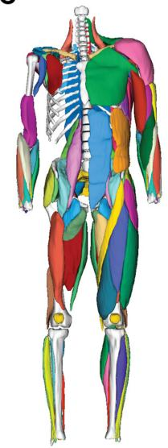  
anterior view

  
posterior view

Figure 1. MRI-based muscle segmentation and three-dimensional (3-D) reconstruction. A: representative axial water and fat images at the shoulder, elbow, and thigh levels with segmented muscles outlined. B: examples of 3-D volumetric muscle segmentations from stacked image slices. C: full-body 3-D reconstructions of segmented muscles shown in anterior and posterior views showing both deep (subject right side) and superficial (subject left side) muscles, with each muscle colored uniquely for identification.

level comprised two blocks comprising $3 \times 3 \times 3$ convolutions, batch normalization, and ReLU activation layers, followed by $2 \times 2 \times 2$ max pooling (except at the deepest level). Decoder levels used $2 \times 2 \times 2$ transposed convolutions followed by similar convolutional blocks. Feature maps from the encoder were concatenated with decoder feature maps at matching resolutions via skip connections. The final layer included a $1 \times 1 \times 1$ convolution followed by a pixelwise softmax classi-fier. Model training used a composite loss function combining dice similarity loss, cross-entropy loss, and a volume error term. Weights were initialized from a Gaussian distribution and optimized using Adam with an initial learning rate of 0.01. Training and inference were conducted on a high-performance computing cluster equipped with NVIDIA A100 GPUs and 80 GB memory per GPU. For the upper body regions (UBR and UBL), we developed a region-specific model using the same architecture and training approach. The model was retrained iteratively as additional upper body segmentations were completed, with updates occurring every 5– 10 datasets. The final upper body model segmented 33 muscles and 7 bones. All AI outputs were manually reviewed and corrected by a trained segmentation engineer. Initial manual segmentation of UBR and UBL scans required 30 h per subject. In contrast, AI-assisted segmentation and vetting reduced this time to under 3 h per subject. Inference runtime per scan was typically under 15 min. The segmentation platform (MuscleView 2.0, K251682) was validated for consistent performance across multiple MRI scanner types and acquisition parameters. These validations supported its FDA 510(k) clearance, ensuring broad generalizability in clinical and research settings.

## Evaluation of Interobserver Performance

The precision of the muscle-by-muscle and bone-by-bone 3-D segmentations was examined based on an intraobserver repeatability analysis. Three different observers vetted four unique datasets (none of which were included in the AI training dataset). Interobserver variability was assessed as the variability between two different engineers vetting the same scans. Variability was determined by finding the dice similarity coefficient (DSC) and absolute error in ROI volume between two different segmentation engineers (Supplemental Table S2). Of the 70 total muscles, all had an average dice similarity coefficient above 0.75, with most above 0.9. Average volume errors were all less than 5 mL, except for the serratus anterior, levator scapulae, and the ribs.

## Analysis of Muscle Volume, Volume Fraction, Fat Fraction, and Asymmetry

The 3-D ROIs were used for further analysis. For each ROI, the boundary ROI volume was calculated by summing the total number of pixels labeled for that segmented ROI and multiplying by the pixel’s voxel volume. The boundary volume was used in the assessment of asymmetry magnitude, normalized muscle volume, and volume fraction. For the fat fraction calculation, the boundary volume was eroded by one pixel around the entire perimeter in 3-D to reduce the impact of bordering subcutaneous or intermuscular fat on the intramuscular fat fraction value. The fat fraction (FF) (%) for each muscle was calculated as: $\frac { 1 } { \mathrm { T P } } \cdot et { } { ' } \sum _ { p = 1 } ^ { \mathrm { T P } } \left( \frac { \mathrm { F S I } _ { p } } { \mathrm { F S I } _ { p } \ + \ \mathrm { W S I } _ { p } } \right)$ 100, p pwhere TP represents the total number of pixels within the muscle, is an individual pixel, FSI is the pixel’s fat signal pintensity, and WSI is the pixel’s water signal intensity. Asymmetry between muscles on the left and right side was calculated by subtracting the contralateral muscle volume from the ipsilateral volume and dividing by the sum of left and right muscle volumes. This method results in asymmetry values for right and left muscles with identical magnitudes of opposing signs, with the larger muscle having a positive asymmetry value and the smaller muscle having a negative asymmetry value.

The volume percentage of individual muscles relative to total muscle volume across the full body was determined for subjects that had the requisite muscle coverage (males: 41; females: $n = 4 4 )$ . Descriptive statistics were computed for each muscle, including mean muscle volume (in mL), percentage of total body muscle volume, fat fraction, and asymmetry magnitude. In a subset of datasets, only one arm was imaged. Although these datasets were excluded from asymmetry analyses, they were included in total volume and volume fraction calculations by assuming bilateral symmetry in arm muscle volumes to estimate total muscle volume and compute muscle volume percentages. These values were summarized separately for all subjects combined, and for female and male subgroups. To assess sex differences, we performed two-sample tests comparing male and female tvalues for each metric. values were corrected for multiple comparisons using the Benjamini–Hochberg false discovery rate (bhFDR) method. Muscle volume asymmetry was calculated as the absolute difference between left and right sides divided by their total, reported as a percentage.

## Relationships between Muscle, Body, and Bone Size

We structured our analyses hierarchically to examine the relationships between muscle size, body size, and bone size at three levels of muscular organization. First, we regressed total muscle volume against candidate morphological predictors, including total bone volume, femur volume, mass height, mass, height, and body mass index (BMI). These variables were selected based on biological plausibility, prior literature, and practical considerations. In particular, femur volume was included as a potentially easier-to-measure proxy for total skeletal size, since full-body bone segmentation may not always be feasible in clinical or applied settings. Second, we analyzed regional muscle volumes, comparing the upper and lower body separately. Third, we examined individual muscle volumes by regressing each muscle against its anatomically associated bone volume (e.g., deltoid with humerus, gastrocnemius with tibia, Table 5) and against mass height. All regression models were performed using ordinary least squares.

Two complementary regression approaches were used. In the combined models, data from males and females were pooled into a single regression to directly test the explanatory strength of each size variable alone, without explicitly accounting for sex. In the sex-included models, sex was added as a categorical variable (with predictor sex interaction terms) to test whether slopes or intercepts differed between males and females. For each model, we report coefficient of determination ( 2 ), slope, and intercept values for combined, female, and male groups, and sex differences in slope and intercept. We also report the significance of the slope term in the full sexincluded model, using the same value thresholds and PBenjamini–Hochberg false discovery rate (bhFDR) correction as applied to all other statistical comparisons.

Although interspecies and some intraspecies studies adopt power-law models to quantify allometric relationships (17, 18), we chose to use linear (non-log-transformed) models to preserve interpretable units and better capture variation within the relatively narrow range of human body sizes. In our context, power-law analysis would have required extrapolation beyond observed ranges, potentially obscuring meaningful intraspecific patterns.

To compare the predictive utility of each independent variable, we used likelihood ratio tests to determine whether one model provided a significantly better fit to the data than another. To further explore which morphological predictors best explain known sex differences in muscle volume, we compared model residuals between males and females for each combined regression model. Residuals were computed from the combined model (excluding sex terms), and a twosample  test was used to assess whether they differed by sex. tSmaller differences in residuals were interpreted as evidence that the predictor better explained observed sex differences in muscle volume.

## Cluster Analysis of Muscle Volume Distribution

Hierarchical clustering analysis was used to examine the patterns of muscle distribution across the population, similar to that described in the study by Knaus et al. (19). For each muscle, the right and left muscle volumes were summed and represented as a fraction of the total muscle volume; a score was then calculated for each muscle by zcomparing with the average volume fraction of that muscle (across all individuals) and representing that difference in units of standard deviation across the individuals. The result was a 70-by-84 matrix of scores: 70 muscles and 84 subjects Z(only subjects with full muscle coverage were included).

The clustering analysis was then performed to understand the similarity in muscle distribution patterns. Each muscle is described as a vector, defined by row values, that exists in multidimensional space in which each dimension is defined by one athlete’s limb. Therefore, “subject space” has as many dimensions as the number of subjects included $( n = 8 4 )$ , and nas many vectors as there are muscles ( 70) exist in this nspace. Muscle vectors were clustered according to their Euclidean distance in “subject space,” meaning vectors with the most similar orientation and magnitude cluster. Vectors were linked in pairs to build a hierarchy; all vectors were compared and the two closest were clustered together. The average of this pair defined a new vector and was then compared with all remaining vectors to identify the next closest pair, repeating the process until all the original vectors were linked. These linkages are illustrated by a hierarchical dendrogram, or tree diagram. The same clustering process was also applied to the subjects (columns). Now columns define vectors in “muscle space” with as many dimensions as there are muscles ( 70) and in this space exists as many vectors nas there are subjects ( 84). Hierarchical clustering of muscles was determined from the Euclidean distance of these vectors in “muscle space.” The result is rows and columns of the original data matrix rearranged based on clustering, depicted with their dendrograms.

## Exploring Deviations from Expected Muscle-Bone-Height Relationships via Residual Analysis

To assess whether muscle and bone volumes covary beyond their shared dependence on height, we first regressed total muscle volume and total bone volume separately against height. Residuals from each regression were converted to -scores, representing subject-specific deviations from zexpected values based on stature alone. Plotting these $z -$ zscores against one another allowed us to examine how muscle and bone volumes relate to each other independent of height, directly addressing the study’s central aim of disentangling size-driven from structure-driven variation. To fur ther contextualize this relationship, we performed a separate regression of total muscle volume on total bone volume and -scored the residuals to reflect relative muscularity after accounting for skeletal size. These residuals were then mapped to a color scale. We applied a parallel approach at the individual muscle level. Each muscle’s volume was regressed on both its associated bone volume and height, and the residuals from these models were converted to - scores. These were then plotted against the residual -scores zfrom the associated bone volume–height regressions, allowing us to visualize muscle-specific deviations from expected relationships. As with the whole body analysis, muscle-tobone residuals were used as a color overlay to highlight local differences in muscularity not explained by height or skeletal dimensions. This analysis complements our broader correlations by capturing subject- and muscle-level variability in muscle–bone volume relationships beyond stature.

## RESULTS

## Volume, Volume Fraction, Fat Fraction, and Asymmetry across Muscles

Across the population studied, the distribution of muscle volume was remarkably consistent (Fig. 2 , Table 3), with Astandard deviations in percent contribution ranging from less than 0.10% (several forearm muscles) to 0.43% (gluteus maximus). The gluteus maximus was the largest individual muscle by volume, contributing an average of 4.2% in females and 3.9% in males to total body muscle volume (Table 3). In contrast, wrist muscles such as the pronator quadratus were among the smallest, contributing just 0.04% of total muscle volume in both sexes (Table 3). Side-to-side asymmetry was most pronounced in the upper limb, particularly among forearm muscles, where several muscles, including the supinator, extensor carpi ulnaris, and pronator teres, exhibited mean asymmetry values greater than 9% (Fig. 2 , Table 3). These asymmetries reflect both natural variation and frequent dominance-related differences in muscle use. Fat infiltration (Fig. 2 , Table 3) also varied widely across Bmuscles and anatomical regions. The highest fat fractions were found in trunk and scapular muscles, including the rectus abdominis (15.4% in females, 14.4% in males) and trapezius (17.6% in females, 13.0% in males). Sex differences were evident in both composition and distribution. Females had higher fat fractions across many muscles and a greater proportion of lower body muscle mass, whereas males showed higher proportional volume in upper body muscles such as the pectoralis major (1.6% of total muscle volume in males vs. 1.2% in females), deltoid (1.8% vs. 1.6%), and triceps (1.8% vs. 1.6%) (Table 3).

## Total Muscle and Bone Volume Relationships

In the regression models that pooled female and male subjects (Fig. 3), total muscle volume related most strongly with total bone volume $( r ^ { 2 } = 0 . 8 5 ; \mathrm { F i g } . 3 E )$ , followed by height mass $( r ^ { 2 } = 0 . 6 2 ; \mathrm { F i g } . 3 D )$ , height $( r ^ { 2 } = 0 . 5 8 ; \mathrm { F i g } . 3 B )$ , and mass $( r ^ { 2 } = 0 . 4 9 ; \mathrm { F i g } . 3 A )$ D r B. BMI showed no relationship with total r Amuscle volume in this form $( r ^ { 2 } \approx 0 ; \mathrm { F i g } . 3 C )$ . These rankings r Care mirrored in the full regression models which include sex as a categorical predictor (Table 4). The models that added sex as a categorical variable had similar or slightly better performance than the combined models for all predictors except BMI. For BMI, adding sex increased the $R ^ { 2 }$ from nearly zero Rto 0.65, yet the slope remained nonsignificant, indicating that its apparent explanatory power comes almost entirely from separating males and females rather than from BMI itself capturing variation within each sex. Total bone volume and femur volume not only have the strongest fits overall (Table 4) but also show no significant sex differences in slope or intercept, aligning males and females along a shared relationship. Residual analysis from the combined models (Fig. 3, – ) reinforces this finding: body-size predictors F J(mass, height, BMI, height mass) systematically overestimated muscle volume in females and underestimated it in males, whereas bone volume-based predictions showed no such sex bias. Together, the pooled-model patterns and the sex-adjusted results point to total bone volume (and femur volume as a proxy) as the most robust and sex-independent predictors of muscle volume.

## Upper versus Lower Body Relationships with Bone Volume

Upper body muscle volume was strongly correlated with lower body muscle volume $( \mathrm { F i g } . 4 A , r ^ { 2 } = \overset { \cdot } { 0 . 9 2 } )$ , and upper A rbody bone volume was similarly correlated with lower body bone volume $( \mathrm { F i g . } 4 B , r ^ { 2 } = 0 . 8 9 )$ . Despite these strong associ-B rations, males had significantly greater upper-to-lower body muscle volume ratios compared with females $( { \mathrm { F i g . ~ } } 4 C ; P <$ C P0.001) and greater upper-to-lower bone volume ratios (Fig. $4 D \colon P < 0 . 0 0 1 )$ . Ratios of upper to lower muscle volume D Pwere modestly but significantly associated with upper-tolower bone volume ratios (Fig. 4 ; $r ^ { 2 } = 0 . 1 7 , P < 0 . 0 0 1 )$ Muscle-to-bone volume ratios in the upper and lower body did not differ significantly between sexes (Fig. 4, – ), suggesting similar local muscle–bone relationships. However, these muscle-to-bone ratios were strongly correlated across limbs $( \mathrm { F i g . ~ } 4 H ; r ^ { 2 } = 0 . 3 7 , P < 0 . 0 0 1 )$ , indicating that individu-H r Pals with more muscle per unit bone in one region tended to exhibit the same pattern in the other.

## Individual Muscle Volumes Are Best Predicted by Total Muscle Volume and Associated Bone Volume

Individual muscle volumes related most strongly with total muscle volume and associated bone volume, with consistently higher $r ^ { 2 }$ values than those observed for body size rparameters such as mass, height, BMI, or height mass (Fig. 5 ). For nearly all muscles across all anatomical regions, Atotal muscle volume and associated bone volume yielded the strongest predictive relationships (mean $r ^ { 2 }$ across muscles: 0.73 and 0.67, respectively), whereas BMI performed the poorest. Among body size metrics, height mass generally outperformed mass or height alone, but still explained less variance than associated bone or total muscle volume (e.g., Fig. 5, – B). For instance, the latissimus dorsi (shoulder) and erector Gspinae (trunk) volumes showed strong associations with both total muscle volume $( r ^ { 2 } > 0 . 9 )$ and associated bone volume $( r ^ { 2 } = 0 . 6 9 – 0 . 7 3 )$ r, but much weaker relationships with BMI $( r ^ { 2 } < 0 . 4 )$ . Similarly, lower limb muscles like the vastus latera-rlis and tibialis anterior showed a strong relationship with total muscle $( r ^ { 2 } = 0 . 8 8$ and 0.87, respectively) and bone volume $( r ^ { 2 } = 0 . 6 0$ each), but not with BMI or height alone. This pat-rtern was also evident in statistical comparisons: for 63 of the 70 muscles analyzed, associated bone volume explained significantly more variance in muscle size than height  mass (Table 5; $P < 0 . 0 0 1 )$ . These results suggest that local skeletal Pdimensions better reflect individual muscle sizes than global body size metrics, and that bone volume is a biologically meaningful predictor of muscle morphology across the body.

A  
B  
C  
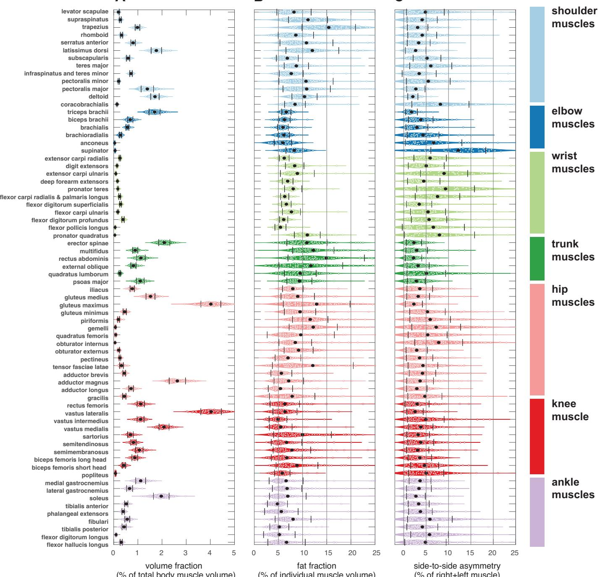  
Figure 2. Violin plots showing the distribution of muscle volume fraction (percentage of total body muscle volume) (A), fat fraction (percentage of individual muscle volume) (B), and side-to-side asymmetry (absolute percent difference between right and left muscles) (C) across all muscles. Muscles are grouped by anatomical region (shoulder, elbow, wrist, trunk, hip, knee, and ankle) with color-coded labels. Violin plots display the distribution, mean (dots), and standard deviation (solid lines) for each muscle.

## Sex-Specific Clustering of Whole Body Muscle Distribution

Hierarchical clustering of muscle volume percent -scores zrevealed strong sex-specific organization of whole body muscle distribution (Fig. 6). Most subjects clustered with others of the same sex, forming two large groups broadly dominated by either female or male subjects. However, a subset of individuals (3 females and 3 males) clustered with the opposite sex, indicating some variation in distribution patterns within each group. Subjects in the female-dominated cluster ( ) showed relatively greater volume fractions in trunk, calf, and deep hip muscles (gluteus minimus, piriformis, semimembranosus), whereas the male-dominated cluster ( ) showed greater relative volume in upper rightlimb muscles (shoulder, elbow, and wrist) and portions of the hip. Functionally related muscles also clustered together, suggesting common usage patterns. These results support the presence of biologically meaningful, sex-linked differences in muscle distribution, while also highlighting individual variation within each sex.

Table 3. Mean muscle volume, percentage of total muscle volume, fat fraction, and asymmetry magnitude for each muscle, reported separately for combined, female, and male groups
<table><tr><td rowspan=2 colspan=15>Volume Percent ofMuscle Volume, mL                       Total Muscle Volume, %Combined    Female       Male        CombinedFemale   Male</td><td rowspan=1 colspan=10>Fat Fraction                     Asymmetry Magnitude(% of Muscle Volume)                 (Difference/Total, %)</td></tr><tr><td rowspan=1 colspan=4></td><td rowspan=1 colspan=3>Male M</td><td rowspan=1 colspan=2>Combined</td><td rowspan=1 colspan=5>Female Male M</td><td rowspan=1 colspan=1>Combined</td><td rowspan=1 colspan=1>Female</td><td rowspan=1 colspan=3>Male   M</td><td rowspan=1 colspan=1>Combined</td><td rowspan=1 colspan=4>Female   Male   M</td></tr><tr><td rowspan=1 colspan=1>Muscle</td><td rowspan=1 colspan=2>Mean SD</td><td rowspan=1 colspan=2>Mean SD</td><td rowspan=1 colspan=3>Mean  SD.F Me</td><td rowspan=1 colspan=2>an D Me</td><td rowspan=1 colspan=2>an SD M</td><td rowspan=1 colspan=3>ean Dvs. F</td><td rowspan=1 colspan=1>Mean DMean</td><td rowspan=1 colspan=1>SDM</td><td rowspan=1 colspan=3>ean D . F M</td><td rowspan=1 colspan=1>ean DMean</td><td rowspan=1 colspan=1>SDM</td><td rowspan=1 colspan=3>ean D vs. F</td></tr><tr><td rowspan=1 colspan=1>Levator scapulae</td><td rowspan=1 colspan=2>43.1013.46</td><td rowspan=1 colspan=2>33.058.16</td><td rowspan=1 colspan=1>53.76</td><td rowspan=1 colspan=2>9.02 ***</td><td rowspan=1 colspan=2>0.20 0.03</td><td rowspan=1 colspan=2>0.19 0.03</td><td rowspan=1 colspan=3>0.21 0.03 ns</td><td rowspan=1 colspan=1>8.22 3.55</td><td rowspan=1 colspan=1>8.99 3.91</td><td rowspan=1 colspan=3>7.35 2.89 ns4.84</td><td rowspan=1 colspan=1>4.21</td><td rowspan=1 colspan=1>3.63 2.87</td><td rowspan=1 colspan=2>6.00 4.93</td><td rowspan=1 colspan=1>ns</td></tr><tr><td rowspan=1 colspan=1>Supraspinatus</td><td rowspan=1 colspan=2>58.19.99</td><td rowspan=1 colspan=2>442711.8</td><td rowspan=1 colspan=1>74.15</td><td rowspan=1 colspan=2>14.66 **</td><td rowspan=1 colspan=2>*</td><td rowspan=1 colspan=1>0.26</td><td rowspan=1 colspan=1>0.04</td><td rowspan=1 colspan=2>0.29 0.03</td><td rowspan=1 colspan=1>ns</td><td rowspan=1 colspan=1>11.12 4.03</td><td rowspan=1 colspan=1>12.76 4.16</td><td rowspan=1 colspan=1>9.42</td><td rowspan=1 colspan=2>**</td><td rowspan=1 colspan=1>4.11 3.37</td><td rowspan=1 colspan=1>3,78 3.36</td><td rowspan=1 colspan=1>4.42</td><td rowspan=1 colspan=1>3.39</td><td rowspan=1 colspan=1>ns</td></tr><tr><td rowspan=1 colspan=1>Trapezius</td><td rowspan=1 colspan=2> 215.0064.77</td><td rowspan=1 colspan=2>168.1436.842</td><td rowspan=1 colspan=1>64.74</td><td rowspan=1 colspan=2>48.96***</td><td rowspan=1 colspan=2>0.98 0.10</td><td rowspan=1 colspan=1>0.97</td><td rowspan=1 colspan=1>0.11</td><td rowspan=1 colspan=2>1,00 0.08</td><td rowspan=1 colspan=1>ns</td><td rowspan=1 colspan=1>15.41 5.531</td><td rowspan=1 colspan=1>17.55 4.92</td><td rowspan=1 colspan=1>13.04</td><td rowspan=1 colspan=2>**</td><td rowspan=1 colspan=1>3.09 2.30</td><td rowspan=1 colspan=1>3.262.33</td><td rowspan=1 colspan=1>2.93</td><td rowspan=1 colspan=1>2.28</td><td rowspan=1 colspan=1>ns</td></tr><tr><td rowspan=1 colspan=1>homboid</td><td rowspan=1 colspan=2>6.21.04</td><td rowspan=1 colspan=2>53.9210.9</td><td rowspan=1 colspan=1>86.25</td><td rowspan=1 colspan=2>15.72*</td><td rowspan=1 colspan=2>0.32 0.05</td><td rowspan=1 colspan=1>0.32</td><td rowspan=1 colspan=1>0.05</td><td rowspan=1 colspan=2>0.33 0.04</td><td rowspan=1 colspan=1>ns</td><td rowspan=1 colspan=1>8.60 3.66</td><td rowspan=1 colspan=1>9.75 4.06</td><td rowspan=1 colspan=1>7.30</td><td rowspan=1 colspan=2>ns</td><td rowspan=1 colspan=1>4.13 3.23</td><td rowspan=1 colspan=1>4.15 278</td><td rowspan=1 colspan=1>4.11</td><td rowspan=1 colspan=1>3.63</td><td rowspan=1 colspan=1>ns</td></tr><tr><td rowspan=1 colspan=1>Serratus anterior</td><td rowspan=1 colspan=2> 173.59</td><td rowspan=1 colspan=1>137.30</td><td rowspan=1 colspan=1>22.25</td><td rowspan=1 colspan=1>21.36</td><td rowspan=1 colspan=2>35.55 *</td><td rowspan=1 colspan=2>0.80 0.09</td><td rowspan=1 colspan=1>0.80</td><td rowspan=1 colspan=1>0.11</td><td rowspan=1 colspan=2>0.80 0.07</td><td rowspan=1 colspan=1>ns</td><td rowspan=1 colspan=1>10.80 5.48</td><td rowspan=1 colspan=1>12.50 6.48</td><td rowspan=1 colspan=3>ns</td><td rowspan=1 colspan=1>3.34 2.56</td><td rowspan=1 colspan=1>3.24 2.59</td><td rowspan=1 colspan=2>3.44</td><td rowspan=1 colspan=1>ns</td></tr><tr><td rowspan=1 colspan=1>Latissimuss dorsi</td><td rowspan=1 colspan=2>140.29</td><td rowspan=1 colspan=1>91.09</td><td rowspan=1 colspan=1>71.67</td><td rowspan=1 colspan=1>496.93</td><td rowspan=1 colspan=2>115.26***</td><td rowspan=1 colspan=2>1.770.22</td><td rowspan=1 colspan=1>1.68</td><td rowspan=1 colspan=1>0.19</td><td rowspan=1 colspan=2>1.85 0.21</td><td rowspan=1 colspan=1>**</td><td rowspan=1 colspan=1>12.02 5.47</td><td rowspan=1 colspan=1>13.43 6.521</td><td rowspan=1 colspan=3>10.553.61ns</td><td rowspan=1 colspan=1>2.65 2.30</td><td rowspan=1 colspan=1>2.422.02</td><td rowspan=1 colspan=2>2.882.54</td><td rowspan=1 colspan=1>ns</td></tr><tr><td rowspan=1 colspan=1>Subscapularis</td><td rowspan=1 colspan=1>27.87</td><td rowspan=1 colspan=1>40.01</td><td rowspan=1 colspan=1>9742</td><td rowspan=1 colspan=1>18..86</td><td rowspan=1 colspan=1>60.51</td><td rowspan=1 colspan=2>29.54 ***</td><td rowspan=1 colspan=2>0.59 0.07 0</td><td rowspan=1 colspan=1>.57</td><td rowspan=1 colspan=1>0.06 0.62 0.06</td><td rowspan=1 colspan=2>0.62 0.06</td><td rowspan=1 colspan=1>**</td><td rowspan=1 colspan=1>6.84 2.26</td><td rowspan=1 colspan=1>7.32 2.74</td><td rowspan=1 colspan=3>6.31.48ns</td><td rowspan=1 colspan=1>5.19 1</td><td rowspan=1 colspan=1>5.32 3.33</td><td rowspan=1 colspan=2>5.07 2.90</td><td rowspan=1 colspan=1>ns</td></tr><tr><td rowspan=1 colspan=1>Tees major</td><td rowspan=1 colspan=1>25.</td><td rowspan=1 colspan=1>8.86</td><td rowspan=1 colspan=1>18.69</td><td rowspan=1 colspan=1>4.96</td><td rowspan=1 colspan=1>32.14</td><td rowspan=1 colspan=2>6.51 ***</td><td rowspan=1 colspan=2>0.12 0.02</td><td rowspan=1 colspan=1>0.11</td><td rowspan=1 colspan=1>0.02</td><td rowspan=1 colspan=2>0.13 0.02</td><td rowspan=1 colspan=1>**</td><td rowspan=1 colspan=1>8.71 2.52</td><td rowspan=1 colspan=1>8.90 2.71</td><td rowspan=1 colspan=2>8.51 2.31</td><td rowspan=1 colspan=1>ns</td><td rowspan=1 colspan=1>6.03 4.70</td><td rowspan=1 colspan=1>5.163.58</td><td rowspan=1 colspan=2>6.85 5.47</td><td rowspan=1 colspan=1>ns</td></tr><tr><td rowspan=1 colspan=1>Infraspinatus and1</td><td rowspan=1 colspan=1>557.3</td><td rowspan=1 colspan=1>499.226</td><td rowspan=1 colspan=1>19.57</td><td rowspan=1 colspan=1>23.12</td><td rowspan=1 colspan=1>197.86</td><td rowspan=1 colspan=2>35.62 ***</td><td rowspan=1 colspan=2>0.72 0.06 0</td><td rowspan=1 colspan=1>.69</td><td rowspan=1 colspan=1>0.05</td><td rowspan=1 colspan=2>0.75 0.05</td><td rowspan=1 colspan=1>***</td><td rowspan=1 colspan=1>7.66</td><td rowspan=1 colspan=1>8.05 2.802.45</td><td rowspan=1 colspan=1>7.25</td><td rowspan=1 colspan=1>1.98</td><td rowspan=1 colspan=1>ns</td><td rowspan=1 colspan=1>3.44 3.81</td><td rowspan=1 colspan=1>2.94 1.89</td><td rowspan=1 colspan=1>3.91</td><td rowspan=1 colspan=1>4.96</td><td rowspan=1 colspan=1>ns</td></tr><tr><td rowspan=1 colspan=1>Pectoralis minor</td><td rowspan=1 colspan=1>44.35</td><td rowspan=1 colspan=1>14.89</td><td rowspan=1 colspan=1>33.63</td><td rowspan=1 colspan=1>8.61</td><td rowspan=1 colspan=1>55.84</td><td rowspan=1 colspan=1>11.14</td><td rowspan=1 colspan=1>***</td><td rowspan=1 colspan=2>0.21 0.03 0</td><td rowspan=1 colspan=1>.200</td><td rowspan=1 colspan=1>.03 0</td><td rowspan=1 colspan=2>.22 0.02</td><td rowspan=1 colspan=1>*</td><td rowspan=1 colspan=1>10.70 5.62</td><td rowspan=1 colspan=1>11.75 6.64</td><td rowspan=1 colspan=1>9.57</td><td rowspan=1 colspan=1>4.02</td><td rowspan=1 colspan=1>ns</td><td rowspan=1 colspan=1>5.48</td><td rowspan=1 colspan=1>5.40 5.034.90</td><td rowspan=1 colspan=1>5.55</td><td rowspan=1 colspan=1>4.82</td><td rowspan=1 colspan=1>ns</td></tr><tr><td rowspan=1 colspan=1>Pectoralis major</td><td rowspan=1 colspan=1>314.51</td><td rowspan=1 colspan=1>133.80</td><td rowspan=1 colspan=1>212.05</td><td rowspan=1 colspan=1>55.51</td><td rowspan=1 colspan=1>424.28</td><td rowspan=1 colspan=1>102.17</td><td rowspan=1 colspan=1>***</td><td rowspan=1 colspan=1>1.39</td><td rowspan=1 colspan=1>0.26</td><td rowspan=1 colspan=1>1.21</td><td rowspan=1 colspan=1>0.15</td><td rowspan=1 colspan=1>1.59</td><td rowspan=1 colspan=1>0.19</td><td rowspan=1 colspan=1>***</td><td rowspan=1 colspan=1>10.84 4.90</td><td rowspan=1 colspan=1>11.85 5.97</td><td rowspan=1 colspan=1>9.76</td><td rowspan=1 colspan=1>3.07</td><td rowspan=1 colspan=1>ns</td><td rowspan=1 colspan=1>2.70</td><td rowspan=1 colspan=1>2.05</td><td rowspan=1 colspan=1>2.82</td><td rowspan=1 colspan=1>2.27</td><td rowspan=1 colspan=1>ns</td></tr><tr><td rowspan=1 colspan=1>Deltoid</td><td rowspan=1 colspan=1>385.32</td><td rowspan=1 colspan=1>129.81.</td><td rowspan=1 colspan=1>287.97</td><td rowspan=1 colspan=1>58.98</td><td rowspan=1 colspan=1>493 77</td><td rowspan=1 colspan=1>96.83</td><td rowspan=1 colspan=1>***</td><td rowspan=1 colspan=1>171</td><td rowspan=1 colspan=1>0.17</td><td rowspan=1 colspan=1>.160</td><td rowspan=1 colspan=1>O 11</td><td rowspan=1 colspan=1>183</td><td rowspan=1 colspan=1>0.14</td><td rowspan=1 colspan=1>***</td><td rowspan=1 colspan=1>10.40.2.60</td><td rowspan=1 colspan=1>10.69.2.30</td><td rowspan=1 colspan=1>1010</td><td rowspan=1 colspan=1>2.89</td><td rowspan=1 colspan=1>ns.</td><td rowspan=1 colspan=1>2.03 1.13</td><td rowspan=1 colspan=1>2.14 1.01</td><td rowspan=1 colspan=1>1.92</td><td rowspan=1 colspan=1>124</td><td rowspan=1 colspan=1>.ns</td></tr><tr><td rowspan=1 colspan=1>Triceps brachii</td><td rowspan=1 colspan=1>91.431</td><td rowspan=1 colspan=1>39.94 2</td><td rowspan=1 colspan=1>86.40</td><td rowspan=1 colspan=1>67.74</td><td rowspan=1 colspan=1>96.46</td><td rowspan=1 colspan=1>11170</td><td rowspan=1 colspan=1>*</td><td rowspan=1 colspan=1>*</td><td rowspan=1 colspan=1>0.23</td><td rowspan=1 colspan=1>1.55</td><td rowspan=1 colspan=1>0.15</td><td rowspan=1 colspan=1>1.84</td><td rowspan=1 colspan=1>0.20</td><td rowspan=1 colspan=1>***</td><td rowspan=1 colspan=1>6.64</td><td rowspan=1 colspan=1>0.966.75</td><td rowspan=1 colspan=1>1.02</td><td rowspan=1 colspan=1>0.91</td><td rowspan=1 colspan=1>ns</td><td rowspan=1 colspan=1>1.73 1.31</td><td rowspan=1 colspan=1>1.65</td><td rowspan=1 colspan=1>1.841.25</td><td rowspan=1 colspan=1>1.39</td><td rowspan=1 colspan=1>ns</td></tr><tr><td rowspan=1 colspan=1>Coracobrachialis</td><td rowspan=1 colspan=1>28.9</td><td rowspan=1 colspan=1>9.47</td><td rowspan=1 colspan=1>22.52</td><td rowspan=1 colspan=1>6.05</td><td rowspan=1 colspan=1>35.84</td><td rowspan=1 colspan=1>7.39</td><td rowspan=1 colspan=1>***</td><td rowspan=1 colspan=2>0.14 0.02</td><td rowspan=1 colspan=1>0.13</td><td rowspan=1 colspan=1>0.02</td><td rowspan=1 colspan=1>0.14</td><td rowspan=1 colspan=1>0.02</td><td rowspan=1 colspan=1>ns</td><td rowspan=1 colspan=1>8.43 2.15</td><td rowspan=1 colspan=1>8.65.2.35</td><td rowspan=1 colspan=1>8.21</td><td rowspan=1 colspan=1>1.94</td><td rowspan=1 colspan=1>ns</td><td rowspan=1 colspan=1>8.19 6.39</td><td rowspan=1 colspan=1>7.41 4.80</td><td rowspan=1 colspan=1>8.99</td><td rowspan=1 colspan=1>7.68</td><td rowspan=1 colspan=1>ns</td></tr><tr><td rowspan=1 colspan=1>Biceps brachi</td><td rowspan=1 colspan=1>15404</td><td rowspan=1 colspan=1>61.58</td><td rowspan=1 colspan=1>106.72</td><td rowspan=1 colspan=1>24.38</td><td rowspan=1 colspan=1>203.63.</td><td rowspan=1 colspan=1>48.26</td><td rowspan=1 colspan=1>***</td><td rowspan=1 colspan=1>0.68</td><td rowspan=1 colspan=1></td><td rowspan=1 colspan=1>0.60</td><td rowspan=1 colspan=1>0.07</td><td rowspan=1 colspan=1>0.77</td><td rowspan=1 colspan=1>0.09</td><td rowspan=1 colspan=1>***</td><td rowspan=1 colspan=1>6.25 1.9</td><td rowspan=1 colspan=1>6.54 1.32</td><td rowspan=1 colspan=1>5.99</td><td rowspan=1 colspan=1>100</td><td rowspan=1 colspan=1>ns.</td><td rowspan=1 colspan=1>3.80 2.74</td><td rowspan=1 colspan=1>3.39 2.16</td><td rowspan=1 colspan=1>4.24</td><td rowspan=1 colspan=1>3.24</td><td rowspan=1 colspan=1>.ns</td></tr><tr><td rowspan=1 colspan=1>Brachialis</td><td rowspan=1 colspan=1>127.75</td><td rowspan=1 colspan=1>40.70</td><td rowspan=1 colspan=1>97.21</td><td rowspan=1 colspan=1>17.90</td><td rowspan=1 colspan=1>158.67</td><td rowspan=1 colspan=1>33.26</td><td rowspan=1 colspan=1>***</td><td rowspan=1 colspan=1>0.57</td><td rowspan=1 colspan=1>0.06</td><td rowspan=1 colspan=1>0.54</td><td rowspan=1 colspan=1>0.05</td><td rowspan=1 colspan=1>0.60</td><td rowspan=1 colspan=1>0.06</td><td rowspan=1 colspan=1></td><td rowspan=1 colspan=1>5.93 1.09</td><td rowspan=1 colspan=1>6.04 1.37</td><td rowspan=1 colspan=1>5.85</td><td rowspan=1 colspan=1>0.81</td><td rowspan=1 colspan=1>ns</td><td rowspan=1 colspan=1>2.93 2.46</td><td rowspan=1 colspan=1>2.78 2.14</td><td rowspan=1 colspan=1>3.11</td><td rowspan=1 colspan=1>2.82</td><td rowspan=1 colspan=1>ns</td></tr><tr><td rowspan=1 colspan=1>Brachioradialis</td><td rowspan=1 colspan=1>637</td><td rowspan=1 colspan=1>23.86</td><td rowspan=1 colspan=1>44.74</td><td rowspan=1 colspan=1>100.73</td><td rowspan=1 colspan=1>82.24</td><td rowspan=1 colspan=1>17.78</td><td rowspan=1 colspan=1>***</td><td rowspan=1 colspan=1>0.28</td><td rowspan=1 colspan=1>0.05</td><td rowspan=1 colspan=1>0.25</td><td rowspan=1 colspan=1>0.04</td><td rowspan=1 colspan=2>0.31 0.04</td><td rowspan=1 colspan=1>***</td><td rowspan=1 colspan=1>6.13</td><td rowspan=1 colspan=1>6.68 0.911.13</td><td rowspan=1 colspan=1>5.73</td><td rowspan=1 colspan=1>1.12</td><td rowspan=1 colspan=1>ns</td><td rowspan=1 colspan=1>4.31 3.55</td><td rowspan=1 colspan=1>4.57 3.75</td><td rowspan=1 colspan=1>3.96</td><td rowspan=1 colspan=1>3.31</td><td rowspan=1 colspan=1>ns</td></tr><tr><td rowspan=1 colspan=1>Extensor carpi</td><td rowspan=1 colspan=1>56.76</td><td rowspan=1 colspan=1>17.32</td><td rowspan=1 colspan=1>42.97</td><td rowspan=1 colspan=1>88.73</td><td rowspan=1 colspan=1>70.01</td><td rowspan=1 colspan=2>1.46 ** 0.2</td><td rowspan=1 colspan=1>6 0.</td><td rowspan=1 colspan=1>03 0</td><td rowspan=1 colspan=1>.24</td><td rowspan=1 colspan=1>0.03</td><td rowspan=1 colspan=2>0.27 0.0</td><td rowspan=1 colspan=1>2 **</td><td rowspan=1 colspan=1>6.20</td><td rowspan=1 colspan=1>6.42 0.811.01</td><td rowspan=1 colspan=1>6.051</td><td rowspan=1 colspan=1>.11</td><td rowspan=1 colspan=1>ns</td><td rowspan=1 colspan=1>5.89 3.63</td><td rowspan=1 colspan=1>6.44 3.8</td><td rowspan=1 colspan=1>4 5.0</td><td rowspan=1 colspan=1>8 3.2</td><td rowspan=1 colspan=1>0 s</td></tr><tr><td rowspan=2 colspan=1>Anconeus</td><td rowspan=2 colspan=1>9.09</td><td rowspan=2 colspan=1>2.99</td><td rowspan=2 colspan=1>7.11</td><td rowspan=2 colspan=1>1.96</td><td rowspan=2 colspan=1>11.02</td><td rowspan=2 colspan=1>2.53 *</td><td rowspan=2 colspan=1>** 0</td><td rowspan=2 colspan=1>.04 0</td><td rowspan=2 colspan=1>.01 0</td><td rowspan=2 colspan=1>.04</td><td rowspan=2 colspan=1>0.01</td><td rowspan=2 colspan=2>0.04 0.01</td><td rowspan=2 colspan=1>5.91</td><td rowspan=2 colspan=1>1.79</td><td rowspan=2 colspan=1>7.22,120</td><td rowspan=2 colspan=2>5.02,158</td><td rowspan=2 colspan=1>***</td><td></td><td></td><td></td><td></td><td></td></tr><tr><td rowspan=1 colspan=1>6.67 6.31</td><td rowspan=1 colspan=1>6.60 6.92</td><td rowspan=1 colspan=1>6.78</td><td rowspan=1 colspan=1>5.47</td><td rowspan=1 colspan=1>ns</td></tr><tr><td rowspan=1 colspan=1>Digit extensors</td><td rowspan=1 colspan=1>39.93</td><td rowspan=1 colspan=1>12.1</td><td rowspan=1 colspan=1>31.26</td><td rowspan=1 colspan=1>5.84</td><td rowspan=1 colspan=1>48.14</td><td rowspan=1 colspan=1>10.71</td><td rowspan=1 colspan=1>***</td><td rowspan=1 colspan=1>0.18</td><td rowspan=1 colspan=1>0.02</td><td rowspan=1 colspan=1>0.18</td><td rowspan=1 colspan=1>0.02</td><td rowspan=1 colspan=2>0.180.03</td><td rowspan=1 colspan=1>ns</td><td rowspan=1 colspan=1>8.36 1.92</td><td rowspan=1 colspan=1>8.59 153</td><td rowspan=1 colspan=2>8.21 2.16</td><td rowspan=1 colspan=1>ns</td><td rowspan=1 colspan=1>5.00 4.01</td><td rowspan=1 colspan=1>4.00 2.32</td><td rowspan=1 colspan=1>6.48</td><td rowspan=1 colspan=1>5.34</td><td rowspan=1 colspan=1>ns</td></tr><tr><td rowspan=1 colspan=1>tensor carpi</td><td rowspan=1 colspan=1>9.16</td><td rowspan=1 colspan=1>6.51</td><td rowspan=1 colspan=1>15.00</td><td rowspan=1 colspan=1>3.82</td><td rowspan=1 colspan=1>23.10</td><td rowspan=1 colspan=1>6.08 ***</td><td rowspan=1 colspan=1></td><td rowspan=1 colspan=1>0.090</td><td rowspan=1 colspan=1>.02 0</td><td rowspan=1 colspan=1>.09</td><td rowspan=1 colspan=1>0.020</td><td rowspan=1 colspan=2>.09 0.01ns</td><td rowspan=1 colspan=1>8.92</td><td rowspan=1 colspan=1>3.51</td><td rowspan=1 colspan=1>9.28</td><td rowspan=1 colspan=2>2.538.68 4.04</td><td rowspan=1 colspan=1>ns9.01</td><td rowspan=1 colspan=1>5.27</td><td rowspan=1 colspan=1>8.34 4.20</td><td rowspan=1 colspan=1>9.98</td><td rowspan=1 colspan=1>6.51</td><td rowspan=1 colspan=1>ns</td></tr><tr><td rowspan=1 colspan=1>ulnarisDeep forearm</td><td rowspan=1 colspan=1>31.75</td><td rowspan=1 colspan=1>8.99</td><td rowspan=1 colspan=1>24.83</td><td rowspan=1 colspan=1>4.94</td><td rowspan=1 colspan=1>38.31</td><td rowspan=1 colspan=1>6.75</td><td rowspan=1 colspan=1></td><td rowspan=1 colspan=1>0.15</td><td rowspan=1 colspan=1>0.02</td><td rowspan=1 colspan=1>0.14</td><td rowspan=1 colspan=1>0.02</td><td rowspan=1 colspan=2>0.15 0.02</td><td rowspan=1 colspan=1></td><td rowspan=1 colspan=1>6.91 1.10</td><td rowspan=1 colspan=1>6.66 1.00</td><td rowspan=1 colspan=2>7.09 1.16</td><td rowspan=1 colspan=1>ns</td><td rowspan=1 colspan=1>4.47 3.62</td><td rowspan=1 colspan=1>4.33 3.31</td><td rowspan=1 colspan=1>4.66</td><td rowspan=1 colspan=1>4.09</td><td rowspan=1 colspan=1>ns</td></tr><tr><td rowspan=1 colspan=1>extensorsSupinator</td><td rowspan=1 colspan=1>16.16</td><td rowspan=1 colspan=1>5.42</td><td rowspan=1 colspan=1>12.59</td><td rowspan=1 colspan=1>2.95</td><td rowspan=1 colspan=1>19.55</td><td rowspan=1 colspan=1>5.04 ***</td><td rowspan=1 colspan=1></td><td rowspan=1 colspan=1>0.08 0</td><td rowspan=1 colspan=1>.01</td><td rowspan=1 colspan=1>0.08</td><td rowspan=1 colspan=1>0.01</td><td rowspan=1 colspan=2>0.08 0.01</td><td rowspan=1 colspan=1>ns8.27</td><td rowspan=1 colspan=1>1.71</td><td rowspan=1 colspan=1>770,156</td><td rowspan=1 colspan=1>8.65</td><td rowspan=1 colspan=1>172</td><td rowspan=1 colspan=1></td><td rowspan=1 colspan=1></td><td rowspan=1 colspan=1></td><td rowspan=1 colspan=1>12.44</td><td rowspan=1 colspan=1>5.96</td><td rowspan=1 colspan=1></td></tr><tr><td rowspan=1 colspan=1>Pronator teres</td><td rowspan=1 colspan=1>3639</td><td rowspan=1 colspan=1>11.30</td><td rowspan=1 colspan=1>228.96</td><td rowspan=1 colspan=1>7.36</td><td rowspan=1 colspan=1>4.53</td><td rowspan=1 colspan=1>9.73</td><td rowspan=1 colspan=1>***</td><td rowspan=1 colspan=1>0.17</td><td rowspan=1 colspan=1>0.03</td><td rowspan=1 colspan=1>0.17</td><td rowspan=1 colspan=1>0.03</td><td rowspan=1 colspan=2>0.17, 0.02</td><td rowspan=1 colspan=1>ns</td><td rowspan=1 colspan=1>8.06 1.78</td><td rowspan=1 colspan=1>8.25 154</td><td rowspan=1 colspan=1>7.93</td><td rowspan=1 colspan=1>1.94</td><td rowspan=1 colspan=1>ns.</td><td rowspan=1 colspan=1>9.34 6.45</td><td rowspan=1 colspan=1>9.015.08</td><td rowspan=1 colspan=1>9.82</td><td rowspan=1 colspan=1>8.13</td><td rowspan=1 colspan=1>ns</td></tr><tr><td rowspan=1 colspan=1>Flexor carpi radialis</td><td rowspan=1 colspan=1> 2.09</td><td rowspan=1 colspan=1>15.57</td><td rowspan=1 colspan=1>41.80</td><td rowspan=1 colspan=1>9.30</td><td rowspan=1 colspan=1>61.97</td><td rowspan=1 colspan=1>13.90</td><td rowspan=1 colspan=1>***</td><td rowspan=1 colspan=1>0.25</td><td rowspan=1 colspan=1>0.04</td><td rowspan=1 colspan=1>0.25</td><td rowspan=1 colspan=1>0.04</td><td rowspan=1 colspan=2>0.24 0.03</td><td rowspan=1 colspan=1>ns</td><td rowspan=1 colspan=1>6.30 0.84</td><td rowspan=1 colspan=1>6.70 0.8</td><td rowspan=1 colspan=1>1</td><td rowspan=1 colspan=1>0.77</td><td rowspan=1 colspan=1>ns</td><td rowspan=1 colspan=1>7.54 4.97</td><td rowspan=1 colspan=1>8.04 5.63</td><td rowspan=1 colspan=1>6.83</td><td rowspan=1 colspan=1>3.86</td><td rowspan=1 colspan=1>ns</td></tr><tr><td rowspan=1 colspan=1>and palmaris</td><td rowspan=1 colspan=1></td><td rowspan=1 colspan=1></td><td rowspan=1 colspan=1></td><td rowspan=1 colspan=1></td><td rowspan=1 colspan=1></td><td rowspan=1 colspan=1></td><td rowspan=1 colspan=1></td><td rowspan=1 colspan=1></td><td rowspan=1 colspan=1></td><td rowspan=1 colspan=1></td><td rowspan=1 colspan=1></td><td rowspan=1 colspan=2></td><td rowspan=1 colspan=1></td><td rowspan=1 colspan=1></td><td rowspan=1 colspan=1></td><td rowspan=1 colspan=1></td><td rowspan=1 colspan=1></td><td rowspan=1 colspan=1></td><td rowspan=1 colspan=1></td><td rowspan=1 colspan=1></td><td rowspan=1 colspan=1></td><td rowspan=1 colspan=1></td><td rowspan=1 colspan=1></td></tr><tr><td rowspan=1 colspan=1>llongusFlexor digitorum</td><td rowspan=1 colspan=1>63.88</td><td rowspan=1 colspan=1>19.58</td><td rowspan=1 colspan=1>48.36</td><td rowspan=1 colspan=1>9.52</td><td rowspan=1 colspan=1>78.78</td><td rowspan=1 colspan=1>14.50</td><td rowspan=1 colspan=1></td><td rowspan=1 colspan=1>0.29</td><td rowspan=1 colspan=1>0.04</td><td rowspan=1 colspan=1>0.27</td><td rowspan=1 colspan=1>0.03</td><td rowspan=1 colspan=2>0.30 0.03</td><td rowspan=1 colspan=1></td><td rowspan=1 colspan=1>6.64 0.99</td><td rowspan=1 colspan=1>6.94 1.02</td><td rowspan=1 colspan=1>6.44</td><td rowspan=1 colspan=1>0.93</td><td rowspan=1 colspan=1></td><td rowspan=1 colspan=1>3.45 2.81</td><td rowspan=1 colspan=1>3.81 3.27</td><td rowspan=1 colspan=1>2.93</td><td rowspan=1 colspan=1>1.92</td><td rowspan=1 colspan=1>ns</td></tr><tr><td rowspan=1 colspan=1>superficiaisFlexor carpi ulnaris</td><td rowspan=1 colspan=1>38.20</td><td rowspan=1 colspan=1>11.54</td><td rowspan=1 colspan=1>29.79</td><td rowspan=1 colspan=1>5.70</td><td rowspan=1 colspan=1>46.06</td><td rowspan=1 colspan=1>9.97</td><td rowspan=1 colspan=1>***</td><td rowspan=1 colspan=1>0.17</td><td rowspan=1 colspan=1></td><td rowspan=1 colspan=1>0.17</td><td rowspan=1 colspan=1>0.02</td><td rowspan=1 colspan=2>0.02</td><td rowspan=1 colspan=1>ns</td><td rowspan=1 colspan=1>7.69</td><td rowspan=1 colspan=1>8.78 2.211.86</td><td rowspan=1 colspan=1>6.96</td><td rowspan=1 colspan=1>114</td><td rowspan=1 colspan=1>*</td><td rowspan=1 colspan=1>5.42 3.93</td><td rowspan=1 colspan=1>5.02 3.67</td><td rowspan=1 colspan=1>6.02</td><td rowspan=1 colspan=1>4.29</td><td rowspan=1 colspan=1></td></tr><tr><td rowspan=1 colspan=1>le xor diditorum</td><td rowspan=1 colspan=1>84.79</td><td rowspan=1 colspan=1>25.82</td><td rowspan=1 colspan=1>65.92</td><td rowspan=1 colspan=1>13.23</td><td rowspan=1 colspan=1>102.67</td><td rowspan=1 colspan=2>21.81 **</td><td rowspan=1 colspan=1>*00.0</td><td rowspan=1 colspan=1>5 0</td><td rowspan=1 colspan=1>.8 0</td><td rowspan=1 colspan=1>.050</td><td rowspan=1 colspan=2>.40 0.0</td><td rowspan=1 colspan=1>5s</td><td rowspan=1 colspan=1>6.09 0.86</td><td rowspan=1 colspan=1>6.26 0.95</td><td rowspan=1 colspan=1>5.98</td><td rowspan=1 colspan=1>0.79</td><td rowspan=1 colspan=1>ns</td><td rowspan=1 colspan=1>5.65</td><td rowspan=1 colspan=1>3.965.36</td><td rowspan=1 colspan=1>3.8</td><td rowspan=1 colspan=1>6.09</td><td rowspan=1 colspan=1>ns4.11</td></tr><tr><td rowspan=1 colspan=1>profundusFlexr pllicis</td><td rowspan=1 colspan=1>16.15</td><td rowspan=1 colspan=1>4.93</td><td rowspan=1 colspan=1>12.72</td><td rowspan=1 colspan=1>2.85</td><td rowspan=1 colspan=1>19.40</td><td rowspan=1 colspan=1>4.24 *</td><td rowspan=1 colspan=1>** 0</td><td rowspan=1 colspan=1>.07 0</td><td rowspan=1 colspan=1>.01</td><td rowspan=1 colspan=1>0.07</td><td rowspan=1 colspan=1>0.01</td><td rowspan=1 colspan=2>0.07 0.01</td><td rowspan=1 colspan=1>ns</td><td rowspan=1 colspan=1>5.42 1.15</td><td rowspan=1 colspan=1>5.26 0.96</td><td rowspan=1 colspan=1>5.53</td><td rowspan=1 colspan=1>1.26</td><td rowspan=1 colspan=1>ns6.</td><td rowspan=1 colspan=1>61 6.94 4</td><td rowspan=1 colspan=1>.60 3.66</td><td rowspan=1 colspan=1>9.58</td><td rowspan=1 colspan=1>9.33</td><td rowspan=1 colspan=1>ns</td></tr><tr><td rowspan=1 colspan=1>Pronator quadratus</td><td rowspan=1 colspan=1>7.98</td><td rowspan=1 colspan=1>2.52</td><td rowspan=1 colspan=1>6.30</td><td rowspan=1 colspan=1>1.64</td><td rowspan=1 colspan=1>9.59</td><td rowspan=1 colspan=2>2.13***</td><td rowspan=1 colspan=1>0.04 0</td><td rowspan=1 colspan=1>.01 0</td><td rowspan=1 colspan=1>.04</td><td rowspan=1 colspan=1>0.01 0</td><td rowspan=1 colspan=2>.04 0.01</td><td rowspan=1 colspan=1>ns 10</td><td rowspan=1 colspan=1>.97 2.68 1</td><td rowspan=1 colspan=1>0.34 2.72</td><td rowspan=1 colspan=1>1.41</td><td rowspan=1 colspan=1>2.59</td><td rowspan=1 colspan=1>ns</td><td rowspan=1 colspan=1>7.97 7.86</td><td rowspan=1 colspan=1>7.15 5.69 9</td><td rowspan=1 colspan=1>.13 1</td><td rowspan=1 colspan=1>0.23</td><td rowspan=1 colspan=1>ns</td></tr><tr><td rowspan=1 colspan=1>Erector spinae</td><td rowspan=1 colspan=1>457.93.</td><td rowspan=1 colspan=1>12604.</td><td rowspan=1 colspan=1>270.02</td><td rowspan=1 colspan=1>79.07</td><td rowspan=1 colspan=1>55213</td><td rowspan=1 colspan=2>9512***</td><td rowspan=1 colspan=1>2.09</td><td rowspan=1 colspan=1>0.22</td><td rowspan=1 colspan=1>2.13</td><td rowspan=1 colspan=1>0.25</td><td rowspan=1 colspan=2>2.06 0.21</td><td rowspan=1 colspan=1>ns</td><td rowspan=1 colspan=1>10.90.4.15</td><td rowspan=1 colspan=1>12.39.4.84.</td><td rowspan=1 colspan=1>9.35</td><td rowspan=1 colspan=1>2.51</td><td rowspan=1 colspan=1>*</td><td rowspan=1 colspan=1>2.29 1.71</td><td rowspan=1 colspan=1>1.95 1.63</td><td rowspan=1 colspan=1>2.60</td><td rowspan=1 colspan=1>1.74</td><td rowspan=1 colspan=1>ns</td></tr><tr><td rowspan=1 colspan=1>Multifidus</td><td rowspan=1 colspan=1>90.78</td><td rowspan=1 colspan=1>42.93</td><td rowspan=1 colspan=1>160.59</td><td rowspan=1 colspan=1>26.05.</td><td rowspan=1 colspan=1>222.84.</td><td rowspan=1 colspan=2>32.90 ***</td><td rowspan=1 colspan=1>0.89</td><td rowspan=1 colspan=1></td><td rowspan=1 colspan=1>0.93</td><td rowspan=1 colspan=1>010</td><td rowspan=1 colspan=2>0.85 0.09</td><td rowspan=1 colspan=1>*</td><td rowspan=1 colspan=1>12.22.4.28</td><td rowspan=1 colspan=1>13.72.4.86</td><td rowspan=1 colspan=1>10.70</td><td rowspan=1 colspan=1>2.92</td><td rowspan=1 colspan=1>*</td><td rowspan=1 colspan=1>2.88 2.41</td><td rowspan=1 colspan=1>3.01 2.53</td><td rowspan=1 colspan=1>2.76</td><td rowspan=1 colspan=1>2.32</td><td rowspan=2 colspan=1>nsns</td></tr><tr><td rowspan=1 colspan=1>Rectus abdominis</td><td rowspan=1 colspan=1>42.19</td><td rowspan=1 colspan=1>66.94</td><td rowspan=1 colspan=1>207.95</td><td rowspan=1 colspan=1>43.08</td><td rowspan=1 colspan=1>278.53</td><td rowspan=1 colspan=2>68.74 **</td><td rowspan=1 colspan=1>1.13</td><td rowspan=1 colspan=1>0.18</td><td rowspan=1 colspan=1>1.20</td><td rowspan=1 colspan=1>0.13</td><td rowspan=1 colspan=2>1.05 0.18</td><td rowspan=1 colspan=1>**</td><td rowspan=1 colspan=1>14.80 7.01</td><td rowspan=1 colspan=1>15.38.8.94</td><td rowspan=1 colspan=1>14.36</td><td rowspan=1 colspan=1>6.69</td><td rowspan=1 colspan=1>ns</td><td rowspan=1 colspan=1>2.181.84</td><td rowspan=1 colspan=1>2.03 1.70</td><td rowspan=1 colspan=1>2.32</td><td rowspan=1 colspan=1>1.97</td></tr><tr><td rowspan=1 colspan=1>External oblique</td><td rowspan=1 colspan=1></td><td rowspan=1 colspan=1>42.21</td><td rowspan=1 colspan=1>145.992</td><td rowspan=1 colspan=1>8.39 2</td><td rowspan=1 colspan=1>02.79</td><td rowspan=1 colspan=2>34.12 **</td><td rowspan=1 colspan=1>*</td><td rowspan=1 colspan=1></td><td rowspan=1 colspan=1>0.85</td><td rowspan=1 colspan=1>0.12</td><td rowspan=1 colspan=2>0.78,0.09</td><td rowspan=1 colspan=1>ns</td><td rowspan=1 colspan=1>11.71 6.60</td><td rowspan=1 colspan=1>12.92 7.36 1</td><td rowspan=1 colspan=1>0.37</td><td rowspan=1 colspan=1>5.41</td><td rowspan=1 colspan=1>ns</td><td rowspan=1 colspan=1>3.21 2.473.48</td><td rowspan=1 colspan=1>2.78</td><td rowspan=1 colspan=1>2.96</td><td rowspan=1 colspan=1>2.16</td><td rowspan=1 colspan=1>ns</td></tr><tr><td rowspan=1 colspan=1>Quadratus</td><td rowspan=1 colspan=1>54.22</td><td rowspan=1 colspan=1>16.38</td><td rowspan=1 colspan=1>42.21</td><td rowspan=1 colspan=1>10.2006</td><td rowspan=1 colspan=1>6.97</td><td rowspan=1 colspan=2>11.26 **</td><td rowspan=1 colspan=1>*0.60.0</td><td rowspan=1 colspan=1>3 0</td><td rowspan=1 colspan=1>.25 0</td><td rowspan=1 colspan=1>.04</td><td rowspan=1 colspan=2>0.26 0.0</td><td rowspan=1 colspan=1>3 s</td><td rowspan=1 colspan=1>9.51 3.29 1</td><td rowspan=1 colspan=1>0.39 3.65</td><td rowspan=1 colspan=2>8.58 2.60</td><td rowspan=1 colspan=1>ns5.05</td><td rowspan=1 colspan=1>4.31</td><td rowspan=1 colspan=1>5.45</td><td rowspan=1 colspan=1>4.76</td><td rowspan=1 colspan=1>4.67</td><td rowspan=1 colspan=1>ns</td></tr><tr><td rowspan=2 colspan=1>Psoas major</td><td rowspan=2 colspan=1>237.95</td><td rowspan=2 colspan=1>77.35</td><td rowspan=2 colspan=1>177.163</td><td rowspan=2 colspan=1>7.85 3</td><td rowspan=2 colspan=1>02.455</td><td rowspan=2 colspan=2>2.07 ***</td><td rowspan=2 colspan=1>1</td><td rowspan=2 colspan=1>0.16</td><td rowspan=2 colspan=1>-1.03</td><td rowspan=2 colspan=1>0.14</td><td rowspan=2 colspan=2>1180.15</td><td rowspan=2 colspan=1>***</td><td rowspan=2 colspan=1>9.34.2.58</td><td rowspan=2 colspan=1>9.46 2.85</td><td rowspan=2 colspan=2>9.212.29</td><td rowspan=2 colspan=1></td><td></td><td></td><td></td><td></td><td></td></tr><tr><td rowspan=1 colspan=1>9.34 2.58 9.46 2.85 9.21 2.29 ns 2.81 2.00</td><td rowspan=2 colspan=1>2.56 1.85</td><td rowspan=1 colspan=1>3.04</td><td rowspan=2 colspan=1>2.12</td><td rowspan=2 colspan=1>ns</td></tr><tr><td rowspan=1 colspan=1>Iliacus</td><td rowspan=1 colspan=1>164. 9</td><td rowspan=1 colspan=1>44.04</td><td rowspan=1 colspan=1>130.361</td><td rowspan=1 colspan=1>9.48 2</td><td rowspan=1 colspan=1>01.40</td><td rowspan=1 colspan=2>31.60 *** 0</td><td rowspan=1 colspan=2>.77 0.09</td><td rowspan=1 colspan=1>0.76</td><td rowspan=1 colspan=1>0.09</td><td rowspan=1 colspan=2>0.77 0.09</td><td rowspan=1 colspan=1>ns</td><td rowspan=1 colspan=1>7.98 2.13</td><td rowspan=1 colspan=1>8.12 2.42</td><td rowspan=1 colspan=3>7.82 1.78 ns</td><td rowspan=1 colspan=1>3.58 2.86</td><td rowspan=1 colspan=1>3.90</td></tr><tr><td rowspan=1 colspan=25>Continued</td></tr></table>

<table><tr><td rowspan=2 colspan=16>Volume Percent ofMuscle Volume, mL                      Total Muscle Volume, %Combined     Female       Male         CombinedFemale   Male</td><td rowspan=1 colspan=11>Fat Fraction                    Asymmetry Magnitude(% of Muscle Volume)                 (Difference/Total, %)</td></tr><tr><td rowspan=1 colspan=4></td><td rowspan=1 colspan=3>Male M</td><td rowspan=1 colspan=2>Combined</td><td rowspan=1 colspan=2>Female</td><td rowspan=1 colspan=1></td><td rowspan=1 colspan=1>.M.</td><td rowspan=1 colspan=1>Combined</td><td rowspan=1 colspan=5>Female   Male  M</td><td rowspan=1 colspan=5>CombinedFemale   Male   M</td></tr><tr><td rowspan=1 colspan=3>Muscle</td><td rowspan=1 colspan=2>Mean SD</td><td rowspan=1 colspan=2>MeanSD</td><td rowspan=1 colspan=3>Mean  SD</td><td rowspan=1 colspan=2>vs. F Mean SDMean</td><td rowspan=1 colspan=2>SDM</td><td rowspan=1 colspan=1>ean SD v</td><td rowspan=1 colspan=1>s. F</td><td rowspan=1 colspan=1>Mean SD</td><td rowspan=1 colspan=2>MeanSD</td><td rowspan=1 colspan=3>MeanSDvs. F</td><td rowspan=1 colspan=1>Mean SDM</td><td rowspan=1 colspan=1>eanSD</td><td rowspan=1 colspan=3>MeanSDvs. F</td></tr><tr><td rowspan=1 colspan=3>Gluteus medius</td><td rowspan=1 colspan=2>322.3377.04</td><td rowspan=1 colspan=2>271.3346.69</td><td rowspan=1 colspan=3>377.4864.39 ***</td><td rowspan=1 colspan=2>1.52 0.19</td><td rowspan=1 colspan=2>1.59 0.181.45</td><td rowspan=1 colspan=1>0.17</td><td rowspan=1 colspan=1>*</td><td rowspan=1 colspan=1>8.999.60</td><td rowspan=1 colspan=2>3.464.158.33</td><td rowspan=1 colspan=3>2.38ns</td><td rowspan=1 colspan=1>3.21 2.542.91</td><td rowspan=1 colspan=1>2.073.49</td><td rowspan=1 colspan=2>2.91</td><td rowspan=1 colspan=1>ns</td></tr><tr><td rowspan=1 colspan=3>Gluteus maximus</td><td rowspan=1 colspan=2>864.66 235.21</td><td rowspan=1 colspan=1>723.74</td><td rowspan=1 colspan=1>53.15</td><td rowspan=1 colspan=1>10117.082</td><td rowspan=1 colspan=1>12.65</td><td rowspan=1 colspan=1>***</td><td rowspan=1 colspan=1>4.02</td><td rowspan=1 colspan=1>0.41</td><td rowspan=1 colspan=1>4.17</td><td rowspan=1 colspan=1>0.36</td><td rowspan=1 colspan=1>3.86 0.40</td><td rowspan=1 colspan=1>*</td><td rowspan=1 colspan=1>12.92 6.91</td><td rowspan=1 colspan=1>15.03</td><td rowspan=1 colspan=1>8.01</td><td rowspan=1 colspan=1>10.63</td><td rowspan=1 colspan=1>4.56</td><td rowspan=1 colspan=1>ns</td><td rowspan=1 colspan=1>2.26 1.91</td><td rowspan=1 colspan=1>2.40 2.27</td><td rowspan=1 colspan=2>2.141.1</td><td rowspan=1 colspan=1>ns</td></tr><tr><td rowspan=1 colspan=3>luteus minimus</td><td rowspan=1 colspan=2>94.49 23.01</td><td rowspan=1 colspan=1>79.93</td><td rowspan=1 colspan=1>14.89</td><td rowspan=1 colspan=1>10.24</td><td rowspan=1 colspan=1>19.65</td><td rowspan=1 colspan=1>***</td><td rowspan=1 colspan=1>0.46</td><td rowspan=1 colspan=1>0.07</td><td rowspan=1 colspan=1>0.49</td><td rowspan=1 colspan=1>0.07</td><td rowspan=1 colspan=1>0.43 0.05</td><td rowspan=1 colspan=1></td><td rowspan=1 colspan=1>9.47 3.24</td><td rowspan=1 colspan=1>10.04</td><td rowspan=1 colspan=1>3.62</td><td rowspan=1 colspan=1>8.85</td><td rowspan=1 colspan=1>2.68</td><td rowspan=1 colspan=1>ns</td><td rowspan=1 colspan=1>5.30 3.97</td><td rowspan=1 colspan=1>4.21 2.93</td><td rowspan=1 colspan=1>6.30</td><td rowspan=1 colspan=1>4.54</td><td rowspan=1 colspan=1>ns</td></tr><tr><td rowspan=1 colspan=3> Piriformis</td><td rowspan=1 colspan=2>39.79.46</td><td rowspan=1 colspan=1>36.</td><td rowspan=1 colspan=1>8.52</td><td rowspan=1 colspan=1>4.89</td><td rowspan=1 colspan=1>9.2</td><td rowspan=1 colspan=1>***</td><td rowspan=1 colspan=1>0.20</td><td rowspan=1 colspan=1>0.05</td><td rowspan=1 colspan=1>0.22</td><td rowspan=1 colspan=1>0.05</td><td rowspan=1 colspan=1>0.17 0.03</td><td rowspan=1 colspan=1>***</td><td rowspan=1 colspan=1>11.58 3.66 1</td><td rowspan=1 colspan=1>1.52</td><td rowspan=1 colspan=1>3.99 1</td><td rowspan=1 colspan=1>1.64</td><td rowspan=1 colspan=1>3.31</td><td rowspan=1 colspan=1>ns5.90</td><td rowspan=1 colspan=1>4.535.96</td><td rowspan=1 colspan=1>4.10</td><td rowspan=1 colspan=1>5.85</td><td rowspan=1 colspan=1>4.93</td><td rowspan=1 colspan=1>ns</td></tr><tr><td rowspan=1 colspan=3>Gemelli</td><td rowspan=1 colspan=2>17.16 4.87</td><td rowspan=1 colspan=1>14.72</td><td rowspan=1 colspan=1>3.46</td><td rowspan=1 colspan=1>9.81</td><td rowspan=1 colspan=1>4.82</td><td rowspan=1 colspan=1>***</td><td rowspan=1 colspan=1>0.09</td><td rowspan=1 colspan=1>0.02</td><td rowspan=1 colspan=1>0.09</td><td rowspan=1 colspan=1>0.02</td><td rowspan=1 colspan=1>0.08 0.01</td><td rowspan=1 colspan=1>ns</td><td rowspan=1 colspan=1>12.20 4.99</td><td rowspan=1 colspan=1>13.42</td><td rowspan=1 colspan=1>5.38</td><td rowspan=1 colspan=2>10.88 4.19</td><td rowspan=1 colspan=1>ns</td><td rowspan=1 colspan=1>7.24 5.45</td><td rowspan=1 colspan=1>6.60 5.38</td><td rowspan=1 colspan=2>7.845.49</td><td rowspan=1 colspan=1>ns</td></tr><tr><td rowspan=1 colspan=3>Quadratus femoris</td><td rowspan=1 colspan=1>266.43</td><td rowspan=1 colspan=1>8.52</td><td rowspan=1 colspan=1>21.80</td><td rowspan=1 colspan=1>6.48</td><td rowspan=1 colspan=1>31.34</td><td rowspan=1 colspan=1>7.63</td><td rowspan=1 colspan=1>***</td><td rowspan=1 colspan=1>0.13</td><td rowspan=1 colspan=1>0.03</td><td rowspan=1 colspan=1>0.13</td><td rowspan=1 colspan=1>0.04</td><td rowspan=1 colspan=1>0.12 0.02</td><td rowspan=1 colspan=1>ns</td><td rowspan=1 colspan=1>9.63 6.95</td><td rowspan=1 colspan=2>11.218.66</td><td rowspan=1 colspan=2>7.94 3.91</td><td rowspan=1 colspan=1>ns</td><td rowspan=1 colspan=1>5.34 4.35</td><td rowspan=1 colspan=1>4.57 4.01</td><td rowspan=1 colspan=2>6.074.57</td><td rowspan=1 colspan=1>ns</td></tr><tr><td rowspan=1 colspan=3>bturator internus</td><td rowspan=1 colspan=1> 9.69</td><td rowspan=1 colspan=1>5.89</td><td rowspan=1 colspan=1>16.27</td><td rowspan=1 colspan=1>3.83</td><td rowspan=1 colspan=1>223.39</td><td rowspan=1 colspan=1>5.50</td><td rowspan=1 colspan=1>***</td><td rowspan=1 colspan=1>0.10</td><td rowspan=1 colspan=1>0.02</td><td rowspan=1 colspan=1>0.10</td><td rowspan=1 colspan=1>0.02</td><td rowspan=1 colspan=1>0.09 0.01</td><td rowspan=1 colspan=1>ns</td><td rowspan=1 colspan=1>8.50 3.38</td><td rowspan=1 colspan=1>8.37</td><td rowspan=1 colspan=1>3.41</td><td rowspan=1 colspan=1>8.63</td><td rowspan=1 colspan=1>3.37</td><td rowspan=1 colspan=1>ns</td><td rowspan=1 colspan=1>7.80 5.34</td><td rowspan=1 colspan=1>6.40.4.98</td><td rowspan=1 colspan=2>5.37</td><td rowspan=1 colspan=1>ns</td></tr><tr><td rowspan=1 colspan=3>bturator externus</td><td rowspan=1 colspan=1>4.95</td><td rowspan=1 colspan=1>11.9</td><td rowspan=1 colspan=1>37.</td><td rowspan=1 colspan=1>7.27</td><td rowspan=1 colspan=1> 1.02</td><td rowspan=1 colspan=1>11.48</td><td rowspan=1 colspan=1>***</td><td rowspan=1 colspan=1>0.21</td><td rowspan=1 colspan=1>0.03</td><td rowspan=1 colspan=1>0.22</td><td rowspan=1 colspan=1>0.03</td><td rowspan=1 colspan=1>0.19 0.03</td><td rowspan=1 colspan=1>**</td><td rowspan=1 colspan=1>9.18 301</td><td rowspan=1 colspan=1>9.72</td><td rowspan=1 colspan=1>3.49</td><td rowspan=1 colspan=1>8.59</td><td rowspan=1 colspan=1>2.27</td><td rowspan=1 colspan=1>ns</td><td rowspan=1 colspan=1>2.89 2.37</td><td rowspan=1 colspan=1>2.62.2.27</td><td rowspan=1 colspan=2>2.46</td><td rowspan=1 colspan=1>ns</td></tr><tr><td rowspan=1 colspan=3></td><td rowspan=1 colspan=1> 5.8</td><td rowspan=1 colspan=1>19.0</td><td rowspan=1 colspan=1>42.</td><td rowspan=1 colspan=1>9.11</td><td rowspan=1 colspan=1>7033</td><td rowspan=1 colspan=1>16.62</td><td rowspan=1 colspan=1>***</td><td rowspan=1 colspan=1>0.26</td><td rowspan=1 colspan=1>0.03</td><td rowspan=1 colspan=1>0.25</td><td rowspan=1 colspan=1>0.03</td><td rowspan=1 colspan=1>0.26 0.04</td><td rowspan=1 colspan=1>ns</td><td rowspan=1 colspan=1>6.98 2.66</td><td rowspan=1 colspan=1>7.69</td><td rowspan=1 colspan=1>3.02</td><td rowspan=1 colspan=1>6.21</td><td rowspan=1 colspan=1>195</td><td rowspan=1 colspan=1>ns</td><td rowspan=1 colspan=1>3.53.2.95</td><td rowspan=1 colspan=1>3.04.2.60</td><td rowspan=1 colspan=1>3.99</td><td rowspan=1 colspan=1>3.19</td><td rowspan=1 colspan=1>ns</td></tr><tr><td rowspan=1 colspan=3>Tensor fasciae</td><td rowspan=1 colspan=1>68.91</td><td rowspan=1 colspan=1>225.29</td><td rowspan=1 colspan=1>54.04</td><td rowspan=1 colspan=1>14.92</td><td rowspan=1 colspan=1>5.00</td><td rowspan=1 colspan=1>24.37</td><td rowspan=1 colspan=1>***</td><td rowspan=1 colspan=1>0.32</td><td rowspan=1 colspan=1>0.08</td><td rowspan=1 colspan=1>0.32</td><td rowspan=1 colspan=1>0.08</td><td rowspan=1 colspan=1>0.33 0.08</td><td rowspan=1 colspan=1>ns</td><td rowspan=1 colspan=1>12.12 8.37</td><td rowspan=1 colspan=1>15.46</td><td rowspan=1 colspan=1>9.71</td><td rowspan=1 colspan=1>8.51</td><td rowspan=1 colspan=1>4.45</td><td rowspan=1 colspan=1>***</td><td rowspan=1 colspan=1>4.28.332</td><td rowspan=1 colspan=1>4 20.2.73</td><td rowspan=1 colspan=1>4.36</td><td rowspan=1 colspan=1>3.80</td><td rowspan=1 colspan=1>.ns</td></tr><tr><td rowspan=1 colspan=3>latae</td><td rowspan=1 colspan=1></td><td rowspan=1 colspan=1></td><td rowspan=1 colspan=1></td><td rowspan=1 colspan=1></td><td rowspan=1 colspan=1></td><td rowspan=1 colspan=1></td><td rowspan=1 colspan=1></td><td rowspan=1 colspan=1></td><td rowspan=1 colspan=1></td><td rowspan=1 colspan=1></td><td rowspan=1 colspan=1></td><td rowspan=1 colspan=1></td><td rowspan=1 colspan=1></td><td rowspan=1 colspan=1></td><td rowspan=1 colspan=1></td><td rowspan=1 colspan=1></td><td rowspan=1 colspan=1></td><td rowspan=1 colspan=1></td><td rowspan=1 colspan=1></td><td rowspan=1 colspan=1></td><td rowspan=1 colspan=1></td><td rowspan=1 colspan=1></td><td rowspan=1 colspan=1></td><td rowspan=1 colspan=1></td></tr><tr><td rowspan=1 colspan=3>Rectus femoris</td><td rowspan=1 colspan=1>243.26</td><td rowspan=1 colspan=1>79.76</td><td rowspan=1 colspan=1>190.67</td><td rowspan=1 colspan=1>45.23</td><td rowspan=1 colspan=1>300.16</td><td rowspan=1 colspan=1>69.32</td><td rowspan=1 colspan=1>***</td><td rowspan=1 colspan=1>1.12</td><td rowspan=1 colspan=1>0.15</td><td rowspan=1 colspan=1>1.10</td><td rowspan=1 colspan=1>0.141.14</td><td rowspan=1 colspan=1>0.16</td><td rowspan=1 colspan=1>ns</td><td rowspan=1 colspan=1>6.32</td><td rowspan=1 colspan=1>3.057.06</td><td rowspan=1 colspan=1>3.355</td><td rowspan=1 colspan=1>.52 2</td><td rowspan=1 colspan=1>.48</td><td rowspan=1 colspan=1>ns</td><td rowspan=1 colspan=1>2.97.2.68</td><td rowspan=1 colspan=1>2.782.16</td><td rowspan=1 colspan=1>3.15</td><td rowspan=1 colspan=1>3.10</td><td rowspan=1 colspan=1>ns</td></tr><tr><td rowspan=1 colspan=3>as u lateralis</td><td rowspan=1 colspan=1>871.50</td><td rowspan=1 colspan=1>254.61</td><td rowspan=1 colspan=1>687.45</td><td rowspan=1 colspan=1></td><td rowspan=1 colspan=1>1070.58</td><td rowspan=1 colspan=1>202.07</td><td rowspan=1 colspan=1>***</td><td rowspan=1 colspan=1>4.03</td><td rowspan=1 colspan=1>0.43</td><td rowspan=1 colspan=1>3.99</td><td rowspan=1 colspan=1>0.46</td><td rowspan=1 colspan=1>4.07 0.39</td><td rowspan=1 colspan=1>ns</td><td rowspan=1 colspan=1>6.36 2.49</td><td rowspan=1 colspan=1>7.06</td><td rowspan=1 colspan=1>2.81</td><td rowspan=1 colspan=1>5.59</td><td rowspan=1 colspan=1>182</td><td rowspan=1 colspan=1>ns</td><td rowspan=1 colspan=1>2.52 183</td><td rowspan=1 colspan=1>2.45, 1.71</td><td rowspan=1 colspan=1>2.58</td><td rowspan=1 colspan=1>1.95</td><td rowspan=1 colspan=1>.ns</td></tr><tr><td rowspan=1 colspan=3>Vastus intermedius</td><td rowspan=1 colspan=1>236.65</td><td rowspan=1 colspan=1>82.64</td><td rowspan=1 colspan=1>183.84</td><td rowspan=1 colspan=1>50.79</td><td rowspan=1 colspan=1>293.76</td><td rowspan=1 colspan=1>71.82</td><td rowspan=1 colspan=1>***</td><td rowspan=1 colspan=1>1.11</td><td rowspan=1 colspan=1>0.14</td><td rowspan=1 colspan=1>1.10</td><td rowspan=1 colspan=1>0.16</td><td rowspan=1 colspan=1>1.13 0.13</td><td rowspan=1 colspan=1>ns</td><td rowspan=1 colspan=1>4.92 1.84</td><td rowspan=1 colspan=1>5.41</td><td rowspan=1 colspan=1>2.07</td><td rowspan=1 colspan=1>4.39</td><td rowspan=1 colspan=1>1.38</td><td rowspan=1 colspan=1>ns</td><td rowspan=1 colspan=1>4.92 4.09</td><td rowspan=1 colspan=1>3.61 2.32</td><td rowspan=1 colspan=1>6.14</td><td rowspan=1 colspan=1>4.94</td><td rowspan=1 colspan=1>ns</td></tr><tr><td rowspan=1 colspan=3>astumedialis</td><td rowspan=1 colspan=1>46.61</td><td rowspan=1 colspan=1>37.22</td><td rowspan=1 colspan=1>351.71</td><td rowspan=1 colspan=1>6943</td><td rowspan=1 colspan=1>49.26</td><td rowspan=1 colspan=1> 17.07</td><td rowspan=1 colspan=1>***</td><td rowspan=1 colspan=1>2.08</td><td rowspan=1 colspan=1>0.21</td><td rowspan=1 colspan=1>2.06</td><td rowspan=1 colspan=1>0.21</td><td rowspan=1 colspan=1>2.10 0.20</td><td rowspan=1 colspan=1>ns</td><td rowspan=1 colspan=1>5.48 2.34</td><td rowspan=1 colspan=1>6.08</td><td rowspan=1 colspan=1>2.75</td><td rowspan=1 colspan=1>4.83</td><td rowspan=1 colspan=1>1.58</td><td rowspan=1 colspan=1>ns</td><td rowspan=1 colspan=1>3.82 2.71</td><td rowspan=1 colspan=1>3.34.2.29</td><td rowspan=1 colspan=1>4.25</td><td rowspan=1 colspan=1>3.01</td><td rowspan=1 colspan=1>ns</td></tr><tr><td rowspan=1 colspan=3> Sartorus</td><td rowspan=1 colspan=1>48.21</td><td rowspan=1 colspan=1>45.20</td><td rowspan=1 colspan=1>118.60</td><td rowspan=1 colspan=1>30.29</td><td rowspan=1 colspan=1>180.24</td><td rowspan=1 colspan=1>35.87</td><td rowspan=1 colspan=1>***</td><td rowspan=1 colspan=1>0.69</td><td rowspan=1 colspan=1>0.12</td><td rowspan=1 colspan=1>0.69</td><td rowspan=1 colspan=1>0.13</td><td rowspan=1 colspan=1>0.690.11</td><td rowspan=1 colspan=1>ns</td><td rowspan=1 colspan=1>9.98 5.97</td><td rowspan=1 colspan=1>11.73</td><td rowspan=1 colspan=1>6.48</td><td rowspan=1 colspan=1>8.09</td><td rowspan=1 colspan=1>4.76</td><td rowspan=1 colspan=1>ns</td><td rowspan=1 colspan=1>3.20.2.53</td><td rowspan=1 colspan=1>3.212.59</td><td rowspan=1 colspan=1>3.19</td><td rowspan=1 colspan=1>2.50</td><td rowspan=1 colspan=1>ns</td></tr><tr><td rowspan=1 colspan=3>Adductor brevis</td><td rowspan=1 colspan=1>3.06</td><td rowspan=1 colspan=1>26.12</td><td rowspan=1 colspan=1>77.00</td><td rowspan=1 colspan=1>17.30</td><td rowspan=1 colspan=1>110.43</td><td rowspan=1 colspan=1>22.75</td><td rowspan=1 colspan=1>***</td><td rowspan=1 colspan=1>0.44</td><td rowspan=1 colspan=1>0.06</td><td rowspan=1 colspan=1>0.45</td><td rowspan=1 colspan=1>0.06</td><td rowspan=1 colspan=1>0.42,0.05</td><td rowspan=1 colspan=1>ns.</td><td rowspan=1 colspan=1>5.62 2.16</td><td rowspan=1 colspan=1>6.25</td><td rowspan=1 colspan=1>2.49</td><td rowspan=1 colspan=1>4.94</td><td rowspan=1 colspan=1>149</td><td rowspan=1 colspan=1>ns.</td><td rowspan=1 colspan=1>4.182.96</td><td rowspan=1 colspan=1>4.29.3.05</td><td rowspan=1 colspan=1>4.07</td><td rowspan=1 colspan=1>2.90</td><td rowspan=1 colspan=1>ns</td></tr><tr><td rowspan=1 colspan=3>Adductor magnus</td><td rowspan=1 colspan=1> 561.50</td><td rowspan=1 colspan=1>171.76</td><td rowspan=1 colspan=1>467.34</td><td rowspan=1 colspan=1>119.05</td><td rowspan=1 colspan=1>663.34</td><td rowspan=1 colspan=1>161.95</td><td rowspan=1 colspan=1>***</td><td rowspan=1 colspan=1>2.63</td><td rowspan=1 colspan=1>0.34</td><td rowspan=1 colspan=1>2.74</td><td rowspan=1 colspan=1>0.34</td><td rowspan=1 colspan=1>2.52 0.29</td><td rowspan=1 colspan=1>ns</td><td rowspan=1 colspan=1>7.14 3.06</td><td rowspan=1 colspan=1>7.81</td><td rowspan=1 colspan=1>3.62</td><td rowspan=1 colspan=1>6.42</td><td rowspan=1 colspan=1></td><td rowspan=1 colspan=1>ns</td><td rowspan=1 colspan=1>3.65.2.99</td><td rowspan=1 colspan=1>3.15261</td><td rowspan=1 colspan=1>4.11</td><td rowspan=1 colspan=1>3.26</td><td rowspan=1 colspan=1>ns</td></tr><tr><td rowspan=1 colspan=3>adductor longus</td><td rowspan=1 colspan=1>155.66</td><td rowspan=1 colspan=1>48.24</td><td rowspan=1 colspan=1>122 18</td><td rowspan=1 colspan=1>29.16</td><td rowspan=1 colspan=1>11.86</td><td rowspan=1 colspan=1>37.3</td><td rowspan=1 colspan=1>***</td><td rowspan=1 colspan=1>0.72</td><td rowspan=1 colspan=1></td><td rowspan=1 colspan=1>0.71</td><td rowspan=1 colspan=1>0.11</td><td rowspan=1 colspan=1>0.73,0.08</td><td rowspan=1 colspan=1>ns</td><td rowspan=1 colspan=1>5.41 2.51</td><td rowspan=1 colspan=1>5.96</td><td rowspan=1 colspan=1>2.77</td><td rowspan=1 colspan=1>4.82</td><td rowspan=1 colspan=1>2.08</td><td rowspan=1 colspan=1>ns</td><td rowspan=1 colspan=1>2.92.2.28</td><td rowspan=1 colspan=1>2.52.2.05</td><td rowspan=1 colspan=1>3.28</td><td rowspan=1 colspan=1>2.44</td><td rowspan=1 colspan=1>ns</td></tr><tr><td rowspan=1 colspan=3>Gracilis</td><td rowspan=1 colspan=1>3</td><td rowspan=1 colspan=1>34.35</td><td rowspan=1 colspan=1>71.98</td><td rowspan=1 colspan=1>1.18</td><td rowspan=1 colspan=1>117.5</td><td rowspan=1 colspan=1>31.22</td><td rowspan=1 colspan=1>***</td><td rowspan=1 colspan=1>0.44</td><td rowspan=1 colspan=1>0.07</td><td rowspan=1 colspan=1>0.42</td><td rowspan=1 colspan=1>0.07</td><td rowspan=1 colspan=1>0.45 0.07</td><td rowspan=1 colspan=1>ns</td><td rowspan=1 colspan=1>7.84 4.70</td><td rowspan=1 colspan=1>9.38</td><td rowspan=1 colspan=1>5.02</td><td rowspan=1 colspan=2>6.14 3.68</td><td rowspan=1 colspan=1></td><td rowspan=1 colspan=1>4.72 3.81</td><td rowspan=1 colspan=1>4.99 4.01</td><td rowspan=1 colspan=1>4.47</td><td rowspan=1 colspan=1>3.64</td><td rowspan=1 colspan=1>ns</td></tr><tr><td rowspan=1 colspan=3>Semitenndinosus</td><td rowspan=1 colspan=1>4.86</td><td rowspan=1 colspan=1>56.55</td><td rowspan=1 colspan=1>139.55</td><td rowspan=1 colspan=1>34.77</td><td rowspan=1 colspan=1>213.8</td><td rowspan=1 colspan=1>50.02</td><td rowspan=1 colspan=1>***</td><td rowspan=1 colspan=1>0.82</td><td rowspan=1 colspan=1></td><td rowspan=1 colspan=1>0.82</td><td rowspan=1 colspan=1>0.12</td><td rowspan=1 colspan=1>0.82,0.10</td><td rowspan=1 colspan=1>ns</td><td rowspan=1 colspan=1>6.69 3.17</td><td rowspan=1 colspan=1>7.46</td><td rowspan=1 colspan=1>3.82</td><td rowspan=1 colspan=1>5.84</td><td rowspan=1 colspan=1>194</td><td rowspan=1 colspan=1>ns</td><td rowspan=1 colspan=1>3.81 2.90</td><td rowspan=1 colspan=1>3.27.2.52</td><td rowspan=1 colspan=1>4.30</td><td rowspan=1 colspan=1>3.14</td><td rowspan=1 colspan=1>ns</td></tr><tr><td rowspan=1 colspan=3>Semimembranosus2</td><td rowspan=1 colspan=1>228.53</td><td rowspan=1 colspan=1>62.28</td><td rowspan=1 colspan=1>193.08</td><td rowspan=1 colspan=1>44.61</td><td rowspan=1 colspan=1>266.87</td><td rowspan=1 colspan=1>55.72</td><td rowspan=1 colspan=1>***</td><td rowspan=1 colspan=1>.1.06</td><td rowspan=1 colspan=1>0.15</td><td rowspan=1 colspan=1>.112</td><td rowspan=1 colspan=1>0.16</td><td rowspan=1 colspan=1>1.00 0.11</td><td rowspan=1 colspan=1>*</td><td rowspan=1 colspan=1>7.79 3.88</td><td rowspan=1 colspan=1>8.34</td><td rowspan=1 colspan=1>4.72</td><td rowspan=1 colspan=1>7.20</td><td rowspan=1 colspan=1>2.62</td><td rowspan=1 colspan=1>ns</td><td rowspan=1 colspan=1>3.112.50</td><td rowspan=1 colspan=1>3142.56</td><td rowspan=1 colspan=1>3.07</td><td rowspan=1 colspan=1>2.47</td><td rowspan=1 colspan=1>ns</td></tr><tr><td rowspan=1 colspan=3>Biceps fmoris:  1</td><td rowspan=1 colspan=1>88.68</td><td rowspan=1 colspan=1>54.321</td><td rowspan=1 colspan=1>54.68</td><td rowspan=1 colspan=1>39.732</td><td rowspan=1 colspan=1>225.45</td><td rowspan=1 colspan=1>42.86</td><td rowspan=1 colspan=1>***</td><td rowspan=1 colspan=1>0.87 0</td><td rowspan=1 colspan=1>.120</td><td rowspan=1 colspan=1>.88</td><td rowspan=1 colspan=1>0.10</td><td rowspan=1 colspan=1>.86 0.10</td><td rowspan=1 colspan=1>ns</td><td rowspan=1 colspan=1>6.75 3.21</td><td rowspan=1 colspan=1>7.26</td><td rowspan=1 colspan=1>3.52</td><td rowspan=1 colspan=1>6.20</td><td rowspan=1 colspan=1>2.77</td><td rowspan=1 colspan=1>ns</td><td rowspan=1 colspan=1>3.59 2.623.42</td><td rowspan=1 colspan=1>2.49</td><td rowspan=1 colspan=1>3.74</td><td rowspan=1 colspan=1>2.75</td><td rowspan=1 colspan=1>ns</td></tr><tr><td rowspan=1 colspan=3>Bicepsfemoris:</td><td rowspan=1 colspan=1>90.17</td><td rowspan=1 colspan=1>31.86</td><td rowspan=1 colspan=1>68.341</td><td rowspan=1 colspan=1>5.23</td><td rowspan=1 colspan=1>113.77</td><td rowspan=1 colspan=1>2.11 **</td><td rowspan=1 colspan=1>* 0.</td><td rowspan=1 colspan=1>42 0</td><td rowspan=1 colspan=1>.07 0</td><td rowspan=1 colspan=1>.40</td><td rowspan=1 colspan=1>0.05</td><td rowspan=1 colspan=1>0.44 0.0</td><td rowspan=1 colspan=1>8 ns</td><td rowspan=1 colspan=1>8.84 4.33 1</td><td rowspan=1 colspan=1>0.09</td><td rowspan=1 colspan=1>4.96</td><td rowspan=1 colspan=1>7.49</td><td rowspan=1 colspan=1>3.03</td><td rowspan=1 colspan=1>ns</td><td rowspan=1 colspan=1>4.66 3.13</td><td rowspan=1 colspan=1>4.15 2.89</td><td rowspan=1 colspan=1>5.133</td><td rowspan=1 colspan=1>.29</td><td rowspan=1 colspan=1>ns</td></tr><tr><td rowspan=1 colspan=3>short headPopliteus</td><td rowspan=1 colspan=1>17.49</td><td rowspan=1 colspan=1>4.66</td><td rowspan=1 colspan=1>14.21</td><td rowspan=1 colspan=1>2.76</td><td rowspan=1 colspan=1>21.01</td><td rowspan=1 colspan=1>3.60 *</td><td rowspan=1 colspan=1>** 0</td><td rowspan=1 colspan=1>.08 0</td><td rowspan=1 colspan=1>.01 0</td><td rowspan=1 colspan=1>.08 0</td><td rowspan=1 colspan=1>.01</td><td rowspan=1 colspan=1>0.08 0.01</td><td rowspan=1 colspan=1>ns</td><td rowspan=1 colspan=1>5.79 1.61</td><td rowspan=1 colspan=1>5.57</td><td rowspan=1 colspan=1>1.89</td><td rowspan=1 colspan=1>6.03</td><td rowspan=1 colspan=1>1.22</td><td rowspan=1 colspan=1>ns</td><td rowspan=1 colspan=1>5.00 3.93 4</td><td rowspan=1 colspan=1>.56 3.76</td><td rowspan=1 colspan=1>5.41</td><td rowspan=1 colspan=1>4.08</td><td rowspan=1 colspan=1></td></tr><tr><td rowspan=1 colspan=3>Gastrocnemius:</td><td rowspan=1 colspan=1>236.22</td><td rowspan=1 colspan=1>59.76</td><td rowspan=1 colspan=1>207.83</td><td rowspan=1 colspan=1>47.642</td><td rowspan=1 colspan=1>66.93</td><td rowspan=1 colspan=1>56.44</td><td rowspan=1 colspan=1>***</td><td rowspan=1 colspan=1>1.12 0</td><td rowspan=1 colspan=1>.20</td><td rowspan=1 colspan=1>1.20</td><td rowspan=1 colspan=1>0.20 1</td><td rowspan=1 colspan=1>.03 0.17</td><td rowspan=1 colspan=1>**</td><td rowspan=1 colspan=1>6.59 3.51</td><td rowspan=1 colspan=1>7.04</td><td rowspan=1 colspan=1>4.34</td><td rowspan=1 colspan=1>6.112</td><td rowspan=1 colspan=1>.26</td><td rowspan=1 colspan=1>ns</td><td rowspan=1 colspan=1>3.64 2.44 3</td><td rowspan=1 colspan=1>.84 2.63</td><td rowspan=1 colspan=1>3.452</td><td rowspan=1 colspan=1>.26</td><td rowspan=1 colspan=1>ns</td></tr><tr><td rowspan=1 colspan=3>medial headGastrocnemius:</td><td rowspan=1 colspan=1>137.293</td><td rowspan=1 colspan=1>2.04 1</td><td rowspan=1 colspan=1>18.98</td><td rowspan=1 colspan=1>23.40</td><td rowspan=1 colspan=1>157.11</td><td rowspan=1 colspan=1>28.14 *</td><td rowspan=1 colspan=1>** 0</td><td rowspan=1 colspan=1>.66 0</td><td rowspan=1 colspan=1>.12</td><td rowspan=1 colspan=1>0.71</td><td rowspan=1 colspan=1>0.13</td><td rowspan=1 colspan=1>0.60 0.0</td><td rowspan=1 colspan=1>9 **</td><td rowspan=1 colspan=1>6.79 3.05</td><td rowspan=1 colspan=1>7.05</td><td rowspan=1 colspan=1>3.62</td><td rowspan=1 colspan=1>6.52</td><td rowspan=1 colspan=1>2.28</td><td rowspan=1 colspan=1></td><td rowspan=1 colspan=1>3.40 2.76</td><td rowspan=1 colspan=1>2.72 2.11</td><td rowspan=1 colspan=1>4.03</td><td rowspan=1 colspan=1>3.14</td><td rowspan=1 colspan=1></td></tr><tr><td rowspan=1 colspan=3>lateral head</td><td rowspan=1 colspan=1></td><td rowspan=1 colspan=1></td><td rowspan=1 colspan=1></td><td rowspan=1 colspan=1></td><td rowspan=1 colspan=1></td><td rowspan=1 colspan=1></td><td></td><td></td><td></td><td></td><td></td><td></td><td></td><td></td><td></td><td></td><td></td><td></td><td></td><td></td><td></td><td></td><td></td><td></td></tr><tr><td></td><td></td><td></td><td></td><td></td><td></td><td rowspan=8 colspan=1>60.51.</td><td rowspan=8 colspan=1>463.35</td><td rowspan=8 colspan=1>82.97</td><td></td><td></td><td></td><td></td><td></td><td></td><td></td><td></td><td></td><td></td><td></td><td></td><td></td><td></td><td></td><td></td><td></td><td></td></tr><tr><td></td><td></td><td></td><td></td><td></td><td></td><td rowspan=7 colspan=1>82.97 **</td><td></td><td></td><td></td><td></td><td></td><td></td><td></td><td></td><td></td><td></td><td></td><td></td><td></td><td></td><td></td><td></td><td></td></tr><tr><td></td><td></td><td></td><td></td><td rowspan=6 colspan=1>84.85</td><td rowspan=6 colspan=1>373.69</td><td></td><td></td><td></td><td></td><td></td><td></td><td></td><td></td><td></td><td></td><td></td><td></td><td></td><td></td><td></td><td></td><td></td></tr><tr><td></td><td></td><td></td><td></td><td rowspan=5 colspan=1>1.97 0*</td><td rowspan=5 colspan=1>.32</td><td rowspan=5 colspan=1>2.15</td><td rowspan=5 colspan=1>0.26</td><td></td><td></td><td></td><td></td><td></td><td></td><td></td><td></td><td></td><td></td><td></td><td></td><td></td></tr><tr><td></td><td></td><td></td><td rowspan=4 colspan=1>416.76</td><td></td><td></td><td></td><td></td><td></td><td></td><td></td><td></td><td></td><td></td><td></td><td></td><td></td></tr><tr><td></td><td></td><td></td><td rowspan=3 colspan=1>1.77 0.27</td><td rowspan=3 colspan=1>***</td><td rowspan=3 colspan=1>6.94 3.79</td><td></td><td></td><td></td><td></td><td></td><td></td><td></td><td></td><td></td><td></td></tr><tr><td rowspan=2 colspan=3>Soleus</td><td></td><td></td><td></td><td></td><td></td><td></td><td></td><td></td><td></td><td></td></tr><tr><td rowspan=1 colspan=1>7.37</td><td rowspan=1 colspan=1>4.35</td><td rowspan=1 colspan=1>6.48</td><td rowspan=1 colspan=1>3.07</td><td rowspan=1 colspan=1>ns</td><td rowspan=1 colspan=1>2.71 2.09 2</td><td rowspan=1 colspan=1>.65 2.43</td><td rowspan=1 colspan=1>2.77</td><td rowspan=1 colspan=1>1.74</td><td rowspan=1 colspan=1>ns</td></tr><tr><td rowspan=1 colspan=3>Tibialis antorior.</td><td rowspan=1 colspan=1> 109.23</td><td rowspan=1 colspan=1>24.74</td><td rowspan=1 colspan=1>94.39</td><td rowspan=1 colspan=1>15.07</td><td rowspan=1 colspan=1>125.28</td><td rowspan=1 colspan=1>23.09</td><td rowspan=1 colspan=1>***</td><td rowspan=1 colspan=1>0.52</td><td rowspan=1 colspan=1>0.07</td><td rowspan=1 colspan=1>0.55</td><td rowspan=1 colspan=1>0.07</td><td rowspan=1 colspan=1>0.48.0.05</td><td rowspan=1 colspan=1>***</td><td rowspan=1 colspan=1>4.80 2.06</td><td rowspan=1 colspan=1>5.14</td><td rowspan=1 colspan=1>2.52</td><td rowspan=1 colspan=1>4.43</td><td rowspan=1 colspan=1>135</td><td rowspan=1 colspan=1>ns</td><td rowspan=1 colspan=1>3.34 2.34</td><td rowspan=1 colspan=1>3.012.08</td><td rowspan=1 colspan=1>3.64</td><td rowspan=1 colspan=1>2.55</td><td rowspan=1 colspan=1>ns</td></tr><tr><td rowspan=1 colspan=3>halangeal</td><td rowspan=1 colspan=1>2.50</td><td rowspan=1 colspan=1>19.05</td><td rowspan=1 colspan=1>70.97</td><td rowspan=1 colspan=1>14.21</td><td rowspan=1 colspan=1>94.97</td><td rowspan=1 colspan=1>.45  0</td><td rowspan=1 colspan=1>.9</td><td rowspan=1 colspan=1>0.0</td><td rowspan=1 colspan=1>0</td><td rowspan=1 colspan=1>.42</td><td rowspan=1 colspan=1>0.0</td><td rowspan=1 colspan=1>5 0. 0</td><td rowspan=1 colspan=1>.04</td><td rowspan=1 colspan=1>5.61 3.47</td><td rowspan=1 colspan=1>6.13 4.29</td><td rowspan=1 colspan=1>4.29</td><td rowspan=1 colspan=1>5.03</td><td rowspan=1 colspan=1></td><td rowspan=1 colspan=1>ns</td><td rowspan=1 colspan=1>3.73 2.64</td><td rowspan=1 colspan=1>3.101.90</td><td rowspan=1 colspan=1>4.31</td><td rowspan=1 colspan=1>3.08</td><td rowspan=1 colspan=1>ns</td></tr><tr><td rowspan=1 colspan=3>extensorsFiibulari</td><td rowspan=1 colspan=1>116.692</td><td rowspan=1 colspan=1>9.52 1</td><td rowspan=1 colspan=1>00.282</td><td rowspan=1 colspan=1>1.78</td><td rowspan=1 colspan=1>134.43</td><td rowspan=1 colspan=1>26.41 *</td><td rowspan=1 colspan=1>** 0</td><td rowspan=1 colspan=1>.56 0</td><td rowspan=1 colspan=1>.10</td><td rowspan=1 colspan=1>0.61</td><td rowspan=1 colspan=1>0.09</td><td rowspan=1 colspan=1>0.51 0.0</td><td rowspan=1 colspan=1>8 ***</td><td rowspan=1 colspan=1>8.04 3.71</td><td rowspan=1 colspan=1>8.67</td><td rowspan=1 colspan=1>4.167</td><td rowspan=1 colspan=1>.34 3</td><td rowspan=1 colspan=1>.04</td><td rowspan=1 colspan=1>ns</td><td rowspan=1 colspan=1>5.85 4.98 3</td><td rowspan=1 colspan=1>.76 3.46</td><td rowspan=1 colspan=1>7.78</td><td rowspan=1 colspan=1>5.41</td><td rowspan=2 colspan=1>**</td></tr><tr><td rowspan=1 colspan=3>Tibialis posterior</td><td rowspan=1 colspan=1>9.82</td><td rowspan=1 colspan=1>22.99</td><td rowspan=1 colspan=1>77.74</td><td rowspan=1 colspan=1>15.6</td><td rowspan=1 colspan=1>102.90</td><td rowspan=1 colspan=1>22.98</td><td rowspan=1 colspan=1>***</td><td rowspan=1 colspan=1>0.43</td><td rowspan=1 colspan=1>0.09</td><td rowspan=1 colspan=1>0.46</td><td rowspan=1 colspan=1>0.09</td><td rowspan=1 colspan=1>0.40 0.07</td><td rowspan=1 colspan=1>*</td><td rowspan=1 colspan=1>5.18 1.97</td><td rowspan=1 colspan=1>5.63</td><td rowspan=1 colspan=1>2.22</td><td rowspan=1 colspan=1>4.70</td><td rowspan=1 colspan=1>1.54</td><td rowspan=1 colspan=1>ns.</td><td rowspan=1 colspan=1>414 3.46</td><td rowspan=1 colspan=1>4.36.3.63</td><td rowspan=1 colspan=1>3.94</td><td rowspan=1 colspan=1>3.30</td></tr><tr><td rowspan=1 colspan=3>Flexorigitorum</td><td rowspan=1 colspan=1>21.98</td><td rowspan=1 colspan=1>6.68</td><td rowspan=1 colspan=1>17.95</td><td rowspan=1 colspan=1>4.15</td><td rowspan=1 colspan=1>26..34</td><td rowspan=1 colspan=1>61 * 0</td><td rowspan=1 colspan=1>.1</td><td rowspan=1 colspan=1>0 0.</td><td rowspan=1 colspan=1>0 0.</td><td rowspan=1 colspan=1>11</td><td rowspan=1 colspan=1>0.02</td><td rowspan=1 colspan=1>0.10 0</td><td rowspan=1 colspan=1>.02</td><td rowspan=1 colspan=1>5 3.26 5.8</td><td rowspan=1 colspan=1>9 4.0</td><td rowspan=1 colspan=1>6 4.</td><td rowspan=1 colspan=1>43 1.</td><td rowspan=1 colspan=1>84 s</td><td rowspan=1 colspan=1>5.7</td><td rowspan=1 colspan=1>6 4.20 5</td><td rowspan=1 colspan=1>.31 4.44</td><td rowspan=1 colspan=1>6.17</td><td rowspan=1 colspan=1>3.96 ns</td><td rowspan=1 colspan=1>ns</td></tr><tr><td rowspan=2 colspan=3>IonguFlexo halucisongus</td><td rowspan=1 colspan=1>65.27</td><td rowspan=1 colspan=1>17.62</td><td rowspan=1 colspan=1>53.72</td><td rowspan=1 colspan=1>11.27</td><td rowspan=1 colspan=1>77.76</td><td rowspan=1 colspan=1>14.45</td><td rowspan=1 colspan=1></td><td rowspan=1 colspan=1>0.31</td><td rowspan=1 colspan=2></td><td rowspan=1 colspan=1>0.04</td><td rowspan=1 colspan=1>0.30,0.04</td><td rowspan=1 colspan=1></td><td rowspan=1 colspan=1>6.68 3.87</td><td rowspan=1 colspan=2>7.40 4 51</td><td rowspan=1 colspan=2>5.90 2.86</td><td rowspan=1 colspan=1></td><td rowspan=1 colspan=1>4.84 462</td><td rowspan=2 colspan=1>4.31 3.22</td><td rowspan=2 colspan=1>5.34</td><td rowspan=2 colspan=1>5.61</td><td rowspan=2 colspan=1></td></tr><tr><td rowspan=1 colspan=1></td><td rowspan=1 colspan=1></td><td rowspan=1 colspan=1></td><td rowspan=1 colspan=1></td><td rowspan=1 colspan=1></td><td rowspan=1 colspan=1></td><td rowspan=1 colspan=1></td><td rowspan=1 colspan=1></td><td rowspan=1 colspan=2></td><td rowspan=1 colspan=1></td><td rowspan=1 colspan=1></td><td rowspan=1 colspan=1></td><td rowspan=1 colspan=1></td><td rowspan=1 colspan=2></td><td rowspan=1 colspan=2></td><td rowspan=1 colspan=1></td><td rowspan=1 colspan=1></td></tr><tr><td rowspan=1 colspan=2></td><td rowspan=1 colspan=1></td><td rowspan=1 colspan=4></td><td rowspan=1 colspan=1></td><td rowspan=1 colspan=5></td><td rowspan=1 colspan=2></td><td rowspan=1 colspan=1></td><td rowspan=1 colspan=1></td><td rowspan=1 colspan=2></td><td rowspan=1 colspan=3></td><td rowspan=1 colspan=1></td><td rowspan=1 colspan=1></td><td rowspan=1 colspan=3></td></tr><tr><td rowspan=1 colspan=3></td><td rowspan=1 colspan=4></td><td rowspan=1 colspan=1></td><td rowspan=1 colspan=2></td><td rowspan=1 colspan=3></td><td rowspan=1 colspan=2></td><td rowspan=1 colspan=1></td><td rowspan=1 colspan=1></td><td rowspan=1 colspan=2></td><td rowspan=1 colspan=3></td><td rowspan=1 colspan=1></td><td rowspan=1 colspan=1></td><td rowspan=1 colspan=2></td><td rowspan=1 colspan=1></td></tr><tr><td rowspan=1 colspan=3>significant).</td><td rowspan=1 colspan=4>1g faise discovery fate (oi</td><td rowspan=1 colspan=1></td><td rowspan=1 colspan=2></td><td rowspan=1 colspan=3></td><td rowspan=1 colspan=2></td><td rowspan=1 colspan=1></td><td rowspan=1 colspan=1></td><td rowspan=1 colspan=2></td><td rowspan=1 colspan=3></td><td rowspan=1 colspan=1></td><td rowspan=1 colspan=1></td><td rowspan=1 colspan=2></td><td rowspan=1 colspan=1></td></tr></table>

Table 3.
— Continued

A  
B  
C  
D  
E  
  
Figure 3. Relationships between total muscle volume and body size parameters, and sex differences in model residuals. A–E: regressions of total muscle volume against body mass (A), height (B), BMI (C), height mass (D), and total bone volume (E), with separate regression lines for males (open circles) and females (filled circles). F–J: distributions of model residuals (predicted – actual muscle volume) for males and females for each predictor. K: comparison of residuals between sexes for each predictor, with significance markers indicating whether residuals differ $( * * * P < 0 . 0 0 1 , * \dot { * } P < 0 . 0 1 )$ . Solid lines indicate regression fits; shaded regions show 95% confidence intervals.

## Bone-Muscle Coupling after Accounting for Height

Even after accounting for height, individuals with larger bones tended to have more muscle. At the whole body level (Fig. 7 ), total muscle volume adjusted for height was Astrongly associated with total bone volume adjusted for height $( r ^ { 2 } = 0 . 6 4 , P < 0 . 0 0 1 )$ . Similarly, at the level of indi-r Pvidual muscles (Fig. 7 ), variation in muscle volume resid-Buals was explained in part by the residuals of associated bone volume $( r ^ { 2 } = 0 . 3 4 , P < 0 . 0 0 1 )$ . In both analyses, color r Pgradients encoding each subject’s muscle-to-bone ratio demonstrate how deviation from the expected line can be represented as deviation from the expected muscle-to-bone relationship.

## DISCUSSION

The overall goal of this study was to determine which parameters correlate with muscle volume across a cohort of healthy adults, including muscles of the lower extremities, upper extremities, and trunk, bilaterally (70 unique muscles). The study was made possible by the development of an AIfacilitated approach to segment all the primary muscles and bones across the body. This wealth of muscle and bone volume data provided multiple novel insights into muscle variation across individuals.

Table 4. Comparison of regression models predicting total muscle volume using bone volume, femur volume, height mass, height, mass, or BMI as predictors
<table><tr><td></td><td></td><td>Slope</td><td colspan="4">Intercept</td><td colspan="4">Slope</td><td></td></tr><tr><td>Predictor</td><td> $r ^ { 2 }$ </td><td>Significance</td><td>Combined Female</td><td></td><td>Male</td><td>Fvs.M</td><td>Combined</td><td>Female</td><td>Male F vs. M</td><td></td><td>Better-Fitting Models (LR Test)</td></tr><tr><td>Total bone volume, L</td><td>0.87</td><td>***</td><td>-2.80</td><td>-0.37</td><td>2.72</td><td>ns</td><td>7.00</td><td>6.05</td><td>5.80</td><td>ns</td><td>N/A</td></tr><tr><td>Femur volume, L</td><td>0.3</td><td>***</td><td>-1.36</td><td>1.33</td><td>6.28</td><td>ns</td><td>26.42</td><td>21.97</td><td>19.82</td><td>ns</td><td>Total bone volume***</td></tr><tr><td>eight ×x mass, m × kg</td><td>00.77</td><td>***</td><td>-2.17</td><td>1.51</td><td>12.92</td><td>***</td><td>0.19</td><td>0.15</td><td>0.10</td><td>ns</td><td>Total bone volume***, femur volume***</td></tr><tr><td>Mass, kg</td><td>0.74</td><td>***</td><td>-5.87</td><td>2.05</td><td>10.71</td><td>***</td><td>0.40</td><td>0.24</td><td>0.22</td><td>ns</td><td>Height × mass**, total bone volume***, femur volume***</td></tr><tr><td>Height, m</td><td>0.70</td><td>ns</td><td>-49.81</td><td>-22.34 -6.68</td><td></td><td>***</td><td>41.71</td><td>24.29</td><td>18.67</td><td>ns</td><td>Mass***, height × mass***, total bone volume***</td></tr><tr><td>BMI, kg/m²</td><td>0.65</td><td>ns</td><td>20.02</td><td>12.27</td><td>16.45</td><td>***</td><td>0.10</td><td>0.23</td><td>0.46</td><td>ns</td><td>femur volume*** Height***, mass***, height × mass***, total bone vol- ume***, femur volume***</td></tr></table>

For each model, $r ^ { 2 } ,$ slope, and intercept are reported for combined, female, and male groups. Sex differences in slope and intercep rwere tested, and values were corrected for multiple comparisons using the Benjamini–Hochberg false discovery rate (bhFDR). The final Pcolumn lists models that provide significantly better fit based on likelihood ratio tests $( { * * * } P < 0 . 0 \breve { 0 } 1 ; { * * } P < 0 . 0 1 ;$ ns, not significant).

Muscle volume related strongly to total bone volume at the individual muscle level (Fig. 5), the body region level (Fig. 4), and the total body level (Fig. 3). By expressing muscle and bone volumes as -scores relative to predicted values based on zheight, we observed that bone size relative to height (i.e., “big bones” vs. “small bones”) strongly correlates with muscle size relative to height (i.e., “big muscles” vs. “small muscles”). Prior studies, although not as detailed or comprehensive as this analysis, have similarly found correlations between bone and muscle size (9, 20). Given that bone mass (often referred to as “frame size” or “skeletal robustness”) is thought to be largely genetically determined (21), our findings suggest that similar genetic factors may also influence muscle size variation. A genetic basis for covariation in muscle and bone size has been suggested previously (20). Other possible mechanisms of muscle-bone cross talk, including biochemical, biomechanical, and metabolic factors, have also been demonstrated (22, 23). These mechanisms, however, primarily affect bone composition parameters, such as cortical thickness, trabecular density, and overall bone mineral density, none of which were included in this study. Future work incorporating bone composition analysis would deepen our understanding of the interactions between bone and muscle architectural parameters. In addition to total bone volume, we also evaluated femur volume as a more accessible surrogate for skeletal size. Although it captures only one segment of the skeleton, femur volume performed nearly as well in predicting total muscle volume, suggesting its potential utility in settings where fullbody imaging is not feasible.

Deviations in the bone -score to muscle -score relationship can be explained by the -score from the muscle volume zversus bone volume relationship (colormaps in Fig. 7). Specifically, muscle size relative to bone size varied across the population. This variation in muscle size relative to bone size is likely influenced by several factors, such as age, injury, exercise, strength training, nutrition, and overall health status. Together, these observed relationships between muscle, bone, and body size suggest a conceptual framework in which both “nature” and “nurture” factors contribute to an individual’s muscularity and resulting strength.

Of the body size measures explored, individual muscle volumes and total muscle volume related most strongly with the product of height and mass (height mass), followed by mass, then height, then BMI. This finding is consistent with our previous work that height mass was the best predictor of lower limb muscle volumes in 24 healthy young adults (5). The postulated rationales behind this strong correlation were: ) there was already a correlation between muscle volume and mass; ) the addition of height to the muscle volume-to-mass rela-2tionship was important for bipeds, suggested by the increased energetic cost and longer muscles of bipeds compared with equal mass quadrupeds (24); and ) the function of muscle is to 3generate joint torque, which correlates with muscle volume (25); both height and mass influence the torque required by muscles to provide support and propel the body. It is somewhat surprising that a similar relationship was observed in the upper extremity muscles, even though upper extremity muscles do not support the load of body weight. A fourth explanation could be the observation that bone volume also correlates strongly with height mass (Fig. 3 ), which we have already established as an even stronger predictor of muscle volume.

In contrast to prior work, BMI was the weakest predictor in both the pooled (sex-combined) and sex-specific regressions, showing little to no relationship with muscle volume when considered alone. Although BMI is considered to correlate with muscle mass (26), these relationships are typically reported after adjusting for sex (and often age), use sex-strati-fied analyses, and/or perform additional normalizations to muscle size (27). In our study, when males and females were pooled into a single regression without adjustment, BMI showed virtually no association with total muscle volume $( r ^ { 2 } \approx 0 )$ . Even when modeled separately by sex, the slopes were weak and nonsignificant. Only when sex was explicitly included as a categorical variable did BMI’s $r ^ { 2 }$ increase (to r0.65), and even then, the slope remained nonsignificant, indicating that the apparent explanatory power came almost entirely from separating males and females rather than from BMI itself capturing variation within each sex. This suggests that much of the BMI-muscle relationship reported in prior literature likely reflects underlying sex differences in body composition, rather than a strong within-sex relationship between BMI and muscle volume.

A  
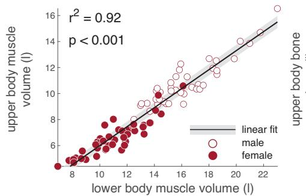

B  
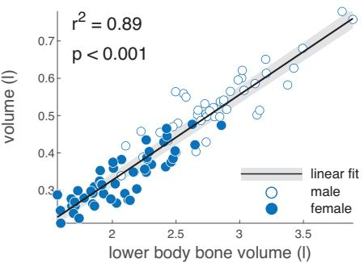  
D  
E

C  
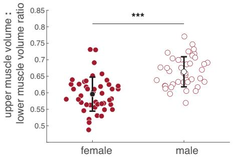

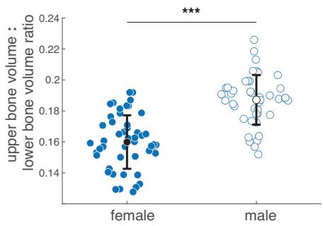

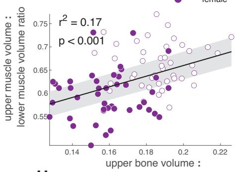

F  
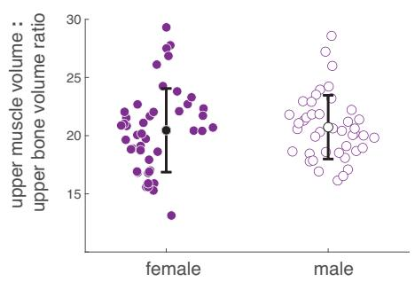

G  
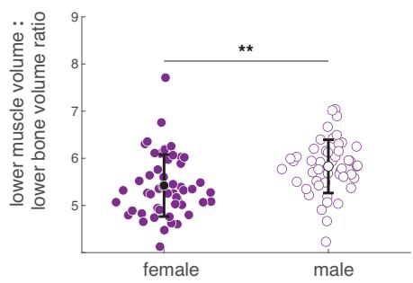

H  
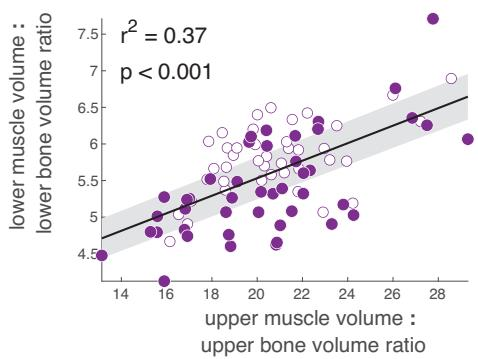  
Figure 4. Relationships between upper and lower body muscle volumes and bone volumes, and sex differences in relative distribution. Upper body muscle volume vs. lower body muscle volume (A), and upper body bone volume vs. lower body bone volume (B), with separate regression lines for males (open circles) and females (filled circles). C and D: ratios of upper- to lower-body muscle volume and bone volume, respectively, compared between sexes. E–H: relationships between relative upper body proportions and total muscle or bone volumes: upper-to-lower muscle ratio vs. upper muscle volume (E), upper-to-lower muscle ratio compared between sexes (F), upper-to-lower bone ratio compared between sexes (G), and upper-tolower bone ratio vs. upper bone volume (H). Solid lines indicate regression fits; shaded regions show 95% confidence intervals. Significance markers indicate sex differences $( ^ { * * * P } < 0 . 0 0 1 , ^ { * * } \dot { P } < 0 . 0 1 )$

Although interspecies studies often adopt power-law mod els to capture size-dependent patterns of form and function (18), such approaches may be misleading for within-species analyses in humans. The range of variation in adult human body sizes is relatively narrow (typically less than two times in height and less than four times in mass). Applying powerlaw fitting under these conditions imposes an assumption of proportionality that extends beyond the biologically observed range, resulting in models that can misrepresent within-group structure-size relationships (28, 29). Here, we chose to use linear models with intercepts to avoid biologically implausible extrapolation and to match the additive nature of variability in muscle volume. Our results demonstrate that, when carefully applied, simple linear models can capture meaningful variation in musculoskeletal structure across individuals without needing to invoke allometric assumptions that may not hold within a species.

We identified several important differences between male and female subjects, which aligns with prior studies showing significant differences in muscle mass between sexes through measurements at the whole body level (30), within the lower limbs (31), and at the individual muscle level (32–34). Skeletal and joint anatomy also varies significantly between males and females (31, 35–38). Consistent with these findings, we observed significant sex differences in relationships between muscle volume and body dimensions: errors between measured and predicted muscle volumes based on height mass, height, mass, and BMI were significantly more negative in female subjects (and more positive in male subjects). However, a novel aspect of our study is the finding that errors between actual and predicted muscle volume did not differ between males and females when associated bone volume was used as a predictor. This result indicates that after accounting for bone size relative to height, male and female muscle sizes are comparable. This finding suggests that factors regulating bone size relative to height (which tends to be larger in males) may also drive differences in muscle size relative to height between males and females.

A  
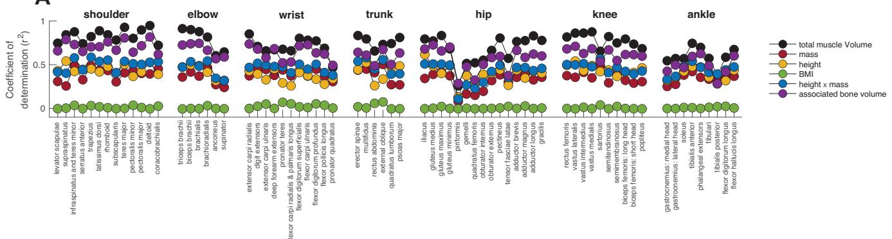

B  
C  
D  
E  
F  
G  
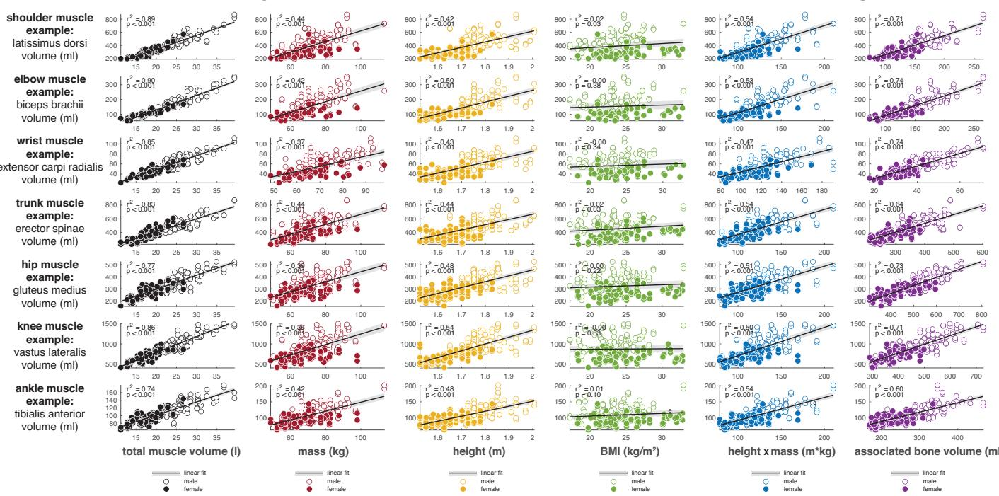  
Figure 5. Relationships between individual muscle volumes with body and bone size parameters. A: coefficients of determination (r 2 ) for regressions of each muscle’s volume against total muscle volume, mass, height, BMI, height mass, and associated bone volume, grouped by anatomical region (shoulder, elbow, wrist, trunk, hip, knee, and ankle). B–G: example regressions for one representative muscle from each anatomical region plotted against total muscle volume (B), mass (C), height (D), BMI (E), height  mass (F), and associated bone volume (G). Data points are shown separately for males (filled circles) and females (open circles), with best-fit regression lines overlaid.

The patterns of muscle distribution differed substantially between males and females, as illustrated by the muscle clustering analysis at the muscle-by-muscle level (Fig. 6) and the comparison of upper versus lower body muscle volumes (Fig. 4). Generally, female subjects had relatively more muscle in the lower limbs, particularly in the ankle. By contrast, male subjects had more muscle in the upper limbs, particularly in the wrist and shoulder. We did not collect training or physical activity data; however, participants were not recruited based on athletic background and were drawn from multiple sites across two countries. We have no reason to believe that training levels differed systematically between males and females. As such, training status is unlikely to explain the observed sex-specific clustering patterns. Although our study focused on young to middle-aged adults, it remains an open question whether similar patterns of muscle distribution shift with aging; for example, whether lower-body muscle volume becomes proportionally reduced in older or more sedentary individuals.

The investigation of muscle and biological sex-based differences in asymmetry magnitude and fat fraction provided insight into expected values for healthy adult males and females. For both asymmetry magnitude and fat fraction percentage, there was no overall effect of biologic sex. However, for both variables, a significant effect dependent on muscle was found, indicating that muscle-specific assess ment of interlimb imbalances and fat fraction is necessary to properly characterize the musculoskeletal system. These findings align with and expand upon previous research that demonstrated that asymmetry (also quantified by MRI segmentation) varied across quadriceps and hamstrings (39) and that fat fraction percentages vary across muscles of the thigh (40).

Table 5. Coefficients of determination (r2), slopes, and intercepts from regressions of individual muscle volumes against associated bone volumes and against the product of height and mass
<table><tr><td rowspan="3">Muscle</td><td rowspan="3"></td><td rowspan="3"></td><td rowspan="3"></td><td rowspan="3" colspan="3">Coefficient of Determination ()</td><td colspan="6">Bone Relationships</td><td colspan="6">Height × Mass Relationships</td></tr><tr><td colspan="3"></td><td colspan="5">Intercept</td><td colspan="3">Slope</td><td colspan="3">Intercept</td></tr><tr><td>Height ×</td><td>Bone vs.</td><td></td><td>Slope</td><td></td><td></td><td></td><td></td><td></td><td></td><td></td><td></td><td></td><td>M vs. F</td></tr><tr><td></td><td>Group Shoulder</td><td>202</td><td></td><td></td><td>Mass, kg·m</td><td>Height × Mass</td><td>Female</td><td>Male</td><td>M vs. F</td><td>Female</td><td>Male</td><td>M vs. F</td><td>Female 0.20</td><td>Male 0.14</td><td></td><td>Female</td><td>Male 34.68</td><td></td></tr><tr><td>Levator scapulae Suprapinatus</td><td>Shhoulder</td><td>201</td><td>Humerus Humerus</td><td>0.72 0.80</td><td>0.65</td><td>*** ***</td><td>0.22 0.43</td><td>0.14</td><td>ns</td><td>7.71</td><td>28.62</td><td>ns</td><td></td><td>0.24</td><td>ns</td><td>11.10 16.6.61</td><td>40.</td><td>ns ns</td></tr><tr><td> Trapezius</td><td>Shhoulder</td><td>202</td><td>Humerus</td><td>0.76</td><td>0.62 0.72</td><td>***</td><td>0.95</td><td>0.36 1.15</td><td>ns</td><td>-4.88 57.96</td><td>11.01 64.08</td><td>ns</td><td>0.25 1.33</td><td>1.23</td><td>ns ns</td><td>21.79</td><td>94.28</td><td>ns</td></tr><tr><td>Rhomboid</td><td> Shhoulder</td><td>203</td><td>Humerus</td><td>0.72</td><td>0.66</td><td>***</td><td>0.15</td><td>0.34</td><td>ns ns</td><td>359</td><td>26.16</td><td>ns ns</td><td>0.31</td><td>0.26</td><td>ns</td><td>20.2</td><td>50.9</td><td>ns</td></tr><tr><td>Serratus anterior</td><td> Shhoulder</td><td>200</td><td>Humerus</td><td>0.76</td><td>0.75</td><td>***</td><td>0.36</td><td>0.88</td><td>ns</td><td>95.45</td><td>5.99</td><td>ns</td><td>0.78</td><td>0.92</td><td>ns</td><td>52.65</td><td>83.15</td><td>ns</td></tr><tr><td>Latissimus dorsi</td><td>Shhoulder</td><td>202</td><td>Humerus</td><td>0.73</td><td>0.68</td><td>***</td><td>2.07</td><td>2.35</td><td>ns</td><td>52.72</td><td>81.25</td><td>ns</td><td>2.36</td><td>2.73</td><td>ns</td><td>32.14</td><td>1117.39</td><td>ns</td></tr><tr><td>Subscapularis</td><td>Shhoulder</td><td>203</td><td>Humerus</td><td>0.79</td><td>0.75</td><td>***</td><td>0.59</td><td>0.69</td><td>ns</td><td>29.45</td><td>38.76</td><td>ns</td><td>0.63</td><td>0.71</td><td>ns</td><td>27.94</td><td>61.47</td><td>ns</td></tr><tr><td>Teres major</td><td>Shhoulder</td><td>203</td><td>Humerus</td><td>0.71</td><td>0.6</td><td>***</td><td>0.15</td><td>0.11</td><td>ns</td><td>1.40</td><td>12.72</td><td>ns</td><td>0.13</td><td>0.09</td><td>ns</td><td>4.55</td><td>19.66</td><td>ns</td></tr><tr><td>Infraspinatus and teres</td><td>Shhoulder</td><td>203</td><td>Humerus</td><td>0.83</td><td>0.75</td><td>***</td><td>0.74</td><td>0.98</td><td>ns</td><td>34.49</td><td>26.16</td><td>ns</td><td>0.71</td><td>0.86</td><td>ns</td><td>42.08</td><td>78.44</td><td>ns</td></tr><tr><td>minor</td><td></td><td></td><td></td><td></td><td></td><td></td><td></td><td></td><td></td><td></td><td></td><td></td><td></td><td></td><td></td><td></td><td></td><td></td></tr><tr><td>Pectoralis minor</td><td>Shoulder</td><td>203</td><td>Humerus</td><td>0.70</td><td>0.68</td><td>***</td><td>0.18</td><td>0.19</td><td>ns</td><td>12.93</td><td>22.40</td><td>ns</td><td>0.27</td><td>0.24</td><td>ns</td><td>4.50</td><td>22.40</td><td>ns</td></tr><tr><td>Pectoralis major</td><td> Shhoulder</td><td>203</td><td>Humerus</td><td>0.77</td><td>0.72</td><td>***</td><td>1.56</td><td>2.01</td><td>ns</td><td>32.95</td><td>71.95</td><td>ns</td><td>1.62</td><td>2.23</td><td>ns</td><td>34.11</td><td>1114.85</td><td>ns</td></tr><tr><td>Deltoid</td><td>Shhoulder Shhoulder</td><td>167 172</td><td>Humerus Humerus</td><td>0.84</td><td>0.72</td><td>**</td><td>1.84</td><td>2.65</td><td>ns</td><td>73.91</td><td>21.71</td><td>ns</td><td>1.97</td><td>2.08</td><td>ns</td><td>72.64</td><td>203.58</td><td>ns</td></tr><tr><td>Triceps brachii</td><td> Elbow</td><td>152</td><td>Humerus</td><td>0.64 0.75</td><td>0.63</td><td>**</td><td>0.11</td><td>0.16 2.62</td><td>ns</td><td>9.52</td><td>7.30 28.74</td><td>ns</td><td>0.16</td><td>0.20</td><td>ns</td><td>5.15</td><td>7.93</td><td>ns ns</td></tr><tr><td>Coracobrachialis Biceps brachii</td><td> Elbow</td><td>170</td><td>Humerus</td><td>0..78</td><td>0.64</td><td>*</td><td>1.91</td><td>1.10</td><td>ns</td><td>59.31</td><td>7.85</td><td>ns</td><td>2.21</td><td>2.10 1.08</td><td>ns</td><td>44.80</td><td>205.43 53.39</td><td>ns</td></tr><tr><td></td><td></td><td>157</td><td>Huumerus</td><td>0.77</td><td>0.71</td><td>ns</td><td>0.71</td><td>0.81</td><td>ns</td><td>24.69</td><td></td><td>ns</td><td>0.83</td><td></td><td>ns</td><td>16.09</td><td></td><td>ns</td></tr><tr><td>Brachialis</td><td>Elbow Elbow</td><td>152</td><td>Humerus</td><td>0.74</td><td>0.66 0.72</td><td>***</td><td>0.51</td><td>0.37</td><td>ns</td><td>36.71</td><td>14.04 15.48</td><td>ns</td><td>0.56 0.37</td><td>0.65 0.42</td><td>ns</td><td>35.54</td><td>68.0</td><td>ns</td></tr><tr><td>Brachioradialis</td><td>E lbow</td><td>1</td><td>Ulna</td><td>0.59</td><td></td><td>**</td><td>0.19</td><td>0.18</td><td>ns</td><td>21700</td><td></td><td>ns</td><td></td><td></td><td>ns</td><td>4.29</td><td>24.25</td><td>ns</td></tr><tr><td>Extensor carpi radialis</td><td> Elbow</td><td>150</td><td>Ulna</td><td>0.61</td><td>0.48 0.46</td><td>*** ***</td><td>0.10</td><td>0.36</td><td>ns</td><td>4.12 7.31</td><td>2.04 1.53</td><td>ns</td><td>0.04</td><td>0.04 0.07</td><td>ns</td><td>2.69</td><td>5.76</td><td>ns</td></tr><tr><td>Anconeus Digit eetensors</td><td>Wrist</td><td>149</td><td>Ula</td><td>0.77</td><td>0.68</td><td>***</td><td>0.17 0.87</td><td>0.93</td><td>ns</td><td>115.57</td><td>23.92</td><td>ns ns</td><td>0.06 0.29</td><td>0.22</td><td>ns ns</td><td>6.41 11.48</td><td>10.38 39.38</td><td>ns</td></tr><tr><td>Extensor carpi ulnaris</td><td>Wrist</td><td>148</td><td>Ulna Ulna</td><td>0.69</td><td>0.61</td><td>***</td><td>0.51</td><td>0.80</td><td>ns ns</td><td>15.33</td><td>7.88</td></table>

<table><tr><td rowspan="3"></td><td rowspan="3"></td><td rowspan="3"></td><td rowspan="3"></td><td rowspan="3"></td><td colspan="2"></td><td colspan="6">Bone Relationships</td><td colspan="6">Height × Mass Relationships</td></tr><tr><td colspan="3">Coefficient of Determination (²)</td><td colspan="2">Slope</td><td colspan="3">Intercept</td><td colspan="3">Slope</td><td colspan="3">Intercept</td></tr><tr><td>Height ×</td><td>Bone vs.</td><td></td><td></td><td></td><td></td><td></td><td></td><td></td><td></td><td></td><td></td><td></td><td></td></tr><tr><td>Muscle</td><td>Group</td><td></td><td>Associated Bone</td><td>Bone, mL</td><td>Mass, kg·m</td><td>Height × Mass</td><td>Female</td><td>Male</td><td>M vs. F</td><td>Female</td><td>Male</td><td>M vs. F</td><td>Female</td><td>Male</td><td>M vs. F</td><td>Female</td><td>Male</td><td>M vs. F</td></tr><tr><td>Pectineus</td><td>Hip</td><td>204</td><td>Pelvis</td><td>0.68</td><td>0.64</td><td>***</td><td>0.08</td><td>0.11</td><td>ns</td><td>6.48</td><td>6.21</td><td>ns</td><td>0.28</td><td>0.35</td><td>ns</td><td>12.34</td><td>21.12</td><td>ns</td></tr><tr><td>Tensor fasciae latae</td><td>Hip</td><td>204</td><td>Pelvis</td><td>0.47</td><td>0.46</td><td>***</td><td>0.04</td><td>0.14</td><td>ns</td><td>36.29</td><td>9.42</td><td>ns</td><td>0.42</td><td>0.32</td><td>ns</td><td>8.06</td><td>40.14</td><td>ns</td></tr><tr><td>Rectus femoris</td><td>Hip</td><td>204</td><td>Femur</td><td>0.66</td><td>0.56</td><td>***</td><td>0.20</td><td>0.19</td><td>ns</td><td>0.49</td><td>9.20</td><td>ns</td><td>0.40</td><td>0.54</td><td>ns</td><td>33.14</td><td>35.38</td><td>ns</td></tr><tr><td>Vastus lateralis</td><td>Hip</td><td>204</td><td>Femur</td><td>0.58</td><td>0.51</td><td>***</td><td>1.35</td><td>1.28</td><td>ns</td><td>-39.23</td><td>-1.68</td><td>ns</td><td>3.59</td><td>3.59</td><td>ns</td><td>74.58</td><td>64.73</td><td>ns</td></tr><tr><td>Vastus intermedius</td><td>Hip</td><td>204</td><td>Femur</td><td>0.66</td><td>0.60</td><td>***</td><td>0.28</td><td>0.27</td><td>ns</td><td>16.01</td><td>52.44</td><td>ns</td><td>0.64</td><td>0.71</td><td>ns</td><td>52.45</td><td>92.60</td><td>ns</td></tr><tr><td>Vastus mmedialis Sartorius</td><td>Hip</td><td>202</td><td>Femur</td><td>0.62</td><td>0.57</td><td>***</td><td>0.22</td><td>0.21</td><td>ns</td><td>-9.53</td><td>7.26</td><td>ns</td><td>0.555 1.19</td><td>0.62</td><td>ns</td><td>11.72</td><td>32.43</td><td>ns</td></tr><tr><td>Adductor brevis</td><td>Knee</td><td>204 204</td><td>Femur Femur</td><td>0.69 0.75</td><td>0.62 0.67</td><td>*** ***</td><td>0.56 1.54</td><td>0.56 1.66</td><td>ns</td><td>-19.04 13.06</td><td>7.88 209.48</td><td>ns</td><td>3.50</td><td>1.65</td><td>ns</td><td>60.24</td><td>71.68</td><td>ns ns</td></tr><tr><td>Adductor magnus</td><td>Knee Knee</td><td>204</td><td>Femur</td><td>0.64</td><td>0.60</td><td>***</td><td>0.63</td><td>0.52</td><td>ns ns</td><td>-52.11</td><td>25.32</td><td>ns ns</td><td>1.69</td><td>4.44 1.57</td><td>ns</td><td>305.44 -0.36</td><td>453.96 75.30</td><td>ns</td></tr><tr><td>Adductor longus</td><td>Knee</td><td>204</td><td>Femur</td><td>0.71</td><td>0.63</td><td>***</td><td>0.82</td><td>0.93</td><td>ns</td><td>45.13</td><td>65.94</td><td>ns</td><td>1.98</td><td>2.37</td><td>ns</td><td>134.88</td><td>220.01</td><td>ns</td></tr><tr><td>Gracilis</td><td>Knee</td><td>204</td><td>Femur</td><td>0.58</td><td>0.66</td><td>***</td><td>0.28</td><td>0.21</td><td>ns</td><td>12.20</td><td>73.44</td><td>ns</td><td>1.13</td><td>0.84</td><td>ns ns</td><td>-5.19</td><td>63.18</td><td>ns</td></tr><tr><td>Semitendinosus</td><td>Knee</td><td>202</td><td>Femur</td><td>0.67</td><td>0.53</td><td>ns</td><td>0.44</td><td>0.41</td><td>ns</td><td>-23.40</td><td>2.29</td><td>ns</td><td>0.84</td><td>0.90</td><td>ns</td><td>47.81</td><td>89.18</td><td>ns</td></tr><tr><td>Semimembranosus</td><td>Knee</td><td>204</td><td>Femur</td><td>0.55</td><td>0.52</td><td>***</td><td>0.48</td><td>0.39</td><td>ns</td><td>15.25</td><td>62.83</td><td>ns</td><td>1.33</td><td>1.22</td><td>ns</td><td>47.88</td><td>96.90</td><td>ns</td></tr><tr><td>Biceps femoris: long</td><td>Knee</td><td>204</td><td>Femur</td><td>0.63</td><td>0.53</td><td>***</td><td>0.48</td><td>0.32</td><td>ns</td><td>-24.61</td><td>61.22</td><td>ns</td><td>0.94</td><td>0.84</td><td>ns</td><td>52.02</td><td>108.41</td><td>ns</td></tr><tr><td>head</td><td></td><td></td><td></td><td></td><td></td><td></td><td></td><td></td><td></td><td></td><td></td><td></td><td></td><td></td><td></td><td></td><td></td><td></td></tr><tr><td>Biceps femoris: short head</td><td>Knee</td><td>204</td><td>Femur</td><td>0.65</td><td>0.57</td><td>***</td><td>0.15</td><td>0.19</td><td>ns</td><td>10.67</td><td>12.54</td><td>ns</td><td>0.43</td><td>0.39</td><td>ns</td><td>21.24</td><td>59.46</td><td>ns</td></tr><tr><td>Popliteus</td><td>Knee</td><td>203</td><td>Femur</td><td>0.66</td><td>0.61</td><td>***</td><td>0.03</td><td>0.02</td><td>ns</td><td>2.22</td><td>10.18</td><td>ns</td><td>0.07</td><td>0.06</td><td>ns</td><td>6.10</td><td>12.92</td><td>ns</td></tr><tr><td>Gastrocnemius: medial head</td><td>Ankle</td><td>204</td><td>Tibia</td><td>0.42</td><td>0.36</td><td>***</td><td>0.57</td><td>00.56</td><td>ns</td><td>79.94</td><td>87.37</td><td>ns</td><td>11.00</td><td>105</td><td>ns</td><td>98.13</td><td>121.00</td><td>ns</td></tr><tr><td>Gastrocnemius: lateral</td><td>Ankle</td><td>204</td><td>Tibia</td><td>0.51</td><td>0.45</td><td>***</td><td>0.28</td><td>0.28</td><td>ns</td><td>55.69</td><td>66.82</td><td>ns</td><td>0.48</td><td>0.51</td><td>ns</td><td>66.85</td><td>86.16</td><td>ns</td></tr><tr><td>head</td><td>Ankle</td><td>204</td><td>Tibia</td><td></td><td>0.50</td><td>***</td><td>0.94</td><td>0.76</td><td>ns</td><td>163.73</td><td>222.56</td><td>ns</td><td>2.06</td><td>1.89</td><td>ns</td><td>148.84</td><td>201.51</td><td>ns</td></tr><tr><td>Soleus Tibialis antrior</td><td>Ankle Ankle</td><td>204</td><td>Tibia</td><td>0.47 0.60</td></table>

Table 5.— Continued  
Values are shown for combined, female, and male groups. Sex differences in slope and intercept were tested within each regression, and P values were corrected for multiple comparisons using the Benjamini–Hochberg false discovery rate (bhFDR). Significance markers denote whether bone volume explains more variance than height  mass (P < 0.001; P < 0.01; P < 0.05; ns, not significant).

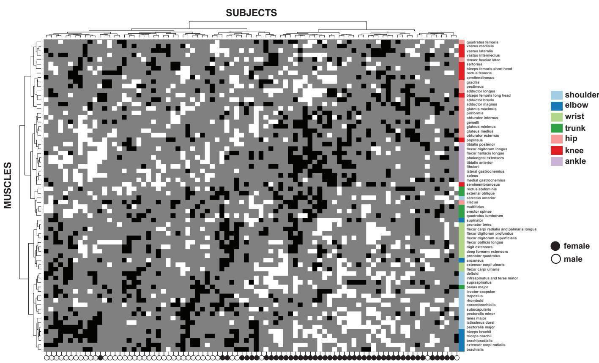  
Figure 6. Heatmap of individual muscle volume percent z-scores relative to the population average. Each row represents a muscle and each column a subject. Hierarchical clustering was applied to both muscles and subjects, grouping muscles with similar relative volumes and subjects with similar overall muscle distribution patterns. Muscles are color-coded by anatomical region (shoulder, elbow, wrist, trunk, hip, knee, and ankle). Cells are shaded by z-score (black less than 1, gray 1 to 1, white > 1). Circles below the heatmap indicate subject sex (black female, white male). Clustering revealed clear groupings of muscles and subgroups of subjects with shared volume distribution patterns; notably, the muscles grouped functionally, and the sub ject clusters largely separated by sex, indicating strong sex-specific patterns in muscle distribution.

We developed a novel pipeline for using convolutional neural networks to power the segmentation process, which would have been virtually prohibitive if dependent on manual approaches. The CNN approach was built upon our prior development and work in the lower extremity (12), shoulder (14), and in patients with neuromuscular disease (15). Although the training dataset for the lower extremity was already extensive per prior work, we developed a new training dataset for the trunk and upper extremity muscles. We verified that our approach to segmentation was consistent with prior work by comparing the average volume fraction of each muscle to those seen in literature (5, 6).

Several limitations of this study should be discussed. First, the study cohort included only young to middle-aged adults, and ethnic and racial information were not collected. Therefore, this dataset does not adequately address the impact of age (40), ethnicity (41), or race (42) on muscle or bone volume. Second, precision challenges associated with low-volume muscles and/or muscles that are oriented in the in-plane direction (i.e., subclavius, anconeus, piriformis, gemelli, quadratus femoris, obturator internus, obturator externus, and popliteus) could lead to increased errors in volume, asymmetry, and fat fraction. To prevent these issues, refined imaging protocols that provide isotropic resolution would improve the precision of these muscles; or, if a refined imaging protocol is not possible, these muscles could be grouped with adjacent or nearby muscle structures to minimize these effects. Third, although muscle volume and fat fraction each have a major influence on muscle force and function, several other factors—such as neuromuscular innervation, pennation angle, optimal fiber length, tendon properties, extracellular matrix properties— also influence muscle force and should be considered within the context of muscle function. Finally, although the AI-driven approach provided a profound decrease in the time required for manual input in the segmentation process, this study still relied on expert user vetting and refinement of scans, which can be a source of error. However, our interobserver analysis (Supplemental Table S2) demonstrated remarkably high repeatability as measured by dice similarity coefficients and volume error.

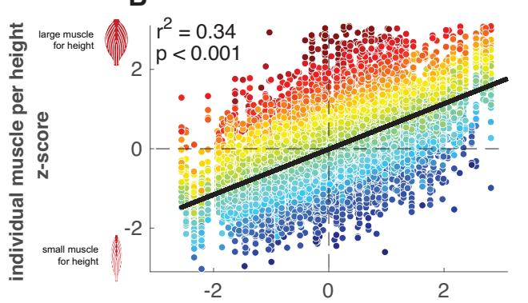

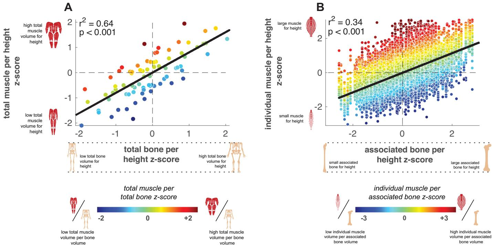  
Figure 7. Relationships between relative muscle volume and relative bone volume normalized to height. A: total muscle volume per height z-score vs. total bone volume per height z-score, with points colored by the total muscle-to-bone ratio. B: individual muscle volume per height z-score vs. the associated bone volume per height z-score, with points colored by the individual muscle-to-bone ratio. Solid lines indicate linear regression fits; shading of points represents whether muscles and bones are proportionally larger (red/yellow) or smaller (blue) relative to bone size. These relationships show that individuals with larger bones relative to their height tend to have greater muscle volume relative to height, both at the whole body and individual muscle level, emphasizing the strong coupling of muscle and bone size.

This study presents a comprehensive analysis of 70 muscles bilaterally across the upper body, trunk, and lower body, examining key muscle metrics such as volume, fat fraction, and asymmetry. We identified novel relationships between muscle size, bone size, and body size, contributing a new reference dataset with broad applications. Muscle volume is a critical indicator of human health (43) and longevity (44). By establishing expected muscle volume based on bone size, height, and mass, deviations from these normative values can be assessed, as has been done previously for lower extremity muscles in both patient populations (5, 45, 46) and athletes (7, 8, 19). In addition, this dataset could support future analyses comparing regional imaging biomarkers (e.g., mid-thigh or psoas crosssectional area) to whole body muscle volume and fat fraction, which may help refine time-efficient clinical assessment strategies. In contexts where whole body quantification of bone may be impractical, the ability of femur volume to predict total muscle volume suggests that it could serve as a useful and effi- cient proxy for estimating expected muscularity. This framework holds promise for monitoring changes in muscle over time due to aging, injury, muscle disease, cancer-related cachexia, and a variety of other chronic conditions (47).

## DATA AVAILABILITY

Data generated or analyzed during the study are available from the corresponding author upon request.

## SUPPLEMENTAL MATERIAL

Supplemental Figs. S1 and S2 and Supplemental Tables S1 and S2: https://doi.org/10.6084/m9.figshare.30371464.

## DISCLOSURES

L.R., M.P., O.D., V.P., J.M., A.C., L.H., K.E.C., M.C., X.F., S.B., T.B., R.H., M.R., and S.S.B. are compensated by Springbok Analytics either as employees or consultants. L.R., M.P., M.C., A.C., S.B., J.M., T.B., and O.D. have stock options to the company. X.F. and S.S.B. own stock in the company. None of the other authors has any conflicts of interest, financial or otherwise, to disclose.

## AUTHOR CONTRIBUTIONS

L.R., M.P., O.D., S.B., and S.S.B. conceived and designed research; M.C., E.L., R.S., X.F., S.B., T.B., M.D.N., and W.D. performed experiments; L.R., M.P., O.D., V.P., J.M., A.C., L.H., K.E.C., M.C., R.H., M.R., and S.S.B. analyzed data; L.R., M.P., O.D., M.C., and S.S.B. interpreted results of experiments; M.P., O.D., and S.S.B. prepared figures; L.R., M.P., O.D., and S.S.B. drafted manuscript; L.R., M.P., O.D., L.H., K.E.C., M.C., E.L., R.S., X.F., S.B., T.B., M.D.N., W.D., and S.S.B. edited and revised manuscript; L.R., M.P., O.D., V.P., J.M., A.C., L.H., K.E.C., M.C., R.H., M.R., E.L., R.S., X.F., S.B., T.B., M.D.N., W.D., and S.S.B. approved final version of manuscript.

## REFERENCES

1. Zajac FE. Muscle and tendon: properties, models, scaling, and application to biomechanics and motor control. Crit Rev Biomed Eng 17: 359–411, 1989.

2. Marques EA, Balshaw TG, Funnell MP, McDermott EJ, Maeo S, James LJ, Folland JP. Muscle growth is very strongly correlated with strength gains after lower body resistance training: new insight from within-participant associations. Med Sci Sports Exerc 57: 2838–2845, 2025. doi:10.1249/MSS.0000000000003819.

3. Bishop PJ, Wright MA, Pierce SE. Whole-limb scaling of muscle mass and force-generating capacity in amniotes. PeerJ 9: e12574, 2021. doi:10.7717/peerj.12574.

4. Clemente CJ, Dick TJM. How scaling approaches can reveal fundamental principles in physiology and biomechanics. J Exp Biol 226: jeb245310, 2023. doi:10.1242/jeb.245310.

5. Handsfield GG, Meyer CH, Abel MF, Blemker SS. Heterogeneity of muscle sizes in the lower limbs of children with cerebral palsy. Muscle Nerve 53: 933–945, 2016. doi:10.1002/mus.24972.

6. Holzbaur KR, Murray WM, Gold GE, Delp SL. Upper limb muscle volumes in adult subjects. J Biomech 40: 742–749, 2007. doi:10. 1016/j.jbiomech.2006.11.011.

7. Handsfield GG, Knaus KR, Fiorentino NM, Meyer CH, Hart JM, Blemker SS. Adding muscle where you need it: non-uniform hypertrophy patterns in elite sprinters. Scand J Med Sci Sports 27: 1050– 1060, 2017. doi:10.1111/sms.12723.

8. Xie T, Crump KB, Ni R, Meyer CH, Hart JM, Blemker SS, Feng X. Quantitative relationships between individual lower-limb muscle volumes and jump and sprint performances of basketball players. J Strength Cond Res 34: 623–631, 2020. doi:10.1519/JSC. 0000000000003421.

9. Maden-Wilkinson TM, McPhee JS, Rittweger J, Jones DA, Degens H. Thigh muscle volume in relation to age, sex and femur volume. Age (Dordr) 36: 383–393, 2014. doi:10.1007/s11357-013-9571-6.

10. Son J, Ward SR, Lieber RL. Scaling relationships between human leg muscle architectural properties and body size. J Exp Biol 227: jeb246567, 2024 [Erratum in J Exp Biol 228: jeb251322, 2025]. doi:10.1242/jeb.246567.

11. Handsfield GG, Meyer CH, Hart JM, Abel MF, Blemker SS. Relationships of 35 lower limb muscles to height and body mass quantified using MRI. J Biomech 47: 631–638, 2014. doi:10.1016/j. jbiomech.2013.12.002.

12. Ni R, Meyer CH, Blemker SS, Hart JM, Feng X. Automatic segmentation of all lower limb muscles from high-resolution magnetic resonance imaging using a cascaded three-dimensional deep convolutional neural network. J Med Imaging (Bellingham) 6: 044009, 2019. doi:10.1117/1. JMI.6.4.044009.

13. Riem L, Blemker SS, DuCharme O, Leitch EB, Cousins M, Antosh IJ, Defoor M, Sheean AJ, Werner BC. Objective analysis of partial three-dimensional rotator cuff muscle volume and fat infiltration across ages and sex from clinical MRI scans. Sci Rep 13: 14345, 2023. doi:10.1038/s41598-023-41599-z.

14. Riem L, Feng X, Cousins M, DuCharme O, Leitch EB, Werner BC, Sheean AJ, Hart J, Antosh IJ, Blemker SS. A deep learning algorithm for automatic 3D segmentation of rotator cuff muscle and fat from clinical MRI scans. Radiol Artif Intell 5: e220132, 2023. doi:10. 1148/ryai.220132.

15. Riem L, DuCharme O, Cousins M, Feng X, Kenney A, Morris J, Tapscott SJ, Tawil R, Statland J, Shaw D, Wang L, Walker M, Lewis L, Jacobs MA, Leung DG, Friedman SD, Blemker SS. AI driven analysis of MRI to measure health and disease progression in FSHD. Sci Rep 14: 15462, 2024. doi:10.1038/s41598-024-65802-x.

16. Fedorov A, Beichel R, Kalpathy-Cramer J, Finet J, Fillion-Robin JC, Pujol S, Bauer C, Jennings D, Fennessy F, Sonka M, Buatti J, Aylward S, Miller JV, Pieper S, Kikinis R. 3D Slicer as an image computing platform for the quantitative imaging network. Magn Reson Imaging 30: 1323–1341, 2012. doi:10.1016/j.mri.2012.05.001.

17. Alexander RM. The maximum forces exerted by animals. J Exp Biol 115: 231–238, 1985. doi:10.1242/jeb.115.1.231.

18. McMahon TA. Using body size to understand the structural design of animals: quadrupedal locomotion. J Appl Physiol 39: 619–627, 1975. doi:10.1152/jappl.1975.39.4.619.

19. Knaus KR, Handsfield GG, Fiorentino NM, Hart JM, Meyer CH, Blemker SS. Athlete muscular phenotypes identified and compared

with high-dimensional clustering of lower limb muscle volume measurements. Med Sci Sports Exerc 55: 1913–1922, 2023. doi:10.1249/ MSS.0000000000003224.

20. Guo YF, Zhang LS, Liu YJ, Hu HG, Li J, Tian Q, Yu P, Zhang F, Yang TL, Guo Y, Peng XL, Dai M, Chen W, Deng HW. Suggestion of GLYAT gene underlying variation of bone size and body lean mass as revealed by a bivariate genome-wide association study. Hum Genet 132: 189–199, 2013. doi:10.1007/s00439-012-1236-5.

21. Havill LM, Mahaney MC, Binkley TL, Specker BL. Effects of genes, sex, age, and activity on BMC, bone size, and areal and volumetric BMD. J Bone Miner Res 22: 737–746, 2007. doi:10.1359/jbmr.070213.

22. Kawao N, Kaji H. Interactions between muscle tissues and bone metabolism. J Cell Biochem 116: 687–695, 2015. doi:10.1002/jcb.25040.

23. Brotto M, Bonewald L. Bone and muscle: interactions beyond mechanical. Bone 80: 109–114, 2015. doi:10.1016/j.bone.2015.02.010.

24. Roberts TJ, Kram R, Weyand PG, Taylor CR. Energetics of bipedal running. I. Metabolic cost of generating force. J Exp Biol 201: 2745– 2751, 1998. doi:10.1242/jeb.201.19.2745.

25. Fukunaga T, Miyatani M, Tachi M, Kouzaki M, Kawakami Y, Kanehisa H. Muscle volume is a major determinant of joint torque in humans. Acta Physiol Scand 172: 249–255, 2001. doi:10.1046/j.1365- 201x.2001.00867.x.

26. Micozzi MS, Harris TM. Age variations in the relation of body mass indices to estimates of body fat and muscle mass. Am J Phys Anthropol 81: 375–379, 1990. doi:10.1002/ajpa.1330810307.

27. Heymsfield SB, Scherzer R, Pietrobelli A, Lewis CE, Grunfeld C. Body mass index as a phenotypic expression of adiposity: quantitative contribution of muscularity in a population-based sample. Int J Obes (Lond) 33: 1363–1373, 2009. doi:10.1038/ijo.2009.184.

28. Jaric S. Muscle strength testing: use of normalisation for body size. Sports Med 32: 615–631, 2002. doi:10.2165/00007256-200232100- 00002.

29. Ruff C. Growth in bone strength, body size, and muscle size in a juvenile longitudinal sample. Bone 33: 317–329, 2003. doi:10.1016/ s8756-3282(03)00161-3.

30. Gallagher D, Heymsfield SB. Muscle distribution: variations with body weight, gender, and age. Appl Radiat Isot 49: 733–734, 1998. doi:10.1016/s0969-8043(97)00096-1.

31. Janssen I, Heymsfield SB, Wang ZM, Ross R. Skeletal muscle mass and distribution in 468 men and women aged 18-88 yr. J Appl Physiol (1985) 89: 81–88, 2000 [Erratum in J Appl Physiol (1985) 116: 1342, 2014]. doi:10.1152/jappl.2000.89.1.81.

32. Kawakami Y, Abe T, Kanehisa H, Fukunaga T. Human skeletal muscle size and architecture: variability and interdependence. Am J Hum Biol 18: 845–848, 2006. doi:10.1002/ajhb.20561.

33. Kubo K, Kanehisa H, Azuma K, Ishizu M, Kuno SY, Okada M, Fukunaga T. Muscle architectural characteristics in young and elderly men and women. Int J Sports Med 24: 125–130, 2003. doi:10. 1055/s-2003-38204.

34. Foure A , Ogier AC, Le Troter A, Vilmen C, Feiweier T, Guye M, Gondin J, Besson P, Bendahan D. Diffusion properties and 3D architecture of human lower leg muscles assessed with ultra-high-field-strength diffusion-tensor MR imaging and tractography: reproducibility and sensitivity to sex difference and intramuscular variability. Radiology 287: 592–607, 2018. doi:10.1148/radiol.2017171330.

35. Degen N, Sass J, Jalali J, Kovacs L, Euler E, Prall WC, Bocker W€ , Thaller PH, Furmetz J.€ Three-dimensional assessment of lower limb alignment: reference values and sex-related differences. Knee 27: 428–435, 2020. doi:10.1016/j.knee.2019.11.009.

36. Brinckmann P, Hoefert H, Jongen HT. Sex differences in the skeletal geometry of the human pelvis and hip joint. J Biomech 14: 427– 430, 1981. doi:10.1016/0021-9290(81)90060-9.

37. Nieves JW, Formica C, Ruffing J, Zion M, Garrett P, Lindsay R, Cosman F. Males have larger skeletal size and bone mass than females, despite comparable body size. J Bone Miner Res 20: 529– 535, 2005. doi:10.1359/JBMR.041005.

38. Looker AC, Beck TJ, Orwoll ES. Does body size account for gender differences in femur bone density and geometry? J Bone Miner Res 16: 1291–1299, 2001. doi:10.1359/jbmr.2001.16.7.1291.

39. Kulas AS, Schmitz RJ, Shultz SJ, Waxman JP, Wang HM, Kraft RA, Partington HS. Bilateral quadriceps and hamstrings muscle volume asymmetries in healthy individuals. J Orthop Res 36: 963–970, 2018. doi:10.1002/jor.23664.

40. Hogrel JY, Barnouin Y, Azzabou N, Butler-Browne G, Voit T, Moraux A, Leroux G, Behin A, McPhee JS, Carlier PG. NMR imaging estimates of muscle volume and intramuscular fat infiltration in the thigh: variations with muscle, gender, and age. Age (Dordr) 37: 9798, 2015. doi:10.1007/s11357-015-9798-5.

41. Gallagher D, Visser M, De Meersman RE, Sepulveda D, Baumgartner RN, Pierson RN, Harris T, Heymsfield SB. Appendicular skeletal muscle mass: effects of age, gender, and ethnicity. J Appl Physiol (1985) 83: 229–239, 1997. doi:10.1152/jappl.1997.83.1.229.

42. Popp KL, Hughes JM, Martinez-Betancourt A, Scott M, Turkington V, Caksa S, Guerriere KI, Ackerman KE, Xu C, Unnikrishnan G, Reifman J, Bouxsein ML. Bone mass, microarchitecture and strength are influenced by race/ethnicity in young adult men and women. Bone 103: 200–208, 2017. doi:10.1016/j.bone.2017.07.014.

43. Kim G, Kim JH. Impact of skeletal muscle mass on metabolic health. Endocrinol Metab (Seoul) 35: 1–6, 2020. doi:10.3803/EnM.2020.35.1.1.

44. Srikanthan P, Karlamangla AS. Muscle mass index as a predictor of longevity in older adults. Am J Med 127: 547–553, 2014. doi:10.1016/ j.amjmed.2014.02.007.

45. DeFoor MT, Riem L, Cognetti DJ, Cousins M, DuCharme O, Feng X, Blemker SS, Antosh IJ, Cote MP, Werner BC, Sheean AJ. Novel 3D MRI-based volumetric assessment of rotator cuff musculature demonstrates stronger correlation with preoperative functional status when compared to the Goutallier grading scheme. J Shoulder Elbow Surg 33: e575–e584, 2024. doi:10.1016/j.jse.2024.02.043.

46. Norte GE, Knaus KR, Kuenze C, Handsfield GG, Meyer CH, Blemker SS, Hart JM. MRI-based assessment of lower-extremity muscle volumes in patients before and after ACL reconstruction. J Sport Rehabil 27: 201–212, 2018. doi:10.1123/jsr.2016-0141.

47. Kim HS, Kim H, Kim S, Cha Y, Kim JT, Kim JW, Ha YC, Yoo JI. Precise individual muscle segmentation in whole thigh CT scans for sarcopenia assessment using U-net transformer. Sci Rep 14: 3301, 2024. doi:10.1038/s41598-024-53707-8.