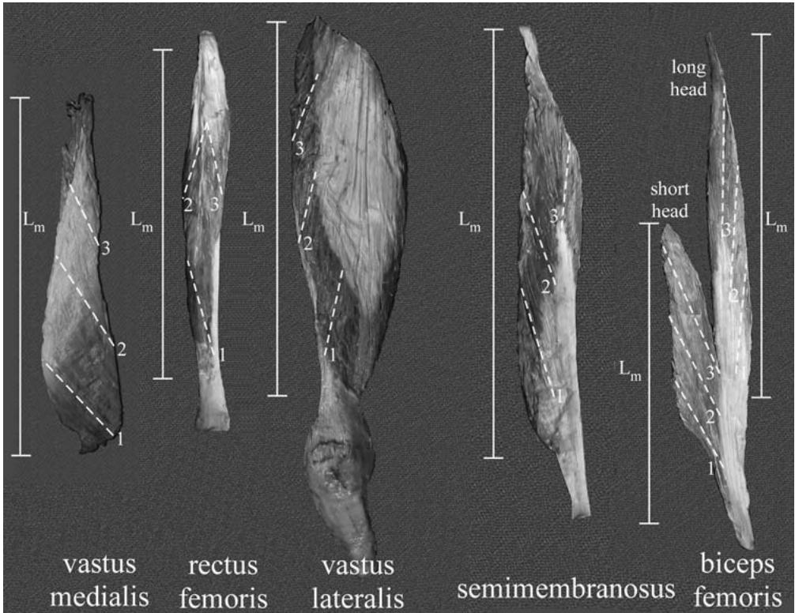
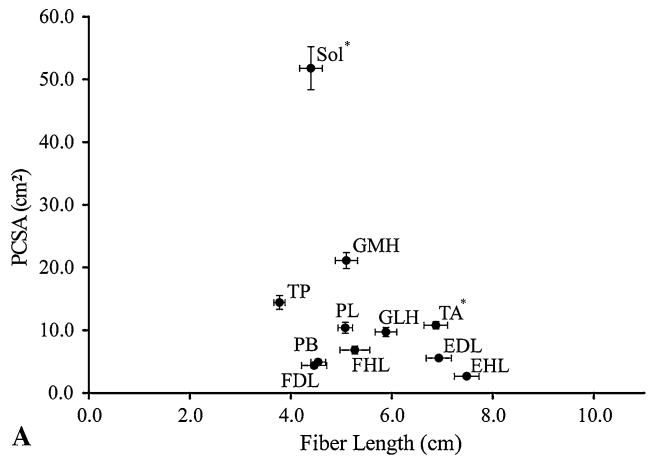
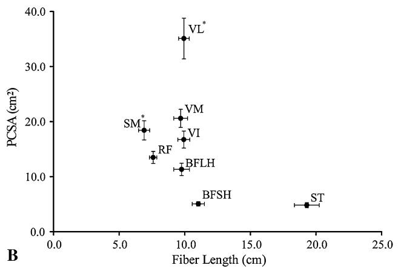
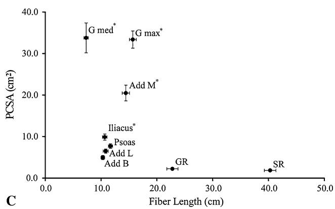
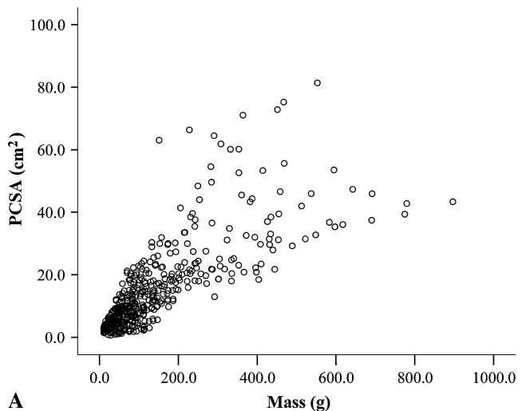
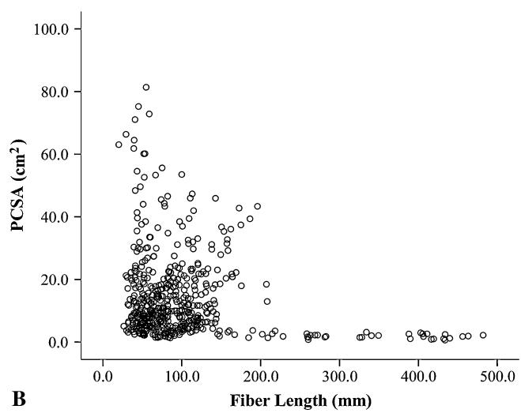

ORIGINAL ARTICLE

# Are Current Measurements of Lower Extremity Muscle Architecture Accurate?

Samuel R. Ward PT, PhD, Carolyn M. Eng BS, Laura H. Smallwood BS, PA, Richard L. Lieber PhD

Received: 22 February 2008 / Accepted: 10 October 2008 / Published online: 30 October 2008

 The Association of Bone and Joint Surgeons 2008

Abstract Skeletal muscle architecture is defined as the arrangement of fibers in a muscle and functionally defines performance capacity. Architectural values are used to model muscle-joint behavior and to make surgical decisions. The two most extensively used human lower extremity data sets consist of five total specimens of unknown size, gender, and age. Therefore, it is critically important to generate a high-fidelity human lower extremity muscle architecture data set. We disassembled 27 muscles from 21 human lower extremities to characterize muscle fiber length and physiologic cross-sectional area, which define the excursion and force-generating capacities of a muscle. Based on their architectural features, the soleus, gluteus medius, and vastus lateralis are the strongest muscles, whereas the sartorius, gracilis, and semitendinosus have the largest excursion. The

plantarflexors, knee extensors, and hip adductors are the strongest muscle groups acting at each joint, whereas the hip adductors and hip extensors have the largest excursion. Contrary to previous assertions, two-joint muscles do not necessarily have longer fibers than single-joint muscles as seen by the similarity of knee flexor and extensor fiber lengths. These high-resolution data will facilitate the development of more accurate musculoskeletal models and challenge existing theories of muscle design; we believe they will aid in surgical decision making.

## Introduction

Skeletal muscle architecture is defined as the arrangement of muscle fibers in a muscle [9] and predicts muscle functional capacity [2, 24]. Although other physical parameters such as muscle mass and volume and other metabolic parameters such as fiber type distribution substantially influence contractile properties, none predicts muscle function as well as muscle architecture [3, 19]. Architectural data, particularly in humans, are used extensively to model muscle-joint behavior [4] and to make surgical decisions [16]. Relative to clinical practice, the development of new upper extremity surgical reconstructive procedures has evolved based on increased understanding of muscle function derived from studies of muscle architecture [7, 12].

The architectural properties of small numbers of human lower extremity muscles have been reported in several studies, some of which used indirect methods to assess the architecture [11, 14, 23, 26]. The two most extensively used data sets representing direct measurements of human lower extremity architecture consist of only five specimens of unknown size, gender, and age [8, 30]. This small sample size precludes generating confidence intervals to obtain accurate predictions of muscle force or excursion and understanding issues of scaling effects or gender differences in muscle architecture. A second problem with previous studies is technical—the failure to measure sarcomere length. This measurement is critical because the sarcomere is the basic unit of force generation in muscle [10]. Without direct measurement of sarcomere length on a specimen-by-specimen basis, it is not clear if fiber length is altered owing to variations in joint angle, muscle stretch during fixation, or fiber stretch during dissection. Thus, previously published data are unreliable because of limited sample sizes, limited numbers of muscles, and limited information regarding the sarcomere length at which muscle fiber length and physiologic cross-sectional area (PCSA) were calculated. It is important to generate a highfidelity data set that can be used by the orthopaedics and musculoskeletal modeling communities for their particular applications.

Thus, the purposes of this study were to (1) generate a high-fidelity data set that defines the architectural properties of each major human lower extremity muscle; (2) to define the individual muscles with the largest force-generating and excursion capacity across the entire lower extremity; (3) to define the muscle groups with the largest force-generating and excursion capacity at each joint; and (4) to understand the fundamental design features of muscle groups and individual muscles that allow them to perform the specific tasks required for movement.

## Materials and Methods

We removed 27 muscles (Table 1) from each of 21 formaldehyde-fixed human lower extremities (mean age ± standard deviation, $8 3 \pm 9$ years; male:female ratio, 9:12; height, $1 6 8 . 4 \pm 9 . 3$ cm; weight, $8 2 . 7 \pm 1 5 . 3 \mathrm { \ k g } )$ . With the exception of the intrinsic muscles of the foot (described previously [15]), this is a near-complete list of lower extremity muscles. Whole specimens were disarticulated, leaving one lower extremity intact from T12 to the toes. Before skinning, we obtained high-resolution MR images (1-mm3 voxels) of each specimen on a 3T GE Signa 1 ExciteTM scanner (General Electric, Milwaukee, WI). Additionally, high-resolution CT images (1-mm-thick spiral acquisitions) were obtained of five specimens using a Toshiba four-slice AquilionTM scanner (Toshiba American Medical Systems, Inc, Tustin, CA). After imaging, legs were dissected through the deep fascia and each muscle was removed from its most proximal origin to its most distal tendon attachment. Muscles were stored in 1X phosphate-buffered saline for 24 to 48 hours before architectural measurements. After muscles were excised, representative skeletal measurements, including femur length (greater trochanter to tibiofemoral joint line), epicondylar width, tibial plateau width, tibial length (tibiofemoral joint line to the distal end of the medial malleolus), and calcaneal width (width of the calcaneal tuberosity), were made on each specimen to define the size of each subject (Table 2). These landmarks were chosen to facilitate comparisons with patient data obtained without radiographic films.

Table 1. Muscle group definition
<table><tr><td>Action</td><td>Muscles</td></tr><tr><td>Ankle plantarflexion</td><td>Soleus</td></tr><tr><td></td><td>Gastrocnemius (medial and lateral)</td></tr><tr><td></td><td>Flexor hallucis longus</td></tr><tr><td></td><td>Flexor digitorum longus</td></tr><tr><td></td><td>Tibialis posterior</td></tr><tr><td></td><td>Peroneus longus</td></tr><tr><td></td><td>Peroneus brevis</td></tr><tr><td>Ankle dorsiflexion</td><td>Tibialis anterior</td></tr><tr><td></td><td>Extensor hallucis longus</td></tr><tr><td></td><td>Extensor digitorum longus</td></tr><tr><td>Knee extension</td><td>Rectus femoris</td></tr><tr><td></td><td>Vastus lateralis</td></tr><tr><td></td><td>Vastus medialis</td></tr><tr><td></td><td>Vastus intermedius</td></tr><tr><td>Knee flexion</td><td>Bicep femoris (long and short)</td></tr><tr><td></td><td>Semitendinosus</td></tr><tr><td></td><td>Semimembranosus</td></tr><tr><td>Hip extension</td><td>Gluteus maximus</td></tr><tr><td></td><td>Bicep femoris (long)</td></tr><tr><td></td><td>Semitendinosus</td></tr><tr><td></td><td>Semimembranosus</td></tr><tr><td>Hip flexion</td><td>Psoas</td></tr><tr><td></td><td>Iliacus</td></tr><tr><td></td><td>Rectus femoris</td></tr><tr><td></td><td>Sartorius</td></tr><tr><td>Hip abduction</td><td>Gluteus medius</td></tr><tr><td>Hip adduction</td><td>Adductor magnus</td></tr><tr><td></td><td>Adductor longus</td></tr><tr><td></td><td>Adductor brevis</td></tr><tr><td></td><td></td></tr><tr><td></td><td>Gracilis</td></tr></table>

A recent study and pilot experiments have revealed the large regional variation in specific muscles (see, eg, Figure 1 of Ward et al. [27]). Based on our anticipation of the need for developing high-resolution muscle models and our desire to make this large data set as universally accessible as possible, we thus mapped each muscle for the specific location of our physical measurements (Fig. 1). A complete set of maps is available online (http://muscle.ucsd.edu).

Table 2. Skeletal morphology and joint geometry
<table><tr><td>Joint</td><td>Value</td></tr><tr><td>Femur length (cm)</td><td> $4 3 . 4 \pm 2 . 7$ </td></tr><tr><td>Epicondylar width (cm)</td><td> $8 . 1 \pm 0 . 8$ </td></tr><tr><td>Tibial length (cm)</td><td> $3 7 . 0 \pm 2 . 2$ </td></tr><tr><td>Tibial plateau width (cm)</td><td> $7 . 9 \pm 0 . 8$ </td></tr><tr><td>Calcaneal width (cm)</td><td> $3 . 5 \pm 0 . 5$ </td></tr><tr><td>Ankle (plantarflexion)</td><td> $4 9 . 0 ^ { \circ } \pm 1 3 . 8 ^ { \circ }$ </td></tr><tr><td>Knee (flexion)</td><td> $0 . 8 ^ { \circ } \pm 2 . 6 ^ { \circ }$ </td></tr><tr><td>Hip (flexion)</td><td> $- 0 . 2 ^ { \circ } \pm 3 . 0 ^ { \circ }$ </td></tr><tr><td>Hip (abduction)</td><td> $1 . 8 ^ { \circ } \pm 4 . 1 ^ { \circ }$ </td></tr><tr><td>Hip (internal rotation)</td><td> $- 3 . 8 ^ { \circ } \pm 1 4 . 7 ^ { \circ }$ </td></tr></table>

Values expressed as mean ± standard deviation.

Muscle architecture was measured according to the methods developed by Sacks and Roy [25] as described by Lieber et al. [17] for upper extremity muscles. Briefly, muscle specimens were removed from buffer, gently blotted dry, and weighed. Muscle mass was not corrected for formaldehyde fixation, but external tendons, connective tissue, and fat were removed before weighing. Muscle length (Lm) was defined as the distance from the origin of the most proximal fibers to insertion of the most distal fibers. Raw fiber length (Lf0 ) was measured from the previously mapped three to five regions in each muscle using a digital caliper (accuracy, 0.01 mm). Muscle fiber bundles were carefully dissected from the proximal tendon to the distal tendon of each mapped muscle region. Surface

Fig. 1 Representative muscle maps indicate the location of muscle fiber sampling (1 to 3 for each muscle localized with dotted lines) and muscle length (Lm) measurements for five representative muscles. Complete maps for all muscles sampled are available online at http://muscle.ucsd.edu.

pennation angle was measured in each of these regions with a standard goniometer as the angle between the fibers in each region with respect to the distal muscle tendon. Because fibers project at a three-dimensional (3-D) angle relative to the distal tendon, muscles were placed in a single plane, facilitating 2-D pennation angle measurements. Fascicles then were placed in mild sulfuric acid solution (15% v/v) for 30 minutes to partially digest surrounding connective tissue and then were rinsed in phosphate-buffered saline. Under magnification, three small muscle fiber bundles (consisting of approximately 20 single cells) were isolated from each muscle region and mounted on slides. Bundle sarcomere length (Ls) was determined by laser diffraction using the zero-to-first-order diffraction angle as described by Lieber et al. [17]. Values for normalized Lf then were calculated for the isolated bundles according to the following equation [22]:

$$
\mathrm { L f } = \mathrm { L f ^ { \prime } } ( 2 . 7 \mu \mathrm { m / L s } )
$$

where Lf0 is the raw fiber length, Ls is the measured sarcomere length in each fiber bundle, Lf is normalized muscle fiber length, and 2.7 lm represents the optimum sarcomere length for human muscle [22]. This process permits fiber length comparisons between muscles despite the fact that muscles may be fixed in various degrees of tension and, therefore, at various sarcomere lengths [5]. In terms of performance, normalized muscle fiber length is an index of a muscle’s ability to change length (excursion) and its velocity [21]. For example, muscles with relatively

ð 1 Þ

long fibers are predicted to operate over a relatively large muscle length range and can achieve faster velocities compared with a shorter-fibered muscle.

We calculated normalized Lm using a similar equation. Fiber length to muscle length ratio (Lf/Lm ratio) was calculated by dividing normalized fiber length by normalized muscle length. The Lf/Lm ratio indicates a muscle’s excursion design. For example, if a muscle contains fibers that span the entire muscle length (Lf/Lm ratio = 1), it is designed more for excursion compared with a muscle that has fibers spanning only ½ of the muscle length (Lf/Lm ratio = 0.5). This ratio is useful because it is independent of the absolute magnitude of muscle fiber length and permits design comparisons across muscles.

Physiologic cross-sectional area (PCSA) was calculated according to the following equation [24]:

$$
\mathrm { P C S A } \left( \mathrm { c m } ^ { 2 } \right) = \mathbf { M } \left( \mathbf { g } \right) \times \mathrm { c o s } \theta / \rho \left( \mathrm { g / c m } ^ { 3 } \right) \times \mathrm { L f } \left( \mathrm { c m } \right)\tag{ð2Þ}
$$

where h is pennation angle and q is muscle density (1.056 g/cm3 ) [28]. The PCSA is proportional to a muscle’s maximum force-producing capacity [24].

Given the size of the data set (nearly 20,000 data points), it was useful to define muscle groups about each joint (Table 1). Although we appreciate that many muscles have secondary actions at other joints, we defined muscle groups based on their primary action. This definition scheme left only four muscles listed for more than one action; the semitendinosus, semimembranosus, and bicep femoris (long) all were considered hip extensors and knee flexors, and the rectus femoris was considered a knee extensor and hip flexor.

Joint angles were measured from 3-D reconstructions of the CT scan data in a subsample set of five lower extremities to define the position of fixation (Table 2). Given that muscles were fixed in this position, muscle lengths, fiber lengths, and sarcomere lengths correspond exactly to these joint positions. Ankle plantarflexion was defined as the angle between the tibial diaphysis and the fifth metatarsal. Knee flexion was defined as the angle between the femoral and tibial diaphyses. Hip flexion was defined as the angle between the femoral diaphysis and a line intersecting the anterior-superior iliac spine-posteriorsuperior iliac spine (ASIS-PSIS) line. Hip abduction was defined as the angle between the femoral diaphysis and a line intersecting the ASIS-ASIS line. Hip rotation was defined as the angle between the femoral epicondylar line and the ASIS-ASIS line. Lower extremities were fixed in the anatomic position, with the exception that ankles were in 508 plantarflexion (Table 2). This measurement deviates from the clinical measurement of plantarflexion because the distal reference line follows the fifth metatarsal instead of the sole of the foot.

Although multiple measurements were made on each muscle, only muscle averages are presented here. In the case of muscle fiber lengths, in which regional fiber length heterogeneity may be of importance, the coefficient of variation for fiber lengths also is noted. All values are reported as mean ± standard deviation unless otherwise noted. Between-muscle and between-muscle group comparisons of mass, mean fiber length, and total PCSA were made with one-way ANOVAs after confirming the assumptions of normality and homogeneity of variances were met. Post hoc Tukey’s tests were used to identify specific muscle differences. All analyses were performed using SPSS1 software (Version 16.0; SPSS Inc, Chicago, IL). Significance was set at p \ 0.05 for the ANOVA and post hoc tests.

## Results

We generated a high-resolution data set of 27 major muscles in the human lower extremity from approximately 20 specimens per muscle (Table 3; Fig. 2). These data define the mass, muscle length, fiber length, fiber length variability, sarcomere length, pennation angle, PCSA, and fiber length to muscle length ratio of each muscle. Maps of each sampling region, in each muscle, are available at http://muscle.ucsd.edu.

Considering the entire lower extremity, the three strongest muscles (based on PCSA) were the soleus, vastus lateralis, and gluteus medius (Table 3; Fig. 2). This is not surprising because they are all antigravity muscles, but it is surprising the single strongest muscle was observed distal in the leg where muscle volumes tend to be smallest. The muscles with the longest fiber lengths (implying the greatest excursion) are the sartorius, gracilis, and semitendinosus (Table 3; Fig. 2). Although they all cross the hip and knee, the feature they share in common is knee flexion. The semitendinosus ranks high in fiber length only when the proximal and distal heads of the muscle are added in series, which is likely to reflect the actual function of the muscle based on its dual innervation [13].

When muscle groups were compared at each joint, the ankle plantarflexors had larger total PCSAs and shorter mean fiber lengths than the dorsiflexors (Table 4; Fig. 2). The knee extensors had larger total PCSAs compared with the flexors, but each muscle group had similar mean fiber lengths (Table 4; Fig. 2). The hip extensors had larger total PCSAs compared with the flexors, abductors, and adductors, and the extensors and abductors had shorter mean fiber lengths than the flexors and adductors (Table 4; Fig. 2).

In terms of fundamental design features, large mass and short fiber length both contribute to large PCSA when the

Table 3. Architectural properties of each lower extremity muscle
<table><tr><td>Muscle</td><td>Mass (g)</td><td>Muscle</td><td>Fiber</td><td>Lf coefficient</td><td>Ls (μm)</td><td>Pennation</td><td>PCSA (cm²)</td><td>Lf/Lm ratio</td></tr><tr><td></td><td>97.7 ± 33.6</td><td>length (cm) 24.25 ± 4.75</td><td>length (cm) 11.69 ± 1.66</td><td>of variation (%) 12.4 ± 5.9</td><td>3.11 ± 0.28</td><td>angle () 10.6 ± 3.2</td><td>7.7 ± 2.3</td><td></td></tr><tr><td>Psoas (n = 19) Iliacus (n = 21)</td><td>113.7 ± 37.0</td><td>20.61 ± 4.02</td><td>10.66 ± 1.86</td><td>23.0 ± 9.4</td><td>3.02 ± 0.18</td><td>14.3 ± 5.3</td><td>9.9 ± 3.4</td><td>0.50 ± 0.14 0.56 ± 0.26</td></tr><tr><td>Gluteus maximus (n = 18)</td><td>547.2 ± 162.2</td><td>26.95 ± 6.42</td><td>15.69 ± 2.57</td><td>15.5 ± 11.0</td><td>2.60 ± 0.36</td><td>21.9 ± 26.2</td><td>33.4 ± 8.8</td><td>0.62 ± 0.22</td></tr><tr><td>Gluteus medius (n = 16)</td><td>273.5 ± 76.9</td><td>19.99 ± 2.86</td><td>7.33 ± 1.57</td><td>20.3 ± 11.8</td><td>2.40 ± 0.18</td><td>20.5 ± 17.3</td><td>33.8 ± 14.4</td><td>0.37 ± 0.08</td></tr><tr><td>Sartorius (n = 20)</td><td>78.5 ± 31.1</td><td>44.81 ± 4.19</td><td>40.30 ± 4.63</td><td>6.4 ± 4.2</td><td>3.11 ± 0.19</td><td>1.3 ± 1.8</td><td>1.9 ± 0.7</td><td>0.90 ± 0.04</td></tr><tr><td>Rectus femoris (n = 21)</td><td>110.6 ± 43.3</td><td>36.28 ± 4.73</td><td>7.59 ± 1.28</td><td>9.7 ± 4.6</td><td>2.42 ± 0.30</td><td>13.9 ± 3.5</td><td>13.5 ± 5.0</td><td>0.21 ± 0.03</td></tr><tr><td>Vastus lateralis (n = 19)</td><td>375.9 ± 137.2</td><td>27.34 ± 4.62</td><td>9.94 ± 1.76</td><td>9.1 ± 6.1</td><td>2.14 ± 0.29</td><td>18.4 ± 6.8</td><td>35.1 ± 16.1</td><td>0.38 ± 0.11</td></tr><tr><td>Vastus intermedius (n = 20)</td><td>171.9 ± 72.9</td><td>41.20 ± 8.17</td><td>9.93 ± 2.03</td><td>10.4 ± 6.3</td><td>2.17 ± 0.42</td><td>4.5 ± 4.5</td><td>16.7 ± 6.9</td><td>0.24 ± 0.04</td></tr><tr><td>Vastus medialis (n = 19)</td><td>239.4 ± 94.8</td><td>43.90 ± 9.85</td><td>9.68 ± 2.30</td><td>10.7 ± 5.7</td><td>2.24 ± 0.46</td><td>29.6 ± 6.9</td><td>20.6 ± 7.2</td><td>0.22 ± 0.04</td></tr><tr><td>Gracilis (n = 19)</td><td>52.5 ± 16.7</td><td>28.69 ± 3.29</td><td>22.78 ± 4.38</td><td>15.9 ± 8.2</td><td>3.24 ± 0.21</td><td>8.2 ± 2.5</td><td>2.2 ± 0.8</td><td>0.79 ± 0.08</td></tr><tr><td>Adductor longus (n = 20)</td><td>74.7 ± 28.4</td><td>21.84 ± 4.46</td><td>10.82 ± 2.02</td><td>11.8 ± 6.2</td><td>3.00 ± 0.37</td><td>7.1 ± 3.4</td><td>6.5 ± 2.2</td><td>0.50 ± 0.07</td></tr><tr><td>Adductor brevis (n = 19)</td><td>54.6 ± 24.8</td><td>15.39 ± 2.46</td><td>10.31 ± 1.42</td><td>16.8 ± 7.3</td><td>2.91 ± 0.25</td><td>6.1 ± 3.1</td><td>5.0 ± 2.1</td><td>0.68 ± 0.06</td></tr><tr><td>Adductor magnus (n = 17)</td><td>324.7 ± 127.8</td><td>37.90 ± 7.36</td><td>14.44 ± 2.74</td><td>29.1 ± 8.3</td><td>2.19 ± 0.32</td><td>15.5 ± 7.3</td><td>20.5 ± 7.8</td><td>0.39 ± 0.07</td></tr><tr><td>Biceps femoris long head (n = 18)</td><td>113.4 ± 48.5</td><td>34.73 ± 3.65</td><td>9.76 ± 2.62</td><td>12.8 ± 9.5</td><td>2.35 ± 0.28</td><td>11.6 ± 5.5</td><td>11.3 ± 4.8</td><td>0.28 ± 0.08</td></tr><tr><td>Biceps femoris short head (n = 19)</td><td>59.8 ± 22.6</td><td>22.39 ± 2.50</td><td>11.03 ± 2.06</td><td>9.5 ± 5.2</td><td>3.31 ± 0.17</td><td>12.3 ± 3.6</td><td>5.1 ± 1.7</td><td>0.49 ± 0.07</td></tr><tr><td>Semitendinosus (n = 19)</td><td>99.7 ± 37.8</td><td>29.67 ± 3.86</td><td>19.30 ± 4.12</td><td>29.4 ± 14.0</td><td>2.89 ± 0.28</td><td>12.9 ± 4.9</td><td>4.8 ± 2.0</td><td>0.65 ± 0.11</td></tr><tr><td>Semimembranosus (n = 19)</td><td>134.3 ± 57.6</td><td>29.34 ± 3.42</td><td>6.90 ± 1.83</td><td>13.7 ± 7.5</td><td>2.61 ± 0.25</td><td>15.1 ± 3.4</td><td>18.4 ± 7.5</td><td>0.24 ± 0.06</td></tr><tr><td>Tibialis anterior (n = 21)</td><td>80.1 ± 26.6</td><td>25.98 ± 3.25</td><td>6.83 ± 0.79</td><td>6.6 ± 4.0</td><td>3.14 ± 0.16</td><td>9.6 ± 3.1</td><td>10.9 ± 3.0</td><td>0.27 ± 0.05</td></tr><tr><td>Extensor hallucis longus (n = 21)</td><td>20.9 ± 9.9</td><td>24.25 ± 3.27</td><td>7.48 ± 1.13</td><td>7.7 ± 5.7</td><td>3.24 ± 0.11</td><td>9.4 ± 2.2</td><td>2.7 ± 1.5</td><td>0.31 ± 0.06</td></tr><tr><td>Extensor digitorum longus (n = 21)</td><td>41.0 ± 12.6</td><td>29.00 ± 2.33</td><td>6.93 ± 1.14</td><td>8.0 ± 4.4</td><td>3.12 ± 0.20</td><td>10.8 ± 2.8</td><td>5.6 ± 1.7</td><td>0.24 ± 0.04</td></tr><tr><td>Peroneus longus (n = 19)</td><td>57.7 ± 22.6</td><td>27.08 ± 3.02</td><td>5.08 ± 0.63</td><td>10.4 ± 6.5</td><td>2.72 ± 0.25</td><td>14.1 ± 5.1</td><td>10.4 ± 3.8</td><td>0.19 ± 0.03</td></tr><tr><td>Peroneus brevis (n = 20)</td><td>24.2 ± 10.6</td><td>23.75 ± 3.11</td><td>4.54 ± 0.65</td><td>10.1 ± 6.0</td><td>2.76 ± 0.19</td><td>11.5 ± 3.0</td><td>4.9 ± 2.0</td><td>0.19 ± 0.03</td></tr><tr><td>Gastrocnemius medial head (n = 20)</td><td>113.5 ± 32.0</td><td>26.94 ± 4.65</td><td>5.10 ± 0.98</td><td>13.4 ± 7.0</td><td>2.59 ± 0.26</td><td>9.9 ± 4.4</td><td>21.1 ± 5.7</td><td>0.19 ± 0.03</td></tr><tr><td>Gastrocnemius lateral head (n = 20)</td><td>62.2 ± 24.6</td><td>22.35 ± 3.70</td><td>5.88 ± 0.95</td><td>15.8 ± 11.2</td><td>2.71 ± 0.24</td><td>12.0 ± 3.1</td><td>9.7 ± 3.3</td><td>0.27 ± 0.03</td></tr><tr><td>Soleus (n = 19)</td><td>275.8 ± 98.5</td><td>40.54 ± 8.32</td><td>4.40 ± 0.99</td><td>16.7 ± 6.9</td><td>2.12 ± 0.24</td><td>28.3 ± 10.1</td><td>51.8 ± 14.9</td><td>0.11 ± 0.02</td></tr><tr><td>Flexor hallucis longus (n = 19)</td><td>38.9 ± 17.1</td><td>26.88 ± 3.55</td><td>5.27 ± 1.29</td><td>9.7 ± 5.7</td><td>2.37 ± 0.24</td><td>16.9 ± 4.6</td><td>6.9 ± 2.7</td><td>0.20 ± 0.05</td></tr><tr><td>Flexor digitorum longus (n = 19)</td><td>20.3 ± 10.8</td><td>27.33 ± 5.62</td><td>4.46 ± 1.06</td><td>9.6 ± 5.0</td><td>2.56 ± 0.25</td><td>13.6 ± 4.7</td><td>4.4 ± 2.0</td><td>0.16 ± 0.09</td></tr><tr><td>Tibialis posterior (n = 20)</td><td>58.4 ± 19.2</td><td>31.03 ± 4.68</td><td>3.78 ± 0.49</td><td>9.1 ± 5.6</td><td>2.56 ± 0.32</td><td>13.7 ± 4.1</td><td>14.4 ± 4.9</td><td>0.12 ± 0.02</td></tr><tr><td></td><td></td><td></td><td></td><td>Valu  expes s mean ± anar deviation;  = ber leng ormalize o a re engh .7 ; Ls = re engh; Lm = uce nh oraliz o a sar</td><td></td><td></td><td></td><td></td></tr></table>

  
lower extremity is considered as a whole (Fig. 3). For example, the soleus has a modest mass $( 2 7 5 . 8 \pm 9 8 . 5 $ g) and very short fibers $( 4 . 4 \pm 1 . 0 \ \mathrm { c m } )$ , which result in its exceptionally large PCSA. This is in contrast to the vastus lateralis, which has a much larger mass $( 3 7 5 . 9 \pm 1 3 7 . 2 \ \mathrm { g } )$ but a modest fiber length $( 9 . 9 \pm 1 . 8 ~ \mathrm { c m } ) $ . It also was noted biarticular muscles did not necessarily have longer fibers than uniarticular muscles. For example, the knee extensors (primarily uniarticular) and flexors (primarily biarticular) had similar fiber lengths (Table 4; Fig. 2) and the rectus femoris muscle (a two-joint muscle) had the shortest fibers in the quadriceps muscle group (Table 3; Fig. 2).

Fig. 2A–C Scatterplots of muscle fiber length versus PCSA for theb (A) ankle, (B) knee, and (C) hip are shown. (A) At the ankle, the muscles follow the classic tradeoff between PCSA and fiber length; large PCSA correlates with short fibers. Also at the ankle, plantarflexor and dorsiflexor fiber lengths are dramatically different from those of previous reports [8, 30]. (B) At the knee, the quadriceps and hamstrings have opposite architectural trends. The quadriceps muscles range from short-fibered, small PCSA to long-fibered, large PCSA, whereas the hamstrings follow the classic pattern of short fibers, large PCSA to long fibers, and small PCSA. Importantly, the vastus lateralis would be expected to dominate function. (C) At the hip, the muscles follow the classic trade-off between fiber length and PCSA. The gluteus medius and maximus would be expected to dominate function. PCSA = physiologic cross-sectional area; Sol = soleus; GMH = gastrocnemius medial head; LMH = gastrocnemius lateral head; TP = tibialis posterior; PL = peroneus longus; PB = peroneus brevis; FHL = flexor hallucis longus; FDL = flexor digitorum longus; TA = tibialis anterior; EHL = extensor hallucis longus; EDL = extensor digitorum longus; VL = vastus lateralis; VM = vastus medialis; VI = vastus intermedius; RF = rectus femoris; ST = semitendinosus; SM = semimembranosus; BFLH = biceps femoris lateral head; BFSH = biceps femoris short head; G med = gluteus medius; G max = gluteus maximus; Add M = adductor magnus; Add L = adductor longus; Add B = adductor brevis; GR = gracilis; SR = sartorius. All values are plotted as mean ± standard error. \* = muscles with the largest $( \mathtt { p } < 0 . 0 5 )$ PCSA in their respective muscle group.

## Discussion

Muscle architectural values are the best predictors of muscle function. Musculoskeletal models and surgical decision making are dependent on accurate estimates of these parameters. Given the importance and paucity of such data, our purposes were (1) to generate a high-fidelity data set that defines the architectural properties of each major human lower extremity muscle; (2) to define the individual muscles with the largest force-generating and excursion capacity across the entire lower extremity; (3) to define the muscle groups with the largest force-generating and excursion capacity at each joint; and (4) to understand the fundamental design features of muscle groups and individual muscles that allow them to perform the specific tasks required for movement.

There are several limitations to these data. First, given the advanced age of cadaveric specimens, it is possible these values, particularly PCSA, may be smaller than the PCSAs observed in patients. Although the relative comparisons between muscles and groups are likely accurate, the effect of age on architecture is the focus of current work in our laboratory. Second, for the purposes of modeling, muscle lengths, fiber lengths, and sarcomere lengths at a given joint position are critical pieces of information. On average, these specimens were fixed in approximately neutral hip and knee positions and ankle plantarflexion. This resulted in relatively long (and therefore likely more accurate) sarcomere length-joint angle data for the hip flexors, hip adductors, knee flexors, and ankle dorsiflexors.

Table 4. Comparisons of muscle group architecture
<table><tr><td>Joint</td><td>Muscle group</td><td>Mean fiber length (cm)</td><td>Total PCSA (cm2)</td></tr><tr><td rowspan="2">Ankle</td><td>Plantarflexors</td><td> $4 . 8 \pm 1 . 1 ^ { * }$ </td><td> $1 2 4 . 3 \pm 3 0 . 4 ^ { * }$ </td></tr><tr><td>Dorsiflexors</td><td> $7 . 1 \pm 1 . 1$ </td><td> $1 9 . 7 \pm 4 . 6$ </td></tr><tr><td rowspan="2">Knee</td><td>Extensors</td><td> $9 . 3 \pm 2 . 1$ </td><td> $8 8 . 4 \pm 3 0 . 5 ^ { \dagger }$ </td></tr><tr><td>Flexors</td><td> $9 . 3 \pm 2 . 6$ </td><td> $4 0 . 1 \pm 1 3 . 6$ </td></tr><tr><td rowspan="4">Hip</td><td>Extensors</td><td> $1 0 . 5 \pm 3 . 6 ^ { \ddagger }$ </td><td> $7 3 . 4 \pm 2 0 . 5 ^ { \updownarrow }$ </td></tr><tr><td>Flexors</td><td> $1 7 . 4 \pm 1 3 . 5$ </td><td> $3 5 . 9 \pm 9 . 0$ </td></tr><tr><td>Abductors</td><td> $7 . 3 \pm 1 . 6 ^ { \ddagger }$ </td><td> $3 6 . 0 \pm 1 4 . 3$ </td></tr><tr><td>Adductors</td><td> $1 6 . 0 \pm 6 . 0$ </td><td> $3 6 . 2 \pm 1 0 . 4$ </td></tr></table>

Values expressed as mean ± standard deviation; \* significant $( \mathtt { p } < 0 . 0 5 )$ difference between plantarflexors and dorsiflexors; ${ \dagger } _ { \mathrm { s i g - } }$ nificant $( \mathtt { p } < 0 . 0 5 )$ difference between knee extensors and knee flexors;  significant $( \mathtt { p } < 0 . 0 5 )$ difference between hip flexors, abductors and hip extensors, adductors; § significant $( \mathtt { p } < 0 . 0 5 )$ difference between hip extensors and flexors, abductors, adductors.

In contrast, the hip extensors, hip abductors, knee extensors, and ankle plantarflexors were slack. Therefore, without muscle activation, it is impossible to determine whether these sarcomere length-joint angle data accurately reflect the in vivo configuration. This is the topic of ongoing research in living patients. However, because muscle lengths and fiber lengths are normalized, and therefore not dependent on the position of fixation, they are not subject to the same potential for error.

Relative to previous architectural data, comparison with the data reported by Wickiewicz et al. [30] is particularly important because they are the most widely used data set for musculoskeletal modeling. Their data were presented almost 30 years ago as a pilot project by a medical student working in a muscle laboratory (verbal communication, V. R. Edgerton, PhD, 2008). The two functionally dominant architectural parameters, fiber length and PCSA, differed from published parameters [8, 30] by 10% to 100%. The key differences in our data are the longer fiber lengths of the knee extensors, knee flexors, and ankle plantarflexors and shorter fiber lengths of the ankle dorsiflexors. Thus, musculoskeletal models based on previous architectural data are likely in error. Based on our measurement of the typical fixation angles of cadaveric specimens (Table 2), these findings suggest previous muscle fiber length values were based on nonnormalized fiber lengths. Without sarcomere length normalization, as described in Materials and Methods, fiber length values are confounded by fixation and measurement conditions. Although these differences may not seem large, the differences in the plantarflexors were as large as 200%, which would artificially narrow and increase the height of their predicted length-tension curves. This is important because musculoskeletal models are largely driven by the muscles’ architectural properties [4].

  
Fig. 3A–B Scatterplots of (A) muscle mass versus muscle PSCA and (B) muscle fiber length versus PCSA for the 27 muscles in the 21 specimens show the relative importance of muscle mass and fiber length on PCSA and suggest muscles achieve large PCSAs (forcegenerating capacity) by adding mass and/or shortening fiber length.

In terms of PCSA, these data show the lower extremity has several key muscles. The soleus, vastus lateralis, and gluteus medius are likely the most important muscles acting at the ankle, knee, and hip, respectively, based on their high force-generating capacity.

Considering each joint and muscle group individually, these data suggest muscle design features vary widely even within synergists (Table 2; Fig. 3). The ankle is perhaps the best example of this concept. For example, the soleus has nearly 12 times the PCSA of the flexor digitorum longus and the lateral head of the gastrocnemius has 1.5 times the fiber length of the tibialis posterior. However, it is important to understand muscles operate in the context of joints, which directly influences function. Joint geometry (moment arm in particular) may serve to either magnify or minimize architectural differences between muscles. For example, each head of the gastrocnemius has a considerably larger PCSA, longer fibers, and larger moment arm for plantarflexion than the tibialis posterior. In this case, the larger gastrocnemius moment arm magnifies the torquegenerating differences, but the longer gastrocnemius fibers may support the large excursion resulting from the larger moment arm, thereby minimizing the operating range differences between these two muscles. In each muscle group at the ankle, fiber length was exceptionally homogeneous, with the exception of the tibialis posterior, which had the shortest fibers in the ankle complex. This may be clinically important because of the relative frequency of tibialis posterior tendinopathy at the ankle and the implication of short fibers putting muscles at risk for this condition [27].

Across the entire lower extremity, muscle mass and muscle fiber length seem to be important in determining muscle force-generating capacity (Fig. 3). As muscle mass increases, muscle PCSA increases, but not in a perfectly uniform fashion (Fig. 3A). This nonlinear relationship is more obvious when fiber length is considered. In muscles with relatively short fibers, PCSA is independent of fiber length, but in muscles with very long fibers ([ 200 mm), PCSA is uniformly small (Fig. 3B). This reinforces the fact that mass and volume (two of the most commonly measured or derived parameters) are poor predictors of function but often are interpreted as dominating function. Clearly, human lower extremity muscles achieve widely different functions based on judicious distribution of sarcomere mass in series and in parallel. Contrary to findings in other mammalian systems, some muscles have been designed to produce large forces by packing very short fibers into moderately sized muscles (ie, the soleus and gluteus medius), whereas others have long fibers in very large muscles (ie, the vastus lateralis and gluteus maximus). This is fundamentally important because it has been hypothesized muscle design favors a dichotomy of either short fibers and large PCSA or long fibers and small PCSA [21]. In theory, this is an attempt to minimize the metabolic cost of supporting the large muscle volume required for a muscle to have long fibers and a large PCSA. In effect, these muscles (ie, the vastus lateralis and gluteus maximus) are super muscles capable of producing very large forces, large excursions, and high velocities. From a biomechanical perspective, this suggests these muscles are the key power producers of the lower extremity. Our data also contradict the commonly held belief that biarticular muscles have longer fibers compared with uniarticular muscles [8, 30]. Several obvious examples are illustrated by comparing the rectus femoris with the remaining vasti and the biceps femoris long head with the biceps femoris short head. Although it is reasonable to expect total muscle excursion is large when both joints of a biarticular muscle are positioned to stretch a muscle, the reality is, during most activities of daily living, these joints move synergistically to maintain near-constant muscle length. Because fiber strain is a major determinant of muscle injury [18, 29], these data also may explain the anatomic basis for the observation that hamstring injuries most often are observed in biarticular muscles; simultaneous knee extension and hip flexion will result in tremendous muscle fiber strain in these muscles.

Clinically, these data may be important for selecting appropriate donor muscles during tendon transfer surgery. Matching of donor and host muscle architectures has been used for some time in the upper extremity [1, 6, 17]; one study suggests matching positively influences functional outcomes [20]. These data will allow architectural matching between donor and host muscles in the lower extremity.

Data from this study are important for numerous reasons. First, they support the notion that the soleus, vastus lateralis, and gluteus medius are the keys to ankle, knee, and hip function, respectively. Second, previous assertions [8, 30] that the hamstrings are designed for excursion, whereas the quadriceps are designed for force production are not supported by these data. In fact, as a whole, they are no different from one another despite the hamstrings’ twojoint functions. Finally, these data will allow architectural matching between donor and host muscles during lower extremity tendon transfer surgery.

Acknowledgments We thank the Anatomical Services Department at the University of California San Diego. Specifically, the assistance of Rick Wilson, Lola Hernandez, and Mark Gary made this project possible.

## References

1. Abrams GD, Ward SR, Fride´n J, Lieber RL. Pronator teres is an appropriate donor muscle for restoration of wrist and thumb extension. J Hand Surg Am. 2005;30:1068–1073.

2. Bodine SC, Roy RR, Meadows DA, Zernicke RF, Sacks RD, Fournier M, Edgerton VR. Architectural, histochemical, and contractile characteristics of a unique biarticular muscle: the cat semitendinosus. J Neurophysiol. 1982;48:192–201.

3. Burkholder TJ, Fingado B, Baron S, Lieber RL. Relationship between muscle fiber types and sizes and muscle architectural properties in the mouse hindlimb. J Morphol. 1994;221:177–190.

4. Delp SL, Loan JP, Hoy MG, Zajac FE, Topp EL, Rosen JM. An interactive graphics-based model of the lower extremity to study orthopaedic surgical procedures. IEEE Trans Biomed Eng. 1990;37:757–767.

5. Felder A, Ward SR, Lieber RL. Sarcomere length measurement permits high resolution normalization of muscle fiber length in architectural studies. J Exp Biol. 2005;208:3275–3279.

6. Fride´n J, Lieber RL. Quantitative evaluation of the posterior deltoid-to-triceps tendon transfer based on muscle architectural properties. J Hand Surg Am. 2001;26:147–155.

7. Fride´n J, Lieber RL. Mechanical considerations in the design of surgical reconstructive procedures. J Biomech. 2002;35:1039– 1045.

8. Friederich JA, Brand RA. Muscle fiber architecture in the human lower limb. J Biomech. 1990;23:91–95.

9. Gans C. Fiber architecture and muscle function. Exerc Sport Sci Rev, 1982:10:160207.

10. Gordon AM, Huxley AF, Julian FJ. The variation in isometric tension with sarcomere length in vertebrate muscle fibres. J Physiol (London). 1966;184:170–192.

11. Heron MI, Richmond FJ. In-series fiber architecture in long human muscles. J Morphol. 1993;216:35–45.

12. Holzbaur KR, Murray WM, Delp SL. A model of the upper extremity for simulating musculoskeletal surgery and analyzing neuromuscular control. Ann Biomed Eng. 2005;33:829–840.

13. Hutchison DL, Roy RR, Bodine-Fowler S, Hodgson JA, Edgerton VR. Electromyographic (EMG) amplitude patterns in the proximal and distal compartments of the cat semitendinosus during various motor tasks. Brain Res. 1989;479:56–64.

14. Kawakami Y, Muraoka Y, Kubo K, Suzuki Y, Fukunaga T. Changes in muscle size and architecture following 20 days of bed rest. J Gravit Physiol. 2000;7:53–59.

15. Ledoux WR, Hirsch BE, Church T, Caunin M. Pennation angles of the intrinsic muscles of the foot. J Biomech. 2001;34:399–403.

16. Lieber RL. Skeletal muscle architecture: implications for muscle function and surgical tendon transfer. J Hand Ther. 1993;6: 105–113.

17. Lieber RL, Fazeli BM, Botte MJ. Architecture of selected wrist flexor and extensor muscles. J Hand Surg Am. 1990;15:244–250.

18. Lieber RL, Fride´n J. Muscle damage is not a function of muscle force but active muscle strain. J Appl Physiol. 1993;74:520–526.

19. Lieber RL, Fride´n J. Functional and clinical significance of skeletal muscle architecture. Muscle Nerve. 2000;23:1647–1666.

20. Lieber RL, Fride´n J, Hobbs T, Rothwell AG. Analysis of posterior deltoid function one year after surgical restoration of elbow extension. J Hand Surg Am. 2003;28:288–293.

21. Lieber RL, Ljung BO, Fride´n J. Intraoperative sarcomere measurements reveal differential musculoskeletal design of long and short wrist extensors. J Exp Biol. 1997;200:19–25.

22. Lieber RL, Loren GJ, Fride´n J. In vivo measurement of human wrist extensor muscle sarcomere length changes. J Neurophysiol. 1994;71:874–881.

23. Maganaris CN, Baltzopoulos V, Sargeant AJ. In vivo measurements of the triceps surae complex architecture in man: implications for muscle function. J Physiol. 1998;512(pt 2): 603–614.

24. Powell PL, Roy RR, Kanim P, Bello M, Edgerton VR. Predictability of skeletal muscle tension from architectural determinations in guinea pig hindlimbs. J Appl Physiol. 1984; 57:1715–1721.

25. Sacks RD, Roy RR. Architecture of the hindlimb muscles of cats: functional significance. J Morphol. 1982;173:185–195.

26. Scott SH, Engstrom CM, Loeb GE. Morphometry of human thigh muscles. Determination of fascicle architecture by magnetic resonance imaging. J Anat. 1993;182:249–257.

27. Ward SR, Hentzen ER, Smallwood LH, Eastlack RK, Burns KA, Fithian DC, Fride´n J, Lieber RL. Rotator cuff muscle architecture: implications for glenohumeral stability. Clin Orthop Relat Res. 2006;448:157–163.

28. Ward SR, Lieber RL. Density and hydration of fresh and fixed skeletal muscle. J Biomech. 2005;38:2317–2320.

29. Warren GW, Hayes D, Lowe DA, Armstrong RB. Mechanical factors in the initiation of eccentric contraction-induced injury in rat soleus muscle. J Physiol (London). 1993;464:457–475.

30. Wickiewicz TL, Roy RR, Powell PL, Edgerton VR. Muscle architecture of the human lower limb. Clin Orthop Relat Res. 1983;179:275–283.