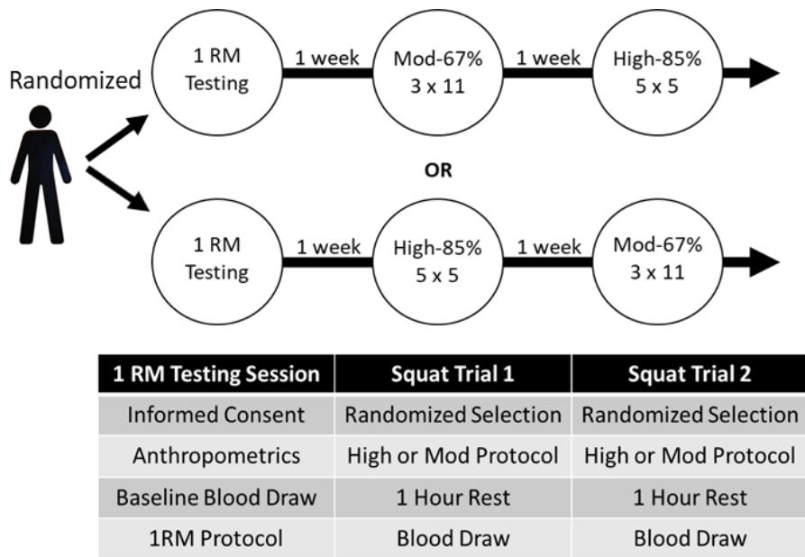
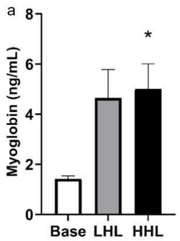
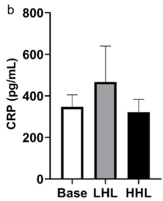
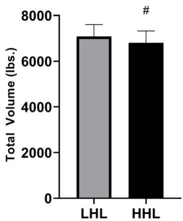

Original Research

# Effects of Varying Load Intensity on Skeletal Muscle Damage Between Two Isovolumic Resistance Exercise Bouts

LEE J. WINCHESTER‡1, CODY E. MORRIS‡2, PATTON ALLEN\*3, TERESA L. WICZYNSKI†3, SCOTT W. ARNETT‡3, and T. SCOTT LYONS‡4

1Department of Kinesiology, University of Alabama, Tuscaloosa, AL, USA; 2Department of Human Studies, University of Alabama-Birmingham, Birmingham, AL, USA; 3School of Kinesiology, Recreation & Sport, Western Kentucky University, Bowling Green, KY, USA; 4Department of Kinesiology, University of North Alabama, Florence, AL, USA

\*Denotes undergraduate student author, †Denotes graduate student author, ‡Denotes professional author

## ABSTRACT

International Journal of Exercise Science 15(4): 1212-1221, 2022. There are limited data comparing the efficacy of resistance loads within the hypertrophy range for promoting muscular growth, particularly when similar training volumes are utilized. The purpose of this study was to determine if two similar volume-loads, utilizing different intensities, would produce dissimilar muscular damage and inflammation. Eleven resistancetrained, college-aged males participated in this study. After testing 1RM barbell squats, participants completed two similar volume-load barbell squat sessions at two different resistance loads (67% and 85% of 1RM) on two separate visits. Venous blood samples were collected at baseline and one hour after completion of each exercise session. Plasma was isolated and analyzed for myoglobin and C-reactive protein (CRP) expression via ELISA. Plasma myoglobin expression was significantly elevated above baseline (BASE) values only after the 85% of 1RM (HHL) session (p =0.031), though the 67% (LHL) trial (p = 0.054; 2 = 0.647) was approaching significance (BASE: 1.42+.12 ng/mL; LHL: 4.65+1.13 ng/mL; HHL: 5.00+1.01 ng/mL). No changes in plasma CRP were observed. Despite attempts to equate volumes between resistances, mean total volume-load was significantly higher during the 67% of 1RM trial than during the 85% trial. Resistance loads at 85% of 1RM inflict significantly increased muscle damage over baseline values, even when significantly less total volume was lifted during the 85% trial. Individuals looking to maximize strength and hypertrophy during general training or during rehabilitation may benefit from these findings when determining the appropriate training load.

KEY WORDS: Resistance training, hypertrophy, muscle damage, inflammation, volumematched

## INTRODUCTION

The inclusion of resistance training as part of a regular exercise routine provides many benefits such as increased strength, muscle mass, bone density, and greater ease performing activities of daily living. These benefits are a primary reason why many health-related organizations such as the American College of Sports Medicine (ACSM), American Heart Association (AHA), and the American Association for Cardiovascular and Pulmonary Rehabilitation (AACVPR) promote resistance training for all adults (11). It is well established that resistance loads between 65 and 85% of 1 repetition maximum (1RM) are ideal for progression of muscular hypertrophy (19). Previous research has compared performing a low number of repetitions (3 to 5) at a high percentage of a 1RM to a high number of repetitions (20 to 28) at a lower percentage of a 1RM, where the total volume lifted between the groups was similar (3). The group that performed low repetitions at a higher percentage of their 1RM tended to have greater increases in their 1RM than other groups, and the greatest increases of muscle fiber cross-sectional area (CSA), but the lowest increase of time to exhaustion and number of repetitions performed at 60% of 1RM (3). Conversely, the group training with a high number of repetitions at a lower percentage of their 1RM tended to have the greatest increase of time to exhaustion, a larger increase of the number of repetitions performed at 60% of 1RM, and decreased joint stress when compared to the higher percentage of 1RM groups. Although the high repetition, low weight training method demonstrated an increased 1RM, CSA does not appear to improve. This finding is supported by the well-established continuum of muscular strength vs endurance adaptations observed with variations of resistance training loads. This continuum states that heavier loads with fewer repetitions tend to elicit greater strength and hypertrophy adaptations, while lighter loads with higher numbers of repetitions promote greater muscular endurance, but provide lesser gains in absolute strength (22).

Muscular hypertrophy elicited by resistance training is induced through three primary mechanisms: mechanical tension, exercise-induced muscular damage, and metabolic stress (19). These mechanisms seem to play a significant role in the stimulation of inflammatory protein cascades that ultimately result in leukocyte chemotaxis, satellite cell mobilization, and enhanced protein synthesis (10). Acute exercise-induced muscular damage, promotes repair and hypertrophy through generation of inflammatory cytokines and subsequent chemotaxis of leukocytes to the site of injury (24). Studies investigating the effects of different resistance exercise loads indicate that maximal strength and muscle protein synthesis, as determined by increased phosphorylation of p70S6K, an inducer of ribosomal protein synthesis, is enhanced at heavy resistance loads, but not with low resistance loads (13). Additionally, greater resistance promotes mechanical signaling of protein synthesis. Using isometric contractions in a rat model, a two-fold increase in hypertrophy was observed with high load contraction when compared to low load contraction (5). Elevated expression of syndecan-4 transmembrane receptor and myogenin mRNA was observed with high load, indicating enhanced mechanical signaling of satellite cell mobilization and hypertrophy.

Myoglobin has emerged as a reliable, indirect maker of exercise induced muscular damage and delayed-onset muscle soreness (15, 17, 18). Plasma myoglobin concentrations are elevated rapidly post-exercise (immediately to 1 hour) due to its direct release through the cell membrane and into the blood stream (12, 15, 17). C-reactive protein (CRP) is a prominent marker of muscular inflammation and is known to be significantly elevated after extensive eccentric resistance exercise (16). Therefore, myoglobin and CRP supply valuable information about the hypertrophying capacity and mechanisms of individual resistance training bouts.

The previously discussed mechanisms support the ACSM’s recommendations that a resistance load of >65% of 1RM should be utilized to promote muscular hypertrophy (1). However, since there is a vast discrepancy in load and mechanisms of hypertrophy within the >65% of 1RM range, it is important to delineate differences in efficacy between these loads for promoting strength and hypertrophy. It is logical that greater resistance load increases mechanical tension and, thus, enhanced mechanotransduction. However, distinguishing whether heavier loads within the hypertrophy inducing range increase exercise-induced muscle damage (EIMD) and inflammatory response is important for optimizing strength training. Therefore, the purpose of this study is to elucidate whether heavier hypertrophying resistance loads elicit greater myoglobin and CRP protein expression when compared to lighter hypertrophying resistance loads.

## METHODS

The aim of this study was to determine the potential of two different hypertrophying loads for inducing mechanisms of muscular hypertrophy. To control for wide sample variability observed with between-subjects comparisons, a repeated measures, crossover design was used for this study. This study design included three sessions, with approximately seven days between sessions. During session one, participants were tested for barbell squat 1RM and were then asked to perform two volume-similar barbell squat exercise sessions over two additional trials, at least seven days apart. Each participant was evaluated for barbell squat 1RM to assess appropriate trial weight and performed the barbell squat experimental trials in a crossover design to ensure the results observed were not due to a training effect. Light hypertrophying load (LHL) and heavy hypertrophying load (HHL) conditions were randomly assigned to each trial, with participants completing both trials in random order. Participant randomization was performed using a numeric randomization function on Microsoft Excel (Microsoft Corporation, Redmond, WA). The measurements that were chosen for this study were centered on physiological responses (plasma myoglobin and CRP) that would indicate or promote muscular hypertrophy.

## Participants

Eleven recreationally resistance trained (three times per week for ≥ 6 months) males (age 20.6 + 0.9 years; height 178.2 + 10.3 cm; weight $8 3 . 3 \pm 1 0 . 9 \mathrm { k g } )$ were recruited to examine the impact of two different, volume-similar, resistance loads during barbell squats on acute physiological responses related to muscular hypertrophy. Participants confirmed that they regularly (≥ 1 time per week) performed barbell squats in their training routine. Sample size estimation was conducted by employing an a priori analysis using G\*Power 3.1.7 (Dusseldorf, Germany) software with a desired power of 0.8 and an effect size of 0.5 based on repeated-measures analysis of variance (RM-ANOVA) for within-subjects factors. An alpha level of 0.05 was chosen to determine statistical significance. All demographic data is represented by sample mean + standard deviation. Outcome variables included biological markers of skeletal muscle damage and inflammation.

Prior to enrollment in the study, participants completed exercise, physical activity readiness questionnaires (PAR-Q), and medical history questionnaires to determine eligibility. Participants categorized as “moderate” or “high” risk classifications in accordance with guidelines set by the ACSM [26] were excluded from this study. Additionally, participants demonstrating any injuries, conditions, or surgeries within the last six months that could negatively impact their performance or the study results were also excluded. This includes, but was not limited to, knee replacement surgery, ligament reconstruction, arthritis, herniated vertebral discs, etc. In this study, none of the recruited participants met the exclusionary criteria and were all eligible to participate. Once participants were cleared for study eligibility, all participants were properly informed about study details and signed the University IRB approved consent form. All aspects of this study were in compliance with the ethical guidelines outlined in the Helsinki Declaration. This research was carried out fully in accordance to the ethical standards of the International Journal of Exercise Science (14).

## Protocol

See Figure 1 for visual representation of protocol. For the first session, participants formally consented, completed a 24-hour dietary history form and PAR-Q, and were evaluated for anthropometric measures. Following anthropometric evaluation, a 10mL baseline (BASE) venous blood draw was taken from the antecubital region of the arm. Next, the participants were evaluated for their barbell squat 1RM, according to guidelines suggested by the National Strength and Conditioning Association (NSCA) (7). Per standard protocol, the heaviest weight completed within 3 to 5 attempts was recorded as the tested 1RM for use in this protocol. Mean relative 1RM for the barbell back squat was $1 . 7 7 \pm 0 . 3 4 \times$ body mass, with an absolute 1RM of $3 2 3 . 6 4 \pm 7 9 . 2 5$ lbs.

In session two, participants were randomly tasked with either LHL or HHL barbell squats, which were similar in volume. Participants completed the remaining condition on the third session, seven days later. Randomization of protocol order was conducted using Microsoft Excel software. The LHL session consisted of 3 sets of 11 repetitions at 67% of tested 1RM, while the HHL session consisted of 5 sets of 5 repetitions at 85% of tested 1RM. Unless the calculated training load for each corresponding percentage was within one pound of the upper five-pound increment, training load was reduced to the nearest five-pound increment. For example, a calculated value of 224 would be rounded to 225, while a value of 223 would be reduced to 220. These protocols were designed to provide a similar amount of mechanical work by calculating volume-load (calculated as follows: $3 \times 1 1 \times 6 7$ and $5 \times 5 \times 8 5 )$ while also adhering to standard resistance training guidelines to achieve a specific training goal (i.e., hypertrophy vs strength, respectively) as suggested by the NSCA (7). Participants were given a rest period of three minutes between each set of barbell squats and all repetitions were monitored to ensure proper form was maintained during the duration of the exercise. Participants were actively monitored during the protocol by trained members of the research team to ensure proper squat form;

inability to maintain proper form resulted in cessation of that set. Two participants were only able to complete four repetitions on the fifth set of the HHL trial. Additionally, one participant was only able to complete nine repetitions for the third set of the LHL trial. The remaining participants were all able to complete their full number of repetitions. Upon completion of the protocol, participants remained seated in the laboratory for one hour so a one-hour post exercise venipuncture could be performed. For all three sessions of this study, participants were instructed to abstain from alcohol consumption for 24 hours prior to testing and to refrain from significant caffeine intake within six hours of testing. Significant caffeine intake was defined as > 100mg of caffeine, such as a cup of coffee. This was verified based on responses from the 24- hour dietary history form. Participants were also requested to maintain their typical dietary habits and exercise routines for the duration of the study.

Plasma Protein Analysis: Venipuncture was performed using a standard butterfly collection set and 10mL EDTA coated vacutainers (Beckton Dickinson; Franklin Lakes, NJ). Whole blood samples were centrifuged at room temperature at 2,000 x g for 15 minutes to separate plasma. Isolated plasma was aspirated and aliquoted into 1.5mL tubes and immediately stored at -80°C until needed for ELISA analysis. Once all eleven participants completed the study, plasma samples were thawed at room temperature and analyzed via enzyme linked immunosorbent assay for potential differences in plasma myoglobin (Abcam; Cambridge, MA; ab171580) and CRP (Cayman Chemicals; Ann Arbor, MI; #10011236). ELISAs were performed and analyzed according to manufacturer’s instructions. Assays were analyzed using a colorimetric microplate reader to obtain absorbance values (BioTek Instruments; Winooski, VT).

<table><tr><td rowspan=1 colspan=1>1 RM Testing Session</td><td rowspan=1 colspan=1>Squat Trial 1</td><td rowspan=1 colspan=1>Squat Trial 2</td></tr><tr><td rowspan=1 colspan=1>Informed Consent</td><td rowspan=1 colspan=1>Randomized Selection</td><td rowspan=1 colspan=1>Randomized Selection</td></tr><tr><td rowspan=1 colspan=1>Anthropometrics</td><td rowspan=1 colspan=1>High or Mod Protocol</td><td rowspan=1 colspan=1>High or Mod Protocol</td></tr><tr><td rowspan=1 colspan=1>Baseline Blood Draw</td><td rowspan=1 colspan=1>1 Hour Rest</td><td rowspan=1 colspan=1>1 Hour Rest</td></tr><tr><td rowspan=1 colspan=1>1RM Protocol</td><td rowspan=1 colspan=1>Blood Draw</td><td rowspan=1 colspan=1>Blood Draw</td></tr></table>

Figure 1. Outline of Study Protocol and Events

## Statistical Analysis

A one-way repeated measures-ANOVA was performed to determine if differences in myoglobin and CRP plasma protein expression existed across the three time points. Bonferroni correction was utilized to determine which time points were significantly different. A dependent t-test was utilized to determine if there was a significant difference in mean total volume-load between the two trials. An alpha level of .05 was used to determine statistical significance for all statistical measures.

## RESULTS

Plasma Myoglobin and CRP: For this study, the main outcome variables were assessment of plasma myoglobin and CRP across the three time points as indicators of exercise induced muscular damage and inflammation, respectively (Figure 2). A one-way repeated measures-ANOVA demonstrated that a significant change between groups was observed $( \mathtt { p } = 0 . 0 1 5 ; \mathtt { \eta } \mathtt { \eta } ^ { 2 } =$ 0.647). Plasma myoglobin protein expression was significantly increased from baseline values after the HHL trial $( p = . 0 3 1 )$ , but was not significantly increased after the LHL trial, though it was approaching significance $( p = . 0 5 4 ; \ : \eta ^ { 2 } = 0 . 6 4 7 )$ (BASE: 1.42+.12 ng/mL; LHL: 4.65+1.13 ng/mL; HHL: 5.00+1.01 ng/mL; $F = 7 . 3 4 0 )$ . However, there was no significant difference between LHL and HHL for myoglobin $( p > 0 . 9 9 5 )$ . For CRP, no significant differences $( { \mathrm { p } } = 0 . 7 4 )$ $\eta ^ { 2 } = 0 . 0 7 3 )$ were detected between time points (BASE: 346.93+58.67 pg/mL; LHL: $4 6 6 . 6 0 { \scriptstyle \pm 1 7 3 . 0 5 }$ $\mathrm { p g / m L } ; \mathrm { H H L } ; 3 2 0 . 9 0 { \pm } 6 2 . 6 6 \mathrm { p g / m L } ; F = 0 . 3 1 3 )$

  
Figure 2. Plasma Myoglobin and CRP. a. Plasma myoglobin protein expression for baseline, LHL, and HHL. b. Plasma CRP protein expression for Base, LHL, and HHL. \* indicates significant difference from Base $( \mathrm { p } { < } 0 . 0 5 )$ . Bar graph data represents mean value $\pm \operatorname { S E M }$

Performance: Although the protocol was designed to be volume similar based on standardized training guidelines, there was a significant difference $( p \leq . 0 0 1 ; t = - 1 5 . 1 5 0 ;$ Cohen’s ${ \mathrm { d } } = 0 . 1 6 5 )$ in mean total volume-load between the two trials (Figure 3). Using the training load calculated from the aforementioned protocol, participants lifted a mean of $7 , 0 8 4 . 1 { \scriptstyle \pm 5 1 5 . 2 1 }$ pounds in total during the LHL trial, and $6 , 8 0 7 . 7 { \scriptstyle \pm 5 1 5 . 6 0 }$ pounds during the HHL trial.

  
Figure 3. Total Weight Lifted. Mean total weight lifted for LHL and HHL.  
# indicates significant difference from other trial (p< 0.05). Bar graph data represents mean value + SEM.

## DISCUSSION

The primary purpose of this study was to determine if heavier loads within the traditional hypertrophying range (>65% of 1RM) inflict greater muscular damage and inflammation than lighter hypertrophying loads when performed with similar volumes. Although our study was designed to be volume similar, we observed statistically significant differences in average total volume-load between trials, with LHL (67% of 1RM) being higher than HHL (85% of 1RM).

We found no significant differences for CRP between trials or from the baseline measurement. This is in contrast to other research that demonstrated an increase in CRP after resistance exercise (2). However, the protocol from that study was a circuit training protocol that engaged many muscle groups with very brief rest periods between sets. This is in agreement with other protocols which show high-intensity or prolonged physical activity results in acute increases in CRP (9). CRP is known to be stimulated by interleukin-6 (9), which increases in abundance with greater volume of repeated muscular contraction (21). Therefore, the single exercise associated with our study was likely not of sufficient volume to stimulate this mechanism.

It was also found that HHL (85% of 1RM) caused a significant elevation in plasma myoglobin, a biomarker of muscular damage, when compared to baseline. When comparing the calculated myoglobin concentrations, HHL and LHL increased plasma myoglobin levels approximately 3.52-fold and 3.28-fold above baseline values, respectively. This indicates that although LHL did not cause a statistically significant increase from baseline, it may be practically significant with respect to signaling mechanisms induced by EIMD and how this affects training adaptations. However, HHL was able to cause a significant increase in plasma myoglobin and do so with less total volume than LHL, indicating that HHL is likely more efficient at causing EIMD for induction of muscular protein synthesis. It is important to note that these findings were in resistance-trained participants, who were likely to experience an attenuation of EIMD within three weeks of regular resistance training (4). Since our participants had been engaged in regular lower-body resistance training for at least 6 months prior to the study, any increase in muscle damage would likely be quite impactful for upregulating muscle fiber protein synthesis.

Fink et al. demonstrates that eight weeks of low load (20 RM) resistance training, but not high load (8 RM), caused a significant increase in hypertrophy in well-trained athletes (6). However, this increase in hypertrophy was not associated with any increase in maximal strength. Moreover, the high load group did experience gains in strength, despite the lack of hypertrophy. The findings by Fink et al. are likely explained by an increase in sarcoplasmic hypertrophy rather than myofibrillar hypertrophy. Haun et al. demonstrated that six weeks of high-volume resistance training results in sarcoplasmic hypertrophy only, with an observed decrease in actin and myosin protein (8). Thus, it appears that strength gain and, ultimately, myofibrillar hypertrophy, may be more dependent on higher resistance loads (20, 23). The findings from our study are important for understanding the mechanisms through which heavy resistance loads enhance strength and functional muscle hypertrophy.

Limitations: As with any research study, there are several limitations to the design of this study. First, although the study was designed as a practical, isovolumic barbell squat protocol based on National Strength and Conditioning Association guidelines, there was still a significant difference in total load lifted between trials. Second, the sample size for this study was small, given the wide variation that is observed with resistance training research between participants. However, a repeated measures design was implemented to limit the effects of inter-participant variability on the data. Additionally, this was an acute study investigating the effects of two different resistance loads on biological markers of muscle damage and inflammation, so results are just inferring what could potentially happen in a longitudinal training setting. Future research will focus on a comparison of these loads in a longitudinal design.

Conclusions: The primary findings from this study indicate that, when similar volumes are used, resistance loads at 85% 1RM significantly increase an indirect marker of muscular damage above baseline values. Although the 67% 1RM trial did not cause a statistically significant increase above baseline values, it induced a 3.28-fold increase in plasma myoglobin, which is likely practically significant for inducing muscular adaptation. Despite the volume-similar protocol design, participants lifted a greater total volume during the 67% 1RM protocol, indicating that the 85% trial caused a significant change with less total volume. Though inconclusive, our results suggest that even within the hypertrophying load range (>65% 1RM), choice of load during resistance exercise could markedly impact observed training adaptations. Further research is needed to determine which resistance loads, within the hypertrophying range, can optimize muscle strength and hypertrophy. This information can be utilized by individuals such as strength coaches and physical therapists to ensure appropriate training load for their clients.

## REFERENCES

1. American college of sports medicine position stand. Progression models in resistance training for healthy adults. Med Sci Sports Exerc 41(3):687-708, 2009.

2. Bizheh N, Jaafari M. The effect of a single bout circuit resistance exercise on homocysteine, hs-crp and fibrinogen in sedentary middle aged men. Iran J Basic Med Sci 14(6):568, 2011.

3. Campos GE, Luecke TJ, Wendeln HK, Toma K, Hagerman FC, Murray TF, Ragg KE, Ratamess NA, Kraemer WJ, Staron RS. Muscular adaptations in response to three different resistance-training regimens: Specificity of repetition maximum training zones. Eur J Appl Physiol 88(1):50-60, 2002.

4. Damas F, Phillips SM, Libardi CA, Vechin FC, Lixandrão ME, Jannig PR, Costa LA, Bacurau AV, Snijders T, Parise G. Resistance training‐induced changes in integrated myofibrillar protein synthesis are related to hypertrophy only after attenuation of muscle damage. J Physiol 594(18):5209-5222, 2016.

5. Eftestøl E, Egner IM, Lunde IG, Ellefsen S, Andersen T, Sjåland C, Gundersen K, Bruusgaard JC. Increased hypertrophic response with increased mechanical load in skeletal muscles receiving identical activity patterns. Am J Physiol Cell Physiol 311(4):C616-C629, 2016.

6. Fink J, Kikuchi N, Nakazato K. Effects of rest intervals and training loads on metabolic stress and muscle hypertrophy. Clin Physiol Funct Imaging 38(2):261-268, 2018.

7. Haff GG, Triplett NT. Essentials of strength training and conditioning 4th edition. Human kinetics; 2015.

8. Haun CT, Vann CG, Osburn SC, Mumford PW, Roberson PA, Romero MA, Fox CD, Johnson CA, Parry HA, Kavazis AN. Muscle fiber hypertrophy in response to 6 weeks of high-volume resistance training in trained young men is largely attributed to sarcoplasmic hypertrophy. PLoS One 14(6):e0215267, 2019.

9. Kasapis C, Thompson PD. The effects of physical activity on serum c-reactive protein and inflammatory markers: A systematic review. J Am Coll Cardiol 45(10):1563-1569, 2005.

10. Konopka AR, Harber MP. Skeletal muscle hypertrophy after aerobic exercise training. Exerc Sport Sci Rev 42(2):53, 2014.

11. Kraemer WJ, Ratamess NA, French DN. Resistance training for health and performance. Curr Sports Med Rep 1(3):165-171, 2002.

12. Mair J. Tissue release of cardiac markers: from physiology to clinical applications. Chem Lab Med 37 (11-12): 1077-1084, 1999.

13. Mitchell CJ, Churchward-Venne TA, West DW, Burd NA, Breen L, Baker SK, Phillips SM. Resistance exercise load does not determine training-mediated hypertrophic gains in young men. J Appl Physiol 113(1):71-77, 2012.

14. Navalta JW, Stone WJ, Lyons TS. Ethical issues relating to scientific discovery in exercise science. Int J Exerc Sci 12(1):1, 2019.

15. Nybo L, Girard O, Mohr M, Knez W, Voss S, Racinais S. Markers of muscle damage and performance recovery after exercise in the heat. Med Sci Sports Exerc 45(5):860-868, 2013.

16. Phillips T, Childs AC, Dreon DM, Phinney S, Leeuwenburgh C. A dietary supplement attenuates il-6 and crp after eccentric exercise in untrained males. Med Sci Sports Exerc 35(12):2032-2037, 2003.

17. Rodenburg J, Bar P, De Boer R. Relations between muscle soreness and biochemical and functional outcomes of eccentric exercise. J Appl Physiol 74(6):2976-2983, 1993.

18. Sayers SP, Clarkson PM. Short-term immobilization after eccentric exercise. Part ii: Creatine kinase and myoglobin. Med Sci Sports Exerc 35(5):762-768, 2003.

19. Schoenfeld BJ. The mechanisms of muscle hypertrophy and their application to resistance training. J Strength Cond Res 24(10):2857-2872, 2010.

20. Staron R, Malicky E, Leonardi M, Falkel J, Hagerman F, Dudley G. Muscle hypertrophy and fast fiber type conversions in heavy resistance-trained women. Eur J Appl Physiol Occup Physiol 60(1):71-79, 1990.

21. Steensberg A, van Hall G, Osada T, Sacchetti M, Saltin B, Pedersen BK. Production of interleukin‐6 in contracting human skeletal muscles can account for the exercise‐induced increase in plasma interleukin‐6. J Physiol (529):237-242, 2000.

22. Stone WJ, Coulter SP. Strength/endurance effects from three resistance training protocols with women. J Strength Cond Res 8(4):231-234, 1994.

23. Taber CB, Vigotsky A, Nuckols G, Haun CT. Exercise-induced myofibrillar hypertrophy is a contributory cause of gains in muscle strength. Sports Med 49(7):993-997, 2019.

24. Tidball JG, Villalta SA. Regulatory interactions between muscle and the immune system during muscle regeneration. Am J Physiol Regul Integr Comp Physiol 298(5):R1173-R1187, 2010.